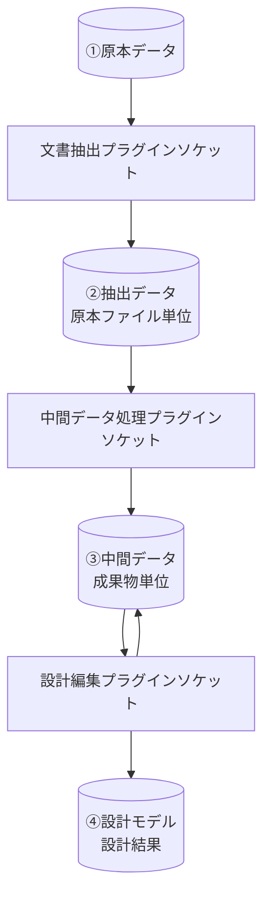
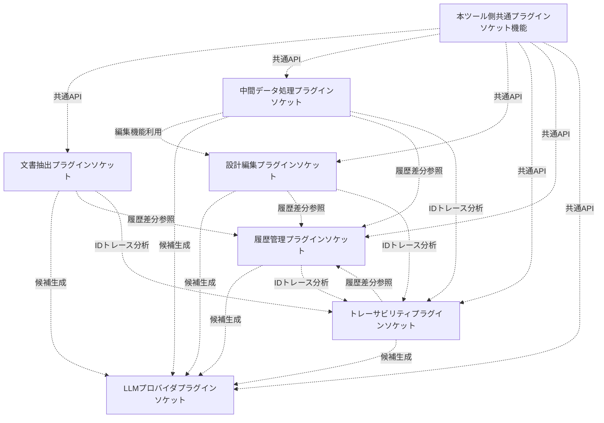
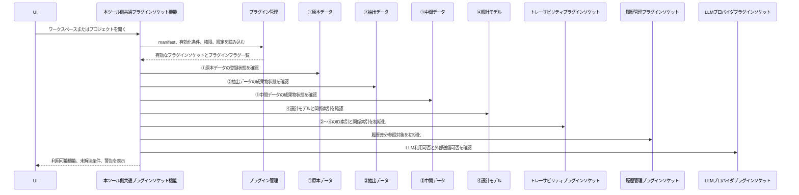
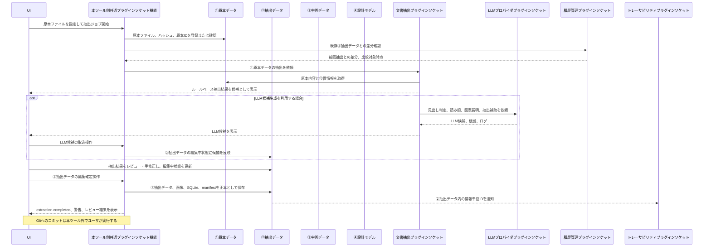
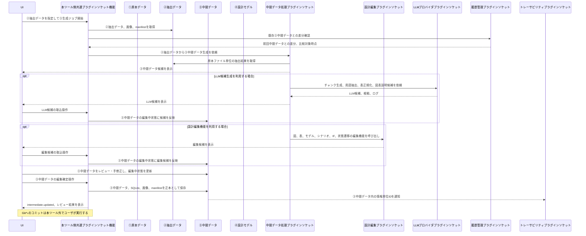
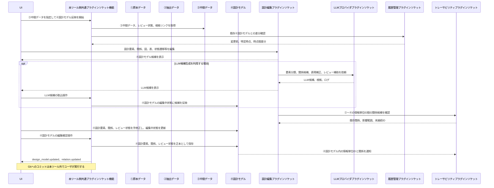
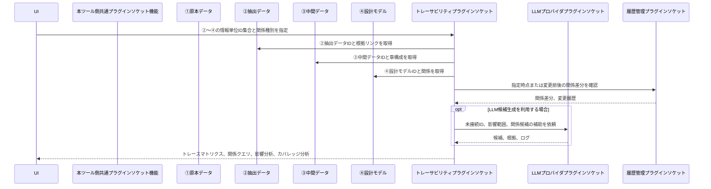
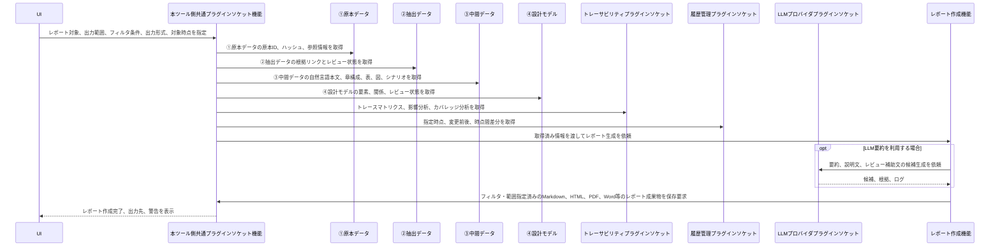

# プラグイン詳細設計書

## 1. 位置づけ

本ドキュメントは、D2D のプラグインソケット種類と、プラグインソケット種類間のデータ流れと呼び出し関係を定義する。

`srs_main.md` の以下に対応する詳細設計である。

- `5.1 プラグイン管理`
- `5.3 ジョブ管理`
- `5.4 イベントバス`
- `19. プラグイン構成要求`

本ツール側は、プラグインプラグを接続するためのプラグインソケットと共通サービスを提供する。プラグインプラグは、対応するプラグインソケット種類の契約を満たす追加機能として実装する。個別プラグインの機能詳細は、プラグインソケット種類ごとの `XXXX_plugin_design.md` 形式の設計書に分離する。

---

## 2. 本ツール側の共通プラグインソケット機能

本ツール側の共通プラグインソケット機能は、プラグインプラグを動かすためのホスト機能に絞る。設定、権限、外部送信可否、manifest検証はプラグイン管理に含め、個別の共通機能として細分化しない。

| 共通機能 | 役割 | プラグインプラグへの提供内容 |
| --- | --- | --- |
| プラグイン管理 | プラグインソケット登録、プラグインプラグ読込、有効化、無効化、設定、権限、外部送信可否、manifest検証を扱う | プラグインソケット契約の検証、有効化条件制御、権限チェック、設定参照、未解決有効化条件検出 |
| ジョブ管理 | 長時間処理、再実行、進捗、失敗状態を扱う | ジョブ起動、進捗通知、再実行条件、ジョブログ保存 |
| 成果物管理 | ①原本、②抽出データ、③中間データ、manifest、ZIPアーカイブ、差分比較用インポートを扱う | 安全な成果物読込・保存、manifest更新、アーカイブ生成、成果物ID解決 |
| 設計情報管理 | ④設計モデル、関係、レビュー状態、DB to Text対象を扱う | 設計要素・関係の読込・更新、整合性検証、text dump出力対象の管理 |
| イベント通知 | プラグインソケット間の疎結合な通知を扱う | 取込完了、成果物更新、設計モデル更新、関係更新等のイベント購読・発行 |

---

## 3. プラグインソケット種類間のデータ流れと呼び出し関係

本章では、成果物が生成・更新されるデータの流れと、処理中に利用されるプラグインソケット間の呼び出し関係を分けて定義する。

データの流れは、①原本データ、②抽出データ、③中間データ、④設計モデルがどの順序で生成・更新されるかを示す。呼び出し関係は、あるプラグインソケットが処理を進める際に、別のプラグインソケットの機能を利用できる関係を示す。

### 3.1 データの流れ



| データ流れ | ルール |
| --- | --- |
| ①原本データから②抽出データ | 文書抽出プラグインソケットが、原本ファイル単位で②抽出データを生成する |
| ②抽出データから③中間データ | 中間データ処理プラグインソケットが、②抽出データを入力として、成果物単位に統合・整理した③中間データを生成する |
| ③中間データの編集 | 設計編集プラグインソケットが、③中間データ上の図、表、モデル、シナリオ、IF、状態遷移等を編集する |
| ③中間データから④設計モデル | 設計編集プラグインソケットまたは中間データ処理プラグインソケットが、③中間データの設計内容を④設計モデルへ反映する |
| ②〜④のID付与 | ②抽出データ、③中間データ、④設計モデルの情報単位にはIDを付与し、履歴差分確認とトレース分析の対象にする |

### 3.2 ソケット間の呼び出し関係



| 呼び出し関係 | ルール |
| --- | --- |
| 中間データ処理から設計編集 | 中間データ処理プラグインソケットは、③中間データを生成・整理する過程で、必要に応じて設計編集プラグインソケットの編集機能を呼び出せる。たとえば、設計書の対象箇所が状態遷移であれば、設計編集プラグインソケットに含まれる状態遷移編集機能を利用する |
| LLMプロバイダの横断利用 | LLMプロバイダプラグインソケットは、文書抽出、中間データ処理、設計編集、トレーサビリティ、履歴管理から共通的に呼び出せる。LLM出力は候補として扱い、②/③/④の正本を直接更新しない |
| 履歴管理の横断利用 | 履歴管理プラグインソケットは、②抽出データ、③中間データ、④設計モデル、SQLite DBについて、変更前、特定時点、時点間差分をいつでも参照できる共通機能として扱う |
| トレーサビリティの横断利用 | トレーサビリティプラグインソケットは、②抽出データ、③中間データ、④設計モデルのすべての情報単位IDを対象に、関係管理、トレース分析、影響分析をいつでも実行できる共通機能として扱う |

### 3.3 禁止事項

| 禁止事項 | 理由 |
| --- | --- |
| 文書抽出プラグインソケットが③中間データまたは④設計モデルを直接更新すること | ②抽出データ、③中間データ、④設計モデルの責務を分離するため |
| 中間データ処理プラグインソケットが文書抽出プラグインソケットの実装に依存すること | ②抽出データの成果物契約だけで処理できるようにするため |
| LLMプロバイダプラグインソケットが②/③/④の正本を直接更新すること | LLM出力は候補であり、人間レビュー前に確定させないため |
| トレーサビリティプラグインソケットが②抽出データ、③中間データ、④設計モデルの正本を直接編集すること | トレースはID間の関係管理と分析を行う共通機能であり、各データ階層の編集責務ではないため |
| 履歴管理プラグインソケットが成果物フォルダまたはSQLite DBの正本を直接上書きすること | 履歴管理は差分確認のための参照・分析機能であり、正本成果物の更新責務を持たないため |

---

## 4. プラグインソケット種類ごとの責務と入出力

| プラグインソケット種類 | 主責務 | 主な入力 | 利用する共通機能 | 主な出力 | 詳細設計書 |
| --- | --- | --- | --- | --- | --- |
| 文書抽出プラグインソケット | ①原本データから、原本ファイル単位の②抽出データを生成する | ①原本データ | プラグイン管理、ジョブ管理、成果物管理、イベント通知 | `artifacts/extracted/{source_file_id}/` | `document_extractor_plugin_design.md` |
| 中間データ処理プラグインソケット | ②抽出データを成果物単位に統合し、③中間データを生成する。必要に応じて設計編集プラグインソケットの編集機能を呼び出す | ②抽出データ、既存③中間データ | プラグイン管理、ジョブ管理、成果物管理、イベント通知、設計編集プラグインソケット、必要に応じてLLMプロバイダプラグインソケット、履歴管理プラグインソケット、トレーサビリティプラグインソケット | `artifacts/intermediate/{design_artifact_id}/` | `intermediate_processor_plugin_design.md` |
| LLMプロバイダプラグインソケット | 候補生成、要約、分類、関係候補生成のプロバイダをプラグインプラグで差し替え可能にする | source-groundedな入力チャンク、プロンプト、設定 | プラグイン管理、ジョブ管理、イベント通知 | 候補情報、実行ログ、根拠リンク | `llm_provider_plugin_design.md` |
| 設計編集プラグインソケット | ③中間データまたは④設計モデルを対象に、設計内容の編集、検索、レビュー補助、モデル表現編集を行う | ③中間データ、④設計モデル、用語、レビュー状態 | プラグイン管理、成果物管理、設計情報管理、イベント通知、必要に応じてLLMプロバイダプラグインソケット、履歴管理プラグインソケット、トレーサビリティプラグインソケット | 更新済み③中間データ、④設計要素、関係、レビュー状態、PlantUML/Mermaid/SysMLv2等のモデル表現 | `design_editor_plugin_design.md` |
| トレーサビリティプラグインソケット | ②抽出データ、③中間データ、④設計モデルの情報単位IDに対して、関係管理、検索、影響分析、カバレッジ分析を行う | ②抽出データID、③中間データID、④設計モデルID、関係データ | プラグイン管理、成果物管理、設計情報管理、イベント通知、必要に応じてLLMプロバイダプラグインソケット、履歴管理プラグインソケット | トレースマトリクス、関係クエリ結果、影響分析結果、カバレッジ分析結果 | `trace_plugin_design.md` |
| 履歴管理プラグインソケット | SQLite DBの内容比較、SQLite DB履歴差分確認、②/③/④設計結果の履歴差分確認を、他ソケットから随時参照できる共通機能として扱う | ②抽出データ、③中間データ、④設計モデル、SQLite DB、Git履歴、ZIPアーカイブ参照 | プラグイン管理、成果物管理、設計情報管理、イベント通知、必要に応じてトレーサビリティプラグインソケット | DB差分結果、成果物差分結果、履歴差分ビュー | `history_management_plugin_design.md` |

---

## 5. 構成パターン

### 5.1 設計編集構成

④設計モデルを扱う場合は、以下のプラグインソケットを組み合わせる。

```text
設計編集プラグインソケット
履歴管理プラグインソケット（DB差分確認用途）
```

### 5.2 トレーサビリティ構成

トレースマトリクス、関係探索、影響分析を扱う場合は、以下のプラグインソケットを組み合わせる。

```text
トレーサビリティプラグインソケット
履歴管理プラグインソケット（設計結果の履歴差分確認用途）
```

### 5.3 LLM支援構成

LLM支援は任意構成とし、外部送信可否設定に従う。

```text
LLMプロバイダプラグインソケット
```

LLM支援構成を無効化しても、取込、抽出、レビュー、設計編集、トレース編集はローカル処理で継続できること。

---

## 6. 代表的な処理フロー

本章のシーケンス図では、処理主体となるUI、ホスト機能、プラグインソケットに加えて、データライフラインとして①原本データ、②抽出データ、③中間データ、④設計モデルを明示する。

### 6.1 ツール起動時



### 6.2 原本から②抽出データ作業



### 6.3 ②抽出データから③中間データ



### 6.4 ③中間データから④設計モデル


### 6.5 トレース分析



### 6.6 レポート作成



---

## 7. イベント連携

| イベント | 発行元 | 主な購読先 | 用途 |
| --- | --- | --- | --- |
| `source.imported` | 文書抽出プラグインソケット | 本ツール側共通プラグインソケット機能、UI | 原本取込完了通知 |
| `extraction.completed` | 文書抽出プラグインソケット | 本ツール側共通プラグインソケット機能、UI、トレーサビリティプラグインソケット、履歴管理プラグインソケット | ②抽出データ生成通知 |
| `artifact.updated` | 本ツール側共通プラグインソケット機能 | UI、中間データ処理プラグインソケット、トレーサビリティプラグインソケット、履歴管理プラグインソケット | 成果物フォルダ更新通知、履歴差分確認対象の更新通知 |
| `intermediate.updated` | 中間データ処理プラグインソケット | 本ツール側共通プラグインソケット機能、UI、トレーサビリティプラグインソケット、履歴管理プラグインソケット | ③中間データ更新通知 |
| `design_model.updated` | 設計編集プラグインソケット | トレーサビリティプラグインソケット、履歴管理プラグインソケット | ④設計モデル更新通知 |
| `relation.updated` | 設計編集プラグインソケット、トレーサビリティプラグインソケット | UI、履歴管理プラグインソケット | ②〜④の情報単位ID間の関係更新通知 |
| `llm.candidate.generated` | LLMプロバイダプラグインソケット | UI、候補生成元のプラグインソケット | LLM候補生成通知 |
| `archive.imported` | 履歴管理プラグインソケット | UI、本ツール側共通プラグインソケット機能 | ZIPアーカイブの履歴差分比較用インポート通知 |

---

## 8. 無効化時の扱い

| 無効化対象 | 影響 | 必要な制御 |
| --- | --- | --- |
| 文書抽出プラグインソケット | ①原本から②抽出データを生成できない | 対応する取込UIとCLIを非表示または実行不可にする |
| 中間データ処理プラグインソケット | ②抽出データから③中間データを生成できない | 設計モデル候補生成、③レビュー画面を実行不可にする |
| LLMプロバイダプラグインソケット | LLM候補生成不可 | ルールベース処理と人間レビューは継続する |
| 設計編集プラグインソケット | ③中間データまたは④設計モデルの編集、モデル表現編集が不可 | モデル表現編集、設計モデル更新を無効化する。トレース分析は既存IDと関係に対して継続できる |
| トレーサビリティプラグインソケット | ②〜④の情報単位IDに対する関係表示、関係クエリ、影響分析不可 | トレースマトリクス、影響分析、カバレッジ分析を無効化する |
| 履歴管理プラグインソケット | SQLite DB内容比較、SQLite DB履歴差分確認、②/③/④設計結果の履歴差分確認が不可 | 成果物保存は継続し、履歴差分ビューのみ無効化する |

---

## 9. 拡張時のルール

| ID | ルール |
| --- | --- |
| PLG-020 | 新しいプラグインプラグは、対応するプラグインソケット種類、入力、出力、発行イベント、購読イベントを設計書に定義すること |
| PLG-021 | プラグインプラグは、本ツール側共通プラグインソケット機能を経由して成果物、設計モデル、設定、ログにアクセスすること |
| PLG-022 | 設計モデルまたはトレースを更新するプラグインプラグは、更新対象、レビュー状態、根拠リンク、履歴保存の扱いを定義すること |
| PLG-023 | LLMを利用するプラグインプラグは、LLM出力が候補であり正本を直接更新しないことを明示すること |
| PLG-024 | 新しい関係種別を追加する場合は、既存5種で表現できない理由、UI表示、検索・分析での利用目的、レビュー手順を定義すること |
| PLG-025 | プラグインソケット種類間の新しい直接連携を追加する場合は、成果物または設計情報を介した疎結合で表現できない理由を設計書に明記すること |
