# D2D データ構造詳細設計書

## 1. 設計方針の要約

本設計では、D2D の設計支援データを単一の SQLite DB `project.db` に保存する。情報種別ごとに DB ファイルを分けず、テーブルを分ける。

主要エンティティはすべて `uid` を持つ。`uid` は内部の不変IDであり、初期設計では UUIDv7 形式の `TEXT` とする。RAGは初期導入しない。人間が読む表示用IDは `code` として管理し、`TEXT-000001`、`FIG-000001`、`RTBL-000001`、`MODEL-000001` のような形式を使う。

すべての設計リソースは共通台帳 `entity_registry` に登録する。label、text、list、figure、table、formula、code、model、scenario、interface、state_transition、data_structure、reference、metadata などのリソース詳細テーブルは `uid` を `entity_registry.uid` と共有し、`uid` を Primary Key かつ Foreign Key とする。これにより、全体検索、トレーサビリティ、DB to Text 出力で共通の参照方法を使える。

設計要素の分類（SRS 9.1 の13分類: SRC / STD / REQ / CST / FUNC / STRUCT / BEH / STATE / IF / DATA / VERIF / MGMT / IMPL）は、`entity_registry.design_category` に保持する。`entity_type` は格納先の物理テーブル名を表し、`design_category` は設計上の意味分類を表す。同じ `resource_text` でも、REQ（要求）と FUNC（機能）は `design_category` で区別する。

大容量ファイル、画像、Office/PDF 抽出物、LLM プロンプトログ、結果ログは DB 外の blob 領域に置き、DB には参照パス、ハッシュ、MIME 種別、サイズ等の参照情報だけを持たせる。

変更履歴は Git 管理を前提とし、DB 内に履歴テーブルは原則作らない。ただし、現在状態を管理するための `created_at`、`updated_at`、`created_by`、`updated_by`、`batch_operation_uid`、`source_hash` は必要なテーブルに持たせる。

詳細テーブルには `project_id` を持たせない。プロジェクト所属は `entity_registry.project_uid` で一元管理する。詳細テーブルに重複して持たせると、台帳と詳細テーブルの不整合を生むためである。

本データ構造は、設計モデル化の工程における「文書層」「記述資源層」「設計意味層」「設計関係層」を、以下のように `project.db` と `blobs/` に対応させる。

| 設計知識層 | 保存上の主な表現 | 管理方針 |
| --- | --- | --- |
| 文書層 | `source_document`、`source_location`、`extracted_document.structure_json`、`blob_resource` | 原本構造、位置、順序、階層、出典を保持し、設計意味は確定しない |
| 記述資源層 | `extracted_item`、`intermediate_item`、`resource_text`、`resource_list`、`resource_table`、`resource_figure`、`resource_formula`、`resource_code`、`resource_model` 等 | ②抽出データから③中間データを生成する過程で、設計記述要素の抽出と記述型への分類結果を管理し、1つの記述資源が複数の意味候補へ昇格し得ることを許容する |
| 設計意味層 | `resource_scenario`、`resource_interface`、`resource_state_transition`、`resource_data_structure`、`resource_glossary`、`resource_metadata`、その他 `resource_*` | ③中間データから④設計モデルを生成する過程で、設計意味候補への昇格、同一対象の統合・正規化結果を `entity_registry.status` とレビュー情報で管理する |
| 設計関係層 | `trace_link`、`relation_rule_master`、`llm_run_ref`、`entity_registry.review_info_json` | ③中間データから④設計モデルを生成する過程で付与した根拠関係、設計意味関係、実装・検証関係を、ノード統合・正規化とは独立して管理する。relation_type は11種類に限定し、差分は属性で表現する。検査は双方向トレーサビリティ分析により実現する |

## 2. 全体DB構成案

### 2.1 DBファイル構成

```text
project-root/
├ project.db
├ blobs/
│  ├ originals/
│  ├ extracted/
│  ├ figures/
│  ├ tables/
│  ├ llm/
│  └ exports/
└ exports/
   ├ db_to_text/
   ├ sqlite_dump/
   └ manifest/
```

| 項目 | 方針 | 理由 |
| --- | --- | --- |
| DBファイル | `project.db` 1ファイル | SQLite 運用を単純にし、情報種別間の参照を同一DB内FKで管理する |
| blob領域 | `blobs/` 配下に分類して保存 | SQLite に大容量バイナリを入れると差分確認、バックアップ、UI応答が重くなるため |
| export領域 | `exports/` 配下にテキスト化出力を保存 | Git差分でレビューできるようにするため |
| manifest | ZIP生成時またはexport時に派生生成 | DB正本と二重管理しないため |

### 2.2 blobディレクトリ構成

| ディレクトリ | 内容 | DB側の参照元 |
| --- | --- | --- |
| `blobs/originals/` | 取り込んだ原本ファイル | `source_document.blob_uid` |
| `blobs/extracted/` | 抽出処理単位の中間物、レビュー補助ファイル、OCR中間物、ページ画像、抽出器の生出力 | `blob_resource` |
| `blobs/figures/` | 図リソースとして独立参照される画像、図、レンダリング結果 | `blob_resource`、`resource_figure` |
| `blobs/tables/` | CSV、JSON化した表データ | `resource_table.cells_json` または `blob_resource` |
| `blobs/llm/` | prompt、completion、評価ログ | `llm_run_ref.prompt_blob_uid`、`llm_run_ref.result_blob_uid` |
| `blobs/exports/` | DB to Text、dump、検索用派生成果物 | export処理の生成物 |

`blobs/extracted/` は抽出ジョブの作業結果を保持する領域であり、原本ファイル単位・抽出実行単位に紐づく。たとえばPDFページ画像、Wordプレビュー補助HTML、抽出器の生JSON、OCR前後の中間物など、レビューや再処理のためには有用だが図リソースそのものではないファイルを置く。

`blobs/figures/` は、文書中の図、画像、画面図、構成図のように `resource_figure` から独立参照され、③中間データや④設計モデルの根拠として再利用されるファイルを置く。同じ画像ファイルが抽出ジョブの生出力として `blobs/extracted/` に一時的に存在する場合でも、レビュー採用後に図リソースとして扱うものは `blobs/figures/` へ正規配置し、`blob_resource` の参照先をその正規配置にする。

### 2.3 主要テーブル一覧

| 分類 | テーブル | 役割 |
| --- | --- | --- |
| プロジェクト | `project` | DB全体のプロジェクト単位を管理する |
| プロジェクト設定 | `project_artifact_setting` | プロジェクト設定画面で管理する成果物名と成果物種別を保持する |
| プロジェクト設定 | `project_artifact_relation` | 成果物設定同士の親子関係を文書体系として保持する |
| プロジェクト設定 | `project_dev_phase_setting` | プロジェクト設定画面で管理する開発フェーズを保持する |
| 共通台帳 | `entity_registry` | 全主要エンティティの `uid`、表示コード、種別、状態、レビュー情報、メモ情報、共通メタ情報を管理する |
| 取込管理 | `batch_operation_info` | 原本取込や再抽出の実行単位を管理する |
| 原本 | `source_document` | 原本ファイルのメタ情報と blob 参照を管理する |
| 原本位置 | `source_location` | ページ、章節、セル範囲、座標等の根拠位置を管理する |
| blob参照 | `blob_resource` | DB外ファイルの参照、ハッシュ、MIME、サイズを管理する |
| 抽出データ | `extracted_document` | 原本から機械的に抽出できた文書全体の構成情報をJSONで保持する |
| 抽出データ | `extracted_item` | `extracted_document.structure_json` 内の個別要素を参照し、対応する設計リソースへ接続する |
| 中間データ | `intermediate_document` | 抽出結果を正規化・補正した中間文書全体の構成情報をJSONで保持する。成果物種別、開発フェーズを保持する。 |
| 中間データ | `intermediate_item` | `intermediate_document.structure_json` 内の個別中間要素を参照し、対応する設計リソースへ接続する |
| チャンク | `chunk` | LLM入力、検索、将来のGraph RAG、部分レポート生成のための分割単位を管理する |
| チャンク | `chunk_item` | チャンクと中間要素の対応を管理する |
| リソース | `resource_label` | 見出し、図表名、モデル名などのラベル文字列を管理する |
| リソース | `resource_text` | 本文、説明、注記、備考、脚注、コメント等のテキストを管理する |
| リソース | `resource_list` | 箇条書き、定義リスト、チェックリスト等を管理する |
| リソース | `resource_figure` | 図、画像、画面図、構成図等を管理する |
| リソース | `resource_table` | 表、IF仕様表、状態遷移表、データ項目表等を管理する |
| リソース | `resource_formula` | 数式、計算式、条件式、制約式等を管理する |
| リソース | `resource_code` | ソース、擬似コード、SQL、設定、IDL等を管理する |
| リソース | `resource_model` | UML、SysML、ER、DFD、Mermaid等のモデルを管理する |
| リソース | `resource_scenario` | シナリオ、手順、前提条件、事後条件等を管理する |
| リソース | `resource_interface` | API、通信、ファイル、DB、画面等のインタフェースを管理する |
| リソース | `resource_state_transition` | 状態機械、状態、イベント、遷移をJSON中心で管理する |
| リソース | `resource_data_structure` | DB表、メッセージ、ファイル、構造体、画面項目等を管理する |
| リソース | `resource_reference` | 文書参照、章参照、図表参照、URL、ID参照等を管理する |
| リソース | `resource_metadata` | 文書属性、抽出属性、品質属性、承認属性等を管理する |
| リソース | `resource_glossary` | プロジェクト固有の用語、略語、禁止語を管理する |
| リソース | `resource_glossary_synonym` | 用語の同義語、表記揺れ、略語別表記を管理する |
| トレース | `trace_link` | 要素間の根拠、変換、対応、検証等の関係を管理する |
| トレース | `relation_rule_master` | relation_type と source/target 分類の許容関係、必須属性、用途を管理する |
| LLM実行 | `llm_run_ref` | LLM実行の入力、出力、モデル、トークン使用量、概算コスト、処理時間、エラー内容、ログ参照を管理する |
| LLM実行 | `prompt_template` | プロンプトテンプレートの本文、用途分類、バージョンを管理する |

### 2.4 テーブル間の関係

```mermaid
erDiagram
    PROJECT ||--o{ ENTITY_REGISTRY : has
    PROJECT ||--o{ BATCH_OPERATION_INFO : has
    PROJECT ||--o{ PROJECT_ARTIFACT_SETTING : configures
    PROJECT ||--o{ PROJECT_ARTIFACT_RELATION : configures
    PROJECT ||--o{ PROJECT_DEV_PHASE_SETTING : configures
    PROJECT_ARTIFACT_SETTING ||--o{ PROJECT_ARTIFACT_RELATION : parent
    PROJECT_ARTIFACT_SETTING ||--o{ PROJECT_ARTIFACT_RELATION : child
    PROJECT_ARTIFACT_SETTING ||--o{ INTERMEDIATE_DOCUMENT : artifact_type
    PROJECT_DEV_PHASE_SETTING ||--o{ INTERMEDIATE_DOCUMENT : dev_phase

    ENTITY_REGISTRY ||--o| SOURCE_DOCUMENT : detail
    ENTITY_REGISTRY ||--o| SOURCE_LOCATION : detail
    ENTITY_REGISTRY ||--o| BLOB_RESOURCE : detail
    ENTITY_REGISTRY ||--o| EXTRACTED_DOCUMENT : detail
    ENTITY_REGISTRY ||--o| EXTRACTED_ITEM : detail
    ENTITY_REGISTRY ||--o| INTERMEDIATE_DOCUMENT : detail
    ENTITY_REGISTRY ||--o| INTERMEDIATE_ITEM : detail
    ENTITY_REGISTRY ||--o| CHUNK : detail
    ENTITY_REGISTRY ||--o| CHUNK_ITEM : detail
    ENTITY_REGISTRY ||--o| RESOURCE_LABEL : detail
    ENTITY_REGISTRY ||--o| RESOURCE_TEXT : detail
    ENTITY_REGISTRY ||--o| RESOURCE_LIST : detail
    ENTITY_REGISTRY ||--o| RESOURCE_FIGURE : detail
    ENTITY_REGISTRY ||--o| RESOURCE_TABLE : detail
    ENTITY_REGISTRY ||--o| RESOURCE_FORMULA : detail
    ENTITY_REGISTRY ||--o| RESOURCE_CODE : detail
    ENTITY_REGISTRY ||--o| RESOURCE_MODEL : detail
    ENTITY_REGISTRY ||--o| RESOURCE_SCENARIO : detail
    ENTITY_REGISTRY ||--o| RESOURCE_INTERFACE : detail
    ENTITY_REGISTRY ||--o| RESOURCE_STATE_TRANSITION : detail
    ENTITY_REGISTRY ||--o| RESOURCE_DATA_STRUCTURE : detail
    ENTITY_REGISTRY ||--o| RESOURCE_REFERENCE : detail
    ENTITY_REGISTRY ||--o| RESOURCE_METADATA : detail
    ENTITY_REGISTRY ||--o| RESOURCE_GLOSSARY : detail
    ENTITY_REGISTRY ||--o| RESOURCE_GLOSSARY_SYNONYM : detail
    ENTITY_REGISTRY ||--o| LLM_RUN_REF : detail
    ENTITY_REGISTRY ||--o| PROMPT_TEMPLATE : detail
    PROMPT_TEMPLATE ||--o{ LLM_RUN_REF : used_by
    PROMPT_TEMPLATE ||--o{ CHUNK : default_template
    ENTITY_REGISTRY }o--o| ENTITY_REGISTRY : owner

    SOURCE_DOCUMENT ||--o{ SOURCE_LOCATION : has
    SOURCE_DOCUMENT }o--o| BLOB_RESOURCE : stored_as
    BATCH_OPERATION_INFO ||--o{ ENTITY_REGISTRY : imported

    SOURCE_DOCUMENT ||--o{ EXTRACTED_DOCUMENT : extracted_as
    EXTRACTED_DOCUMENT ||--o{ EXTRACTED_ITEM : has
    EXTRACTED_ITEM }o--o| SOURCE_DOCUMENT : from_document
    EXTRACTED_ITEM }o--o| SOURCE_LOCATION : from_location
    EXTRACTED_ITEM }o--o| ENTITY_REGISTRY : resource_ref
    EXTRACTED_DOCUMENT ||--o{ INTERMEDIATE_DOCUMENT : normalized_as
    INTERMEDIATE_DOCUMENT ||--o{ INTERMEDIATE_ITEM : has
    INTERMEDIATE_DOCUMENT ||--o{ CHUNK : chunked_as
    INTERMEDIATE_ITEM }o--o| ENTITY_REGISTRY : resource_ref
    CHUNK ||--o{ CHUNK_ITEM : has
    INTERMEDIATE_ITEM ||--o{ CHUNK_ITEM : included_in
    RESOURCE_LABEL }o--o| ENTITY_REGISTRY : labels
    RESOURCE_FIGURE }o--o| ENTITY_REGISTRY : caption
    RESOURCE_REFERENCE }o--o| ENTITY_REGISTRY : source
    RESOURCE_REFERENCE }o--o| ENTITY_REGISTRY : target
    RESOURCE_METADATA }o--o| ENTITY_REGISTRY : target
    RESOURCE_GLOSSARY ||--o{ RESOURCE_GLOSSARY_SYNONYM : has
    LLM_RUN_REF ||--o{ RESOURCE_GLOSSARY : suggested

    ENTITY_REGISTRY ||--o{ TRACE_LINK : source
    ENTITY_REGISTRY ||--o{ TRACE_LINK : target
```



### 2.5 共通台帳と詳細テーブルの関係

`entity_registry` は、全要素の共通ヘッダーである。詳細テーブルは、種別固有の属性だけを持つ。

```text
entity_registry.uid = 018fe6c2-...
entity_registry.entity_type = resource_text
entity_registry.code = TEXT-000001
entity_registry.title = ログインできること

resource_text.uid = 018fe6c2-...
resource_text.text_role = body
resource_text.text_body = 利用者は...
```

この形にすると、一覧表示、検索、トレース、DB to Text の入り口を `entity_registry` に統一できる。

### 2.6 トレーサビリティの関係

`trace_link` は `from_uid` と `to_uid` の両方で `entity_registry.uid` を参照する。ただし、`extracted_item` と `intermediate_item` は文書構成JSON内の個別要素と設計リソースの対応管理であり、トレース端点にはしない。トレース対象は、`item_type` が示す `resource_*` 詳細テーブルの `resource_uid` とする。text、table、figure、model、scenario、interface、state_transition、data_structure、reference、metadata、glossary、LLM実行参照など、台帳に登録された設計リソースや用語を同じ形式でリンクする。用語と文書・設計要素との対応も、別の `trace_subject` は作らず `trace_link` で管理する。

`trace_link` は関係付与の正本であり、同一対象の統合・正規化によるノード整理とは独立してレビュー、再生成できるようにする。文書構成上の章節配下は `structure_json` に保持し、設計上の根拠、要求充足、責務割当、検証、構造包含、意味分解、実装、利用、呼び出し、競合、暫定関連は `trace_link.relation_type` と関係属性で表現する。relation_type は `based_on`、`satisfies`、`allocated_to`、`verifies`、`contains`、`decomposes`、`implements`、`uses`、`calls`、`conflicts_with`、`relates_to` の11種類に限定する。関係の未接続、不整合、根拠不足、循環等の検査は、`trace_link` と `relation_rule_master` を用いた双方向トレーサビリティ分析で実現する。

同一関係の重複防止は、`relation_rule_master`、`relation_type`、文脈属性（例: `context_uid`、`condition`）を含めてアプリ側で検査する。`conflicts_with` は文脈や条件が異なれば同じ2要素間に複数存在できるため、DBでは `from_uid, to_uid, relation_type` の単純UNIQUE制約を置かない。

`relation_rule_master` の `source_category` / `target_category` は、from/to エンティティの `entity_registry.design_category`（設計13分類）で解決する。文書層エンティティ（`source_document`、`source_location`、`extracted_document` 等）は `SRC` として扱う。`design_category` が未設定のエンティティは、`relates_to` と `based_on` 以外の関係の端点にしない。

抽出要素・中間要素・設計リソースの分割・マージ・削除の由来（SRS EXT-015、MID-005）は、新リソース→旧リソースの `trace_link`（`based_on`、`basis_kind`、`transform_note` に merge / split / delete 等の操作種別）として保持する。DB内に履歴テーブルは作らず、由来リンクとGit履歴で追跡する。

開発フェーズ間の成果物トレーサビリティ（SRS DATA-018）は、`intermediate_document` 間の `trace_link`（`based_on`、`basis_kind`）として保持する。

表示用コードは prefix + 6桁ゼロ埋めとする。欠番は許容し、作成済みコードの再採番は禁止する。同時編集による採番競合は初期設計では扱わず、人と運用でカバーする。

### 2.7 Word抽出データの保持方針

Word抽出は、OpenXML由来の構造を②抽出データ候補として保持する。`extracted_document.structure_json` は次の粒度を表現できることを前提にする。

| 領域 | 必須情報 | 主な対応先 |
| --- | --- | --- |
| 文書メタデータ | title、creator、created、modified、last_modified_by、抽出器名、抽出器バージョン | `extracted_document.structure_json.metadata`、`resource_metadata` |
| 構造要素 | heading、paragraph、list_item、table、figure、formula、shape_text、footnote、comment、revision、reference | `structure_json.elements`、`extracted_item`、対応する `resource_*` |
| 表 | row/column、header行、セル本文、rowspan、colspan、merged_to、is_merged | `resource_table.cells_json`、`structure_json.elements[]` |
| 図・画像 | 画像blob参照、画像ハッシュ、キャプション、図番号、本文中の位置 | `resource_figure`、`resource_label`、`blob_resource` |
| コメント・変更履歴 | author、date、対象範囲、挿入/削除種別、本文、Word上のID | `resource_text`、`resource_metadata`、`entity_registry.review_info_json` |
| 参照 | ブックマーク、文書内参照、外部URL、未解決参照候補 | `resource_reference` |
| 位置 | ページ相当番号、段落ID、章節パス、表セル位置、アンカーID、必要に応じたbbox | `source_location` |
| 表示補助 | アウトライン、プレビュー用アンカー、ページ番号表示フラグ、警告、統計 | `structure_json.review_hints` または派生表示データ |

`structure_json` は原本構造と読み順を保持する正本であり、レビュー用Markdown、HTMLプレビュー、アンカー付き表示、クリーンMarkdown、ZIPダウンロード用ファイルは派生成果物として扱う。LLM入力用のクリーンMarkdownは、ページ番号、プレビュー用アンカー、UI用span等を除去して生成できること。ただし、除去前の原本位置・根拠情報は `source_location` と `structure_json` に保持する。

Word抽出で得たコメントや変更履歴は、D2D上のレビュー状態そのものに自動変換しない。原本文書に含まれていた校閲情報として保持し、抽出結果レビューで参考表示する。D2Dの採用・修正・棄却は `entity_registry.status` と `review_info_json` に別途記録する。

### 2.8 PowerPoint抽出データの保持方針

PowerPoint抽出は、スライド順、スライド寸法、スライド内要素、座標、描画属性、画像、表、スピーカーノートを②抽出データ候補として保持する。IDE風レビューと空間読み順Markdown生成に必要な情報として、`extracted_document.structure_json` は次の粒度を表現できることを前提にする。

| 領域 | 必須情報 | 主な対応先 |
| --- | --- | --- |
| 文書メタデータ | ファイル名、スライド数、slide_size(EMU幅/高さ)、抽出器名、抽出器バージョン、原本ハッシュ | `extracted_document.structure_json.metadata`、`resource_metadata` |
| スライド | slide_no、title、review_status、notes、slide_size、element_ids、overview_blob_uid、警告、要素数サマリー | `structure_json.slides`、`extracted_item`、`source_location` |
| 構造要素 | text、shape、connector、image、table、group、note 等の種別、本文、読み順、警告 | `structure_json.elements`、`extracted_item`、対応する `resource_*` |
| 座標・表示属性 | EMU座標のrect、rotation、flip、shape_type、line、fill、theme_color、arrow、z_order | `source_location.bbox_json`、`structure_json.elements[]`、`resource_figure` |
| 表 | スライド内表の二次元セル配列、セル本文、結合情報、表bbox、ヘッダー候補 | `resource_table.cells_json`、`structure_json.tables`、必要に応じて `blobs/tables/` |
| 図・画像 | PPTX内画像blob、スライド全体overview PNG、グループ化図形、キャプション候補、alt text候補 | `resource_figure`、`resource_label`、`blob_resource` |
| ノート | スピーカーノート本文、原本由来テキスト、レビュー補正テキスト | `resource_text`、`resource_metadata`、`structure_json.slides[].notes` |
| 表示補助 | スライド一覧、選択枠、除外状態、タイトル等の役割補正、グループ化状態、空間読み順、警告 | `structure_json.review_hints` または派生表示データ |

`structure_json` はPowerPoint原本のスライド構造と座標付き抽出結果を保持する正本であり、レビュー用Markdown、LLM入力用Markdown、抽出器の生JSON、画像アセット、ZIPダウンロード相当ファイルは派生成果物として扱う。D2Dでは `structure_json`、`resource_*`、`source_location`、`blob_resource` を正本とし、ZIP相当出力は `blobs/exports/` または `exports/` の派生成果物に分類する。

PowerPointの原画像は、人間レビューで図リソースとして採用された場合に `blobs/figures/` へ正規配置する。スライド全体overview PNGやSVGレンダリング補助、抽出器の生JSONは再生成可能なレビュー補助として `blobs/extracted/` に置き、レポートやLLM入力用に明示出力する場合のみ `blobs/exports/` または `exports/` に置く。

PowerPointの要素除外、タイトル等の役割補正、図形グループ化、スピーカーノート編集、スライド検証状態は、D2D上のレビュー操作である。採用前は候補として保持し、採用・修正・棄却を経てから `extracted_item` と対応する `resource_*` へ反映する。グループ化した図形は元要素IDを保持し、図リソース候補として `groups` と `resource_figure` の両方へ接続できるようにする。

### 2.9 PDF抽出データの保持方針

PDF抽出は、ページ画像、座標、ブロック種別、表構造、画像切り出し結果を②抽出データ候補として保持する。ビジュアル編集とLLM補正に必要な情報として、`extracted_document.structure_json` は次の粒度を表現できることを前提にする。

| 領域 | 必須情報 | 主な対応先 |
| --- | --- | --- |
| 文書メタデータ | ページ数、各ページ寸法、抽出器名、抽出器バージョン、原本ハッシュ、レンダリング条件 | `extracted_document.structure_json.metadata`、`resource_metadata` |
| ページ | page_no、width、height、rotation、ページ画像blob、サムネイル、ページ内ブロック一覧 | `structure_json.pages`、`blob_resource`、`source_location` |
| ブロック | text、table、figure、formula、label等の種別、bbox、本文、読み順、警告、信頼度 | `structure_json.elements`、`extracted_item`、対応する `resource_*` |
| 表 | 表bbox、二次元セル配列、ヘッダー候補、セル文字列、表名候補、抽出警告 | `resource_table.cells_json`、`blobs/tables/`、`structure_json.tables` |
| 図・画像 | 画像bbox、クロップ画像blob、OCR候補、キャプション候補、画像ハッシュ | `resource_figure`、`resource_label`、`blob_resource` |
| 数式 | 数式bbox、抽出文字列、LaTeX候補、画像クロップ参照 | `resource_formula`、`blob_resource` |
| 位置 | ページ番号、bbox、座標系、読み順、必要に応じた行グループ | `source_location.bbox_json`、`structure_json.elements[]` |
| LLM候補 | refine、ocr、table_ocr の対象bbox、候補値、失敗理由、`llm_run_ref` | `llm_run_ref`、`entity_registry.review_info_json`、`blobs/llm/` |
| 表示補助 | ページ画像、領域枠、ページ単位Markdown、全文Markdown、JSONプレビュー、表プレビュー、警告 | `structure_json.review_hints` または派生表示データ |

`structure_json` はPDF原本のページ構造と座標付き抽出結果を保持する正本であり、レビュー用Markdown、LLM入力用Markdown、SQLite表プレビュー、ZIPダウンロード相当ファイルは派生成果物として扱う。D2Dでは `resource_table.cells_json` と `structure_json.tables` を正本とし、表プレビュー用SQLiteファイルは `blobs/exports/` または `exports/` の派生成果物に分類する。

PDFのページ画像、OCR中間物、クロップ画像は、初期状態では `blobs/extracted/` に抽出ジョブ単位の中間物として置く。人間レビューで図リソースまたは数式リソースとして採用された画像は、`blobs/figures/` へ正規配置し、`resource_figure` または `resource_formula` から参照する。表の大容量データを外部化する場合は `blobs/tables/` を使う。

PDFのbbox編集、LLM OCR、表OCR、テキスト補正は、D2D上のレビュー操作である。ワーカーやLLM出力は候補として保持し、採用・修正・棄却を経てから `extracted_item` と対応する `resource_*` へ反映する。LLM候補は `llm_run_ref` と関連付け、外部送信範囲、対象bbox、プロンプトテンプレート、応答、失敗理由を追跡できるようにする。

### 2.10 設計モデル候補生成データの保持方針

正規化テキスト、設計要素候補、関係候補、保存前レビュー、グラフ確認に必要な情報は、③中間データから④設計モデルへ昇格する候補データとして保持する。候補レビュー後に `entity_registry`、対応する `resource_*`、`trace_link` へ写像する。

| 候補データ・状態 | 保持先 | 方針 |
| --- | --- | --- |
| 正規化テキスト | `llm_run_ref.result_blob_uid`、候補セット表示、採用時は `resource_text` または③中間データのレビュー補正 | 元本文を直接上書きしない。差分と根拠範囲を保持する |
| 設計要素候補 | `llm_run_ref` の候補JSON、採用時は `entity_registry` + `resource_*` | 候補中は一時IDで管理し、採用時にUUIDv7の `uid` と表示用 `code` を採番する |
| 関係候補 | `llm_run_ref` の候補JSON、採用時は `trace_link` | 関係分類はD2Dの11種類の `relation_type` と属性へ写像する |
| 候補レビュー状態 | `entity_registry.review_info_json`、`llm_run_ref.status`、候補セットの表示状態 | 採用、修正して採用、棄却、保留の判断履歴を残す |
| LLM実行条件 | `llm_run_ref`、`blobs/llm/` | 入力チャンク、プロンプト、モデル、応答、検証エラーを追跡する。APIキー実値は保存しない |
| 影響範囲確認 | `trace_link`、関係グラフ索引またはSQLite再帰CTEの結果 | グラフ表示は派生表示であり、正本は `trace_link` と `relation_rule_master` である |

候補セット内では、要素候補に一時IDを付与し、関係候補の起点・終点は一時IDで参照する。候補レビュー中に要素名を変更しても、関係候補は一時IDで追従し、採用時に確定 `uid` へ変換する。これにより、表示名の揺れや正規化によって関係候補が孤立しないようにする。

採用時は、候補セット単位または選択行単位でトランザクションを張り、`relation_rule_master` による許容関係、既存 `entity_registry` との重複、未解決参照、根拠リンク不足、`llm_run_ref` 参照の有無を検査する。検査に失敗した候補は正本へ反映せず、候補セットの警告として残す。

### 2.11 中間文書の統合ソース保持方針

③中間データは、複数の②抽出文書を統合して生成できる（SRS DATA-002、DATA-009）。統合対象の正本は `intermediate_document` → `extracted_document` の `trace_link`（`based_on`、`basis_kind=extracted`）とする。`structure_json.sources[]` は編集画面の統合元表示順を保持する構成情報であり、`source_extracted_document_uid` は旧データ互換用の任意列として新規データでは `NULL` とする。

アプリは `structure_json.sources` の保存・更新と連動して、`intermediate_document` → `extracted_document` の `trace_link`（`based_on`、`basis_kind=extracted`）を自動生成・同期する。加えて、統合操作ごとに `intermediate_item.uid` → `extracted_item.uid` のアイテム単位 `based_on` を登録し、1つの extracted_item を複数 intermediate_item へ、1つの intermediate_item を複数 extracted_item へ対応できる多対多関係を正本とする。`structure_json.elements[].intermediate_item_uid` は同一Resourceを複数成果物行が参照する場合でも行とDBアイテムを一意に対応させる。編集・マージ・分割では新しい intermediate_item から元 extracted_item へリンクを張り直す。既存データでアイテムリンクまたは intermediate_item_uid が無い場合は、resource の based_on 由来とresource_uid対応を互換経路としてDBへ補完する。統合元単位の紐付解除は、選択した extracted_item を終点とする当該 intermediate_document 配下のアイテム単位 `based_on` だけを削除し、intermediate_item、Resource、文書単位 `based_on`、`structure_json.sources` は保持する。sources の削除時は対応する文書単位 `based_on` リンクも削除候補として提示し、人間の確認後に反映する。
## 3. テーブル一覧

| テーブル名 | 役割 | 主な情報 | 主キー | 主な外部キー | 備考 |
| ----- | -- | ---- | --- | ------ | -- |
| `project` | プロジェクト管理 | 名前、説明、スキーマバージョン | `uid` | なし | DB内の最上位管理単位 |
| `project_artifact_setting` | プロジェクト成果物設定 | 所属開発フェーズID、成果物名、成果物種別ID、表示順、有効状態 | `uid` | `project(uid)` | project設定画面で編集する |
| `project_artifact_relation` | 成果物文書体系 | 親成果物、子成果物、表示順、有効状態 | `uid` | `project(uid)`, `project_artifact_setting(uid)` | 成果物設定同士の親子関係を定義する |
| `project_dev_phase_setting` | プロジェクト開発フェーズ設定 | 開発フェーズID、開発フェーズ名、表示順、有効状態 | `uid` | `project(uid)` | project設定画面で編集する |
| `entity_registry` | 共通台帳 | 種別、設計分類、表示コード、タイトル、状態、レビュー情報、メモ情報、作成更新情報 | `uid` | `project(uid)`, `batch_operation_info(uid)` | `UNIQUE(entity_type, code)`。設計分類は13分類（SRS 9.1） |
| `batch_operation_info` | 取込・抽出実行単位 | 取込種別、実行者、状態、設定 | `uid` | `project(uid)` | 詳細テーブルには `batch_operation_uid` を持たせず台帳で管理 |
| `blob_resource` | DB外ファイル参照 | 相対パス、MIME、サイズ、ハッシュ | `uid` | `entity_registry(uid)` | 大容量ファイルはDB外 |
| `source_document` | 原本ファイル | ファイル名、種別、ハッシュ、blob参照 | `uid` | `entity_registry(uid)`, `blob_resource(uid)` | 原本は改変しない |
| `source_location` | 原本内位置 | ページ、章節、セル範囲、座標 | `uid` | `entity_registry(uid)`, `source_document(uid)` | 根拠リンクで使う |
| `extracted_document` | 抽出文書 | 抽出ステータス、構成JSON、抽出器情報、原本参照 | `uid` | `entity_registry(uid)`, `source_document(uid)` | source_documentから機械的に抽出した文書全体 |
| `extracted_item` | 抽出要素 | item種別、原本位置、リソース参照 | `uid` | `entity_registry(uid)`, `extracted_document(uid)`, `source_document(uid)`, `source_location(uid)`, `entity_registry(uid)` | `extracted_document.structure_json` の個別要素。トレース対象は `resource_uid` |
| `intermediate_document` | 中間文書 | 中間処理ステータス、構成JSON、成果物種別ID、開発フェーズID | `uid` | `entity_registry(uid)`, `extracted_document(uid)` | `artifact_type_id` と `dev_phase_id` はproject設定のIDをアプリ側で検証する。統合対象の②抽出文書群と統合順序は `structure_json.sources` に保持し、`based_on` の trace_link をアプリが自動同期する（§2.11） |
| `intermediate_item` | 中間要素 | item種別、中間文書参照、リソース参照 | `uid` | `entity_registry(uid)`, `intermediate_document(uid)`, `entity_registry(uid)` | `intermediate_document.structure_json` の個別要素。トレース対象は `resource_uid` |
| `chunk` | チャンク | 中間文書参照、プロンプトテンプレート参照、推定トークン数、作成日時 | `uid` | `entity_registry(uid)`, `intermediate_document(uid)`, `prompt_template(uid)` | 中間文書をLLM入力・検索用に分割した単位 |
| `chunk_item` | チャンク構成要素 | チャンク参照、中間要素参照、表示順 | `uid` | `entity_registry(uid)`, `chunk(uid)`, `intermediate_item(uid)` | 1つのチャンクに含まれる中間要素を順序付きで管理する |
| `resource_label` | ラベルリソース | ラベル文字列、ラベル種別、番号表記、対象リソース | `uid` | `entity_registry(uid)` | 見出し、図表名、モデル名等 |
| `resource_text` | テキストリソース | 本文、テキスト役割、言語、文分割JSON | `uid` | `entity_registry(uid)` | 本文・注記・備考等 |
| `resource_list` | リストリソース | リスト種別、項目数、項目JSON、最大階層 | `uid` | `entity_registry(uid)` | 初期実装は項目JSONで保持 |
| `resource_figure` | 図リソース | 画像URI、画像ハッシュ、図種別、OCR結果 | `uid` | `entity_registry(uid)` | 画像実体はDB外blob領域 |
| `resource_table` | 表リソース | 表名、行数、列数、セルJSON、ソース範囲 | `uid` | `entity_registry(uid)` | 表、IF仕様表、状態遷移表等 |
| `resource_formula` | 数式リソース | 数式本文、数式形式、変数JSON、単位JSON | `uid` | `entity_registry(uid)` | 計算式・条件式・制約式 |
| `resource_code` | コードリソース | コード本文、言語、コード種別、構文木JSON | `uid` | `entity_registry(uid)` | ソース、SQL、設定、IDL等 |
| `resource_model` | モデルリソース | モデル名、モデル種別、モデル形式、要素JSON | `uid` | `entity_registry(uid)` | UML、SysML、ER、Mermaid等 |
| `resource_scenario` | シナリオリソース | シナリオ名、アクターJSON、手順JSON、元リソースJSON | `uid` | `entity_registry(uid)` | シナリオ、手順、前提条件等 |
| `resource_interface` | インタフェースリソース | IF名、IF種別、提供側、利用側、操作JSON | `uid` | `entity_registry(uid)` | API、通信、DB、画面等 |
| `resource_state_transition` | 状態遷移リソース | 状態機械名、状態JSON、イベントJSON、遷移JSON | `uid` | `entity_registry(uid)` | 状態機械、状態、イベント、遷移 |
| `resource_data_structure` | データ構造リソース | データ構造名、種別、項目JSON、キーJSON | `uid` | `entity_registry(uid)` | DB表、メッセージ、構造体等 |
| `resource_reference` | 参照リソース | 参照文字列、参照種別、参照元、参照先、解決状態 | `uid` | `entity_registry(uid)` | 参照解決と候補管理 |
| `resource_metadata` | メタデータリソース | メタデータ種別、対象UID、キー、値、値型 | `uid` | `entity_registry(uid)` | 文書属性・品質属性等 |
| `resource_glossary` | 用語 | 用語、正規化表記、定義、略語、言語、分類、禁止語フラグ | `uid` | `entity_registry(uid)`, `llm_run_ref(uid)` | 用語の状態は `entity_registry.status` で管理する |
| `resource_glossary_synonym` | 用語同義語 | 用語リソース参照、同義語・表記揺れ、種別 | `uid` | `entity_registry(uid)`, `resource_glossary(uid)` | 同義語の候補/確定も `entity_registry.status` で管理する |
| `trace_link` | トレース関係 | from/to、関係種別、関係属性、根拠、信頼度、レビュー状態 | `uid` | `entity_registry(uid)`, `llm_run_ref(uid)` | 11種類の relation_type に限定する。方向は原則 `forward` 固定、`uses` のみ `bidirectional` を許容 |
| `relation_rule_master` | 関係ルール | relation_type、source/target分類、必須属性、説明 | 複合 | なし | アプリ側検査とUI候補制御に使う。分類は `entity_registry.design_category` で解決する |
| `llm_run_ref` | LLM実行参照 | モデル、入力、テンプレート参照、トークン使用量、概算コスト、処理時間、エラー内容、ログ参照、状態 | `uid` | `entity_registry(uid)`, `blob_resource(uid)`, `prompt_template(uid)` | LLM出力は候補情報として扱う |
| `prompt_template` | プロンプトテンプレート | テンプレート名、バージョン、用途分類、本文、変数定義 | `uid` | `entity_registry(uid)` | 用途別・バージョン管理（SRS LLM-020〜023、NFR-031） |

## 4. 各テーブルのカラム定義表

### 4.1 project

| No | 論理名 | 物理名 | 内容 | データ型 | PK | NN | UQ | FK | DEFAULT | CHECK | 更新可否 | 自動生成 | 備考 |
| -: | --- | --- | -- | ---- | -- | -- | -- | -- | ------- | ----- | ---- | ---- | -- |
| 1 | プロジェクトUID | `uid` | プロジェクトの不変ID | SQLite: TEXT / App: UUIDv7 string | Yes | Yes | Yes | なし | なし | UUIDv7形式 | 不可 | UUIDv7 | DB内の最上位ID |
| 2 | プロジェクト名 | `name` | プロジェクト表示名 | SQLite: TEXT / App: string | No | Yes | No | なし | なし | なし | 可 | 手入力 | UI表示名 |
| 3 | 説明 | `description` | プロジェクト説明 | SQLite: TEXT / App: string | No | No | No | なし | なし | なし | 可 | なし | 任意 |
| 4 | ルートパス | `root_path` | プロジェクトフォルダ相対または絶対パス | SQLite: TEXT / App: string | No | No | No | なし | なし | なし | 可 | 初期作成時 | 移動可能性に注意 |
| 5 | スキーマバージョン | `schema_version` | DBスキーマバージョン | SQLite: TEXT / App: x.x.x string | No | Yes | No | なし | `'1.0.0'` | `x.x.x`形式 | 可 | アプリ | マイグレーション時に一番下の桁から自動更新する |
| 6 | 作成日時 | `created_at` | 作成日時 | SQLite: TEXT / App: ISO 8601 string | No | Yes | No | なし | `CURRENT_TIMESTAMP` | ISO 8601 | 不可 | 現在時刻 | UTC推奨 |
| 7 | 更新日時 | `updated_at` | 最終更新日時 | SQLite: TEXT / App: ISO 8601 string | No | Yes | No | なし | `CURRENT_TIMESTAMP` | ISO 8601 | 可 | アプリ | アプリで更新 |

### 4.2 project_artifact_setting

`project_artifact_setting` は、project設定画面で開発フェーズ配下に編集する成果物定義である。`dev_phase_id` で `project_dev_phase_setting.dev_phase_id` と対応し、アプリ層で同一project内の存在を検証する。設計要素ではなくプロジェクト設定であるため、`entity_registry` には登録しない。

| No | 論理名 | 物理名 | 内容 | データ型 | PK | NN | UQ | FK | DEFAULT | CHECK | 更新可否 | 自動生成 | 備考 |
| -: | --- | --- | -- | ---- | -- | -- | -- | -- | ------- | ----- | ---- | ---- | -- |
| 1 | 設定UID | `uid` | 成果物設定ID | SQLite: TEXT / App: UUIDv7 string | Yes | Yes | Yes | なし | なし | UUIDv7形式 | 不可 | UUIDv7 | 設定行の内部ID |
| 2 | プロジェクトUID | `project_uid` | 所属プロジェクト | SQLite: TEXT / App: UUIDv7 string | No | Yes | No | `project(uid)` | なし | なし | 不可 | アプリ | project設定画面の対象 |
| 3 | 成果物名 | `artifact_name` | 成果物名 | SQLite: TEXT / App: string | No | Yes | 複合 | なし | なし | 空文字不可 | 可 | 手入力 | 例: 要求仕様書、詳細設計書 |
| 4 | 成果物種別ID | `artifact_type_id` | 成果物種別ID | SQLite: TEXT / App: string | No | Yes | No | なし | なし | 空文字不可 | 可 | 選択/手入力 | 種別マスタまたはアプリ定義値を参照する |
| 5 | 表示順 | `sort_order` | project設定画面での表示順 | SQLite: INTEGER / App: number | No | Yes | No | なし | `0` | `>= 0` | 可 | アプリ | 並び替え用 |
| 6 | 有効フラグ | `is_active` | 設定として有効か | SQLite: INTEGER / App: boolean | No | Yes | No | なし | `1` | `0/1` | 可 | アプリ | 削除せず非表示にする場合に使う |
| 7 | 作成日時 | `created_at` | 作成日時 | SQLite: TEXT / App: ISO 8601 string | No | Yes | No | なし | `CURRENT_TIMESTAMP` | ISO 8601 | 不可 | 現在時刻 |  |
| 8 | 更新日時 | `updated_at` | 最終更新日時 | SQLite: TEXT / App: ISO 8601 string | No | Yes | No | なし | `CURRENT_TIMESTAMP` | ISO 8601 | 可 | アプリ | アプリで更新 |

### 4.3 project_artifact_relation

`project_artifact_relation` は、`project_artifact_setting` で定義した成果物同士の親子関係を文書体系として管理する。成果物定義と階層関係を分けることで、成果物名や種別を変えずに、文書体系の並び順や親子構造だけを編集できる。

| No | 論理名 | 物理名 | 内容 | データ型 | PK | NN | UQ | FK | DEFAULT | CHECK | 更新可否 | 自動生成 | 備考 |
| -: | --- | --- | -- | ---- | -- | -- | -- | -- | ------- | ----- | ---- | ---- | -- |
| 1 | 関係UID | `uid` | 成果物親子関係ID | SQLite: TEXT / App: UUIDv7 string | Yes | Yes | Yes | なし | なし | UUIDv7形式 | 不可 | UUIDv7 | 関係行の内部ID |
| 2 | プロジェクトUID | `project_uid` | 所属プロジェクト | SQLite: TEXT / App: UUIDv7 string | No | Yes | No | `project(uid)` | なし | なし | 不可 | アプリ | 親子成果物は同一projectに属する前提 |
| 3 | 親成果物UID | `parent_artifact_uid` | 親となる成果物設定 | SQLite: TEXT / App: UUIDv7 string | No | Yes | 複合 | `project_artifact_setting(uid)` | なし | なし | 可 | 選択 | 例: 基本設計書 |
| 4 | 子成果物UID | `child_artifact_uid` | 子となる成果物設定 | SQLite: TEXT / App: UUIDv7 string | No | Yes | 複合 | `project_artifact_setting(uid)` | なし | 親成果物UIDと異なる | 可 | 選択 | 例: 詳細設計書 |
| 5 | 表示順 | `sort_order` | 同一親配下での表示順 | SQLite: INTEGER / App: number | No | Yes | No | なし | `0` | `>= 0` | 可 | アプリ | 文書体系ツリーの並び順 |
| 6 | 有効フラグ | `is_active` | 関係として有効か | SQLite: INTEGER / App: boolean | No | Yes | No | なし | `1` | `0/1` | 可 | アプリ | 階層関係を一時的に無効化する場合に使う |
| 7 | 作成日時 | `created_at` | 作成日時 | SQLite: TEXT / App: ISO 8601 string | No | Yes | No | なし | `CURRENT_TIMESTAMP` | ISO 8601 | 不可 | 現在時刻 |  |
| 8 | 更新日時 | `updated_at` | 最終更新日時 | SQLite: TEXT / App: ISO 8601 string | No | Yes | No | なし | `CURRENT_TIMESTAMP` | ISO 8601 | 可 | アプリ | アプリで更新 |

### 4.4 project_dev_phase_setting

`project_dev_phase_setting` は、project設定画面で編集する開発フェーズ定義である。成果物設定と同じくプロジェクト設定であり、`entity_registry` には登録しない。

| No | 論理名 | 物理名 | 内容 | データ型 | PK | NN | UQ | FK | DEFAULT | CHECK | 更新可否 | 自動生成 | 備考 |
| -: | --- | --- | -- | ---- | -- | -- | -- | -- | ------- | ----- | ---- | ---- | -- |
| 1 | 設定UID | `uid` | 開発フェーズ設定ID | SQLite: TEXT / App: UUIDv7 string | Yes | Yes | Yes | なし | なし | UUIDv7形式 | 不可 | UUIDv7 | 設定行の内部ID |
| 2 | プロジェクトUID | `project_uid` | 所属プロジェクト | SQLite: TEXT / App: UUIDv7 string | No | Yes | No | `project(uid)` | なし | なし | 不可 | アプリ | project設定画面の対象 |
| 3 | 開発フェーズID | `dev_phase_id` | 開発フェーズID | SQLite: TEXT / App: string | No | Yes | 複合 | なし | なし | 空文字不可 | 原則不可 | 手入力/選択 | 例: RD、BD、DD、UT |
| 4 | 開発フェーズ名 | `dev_phase_name` | 開発フェーズ名 | SQLite: TEXT / App: string | No | Yes | No | なし | なし | 空文字不可 | 可 | 手入力 | 例: 要求定義、基本設計、詳細設計 |
| 5 | 表示順 | `sort_order` | project設定画面での表示順 | SQLite: INTEGER / App: number | No | Yes | No | なし | `0` | `>= 0` | 可 | アプリ | 並び替え用 |
| 6 | 有効フラグ | `is_active` | 設定として有効か | SQLite: INTEGER / App: boolean | No | Yes | No | なし | `1` | `0/1` | 可 | アプリ | 削除せず非表示にする場合に使う |
| 7 | 作成日時 | `created_at` | 作成日時 | SQLite: TEXT / App: ISO 8601 string | No | Yes | No | なし | `CURRENT_TIMESTAMP` | ISO 8601 | 不可 | 現在時刻 |  |
| 8 | 更新日時 | `updated_at` | 最終更新日時 | SQLite: TEXT / App: ISO 8601 string | No | Yes | No | なし | `CURRENT_TIMESTAMP` | ISO 8601 | 可 | アプリ | アプリで更新 |

### 4.5 entity_registry

| No | 論理名 | 物理名 | 内容 | データ型 | PK | NN | UQ | FK | DEFAULT | CHECK | 更新可否 | 自動生成 | 備考 |
| -: | --- | --- | -- | ---- | -- | -- | -- | -- | ------- | ----- | ---- | ---- | -- |
| 1 | UID | `uid` | 全エンティティ共通の不変ID | SQLite: TEXT / App: UUIDv7 string | Yes | Yes | Yes | なし | なし | UUIDv7形式 | 不可 | UUIDv7 | 詳細テーブルのPK/FKと共有 |
| 2 | プロジェクトUID | `project_uid` | 所属プロジェクト | SQLite: TEXT / App: UUIDv7 string | No | Yes | No | `project(uid)` | なし | なし | 不可 | アプリ | 詳細テーブルには重複保持しない |
| 3 | エンティティ種別 | `entity_type` | 対応する物理テーブル名 | SQLite: TEXT / App: table-name enum string | No | Yes | No | なし | なし | `entity_registry` 以外の管理対象テーブル名 | 原則不可 | アプリ | CHECK許容値は他テーブル名と一致させる |
| 4 | 設計分類 | `design_category` | 設計要素の13分類（SRS 9.1） | SQLite: TEXT / App: enum string | No | No | No | なし | NULL | `SRC/STD/REQ/CST/FUNC/STRUCT/BEH/STATE/IF/DATA/VERIF/MGMT/IMPL` | 可 | 人/LLM支援 | ④設計モデルへ昇格した設計リソースに設定する。`relation_rule_master` の許容関係検査で参照する |
| 5 | 表示コード | `code` | 人間向けID | SQLite: TEXT / App: string | No | Yes | 複合 | なし | なし | prefix + ハイフン + 6桁ゼロ埋め | 原則不可 | 採番 | `entity_type + code` で一意。欠番許容、再採番禁止 |
| 6 | タイトル | `title` | 一覧表示用タイトル | SQLite: TEXT / App: string | No | No | No | なし | NULL | なし | 可 | 手入力/抽出 | 検索画面の主表示。`trace_link` 等タイトル不要な種別では省略可とし、省略時は `code` で代替表示する |
| 7 | 状態 | `status` | 現在状態 | SQLite: TEXT / App: enum string | No | Yes | No | なし | `'draft'` | `draft/review/approved/rejected/deleted` | 可 | アプリ | 履歴ではなく現在状態 |
| 8 | 所有者UID | `owner_uid` | 所有者、管理主体、ライフサイクル責任を持つ設計要素 | SQLite: TEXT / App: UUIDv7 string | No | No | No | `entity_registry(uid)` | NULL | UUIDv7形式 | 可 | 人/アプリ | `owns` relation_type は使わずこの属性で表す |
| 9 | レビュー情報JSON | `review_info_json` | 指摘、回答、確認結果などのレビューやり取りリスト | SQLite: TEXT / App: JSON array string | No | No | No | なし | NULL | JSON配列 | 可 | アプリ | 例: reviewer、comment、answer、status、timestamp を持つ配列 |
| 10 | メモ情報JSON | `memo_json` | 共通メモ、補足、作業メモのリスト | SQLite: TEXT / App: JSON array string | No | No | No | なし | NULL | JSON配列 | 可 | アプリ | エンティティ種別を問わず付与できるメモ |
| 11 | 作成者 | `created_by` | 作成主体 | SQLite: TEXT / App: string | No | No | No | なし | なし | なし | 不可 | アプリ | user/rule/llm等 |
| 12 | 更新者 | `updated_by` | 最終更新主体 | SQLite: TEXT / App: string | No | No | No | なし | なし | なし | 可 | アプリ | 現在状態の管理用 |
| 13 | バッチ操作UID | `batch_operation_uid` | 取込・生成元のバッチ操作 | SQLite: TEXT / App: UUIDv7 string | No | No | No | `batch_operation_info(uid)` | なし | なし | 原則不可 | アプリ | 手入力作成時はNULL可 |
| 14 | ソースハッシュ | `source_hash` | 原本または入力のハッシュ | SQLite: TEXT / App: SHA-256 string | No | No | No | なし | なし | SHA-256等 | 原則不可 | アプリ | 重複検出に使う |
| 15 | 作成日時 | `created_at` | 作成日時 | SQLite: TEXT / App: ISO 8601 string | No | Yes | No | なし | `CURRENT_TIMESTAMP` | ISO 8601 | 不可 | 現在時刻 | Git履歴とは別の現在メタ |
| 16 | 更新日時 | `updated_at` | 最終更新日時 | SQLite: TEXT / App: ISO 8601 string | No | Yes | No | なし | `CURRENT_TIMESTAMP` | ISO 8601 | 可 | アプリ | ソート対象 |

### 4.6 主要詳細テーブル

設計要素の詳細テーブルは、`uid` を `PRIMARY KEY` とし、同じ `uid` で `entity_registry(uid)` を参照する。`project_artifact_setting`、`project_artifact_relation`、`project_dev_phase_setting` は project設定情報であり、`entity_registry` には登録しない。以下では、DB設計判断に関係する主要列を中心に定義する。

| テーブル | 主要カラム | 内容 | 主な制約 |
| --- | --- | --- | --- |
| `project_artifact_relation` | `uid`, `project_uid`, `parent_artifact_uid`, `child_artifact_uid`, `sort_order`, `is_active` | 成果物設定同士の親子関係 | 親子成果物は `project_artifact_setting(uid)`、同一親子関係は重複禁止 |
| `batch_operation_info` | `uid`, `project_uid`, `batch_type`, `status`, `settings_json`, `executed_by`, `started_at`, `completed_at` | 取込・抽出・LLM・exportの実行単位 | `project_uid` は `project(uid)`、`batch_type` は `import/extract/llm/export` |
| `blob_resource` | `uid`, `relative_path`, `mime_type`, `byte_size`, `sha256`, `description` | DB外ファイル参照 | `uid` は `entity_registry(uid)`、`byte_size >= 0` |
| `source_document` | `uid`, `file_name`, `file_type`, `blob_uid`, `file_hash`, `version_label`, `imported_at`, `is_current` | 原本ファイル | `blob_uid` は `blob_resource(uid)`、`is_current` は `0/1` |
| `source_location` | `uid`, `source_document_uid`, `page_no_start`, `page_no_end`, `sheet_name`, `cell_start`, `cell_end`, `section_path`, `bbox_json`, `note` | 原本内位置 | `source_document_uid` は `source_document(uid)` |
| `extracted_document` | `uid`, `source_document_uid`, `extraction_status`, `extractor_name`, `extractor_version`, `structure_json`, `raw_manifest_json`, `extracted_at` | 抽出文書 | `structure_json` は文書全体の構成。個別要素は `extracted_item` がリソース対応として参照 |
| `extracted_item` | `uid`, `extracted_document_uid`, `source_document_uid`, `source_location_uid`, `item_type`, `resource_uid` | 抽出要素 | `item_type` は `resource_*` テーブル名。`resource_uid` がトレース対象 |
| `intermediate_document` | `uid`, `source_extracted_document_uid`, `artifact_type_id`, `dev_phase_id`, `intermediate_status`, `processor_name`, `processor_version`, `structure_json`, `settings_json`, `generated_at` | 中間文書 | 正規化、補正、分類後の文書全体構成。成果物種別と開発フェーズを関連付ける。`source_extracted_document_uid` は旧データ互換用で新規データでは `NULL` とする。統合対象は `based_on`、表示順序は `structure_json.sources` で管理する（§2.11） |
| `intermediate_item` | `uid`, `intermediate_document_uid`, `item_type`, `resource_uid` | 中間要素 | `item_type` は `resource_*` テーブル名。`resource_uid` がトレース対象 |
| `chunk` | `uid`, `intermediate_document_uid`, `prompt_template_uid`, `token_count`, `created_at` | チャンク | `uid` はユーザー向けにはチャンクID。本文は持たず、中間要素との対応は `chunk_item` で管理する。`prompt_template_uid` は既定のプロンプトテンプレート参照（テンプレ） |
| `chunk_item` | `uid`, `chunk_uid`, `intermediate_item_uid`, `sort_order`, `created_at` | チャンク構成要素 | チャンクに含まれる中間要素を順序付きで管理する |
| `resource_label` | `uid`, `label_text`, `label_kind`, `numbering`, `level`, `style_name`, `target_resource_uid` | ラベルリソース | 見出し、図表名、モデル名等。`target_resource_uid` は `entity_registry(uid)` |
| `resource_text` | `uid`, `text_body`, `text_role`, `language`, `sentences_json`, `context_json` | テキストリソース | 本文・説明・注記等。全文検索の主要対象 |
| `resource_list` | `uid`, `list_kind`, `item_count`, `items_json`, `max_level` | リストリソース | 初期実装では項目をJSON保持。将来 `resource_list_item` 分離を検討 |
| `resource_figure` | `uid`, `image_uri`, `image_hash`, `figure_kind`, `width`, `height`, `ocr_texts_json`, `objects_json`, `caption_uid` | 図リソース | 画像実体はDB外。`caption_uid` は `entity_registry(uid)` |
| `resource_table` | `uid`, `table_title`, `row_count`, `column_count`, `table_kind`, `header_rows_json`, `header_columns_json`, `cells_json`, `source_range` | 表リソース | 表リソースはこのテーブルで管理 |
| `resource_formula` | `uid`, `formula_text`, `formula_format`, `formula_kind`, `variables_json`, `units_json`, `references_json` | 数式リソース | 数式・計算式・条件式・制約式 |
| `resource_code` | `uid`, `code_text`, `language`, `code_kind`, `line_count`, `symbols_json`, `syntax_tree_json`, `parse_status` | コードリソース | ソース、SQL、設定、IDL等 |
| `resource_model` | `uid`, `model_name`, `model_kind`, `model_format`, `model_source`, `model_elements_json`, `model_relations_json`, `diagram_texts_json`, `parse_status` | モデルリソース | UML、SysML、ER、Mermaid等 |
| `resource_scenario` | `uid`, `scenario_name`, `actors_json`, `trigger_text`, `preconditions_json`, `steps_json`, `postconditions_json`, `source_resource_uids_json` | シナリオリソース | シナリオ、手順、前提条件等 |
| `resource_interface` | `uid`, `interface_name`, `interface_kind`, `provider`, `consumer`, `protocol`, `operations_json`, `inputs_json`, `outputs_json`, `errors_json`, `timing`, `constraints_json` | インタフェースリソース | API、通信、ファイル、DB、画面等 |
| `resource_state_transition` | `uid`, `state_machine_name`, `states_json`, `events_json`, `transitions_json`, `initial_state`, `final_states_json`, `source_resource_uids_json` | 状態遷移リソース | 状態機械単位で扱う |
| `resource_data_structure` | `uid`, `data_structure_name`, `data_structure_kind`, `fields_json`, `keys_json`, `relations_json`, `constraints_json`, `source_resource_uids_json` | データ構造リソース | DB表、メッセージ、ファイル、構造体等 |
| `resource_reference` | `uid`, `reference_text`, `reference_kind`, `source_resource_uid`, `target_resource_uid`, `target_document_uid`, `target_label_text`, `resolution_status`, `candidate_targets_json`, `relation_candidate` | 参照リソース | 参照解決状態と候補を保持 |
| `resource_metadata` | `uid`, `metadata_kind`, `target_resource_uid`, `metadata_key`, `metadata_value`, `value_type`, `unit`, `metadata_source` | メタデータリソース | 文書属性、抽出属性、品質属性等 |
| `resource_glossary` | `uid`, `term_text`, `normalized_text`, `definition`, `abbreviation`, `language`, `category`, `is_prohibited`, `llm_run_uid`, `confirmed_at` | 用語 | 用語状態は `entity_registry.status`。`project_id` は持たせない |
| `resource_glossary_synonym` | `uid`, `glossary_uid`, `synonym_text`, `synonym_kind`, `created_at` | 用語同義語 | `glossary_uid` は `resource_glossary(uid)`。候補/確定は `entity_registry.status` |
| `trace_link` | `uid`, `from_uid`, `to_uid`, `relation_type`, `direction`, `rationale`, `confidence`, `created_by`, `review_status`, `basis_kind`, `usage_kind`, `allocation_kind`, `decomposition_kind`, `context_uid`, `condition`, `llm_run_uid` | トレース関係 | 11種類の relation_type と属性で管理。単純な `from/to/type` UNIQUE は置かずアプリで重複検査。`direction` は原則 `forward` 固定、`uses` のみ `bidirectional` を許容 |
| `relation_rule_master` | `relation_type`, `source_category`, `target_category`, `allowed`, `required_attr`, `description` | 関係ルール | UI候補制御、保存前検査、双方向トレーサビリティ分析で利用する。分類は `entity_registry.design_category` で解決する |
| `llm_run_ref` | `uid`, `tool_name`, `process_name`, `model_name`, `prompt_template_uid`, `input_ref_type`, `input_ref_uid`, `input_tokens`, `output_tokens`, `estimated_cost`, `duration_ms`, `error_detail`, `prompt_blob_uid`, `result_blob_uid`, `status`, `executed_at` | LLM実行参照 | prompt/resultはDB外blob参照。トークン使用量、概算コスト、処理時間、エラー内容を記録する（SRS LLM-013〜014） |
| `prompt_template` | `uid`, `template_name`, `template_version`, `purpose`, `template_text`, `variables_json`, `model_hint`, `is_active` | プロンプトテンプレート | 用途別（抽出・要約・分類・関係候補・レビュー支援・正規化・用語）にテンプレートを分け、`template_name + template_version` で版管理する（SRS LLM-020〜023） |

更新可否の原則は、ID、種別、生成元、ハッシュ、原本位置は作成後変更不可、タイトル、本文、状態、レビュー情報、メモ情報、説明は変更可である。自動生成対象は `uid`、`code`、`created_at`、`updated_at`、抽出器由来の `source_hash` である。

#### 4.6.0 Resource編集とitem_typeの同期

`extracted_item.item_type` および `intermediate_item.item_type` は、抽出器の表示種別（paragraph、heading、list_item、caption等）ではなく、参照先の物理 `resource_*` テーブル名を保持する。画面上のResource種別表示も `item_type` を正本とする。

Resource編集・種別変更は、保存直前にResourceの所有・参照状況をDBから判定する。現在の `intermediate_item` だけが参照し、`extracted_item`、他の `intermediate_item`、当該Resourceへの入力 `trace_link`、他Resourceの外部キー、`llm_run_ref` から参照されないResourceを「③専有Resource」とする。③専有Resourceの同種編集は同じ `resource_*` 行と `entity_registry` を上書きしUIDを維持する。③専有Resourceの種別変更は新Resourceを作成し、`intermediate_item.item_type/resource_uid` と `structure_json` を同一トランザクションで差し替えた後、旧Resourceを物理削除する。抽出由来または他要素・トレース・Resource・実行記録から参照されるResourceは「保護対象Resource」とし、上書き・削除しない。新Resourceを作成して現在の `intermediate_item` だけを差し替え、元Resourceへの `based_on (transform_note=edit-resource)` を保持する。種別変更前の固有カラムは新Resourceへ暗黙変換せず、情報消失確認後に対象種別の4.6.x定義へ入力された値だけを保存する。所有判定と更新・置換は同一DBトランザクション内で行い、UIから指定された保存方式だけを信用しない。

複数の `intermediate_item` をマージする場合は、文書表示順先頭の位置・階層に新Resource／新 `intermediate_item` を作成し、全マージ元Resourceへ `based_on (transform_note=merge)` を登録する。元要素が持つ `intermediate_item` → `extracted_item` の `based_on` は和集合として新 `intermediate_item` へ張り直す。Resource Editor内のルール／LLMマージは保存前候補であり、保存時に上記の所有判定へ従って上書きまたは新Resource作成を行う。LLM候補を保存した場合は `llm_run_uid` と `transform_note=llm-merge` を由来リンクに保持する。

#### 4.6.1 resource_label

| No | 論理名       | 物理名                   | 内容                     | データ型                 | PK  | NN  | UQ  | FK                     | DEFAULT | CHECK                                                    | 更新可否 | 自動生成            | 備考                             |
| -: | --------- | --------------------- | ---------------------- | -------------------- | --- | --- | --- | ---------------------- | ------- | -------------------------------------------------------- | ---- | --------------- | ------------------------------ |
|  1 | UID       | `uid`                 | labelリソースUID           | TEXT / UUIDv7 string | Yes | Yes | Yes | `entity_registry(uid)` | なし      | UUIDv7形式                                                 | 不可   | entity_registry | `entity_type='resource_label'` |
|  2 | ラベル文字列    | `label_text`          | 見出し、図表名、モデル名など         | TEXT / string        | No  | Yes | No  | なし                     | なし      | なし                                                       | 可    | 抽出/手入力          | 実体の文字列                         |
|  3 | ラベル種別     | `label_kind`          | 文書名、章、節、項、図名、表名、モデル名など | TEXT / enum string   | No  | No  | No  | なし                     | NULL    | `document/chapter/section/item/figure/table/model/other` | 可    | アプリ             | 候補値                            |
|  4 | 番号表記      | `numbering`           | `1.2.3`、`図1`、`表2` など   | TEXT / string        | No  | No  | No  | なし                     | NULL    | なし                                                       | 可    | 抽出              | 番号なし可                          |
|  5 | 階層レベル     | `level`               | 見出しレベル                 | INTEGER / int        | No  | No  | No  | なし                     | NULL    | `level >= 0`                                             | 可    | 抽出              | 章階層骨格との対応用                     |
|  6 | スタイル名     | `style_name`          | Word等のスタイル名            | TEXT / string        | No  | No  | No  | なし                     | NULL    | なし                                                       | 原則不可 | 抽出              | 例: Heading 1                   |
|  7 | 対象リソースUID | `target_resource_uid` | このラベルが指す本文・図・表等        | TEXT / UUIDv7 string | No  | No  | No  | `entity_registry(uid)` | NULL    | UUIDv7形式                                                 | 可    | アプリ             | 図表タイトル等                        |

---

#### 4.6.2 resource_text

| No | 論理名      | 物理名              | 内容                   | データ型                 | PK  | NN  | UQ  | FK                     | DEFAULT | CHECK                                                 | 更新可否 | 自動生成            | 備考                            |
| -: | -------- | ---------------- | -------------------- | -------------------- | --- | --- | --- | ---------------------- | ------- | ----------------------------------------------------- | ---- | --------------- | ----------------------------- |
|  1 | UID      | `uid`            | textリソースUID          | TEXT / UUIDv7 string | Yes | Yes | Yes | `entity_registry(uid)` | なし      | UUIDv7形式                                              | 不可   | entity_registry | `entity_type='resource_text'` |
|  2 | 本文       | `text_body`      | 本文文字列                | TEXT / string        | No  | Yes | No  | なし                     | なし      | なし                                                    | 可    | 抽出/編集           | 主内容                           |
|  3 | テキスト役割   | `text_role`      | 本文、説明、注記、備考、脚注、コメント等 | TEXT / enum string   | No  | No  | No  | なし                     | NULL    | `body/description/note/remark/footnote/comment/other` | 可    | 抽出/人手           | 意味ではなく文書上の役割                  |
|  4 | 言語       | `language`       | 言語コード                | TEXT / string        | No  | No  | No  | なし                     | NULL    | BCP47想定                                               | 可    | アプリ             | 例: `ja`, `en`                 |
|  5 | 文分割JSON  | `sentences_json` | 文単位分割結果              | TEXT / JSON string   | No  | No  | No  | なし                     | NULL    | JSON形式                                                | 可    | アプリ             | 後段解析用                         |
|  6 | 周辺文脈JSON | `context_json`   | 直前見出し、周辺図表等          | TEXT / JSON string   | No  | No  | No  | なし                     | NULL    | JSON形式                                                | 可    | アプリ             | 中間データ用                        |

---

#### 4.6.3 resource_list

| No | 論理名    | 物理名          | 内容                 | データ型                 | PK  | NN  | UQ  | FK                     | DEFAULT | CHECK                                      | 更新可否 | 自動生成            | 備考                            |
| -: | ------ | ------------ | ------------------ | -------------------- | --- | --- | --- | ---------------------- | ------- | ------------------------------------------ | ---- | --------------- | ----------------------------- |
|  1 | UID    | `uid`        | listリソースUID        | TEXT / UUIDv7 string | Yes | Yes | Yes | `entity_registry(uid)` | なし      | UUIDv7形式                                   | 不可   | entity_registry | `entity_type='resource_list'` |
|  2 | リスト種別  | `list_kind`  | 順序付き、順序なし、チェックリスト等 | TEXT / enum string   | No  | No  | No  | なし                     | NULL    | `ordered/unordered/check/definition/other` | 可    | 抽出              | 形式分類                          |
|  3 | 項目数    | `item_count` | リスト項目数             | INTEGER / int        | No  | No  | No  | なし                     | `0`     | `item_count >= 0`                          | 可    | アプリ             | 詳細は別テーブル推奨                    |
|  4 | 項目JSON | `items_json` | 項目、番号、階層、順序        | TEXT / JSON string   | No  | No  | No  | なし                     | NULL    | JSON形式                                     | 可    | アプリ             | 初期実装はJSONで可                   |
|  5 | 最大階層   | `max_level`  | リスト内の最大インデント階層     | INTEGER / int        | No  | No  | No  | なし                     | NULL    | `max_level >= 0`                           | 可    | アプリ             | NULL可                         |

本格実装では `resource_list_item` を別テーブルへ分割する（TBD-04、`docs/tbd_register.md` 参照）。

---

#### 4.6.4 resource_figure

| No | 論理名       | 物理名              | 内容                | データ型                  | PK  | NN  | UQ  | FK                     | DEFAULT | CHECK                                         | 更新可否 | 自動生成            | 備考                              |
| -: | --------- | ---------------- | ----------------- | --------------------- | --- | --- | --- | ---------------------- | ------- | --------------------------------------------- | ---- | --------------- | ------------------------------- |
|  1 | UID       | `uid`            | figureリソースUID     | TEXT / UUIDv7 string  | Yes | Yes | Yes | `entity_registry(uid)` | なし      | UUIDv7形式                                      | 不可   | entity_registry | `entity_type='resource_figure'` |
|  2 | 画像URI     | `image_uri`      | 画像ファイル保存先         | TEXT / string         | No  | Yes | No  | なし                     | なし      | URI形式                                         | 原則不可 | 抽出              | PNG/SVG等                        |
|  3 | 画像ハッシュ    | `image_hash`     | 画像差分検出用ハッシュ       | TEXT / SHA-256 string | No  | No  | No  | なし                     | NULL    | SHA-256形式                                     | 原則不可 | アプリ             | 重複検出                            |
|  4 | 図種別候補     | `figure_kind`    | 構成図、処理フロー、画面図等    | TEXT / enum string    | No  | No  | No  | なし                     | NULL    | `architecture/flow/screen/state/layout/other` | 可    | 人/LLM支援         | 候補値                             |
|  5 | 幅         | `width`          | 画像幅               | INTEGER / int         | No  | No  | No  | なし                     | NULL    | `width > 0`                                   | 原則不可 | 抽出              | px等                             |
|  6 | 高さ        | `height`         | 画像高さ              | INTEGER / int         | No  | No  | No  | なし                     | NULL    | `height > 0`                                  | 原則不可 | 抽出              | px等                             |
|  7 | OCR結果JSON | `ocr_texts_json` | 図中文字              | TEXT / JSON string    | No  | No  | No  | なし                     | NULL    | JSON形式                                        | 可    | OCR             | 座標付き推奨                          |
|  8 | 図形要素JSON  | `objects_json`   | 図形、線、矢印、テキストボックス等 | TEXT / JSON string    | No  | No  | No  | なし                     | NULL    | JSON形式                                        | 可    | 抽出              | 取得可能な場合                         |
|  9 | キャプションUID | `caption_uid`    | 対応するlabel/text    | TEXT / UUIDv7 string  | No  | No  | No  | `entity_registry(uid)` | NULL    | UUIDv7形式                                      | 可    | アプリ             | 図タイトル                           |

---

#### 4.6.5 resource_table

| No | 論理名      | 物理名                   | 内容                  | データ型                 | PK  | NN  | UQ  | FK                     | DEFAULT | CHECK                                                        | 更新可否 | 自動生成            | 備考                             |
| -: | -------- | --------------------- | ------------------- | -------------------- | --- | --- | --- | ---------------------- | ------- | ------------------------------------------------------------ | ---- | --------------- | ------------------------------ |
|  1 | UID      | `uid`                 | tableリソースUID        | TEXT / UUIDv7 string | Yes | Yes | Yes | `entity_registry(uid)` | なし      | UUIDv7形式                                                     | 不可   | entity_registry | `entity_type='resource_table'` |
|  2 | 表名       | `table_title`         | 表タイトル               | TEXT / string        | No  | No  | No  | なし                     | NULL    | なし                                                           | 可    | 抽出/人手           | labelと連携可                      |
|  3 | 行数       | `row_count`           | 表の行数                | INTEGER / int        | No  | Yes | No  | なし                     | `0`     | `row_count >= 0`                                             | 可    | アプリ             |                                |
|  4 | 列数       | `column_count`        | 表の列数                | INTEGER / int        | No  | Yes | No  | なし                     | `0`     | `column_count >= 0`                                          | 可    | アプリ             |                                |
|  5 | 表種別候補    | `table_kind`          | IF仕様表、状態遷移表、データ項目表等 | TEXT / enum string   | No  | No  | No  | なし                     | NULL    | `data/interface/state_transition/function_list/matrix/other` | 可    | 人/LLM支援         | 中間データで付与                       |
|  6 | ヘッダ行JSON | `header_rows_json`    | ヘッダ行候補              | TEXT / JSON string   | No  | No  | No  | なし                     | NULL    | JSON形式                                                       | 可    | アプリ             |                                |
|  7 | ヘッダ列JSON | `header_columns_json` | ヘッダ列候補              | TEXT / JSON string   | No  | No  | No  | なし                     | NULL    | JSON形式                                                       | 可    | アプリ             |                                |
|  8 | セルJSON   | `cells_json`          | セル内容、位置、結合情報        | TEXT / JSON string   | No  | No  | No  | なし                     | NULL    | JSON形式                                                       | 可    | アプリ             | 初期実装用                          |
|  9 | ソース範囲    | `source_range`        | Excelセル範囲、Word表番号等  | TEXT / string        | No  | No  | No  | なし                     | NULL    | なし                                                           | 原則不可 | 抽出              | 例: `Sheet1!A1:F20`             |

本格実装では `resource_table_cell` を別テーブルへ分割する（TBD-04、`docs/tbd_register.md` 参照）。

---

#### 4.6.6 resource_formula

| No | 論理名    | 物理名               | 内容                   | データ型                 | PK  | NN  | UQ  | FK                     | DEFAULT | CHECK                                                | 更新可否 | 自動生成            | 備考                               |
| -: | ------ | ----------------- | -------------------- | -------------------- | --- | --- | --- | ---------------------- | ------- | ---------------------------------------------------- | ---- | --------------- | -------------------------------- |
|  1 | UID    | `uid`             | formulaリソースUID       | TEXT / UUIDv7 string | Yes | Yes | Yes | `entity_registry(uid)` | なし      | UUIDv7形式                                             | 不可   | entity_registry | `entity_type='resource_formula'` |
|  2 | 数式本文   | `formula_text`    | 数式・計算式・論理式           | TEXT / string        | No  | Yes | No  | なし                     | なし      | なし                                                   | 可    | 抽出/編集           |                                  |
|  3 | 数式形式   | `formula_format`  | LaTeX、MathML、Excel式等 | TEXT / enum string   | No  | No  | No  | なし                     | NULL    | `latex/mathml/excel/plain/other`                     | 可    | 抽出              |                                  |
|  4 | 数式種別候補 | `formula_kind`    | 算出規則、判定条件、制約式等       | TEXT / enum string   | No  | No  | No  | なし                     | NULL    | `calculation/condition/constraint/performance/other` | 可    | 人/LLM支援         | 中間データ                            |
|  5 | 変数JSON | `variables_json`  | 変数一覧                 | TEXT / JSON string   | No  | No  | No  | なし                     | NULL    | JSON形式                                               | 可    | アプリ             |                                  |
|  6 | 単位JSON | `units_json`      | 単位一覧                 | TEXT / JSON string   | No  | No  | No  | なし                     | NULL    | JSON形式                                               | 可    | アプリ             |                                  |
|  7 | 参照JSON | `references_json` | 参照セル、参照項目等           | TEXT / JSON string   | No  | No  | No  | なし                     | NULL    | JSON形式                                               | 可    | アプリ             |                                  |

---

#### 4.6.7 resource_code

| No | 論理名      | 物理名                | 内容               | データ型                 | PK  | NN  | UQ  | FK                     | DEFAULT        | CHECK                                               | 更新可否 | 自動生成            | 備考                            |
| -: | -------- | ------------------ | ---------------- | -------------------- | --- | --- | --- | ---------------------- | -------------- | --------------------------------------------------- | ---- | --------------- | ----------------------------- |
|  1 | UID      | `uid`              | codeリソースUID      | TEXT / UUIDv7 string | Yes | Yes | Yes | `entity_registry(uid)` | なし             | UUIDv7形式                                            | 不可   | entity_registry | `entity_type='resource_code'` |
|  2 | コード本文    | `code_text`        | ソース、擬似コード、設定等    | TEXT / string        | No  | Yes | No  | なし                     | なし             | なし                                                  | 可    | 抽出/編集           |                               |
|  3 | 言語       | `language`         | C、SQL、JSON、XML等  | TEXT / string        | No  | No  | No  | なし                     | NULL           | なし                                                  | 可    | 抽出/人手           | enum化も可                       |
|  4 | コード種別    | `code_kind`        | ソース、設定、コマンド、IDL等 | TEXT / enum string   | No  | No  | No  | なし                     | NULL           | `source/pseudo/sql/config/command/idl/schema/other` | 可    | 抽出/人手           |                               |
|  5 | 行数       | `line_count`       | 行数               | INTEGER / int        | No  | No  | No  | なし                     | NULL           | `line_count >= 0`                                   | 可    | アプリ             |                               |
|  6 | シンボルJSON | `symbols_json`     | 関数名、変数名、キー名等     | TEXT / JSON string   | No  | No  | No  | なし                     | NULL           | JSON形式                                              | 可    | 解析器             |                               |
|  7 | 構文木JSON  | `syntax_tree_json` | 構文解析結果           | TEXT / JSON string   | No  | No  | No  | なし                     | NULL           | JSON形式                                              | 可    | 解析器             | NULL可                         |
|  8 | 解析状態     | `parse_status`     | 構文解析状態           | TEXT / enum string   | No  | Yes | No  | なし                     | `'not_parsed'` | `not_parsed/success/failed/partial`                 | 可    | アプリ             |                               |

---

#### 4.6.8 resource_model

| No | 論理名      | 物理名                    | 内容                     | データ型                 | PK  | NN  | UQ  | FK                     | DEFAULT        | CHECK                                          | 更新可否 | 自動生成            | 備考                             |
| -: | -------- | ---------------------- | ---------------------- | -------------------- | --- | --- | --- | ---------------------- | -------------- | ---------------------------------------------- | ---- | --------------- | ------------------------------ |
|  1 | UID      | `uid`                  | modelリソースUID           | TEXT / UUIDv7 string | Yes | Yes | Yes | `entity_registry(uid)` | なし             | UUIDv7形式                                       | 不可   | entity_registry | `entity_type='resource_model'` |
|  2 | モデル名     | `model_name`           | モデル・図の名称               | TEXT / string        | No  | No  | No  | なし                     | NULL           | なし                                             | 可    | 抽出/人手           | labelと連携可                      |
|  3 | モデル種別    | `model_kind`           | UML、SysML、ER、DFD、BPMN等 | TEXT / enum string   | No  | No  | No  | なし                     | NULL           | `uml/sysml/er/dfd/bpmn/mermaid/plantuml/other` | 可    | 抽出/人手           |                                |
|  4 | モデル形式    | `model_format`         | 画像、テキスト記法、XMI等         | TEXT / enum string   | No  | No  | No  | なし                     | NULL           | `image/text/xmi/json/other`                    | 可    | 抽出              |                                |
|  5 | モデルソース   | `model_source`         | モデル記法本文またはURI          | TEXT / string        | No  | No  | No  | なし                     | NULL           | なし                                             | 可    | 抽出/編集           |                                |
|  6 | 要素JSON   | `model_elements_json`  | モデル内要素                 | TEXT / JSON string   | No  | No  | No  | なし                     | NULL           | JSON形式                                         | 可    | 解析器             |                                |
|  7 | 関係JSON   | `model_relations_json` | モデル内関係                 | TEXT / JSON string   | No  | No  | No  | なし                     | NULL           | JSON形式                                         | 可    | 解析器             |                                |
|  8 | 図中文字JSON | `diagram_texts_json`   | 図中文字                   | TEXT / JSON string   | No  | No  | No  | なし                     | NULL           | JSON形式                                         | 可    | OCR/抽出          |                                |
|  9 | 解析状態     | `parse_status`         | モデル解析状態                | TEXT / enum string   | No  | Yes | No  | なし                     | `'not_parsed'` | `not_parsed/success/failed/partial`            | 可    | アプリ             |                                |

---

#### 4.6.9 resource_scenario

| No | 論理名       | 物理名                         | 内容                            | データ型                 | PK  | NN  | UQ  | FK                     | DEFAULT | CHECK    | 更新可否 | 自動生成            | 備考                                |
| -: | --------- | --------------------------- | ----------------------------- | -------------------- | --- | --- | --- | ---------------------- | ------- | -------- | ---- | --------------- | --------------------------------- |
|  1 | UID       | `uid`                       | scenarioリソースUID               | TEXT / UUIDv7 string | Yes | Yes | Yes | `entity_registry(uid)` | なし      | UUIDv7形式 | 不可   | entity_registry | `entity_type='resource_scenario'` |
|  2 | シナリオ名     | `scenario_name`             | シナリオ名称                        | TEXT / string        | No  | No  | No  | なし                     | NULL    | なし       | 可    | 人/LLM支援         |                                   |
|  3 | アクターJSON  | `actors_json`               | アクター候補                        | TEXT / JSON string   | No  | No  | No  | なし                     | NULL    | JSON形式   | 可    | 人/LLM支援         |                                   |
|  4 | トリガ       | `trigger_text`              | トリガ候補                         | TEXT / string        | No  | No  | No  | なし                     | NULL    | なし       | 可    | 人/LLM支援         |                                   |
|  5 | 前提条件JSON  | `preconditions_json`        | 前提条件候補                        | TEXT / JSON string   | No  | No  | No  | なし                     | NULL    | JSON形式   | 可    | 人/LLM支援         |                                   |
|  6 | 手順JSON    | `steps_json`                | 正常系・代替系・異常系を含む手順              | TEXT / JSON string   | No  | No  | No  | なし                     | NULL    | JSON形式   | 可    | 人/LLM支援         |                                   |
|  7 | 事後条件JSON  | `postconditions_json`       | 事後条件候補                        | TEXT / JSON string   | No  | No  | No  | なし                     | NULL    | JSON形式   | 可    | 人/LLM支援         |                                   |
|  8 | 元リソースJSON | `source_resource_uids_json` | 元になった text/list/table/model 等 | TEXT / JSON string   | No  | No  | No  | なし                     | NULL    | JSON形式   | 原則不可 | アプリ             | 由来追跡                              |

---

#### 4.6.10 resource_interface

| No | 論理名     | 物理名                | 内容                   | データ型                 | PK  | NN  | UQ  | FK                     | DEFAULT | CHECK                                                   | 更新可否 | 自動生成            | 備考                                 |
| -: | ------- | ------------------ | -------------------- | -------------------- | --- | --- | --- | ---------------------- | ------- | ------------------------------------------------------- | ---- | --------------- | ---------------------------------- |
|  1 | UID     | `uid`              | interfaceリソースUID     | TEXT / UUIDv7 string | Yes | Yes | Yes | `entity_registry(uid)` | なし      | UUIDv7形式                                                | 不可   | entity_registry | `entity_type='resource_interface'` |
|  2 | IF名     | `interface_name`   | インタフェース名             | TEXT / string        | No  | No  | No  | なし                     | NULL    | なし                                                      | 可    | 人/LLM支援         |                                    |
|  3 | IF種別    | `interface_kind`   | API、通信、ファイル、画面、外部装置等 | TEXT / enum string   | No  | No  | No  | なし                     | NULL    | `api/communication/file/db/screen/device/library/other` | 可    | 人/LLM支援         |                                    |
|  4 | 提供側     | `provider`         | IF提供側                | TEXT / string        | No  | No  | No  | なし                     | NULL    | なし                                                      | 可    | 人/LLM支援         | 後で構造要素と紐付け                         |
|  5 | 利用側     | `consumer`         | IF利用側                | TEXT / string        | No  | No  | No  | なし                     | NULL    | なし                                                      | 可    | 人/LLM支援         | 後で構造要素と紐付け                         |
|  6 | プロトコル   | `protocol`         | HTTP、TCP、UDP等        | TEXT / string        | No  | No  | No  | なし                     | NULL    | なし                                                      | 可    | 人/LLM支援         |                                    |
|  7 | 操作JSON  | `operations_json`  | メソッド、コマンド、イベント等      | TEXT / JSON string   | No  | No  | No  | なし                     | NULL    | JSON形式                                                  | 可    | 人/LLM支援         |                                    |
|  8 | 入力JSON  | `inputs_json`      | 入力項目                 | TEXT / JSON string   | No  | No  | No  | なし                     | NULL    | JSON形式                                                  | 可    | 人/LLM支援         |                                    |
|  9 | 出力JSON  | `outputs_json`     | 出力項目                 | TEXT / JSON string   | No  | No  | No  | なし                     | NULL    | JSON形式                                                  | 可    | 人/LLM支援         |                                    |
| 10 | エラーJSON | `errors_json`      | エラー・例外応答             | TEXT / JSON string   | No  | No  | No  | なし                     | NULL    | JSON形式                                                  | 可    | 人/LLM支援         |                                    |
| 11 | タイミング   | `timing`           | 同期、非同期、周期、イベント駆動等    | TEXT / string        | No  | No  | No  | なし                     | NULL    | なし                                                      | 可    | 人/LLM支援         |                                    |
| 12 | 制約JSON  | `constraints_json` | タイムアウト、サイズ、順序制約等     | TEXT / JSON string   | No  | No  | No  | なし                     | NULL    | JSON形式                                                  | 可    | 人/LLM支援         |                                    |

---

#### 4.6.11 resource_state_transition

| No | 論理名       | 物理名                         | 内容                              | データ型                 | PK  | NN  | UQ  | FK                     | DEFAULT | CHECK    | 更新可否 | 自動生成            | 備考                                        |
| -: | --------- | --------------------------- | ------------------------------- | -------------------- | --- | --- | --- | ---------------------- | ------- | -------- | ---- | --------------- | ----------------------------------------- |
|  1 | UID       | `uid`                       | state_transitionリソースUID         | TEXT / UUIDv7 string | Yes | Yes | Yes | `entity_registry(uid)` | なし      | UUIDv7形式 | 不可   | entity_registry | `entity_type='resource_state_transition'` |
|  2 | 状態機械名     | `state_machine_name`        | 状態遷移の対象名                        | TEXT / string        | No  | No  | No  | なし                     | NULL    | なし       | 可    | 人/LLM支援         |                                           |
|  3 | 状態JSON    | `states_json`               | 状態一覧                            | TEXT / JSON string   | No  | No  | No  | なし                     | NULL    | JSON形式   | 可    | 人/LLM支援         |                                           |
|  4 | イベントJSON  | `events_json`               | イベント一覧                          | TEXT / JSON string   | No  | No  | No  | なし                     | NULL    | JSON形式   | 可    | 人/LLM支援         |                                           |
|  5 | 遷移JSON    | `transitions_json`          | 遷移元、遷移先、イベント、条件、アクション           | TEXT / JSON string   | No  | No  | No  | なし                     | NULL    | JSON形式   | 可    | 人/LLM支援         |                                           |
|  6 | 初期状態      | `initial_state`             | 初期状態候補                          | TEXT / string        | No  | No  | No  | なし                     | NULL    | なし       | 可    | 人/LLM支援         |                                           |
|  7 | 終了状態JSON  | `final_states_json`         | 終了状態候補                          | TEXT / JSON string   | No  | No  | No  | なし                     | NULL    | JSON形式   | 可    | 人/LLM支援         |                                           |
|  8 | 元リソースJSON | `source_resource_uids_json` | 元になった table/figure/model/text 等 | TEXT / JSON string   | No  | No  | No  | なし                     | NULL    | JSON形式   | 原則不可 | アプリ             | 由来追跡                                      |

---

#### 4.6.12 resource_data_structure

| No | 論理名       | 物理名                         | 内容                      | データ型                 | PK  | NN  | UQ  | FK                     | DEFAULT | CHECK                                                   | 更新可否 | 自動生成            | 備考                                      |
| -: | --------- | --------------------------- | ----------------------- | -------------------- | --- | --- | --- | ---------------------- | ------- | ------------------------------------------------------- | ---- | --------------- | --------------------------------------- |
|  1 | UID       | `uid`                       | data_structureリソースUID   | TEXT / UUIDv7 string | Yes | Yes | Yes | `entity_registry(uid)` | なし      | UUIDv7形式                                                | 不可   | entity_registry | `entity_type='resource_data_structure'` |
|  2 | データ構造名    | `data_structure_name`       | データ構造の名称                | TEXT / string        | No  | No  | No  | なし                     | NULL    | なし                                                      | 可    | 人/LLM支援         |                                         |
|  3 | データ構造種別   | `data_structure_kind`       | DB表、メッセージ、ファイル、構造体等     | TEXT / enum string   | No  | No  | No  | なし                     | NULL    | `db_table/message/file/struct/record/screen_item/other` | 可    | 人/LLM支援         |                                         |
|  4 | 項目JSON    | `fields_json`               | 項目、型、桁数、単位、必須任意等        | TEXT / JSON string   | No  | No  | No  | なし                     | NULL    | JSON形式                                                  | 可    | 人/LLM支援         | 詳細テーブル化可                                |
|  5 | キーJSON    | `keys_json`                 | 主キー、外部キー、一意キー等          | TEXT / JSON string   | No  | No  | No  | なし                     | NULL    | JSON形式                                                  | 可    | 人/LLM支援         |                                         |
|  6 | 関連JSON    | `relations_json`            | 他データ構造との関係              | TEXT / JSON string   | No  | No  | No  | なし                     | NULL    | JSON形式                                                  | 可    | 人/LLM支援         |                                         |
|  7 | 制約JSON    | `constraints_json`          | 許容値、範囲、NULL可否等          | TEXT / JSON string   | No  | No  | No  | なし                     | NULL    | JSON形式                                                  | 可    | 人/LLM支援         |                                         |
|  8 | 元リソースJSON | `source_resource_uids_json` | 元になった table/code/text 等 | TEXT / JSON string   | No  | No  | No  | なし                     | NULL    | JSON形式                                                  | 原則不可 | アプリ             | 由来追跡                                    |

---

#### 4.6.13 resource_reference

| No | 論理名      | 物理名                      | 内容                      | データ型                 | PK  | NN  | UQ  | FK                     | DEFAULT        | CHECK                                                 | 更新可否 | 自動生成            | 備考                                 |
| -: | -------- | ------------------------ | ----------------------- | -------------------- | --- | --- | --- | ---------------------- | -------------- | ----------------------------------------------------- | ---- | --------------- | ---------------------------------- |
|  1 | UID      | `uid`                    | referenceリソースUID        | TEXT / UUIDv7 string | Yes | Yes | Yes | `entity_registry(uid)` | なし             | UUIDv7形式                                              | 不可   | entity_registry | `entity_type='resource_reference'` |
|  2 | 参照文字列    | `reference_text`         | 原文上の参照表現                | TEXT / string        | No  | Yes | No  | なし                     | なし             | なし                                                    | 可    | 抽出/編集           |                                    |
|  3 | 参照種別     | `reference_kind`         | 文書参照、章参照、図表参照、URL、ID参照等 | TEXT / enum string   | No  | No  | No  | なし                     | NULL           | `document/section/figure/table/url/id/footnote/other` | 可    | 抽出/人手           |                                    |
|  4 | 参照元UID   | `source_resource_uid`    | 参照表現を含むリソース             | TEXT / UUIDv7 string | No  | No  | No  | `entity_registry(uid)` | NULL           | UUIDv7形式                                              | 原則不可 | アプリ             |                                    |
|  5 | 参照先UID   | `target_resource_uid`    | 解決済み参照先                 | TEXT / UUIDv7 string | No  | No  | No  | `entity_registry(uid)` | NULL           | UUIDv7形式                                              | 可    | アプリ             | 未解決可                               |
|  6 | 参照先文書UID | `target_document_uid`    | 参照先文書                   | TEXT / UUIDv7 string | No  | No  | No  | `source_document(uid)`        | NULL           | UUIDv7形式                                              | 可    | アプリ             | 外部文書可                              |
|  7 | 参照先ラベル   | `target_label_text`      | 参照先候補のラベル               | TEXT / string        | No  | No  | No  | なし                     | NULL           | なし                                                    | 可    | アプリ             |                                    |
|  8 | 解決状態     | `resolution_status`      | 参照解決状態                  | TEXT / enum string   | No  | Yes | No  | なし                     | `'unresolved'` | `unresolved/candidate/resolved/ambiguous`             | 可    | アプリ             |                                    |
|  9 | 候補JSON   | `candidate_targets_json` | 参照先候補一覧                 | TEXT / JSON string   | No  | No  | No  | なし                     | NULL           | JSON形式                                                | 可    | アプリ             |                                    |
| 10 | 関係候補     | `relation_candidate`     | 出典、根拠、依存、準拠、トレース等       | TEXT / string        | No  | No  | No  | なし                     | NULL           | なし                                                    | 可    | 人/LLM支援         | 確定関係ではない                           |

---

#### 4.6.14 resource_metadata

| No | 論理名     | 物理名                   | 内容                   | データ型                 | PK  | NN  | UQ  | FK                     | DEFAULT    | CHECK                                                   | 更新可否 | 自動生成            | 備考                                   |
| -: | ------- | --------------------- | -------------------- | -------------------- | --- | --- | --- | ---------------------- | ---------- | ------------------------------------------------------- | ---- | --------------- | ------------------------------------ |
|  1 | UID     | `uid`                 | metadataリソースUID      | TEXT / UUIDv7 string | Yes | Yes | Yes | `entity_registry(uid)` | なし         | UUIDv7形式                                                | 不可   | entity_registry | `entity_type='resource_metadata'`    |
|  2 | メタデータ種別 | `metadata_kind`       | 文書属性、抽出属性、品質属性、承認属性等 | TEXT / enum string   | No  | Yes | No  | なし                     | なし         | `document/extraction/quality/review/version/diff/other` | 可    | アプリ             |                                      |
|  3 | 対象UID   | `target_resource_uid` | メタデータ対象              | TEXT / UUIDv7 string | No  | No  | No  | `entity_registry(uid)` | NULL       | UUIDv7形式                                                | 可    | アプリ             | 文書全体も可                               |
|  4 | キー      | `metadata_key`        | メタデータ項目名             | TEXT / string        | No  | Yes | 複合  | なし                     | なし         | なし                                                      | 可    | アプリ             | `target_resource_uid + metadata_key` |
|  5 | 値       | `metadata_value`      | メタデータ値               | TEXT / string        | No  | No  | No  | なし                     | NULL       | なし                                                      | 可    | アプリ             |                                      |
|  6 | 値型      | `value_type`          | 文字列、数値、真偽値、日付、JSON等  | TEXT / enum string   | No  | Yes | No  | なし                     | `'string'` | `string/number/boolean/date/json`                       | 可    | アプリ             |                                      |
|  7 | 単位      | `unit`                | 値の単位                 | TEXT / string        | No  | No  | No  | なし                     | NULL       | なし                                                      | 可    | アプリ             | 任意                                   |
|  8 | 出典      | `metadata_source`     | 取得元                  | TEXT / enum string   | No  | No  | No  | なし                     | NULL       | `file/parser/user/system/other`                         | 可    | アプリ             |                                      |

---

## 5. 各テーブルの検索設計表

| No | 物理名 | 検索対象 | 検索方式 | インデックス | 検索画面表示 | フィルタ対象 | ソート対象 | RAG対象 | RAG用途 | 備考 |
| -: | --- | ---- | ---- | ------ | ------ | ------ | ----- | ----- | ----- | -- |
| 1 | `entity_registry.uid` | 対象 | ID検索 | 主キー | 詳細のみ表示 | Yes | No | No | メタ情報 | 全要素の内部参照 |
| 2 | `entity_registry.entity_type` | 対象 | 完全一致 | 通常/UNIQUE複合 | 表示 | Yes | Yes | No | フィルタ条件 | 種別絞り込み |
| 3 | `entity_registry.code` | 対象 | 完全一致/前方一致 | UNIQUE複合 | 表示 | Yes | Yes | No | メタ情報 | 人間向けID |
| 4 | `entity_registry.title` | 対象 | 部分一致/全文検索候補 | 通常 | 表示 | Yes | Yes | No | 将来候補 | 一覧の主表示。RAGは初期導入しない |
| 5 | `entity_registry.status` | 対象 | 完全一致 | 通常 | 表示 | Yes | Yes | No | フィルタ条件 | レビュー状態 |
| 6 | `entity_registry.review_info_json` | 対象 | 部分一致/全文検索候補 | FTS(MeCab) | 詳細のみ表示 | Yes | No | No | 根拠 | 指摘、回答、確認結果などのレビューやり取り検索 |
| 7 | `entity_registry.memo_json` | 対象 | 部分一致/全文検索候補 | FTS(MeCab) | 詳細のみ表示 | Yes | No | No | メタ情報 | 共通メモ検索 |
| 8 | `entity_registry.updated_at` | 対象 | 範囲検索 | 通常 | 表示 | Yes | Yes | No | メタ情報 | 最近更新 |
| 9 | `entity_registry.source_hash` | 対象 | 完全一致 | 通常 | 詳細のみ表示 | Yes | No | No | メタ情報 | 重複検出 |
| 10 | `project_artifact_setting.artifact_name` | 対象 | 完全一致/部分一致 | UNIQUE/複合 | 表示 | Yes | Yes | No | メタ情報 | project設定画面の成果物検索 |
| 11 | `project_artifact_setting.artifact_type_id` | 対象 | 完全一致 | 通常 | 表示 | Yes | Yes | No | フィルタ条件 | 成果物種別フィルタ |
| 12 | `project_artifact_relation.parent_artifact_uid` | 対象 | ID検索 | 複合 | 詳細のみ表示 | Yes | Yes | No | フィルタ条件 | 文書体系ツリーの親指定 |
| 13 | `project_artifact_relation.child_artifact_uid` | 対象 | ID検索 | 複合 | 詳細のみ表示 | Yes | No | No | フィルタ条件 | 子成果物から親を逆引きする |
| 14 | `project_dev_phase_setting.dev_phase_id` | 対象 | 完全一致 | UNIQUE/複合 | 表示 | Yes | Yes | No | フィルタ条件 | 開発フェーズID検索 |
| 15 | `project_dev_phase_setting.dev_phase_name` | 対象 | 完全一致/部分一致 | 通常 | 表示 | Yes | Yes | No | メタ情報 | 開発フェーズ名検索 |
| 16 | `source_document.file_name` | 対象 | 部分一致 | 通常 | 表示 | Yes | Yes | No | 根拠 | 原本検索 |
| 17 | `source_document.file_type` | 対象 | 完全一致 | 通常 | 表示 | Yes | Yes | No | フィルタ条件 |  |
| 18 | `source_document.file_hash` | 対象 | 完全一致 | 通常 | 詳細のみ表示 | Yes | No | No | メタ情報 | 同一性確認 |
| 19 | `source_location.source_document_uid` | 対象 | 完全一致 | 通常 | 非表示 | Yes | No | No | フィルタ条件 | 原本内位置一覧 |
| 20 | `extracted_document.source_document_uid` | 対象 | 完全一致 | 通常 | 詳細のみ表示 | Yes | No | No | 根拠 | 原本から抽出文書を逆引き |
| 21 | `extracted_document.extraction_status` | 対象 | 完全一致 | 通常 | 表示 | Yes | Yes | No | フィルタ条件 | 抽出状態フィルタ |
| 22 | `source_location.section_path` | 対象 | 前方一致/部分一致 | 通常 | 表示 | Yes | Yes | No | 将来候補 | 章節根拠。RAGは初期導入しない |
| 23 | `source_location.page_no_start` | 対象 | 範囲検索 | 通常 | 表示 | Yes | Yes | No | 根拠 | PDF/Word向け |
| 24 | `extracted_item.extracted_document_uid` | 対象 | 完全一致 | 通常 | 詳細のみ表示 | Yes | No | No | 根拠 | 抽出文書内の要素一覧 |
| 25 | `extracted_item.item_type` | 対象 | 完全一致 | 通常 | 表示 | Yes | Yes | No | フィルタ条件 | `resource_*` テーブル名 |
| 26 | `extracted_item.source_document_uid` | 対象 | 完全一致 | 通常 | 詳細のみ表示 | Yes | No | No | 根拠 | 原本別検索 |
| 27 | `extracted_item.source_location_uid` | 対象 | ID検索 | 通常 | 詳細のみ表示 | Yes | No | No | 根拠 | 原本内位置から抽出要素を逆引き |
| 28 | `extracted_item.resource_uid` | 対象 | ID検索 | 通常 | 詳細のみ表示 | Yes | No | No | 根拠 | 対応する設計リソース。トレース探索ではこのUIDを使う |
| 29 | `intermediate_document.source_extracted_document_uid` | 対象 | 完全一致 | 通常 | 詳細のみ表示 | Yes | No | No | 根拠 | 抽出文書から中間文書を逆引き |
| 30 | `intermediate_document.artifact_type_id` | 対象 | 完全一致 | 通常 | 表示 | Yes | Yes | No | フィルタ条件 | 成果物種別別の中間文書検索 |
| 31 | `intermediate_document.dev_phase_id` | 対象 | 完全一致 | 通常 | 表示 | Yes | Yes | No | フィルタ条件 | 開発フェーズ別の中間文書検索 |
| 32 | `intermediate_document.intermediate_status` | 対象 | 完全一致 | 通常 | 表示 | Yes | Yes | No | フィルタ条件 | 中間処理状態フィルタ |
| 33 | `intermediate_item.intermediate_document_uid` | 対象 | 完全一致 | 通常 | 詳細のみ表示 | Yes | No | No | 根拠 | 中間文書内の要素一覧 |
| 34 | `intermediate_item.item_type` | 対象 | 完全一致 | 通常 | 表示 | Yes | Yes | No | フィルタ条件 | `resource_*` テーブル名 |
| 35 | `intermediate_item.resource_uid` | 対象 | ID検索 | 通常 | 詳細のみ表示 | Yes | No | No | 根拠 | 対応する設計リソース。トレース探索ではこのUIDを使う |
| 36 | `chunk.intermediate_document_uid` | 対象 | 完全一致 | 通常 | 詳細のみ表示 | Yes | No | No | フィルタ条件 | 中間文書からチャンク一覧を取得する |
| 37 | `chunk.token_count` | 対象 | 範囲検索 | 通常 | 表示 | Yes | Yes | No | メタ情報 | LLM入力上限に合わせた分割確認 |
| 38 | `chunk_item.chunk_uid` | 対象 | 完全一致 | 通常/UNIQUE複合 | 詳細のみ表示 | Yes | No | No | フィルタ条件 | チャンク内の中間要素一覧 |
| 39 | `chunk_item.intermediate_item_uid` | 対象 | 完全一致 | 通常/UNIQUE複合 | 詳細のみ表示 | Yes | No | No | 根拠 | 中間要素から所属チャンクを逆引き |
| 40 | `resource_label.label_text` | 対象 | 完全一致/部分一致/全文検索候補 | FTS(MeCab) | 表示 | Yes | Yes | No | 本文 | 見出し、図表名、モデル名等 |
| 41 | `resource_label.label_kind` | 対象 | 完全一致 | 通常 | 表示 | Yes | Yes | No | フィルタ条件 | 文書名、章、節、図名、表名等 |
| 42 | `resource_text.text_body` | 対象 | 部分一致/全文検索候補 | FTS(MeCab) | 表示 | Yes | No | No | 本文 | 本文検索の主要対象 |
| 43 | `resource_text.text_role` | 対象 | 完全一致 | 通常 | 表示 | Yes | Yes | No | フィルタ条件 | body/note/comment等 |
| 44 | `resource_table.table_title` | 対象 | 部分一致/全文検索候補 | FTS(MeCab) | 表示 | Yes | Yes | No | メタ情報 | 表名検索 |
| 45 | `resource_table.table_kind` | 対象 | 完全一致 | 通常 | 表示 | Yes | Yes | No | フィルタ条件 | IF仕様表、状態遷移表等 |
| 46 | `resource_figure.figure_kind` | 対象 | 完全一致 | 通常 | 表示 | Yes | Yes | No | フィルタ条件 | 構成図、画面図等 |
| 47 | `resource_formula.formula_text` | 対象 | 部分一致/全文検索候補 | FTS(MeCab) | 表示 | Yes | No | No | 本文 | 数式・条件式検索 |
| 48 | `resource_code.code_text` | 対象 | 部分一致/全文検索候補 | FTS(MeCab) | 表示 | Yes | No | No | 本文 | ソース、SQL、設定検索 |
| 49 | `resource_model.model_name` | 対象 | 部分一致 | 通常 | 表示 | Yes | Yes | No | メタ情報 | モデル名検索 |
| 50 | `resource_scenario.scenario_name` | 対象 | 部分一致 | 通常 | 表示 | Yes | Yes | No | メタ情報 | シナリオ名検索 |
| 51 | `resource_interface.interface_kind` | 対象 | 完全一致 | 通常 | 表示 | Yes | Yes | No | フィルタ条件 | API、通信、DB、画面等 |
| 52 | `resource_state_transition.state_machine_name` | 対象 | 部分一致 | 通常 | 表示 | Yes | Yes | No | メタ情報 | 状態機械名検索 |
| 53 | `resource_data_structure.data_structure_kind` | 対象 | 完全一致 | 通常 | 表示 | Yes | Yes | No | フィルタ条件 | DB表、メッセージ等 |
| 54 | `resource_reference.reference_text` | 対象 | 部分一致/全文検索候補 | FTS(MeCab) | 表示 | Yes | No | No | 根拠 | 参照表現検索 |
| 55 | `resource_reference.resolution_status` | 対象 | 完全一致 | 通常 | 表示 | Yes | Yes | No | フィルタ条件 | 未解決参照の抽出 |
| 56 | `resource_metadata.metadata_key` | 対象 | 完全一致/前方一致 | 複合 | 詳細のみ表示 | Yes | Yes | No | メタ情報 | メタデータキー検索 |
| 57 | `resource_glossary.term_text` | 対象 | 完全一致/部分一致/全文検索候補 | UNIQUE/FTS(MeCab) | 表示 | Yes | Yes | No | 本文 | 用語・略語検索 |
| 58 | `resource_glossary.normalized_text` | 対象 | 完全一致 | UNIQUE | 詳細のみ表示 | Yes | Yes | No | フィルタ条件 | 正規化表記による重複検出 |
| 59 | `resource_glossary.definition` | 対象 | 部分一致/全文検索候補 | FTS(MeCab) | 詳細のみ表示 | Yes | No | No | 本文 | 定義文検索 |
| 60 | `resource_glossary.is_prohibited` | 対象 | 完全一致 | 通常 | 表示 | Yes | Yes | No | フィルタ条件 | 禁止語抽出 |
| 61 | `resource_glossary_synonym.glossary_uid` | 対象 | ID検索 | 通常/UNIQUE複合 | 詳細のみ表示 | Yes | No | No | フィルタ条件 | 用語リソースから同義語一覧を取得 |
| 62 | `resource_glossary_synonym.synonym_text` | 対象 | 完全一致/部分一致/全文検索候補 | UNIQUE/FTS(MeCab) | 表示 | Yes | Yes | No | 本文 | 同義語・表記揺れ検索 |
| 63 | `trace_link.from_uid` | 対象 | ID検索 | 通常/複合 | 詳細のみ表示 | Yes | No | No | フィルタ条件 | 前方探索 |
| 64 | `trace_link.to_uid` | 対象 | ID検索 | 通常/複合 | 詳細のみ表示 | Yes | No | No | フィルタ条件 | 逆引き |
| 65 | `trace_link.relation_type` | 対象 | 完全一致 | 通常/複合 | 表示 | Yes | Yes | No | フィルタ条件 | 関係種別 |
| 66 | `trace_link.rationale` | 対象 | 部分一致/全文検索候補 | FTS(MeCab) | 詳細のみ表示 | Yes | No | No | 将来候補 | RAGは初期導入しない |
| 67 | `llm_run_ref.input_ref_uid` | 対象 | ID検索 | 通常 | 詳細のみ表示 | Yes | No | No | 根拠 | 入力追跡 |
| 68 | `llm_run_ref.status` | 対象 | 完全一致 | 通常 | 表示 | Yes | Yes | No | フィルタ条件 |  |
| 69 | `entity_registry.design_category` | 対象 | 完全一致 | 通常 | 表示 | Yes | Yes | No | フィルタ条件 | 設計13分類での絞り込み、許容関係検査 |
| 70 | `prompt_template.template_name` | 対象 | 完全一致/部分一致 | UNIQUE複合 | 表示 | Yes | Yes | No | メタ情報 | テンプレート検索。`template_version` と複合で一意 |
| 71 | `llm_run_ref.prompt_template_uid` | 対象 | ID検索 | 通常 | 詳細のみ表示 | Yes | No | No | フィルタ条件 | テンプレートから実行履歴を逆引き |

## 6. インデックス一覧

| インデックス名 | 対象テーブル | 対象カラム | 種別 | 目的 | 作成優先度 |
| ------- | ------ | ----- | -- | -- | ----- |
| `sqlite_autoindex_project_1` | `project` | `uid` | 主キー | プロジェクトID検索 | 初期必須 |
| `sqlite_autoindex_entity_registry_1` | `entity_registry` | `uid` | 主キー | 全要素ID検索 | 初期必須 |
| `uq_entity_registry_type_code` | `entity_registry` | `entity_type, code` | UNIQUE | 表示コード重複防止 | 初期必須 |
| `idx_entity_registry_project` | `entity_registry` | `project_uid` | 通常 | プロジェクト単位検索 | 初期必須 |
| `idx_entity_registry_type` | `entity_registry` | `entity_type` | 通常 | 種別フィルタ | 初期推奨 |
| `idx_entity_registry_design_category` | `entity_registry` | `design_category` | 通常 | 設計13分類フィルタ、許容関係検査 | 初期必須 |
| `idx_entity_registry_status` | `entity_registry` | `status` | 通常 | 状態フィルタ | 初期推奨 |
| `idx_entity_registry_updated_at` | `entity_registry` | `updated_at` | 通常 | 最近更新順 | 初期推奨 |
| `idx_entity_registry_source_hash` | `entity_registry` | `source_hash` | 通常 | 重複検出 | 初期推奨 |
| `idx_batch_operation_info_project` | `batch_operation_info` | `project_uid` | 通常 | バッチ一覧 | 初期推奨 |
| `uq_project_artifact_setting_name` | `project_artifact_setting` | `project_uid, artifact_name` | UNIQUE | 成果物名の重複防止 | 初期必須 |
| `idx_project_artifact_setting_project` | `project_artifact_setting` | `project_uid, sort_order` | 複合 | project設定画面の一覧表示 | 初期推奨 |
| `uq_project_artifact_relation_pair` | `project_artifact_relation` | `project_uid, parent_artifact_uid, child_artifact_uid` | UNIQUE | 同一親子関係の重複防止 | 初期必須 |
| `idx_project_artifact_relation_parent` | `project_artifact_relation` | `project_uid, parent_artifact_uid, sort_order` | 複合 | 文書体系ツリー表示 | 初期必須 |
| `idx_project_artifact_relation_child` | `project_artifact_relation` | `project_uid, child_artifact_uid` | 複合 | 子成果物から親を逆引き | 初期推奨 |
| `uq_project_dev_phase_setting_id` | `project_dev_phase_setting` | `project_uid, dev_phase_id` | UNIQUE | 開発フェーズIDの重複防止 | 初期必須 |
| `idx_project_dev_phase_setting_project` | `project_dev_phase_setting` | `project_uid, sort_order` | 複合 | project設定画面の一覧表示 | 初期推奨 |
| `idx_blob_resource_sha256` | `blob_resource` | `sha256` | 通常 | blob重複検出 | 初期推奨 |
| `idx_blob_resource_mime_type` | `blob_resource` | `mime_type` | 通常 | ファイル種別フィルタ | 後日検討 |
| `idx_source_document_file_hash` | `source_document` | `file_hash` | 通常 | 原本同一性確認 | 初期推奨 |
| `idx_source_document_file_type` | `source_document` | `file_type` | 通常 | 原本種別フィルタ | 初期推奨 |
| `idx_source_location_document` | `source_location` | `source_document_uid` | 通常 | 原本位置一覧 | 初期必須 |
| `idx_source_location_section` | `source_location` | `section_path` | 通常 | 章節検索 | 後日検討 |
| `idx_extracted_document_source` | `extracted_document` | `source_document_uid` | 通常 | 原本から抽出文書を逆引き | 初期必須 |
| `idx_extracted_document_status` | `extracted_document` | `extraction_status` | 通常 | 抽出状態フィルタ | 初期推奨 |
| `idx_extracted_item_extracted_document` | `extracted_item` | `extracted_document_uid` | 通常 | 抽出文書内の要素一覧 | 初期必須 |
| `idx_extracted_item_document` | `extracted_item` | `source_document_uid` | 通常 | 原本別抽出一覧 | 初期必須 |
| `idx_extracted_item_location` | `extracted_item` | `source_location_uid` | 通常 | 原本位置から抽出要素を逆引き | 初期推奨 |
| `idx_extracted_item_type` | `extracted_item` | `item_type` | 通常 | 対応リソース種別フィルタ | 初期推奨 |
| `idx_extracted_item_resource` | `extracted_item` | `resource_uid` | 通常 | 抽出要素から設計リソースを逆引き | 初期推奨 |
| `idx_intermediate_document_source` | `intermediate_document` | `source_extracted_document_uid` | 通常 | 抽出文書から中間文書を逆引き | 初期必須 |
| `idx_intermediate_document_artifact_type` | `intermediate_document` | `artifact_type_id` | 通常 | 成果物種別フィルタ | 初期推奨 |
| `idx_intermediate_document_dev_phase` | `intermediate_document` | `dev_phase_id` | 通常 | 開発フェーズフィルタ | 初期推奨 |
| `idx_intermediate_document_status` | `intermediate_document` | `intermediate_status` | 通常 | 中間処理状態フィルタ | 初期推奨 |
| `idx_intermediate_item_document` | `intermediate_item` | `intermediate_document_uid` | 通常 | 中間文書内の要素一覧 | 初期必須 |
| `idx_intermediate_item_type` | `intermediate_item` | `item_type` | 通常 | 対応リソース種別フィルタ | 初期推奨 |
| `idx_intermediate_item_resource` | `intermediate_item` | `resource_uid` | 通常 | 中間要素から設計リソースを逆引き | 初期推奨 |
| `idx_chunk_document` | `chunk` | `intermediate_document_uid` | 通常 | 中間文書からチャンク一覧を取得 | 初期必須 |
| `idx_chunk_token_count` | `chunk` | `token_count` | 通常 | トークン数による分割確認 | 初期推奨 |
| `uq_chunk_item_pair` | `chunk_item` | `chunk_uid, intermediate_item_uid` | UNIQUE | 同一チャンク内の重複要素防止 | 初期必須 |
| `idx_chunk_item_chunk` | `chunk_item` | `chunk_uid, sort_order` | 複合 | チャンク内要素の順序表示 | 初期必須 |
| `idx_chunk_item_intermediate_item` | `chunk_item` | `intermediate_item_uid` | 通常 | 中間要素から所属チャンクを逆引き | 初期推奨 |
| `idx_resource_label_kind` | `resource_label` | `label_kind` | 通常 | ラベル種別フィルタ | 初期推奨 |
| `idx_resource_label_target` | `resource_label` | `target_resource_uid` | 通常 | ラベル対象逆引き | 初期推奨 |
| `idx_resource_text_role` | `resource_text` | `text_role` | 通常 | テキスト役割フィルタ | 初期推奨 |
| `idx_resource_table_kind` | `resource_table` | `table_kind` | 通常 | 表種別フィルタ | 初期推奨 |
| `idx_resource_figure_hash` | `resource_figure` | `image_hash` | 通常 | 図重複検出 | 初期推奨 |
| `idx_resource_code_kind` | `resource_code` | `code_kind` | 通常 | コード種別フィルタ | 初期推奨 |
| `idx_resource_model_kind` | `resource_model` | `model_kind` | 通常 | モデル種別フィルタ | 初期推奨 |
| `idx_resource_interface_kind` | `resource_interface` | `interface_kind` | 通常 | IF種別フィルタ | 初期推奨 |
| `idx_resource_reference_source` | `resource_reference` | `source_resource_uid` | 通常 | 参照元逆引き | 初期推奨 |
| `idx_resource_reference_target` | `resource_reference` | `target_resource_uid` | 通常 | 参照先逆引き | 初期推奨 |
| `idx_resource_reference_status` | `resource_reference` | `resolution_status` | 通常 | 未解決参照抽出 | 初期推奨 |
| `idx_resource_metadata_target_key` | `resource_metadata` | `target_resource_uid, metadata_key` | 複合 | メタデータ検索 | 初期推奨 |
| `uq_resource_glossary_normalized_language` | `resource_glossary` | `normalized_text, language` | UNIQUE | 単一 `project.db` 内の用語重複防止 | 初期必須 |
| `idx_resource_glossary_text` | `resource_glossary` | `term_text` | 通常 | 用語検索 | 初期推奨 |
| `idx_resource_glossary_category` | `resource_glossary` | `category` | 通常 | 分類タグ検索 | 初期推奨 |
| `idx_resource_glossary_prohibited` | `resource_glossary` | `is_prohibited` | 通常 | 禁止語抽出 | 初期推奨 |
| `idx_resource_glossary_llm_run` | `resource_glossary` | `llm_run_uid` | 通常 | LLM候補生成元の追跡 | 後日検討 |
| `uq_resource_glossary_synonym_text_kind` | `resource_glossary_synonym` | `glossary_uid, synonym_text, synonym_kind` | UNIQUE | 同一用語内の同義語重複防止 | 初期必須 |
| `idx_resource_glossary_synonym_glossary` | `resource_glossary_synonym` | `glossary_uid` | 通常 | 用語リソースから同義語一覧を取得 | 初期必須 |
| `idx_resource_glossary_synonym_text` | `resource_glossary_synonym` | `synonym_text` | 通常 | 同義語・表記揺れ検索 | 初期推奨 |
| `idx_trace_link_pair_type` | `trace_link` | `from_uid, to_uid, relation_type` | 複合（通常） | 同一関係の重複検査を高速化する。UNIQUE制約は置かず、文脈属性を含めてアプリで重複検査する（§2.6） | 初期必須 |
| `idx_trace_link_from_type` | `trace_link` | `from_uid, relation_type` | 複合 | 前方トレース探索 | 初期必須 |
| `idx_trace_link_to_type` | `trace_link` | `to_uid, relation_type` | 複合 | 逆引きトレース探索 | 初期必須 |
| `idx_trace_link_relation_type` | `trace_link` | `relation_type` | 通常 | 関係種別フィルタ | 初期推奨 |
| `idx_llm_run_input` | `llm_run_ref` | `input_ref_uid` | 通常 | LLM入力追跡 | 初期推奨 |
| `idx_llm_run_status` | `llm_run_ref` | `status` | 通常 | 失敗処理検索 | 後日検討 |
| `idx_llm_run_prompt_template` | `llm_run_ref` | `prompt_template_uid` | 通常 | テンプレートから実行履歴を逆引き | 初期推奨 |
| `uq_prompt_template_name_version` | `prompt_template` | `template_name, template_version` | UNIQUE | テンプレート版の重複防止 | 初期必須 |
| `idx_chunk_prompt_template` | `chunk` | `prompt_template_uid` | 通常 | テンプレート別チャンク一覧 | 初期推奨 |
| `fts_entity_text` | `entity_registry`, detail text columns | MeCabで形態素解析した検索用本文 | FTS | 日本語全文検索 | 初期必須 |

## 7. SQLite DDL案

```sql
PRAGMA foreign_keys = ON;

CREATE TABLE project (
    uid TEXT PRIMARY KEY,
    name TEXT NOT NULL,
    description TEXT,
    root_path TEXT,
    schema_version TEXT NOT NULL DEFAULT '1.0.0',
    created_at TEXT NOT NULL DEFAULT CURRENT_TIMESTAMP,
    updated_at TEXT NOT NULL DEFAULT CURRENT_TIMESTAMP,
    CHECK (length(uid) >= 32)
);

CREATE TABLE project_artifact_setting (
    uid TEXT PRIMARY KEY,
    project_uid TEXT NOT NULL,
    artifact_name TEXT NOT NULL,
    artifact_type_id TEXT NOT NULL,
    sort_order INTEGER NOT NULL DEFAULT 0 CHECK (sort_order >= 0),
    is_active INTEGER NOT NULL DEFAULT 1 CHECK (is_active IN (0, 1)),
    created_at TEXT NOT NULL DEFAULT CURRENT_TIMESTAMP,
    updated_at TEXT NOT NULL DEFAULT CURRENT_TIMESTAMP,
    UNIQUE (project_uid, artifact_name),
    UNIQUE (uid, project_uid),
    FOREIGN KEY (project_uid) REFERENCES project(uid) ON DELETE CASCADE
);

CREATE TABLE project_artifact_relation (
    uid TEXT PRIMARY KEY,
    project_uid TEXT NOT NULL,
    parent_artifact_uid TEXT NOT NULL,
    child_artifact_uid TEXT NOT NULL,
    sort_order INTEGER NOT NULL DEFAULT 0 CHECK (sort_order >= 0),
    is_active INTEGER NOT NULL DEFAULT 1 CHECK (is_active IN (0, 1)),
    created_at TEXT NOT NULL DEFAULT CURRENT_TIMESTAMP,
    updated_at TEXT NOT NULL DEFAULT CURRENT_TIMESTAMP,
    UNIQUE (project_uid, parent_artifact_uid, child_artifact_uid),
    CHECK (parent_artifact_uid <> child_artifact_uid),
    FOREIGN KEY (project_uid) REFERENCES project(uid) ON DELETE CASCADE,
    FOREIGN KEY (parent_artifact_uid, project_uid) REFERENCES project_artifact_setting(uid, project_uid) ON DELETE CASCADE,
    FOREIGN KEY (child_artifact_uid, project_uid) REFERENCES project_artifact_setting(uid, project_uid) ON DELETE CASCADE
);

CREATE TABLE project_dev_phase_setting (
    uid TEXT PRIMARY KEY,
    project_uid TEXT NOT NULL,
    dev_phase_id TEXT NOT NULL,
    dev_phase_name TEXT NOT NULL,
    sort_order INTEGER NOT NULL DEFAULT 0 CHECK (sort_order >= 0),
    is_active INTEGER NOT NULL DEFAULT 1 CHECK (is_active IN (0, 1)),
    created_at TEXT NOT NULL DEFAULT CURRENT_TIMESTAMP,
    updated_at TEXT NOT NULL DEFAULT CURRENT_TIMESTAMP,
    UNIQUE (project_uid, dev_phase_id),
    FOREIGN KEY (project_uid) REFERENCES project(uid) ON DELETE CASCADE
);

CREATE TABLE batch_operation_info (
    uid TEXT PRIMARY KEY,
    project_uid TEXT NOT NULL,
    batch_type TEXT NOT NULL CHECK (batch_type IN ('import', 'extract', 'llm', 'export')),
    -- ジョブ状態のマスタ集合。SRS CORE-021（待機中/実行中/成功/失敗/部分完了/中断）と対応する。
    status TEXT NOT NULL DEFAULT 'waiting' CHECK (status IN ('waiting', 'running', 'success', 'failed', 'partial', 'aborted')),
    settings_json TEXT,
    executed_by TEXT,
    started_at TEXT NOT NULL DEFAULT CURRENT_TIMESTAMP,
    completed_at TEXT,
    FOREIGN KEY (project_uid) REFERENCES project(uid) ON DELETE CASCADE
);

CREATE TABLE entity_registry (
    uid TEXT PRIMARY KEY,
    project_uid TEXT NOT NULL,
    entity_type TEXT NOT NULL CHECK (entity_type IN (
        'project',
        'project_artifact_setting',
        'project_artifact_relation',
        'project_dev_phase_setting',
        'batch_operation_info',
        'source_document',
        'source_location',
        'blob_resource',
        'extracted_document',
        'extracted_item',
        'intermediate_document',
        'intermediate_item',
        'chunk',
        'chunk_item',
        'resource_label',
        'resource_text',
        'resource_list',
        'resource_figure',
        'resource_table',
        'resource_formula',
        'resource_code',
        'resource_model',
        'resource_scenario',
        'resource_interface',
        'resource_state_transition',
        'resource_data_structure',
        'resource_reference',
        'resource_metadata',
        'resource_glossary',
        'resource_glossary_synonym',
        'trace_link',
        'llm_run_ref',
        'prompt_template'
    )),
    -- 設計要素の13分類（SRS 9.1）。④設計モデルへ昇格した設計リソースに設定し、
    -- relation_rule_master の許容関係検査で参照する。
    design_category TEXT CHECK (design_category IS NULL OR design_category IN (
        'SRC', 'STD', 'REQ', 'CST', 'FUNC', 'STRUCT', 'BEH',
        'STATE', 'IF', 'DATA', 'VERIF', 'MGMT', 'IMPL'
    )),
    code TEXT NOT NULL CHECK (code GLOB '*-[0-9][0-9][0-9][0-9][0-9][0-9]'),
    -- title は trace_link 等タイトル不要な種別では省略可。省略時は code で代替表示する。
    title TEXT,
    status TEXT NOT NULL DEFAULT 'draft' CHECK (status IN ('draft', 'review', 'approved', 'rejected', 'deleted')),
    owner_uid TEXT,
    review_info_json TEXT,
    memo_json TEXT,
    created_by TEXT,
    updated_by TEXT,
    batch_operation_uid TEXT,
    source_hash TEXT,
    created_at TEXT NOT NULL DEFAULT CURRENT_TIMESTAMP,
    updated_at TEXT NOT NULL DEFAULT CURRENT_TIMESTAMP,
    UNIQUE (entity_type, code),
    FOREIGN KEY (project_uid) REFERENCES project(uid) ON DELETE CASCADE,
    FOREIGN KEY (owner_uid) REFERENCES entity_registry(uid) ON DELETE SET NULL,
    FOREIGN KEY (batch_operation_uid) REFERENCES batch_operation_info(uid) ON DELETE SET NULL
);

CREATE TABLE blob_resource (
    uid TEXT PRIMARY KEY,
    relative_path TEXT NOT NULL,
    mime_type TEXT,
    byte_size INTEGER CHECK (byte_size IS NULL OR byte_size >= 0),
    sha256 TEXT NOT NULL,
    description TEXT,
    FOREIGN KEY (uid) REFERENCES entity_registry(uid) ON DELETE CASCADE
);

CREATE TABLE source_document (
    uid TEXT PRIMARY KEY,
    file_name TEXT NOT NULL,
    -- SRS 3.1 の TSV / JSONL / YAML / ZIP は file_type='other' に丸めて取り込み、拡張子は file_name で保持する。
    file_type TEXT NOT NULL CHECK (file_type IN ('word', 'excel', 'powerpoint', 'visio', 'pdf', 'text', 'markdown', 'csv', 'json', 'other')),
    blob_uid TEXT,
    file_hash TEXT NOT NULL,
    version_label TEXT,
    imported_at TEXT NOT NULL DEFAULT CURRENT_TIMESTAMP,
    is_current INTEGER NOT NULL DEFAULT 1 CHECK (is_current IN (0, 1)),
    FOREIGN KEY (uid) REFERENCES entity_registry(uid) ON DELETE CASCADE,
    FOREIGN KEY (blob_uid) REFERENCES blob_resource(uid) ON DELETE SET NULL
);

CREATE TABLE source_location (
    uid TEXT PRIMARY KEY,
    source_document_uid TEXT NOT NULL,
    page_no_start INTEGER CHECK (page_no_start IS NULL OR page_no_start >= 1),
    page_no_end INTEGER CHECK (page_no_end IS NULL OR page_no_end >= page_no_start),
    sheet_name TEXT,
    cell_start TEXT,
    cell_end TEXT,
    section_path TEXT,
    bbox_json TEXT,
    note TEXT,
    FOREIGN KEY (uid) REFERENCES entity_registry(uid) ON DELETE CASCADE,
    FOREIGN KEY (source_document_uid) REFERENCES source_document(uid) ON DELETE CASCADE
);

CREATE TABLE extracted_document (
    uid TEXT PRIMARY KEY,
    source_document_uid TEXT NOT NULL,
    extraction_status TEXT NOT NULL DEFAULT 'success'
        CHECK (extraction_status IN ('running', 'success', 'failed', 'partial')),
    extractor_name TEXT,
    extractor_version TEXT,
    structure_json TEXT NOT NULL,
    raw_manifest_json TEXT,
    extracted_at TEXT NOT NULL DEFAULT CURRENT_TIMESTAMP,
    FOREIGN KEY (uid) REFERENCES entity_registry(uid) ON DELETE CASCADE,
    FOREIGN KEY (source_document_uid) REFERENCES source_document(uid) ON DELETE CASCADE
);

CREATE TABLE resource_label (
    uid TEXT PRIMARY KEY,
    label_text TEXT NOT NULL,
    label_kind TEXT CHECK (label_kind IS NULL OR label_kind IN ('document', 'chapter', 'section', 'item', 'figure', 'table', 'model', 'other')),
    numbering TEXT,
    level INTEGER CHECK (level IS NULL OR level >= 0),
    style_name TEXT,
    target_resource_uid TEXT,
    FOREIGN KEY (uid) REFERENCES entity_registry(uid) ON DELETE CASCADE,
    FOREIGN KEY (target_resource_uid) REFERENCES entity_registry(uid) ON DELETE SET NULL
);

CREATE TABLE resource_text (
    uid TEXT PRIMARY KEY,
    text_body TEXT NOT NULL,
    text_role TEXT CHECK (text_role IS NULL OR text_role IN ('body', 'description', 'note', 'remark', 'footnote', 'comment', 'other')),
    language TEXT,
    sentences_json TEXT,
    context_json TEXT,
    FOREIGN KEY (uid) REFERENCES entity_registry(uid) ON DELETE CASCADE
);

CREATE TABLE resource_list (
    uid TEXT PRIMARY KEY,
    list_kind TEXT CHECK (list_kind IS NULL OR list_kind IN ('ordered', 'unordered', 'check', 'definition', 'other')),
    item_count INTEGER DEFAULT 0 CHECK (item_count IS NULL OR item_count >= 0),
    items_json TEXT,
    max_level INTEGER CHECK (max_level IS NULL OR max_level >= 0),
    FOREIGN KEY (uid) REFERENCES entity_registry(uid) ON DELETE CASCADE
);

CREATE TABLE resource_figure (
    uid TEXT PRIMARY KEY,
    image_uri TEXT NOT NULL,
    image_hash TEXT,
    figure_kind TEXT CHECK (figure_kind IS NULL OR figure_kind IN ('architecture', 'flow', 'screen', 'state', 'layout', 'other')),
    width INTEGER CHECK (width IS NULL OR width > 0),
    height INTEGER CHECK (height IS NULL OR height > 0),
    ocr_texts_json TEXT,
    objects_json TEXT,
    caption_uid TEXT,
    FOREIGN KEY (uid) REFERENCES entity_registry(uid) ON DELETE CASCADE,
    FOREIGN KEY (caption_uid) REFERENCES entity_registry(uid) ON DELETE SET NULL
);

CREATE TABLE resource_table (
    uid TEXT PRIMARY KEY,
    table_title TEXT,
    row_count INTEGER NOT NULL DEFAULT 0 CHECK (row_count >= 0),
    column_count INTEGER NOT NULL DEFAULT 0 CHECK (column_count >= 0),
    table_kind TEXT CHECK (table_kind IS NULL OR table_kind IN ('data', 'interface', 'state_transition', 'function_list', 'matrix', 'other')),
    header_rows_json TEXT,
    header_columns_json TEXT,
    cells_json TEXT,
    source_range TEXT,
    FOREIGN KEY (uid) REFERENCES entity_registry(uid) ON DELETE CASCADE
);

CREATE TABLE resource_formula (
    uid TEXT PRIMARY KEY,
    formula_text TEXT NOT NULL,
    formula_format TEXT CHECK (formula_format IS NULL OR formula_format IN ('latex', 'mathml', 'excel', 'plain', 'other')),
    formula_kind TEXT CHECK (formula_kind IS NULL OR formula_kind IN ('calculation', 'condition', 'constraint', 'performance', 'other')),
    variables_json TEXT,
    units_json TEXT,
    references_json TEXT,
    FOREIGN KEY (uid) REFERENCES entity_registry(uid) ON DELETE CASCADE
);

CREATE TABLE resource_code (
    uid TEXT PRIMARY KEY,
    code_text TEXT NOT NULL,
    language TEXT,
    code_kind TEXT CHECK (code_kind IS NULL OR code_kind IN ('source', 'pseudo', 'sql', 'config', 'command', 'idl', 'schema', 'other')),
    line_count INTEGER CHECK (line_count IS NULL OR line_count >= 0),
    symbols_json TEXT,
    syntax_tree_json TEXT,
    parse_status TEXT NOT NULL DEFAULT 'not_parsed' CHECK (parse_status IN ('not_parsed', 'success', 'failed', 'partial')),
    FOREIGN KEY (uid) REFERENCES entity_registry(uid) ON DELETE CASCADE
);

CREATE TABLE resource_model (
    uid TEXT PRIMARY KEY,
    model_name TEXT,
    model_kind TEXT CHECK (model_kind IS NULL OR model_kind IN ('uml', 'sysml', 'er', 'dfd', 'bpmn', 'mermaid', 'plantuml', 'other')),
    model_format TEXT CHECK (model_format IS NULL OR model_format IN ('image', 'text', 'xmi', 'json', 'other')),
    model_source TEXT,
    model_elements_json TEXT,
    model_relations_json TEXT,
    diagram_texts_json TEXT,
    parse_status TEXT NOT NULL DEFAULT 'not_parsed' CHECK (parse_status IN ('not_parsed', 'success', 'failed', 'partial')),
    FOREIGN KEY (uid) REFERENCES entity_registry(uid) ON DELETE CASCADE
);

CREATE TABLE resource_scenario (
    uid TEXT PRIMARY KEY,
    scenario_name TEXT,
    actors_json TEXT,
    trigger_text TEXT,
    preconditions_json TEXT,
    steps_json TEXT,
    postconditions_json TEXT,
    source_resource_uids_json TEXT,
    FOREIGN KEY (uid) REFERENCES entity_registry(uid) ON DELETE CASCADE
);

CREATE TABLE resource_interface (
    uid TEXT PRIMARY KEY,
    interface_name TEXT,
    interface_kind TEXT CHECK (interface_kind IS NULL OR interface_kind IN ('api', 'communication', 'file', 'db', 'screen', 'device', 'library', 'other')),
    provider TEXT,
    consumer TEXT,
    protocol TEXT,
    operations_json TEXT,
    inputs_json TEXT,
    outputs_json TEXT,
    errors_json TEXT,
    timing TEXT,
    constraints_json TEXT,
    FOREIGN KEY (uid) REFERENCES entity_registry(uid) ON DELETE CASCADE
);

CREATE TABLE resource_state_transition (
    uid TEXT PRIMARY KEY,
    state_machine_name TEXT,
    states_json TEXT,
    events_json TEXT,
    transitions_json TEXT,
    initial_state TEXT,
    final_states_json TEXT,
    source_resource_uids_json TEXT,
    FOREIGN KEY (uid) REFERENCES entity_registry(uid) ON DELETE CASCADE
);

CREATE TABLE resource_data_structure (
    uid TEXT PRIMARY KEY,
    data_structure_name TEXT,
    data_structure_kind TEXT CHECK (data_structure_kind IS NULL OR data_structure_kind IN ('db_table', 'message', 'file', 'struct', 'record', 'screen_item', 'other')),
    fields_json TEXT,
    keys_json TEXT,
    relations_json TEXT,
    constraints_json TEXT,
    source_resource_uids_json TEXT,
    FOREIGN KEY (uid) REFERENCES entity_registry(uid) ON DELETE CASCADE
);

CREATE TABLE resource_reference (
    uid TEXT PRIMARY KEY,
    reference_text TEXT NOT NULL,
    reference_kind TEXT CHECK (reference_kind IS NULL OR reference_kind IN ('document', 'section', 'figure', 'table', 'url', 'id', 'footnote', 'other')),
    source_resource_uid TEXT,
    target_resource_uid TEXT,
    target_document_uid TEXT,
    target_label_text TEXT,
    resolution_status TEXT NOT NULL DEFAULT 'unresolved' CHECK (resolution_status IN ('unresolved', 'candidate', 'resolved', 'ambiguous')),
    candidate_targets_json TEXT,
    relation_candidate TEXT,
    FOREIGN KEY (uid) REFERENCES entity_registry(uid) ON DELETE CASCADE,
    FOREIGN KEY (source_resource_uid) REFERENCES entity_registry(uid) ON DELETE SET NULL,
    FOREIGN KEY (target_resource_uid) REFERENCES entity_registry(uid) ON DELETE SET NULL,
    FOREIGN KEY (target_document_uid) REFERENCES source_document(uid) ON DELETE SET NULL
);

CREATE TABLE resource_metadata (
    uid TEXT PRIMARY KEY,
    metadata_kind TEXT NOT NULL CHECK (metadata_kind IN ('document', 'extraction', 'quality', 'review', 'version', 'diff', 'other')),
    target_resource_uid TEXT,
    metadata_key TEXT NOT NULL,
    metadata_value TEXT,
    value_type TEXT NOT NULL DEFAULT 'string' CHECK (value_type IN ('string', 'number', 'boolean', 'date', 'json')),
    unit TEXT,
    metadata_source TEXT CHECK (metadata_source IS NULL OR metadata_source IN ('file', 'parser', 'user', 'system', 'other')),
    UNIQUE (target_resource_uid, metadata_key),
    FOREIGN KEY (uid) REFERENCES entity_registry(uid) ON DELETE CASCADE,
    FOREIGN KEY (target_resource_uid) REFERENCES entity_registry(uid) ON DELETE CASCADE
);
CREATE TABLE resource_glossary (
    uid TEXT PRIMARY KEY,
    term_text TEXT NOT NULL,
    normalized_text TEXT NOT NULL,
    definition TEXT,
    abbreviation TEXT,
    language TEXT NOT NULL DEFAULT 'ja' CHECK (language IN ('ja', 'en', 'other')),
    category TEXT,
    is_prohibited INTEGER NOT NULL DEFAULT 0 CHECK (is_prohibited IN (0, 1)),
    llm_run_uid TEXT,
    confirmed_at TEXT,
    UNIQUE (normalized_text, language),
    FOREIGN KEY (uid) REFERENCES entity_registry(uid) ON DELETE CASCADE,
    FOREIGN KEY (llm_run_uid) REFERENCES llm_run_ref(uid) ON DELETE SET NULL
);

CREATE TABLE resource_glossary_synonym (
    uid TEXT PRIMARY KEY,
    glossary_uid TEXT NOT NULL,
    synonym_text TEXT NOT NULL,
    synonym_kind TEXT NOT NULL CHECK (synonym_kind IN ('synonym', 'variant', 'abbreviation')),
    created_at TEXT NOT NULL DEFAULT CURRENT_TIMESTAMP,
    UNIQUE (glossary_uid, synonym_text, synonym_kind),
    FOREIGN KEY (uid) REFERENCES entity_registry(uid) ON DELETE CASCADE,
    FOREIGN KEY (glossary_uid) REFERENCES resource_glossary(uid) ON DELETE CASCADE
);

CREATE TABLE extracted_item (
    uid TEXT PRIMARY KEY,
    extracted_document_uid TEXT NOT NULL,
    source_document_uid TEXT NOT NULL,
    source_location_uid TEXT,
    item_type TEXT NOT NULL CHECK (item_type IN (
        'resource_label',
        'resource_text',
        'resource_list',
        'resource_figure',
        'resource_table',
        'resource_formula',
        'resource_code',
        'resource_model',
        'resource_scenario',
        'resource_interface',
        'resource_state_transition',
        'resource_data_structure',
        'resource_reference',
        'resource_metadata'
    )),
    resource_uid TEXT NOT NULL,
    FOREIGN KEY (uid) REFERENCES entity_registry(uid) ON DELETE CASCADE,
    FOREIGN KEY (extracted_document_uid) REFERENCES extracted_document(uid) ON DELETE CASCADE,
    FOREIGN KEY (source_document_uid) REFERENCES source_document(uid) ON DELETE CASCADE,
    FOREIGN KEY (source_location_uid) REFERENCES source_location(uid) ON DELETE SET NULL,
    FOREIGN KEY (resource_uid) REFERENCES entity_registry(uid) ON DELETE CASCADE
);

CREATE TABLE intermediate_document (
    uid TEXT PRIMARY KEY,
    source_extracted_document_uid TEXT,
    artifact_type_id TEXT NOT NULL,
    dev_phase_id TEXT NOT NULL,
    intermediate_status TEXT NOT NULL DEFAULT 'draft'
        CHECK (intermediate_status IN ('draft', 'processing', 'ready', 'failed', 'partial')),
    processor_name TEXT,
    processor_version TEXT,
    structure_json TEXT NOT NULL,
    settings_json TEXT,
    generated_at TEXT NOT NULL DEFAULT CURRENT_TIMESTAMP,
    FOREIGN KEY (uid) REFERENCES entity_registry(uid) ON DELETE CASCADE,
    FOREIGN KEY (source_extracted_document_uid) REFERENCES extracted_document(uid) ON DELETE SET NULL
    -- artifact_type_id と dev_phase_id は entity_registry.project_uid のproject設定とアプリ側で照合する。
    -- source_extracted_document_uid は旧データ互換用。新規データでは NULL とし、統合対象は
    -- intermediate_document → extracted_document の trace_link（based_on、basis_kind=extracted）、
    -- 編集画面の表示順は structure_json.sources[] で管理する（§2.11）。
);

CREATE TABLE intermediate_item (
    uid TEXT PRIMARY KEY,
    intermediate_document_uid TEXT NOT NULL,
    item_type TEXT NOT NULL CHECK (item_type IN (
        'resource_label',
        'resource_text',
        'resource_list',
        'resource_figure',
        'resource_table',
        'resource_formula',
        'resource_code',
        'resource_model',
        'resource_scenario',
        'resource_interface',
        'resource_state_transition',
        'resource_data_structure',
        'resource_reference',
        'resource_metadata'
    )),
    resource_uid TEXT NOT NULL,
    FOREIGN KEY (uid) REFERENCES entity_registry(uid) ON DELETE CASCADE,
    FOREIGN KEY (intermediate_document_uid) REFERENCES intermediate_document(uid) ON DELETE CASCADE,
    FOREIGN KEY (resource_uid) REFERENCES entity_registry(uid) ON DELETE CASCADE
);

CREATE TABLE chunk (
    uid TEXT PRIMARY KEY,
    intermediate_document_uid TEXT NOT NULL,
    prompt_template_uid TEXT,
    additional_prompt TEXT NOT NULL DEFAULT '',
    token_count INTEGER NOT NULL DEFAULT 0 CHECK (token_count >= 0),
    created_at TEXT NOT NULL DEFAULT CURRENT_TIMESTAMP,
    FOREIGN KEY (uid) REFERENCES entity_registry(uid) ON DELETE CASCADE,
    FOREIGN KEY (intermediate_document_uid) REFERENCES intermediate_document(uid) ON DELETE CASCADE,
    FOREIGN KEY (prompt_template_uid) REFERENCES prompt_template(uid) ON DELETE SET NULL
);

CREATE TABLE chunk_item (
    uid TEXT PRIMARY KEY,
    chunk_uid TEXT NOT NULL,
    intermediate_item_uid TEXT NOT NULL,
    sort_order INTEGER NOT NULL DEFAULT 0 CHECK (sort_order >= 0),
    created_at TEXT NOT NULL DEFAULT CURRENT_TIMESTAMP,
    UNIQUE (chunk_uid, intermediate_item_uid),
    FOREIGN KEY (uid) REFERENCES entity_registry(uid) ON DELETE CASCADE,
    FOREIGN KEY (chunk_uid) REFERENCES chunk(uid) ON DELETE CASCADE,
    FOREIGN KEY (intermediate_item_uid) REFERENCES intermediate_item(uid) ON DELETE CASCADE
);

CREATE TABLE prompt_template (
    uid TEXT PRIMARY KEY,
    template_name TEXT NOT NULL,
    template_version TEXT NOT NULL,
    purpose TEXT NOT NULL CHECK (purpose IN ('extract', 'summarize', 'classify', 'relation', 'review', 'normalize', 'glossary', 'other')),
    template_text TEXT NOT NULL,
    variables_json TEXT,
    model_hint TEXT,
    is_active INTEGER NOT NULL DEFAULT 1 CHECK (is_active IN (0, 1)),
    created_at TEXT NOT NULL DEFAULT CURRENT_TIMESTAMP,
    updated_at TEXT NOT NULL DEFAULT CURRENT_TIMESTAMP,
    UNIQUE (template_name, template_version),
    FOREIGN KEY (uid) REFERENCES entity_registry(uid) ON DELETE CASCADE
);

CREATE TABLE llm_run_ref (
    uid TEXT PRIMARY KEY,
    tool_name TEXT,
    process_name TEXT NOT NULL,
    model_name TEXT,
    prompt_template_uid TEXT,
    input_ref_type TEXT,
    input_ref_uid TEXT,
    input_tokens INTEGER CHECK (input_tokens IS NULL OR input_tokens >= 0),
    output_tokens INTEGER CHECK (output_tokens IS NULL OR output_tokens >= 0),
    estimated_cost REAL CHECK (estimated_cost IS NULL OR estimated_cost >= 0.0),
    duration_ms INTEGER CHECK (duration_ms IS NULL OR duration_ms >= 0),
    error_detail TEXT,
    prompt_blob_uid TEXT,
    result_blob_uid TEXT,
    status TEXT NOT NULL CHECK (status IN ('success', 'failed', 'partial')),
    executed_at TEXT NOT NULL DEFAULT CURRENT_TIMESTAMP,
    FOREIGN KEY (uid) REFERENCES entity_registry(uid) ON DELETE CASCADE,
    FOREIGN KEY (prompt_template_uid) REFERENCES prompt_template(uid) ON DELETE SET NULL,
    FOREIGN KEY (input_ref_uid) REFERENCES entity_registry(uid) ON DELETE SET NULL,
    FOREIGN KEY (prompt_blob_uid) REFERENCES blob_resource(uid) ON DELETE SET NULL,
    FOREIGN KEY (result_blob_uid) REFERENCES blob_resource(uid) ON DELETE SET NULL
);

CREATE TABLE trace_link (
    uid TEXT PRIMARY KEY,
    from_uid TEXT NOT NULL,
    to_uid TEXT NOT NULL,
    relation_type TEXT NOT NULL CHECK (relation_type IN (
        'based_on',
        'satisfies',
        'allocated_to',
        'verifies',
        'contains',
        'decomposes',
        'implements',
        'uses',
        'calls',
        'conflicts_with',
        'relates_to'
    )),
    -- 方向は relation_type ごとに固定（forward、SRS 9.2 の推奨方向）。
    -- uses の相互利用に限り bidirectional を許容する（アプリ側で relation_type='uses' の場合のみ設定可とする）。
    direction TEXT NOT NULL DEFAULT 'forward' CHECK (direction IN ('forward', 'bidirectional')),
    rationale TEXT,
    confidence REAL CHECK (confidence IS NULL OR (confidence >= 0.0 AND confidence <= 1.0)),
    created_by TEXT CHECK (created_by IS NULL OR created_by IN ('human', 'rule', 'llm')),
    review_status TEXT DEFAULT 'draft' CHECK (review_status IS NULL OR review_status IN ('draft', 'review', 'approved', 'rejected', 'provisional')),
    basis_kind TEXT CHECK (basis_kind IS NULL OR basis_kind IN ('original', 'extracted', 'normalized', 'inferred', 'human_approved')),
    evidence_span TEXT,
    transform_note TEXT,
    allocation_kind TEXT CHECK (allocation_kind IS NULL OR allocation_kind IN ('structure', 'behavior', 'state', 'interface', 'data')),
    allocation_role TEXT CHECK (allocation_role IS NULL OR allocation_role IN ('primary', 'supporting')),
    decomposition_kind TEXT CHECK (decomposition_kind IS NULL OR decomposition_kind IN ('structural', 'functional', 'behavioral', 'logical', 'refinement')),
    usage_kind TEXT CHECK (usage_kind IS NULL OR usage_kind IN ('input', 'output', 'read', 'write', 'update', 'publish', 'subscribe')),
    context_uid TEXT,
    condition TEXT,
    severity TEXT,
    conflict_status TEXT CHECK (conflict_status IS NULL OR conflict_status IN ('suspected', 'confirmed', 'resolved', 'dismissed')),
    resolution_note TEXT,
    llm_run_uid TEXT,
    created_at TEXT NOT NULL DEFAULT CURRENT_TIMESTAMP,
    updated_at TEXT NOT NULL DEFAULT CURRENT_TIMESTAMP,
    FOREIGN KEY (uid) REFERENCES entity_registry(uid) ON DELETE CASCADE,
    FOREIGN KEY (from_uid) REFERENCES entity_registry(uid) ON DELETE CASCADE,
    FOREIGN KEY (to_uid) REFERENCES entity_registry(uid) ON DELETE CASCADE,
    FOREIGN KEY (context_uid) REFERENCES entity_registry(uid) ON DELETE SET NULL,
    FOREIGN KEY (llm_run_uid) REFERENCES llm_run_ref(uid) ON DELETE SET NULL
);

CREATE TABLE relation_rule_master (
    relation_type TEXT NOT NULL,
    source_category TEXT NOT NULL,
    target_category TEXT NOT NULL,
    allowed INTEGER NOT NULL DEFAULT 1 CHECK (allowed IN (0, 1)),
    required_attr TEXT,
    description TEXT,
    PRIMARY KEY (relation_type, source_category, target_category)
);

CREATE INDEX idx_entity_registry_project ON entity_registry(project_uid);
CREATE INDEX idx_entity_registry_type ON entity_registry(entity_type);
CREATE INDEX idx_entity_registry_design_category ON entity_registry(design_category);
CREATE INDEX idx_entity_registry_status ON entity_registry(status);
CREATE INDEX idx_entity_registry_owner ON entity_registry(owner_uid);
CREATE INDEX idx_entity_registry_updated_at ON entity_registry(updated_at);
CREATE INDEX idx_entity_registry_source_hash ON entity_registry(source_hash);

CREATE INDEX idx_batch_operation_info_project ON batch_operation_info(project_uid);
CREATE INDEX idx_project_artifact_setting_project ON project_artifact_setting(project_uid, sort_order);
CREATE INDEX idx_project_artifact_relation_parent ON project_artifact_relation(project_uid, parent_artifact_uid, sort_order);
CREATE INDEX idx_project_artifact_relation_child ON project_artifact_relation(project_uid, child_artifact_uid);
CREATE INDEX idx_project_dev_phase_setting_project ON project_dev_phase_setting(project_uid, sort_order);

CREATE INDEX idx_blob_resource_sha256 ON blob_resource(sha256);
CREATE INDEX idx_blob_resource_mime_type ON blob_resource(mime_type);

CREATE INDEX idx_source_document_file_hash ON source_document(file_hash);
CREATE INDEX idx_source_document_file_type ON source_document(file_type);
CREATE INDEX idx_source_location_document ON source_location(source_document_uid);
CREATE INDEX idx_source_location_section ON source_location(section_path);

CREATE INDEX idx_extracted_document_source ON extracted_document(source_document_uid);
CREATE INDEX idx_extracted_document_status ON extracted_document(extraction_status);
CREATE INDEX idx_extracted_item_extracted_document ON extracted_item(extracted_document_uid);
CREATE INDEX idx_extracted_item_document ON extracted_item(source_document_uid);
CREATE INDEX idx_extracted_item_location ON extracted_item(source_location_uid);
CREATE INDEX idx_extracted_item_type ON extracted_item(item_type);
CREATE INDEX idx_extracted_item_resource ON extracted_item(resource_uid);
CREATE INDEX idx_intermediate_document_source ON intermediate_document(source_extracted_document_uid);
CREATE INDEX idx_intermediate_document_artifact_type ON intermediate_document(artifact_type_id);
CREATE INDEX idx_intermediate_document_dev_phase ON intermediate_document(dev_phase_id);
CREATE INDEX idx_intermediate_document_status ON intermediate_document(intermediate_status);
CREATE INDEX idx_intermediate_item_document ON intermediate_item(intermediate_document_uid);
CREATE INDEX idx_intermediate_item_type ON intermediate_item(item_type);
CREATE INDEX idx_intermediate_item_resource ON intermediate_item(resource_uid);
CREATE INDEX idx_chunk_document ON chunk(intermediate_document_uid);
CREATE INDEX idx_chunk_prompt_template ON chunk(prompt_template_uid);
CREATE INDEX idx_chunk_token_count ON chunk(token_count);
CREATE INDEX idx_chunk_item_chunk ON chunk_item(chunk_uid, sort_order);
CREATE INDEX idx_chunk_item_intermediate_item ON chunk_item(intermediate_item_uid);

CREATE INDEX idx_resource_label_kind ON resource_label(label_kind);
CREATE INDEX idx_resource_label_target ON resource_label(target_resource_uid);
CREATE INDEX idx_resource_text_role ON resource_text(text_role);
CREATE INDEX idx_resource_table_kind ON resource_table(table_kind);
CREATE INDEX idx_resource_figure_hash ON resource_figure(image_hash);
CREATE INDEX idx_resource_code_kind ON resource_code(code_kind);
CREATE INDEX idx_resource_model_kind ON resource_model(model_kind);
CREATE INDEX idx_resource_interface_kind ON resource_interface(interface_kind);
CREATE INDEX idx_resource_reference_source ON resource_reference(source_resource_uid);
CREATE INDEX idx_resource_reference_target ON resource_reference(target_resource_uid);
CREATE INDEX idx_resource_reference_status ON resource_reference(resolution_status);
CREATE INDEX idx_resource_metadata_target_key ON resource_metadata(target_resource_uid, metadata_key);
CREATE INDEX idx_resource_glossary_text ON resource_glossary(term_text);
CREATE INDEX idx_resource_glossary_category ON resource_glossary(category);
CREATE INDEX idx_resource_glossary_prohibited ON resource_glossary(is_prohibited);
CREATE INDEX idx_resource_glossary_llm_run ON resource_glossary(llm_run_uid);
CREATE INDEX idx_resource_glossary_synonym_glossary ON resource_glossary_synonym(glossary_uid);
CREATE INDEX idx_resource_glossary_synonym_text ON resource_glossary_synonym(synonym_text);

-- 同一関係の重複検査を高速化する。UNIQUE制約は置かず、文脈属性を含めてアプリで重複検査する（§2.6）。
CREATE INDEX idx_trace_link_pair_type ON trace_link(from_uid, to_uid, relation_type);
CREATE INDEX idx_trace_link_from_type ON trace_link(from_uid, relation_type);
CREATE INDEX idx_trace_link_to_type ON trace_link(to_uid, relation_type);
CREATE INDEX idx_trace_link_relation_type ON trace_link(relation_type);
CREATE INDEX idx_trace_link_review_status ON trace_link(review_status);
CREATE INDEX idx_trace_link_context ON trace_link(context_uid);

CREATE INDEX idx_llm_run_input ON llm_run_ref(input_ref_uid);
CREATE INDEX idx_llm_run_status ON llm_run_ref(status);
CREATE INDEX idx_llm_run_prompt_template ON llm_run_ref(prompt_template_uid);

-- 日本語全文検索用。アプリ側でMeCab形態素解析済みの検索用テキストを search_text に登録する。
-- RAGは初期導入しないため、これは検索性能向上のための索引である。
CREATE VIRTUAL TABLE fts_entity_text USING fts5(
    uid UNINDEXED,
    entity_type UNINDEXED,
    code UNINDEXED,
    title,
    search_text,
    tokenize = 'unicode61'
);
```

`ON DELETE CASCADE` は、共通台帳の削除に連動して詳細行を消すために採用する。ただし、UIでは誤削除を避けるため、通常操作は `status='deleted'` による論理削除を優先する。

`resource_state_transition` は状態機械単位で状態・イベント・遷移をJSON保持する。状態や遷移の内部整合性は、DB制約ではなくアプリ側の検証で保証する。

## 8. Git管理・エクスポート方針

SQLite DB ファイルは正本だが、Git上の差分確認には向かない。そのため、DBの内容をレビュー可能なテキスト形式へエクスポートする。

| 出力 | 形式 | 目的 | Git管理 |
| --- | --- | --- | --- |
| DB to Text | JSONL | テーブル毎に `uid` 昇順で出力し、Git差分を確認する | Yes |
| SQLite dump | `.sql` | スキーマ差分、データ復元補助 | Yes |
| Table export | JSONL | 機械処理、差分確認、再取込補助 | Yes |
| blob manifest | JSON | DB外ファイルのパス、ハッシュ、サイズ確認 | Yes |
| LLMログ | JSONL | prompt/resultの監査 | 必要に応じて。機密情報は除外 |

Gitは変更の時間軸を管理する。DBは現在状態を管理する。この役割分担により、DB内の履歴テーブルとGit履歴の二重管理を避ける。

推奨エクスポート例:

```text
exports/db_to_text/
├ entity_registry.jsonl
├ project_artifact_setting.jsonl
├ project_artifact_relation.jsonl
├ project_dev_phase_setting.jsonl
├ extracted_document.jsonl
├ extracted_item.jsonl
├ intermediate_document.jsonl
├ intermediate_item.jsonl
├ chunk.jsonl
├ chunk_item.jsonl
├ resource_label.jsonl
├ resource_text.jsonl
├ resource_list.jsonl
├ resource_figure.jsonl
├ resource_table.jsonl
├ resource_formula.jsonl
├ resource_code.jsonl
├ resource_model.jsonl
├ resource_scenario.jsonl
├ resource_interface.jsonl
├ resource_state_transition.jsonl
├ resource_data_structure.jsonl
├ resource_reference.jsonl
├ resource_metadata.jsonl
├ resource_glossary.jsonl
├ resource_glossary_synonym.jsonl
├ prompt_template.jsonl
├ llm_run_ref.jsonl
└ trace_link.jsonl

exports/sqlite_dump/
├ schema.sql
└ data.sql

exports/manifest/
└ blob_manifest.json
```


## 9. 注意点・確定事項

| 論点 | 確定方針 | 理由 | 補足・見直し条件 |
| -- | -- | -- | ------- |
| UUIDv7をTEXTで持つかBLOBで持つか | `TEXT` で持つ | SQLite CLI、JSONL、DB to Text、デバッグで扱いやすい | 将来、DBサイズや索引性能が実測上の問題になった場合のみBLOB化を再検討する |
| `row_id INTEGER PRIMARY KEY` を併用するか | 併用しない | `uid` を正本IDに一本化し、外部参照とGit差分の安定性を優先する | 大量データでJOIN性能が問題になり、実測で効果が確認できた場合のみ再検討する |
| FTS5を適用するか | MeCab形態素解析と合わせて適用する | MeCabで形態素解析した検索用テキストをFTS5に登録し、日本語本文検索の性能と精度を上げる | MeCab辞書、専門用語辞書、更新タイミングは実装設計で定義する |
| 日本語全文検索をどう扱うか | 適用する | SQLite標準FTSだけに任せず、MeCab前処理により日本語の語境界を扱いやすくする | 表記揺れ、同義語、専門用語追加の運用は別途設計する |
| blobをDB内に持つか外部ファイルにするか | 外部ファイルにする | DB肥大化、Git差分困難、バックアップ負荷を避ける | DBには `blob_resource` で相対パス、MIME、サイズ、ハッシュを持つ |
| Git差分確認用エクスポート形式 | JSONL、テーブル毎ファイル、`uid` 昇順 | 機械処理しやすく、行単位差分も安定しやすい | 人間向けビューが必要な場合はJSONLからMarkdown/HTMLを派生生成する |
| `entity_type` と詳細テーブルの整合性 | アプリで保証する | SQLiteのCHECKだけでは詳細テーブル存在までは保証しにくく、トリガーで複雑化させない | 複数ツールが直接DBを書き込むようになった場合のみトリガーを再検討する |
| 論理削除を採用するか物理削除を採用するか | `status='deleted'` による論理削除を採用する。`archived` は不要 | 誤削除防止とGit履歴確認を両立し、削除状態を明示できる | 物理削除はDBサイズ削減、個人情報削除、原本再取込など保守操作に限定する |
| 詳細テーブルに `project_id` を持つか | 持たせない | `entity_registry.project_uid` と重複し、不整合源になる | 詳細テーブル単独の大量検索で実測上の性能問題が出た場合のみ再検討する |
| `ON DELETE CASCADE` をどこまで使うか | 台帳から詳細への削除はCASCADE、意味破壊する参照はRESTRICT | 共通台帳と詳細の孤児行を防ぎつつ、状態遷移等の意味破壊を防ぐ | 通常削除は `status='deleted'` を使い、物理削除は保守操作として扱う |
| `code` 採番方法 | prefix + 6桁ゼロ埋め。欠番許容、再採番禁止。同時編集は考慮しない | 人間が読みやすく、Git差分や外部参照で安定する。競合は人と運用でカバーする | 複数プロセス同時編集を正式にサポートする場合のみDB側採番制御を再検討する |
| PostgreSQL移行余地 | SQLite標準型と単純なFK/INDEX中心にする | PostgreSQL移行時にDDL変換しやすい | PostgreSQL移行時はUUID型、JSONB、全文検索、ベクトル検索への置換を検討する |
| マイグレーション方針 | `schema_version` は `x.x.x` 形式とし、一番下の桁から自動更新する | 小さな互換変更は下位桁で管理し、破壊的変更だけ上位桁へ進めると運用しやすい | 上位桁を上げる条件、DDL適用順、バックアップ手順は実装設計で定義する |
| `updated_at` 更新方針 | DBトリガーではなくアプリで自動更新する | 更新責務をアプリ側に集約し、SQLiteトリガーの見落としや移行時の差異を避ける | DBを直接更新する保守ツールも同じ更新規約に従う |

### 9.1 relation_rule_master

`relation_rule_master` は、`trace_link` の保存前検査、UI候補制御、双方向トレーサビリティ分析で利用する関係ルール表である。`source_category` / `target_category` は、from/to エンティティの `entity_registry.design_category`（設計13分類）で解決する。`SRC` は設計意味関係マトリクスからは除外し、`based_on` の根拠対象として扱う。

| relation_type | 主な source_category | 主な target_category | required_attr | 方針 |
| --- | --- | --- | --- | --- |
| `based_on` | STD/REQ/CST/FUNC/STRUCT/BEH/STATE/IF/DATA/VERIF/MGMT/IMPL/trace_link | SRC/中間要素/判断根拠 | `basis_kind` | 根拠関係専用 |
| `based_on` | 中間文書（③成果物） | 中間文書（③成果物） | `basis_kind` | 開発フェーズ間の成果物トレース（SRS DATA-018）。前フェーズ成果物を根拠とする場合に用いる |
| `satisfies` | FUNC/STRUCT/BEH/STATE/IF/DATA/IMPL | STD/REQ/CST | なし | 設計要素が規範・要求・制約を満たす |
| `allocated_to` | REQ/CST/FUNC/BEH | STRUCT/BEH/STATE/IF/DATA | `allocation_kind` | 要求・制約・機能・責務を担当設計要素へ割り当てる |
| `verifies` | VERIF | STD/REQ/CST/FUNC/STRUCT/BEH/STATE/IF/DATA/IMPL | なし | 検証情報が対象を検証する |
| `contains` | STRUCT/DATA/IF | STRUCT/DATA/IF | なし | 構造的包含に限定する |
| `decomposes` | STD/REQ/CST/FUNC/BEH/STATE/IF/VERIF/MGMT | 同種または詳細要素 | `decomposition_kind` | 詳細化は `refinement` として扱う |
| `implements` | IMPL | FUNC/STRUCT/BEH/STATE/IF/DATA | なし | 実装要素が設計要素を実装する |
| `uses` | STRUCT/BEH/STATE/IF | STATE/IF/DATA | `usage_kind` | 入出力・読書き・発行購読は属性で表す。相互利用に限り `direction=bidirectional` を許容する |
| `calls` | IMPL/IF/BEH | IMPL/IF/BEH | なし | 呼び出し関係が明確な場合に限定する |
| `conflicts_with` | 任意の設計要素/MGMT/IMPL | 任意の設計要素/MGMT/IMPL | `conflict_status` | 文脈依存の競合として扱う |
| `relates_to` | any | any | `review_status` | 暫定リンク専用。レビュー後に可能な限り置換する |

非採用 relation_type の扱いは以下とする。

| 非採用 | 代替 |
| --- | --- |
| `derived_from` / `normalized_from` | `based_on + basis_kind` |
| `owns` | `entity_registry.owner_uid` |
| `realizes` | `satisfies` または `implements` |
| `depends_on` | `uses` / `calls` / 関係探索 |
| `inputs` / `outputs` | `uses + usage_kind=input/output` |
| `constrains` | 設計要素 `satisfies` 制約 |
| `impacts` | 関係探索により導出 |
| `refines` | `decomposes + decomposition_kind=refinement` |

### 9.2 chunk / chunk_item

LLM入力、検索、将来のGraph RAG、部分レポート生成のため、③中間データをチャンク化して管理する。RAGは初期導入しないため、初期用途は検索補助、LLM入力単位、部分レポート生成単位とする。

| テーブル | カラム | 内容 |
| --- | --- | --- |
| `chunk` | `uid` | チャンクID。共通台帳 `entity_registry.uid` と共有する |
| `chunk` | `intermediate_document_uid` | 中間文書のID |
| `chunk` | `prompt_template_uid` | 既定のプロンプトテンプレート参照（テンプレ） |
| `chunk` | `token_count` | 推定トークン数 |
| `chunk` | `created_at` | 作成日時 |
| `chunk_item` | `uid` | チャンク構成要素ID。共通台帳 `entity_registry.uid` と共有する |
| `chunk_item` | `chunk_uid` | チャンクID |
| `chunk_item` | `intermediate_item_uid` | チャンクに含める中間データのアイテムID |
| `chunk_item` | `sort_order` | チャンク内での表示順 |
| `chunk_item` | `created_at` | 作成日時 |

`chunk` は本文を重複保持しない。本文や構造化情報は `chunk_item.intermediate_item_uid` から `intermediate_item.resource_uid` を辿り、対応する `resource_*` テーブルから取得する。これにより、チャンク再生成時も設計リソース本文との二重管理を避ける。

## 10. 詳細設計補足

9章で確定した方針に基づき、実装時に迷いやすい `entity_type`、全文検索、マイグレーション、blob manifest、削除操作を以下の通り定義する。

### 10.1 entity_type 一覧

`entity_type` は `entity_registry` 上の種別識別子である。設計リソースの `entity_type` は `resource_label` から `resource_metadata` までのリソース詳細テーブル名と一致させる。管理用テーブルもDB設計上はCHECKに含めるが、設計リソースとして扱うものは以下の `resource_*` 群である。整合性はDBトリガーではなくアプリで保証する。

チャンクは成果物ごとに管理し、chunk_item により1件以上の確認済み intermediate_item と多対多で対応付ける。対応の正本トレースとして各組合せに trace_link（from_uid=chunk.uid、to_uid=intermediate_item.uid、relation_type=based_on）を保持する。チャンク編集画面は成果物・チャンク・中間文書プレビューの3ペインとし、選択と based_on を相互強調する。チャンク固有の追加指示は chunk.additional_prompt に保持し、候補生成時に本文へ追加する。chunk.sort_order は成果物内の表示順であり、CHUNK IDを変更せずに並べ替える。新規チャンクは末尾へ追加する。章構造はチャンクへ持たせない。

| entity_type | 対応テーブル | code prefix | 役割 | 備考 |
| --- | --- | --- | --- | --- |
| `project` | `project` | `PRJ` | プロジェクト | 通常はプロジェクト作成時に1件作成する |
| `batch_operation_info` | `batch_operation_info` | `BATCH` | バッチ操作情報 | 取込・抽出・LLM・exportの実行単位 |
| `source_document` | `source_document` | `DOC` | 原本ファイル | Word、Excel、PDF等の原本単位 |
| `source_location` | `source_location` | `LOC` | 原本内位置 | ページ、章節、セル範囲、座標等 |
| `blob_resource` | `blob_resource` | `BLOB` | DB外ファイル参照 | 原本、画像、表、ログ等の外部ファイル |
| `extracted_document` | `extracted_document` | `EXDOC` | 抽出文書 | source_documentから抽出した文書全体構成 |
| `extracted_item` | `extracted_item` | `EXT` | 抽出要素 | extracted_document内の個別要素 |
| `intermediate_document` | `intermediate_document` | `IMDOC` | 中間文書 | 正規化・補正後の文書全体構成 |
| `intermediate_item` | `intermediate_item` | `IMITEM` | 中間要素 | intermediate_document内の個別要素 |
| `chunk` | `chunk` | `CHUNK` | チャンク | LLM入力、検索、将来のGraph RAG、部分レポート生成の分割単位 |
| `chunk_item` | `chunk_item` | `CHITEM` | チャンク構成要素 | chunkとintermediate_itemの対応 |

| `resource_label` | `resource_label` | `LABEL` | ラベルリソース | 見出し、図表名、モデル名等 |
| `resource_text` | `resource_text` | `TEXT` | テキストリソース | 本文、説明、注記、備考等 |
| `resource_list` | `resource_list` | `LIST` | リストリソース | 箇条書き、定義リスト等 |
| `resource_figure` | `resource_figure` | `FIG` | 図リソース | 図、画像、画面図、構成図等 |
| `resource_table` | `resource_table` | `RTBL` | 表リソース | 表、IF仕様表、状態遷移表等 |
| `resource_formula` | `resource_formula` | `FORM` | 数式リソース | 数式、計算式、条件式等 |
| `resource_code` | `resource_code` | `CODE` | コードリソース | ソース、SQL、設定、IDL等 |
| `resource_model` | `resource_model` | `MODEL` | モデルリソース | UML、SysML、ER、Mermaid等 |
| `resource_scenario` | `resource_scenario` | `SCN` | シナリオリソース | シナリオ、手順、前提条件等 |
| `resource_interface` | `resource_interface` | `IF` | インタフェースリソース | API、通信、DB、画面等 |
| `resource_state_transition` | `resource_state_transition` | `STM` | 状態遷移リソース | 状態機械、状態、イベント、遷移 |
| `resource_data_structure` | `resource_data_structure` | `DATA` | データ構造リソース | DB表、メッセージ、構造体等 |
| `resource_reference` | `resource_reference` | `REF` | 参照リソース | 文書参照、図表参照、URL等 |
| `resource_metadata` | `resource_metadata` | `META` | メタデータリソース | 文書属性、品質属性等 |
| `resource_glossary` | `resource_glossary` | `GLOSS` | 用語リソース | プロジェクト固有の用語、略語、禁止語 |
| `resource_glossary_synonym` | `resource_glossary_synonym` | `GSYN` | 用語同義語リソース | 同義語、表記揺れ、略語別表記 |
| `trace_link` | `trace_link` | `TRACE` | トレース関係 | 関係自体も台帳登録する。用語と設計要素の対応にも使う。`title` は省略可 |
| `llm_run_ref` | `llm_run_ref` | `LLM` | LLM実行参照 | prompt/resultはblob参照 |
| `prompt_template` | `prompt_template` | `PROMPT` | プロンプトテンプレート | 用途別・バージョン管理（SRS LLM-020〜023） |

`code` は `prefix-000001` の形式とし、6桁ゼロ埋め、欠番許容、再採番禁止とする。採番はアプリ側で行う。同時編集による競合は初期設計では扱わず、人と運用で解消する。

④設計モデルへ昇格した設計リソース（`design_category` が設定されたエンティティ）の表示コードは、entity_type prefix の代わりに `design_category` を prefix として採番できる（例: `REQ-000031`、`FUNC-000012`、`VERIF-000014`）。この場合の連番の一意性は design_category 単位でアプリが検査する。分類 prefix と entity_type prefix が同名になる `IF`、`DATA` は、同一の連番空間として扱う。

`project_artifact_setting`、`project_artifact_relation`、`project_dev_phase_setting` は project設定情報であるが、`entity_type` のCHECK許容値には物理テーブル名として含める。これらは `entity_registry` に登録しないため、code prefix は割り当てない。DB to Textではテーブル毎JSONLとして出力する。

将来、新しい管理対象テーブルを追加する場合は、`entity_type` のCHECK制約、code prefix、DB to Text出力対象、FTS対象有無を同じマイグレーションで追加する。

### 10.2 用語集設計

`resource_glossary` は、`resource_*` 群の一種として、プロジェクト固有の用語、略語、禁止語を管理する。用語は設計要素と同じく `entity_registry` に登録し、状態は `entity_registry.status` で管理する。候補用語は `draft` または `review`、確定用語は `approved`、棄却用語は `rejected`、削除済み用語は `deleted` として扱う。

`resource_glossary_synonym` は、用語の同義語、表記揺れ、略語別表記を管理する。候補/確定の状態は `resource_glossary_synonym` の独自列ではなく、同じく `entity_registry.status` で管理する。

用語と文書・設計要素とのリンクは `trace_link` を使う。`from_uid` または `to_uid` に `resource_glossary.uid` を指定し、相手側に `resource_text`、`resource_table`、`resource_model` などの設計リソースUIDを指定する。

### 10.3 FTS5実装詳細

日本語全文検索は、MeCabで形態素解析した結果を `fts_entity_text.search_text` に登録し、SQLite FTS5で検索する。RAGは初期導入しないため、FTS5は検索画面と参照補助のための索引として扱う。

| 項目 | 設計 |
| --- | --- |
| FTSテーブル | `fts_entity_text` |
| 登録単位 | `entity_registry.uid` 1件につきFTS 1件 |
| 同期責務 | アプリが作成・更新・削除時に同期する |
| 削除時の扱い | `status='deleted'` に更新した時点でFTSから除外または検索対象外にする |
| MeCab入力 | `title`、本文系カラム、条件系カラム、根拠説明を連結した文字列 |
| MeCab出力 | 表層形または基本形を空白区切りにした検索用テキスト |
| 辞書 | 初期は標準辞書を使い、専門用語辞書はプロジェクト設定として後から追加可能にする |
| 更新タイミング | 対象エンティティの本文、タイトル、状態、根拠説明が変わったとき |
| 検索対象外 | `status='deleted'` のエンティティ、機密ログ、検索不要な一時blob |

FTS登録対象列は以下を初期範囲とする。

| entity_type | 対象列 | FTS用途 |
| --- | --- | --- |
| `entity_registry` | `title`, `review_info_json`, `memo_json` | 共通タイトル、レビュー、メモ検索 |
| `extracted_document` | `structure_json` | 抽出文書構成検索 |
| `intermediate_document` | `structure_json` | 中間文書構成検索 |
| `resource_label` | `label_text`, `numbering` | 見出し・図表名検索 |
| `resource_text` | `text_body` | 本文検索 |
| `resource_table` | `table_title`, `cells_json` | 表タイトル・セル内容検索 |
| `resource_figure` | `ocr_texts_json` | 図中文字検索 |
| `resource_formula` | `formula_text` | 数式・条件式検索 |
| `resource_code` | `code_text` | コード・SQL・設定検索 |
| `resource_model` | `model_name`, `model_source`, `diagram_texts_json` | モデル名・モデル記法検索 |
| `resource_scenario` | `scenario_name`, `trigger_text`, `steps_json` | シナリオ検索 |
| `resource_interface` | `interface_name`, `operations_json`, `inputs_json`, `outputs_json` | インタフェース検索 |
| `resource_state_transition` | `state_machine_name`, `states_json`, `events_json`, `transitions_json` | 状態機械検索 |
| `resource_data_structure` | `data_structure_name`, `fields_json`, `constraints_json` | データ構造検索 |
| `resource_reference` | `reference_text`, `target_label_text` | 参照表現検索 |
| `resource_metadata` | `metadata_key`, `metadata_value` | メタデータ検索 |
| `resource_glossary` | `term_text`, `normalized_text`, `definition`, `abbreviation`, `category` | 用語・定義検索 |
| `resource_glossary_synonym` | `synonym_text` | 同義語・表記揺れ検索 |
| `trace_link` | `rationale` | 根拠説明検索 |
| `prompt_template` | `template_name`, `template_text` | プロンプトテンプレート検索 |

FTSの再構築は、アプリの保守機能として `entity_registry` と詳細テーブルから全件再生成できるようにする。DBトリガーではなくアプリ同期にすることで、MeCab実行、辞書設定、除外条件をアプリ側に集約する。

### 10.4 マイグレーション実装手順

`project.schema_version` は `x.x.x` 形式とし、通常の互換変更では一番下の桁を自動更新する。例として、`1.0.0` に索引や非破壊的な列を追加する場合は `1.0.1` とする。

| 変更種別 | バージョン更新 | 例 |
| --- | --- | --- |
| パッチ変更 | 第3桁を更新 | index追加、CHECK緩和、export項目追加 |
| 互換的な機能追加 | 第2桁を更新 | 新しい詳細テーブル追加、新しいentity_type追加 |
| 破壊的変更 | 第1桁を更新 | カラム削除、意味変更、必須制約追加 |

マイグレーション処理順は以下とする。

1. 現在の `schema_version` を読む。
2. 適用可能なマイグレーションを昇順に決定する。
3. `project.db` と `blobs/` のmanifestをバックアップする。
4. `BEGIN IMMEDIATE` でトランザクションを開始する。
5. DDL、データ補正、索引再作成、FTS再構築を順に実行する。
6. 整合性チェックを行う。
7. `schema_version` を一番下の桁から自動更新する。
8. `COMMIT` する。
9. DB to Text JSONLを再出力する。

失敗時は `ROLLBACK` し、バックアップから復元できる状態を維持する。マイグレーションログはDB正本には履歴テーブルとして残さず、export/log側の派生成果物として保存する。

整合性チェックは以下を最低限行う。

| チェック | 内容 |
| --- | --- |
| FKチェック | `PRAGMA foreign_key_check` を実行する |
| 台帳整合 | `entity_registry.entity_type` と詳細テーブル存在をアプリで検査する |
| code重複 | `UNIQUE(entity_type, code)` 違反がないことを確認する |
| deleted除外 | `status='deleted'` が検索・通常一覧から除外されることを確認する |
| blob参照 | `blob_resource.relative_path` の存在と `sha256` を確認する |
| FTS再構築 | FTS件数と対象エンティティ件数の差分を確認する |

### 10.5 blob manifest 仕様

blob manifest はDB外ファイルの検査とGit差分確認のために生成する派生成果物である。DB正本ではない。出力先は `exports/manifest/blob_manifest.json` とする。

manifestは以下の構造とする。

```json
{
  "schema_version": "1.0.0",
  "generated_at": "2026-06-27T00:00:00Z",
  "project_uid": "018fe6c2-...",
  "files": [
    {
      "blob_uid": "018fe6c2-...",
      "code": "BLOB-000001",
      "relative_path": "blobs/originals/spec.docx",
      "mime_type": "application/vnd.openxmlformats-officedocument.wordprocessingml.document",
      "byte_size": 123456,
      "sha256": "...",
      "referenced_by": ["DOC-000001"],
      "exists": true
    }
  ]
}
```

| 項目 | 内容 |
| --- | --- |
| `blob_uid` | `blob_resource.uid` |
| `code` | `entity_registry.code` |
| `relative_path` | project root基準の相対パス |
| `mime_type` | MIME種別 |
| `byte_size` | ファイルサイズ |
| `sha256` | ファイル内容ハッシュ |
| `referenced_by` | 参照元entityのcode配列 |
| `exists` | manifest生成時点でファイルが存在するか |

manifest生成時は、DBにあるがファイルが存在しないmissing blob、ファイルはあるがDB参照がないorphan blob、ハッシュ不一致のmodified blobを検出する。orphan blobは自動削除せず、保守画面または保守コマンドで確認してから削除する。

### 10.6 削除操作設計

通常の削除操作は物理削除ではなく、`entity_registry.status='deleted'` への更新とする。`archived` は使用しない。

| 操作 | DB処理 | blob処理 | 備考 |
| --- | --- | --- | --- |
| 通常削除 | `status='deleted'`, `updated_at` 更新 | 削除しない | 一覧・検索・FTSから除外する |
| 復元 | `status` を削除前の状態または `draft` に戻す | 変更しない | 復元時にFTSを再登録する |
| 物理削除 | `entity_registry` を削除し、CASCADEで詳細行を削除 | 参照がなくなったblobのみ候補化 | 保守操作に限定する |
| blob物理削除 | `blob_resource` 参照とmanifestを確認して削除 | ファイル削除 | orphan確認後に実行する |

通常画面の検索条件では、明示指定がない限り `status <> 'deleted'` を付与する。FTS検索も同じく `deleted` を除外する。DB to Text JSONLは、通常出力では `deleted` を除外し、監査用出力では `deleted` を含めるオプションを持つ。

物理削除時は、`ON DELETE CASCADE` により台帳から詳細テーブルへの孤児行を防ぐ。ただし、状態遷移の状態参照のように意味が壊れる参照は `RESTRICT` を維持し、先に参照元を削除または変更させる。
