# D2D データ構造詳細設計書

## 1. 目的

本書は、[D2D 要求仕様書](srs.md) で定義した4階層データを保存、参照、レビュー、差分確認、トレーサビリティ分析するためのデータ構造を定義する。

対象とする4階層は以下である。

| 階層 | 名称 | 主な責務 |
| --- | --- | --- |
| ① | 原本データ | Word、Excel、PowerPoint、Visio、PDF、Markdown、CSV、JSON等の原本ファイルと原本内位置を保持する |
| ② | 抽出データ | 原本から抽出したタイトル、本文、表、図、数式を原本忠実に保持する |
| ③ | 中間データ | 成果物単位に整理された文書構造、表、図、モデル、状態遷移、IF、検証情報を保持する |
| ④ | 設計モデル | 要求、制約、機能、構造、振舞、状態、IF、データ、検証、設計判断等を意味モデルとして保持する |

本設計では、プロジェクトを最上位の管理単位とし、ワークスペースは設けない。プロジェクトは、文書セット、製品、業務ドメイン、作業フェーズ等を管理する単位である。

## 2. 設計方針

### 2.1 階層責務の分離

②抽出データは原本忠実性を重視し、過度な意味解釈を行わない。表の列・行・セルの意味付け、図表説明、状態遷移表の構造化、設計要素化は、③中間データ以降で扱う。

③中間データは、複数の②抽出データを成果物単位に整理し、原本に近い文書出力と設計情報整理の両方に利用できる構造を持つ。

④設計モデルは、③中間データを根拠として確定された設計意味を表す。影響分析に使う設計モデル上の関係は `design_relation` に保持し、根拠・由来・変換・対応関係は `trace_subject` および `trace_link` で管理する。

### 2.2 正本と派生成果物

本設計では、SQLite等の設計情報ストア上の正本データと、DB to Text、Graph Projection、ZIPアーカイブ、manifest、差分ビュー等の派生成果物を明確に分離する。

| 分類 | 対象 |
| --- | --- |
| 正本 | ①原本メタデータ、②抽出データ、③中間データ、④設計モデル、レビュー記録、LLM実行参照 |
| 派生成果物 | ZIP archive、manifest.json、DB to Text、SQLite dump、Git diff view、change_history_view、Graph Projection、LLM prompt/result log |
| 索引・キャッシュ | 関係グラフ索引、検索索引、UI表示用キャッシュ |

`manifest.json` は通常の成果物フォルダには正本として保持しない。ZIPアーカイブ生成時に作成し、ZIP内容、schema_version、作成日時、原本ハッシュ、抽出器バージョン、成果物一覧、ファイル役割を記録する。

変更履歴はDB正本に永続化しない。変更履歴は、DB to Text、SQLite dump、Git log、Git diff、成果物フォルダの履歴から派生ビューとして生成する。

### 2.3 LLM利用証跡

LLM出力は確定情報ではなく候補情報である。LLM利用の証跡は `llm_run_ref` に分離し、採用・修正・棄却等の判断結果は、対象データ側の状態またはレビュー記録として保持する。

## 3. 全体ER構造

```mermaid
erDiagram
    PROJECT ||--o{ PROJECT_SETTING : has
    PROJECT ||--o{ ARTIFACT_TYPE_DEF : defines
    PROJECT ||--o{ ARTIFACT_NAME_DEF : defines
    PROJECT ||--o{ DEV_PHASE_DEF : defines

    PROJECT ||--o{ ORIGINAL_FILE : has
    ORIGINAL_FILE ||--o{ ORIGINAL_LOCATION : has
    ORIGINAL_FILE ||--o{ EXTRACTION_RUN : processed_by
    EXTRACTION_RUN ||--o{ EXTRACTED_ITEM : produces

    EXTRACTED_ITEM }o--o| TABLE_RESOURCE : table_ref
    EXTRACTED_ITEM }o--o| FIGURE_RESOURCE : figure_ref
    EXTRACTED_ITEM }o--o| FORMULA_RESOURCE : formula_ref

    PROJECT ||--o{ ARTIFACT : has
    ARTIFACT ||--o{ INTERMEDIATE_ITEM : contains
    ARTIFACT ||--o{ INTERMEDIATE_DOC_NODE : outlines

    INTERMEDIATE_DOC_NODE ||--o{ INTERMEDIATE_DOC_NODE : parent_child
    INTERMEDIATE_DOC_NODE }o--|| INTERMEDIATE_ITEM : references

    INTERMEDIATE_ITEM ||--o| INTERMEDIATE_TITLE : detail
    INTERMEDIATE_ITEM ||--o| INTERMEDIATE_TEXT : detail
    INTERMEDIATE_ITEM ||--o| INTERMEDIATE_TABLE : detail
    INTERMEDIATE_ITEM ||--o| INTERMEDIATE_FIGURE : detail
    INTERMEDIATE_ITEM ||--o| INTERMEDIATE_MODEL : detail
    INTERMEDIATE_ITEM ||--o| INTERMEDIATE_STATE_TRANSITION : detail
    INTERMEDIATE_ITEM ||--o| INTERMEDIATE_INTERFACE : detail
    INTERMEDIATE_ITEM ||--o| INTERMEDIATE_VERIFICATION : detail

    INTERMEDIATE_TABLE ||--o{ INTERMEDIATE_TABLE_COLUMN : has
    INTERMEDIATE_TABLE ||--o{ INTERMEDIATE_TABLE_ROW : has
    INTERMEDIATE_TABLE ||--o{ INTERMEDIATE_TABLE_CELL : has

    INTERMEDIATE_STATE_TRANSITION ||--o{ INTERMEDIATE_STATE : has
    INTERMEDIATE_STATE_TRANSITION ||--o{ INTERMEDIATE_EVENT : has
    INTERMEDIATE_STATE_TRANSITION ||--o{ INTERMEDIATE_TRANSITION : has
    INTERMEDIATE_STATE_TRANSITION ||--o{ INTERMEDIATE_STATE_EVENT_ACTION : has

    INTERMEDIATE_INTERFACE ||--o{ INTERMEDIATE_INTERFACE_ITEM : has

    PROJECT ||--o{ CHUNK : has
    CHUNK ||--o{ CHUNK_ITEM : contains
    INTERMEDIATE_ITEM ||--o{ CHUNK_ITEM : included_in

    PROJECT ||--o{ DESIGN_ELEMENT : has
    DESIGN_ELEMENT ||--o{ DESIGN_ELEMENT : parent_child
    DESIGN_ELEMENT ||--o{ DESIGN_RELATION : source
    DESIGN_ELEMENT ||--o{ DESIGN_RELATION : target

    PROJECT ||--o{ TRACE_SUBJECT : has
    TRACE_SUBJECT ||--o{ TRACE_LINK : source
    TRACE_SUBJECT ||--o{ TRACE_LINK : target

    PROJECT ||--o{ REVIEW_RECORD : has
    REVIEW_RECORD ||--o{ REVIEW_ACTION : has

    PROJECT ||--o{ LLM_RUN_REF : has
    PROJECT ||--o{ GLOSSARY_TERM : has
    GLOSSARY_TERM ||--o{ TERM_SYNONYM : has
```



## 4. 共通設計

### 4.1 ID

各正本テーブルの主キーは、テーブル固有のIDを持つ。IDはDB内部IDでもよいが、DB to Textや外部出力で安定参照するため、実装時には表示用の安定IDを併用できることが望ましい。

### 4.2 状態値

レビューまたは確定対象となるデータは、原則として以下の状態を持つ。

| 状態 | 意味 |
| --- | --- |
| 作成中 | 自動生成、手入力、編集中の状態 |
| レビュー中 | 確認対象としてレビューされている状態 |
| 確定 | 人間レビューにより採用または確定された状態 |
| 棄却 | 候補として生成されたが採用しない状態 |

②抽出データでは、原本抽出結果の確認状態として `未確認`、`LLM未確認`、`確認済`、`棄却` を利用できる。

### 4.3 作成元

③中間データ、④設計モデル、トレース関係は、作成元として `human`、`rule`、`llm` を保持できる。LLM由来の場合は `llm_run_ref_id` により実行証跡へ戻れるようにする。

## 5. プロジェクト管理

### 5.1 project

`project` は、本ツールにおける最上位の管理単位である。

| カラム | 内容 |
| --- | --- |
| project_id | プロジェクトID |
| name | プロジェクト名 |
| description | 説明 |
| root_path | プロジェクトルート |
| schema_version | データスキーマバージョン |
| created_at | 作成日時 |
| updated_at | 更新日時 |

`schema_version` はプロジェクト単位で保持する。旧スキーマで作成されたプロジェクトと新スキーマで作成されたプロジェクトを識別し、マイグレーション判定に利用する。

### 5.2 project_setting

| カラム | 内容 |
| --- | --- |
| setting_id | 設定ID |
| project_id | プロジェクトID |
| key | 設定キー |
| value_json | 設定値 |
| updated_at | 更新日時 |

プロジェクトごとのLLM設定、抽出ルール、外部送信可否、機能フラグ、表示設定等を保持する。APIキー等の機密情報は平文保存しない。

### 5.3 artifact_type_def

成果物種別は固定列挙にせず、プロジェクトごとに定義可能とする。

| カラム | 内容 |
| --- | --- |
| artifact_type_id | 成果物種別ID |
| project_id | プロジェクトID |
| code | 内部コード |
| display_name | 表示名 |
| description | 説明 |
| sort_order | 表示順 |
| is_active | 有効状態 |

仕様書、設計書、試験仕様書、レビュー表、障害管理票、議事録、QA表等を定義できる。

### 5.4 artifact_name_def

| カラム | 内容 |
| --- | --- |
| artifact_name_id | 成果物名定義ID |
| project_id | プロジェクトID |
| artifact_type_id | 成果物種別ID |
| code | 内部コード |
| display_name | 表示名 |
| description | 説明 |
| sort_order | 表示順 |
| is_active | 有効状態 |

### 5.5 dev_phase_def

| カラム | 内容 |
| --- | --- |
| dev_phase_id | 開発フェーズID |
| project_id | プロジェクトID |
| code | 内部コード |
| display_name | 表示名 |
| sort_order | 表示順 |
| is_active | 有効状態 |

## 6. ①原本データ

### 6.1 original_file

| カラム | 内容 |
| --- | --- |
| original_file_id | 原本ファイルID |
| project_id | プロジェクトID |
| file_name | ファイル名 |
| file_type | word / excel / powerpoint / visio / pdf / text / markdown / csv / json 等 |
| file_path | 保管パス |
| file_hash | ファイルハッシュ |
| imported_at | 取込日時 |
| version_label | 原本版 |
| is_current | 最新扱いか |

原本ファイルは改変しない。原本の同一性は `file_hash` で管理する。

### 6.2 original_location

`original_location` は、原本内の位置を表す。Word段落、PDFページ、PowerPointスライド、Excelセル範囲、表範囲、画像座標等を表現できるようにする。

| カラム | 内容 |
| --- | --- |
| original_location_id | 原本位置ID |
| original_file_id | 原本ファイルID |
| page_no_start | 開始ページ |
| page_no_end | 終了ページ |
| sheet_name | Excelシート名 |
| slide_no | PowerPointスライド番号 |
| section_path | 章節パス |
| paragraph_no_start | 開始段落 |
| paragraph_no_end | 終了段落 |
| excel_cell_start | Excel開始セル |
| excel_cell_end | Excel終了セル |
| row_start | 開始行 |
| row_end | 終了行 |
| col_start | 開始列 |
| col_end | 終了列 |
| char_start | 文字開始位置 |
| char_end | 文字終了位置 |
| bbox_json | PDF・画像上の座標 |
| note | 備考 |

②抽出段階では、表をセル単位に設計情報化しない。Excelや表の開始位置・終了位置を `original_location` で保持し、表の列・行・セル単位の意味付けは③中間データで行う。

## 7. ②抽出データ

### 7.1 extraction_run

| カラム | 内容 |
| --- | --- |
| extraction_run_id | 抽出実行ID |
| original_file_id | 原本ファイルID |
| extractor_name | 抽出器名 |
| extractor_version | 抽出器バージョン |
| started_at | 開始日時 |
| completed_at | 完了日時 |
| status | success / failed / partial |
| log_ref_id | 実行ログ参照 |
| settings_json | 抽出設定 |

### 7.2 extracted_item

`extracted_item` は、原本から抽出した外形情報を表す。`item_type` は原則として以下に限定する。

```text
title / text / table / figure / formula
```

| カラム | 内容 |
| --- | --- |
| extracted_item_id | 抽出要素ID |
| project_id | プロジェクトID |
| extraction_run_id | 抽出実行ID |
| original_file_id | 原本ファイルID |
| original_location_id | 原本位置ID |
| item_type | title / text / table / figure / formula |
| sequence_no | 原本内順序 |
| parent_extracted_item_id | 親抽出要素ID |
| text_content | title / text / formula の文字列 |
| table_ref_id | table の場合の表データ参照 |
| figure_ref_id | figure の場合の画像参照 |
| formula_ref_id | formula の場合の数式参照 |
| raw_json | 抽出器固有情報 |
| review_status | 未確認 / LLM未確認 / 確認済 / 棄却 |
| llm_run_ref_id | LLM利用時の実行ログ参照 |
| created_at | 作成日時 |
| updated_at | 更新日時 |

抽出確度は正本属性として保持しない。LLMを利用したかどうか、どの処理で生成されたかは `llm_run_ref_id` により参照する。

### 7.3 table_resource

②抽出段階の表データを保持する。表データはSQLite上のテーブル、CSV、JSON等の形式で保存できる。

| カラム | 内容 |
| --- | --- |
| table_ref_id | 表参照ID |
| project_id | プロジェクトID |
| storage_type | sqlite_table / csv / json |
| storage_name | SQLite物理テーブル名またはファイルパス |
| row_count | 行数 |
| col_count | 列数 |
| original_location_id | 原本位置ID |
| created_at | 作成日時 |

列名、行意味、セル意味、設計要素としての解釈は③で扱う。

### 7.4 figure_resource

| カラム | 内容 |
| --- | --- |
| figure_ref_id | 図参照ID |
| project_id | プロジェクトID |
| file_path | 画像ファイルパス |
| mime_type | MIME種別 |
| width | 幅 |
| height | 高さ |
| original_location_id | 原本位置ID |
| caption_text | 抽出できたキャプション |
| created_at | 作成日時 |

### 7.5 formula_resource

| カラム | 内容 |
| --- | --- |
| formula_ref_id | 数式参照ID |
| project_id | プロジェクトID |
| formula_text | 数式テキスト |
| formula_latex | LaTeX表現 |
| original_location_id | 原本位置ID |
| created_at | 作成日時 |

## 8. ③成果物

### 8.1 artifact

`artifact` は、設計書だけでなく、レビュー表、障害管理票、議事録、QA表など、プロジェクトに関連する情報を登録する単位である。

| カラム | 内容 |
| --- | --- |
| artifact_id | 成果物ID |
| project_id | プロジェクトID |
| artifact_type_id | 成果物種別定義ID |
| artifact_name_id | 成果物名定義ID |
| dev_phase_id | 開発フェーズID |
| display_name | 表示名 |
| description | 説明 |
| folder_path | 成果物フォルダ |
| state | 作成中 / レビュー中 / 確定 / 棄却 |
| created_at | 作成日時 |
| updated_at | 更新日時 |
| confirmed_at | 確定日時 |

`artifact` には `schema_version` を持たせない。スキーマバージョンは `project.schema_version` で一元管理する。

### 8.2 manifest

`manifest` はDB正本としては保持しない。ZIPアーカイブ生成時のみ、ZIP内に `manifest.json` として保存する。

| 用途 | 内容 |
| --- | --- |
| ZIP内容の説明 | アーカイブに含まれるファイル一覧、生成日時、対象成果物を記録する |
| 整合性確認 | 各ファイルのハッシュ、サイズ、生成元を記録する |
| 復元補助 | ZIPを再取込する際に、対象プロジェクト、成果物、スキーマバージョンを確認する |
| 受け渡し | DB外の成果物ファイル、画像、表データ等の構成を外部に説明する |

例:

```text
archive.zip
├ manifest.json
├ db_dump/
├ resources/
│  ├ figures/
│  └ tables/
└ text_dump/
```

## 9. ③中間データ

### 9.1 intermediate_item

`intermediate_item` は、中間データにおける各設計情報単位の共通テーブルである。詳細属性は `item_type` 別テーブルに分離する。

| カラム | 内容 |
| --- | --- |
| intermediate_item_id | 中間要素ID |
| project_id | プロジェクトID |
| artifact_id | 成果物ID |
| item_type | title / text / table / figure / model / state_transition / interface / verification / scenario |
| state | 作成中 / レビュー中 / 確定 / 棄却 |
| created_by | human / rule / llm |
| llm_run_ref_id | LLM利用時の実行ログ参照 |
| created_at | 作成日時 |
| updated_at | 最終更新日時 |
| confirmed_at | 確定日時 |
| note | 備考 |

`intermediate_item` 自体には、title、body、normalized_text、view_type は持たせない。内容固有の情報は `item_type` 別の詳細テーブルに保持する。

### 9.2 intermediate_doc_node

`intermediate_doc_node` は、成果物内のアウトライン構造と順序を保持する。

| カラム | 内容 |
| --- | --- |
| doc_node_id | 文書ノードID |
| project_id | プロジェクトID |
| artifact_id | 成果物ID |
| parent_doc_node_id | 親文書ノードID |
| intermediate_item_id | 参照する中間要素ID |
| sequence_no | 同一階層内の順序 |
| outline_level | アウトライン階層 |
| section_no | 章節番号・項番 |
| heading_text | 見出し文字列 |
| summary_text | 当該階層の要約 |
| llm_run_ref_id | 要約生成に利用したLLM実行参照 |
| created_at | 作成日時 |
| updated_at | 更新日時 |

文書構造は `intermediate_item` の親子関係としては持たず、`intermediate_doc_node` により管理する。

### 9.3 item_type別テーブル

| テーブル | 主な属性 |
| --- | --- |
| intermediate_title | item_no、title_text、normalized_title |
| intermediate_text | item_no、body_text、normalized_text、language |
| intermediate_table | item_no、caption、table_kind、source_table_ref_id |
| intermediate_table_column | column_no、header_text、normalized_name、data_type |
| intermediate_table_row | row_no、row_label、row_kind |
| intermediate_table_cell | row_id、column_id、cell_text、normalized_value |
| intermediate_figure | item_no、caption、figure_kind、figure_ref_id、description_text |
| intermediate_model | item_no、model_kind、notation、model_text |
| intermediate_state_transition | item_no、name、description |
| intermediate_state | state_name、description |
| intermediate_event | event_name、description |
| intermediate_transition | from_state_id、to_state_id、event_id、condition_text、action_text |
| intermediate_state_event_action | state_id、event_id、action_text、next_state_id |
| intermediate_interface | item_no、interface_name、interface_kind |
| intermediate_interface_item | name、direction、data_type、description |
| intermediate_verification | item_no、verification_kind、condition_text、expected_result |
| intermediate_scenario | item_no、scenario_name、scenario_kind、body_text |

`intermediate_scenario` の `scenario_kind` は `use_case / sequence / procedure / event_flow` を想定する。シナリオは③中間データで保持し、④設計モデル候補生成時の入力として利用する。

各テーブルには、必要に応じて `display_title`、`caption`、`note`、`tags_json`、`created_at`、`updated_at`、`confirmed_at` を持たせる。

### 9.4 chunk / chunk_item

LLM入力、検索、Graph RAG、部分レポート生成のため、③中間データをチャンク化して管理する。

| テーブル | カラム | 内容 |
| --- | --- | --- |
| chunk | chunk_id | チャンクID |
| chunk | project_id | プロジェクトID |
| chunk | artifact_id | 成果物ID |
| chunk | chunk_type | llm_input / search / report 等 |
| chunk | content_text | チャンク本文 |
| chunk | token_count | 推定トークン数 |
| chunk | created_at | 作成日時 |
| chunk_item | chunk_item_id | チャンク構成要素ID |
| chunk_item | chunk_id | チャンクID |
| chunk_item | intermediate_item_id | 対象中間要素ID |
| chunk_item | sequence_no | チャンク内順序 |

## 10. ④設計モデル

### 10.1 design_element

`design_element` は、設計上の意味を持つ要素を表す。

| カラム | 内容 |
| --- | --- |
| design_element_id | 設計要素ID |
| project_id | プロジェクトID |
| parent_design_element_id | 親設計要素ID |
| element_type | requirement / constraint / function / structure / behavior / state / interface / data / verification / decision / issue / risk |
| name | 名称 |
| description | 説明 |
| source_artifact_id | 根拠となる成果物ID |
| state | 作成中 / レビュー中 / 確定 / 棄却 |
| created_by | human / rule / llm |
| llm_run_ref_id | LLM利用時の実行ログ参照 |
| created_at | 作成日時 |
| updated_at | 最終更新日時 |
| confirmed_at | 確定日時 |
| tags_json | タグ |

### 10.2 design_relation

`design_relation` は、設計モデル上の意味関係を表す。影響分析では主にこのテーブルを探索対象とする。

| カラム | 内容 |
| --- | --- |
| design_relation_id | 設計関係ID |
| project_id | プロジェクトID |
| from_element_id | 関係元設計要素 |
| to_element_id | 関係先設計要素 |
| relation_type | parent_child / based_on / satisfy / verify / depend |
| description | 関係説明 |
| state | 作成中 / レビュー中 / 確定 / 棄却 |
| created_by | human / rule / llm |
| llm_run_ref_id | LLM利用時の実行ログ参照 |
| created_at | 作成日時 |
| updated_at | 最終更新日時 |
| confirmed_at | 確定日時 |

## 11. トレーサビリティ

### 11.1 trace_subject

`trace_subject` は、トレース対象を表す共通ハンドルである。設計要素だけでなく、設計関係そのものもトレース対象にする。

| カラム | 内容 |
| --- | --- |
| trace_subject_id | トレース対象ID |
| project_id | プロジェクトID |
| entity_type | original_file / original_location / extracted_item / intermediate_item / design_element / design_relation / artifact / glossary_term |
| entity_id | 実体ID |
| layer | original / extracted / intermediate / model / management |
| display_label | 表示名 |
| is_active | 有効状態 |
| created_at | 作成日時 |

基本ルールは以下である。

```text
1つの論理実体につき trace_subject は1つ
```

### 11.2 trace_link

`trace_link` は、根拠、由来、変換、対応関係を表す。設計モデル上の意味関係は `design_relation` に保持し、`trace_link` には保持しない。

| カラム | 内容 |
| --- | --- |
| trace_link_id | トレース関係ID |
| project_id | プロジェクトID |
| from_trace_subject_id | 関係元 |
| to_trace_subject_id | 関係先 |
| trace_type | extracted_from / normalized_from / based_on / source_of / related_to |
| direction | forward / reverse / bidirectional |
| rationale | 関係理由 |
| state | 作成中 / レビュー中 / 確定 / 棄却 |
| created_by | human / rule / llm |
| llm_run_ref_id | LLM利用時の実行ログ参照 |
| created_at | 作成日時 |
| updated_at | 更新日時 |

### 11.3 design_relation と trace_link の使い分け

| 関係 | 保存先 |
| --- | --- |
| 要求が機能で満たされる | design_relation |
| 機能が構造に割り当たる | design_relation |
| 要求が試験で検証される | design_relation |
| 機能が他機能に依存する | design_relation |
| 中間段落が要求の根拠である | trace_link |
| 中間段落が設計関係の根拠である | trace_link |
| 抽出データが中間データに変換された | trace_link |
| 原本位置から抽出要素が得られた | trace_link |

## 12. レビュー記録

### 12.1 review_record

`review_record` は、本ツール内で実施するアドホックレビューの記録である。原本として取り込まれるレビュー記録表や議事録とは別物である。

| カラム | 内容 |
| --- | --- |
| review_record_id | レビュー記録ID |
| project_id | プロジェクトID |
| target_trace_subject_id | レビュー対象 |
| review_type | extraction / intermediate / model / trace / ad_hoc |
| title | レビュー名 |
| opened_by | 開始者 |
| opened_at | 開始日時 |
| closed_at | 終了日時 |
| overall_status | open / closed / suspended |
| note | 備考 |

### 12.2 review_action

| カラム | 内容 |
| --- | --- |
| review_action_id | レビューアクションID |
| review_record_id | レビュー記録ID |
| reviewer | レビュー者 |
| action | comment / approve / reject / request_fix / confirm |
| comment | コメント |
| reviewed_at | レビュー日時 |

## 13. LLM実行参照

### 13.1 llm_run_ref

`llm_run_ref` は、LLMを利用した処理の実行証跡を表す。候補の採用・棄却結果は保持しない。判断結果は、②③④および `trace_link` 等の対象データ側で保持する。

| カラム | 内容 |
| --- | --- |
| llm_run_ref_id | LLM実行参照ID |
| project_id | プロジェクトID |
| tool_name | 使用ツール名 |
| process_name | 処理名 |
| target_layer | extracted / intermediate / model / trace |
| input_ref_type | chunk / intermediate_item / extracted_item / manual / original_file |
| input_ref_id | 入力参照ID |
| prompt_log_ref | プロンプトログ参照 |
| result_log_ref | 結果ログ参照 |
| model_name | LLMモデル名 |
| executed_at | 実行日時 |
| executed_by | 実行者 |
| status | success / failed / partial |

## 14. 用語集

### 14.1 glossary_term

`glossary_term` は、プロジェクト固有の用語・略語・禁止語を管理する。SRS §11.6 の用語集編集要求（EDIT-050〜054）に対応する。

| カラム | 内容 |
| --- | --- |
| term_id | 用語ID |
| project_id | プロジェクトID |
| term_text | 用語・略語テキスト |
| normalized_text | 正規化テキスト（検索・照合用） |
| definition | 定義 |
| abbreviation | 略語（元の語が別にある場合） |
| language | 言語コード（ja / en 等） |
| category | 分類タグ |
| is_prohibited | 禁止語フラグ |
| state | 作成中 / レビュー中 / 確定 / 棄却 |
| created_by | human / rule / llm |
| llm_run_ref_id | LLM利用時の実行ログ参照 |
| created_at | 作成日時 |
| updated_at | 更新日時 |
| confirmed_at | 確定日時 |

### 14.2 term_synonym

`term_synonym` は、用語の同義語・表記揺れ・代替表現を管理する。

| カラム | 内容 |
| --- | --- |
| synonym_id | 同義語ID |
| term_id | 用語ID |
| synonym_text | 同義語・表記揺れテキスト |
| synonym_kind | synonym（同義語）/ variant（表記揺れ）/ abbreviation（略語別表記） |
| state | 確定 / 候補 |
| created_at | 作成日時 |

用語と文書・設計要素とのリンクは、`trace_subject` / `trace_link` を用いて管理する。`trace_subject.entity_type` に `glossary_term` を追加する（§11.1 参照）。

---

## 15. 変更履歴

`change_history` は正本DBに永続化しない。変更履歴は、DB to Text、SQLite dump、成果物フォルダ、Git log、Git diff から都度確認する。

画面表示用には、Git情報から一時的に以下のようなビューまたはキャッシュを生成してよい。

| 項目 | 内容 |
| --- | --- |
| target_type | 対象種別 |
| target_id | 対象ID |
| changed_at | 変更日時 |
| changed_by | 変更者 |
| diff_summary | 差分概要 |
| git_commit_hash | Gitコミット |

この情報は正本データではなく、履歴確認用の派生情報である。

## 16. 正本テーブル一覧

```text
project
project_setting
artifact_type_def
artifact_name_def
dev_phase_def

original_file
original_location

extraction_run
extracted_item
table_resource
figure_resource
formula_resource

artifact
intermediate_item
intermediate_doc_node
intermediate_title
intermediate_text
intermediate_table
intermediate_table_column
intermediate_table_row
intermediate_table_cell
intermediate_figure
intermediate_model
intermediate_state_transition
intermediate_state
intermediate_event
intermediate_transition
intermediate_state_event_action
intermediate_interface
intermediate_interface_item
intermediate_verification

chunk
chunk_item

design_element
design_relation

trace_subject
trace_link

review_record
review_action

llm_run_ref

glossary_term
term_synonym
```

## 17. 派生成果物・非正本データ

```text
ZIP archive
manifest.json
DB to Text
SQLite dump
Git diff view
change_history_view
Graph projection
Search index
UI cache
LLM prompt log
LLM result log
```

## 18. インデックス設計方針

SQLite検索、View表示、GraphDBまたは関係グラフ索引による関係探索に必要なIndexを設計する。

| 対象 | 主なIndex |
| --- | --- |
| original_file | project_id、file_hash、file_type |
| original_location | original_file_id、section_path、page_no_start、sheet_name、slide_no |
| extracted_item | project_id、original_file_id、extraction_run_id、item_type、review_status |
| artifact | project_id、artifact_type_id、artifact_name_id、dev_phase_id、state |
| intermediate_item | project_id、artifact_id、item_type、state |
| intermediate_doc_node | project_id、artifact_id、parent_doc_node_id、sequence_no、section_no |
| design_element | project_id、element_type、parent_design_element_id、state |
| design_relation | project_id、from_element_id、to_element_id、relation_type、state |
| trace_subject | project_id、entity_type、entity_id、layer |
| trace_link | project_id、from_trace_subject_id、to_trace_subject_id、trace_type、state |
| review_record | project_id、target_trace_subject_id、review_type、overall_status |
| llm_run_ref | project_id、target_layer、input_ref_type、input_ref_id、status |
| glossary_term | project_id、normalized_text、language、category、is_prohibited、state |
| term_synonym | term_id、synonym_kind、state |

## 19. 設計判断

### 19.1 Projectを最上位にする理由

本ツールでは、データ構造上の最上位管理単位を `project` に一本化する。ワークスペースを設けないことで、設定、スキーマバージョン、成果物定義、開発フェーズ定義、外部送信可否をプロジェクト単位で単純に管理できる。

### 19.2 ②抽出データを単純な item_type に限定する理由

②抽出データは原本忠実性を重視する段階である。この段階で、表の列意味、行意味、セル意味、図の設計的意味を深く解釈すると、抽出処理と設計判断が混在する。そのため、②の `item_type` は `title / text / table / figure / formula` に限定し、設計的な解釈は③中間データ以降で行う。

### 19.3 表セルを②ではなく③で扱う理由

表は、原本上は単なる行列であっても、設計上は要求一覧、IF定義、状態遷移表、試験項目表など意味が大きく異なる。そのため、②では表データ全体と原本位置を保持し、セル単位の意味付けは③で行う。

### 19.4 intermediate_doc_node を設ける理由

文書構造は、中間要素そのものとは異なる。同じ表、図、モデル、検証項目であっても、文書上のどこに置くか、どの順序で表示するか、どの章節に属するかは別の情報である。そのため、文書アウトライン、順序、階層、章節要約は `intermediate_doc_node` に分離する。

### 19.5 design_relation と trace_link を分離する理由

設計モデル上の意味関係と、根拠・由来・変換関係は目的が異なる。

| 種類 | 主用途 | 保存先 |
| --- | --- | --- |
| 設計意味関係 | 影響分析、設計構造理解 | design_relation |
| 根拠・由来・変換関係 | 出典確認、レビュー、変換履歴 | trace_link |

### 19.6 trace_subject を設ける理由

設計要素だけでなく、設計要素間の関係そのものもトレース対象となる。例えば、「要求Aを機能Bが満たす」という関係にも根拠が必要である。そのため、`design_relation` も `trace_subject` の対象にする。

### 19.7 manifest をZIP生成時のみ作成する理由

通常の編集対象は成果物フォルダとDB正本であり、manifestを通常フォルダの正本として保持すると、DBや成果物ファイルとの二重管理になりやすい。そのため、manifestはZIPアーカイブ生成時の説明・検証・復元補助用の派生成果物とする。

### 19.8 change_history を永続化しない理由

変更履歴はGitで管理する方針とする。DB内に変更履歴を正本として持つと、Git履歴とDB履歴が二重管理になる。そのため、変更履歴はDB to Text、SQLite dump、Git diff、Git logから都度生成し、DBには正本データのみを保持する。

### 19.9 GraphDB ではなく SQLite の関係テーブルで関係探索を実現する理由

本ツールでは、Neo4j 等の専用グラフデータベースを採用しない。専用 GraphDB はライセンス上の制約（GPL / AGPL 等）を持つ製品が多く、商用利用の観点（SRS NFR-040〜042）から採用できない。

代わりに `design_relation` および `trace_link` テーブルを SQLite 上に保持し、関係探索は SQLite の再帰 CTE（`WITH RECURSIVE`）によって実現する。複雑な影響分析や到達可能性探索に必要な場合は、インメモリの隣接リスト索引（関係グラフ索引）をキャッシュとして生成して利用する。

SRS §4.1 および APP-003 にある「GraphDB または関係グラフ索引」は、本設計では SQLite ベースの関係グラフ索引として実装する。

## 20. 要求との対応

| SRS要求 | 本設計での対応 |
| --- | --- |
| CORE-010〜011 | `project` を最上位単位とし、プロジェクト単位で設定、DB、成果物フォルダ、アーカイブ、ログを関連付ける |
| DATA-001〜009 | ②抽出データ、③中間データ、成果物、ZIP生成時manifest、原本ハッシュ、抽出器バージョンを保持する |
| DATA-010〜018 | ④設計モデル、設計関係、レビュー状態、根拠リンク、Graph Projection用の関係構造を保持する |
| DATA-020〜023 | DB to Textは正本ではなく派生成果物として扱う |
| DATA-030〜033 | ZIPアーカイブは派生成果物として生成し、manifestで内容と整合性を説明する |
| TRACE要求 | `trace_subject` / `trace_link` と `design_relation` の分離により、根拠確認と影響分析を両立する |
| LLM要求 | `llm_run_ref` により、入力、プロンプト、結果ログ、モデル、実行状態を参照可能にする |
| GIT要求 | DB to Text、SQLite dump、成果物フォルダをGit差分確認対象とし、変更履歴は派生ビューとして扱う |

## 21. まとめ

本データ構造は、以下の責務分離を基本とする。

| 領域 | 責務 |
| --- | --- |
| original_file / original_location | 原本と原本位置の保持 |
| extracted_item | 原本から抽出した外形情報の保持 |
| intermediate_item / item_type別テーブル | 成果物単位の中間設計情報の保持 |
| intermediate_doc_node | 文書構造、順序、章節要約の保持 |
| design_element / design_relation | 設計モデルと影響分析対象関係の保持 |
| trace_subject / trace_link | 根拠、由来、変換関係の追跡 |
| review_record / review_action | ツール内アドホックレビューの記録 |
| llm_run_ref | LLM実行証跡の参照 |
| Git / DB to Text | 変更履歴・差分確認 |

この分離により、原本忠実な抽出、設計情報への段階的変換、設計モデル上の影響分析、根拠確認、LLM利用証跡、レビュー記録を混同せずに扱うことができる。
