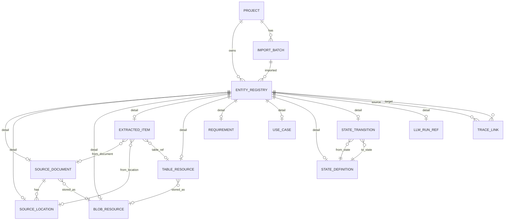

# D2D データ構造詳細設計書

## 1. 設計方針の要約

本設計では、D2D の設計支援データを単一の SQLite DB `project.db` に保存する。情報種別ごとに DB ファイルを分けず、テーブルを分ける。

主要エンティティはすべて `uid` を持つ。`uid` は内部の不変IDであり、初期設計では UUIDv7 形式の `TEXT` とする。RAGは初期導入しない。人間が読む表示用IDは `code` として管理し、`REQ-000001`、`UC-000001`、`STATE-000001`、`TR-000001` のような形式を使う。

すべての設計要素は共通台帳 `entity_registry` に登録する。要求、ユースケース、状態、状態遷移、抽出項目、表リソース等の詳細テーブルは `uid` を `entity_registry.uid` と共有し、`uid` を Primary Key かつ Foreign Key とする。これにより、全体検索、トレーサビリティ、DB to Text 出力で共通の参照方法を使える。

大容量ファイル、画像、Office/PDF 抽出物、LLM プロンプトログ、結果ログは DB 外の blob 領域に置き、DB には参照パス、ハッシュ、MIME 種別、サイズ等の参照情報だけを持たせる。

変更履歴は Git 管理を前提とし、DB 内に履歴テーブルは原則作らない。ただし、現在状態を管理するための `created_at`、`updated_at`、`created_by`、`updated_by`、`import_batch_id`、`source_hash` は必要なテーブルに持たせる。

詳細テーブルには `project_id` を持たせない。プロジェクト所属は `entity_registry.project_uid` で一元管理する。詳細テーブルに重複して持たせると、台帳と詳細テーブルの不整合を生むためである。

## 2. 全体DB構成案

### 2.1 DBファイル構成

```text
project-root/
├ project.db
├ blobs/
│  ├ originals/
│  ├ extracted/
│  ├ figures/
│  ├ tables/
│  ├ llm/
│  └ exports/
└ exports/
   ├ db_to_text/
   ├ sqlite_dump/
   └ manifest/
```

| 項目 | 方針 | 理由 |
| --- | --- | --- |
| DBファイル | `project.db` 1ファイル | SQLite 運用を単純にし、情報種別間の参照を同一DB内FKで管理する |
| blob領域 | `blobs/` 配下に分類して保存 | SQLite に大容量バイナリを入れると差分確認、バックアップ、UI応答が重くなるため |
| export領域 | `exports/` 配下にテキスト化出力を保存 | Git差分でレビューできるようにするため |
| manifest | ZIP生成時またはexport時に派生生成 | DB正本と二重管理しないため |

### 2.2 blobディレクトリ構成

| ディレクトリ | 内容 | DB側の参照元 |
| --- | --- | --- |
| `blobs/originals/` | 取り込んだ原本ファイル | `source_document.blob_uid` |
| `blobs/extracted/` | PDFページ画像、Office抽出結果、OCR中間物 | `blob_resource` |
| `blobs/figures/` | 図、画像、レンダリング結果 | `blob_resource`、`extracted_item` |
| `blobs/tables/` | CSV、JSON化した表データ | `table_resource.blob_uid` |
| `blobs/llm/` | prompt、completion、評価ログ | `llm_run_ref.prompt_blob_uid`、`llm_run_ref.result_blob_uid` |
| `blobs/exports/` | DB to Text、dump、検索用派生成果物 | export処理の生成物 |

### 2.3 主要テーブル一覧

| 分類 | テーブル | 役割 |
| --- | --- | --- |
| プロジェクト | `project` | DB全体のプロジェクト単位を管理する |
| 共通台帳 | `entity_registry` | 全主要エンティティの `uid`、表示コード、種別、状態、共通メタ情報を管理する |
| 取込管理 | `import_batch` | 原本取込や再抽出の実行単位を管理する |
| 原本 | `source_document` | 原本ファイルのメタ情報と blob 参照を管理する |
| 原本位置 | `source_location` | ページ、章節、セル範囲、座標等の根拠位置を管理する |
| blob参照 | `blob_resource` | DB外ファイルの参照、ハッシュ、MIME、サイズを管理する |
| 抽出データ | `extracted_item` | 原本から抽出したタイトル、本文、表、図、数式等を保持する |
| 表リソース | `table_resource` | 抽出表の保存場所、行列数、形式を管理する |
| 要求 | `requirement` | 要求固有の本文、種別、優先度、根拠を管理する |
| ユースケース | `use_case` | アクター、事前条件、基本フロー等を管理する |
| 状態 | `state_definition` | 状態名、状態種別、説明を管理する |
| 状態遷移 | `state_transition` | 遷移元、遷移先、イベント、条件、アクションを管理する |
| トレース | `trace_link` | 要素間の根拠、変換、対応、検証等の関係を管理する |
| LLM実行 | `llm_run_ref` | LLM実行の入力、出力、モデル、ログ参照を管理する |

### 2.4 テーブル間の関係



### 2.5 共通台帳と詳細テーブルの関係

`entity_registry` は、全要素の共通ヘッダーである。詳細テーブルは、種別固有の属性だけを持つ。

```text
entity_registry.uid = 018fe6c2-...
entity_registry.entity_type = requirement
entity_registry.code = REQ-000001
entity_registry.title = ログインできること

requirement.uid = 018fe6c2-...
requirement.requirement_type = functional
requirement.body_text = 利用者は...
```

この形にすると、一覧表示、検索、トレース、DB to Text の入り口を `entity_registry` に統一できる。

### 2.6 トレーサビリティの関係

`trace_link` は `from_uid` と `to_uid` の両方で `entity_registry.uid` を参照する。要求、ユースケース、状態、状態遷移、抽出項目、表リソース、LLM実行参照など、台帳に登録された要素であれば同じ形式でリンクできる。

UNIQUE(from_uid, to_uid, relation_type) を定義し、同じ関係の重複登録を防ぐ。

表示用コードは prefix + 6桁ゼロ埋めとする。欠番は許容し、作成済みコードの再採番は禁止する。同時編集による採番競合は初期設計では扱わず、人と運用でカバーする。

## 3. テーブル一覧

| テーブル名 | 役割 | 主な情報 | 主キー | 主な外部キー | 備考 |
| ----- | -- | ---- | --- | ------ | -- |
| `project` | プロジェクト管理 | 名前、説明、スキーマバージョン | `uid` | なし | DB内の最上位管理単位 |
| `entity_registry` | 共通台帳 | 種別、表示コード、タイトル、状態、作成更新情報 | `uid` | `project(uid)`, `import_batch(uid)` | `UNIQUE(entity_type, code)` |
| `import_batch` | 取込・抽出実行単位 | 取込種別、実行者、状態、設定 | `uid` | `project(uid)` | 詳細テーブルには `import_batch_id` を持たせず台帳で管理 |
| `blob_resource` | DB外ファイル参照 | 相対パス、MIME、サイズ、ハッシュ | `uid` | `entity_registry(uid)` | 大容量ファイルはDB外 |
| `source_document` | 原本ファイル | ファイル名、種別、ハッシュ、blob参照 | `uid` | `entity_registry(uid)`, `blob_resource(uid)` | 原本は改変しない |
| `source_location` | 原本内位置 | ページ、章節、セル範囲、座標 | `uid` | `entity_registry(uid)`, `source_document(uid)` | 根拠リンクで使う |
| `extracted_item` | 抽出要素 | item種別、本文、原本参照、表参照 | `uid` | `entity_registry(uid)`, `source_document(uid)`, `source_location(uid)`, `table_resource(uid)` | 原本忠実な抽出結果 |
| `table_resource` | 表リソース | 保存形式、保存先、行数、列数 | `uid` | `entity_registry(uid)`, `blob_resource(uid)` | 表の意味解釈は後段で行う |
| `requirement` | 要求 | 要求種別、本文、優先度、受入条件 | `uid` | `entity_registry(uid)`, `source_document(uid)` | `REQ-000001` は台帳の `code` |
| `use_case` | ユースケース | アクター、事前条件、基本フロー | `uid` | `entity_registry(uid)` | `UC-000001` は台帳の `code` |
| `state_definition` | 状態 | 状態名、状態種別、説明 | `uid` | `entity_registry(uid)` | `STATE-000001` は台帳の `code` |
| `state_transition` | 状態遷移 | 遷移元、遷移先、イベント、条件、アクション | `uid` | `entity_registry(uid)`, `state_definition(uid)` | `TR-000001` は台帳の `code` |
| `trace_link` | トレース関係 | from/to、関係種別、根拠、信頼度 | `uid` | `entity_registry(uid)` | 関係自体も台帳登録する |
| `llm_run_ref` | LLM実行参照 | モデル、入力、ログ参照、状態 | `uid` | `entity_registry(uid)`, `blob_resource(uid)` | LLM出力は候補情報として扱う |

## 4. 各テーブルのカラム定義表

### 4.1 project

| No | 論理名 | 物理名 | 内容 | データ型 | PK | NN | UQ | FK | DEFAULT | CHECK | 更新可否 | 自動生成 | 備考 |
| -: | --- | --- | -- | ---- | -- | -- | -- | -- | ------- | ----- | ---- | ---- | -- |
| 1 | プロジェクトUID | `uid` | プロジェクトの不変ID | SQLite: TEXT / App: UUIDv7 string | Yes | Yes | Yes | なし | なし | UUIDv7形式 | 不可 | UUIDv7 | DB内の最上位ID |
| 2 | プロジェクト名 | `name` | プロジェクト表示名 | SQLite: TEXT / App: string | No | Yes | No | なし | なし | なし | 可 | 手入力 | UI表示名 |
| 3 | 説明 | `description` | プロジェクト説明 | SQLite: TEXT / App: string | No | No | No | なし | なし | なし | 可 | なし | 任意 |
| 4 | ルートパス | `root_path` | プロジェクトフォルダ相対または絶対パス | SQLite: TEXT / App: string | No | No | No | なし | なし | なし | 可 | 初期作成時 | 移動可能性に注意 |
| 5 | スキーマバージョン | `schema_version` | DBスキーマバージョン | SQLite: TEXT / App: x.x.x string | No | Yes | No | なし | `'1.0.0'` | `x.x.x`形式 | 可 | アプリ | マイグレーション時に一番下の桁から自動更新する |
| 6 | 作成日時 | `created_at` | 作成日時 | SQLite: TEXT / App: ISO 8601 string | No | Yes | No | なし | `CURRENT_TIMESTAMP` | ISO 8601 | 不可 | 現在時刻 | UTC推奨 |
| 7 | 更新日時 | `updated_at` | 最終更新日時 | SQLite: TEXT / App: ISO 8601 string | No | Yes | No | なし | `CURRENT_TIMESTAMP` | ISO 8601 | 可 | アプリ | アプリで更新 |

### 4.2 entity_registry

| No | 論理名 | 物理名 | 内容 | データ型 | PK | NN | UQ | FK | DEFAULT | CHECK | 更新可否 | 自動生成 | 備考 |
| -: | --- | --- | -- | ---- | -- | -- | -- | -- | ------- | ----- | ---- | ---- | -- |
| 1 | UID | `uid` | 全エンティティ共通の不変ID | SQLite: TEXT / App: UUIDv7 string | Yes | Yes | Yes | なし | なし | UUIDv7形式 | 不可 | UUIDv7 | 詳細テーブルのPK/FKと共有 |
| 2 | プロジェクトUID | `project_uid` | 所属プロジェクト | SQLite: TEXT / App: UUIDv7 string | No | Yes | No | `project(uid)` | なし | なし | 不可 | アプリ | 詳細テーブルには重複保持しない |
| 3 | エンティティ種別 | `entity_type` | 要求、UC、状態等の種別 | SQLite: TEXT / App: enum string | No | Yes | No | なし | なし | 許容値一覧 | 原則不可 | アプリ | 詳細テーブル種別と対応 |
| 4 | 表示コード | `code` | 人間向けID | SQLite: TEXT / App: string | No | Yes | 複合 | なし | なし | prefix + ハイフン + 6桁ゼロ埋め | 原則不可 | 採番 | `entity_type + code` で一意。欠番許容、再採番禁止 |
| 5 | タイトル | `title` | 一覧表示用タイトル | SQLite: TEXT / App: string | No | Yes | No | なし | なし | なし | 可 | 手入力/抽出 | 検索画面の主表示 |
| 6 | 状態 | `status` | 現在状態 | SQLite: TEXT / App: enum string | No | Yes | No | なし | `'draft'` | `draft/review/approved/rejected/deleted` | 可 | アプリ | 履歴ではなく現在状態 |
| 7 | 作成者 | `created_by` | 作成主体 | SQLite: TEXT / App: string | No | No | No | なし | なし | なし | 不可 | アプリ | user/rule/llm等 |
| 8 | 更新者 | `updated_by` | 最終更新主体 | SQLite: TEXT / App: string | No | No | No | なし | なし | なし | 可 | アプリ | 現在状態の管理用 |
| 9 | 取込バッチUID | `import_batch_uid` | 取込・生成元バッチ | SQLite: TEXT / App: UUIDv7 string | No | No | No | `import_batch(uid)` | なし | なし | 原則不可 | アプリ | 手入力作成時はNULL可 |
| 10 | ソースハッシュ | `source_hash` | 原本または入力のハッシュ | SQLite: TEXT / App: SHA-256 string | No | No | No | なし | なし | SHA-256等 | 原則不可 | アプリ | 重複検出に使う |
| 11 | 作成日時 | `created_at` | 作成日時 | SQLite: TEXT / App: ISO 8601 string | No | Yes | No | なし | `CURRENT_TIMESTAMP` | ISO 8601 | 不可 | 現在時刻 | Git履歴とは別の現在メタ |
| 12 | 更新日時 | `updated_at` | 最終更新日時 | SQLite: TEXT / App: ISO 8601 string | No | Yes | No | なし | `CURRENT_TIMESTAMP` | ISO 8601 | 可 | アプリ | ソート対象 |

### 4.3 主要詳細テーブル

詳細テーブルはいずれも `uid` を `PRIMARY KEY` とし、同じ `uid` で `entity_registry(uid)` を参照する。以下では、要求された DB設計判断に関係する主要列を中心に定義する。

| テーブル | 主要カラム | 内容 | 主な制約 |
| --- | --- | --- | --- |
| `import_batch` | `uid`, `project_uid`, `batch_type`, `status`, `settings_json`, `executed_by`, `started_at`, `completed_at` | 取込・抽出・LLM・exportの実行単位 | `project_uid` は `project(uid)`、`batch_type` は `import/extract/llm/export` |
| `blob_resource` | `uid`, `relative_path`, `mime_type`, `byte_size`, `sha256`, `description` | DB外ファイル参照 | `uid` は `entity_registry(uid)`、`byte_size >= 0` |
| `source_document` | `uid`, `file_name`, `file_type`, `blob_uid`, `file_hash`, `version_label`, `imported_at`, `is_current` | 原本ファイル | `blob_uid` は `blob_resource(uid)`、`is_current` は `0/1` |
| `source_location` | `uid`, `source_document_uid`, `page_no_start`, `page_no_end`, `sheet_name`, `cell_start`, `cell_end`, `section_path`, `bbox_json`, `note` | 原本内位置 | `source_document_uid` は `source_document(uid)` |
| `extracted_item` | `uid`, `item_type`, `source_document_uid`, `source_location_uid`, `sequence_no`, `parent_uid`, `text_content`, `table_uid`, `raw_json`, `review_status` | 抽出要素 | `item_type` は `title/text/table/figure/formula` |
| `table_resource` | `uid`, `storage_type`, `storage_name`, `blob_uid`, `row_count`, `col_count`, `source_hash` | 表リソース | `storage_type` は `sqlite_table/csv/json/blob` |
| `requirement` | `uid`, `requirement_type`, `body_text`, `priority`, `acceptance_criteria`, `source_document_uid` | 要求詳細 | `body_text` は検索本文、`acceptance_criteria` は検索条件 |
| `use_case` | `uid`, `primary_actor`, `precondition_text`, `main_flow_text`, `alternate_flow_text`, `postcondition_text` | ユースケース詳細 | flow系列は検索本文、condition系列は検索条件 |
| `state_definition` | `uid`, `state_name`, `state_kind`, `description`, `invariant_text` | 状態詳細 | `state_kind` は `initial/normal/final/error` |
| `state_transition` | `uid`, `from_state_uid`, `to_state_uid`, `event_text`, `condition_text`, `action_text` | 状態遷移詳細 | 状態削除時は `RESTRICT` 推奨 |
| `trace_link` | `uid`, `from_uid`, `to_uid`, `relation_type`, `direction`, `rationale`, `confidence`, `created_by`, `llm_run_uid` | トレース関係 | `UNIQUE(from_uid, to_uid, relation_type)` |
| `llm_run_ref` | `uid`, `tool_name`, `process_name`, `model_name`, `input_ref_type`, `input_ref_uid`, `prompt_blob_uid`, `result_blob_uid`, `status`, `executed_at` | LLM実行参照 | prompt/resultはDB外blob参照 |

更新可否の原則は、ID、種別、生成元、ハッシュ、原本位置は作成後変更不可、タイトル、本文、状態、レビュー結果、説明は変更可である。自動生成対象は `uid`、`code`、`created_at`、`updated_at`、抽出器由来の `source_hash` である。

## 5. 各テーブルの検索設計表

| No | 物理名 | 検索対象 | 検索方式 | インデックス | 検索画面表示 | フィルタ対象 | ソート対象 | RAG対象 | RAG用途 | 備考 |
| -: | --- | ---- | ---- | ------ | ------ | ------ | ----- | ----- | ----- | -- |
| 1 | `entity_registry.uid` | 対象 | ID検索 | 主キー | 詳細のみ表示 | Yes | No | No | メタ情報 | 全要素の内部参照 |
| 2 | `entity_registry.entity_type` | 対象 | 完全一致 | 通常/UNIQUE複合 | 表示 | Yes | Yes | No | フィルタ条件 | 種別絞り込み |
| 3 | `entity_registry.code` | 対象 | 完全一致/前方一致 | UNIQUE複合 | 表示 | Yes | Yes | No | メタ情報 | 人間向けID |
| 4 | `entity_registry.title` | 対象 | 部分一致/全文検索候補 | 通常 | 表示 | Yes | Yes | No | 将来候補 | 一覧の主表示。RAGは初期導入しない |
| 5 | `entity_registry.status` | 対象 | 完全一致 | 通常 | 表示 | Yes | Yes | No | フィルタ条件 | レビュー状態 |
| 6 | `entity_registry.updated_at` | 対象 | 範囲検索 | 通常 | 表示 | Yes | Yes | No | メタ情報 | 最近更新 |
| 7 | `entity_registry.source_hash` | 対象 | 完全一致 | 通常 | 詳細のみ表示 | Yes | No | No | メタ情報 | 重複検出 |
| 8 | `source_document.file_name` | 対象 | 部分一致 | 通常 | 表示 | Yes | Yes | No | 根拠 | 原本検索 |
| 9 | `source_document.file_type` | 対象 | 完全一致 | 通常 | 表示 | Yes | Yes | No | フィルタ条件 |  |
| 10 | `source_document.file_hash` | 対象 | 完全一致 | 通常 | 詳細のみ表示 | Yes | No | No | メタ情報 | 同一性確認 |
| 11 | `source_location.source_document_uid` | 対象 | 完全一致 | 通常 | 非表示 | Yes | No | No | フィルタ条件 | 原本内位置一覧 |
| 12 | `source_location.section_path` | 対象 | 前方一致/部分一致 | 通常 | 表示 | Yes | Yes | No | 将来候補 | 章節根拠。RAGは初期導入しない |
| 13 | `source_location.page_no_start` | 対象 | 範囲検索 | 通常 | 表示 | Yes | Yes | No | 根拠 | PDF/Word向け |
| 14 | `extracted_item.item_type` | 対象 | 完全一致 | 通常 | 表示 | Yes | Yes | No | フィルタ条件 | title/text/table等 |
| 15 | `extracted_item.source_document_uid` | 対象 | 完全一致 | 通常 | 詳細のみ表示 | Yes | No | No | 根拠 | 原本別検索 |
| 16 | `extracted_item.sequence_no` | 対象 | 範囲検索 | 複合 | 表示 | No | Yes | No | メタ情報 | 原本順表示 |
| 17 | `extracted_item.text_content` | 対象 | 部分一致/全文検索候補 | FTS(MeCab) | 表示 | Yes | No | No | 将来候補 | MeCab + FTS5で日本語検索性能を向上させる。RAGは初期導入しない |
| 18 | `table_resource.source_hash` | 対象 | 完全一致 | 通常 | 詳細のみ表示 | Yes | No | No | メタ情報 | 表差分検出 |
| 19 | `requirement.requirement_type` | 対象 | 完全一致 | 通常 | 表示 | Yes | Yes | No | フィルタ条件 |  |
| 20 | `requirement.body_text` | 対象 | 部分一致/全文検索候補 | FTS(MeCab) | 表示 | Yes | No | No | 将来候補 | RAGは初期導入しない |
| 21 | `requirement.priority` | 対象 | 完全一致 | 通常 | 表示 | Yes | Yes | No | フィルタ条件 |  |
| 22 | `requirement.acceptance_criteria` | 対象 | 部分一致 | FTS(MeCab) | 詳細のみ表示 | Yes | No | No | 将来候補 | RAGは初期導入しない |
| 23 | `use_case.primary_actor` | 対象 | 完全一致/部分一致 | 通常 | 表示 | Yes | Yes | No | 将来候補 | RAGは初期導入しない |
| 24 | `use_case.main_flow_text` | 対象 | 部分一致/全文検索候補 | FTS(MeCab) | 表示 | Yes | No | No | 将来候補 | RAGは初期導入しない |
| 25 | `state_definition.state_name` | 対象 | 完全一致/部分一致 | 通常 | 表示 | Yes | Yes | No | 将来候補 | RAGは初期導入しない |
| 26 | `state_transition.from_state_uid` | 対象 | 完全一致 | 通常 | 詳細のみ表示 | Yes | No | No | フィルタ条件 | 遷移探索 |
| 27 | `state_transition.to_state_uid` | 対象 | 完全一致 | 通常 | 詳細のみ表示 | Yes | No | No | フィルタ条件 | 遷移探索 |
| 28 | `state_transition.event_text` | 対象 | 部分一致 | 通常 | 表示 | Yes | Yes | No | 将来候補 | RAGは初期導入しない |
| 29 | `trace_link.from_uid` | 対象 | ID検索 | 通常/複合 | 詳細のみ表示 | Yes | No | No | フィルタ条件 | 前方探索 |
| 30 | `trace_link.to_uid` | 対象 | ID検索 | 通常/複合 | 詳細のみ表示 | Yes | No | No | フィルタ条件 | 逆引き |
| 31 | `trace_link.relation_type` | 対象 | 完全一致 | 通常/複合 | 表示 | Yes | Yes | No | フィルタ条件 | 関係種別 |
| 32 | `trace_link.rationale` | 対象 | 部分一致/全文検索候補 | FTS(MeCab) | 詳細のみ表示 | Yes | No | No | 将来候補 | RAGは初期導入しない |
| 33 | `llm_run_ref.input_ref_uid` | 対象 | ID検索 | 通常 | 詳細のみ表示 | Yes | No | No | 根拠 | 入力追跡 |
| 34 | `llm_run_ref.status` | 対象 | 完全一致 | 通常 | 表示 | Yes | Yes | No | フィルタ条件 |  |

## 6. インデックス一覧

| インデックス名 | 対象テーブル | 対象カラム | 種別 | 目的 | 作成優先度 |
| ------- | ------ | ----- | -- | -- | ----- |
| `sqlite_autoindex_project_1` | `project` | `uid` | 主キー | プロジェクトID検索 | 初期必須 |
| `sqlite_autoindex_entity_registry_1` | `entity_registry` | `uid` | 主キー | 全要素ID検索 | 初期必須 |
| `uq_entity_registry_type_code` | `entity_registry` | `entity_type, code` | UNIQUE | 表示コード重複防止 | 初期必須 |
| `idx_entity_registry_project` | `entity_registry` | `project_uid` | 通常 | プロジェクト単位検索 | 初期必須 |
| `idx_entity_registry_type` | `entity_registry` | `entity_type` | 通常 | 種別フィルタ | 初期推奨 |
| `idx_entity_registry_status` | `entity_registry` | `status` | 通常 | 状態フィルタ | 初期推奨 |
| `idx_entity_registry_updated_at` | `entity_registry` | `updated_at` | 通常 | 最近更新順 | 初期推奨 |
| `idx_entity_registry_source_hash` | `entity_registry` | `source_hash` | 通常 | 重複検出 | 初期推奨 |
| `idx_import_batch_project` | `import_batch` | `project_uid` | 通常 | バッチ一覧 | 初期推奨 |
| `idx_blob_resource_sha256` | `blob_resource` | `sha256` | 通常 | blob重複検出 | 初期推奨 |
| `idx_blob_resource_mime_type` | `blob_resource` | `mime_type` | 通常 | ファイル種別フィルタ | 後日検討 |
| `idx_source_document_file_hash` | `source_document` | `file_hash` | 通常 | 原本同一性確認 | 初期推奨 |
| `idx_source_document_file_type` | `source_document` | `file_type` | 通常 | 原本種別フィルタ | 初期推奨 |
| `idx_source_location_document` | `source_location` | `source_document_uid` | 通常 | 原本位置一覧 | 初期必須 |
| `idx_source_location_section` | `source_location` | `section_path` | 通常 | 章節検索 | 後日検討 |
| `idx_extracted_item_document` | `extracted_item` | `source_document_uid` | 通常 | 原本別抽出一覧 | 初期必須 |
| `idx_extracted_item_type` | `extracted_item` | `item_type` | 通常 | 抽出種別フィルタ | 初期推奨 |
| `idx_extracted_item_doc_seq` | `extracted_item` | `source_document_uid, sequence_no` | 複合 | 原本順表示 | 初期推奨 |
| `idx_extracted_item_review_status` | `extracted_item` | `review_status` | 通常 | 確認状態フィルタ | 初期推奨 |
| `idx_table_resource_hash` | `table_resource` | `source_hash` | 通常 | 表差分検出 | 初期推奨 |
| `idx_requirement_type` | `requirement` | `requirement_type` | 通常 | 要求種別フィルタ | 初期推奨 |
| `idx_requirement_priority` | `requirement` | `priority` | 通常 | 優先度フィルタ | 後日検討 |
| `idx_use_case_actor` | `use_case` | `primary_actor` | 通常 | アクター検索 | 後日検討 |
| `idx_state_definition_name` | `state_definition` | `state_name` | 通常 | 状態名検索 | 初期推奨 |
| `idx_state_transition_from` | `state_transition` | `from_state_uid` | 通常 | 遷移元探索 | 初期必須 |
| `idx_state_transition_to` | `state_transition` | `to_state_uid` | 通常 | 遷移先探索 | 初期必須 |
| `uq_trace_link_pair_type` | `trace_link` | `from_uid, to_uid, relation_type` | UNIQUE | 同一関係の重複防止 | 初期必須 |
| `idx_trace_link_from_type` | `trace_link` | `from_uid, relation_type` | 複合 | 前方トレース探索 | 初期必須 |
| `idx_trace_link_to_type` | `trace_link` | `to_uid, relation_type` | 複合 | 逆引きトレース探索 | 初期必須 |
| `idx_trace_link_relation_type` | `trace_link` | `relation_type` | 通常 | 関係種別フィルタ | 初期推奨 |
| `idx_llm_run_input` | `llm_run_ref` | `input_ref_uid` | 通常 | LLM入力追跡 | 初期推奨 |
| `idx_llm_run_status` | `llm_run_ref` | `status` | 通常 | 失敗処理検索 | 後日検討 |
| `fts_entity_text` | `entity_registry`, detail text columns | MeCabで形態素解析した検索用本文 | FTS | 日本語全文検索 | 初期必須 |

## 7. SQLite DDL案

```sql
PRAGMA foreign_keys = ON;

CREATE TABLE project (
    uid TEXT PRIMARY KEY,
    name TEXT NOT NULL,
    description TEXT,
    root_path TEXT,
    schema_version TEXT NOT NULL DEFAULT '1.0.0',
    created_at TEXT NOT NULL DEFAULT CURRENT_TIMESTAMP,
    updated_at TEXT NOT NULL DEFAULT CURRENT_TIMESTAMP,
    CHECK (length(uid) >= 32)
);

CREATE TABLE import_batch (
    uid TEXT PRIMARY KEY,
    project_uid TEXT NOT NULL,
    batch_type TEXT NOT NULL CHECK (batch_type IN ('import', 'extract', 'llm', 'export')),
    status TEXT NOT NULL DEFAULT 'running' CHECK (status IN ('running', 'success', 'failed', 'partial')),
    settings_json TEXT,
    executed_by TEXT,
    started_at TEXT NOT NULL DEFAULT CURRENT_TIMESTAMP,
    completed_at TEXT,
    FOREIGN KEY (project_uid) REFERENCES project(uid) ON DELETE CASCADE
);

CREATE TABLE entity_registry (
    uid TEXT PRIMARY KEY,
    project_uid TEXT NOT NULL,
    entity_type TEXT NOT NULL CHECK (entity_type IN (
        'project',
        'source_document',
        'source_location',
        'blob_resource',
        'extracted_item',
        'table_resource',
        'requirement',
        'use_case',
        'state_definition',
        'state_transition',
        'trace_link',
        'llm_run_ref'
    )),
    code TEXT NOT NULL CHECK (code GLOB '*-[0-9][0-9][0-9][0-9][0-9][0-9]'),
    title TEXT NOT NULL,
    status TEXT NOT NULL DEFAULT 'draft' CHECK (status IN ('draft', 'review', 'approved', 'rejected', 'deleted')),
    created_by TEXT,
    updated_by TEXT,
    import_batch_uid TEXT,
    source_hash TEXT,
    created_at TEXT NOT NULL DEFAULT CURRENT_TIMESTAMP,
    updated_at TEXT NOT NULL DEFAULT CURRENT_TIMESTAMP,
    UNIQUE (entity_type, code),
    FOREIGN KEY (project_uid) REFERENCES project(uid) ON DELETE CASCADE,
    FOREIGN KEY (import_batch_uid) REFERENCES import_batch(uid) ON DELETE SET NULL
);

CREATE TABLE blob_resource (
    uid TEXT PRIMARY KEY,
    relative_path TEXT NOT NULL,
    mime_type TEXT,
    byte_size INTEGER CHECK (byte_size IS NULL OR byte_size >= 0),
    sha256 TEXT NOT NULL,
    description TEXT,
    FOREIGN KEY (uid) REFERENCES entity_registry(uid) ON DELETE CASCADE
);

CREATE TABLE source_document (
    uid TEXT PRIMARY KEY,
    file_name TEXT NOT NULL,
    file_type TEXT NOT NULL CHECK (file_type IN ('word', 'excel', 'powerpoint', 'visio', 'pdf', 'text', 'markdown', 'csv', 'json', 'other')),
    blob_uid TEXT,
    file_hash TEXT NOT NULL,
    version_label TEXT,
    imported_at TEXT NOT NULL DEFAULT CURRENT_TIMESTAMP,
    is_current INTEGER NOT NULL DEFAULT 1 CHECK (is_current IN (0, 1)),
    FOREIGN KEY (uid) REFERENCES entity_registry(uid) ON DELETE CASCADE,
    FOREIGN KEY (blob_uid) REFERENCES blob_resource(uid) ON DELETE SET NULL
);

CREATE TABLE source_location (
    uid TEXT PRIMARY KEY,
    source_document_uid TEXT NOT NULL,
    page_no_start INTEGER CHECK (page_no_start IS NULL OR page_no_start >= 1),
    page_no_end INTEGER CHECK (page_no_end IS NULL OR page_no_end >= page_no_start),
    sheet_name TEXT,
    cell_start TEXT,
    cell_end TEXT,
    section_path TEXT,
    bbox_json TEXT,
    note TEXT,
    FOREIGN KEY (uid) REFERENCES entity_registry(uid) ON DELETE CASCADE,
    FOREIGN KEY (source_document_uid) REFERENCES source_document(uid) ON DELETE CASCADE
);

CREATE TABLE table_resource (
    uid TEXT PRIMARY KEY,
    storage_type TEXT NOT NULL CHECK (storage_type IN ('sqlite_table', 'csv', 'json', 'blob')),
    storage_name TEXT NOT NULL,
    blob_uid TEXT,
    row_count INTEGER CHECK (row_count IS NULL OR row_count >= 0),
    col_count INTEGER CHECK (col_count IS NULL OR col_count >= 0),
    source_hash TEXT,
    FOREIGN KEY (uid) REFERENCES entity_registry(uid) ON DELETE CASCADE,
    FOREIGN KEY (blob_uid) REFERENCES blob_resource(uid) ON DELETE SET NULL
);

CREATE TABLE extracted_item (
    uid TEXT PRIMARY KEY,
    item_type TEXT NOT NULL CHECK (item_type IN ('title', 'text', 'table', 'figure', 'formula')),
    source_document_uid TEXT NOT NULL,
    source_location_uid TEXT,
    sequence_no INTEGER NOT NULL DEFAULT 0 CHECK (sequence_no >= 0),
    parent_uid TEXT,
    text_content TEXT,
    table_uid TEXT,
    raw_json TEXT,
    review_status TEXT NOT NULL DEFAULT 'unchecked'
        CHECK (review_status IN ('unchecked', 'llm_checked', 'confirmed', 'rejected')),
    FOREIGN KEY (uid) REFERENCES entity_registry(uid) ON DELETE CASCADE,
    FOREIGN KEY (source_document_uid) REFERENCES source_document(uid) ON DELETE CASCADE,
    FOREIGN KEY (source_location_uid) REFERENCES source_location(uid) ON DELETE SET NULL,
    FOREIGN KEY (parent_uid) REFERENCES extracted_item(uid) ON DELETE SET NULL,
    FOREIGN KEY (table_uid) REFERENCES table_resource(uid) ON DELETE SET NULL
);

CREATE TABLE requirement (
    uid TEXT PRIMARY KEY,
    requirement_type TEXT NOT NULL DEFAULT 'functional',
    body_text TEXT NOT NULL,
    priority TEXT CHECK (priority IS NULL OR priority IN ('high', 'medium', 'low')),
    acceptance_criteria TEXT,
    source_document_uid TEXT,
    FOREIGN KEY (uid) REFERENCES entity_registry(uid) ON DELETE CASCADE,
    FOREIGN KEY (source_document_uid) REFERENCES source_document(uid) ON DELETE SET NULL
);

CREATE TABLE use_case (
    uid TEXT PRIMARY KEY,
    primary_actor TEXT,
    precondition_text TEXT,
    main_flow_text TEXT,
    alternate_flow_text TEXT,
    postcondition_text TEXT,
    FOREIGN KEY (uid) REFERENCES entity_registry(uid) ON DELETE CASCADE
);

CREATE TABLE state_definition (
    uid TEXT PRIMARY KEY,
    state_name TEXT NOT NULL,
    state_kind TEXT CHECK (state_kind IS NULL OR state_kind IN ('initial', 'normal', 'final', 'error')),
    description TEXT,
    invariant_text TEXT,
    FOREIGN KEY (uid) REFERENCES entity_registry(uid) ON DELETE CASCADE
);

CREATE TABLE state_transition (
    uid TEXT PRIMARY KEY,
    from_state_uid TEXT NOT NULL,
    to_state_uid TEXT NOT NULL,
    event_text TEXT NOT NULL,
    condition_text TEXT,
    action_text TEXT,
    FOREIGN KEY (uid) REFERENCES entity_registry(uid) ON DELETE CASCADE,
    FOREIGN KEY (from_state_uid) REFERENCES state_definition(uid) ON DELETE RESTRICT,
    FOREIGN KEY (to_state_uid) REFERENCES state_definition(uid) ON DELETE RESTRICT
);

CREATE TABLE llm_run_ref (
    uid TEXT PRIMARY KEY,
    tool_name TEXT,
    process_name TEXT NOT NULL,
    model_name TEXT,
    input_ref_type TEXT,
    input_ref_uid TEXT,
    prompt_blob_uid TEXT,
    result_blob_uid TEXT,
    status TEXT NOT NULL CHECK (status IN ('success', 'failed', 'partial')),
    executed_at TEXT NOT NULL DEFAULT CURRENT_TIMESTAMP,
    FOREIGN KEY (uid) REFERENCES entity_registry(uid) ON DELETE CASCADE,
    FOREIGN KEY (input_ref_uid) REFERENCES entity_registry(uid) ON DELETE SET NULL,
    FOREIGN KEY (prompt_blob_uid) REFERENCES blob_resource(uid) ON DELETE SET NULL,
    FOREIGN KEY (result_blob_uid) REFERENCES blob_resource(uid) ON DELETE SET NULL
);

CREATE TABLE trace_link (
    uid TEXT PRIMARY KEY,
    from_uid TEXT NOT NULL,
    to_uid TEXT NOT NULL,
    relation_type TEXT NOT NULL CHECK (relation_type IN (
        'derived_from',
        'normalized_from',
        'based_on',
        'satisfies',
        'verifies',
        'depends_on',
        'refines',
        'relates_to'
    )),
    direction TEXT NOT NULL DEFAULT 'forward' CHECK (direction IN ('forward', 'reverse', 'bidirectional')),
    rationale TEXT,
    confidence REAL CHECK (confidence IS NULL OR (confidence >= 0.0 AND confidence <= 1.0)),
    created_by TEXT CHECK (created_by IS NULL OR created_by IN ('human', 'rule', 'llm')),
    llm_run_uid TEXT,
    UNIQUE (from_uid, to_uid, relation_type),
    FOREIGN KEY (uid) REFERENCES entity_registry(uid) ON DELETE CASCADE,
    FOREIGN KEY (from_uid) REFERENCES entity_registry(uid) ON DELETE CASCADE,
    FOREIGN KEY (to_uid) REFERENCES entity_registry(uid) ON DELETE CASCADE,
    FOREIGN KEY (llm_run_uid) REFERENCES llm_run_ref(uid) ON DELETE SET NULL
);

CREATE INDEX idx_entity_registry_project ON entity_registry(project_uid);
CREATE INDEX idx_entity_registry_type ON entity_registry(entity_type);
CREATE INDEX idx_entity_registry_status ON entity_registry(status);
CREATE INDEX idx_entity_registry_updated_at ON entity_registry(updated_at);
CREATE INDEX idx_entity_registry_source_hash ON entity_registry(source_hash);

CREATE INDEX idx_import_batch_project ON import_batch(project_uid);

CREATE INDEX idx_blob_resource_sha256 ON blob_resource(sha256);
CREATE INDEX idx_blob_resource_mime_type ON blob_resource(mime_type);

CREATE INDEX idx_source_document_file_hash ON source_document(file_hash);
CREATE INDEX idx_source_document_file_type ON source_document(file_type);
CREATE INDEX idx_source_location_document ON source_location(source_document_uid);
CREATE INDEX idx_source_location_section ON source_location(section_path);

CREATE INDEX idx_extracted_item_document ON extracted_item(source_document_uid);
CREATE INDEX idx_extracted_item_type ON extracted_item(item_type);
CREATE INDEX idx_extracted_item_doc_seq ON extracted_item(source_document_uid, sequence_no);
CREATE INDEX idx_extracted_item_review_status ON extracted_item(review_status);

CREATE INDEX idx_table_resource_hash ON table_resource(source_hash);

CREATE INDEX idx_requirement_type ON requirement(requirement_type);
CREATE INDEX idx_requirement_priority ON requirement(priority);

CREATE INDEX idx_use_case_actor ON use_case(primary_actor);

CREATE INDEX idx_state_definition_name ON state_definition(state_name);
CREATE INDEX idx_state_transition_from ON state_transition(from_state_uid);
CREATE INDEX idx_state_transition_to ON state_transition(to_state_uid);

CREATE INDEX idx_trace_link_from_type ON trace_link(from_uid, relation_type);
CREATE INDEX idx_trace_link_to_type ON trace_link(to_uid, relation_type);
CREATE INDEX idx_trace_link_relation_type ON trace_link(relation_type);

CREATE INDEX idx_llm_run_input ON llm_run_ref(input_ref_uid);
CREATE INDEX idx_llm_run_status ON llm_run_ref(status);

-- 日本語全文検索用。アプリ側でMeCab形態素解析済みの検索用テキストを search_text に登録する。
-- RAGは初期導入しないため、これは検索性能向上のための索引である。
CREATE VIRTUAL TABLE fts_entity_text USING fts5(
    uid UNINDEXED,
    entity_type UNINDEXED,
    code UNINDEXED,
    title,
    search_text,
    tokenize = 'unicode61'
);
```

`ON DELETE CASCADE` は、共通台帳の削除に連動して詳細行を消すために採用する。ただし、UIでは誤削除を避けるため、通常操作は `status='deleted'` による論理削除を優先する。`archived` は状態値として採用しない。

`state_transition.from_state_uid` と `state_transition.to_state_uid` は `ON DELETE RESTRICT` とする。状態を削除すると遷移の意味が壊れるため、先に遷移を削除または変更させる。

## 8. Git管理・エクスポート方針

SQLite DB ファイルは正本だが、Git上の差分確認には向かない。そのため、DBの内容をレビュー可能なテキスト形式へエクスポートする。

| 出力 | 形式 | 目的 | Git管理 |
| --- | --- | --- | --- |
| DB to Text | JSONL | テーブル毎に `uid` 昇順で出力し、Git差分を確認する | Yes |
| SQLite dump | `.sql` | スキーマ差分、データ復元補助 | Yes |
| Table export | JSONL | 機械処理、差分確認、再取込補助 | Yes |
| blob manifest | JSON | DB外ファイルのパス、ハッシュ、サイズ確認 | Yes |
| LLMログ | JSONL | prompt/resultの監査 | 必要に応じて。機密情報は除外 |

Gitは変更の時間軸を管理する。DBは現在状態を管理する。この役割分担により、DB内の履歴テーブルとGit履歴の二重管理を避ける。

推奨エクスポート例:

```text
exports/db_to_text/
├ entity_registry.jsonl
├ requirement.jsonl
├ use_case.jsonl
├ state_definition.jsonl
├ state_transition.jsonl
└ trace_link.jsonl

exports/sqlite_dump/
├ schema.sql
└ data.sql

exports/manifest/
└ blob_manifest.json
```

## 9. 注意点・確定事項

| 論点 | 確定方針 | 理由 | 補足・見直し条件 |
| -- | -- | -- | ------- |
| UUIDv7をTEXTで持つかBLOBで持つか | `TEXT` で持つ | SQLite CLI、JSONL、DB to Text、デバッグで扱いやすい | 将来、DBサイズや索引性能が実測上の問題になった場合のみBLOB化を再検討する |
| `row_id INTEGER PRIMARY KEY` を併用するか | 併用しない | `uid` を正本IDに一本化し、外部参照とGit差分の安定性を優先する | 大量データでJOIN性能が問題になり、実測で効果が確認できた場合のみ再検討する |
| FTS5を適用するか | MeCab形態素解析と合わせて適用する | MeCabで形態素解析した検索用テキストをFTS5に登録し、日本語本文検索の性能と精度を上げる | MeCab辞書、専門用語辞書、更新タイミングは実装設計で定義する |
| 日本語全文検索をどう扱うか | 適用する | SQLite標準FTSだけに任せず、MeCab前処理により日本語の語境界を扱いやすくする | 表記揺れ、同義語、専門用語追加の運用は別途設計する |
| blobをDB内に持つか外部ファイルにするか | 外部ファイルにする | DB肥大化、Git差分困難、バックアップ負荷を避ける | DBには `blob_resource` で相対パス、MIME、サイズ、ハッシュを持つ |
| Git差分確認用エクスポート形式 | JSONL、テーブル毎ファイル、`uid` 昇順 | 機械処理しやすく、行単位差分も安定しやすい | 人間向けビューが必要な場合はJSONLからMarkdown/HTMLを派生生成する |
| `entity_type` と詳細テーブルの整合性 | アプリで保証する | SQLiteのCHECKだけでは詳細テーブル存在までは保証しにくく、トリガーで複雑化させない | 複数ツールが直接DBを書き込むようになった場合のみトリガーを再検討する |
| 論理削除を採用するか物理削除を採用するか | `status='deleted'` による論理削除を採用する。`archived` は不要 | 誤削除防止とGit履歴確認を両立し、削除状態を明示できる | 物理削除はDBサイズ削減、個人情報削除、原本再取込など保守操作に限定する |
| 詳細テーブルに `project_id` を持つか | 持たせない | `entity_registry.project_uid` と重複し、不整合源になる | 詳細テーブル単独の大量検索で実測上の性能問題が出た場合のみ再検討する |
| `ON DELETE CASCADE` をどこまで使うか | 台帳から詳細への削除はCASCADE、意味破壊する参照はRESTRICT | 共通台帳と詳細の孤児行を防ぎつつ、状態遷移等の意味破壊を防ぐ | 通常削除は `status='deleted'` を使い、物理削除は保守操作として扱う |
| `code` 採番方法 | prefix + 6桁ゼロ埋め。欠番許容、再採番禁止。同時編集は考慮しない | 人間が読みやすく、Git差分や外部参照で安定する。競合は人と運用でカバーする | 複数プロセス同時編集を正式にサポートする場合のみDB側採番制御を再検討する |
| PostgreSQL移行余地 | SQLite標準型と単純なFK/INDEX中心にする | PostgreSQL移行時にDDL変換しやすい | PostgreSQL移行時はUUID型、JSONB、全文検索、ベクトル検索への置換を検討する |
| マイグレーション方針 | `schema_version` は `x.x.x` 形式とし、一番下の桁から自動更新する | 小さな互換変更は下位桁で管理し、破壊的変更だけ上位桁へ進めると運用しやすい | 上位桁を上げる条件、DDL適用順、バックアップ手順は実装設計で定義する |
| `updated_at` 更新方針 | DBトリガーではなくアプリで自動更新する | 更新責務をアプリ側に集約し、SQLiteトリガーの見落としや移行時の差異を避ける | DBを直接更新する保守ツールも同じ更新規約に従う |

## 10. 次に設計すべき項目

| 項目 | 内容 | 優先度 |
| --- | --- | --- |
| `entity_type` 一覧 | 要求、UC、状態、状態遷移以外の設計要素種別を確定する | 高 |
| FTS5実装詳細 | MeCab形態素解析結果の登録形式、更新タイミング、検索対象列、辞書管理を定義する | 高 |
| マイグレーション実装手順 | `schema_version` の `x.x.x` 自動更新、DDL適用順、バックアップ、失敗時ロールバックを定義する | 中 |
| blob manifest 仕様 | blobの相対パス、ハッシュ、生成元、削除検出方法 | 中 |
| 削除操作設計 | `status='deleted'` のUI表示、復元可否、物理削除時のblob削除、参照中データ削除ルール | 中 |