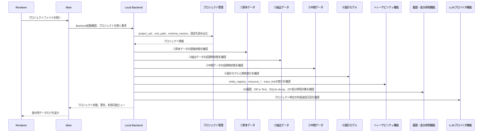
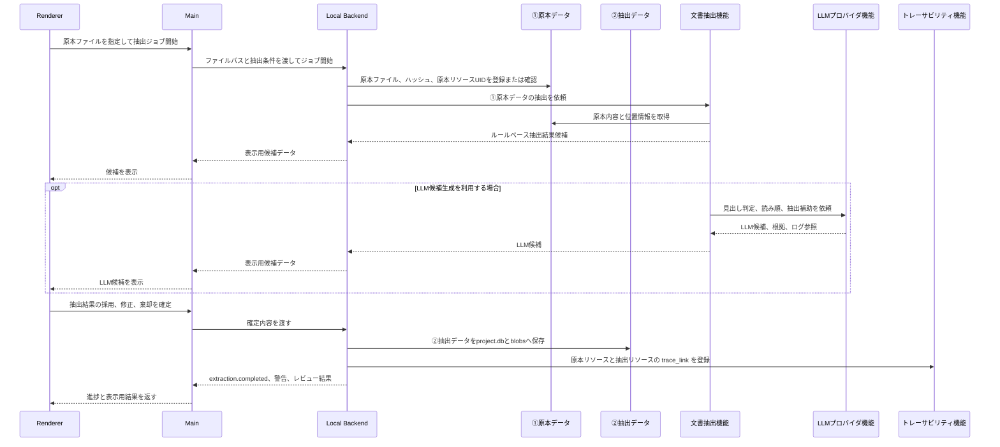
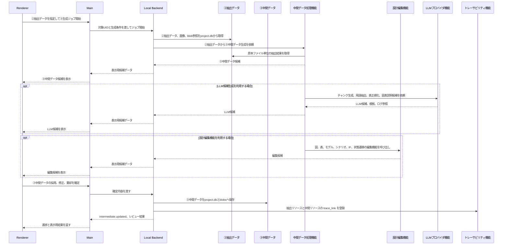
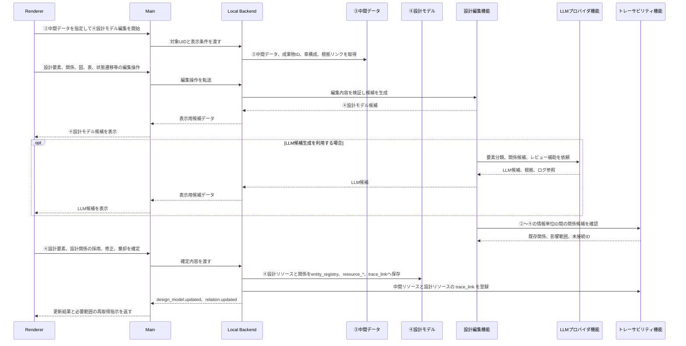
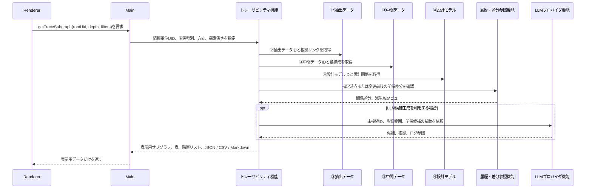
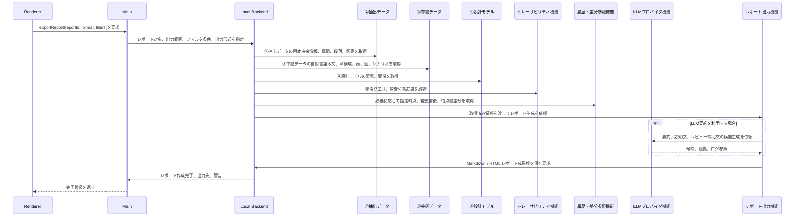
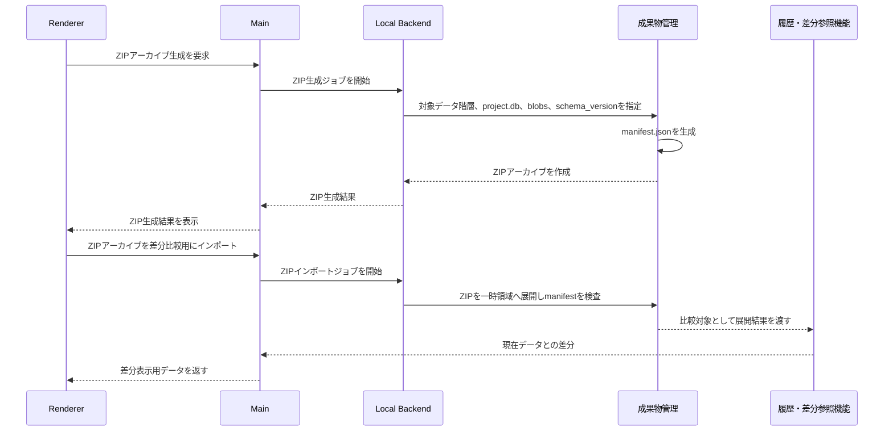

# 機能構成詳細設計書

## 1. 位置づけ

本書は、D2D の機能種別、機能間のデータ流れ、呼び出し関係、イベント連携を定義する。

---

## 2. 設計方針

本書では、機能を以下の3種類に分けて扱う。

| 区分 | 位置づけ |
| --- | --- |
| 基盤機能 | 個別機能や共通機能を動かすためのホスト機能。プロジェクト、設定、ジョブ、成果物、ストア、イベント等を扱う |
| 共通機能 | 複数の個別機能から横断的に利用される支援機能。トレーサビリティ、履歴・差分参照、LLM、レポート等を扱う |
| 個別機能 | ①原本、②抽出データ、③中間データ、④設計モデルを生成・編集する主処理機能 |

基盤機能は業務上の設計判断や抽出処理を直接担わず、共通機能および個別機能へ安全なAPI境界を提供する。共通機能と個別機能は、基盤機能を経由して成果物、設計モデル、設定、ログへアクセスする。

Electron 実装上の実行責務は以下の通り分離する。

| 実行層 | 主責務 | 実装上の扱い |
| --- | --- | --- |
| Renderer | UI表示、入力操作、表示範囲の要求、進捗表示 | 大量データを保持せず、必要な範囲だけを Backend API に要求する |
| Main | Electron Shell、OS統合、ファイル選択、RendererとのIPC、Backend起動・停止、Backend接続情報管理 | 業務ロジック、DB検索、文書解析、PlantUML実行、LLM処理を直接実装しない |
| Local Backend | 業務ロジック、File I/O、`project.db`、`blobs/`、解析、キャッシュ、表示用データ生成、ジョブ実行 | ファイルとDBを直接扱い、Rendererには表示・編集に必要な粒度のデータだけを返す |

基盤機能、共通機能、個別機能は Local Backend 側に配置する。Main は Gateway / Shell として、Renderer からの要求を Local Backend へ中継し、ファイル選択など OS 統合が必要な操作だけを担当する。

> **初期実装方針（2026-07確定）**: Local Backend は初回から Electron Main とは別プロセスとして起動する。Electron Main は Renderer IPC、OS統合、Local Backend の起動・停止・接続監視に限定し、DB操作、文書解析、LLM通信、PlantUML実行、MeCab前処理、DB to Text生成などの業務ロジックを直接実装しない。

API は細かいレコード取得を大量に呼ぶ形にしない。`importDocument(filePath)`、`searchElements(query, paging, sort)`、`getTraceSubgraph(elementId, depth, filters)`、`generateDesignCandidates(chunkId, promptTemplateId, modelSettings)`、`reviewCandidateSet(llmRunId, decisions)`、`renderPlantUml(sourceId or textHash)`、`getTableViewport(tableId, range, filters)`、`exportReport(reportId, format)` のように、ユーザー操作単位または表示単位でまとめる。`readLine(filePath, lineNo)`、`getCell(row, col)`、`getNode(nodeId)` / `getEdge(edgeId)` の大量反復呼び出しは禁止する。

### 2.2 Electron セキュリティ設定

Renderer と Main / Local Backend の境界は、以下の設定を規定値とする。

| 設定 | 規定値 |
| --- | --- |
| `contextIsolation` | `true` |
| `nodeIntegration` | `false` |
| `sandbox` | `true`（Renderer） |
| preload | `contextBridge` で許可したAPIのみを `window.api.*` として公開する |
| CSP | ローカルリソースのみ許可し、リモートコンテンツの読込・実行を禁止する |
| 外部リンク | `shell.openExternal` 経由に限定し、Renderer からの直接ナビゲーションを禁止する |

### 2.3 基盤APIエラー契約

基盤機能 API は、共通のエラー応答スキーマを返す。ワーカー境界のエラー（§11.2）は、Local Backend がこの契約へ変換して返す。

```json
{
  "error_code": "string",
  "message":    "string",
  "detail":     "string",
  "retryable":  true
}
```

| 項目 | 内容 |
| --- | --- |
| `error_code` 分類 | `validation`（入力・スキーマ検証）/ `not_found` / `conflict`（重複・競合）/ `io`（ファイルI/O）/ `db` / `worker`（外部ワーカー）/ `llm`（Provider通信・出力検証）/ `cancelled` / `internal` |
| `retryable` | 条件付き再実行が可能な場合に `true`。ジョブ再実行条件の判定に使う |
| UI表示規約 | 検証系（`validation` / `conflict`）は Problems / Validation Results、実行系（`io` / `db` / `worker` / `llm`）は Notification と Job Log Viewer へ表示する |

### 2.4 応答性の設計基準

Local Backend のSQLiteアクセスは同期API（better-sqlite3）であり、実行中は他のAPI応答を塞ぐ。以下を基準とする。

| 基準 | 内容 |
| --- | --- |
| ジョブ化 | 実測で500msを超える探索・生成・出力処理は、バックグラウンドジョブまたは `worker_threads` へ分離する（SRS NFR-003、NFR-005） |
| 分割応答 | 一覧・グラフ・表は Viewport / ページング単位で返し、全件を一括で返さない |
| 深い関係探索 | 再帰CTEの深さ・件数に上限を設け、超過時は段階展開（追加要求）で返す |

### 2.5 設計モデル化の工程と機能責務

本ツールは、①原本データ、②抽出データ、③中間データ、④設計モデルのデータ遷移に沿って設計モデル化を段階的に進める。各工程の主担当は以下とする。

| 工程 | 主担当機能 | 正本更新の扱い |
| --- | --- | --- |
| ①原本データ→②抽出データ | 文書抽出機能 | 原本構造、位置、順序、階層を②抽出データ候補として提示し、レビュー後に保存する |
| ②抽出データ→③中間データ | 中間データ処理機能 | ②抽出データを入力として設計記述要素を抽出し、記述型へ分類したうえで、③中間データ候補として提示する |
| ③中間データ→④設計モデル | 設計編集機能 / 中間データ処理機能 | 設計意味候補への昇格、同一対象の統合・正規化、関係付与を行うが、④正本へは採用操作後に反映する |
| 双方向トレーサビリティ分析 | トレーサビリティ機能 | 未接続、不整合、根拠不足、粒度不一致、循環等を検出し、修正候補またはレポートとして提示する |

関係付与は同一対象の統合・正規化から独立した処理として扱う。ノードの統合・正規化が完了していない段階でも関係候補を保持できるが、確定済み関係として扱うのはレビュー後に限る。検査は独立した正本生成工程ではなく、双方向トレーサビリティの分析機能により、①〜④と `trace_link` を横断して実現する。

---

## 3. 本ツール側の基盤機能

本ツール側の基盤機能は、個別機能を動かすためのホスト機能に限定する。基盤機能は、文書抽出、トレーサビリティ、LLM候補生成、レポート出力のような業務上の処理を直接担わない。機能の有効/無効切替も扱わず、機能登録、プロジェクト、設定、権限、ジョブ、イベント、成果物、ストアへの安全なAPI境界を提供する。

| 基盤機能 | 役割 | 個別機能への提供内容 |
| --- | --- | --- |
| 機能管理 | 機能単位の登録、機能種別、入出力、設定、権限、対応schema_versionを管理する | 機能定義の参照、権限チェック、設定参照、schema_version整合確認 |
| プロジェクト管理 | プロジェクトファイルを開き、利用するプロジェクトを切り替える | project_uid、プロジェクトルート、設定、schema_versionの解決 |
| 設定管理 | アプリ全体設定とプロジェクト別設定を管理する | APIキー参照、モデル設定、パス、プロキシ、テーマ、ショートカット、外部送信可否の参照。設定エクスポート時はAPIキー等の機密情報を除外する（SRS CORE-046） |
| ジョブ管理 | 長時間処理、進捗、失敗状態、条件付き再実行を扱う | ジョブ起動、進捗通知、ジョブログ保存、再実行条件の保持 |
| 成果物管理 | ①原本、②抽出データ、③中間データ、ZIPアーカイブ、差分比較用インポートを扱う | `project.db` / `blobs/` の読込・保存、成果物UID解決、ZIP生成、ZIP差分比較用インポート |
| ストアアクセス管理 | `project.db`、`blobs/`、DB to Text、SQLite dump、関係グラフ索引への安全なアクセスを扱う | 正本データの読込・保存、トランザクション境界、schema_version整合確認、索引更新の呼び出し |
| LLM実行ログ管理 | LLM実行証跡、プロンプト、応答、入力参照を保存する | `llm_run_ref` 登録、プロンプトログ参照、応答ログ参照、APIキー等の機密情報除外 |
| イベント通知 | 機能間の疎結合な通知を扱う | 取込完了、抽出完了、成果物更新、設計モデル更新、関係更新等のイベント購読・発行 |

---

## 4. 機能分類

本ツールの機能は、複数の個別機能から横断的に利用される共通機能と、4階層データの生成・編集を担当する個別機能に分ける。Renderer、Electron Main は、基盤機能 API を経由して成果物、設計モデル、設定、ログへアクセスし、直接ファイルI/OやDB更新を行わない。Local Backend 内の各機能は、ストアアクセス管理を通じて `project.db` と `blobs/` を扱う。

### 4.1 共通機能

共通機能は、複数の個別機能から横断的に利用される支援機能である。

> **共通の基盤機能利用**: 全共通機能は、プロジェクト管理・設定管理・ジョブ管理・成果物管理・ストアアクセス管理・イベント通知を利用する。以下の表では差分のみ記載する。

| 共通機能 | 主責務 | 主な入力 | 主な出力 | 追加で利用する基盤機能 |
| --- | --- | --- | --- | --- |
| トレーサビリティ機能 | 台帳登録された設計リソース間の根拠関係、設計意味関係、実装・検証関係、関係クエリ、影響分析を行う | `entity_registry`、`resource_*`、`trace_link`、`relation_rule_master`、`llm_run_ref` | 関係クエリ結果、表、階層リスト、表示用サブグラフ、JSON / CSV / Markdown | 必要に応じてLLM実行ログ管理 |
| 履歴・差分参照機能 | Git履歴、DB to Text、SQLite dump、ZIP差分から変更前後を参照する | Git履歴、DB to Text、SQLite dump、ZIPアーカイブ、②③④成果物 | Diffビュー、差分結果、履歴参照ビュー | ― |
| LLMプロバイダ機能 | LLMによる候補生成、要約、分類、関係候補生成、正規化テキスト生成を提供する | 入力チャンク、プロンプト、プロジェクト設定 | 候補情報、LLM実行参照、プロンプトログ、応答ログ、構造化JSON検証結果 | LLM実行ログ管理 |
| レポート出力機能 | ②③④から文書風レポート、一覧、関係情報を生成する | ②③④データ、トレース情報、フィルタ条件 | Markdown / HTML レポート | 必要に応じてLLM実行ログ管理 |

### 4.2 個別機能

個別機能は、①〜④の生成・編集を担当する主処理機能である。個別機能同士の連携は、原則として成果物・設計情報・トレース情報・イベントを介して行う。

> **共通の基盤機能利用**: 全個別機能は、プロジェクト管理・設定管理・ジョブ管理・成果物管理・ストアアクセス管理・イベント通知・LLM実行ログ管理（必要時）を利用する。

| 個別機能 | 主責務 | 主な入力 | 主な出力 | 連携する共通機能 |
| --- | --- | --- | --- | --- |
| 文書抽出機能 | ①原本ファイル単位の②抽出データを生成する | ①原本データ、抽出設定 | ②抽出データ、抽出ログ、画像リソース、用語候補 | LLMプロバイダ、トレーサビリティ、履歴・差分参照 |
| 中間データ処理機能 | ②抽出データを成果物単位に統合し③中間データを生成する | ②抽出データ、既存③中間データ、成果物定義 | ③中間データ、チャンク、用語候補、正規化表、正規化テキスト候補、図表説明候補、④設計モデル候補 | 設計編集、LLMプロバイダ、トレーサビリティ、履歴・差分参照 |
| 設計編集機能 | ③中間データおよび④設計モデルの編集、検索、レビュー補助、モデル表現編集を行う | ③中間データ、④設計モデル、用語、レビュー記録、候補セット | 更新済み③中間データ、④設計要素・設計関係、PlantUML / SysMLv2テキスト、要素ID対応表、候補レビュー結果、用語候補 | LLMプロバイダ、トレーサビリティ、履歴・差分参照 |

### 4.3 CLIレイヤー（削除）

CLI要求の削除（SRS §14 の欠番化）に伴い、CLIレイヤーは設けない。関係性クエリ、用語抽出、DB to Text、ZIPアーカイブ生成、原本取込・抽出、LLM候補生成は、UI Workbench の Command から実行する。

### 4.4 UI Workbenchレイヤー

UI Workbenchは独立した業務機能ではなく、UI向けのプレゼンテーション層として位置づける。Resource、Editor、View、Command、Selection、Context、Layoutを管理し、基盤機能 API を経由して共通機能・個別機能を呼び出す。

| 項目 | 内容 |
| --- | --- |
| 位置づけ | プレゼンテーション層（Workbench 型 UI） |
| 主な責務 | Resourceを開く、Editor/Viewを表示する、Commandを実行する、Selection/Contextを管理する、Layoutを保存・復元する |
| 利用するAPI | UI と同じ基盤機能 API（プロジェクト管理、ジョブ管理、ストアアクセス管理、設定管理等）。Secondary Side Barは `secondary.listRelations`、`secondary.listReviews`、`secondary.addReview` を利用する |
| 状態連携 | Workbench共通Selection、Context、Eventを介して、Editor、Secondary Side Bar（Properties／Relations／Review）、Panel、Status Barを同期する。Review保存時はコメントResourceと対象への`relates_to`を同一トランザクションで作成し、更新EventでRelationsとReviewを再取得する |
| 対象設計書 | `sdd_ui_design.md` |

UI Workbenchは、文書抽出、トレーサビリティ、LLM候補生成、レポート出力のような業務処理を直接実装しない。各操作はCommandとして定義し、基盤機能 API を通じて処理を実行する。

---

## 5. データ流れ

### 5.1 主要データフロー

```mermaid
flowchart TD
    Source[(①原本データ)]
    Extracted[(②抽出データ\n原本ファイル単位)]
    IntermediateData[(③中間データ\n成果物単位)]
    DesignModel[(④設計モデル\n設計要素・設計関係)]

    Importer[文書抽出機能]
    Intermediate[中間データ処理機能]
    DesignEdit[設計編集機能]
    Trace[トレーサビリティ機能]
    Report[レポート出力機能]

    Source --> Importer
    Importer --> Extracted
    Extracted --> Intermediate
    Intermediate --> IntermediateData
    IntermediateData --> DesignEdit
    DesignEdit --> IntermediateData
    DesignEdit --> DesignModel
    Extracted -.根拠・由来.-> Trace
    IntermediateData -.根拠・由来.-> Trace
    DesignModel -.設計関係.-> Trace
    Extracted --> Report
    IntermediateData --> Report
    DesignModel --> Report
```



| データ流れ | ルール |
| --- | --- |
| ①原本データから②抽出データ | 文書抽出機能が、原本ファイル単位で文書構造を取得し、②抽出データを生成する |
| ②抽出データから③中間データ | 中間データ処理機能が、②抽出データを入力として設計記述要素を抽出し、記述型へ分類したうえで、成果物単位に統合・整理した③中間データを生成する |
| ③中間データの編集 | 設計編集機能が、③中間データ上の図、表、モデル、シナリオ、IF、状態遷移等を編集する |
| ③中間データから④設計モデル | 設計編集機能または中間データ処理機能が、③中間データの設計内容を根拠として、設計意味候補への昇格、同一対象の統合・正規化、関係付与を行い、人間レビュー後に④正本へ反映する |
| ②〜④のID付与 | ②抽出データ、③中間データ、④設計モデルの情報単位にはIDを付与し、トレース分析とDB to Text出力の対象にする |
| 設計意味関係 | ④設計モデル上の意味関係も、台帳登録された `resource_*` 間の `trace_link` として扱う |
| 根拠関係 | 原本、②抽出データ、③中間データ、④設計モデル間の根拠・由来・変換関係は、`based_on` に集約し、`basis_kind`、`evidence_span`、`transform_note` で性質を表す。`extracted_item` と `intermediate_item` は文書構成JSON内要素とリソースの対応管理であり、トレース端点にはしない |

### 5.2 正本と派生成果物

| 対象 | 正本/派生 | 扱い |
| --- | --- | --- |
| ②抽出データ | 正本 | `project.db` の抽出系テーブルと `blobs/` 配下の画像・抽出副産物として保存する |
| ③中間データ | 正本 | `project.db` の中間データ系テーブルと `blobs/` 配下の関連ファイルとして保存する |
| ④設計モデル | 正本 | `entity_registry` と `resource_*` 詳細テーブル、`trace_link` を中心に `project.db` へ保存し、大容量データは `blobs/` に分離する |
| manifest.json | 派生成果物 | ZIPアーカイブ生成時のみ作成する |
| DB to Text | 派生成果物または一時成果物 | ②③④に共通する差分表示、LLM入力、Git履歴確認用の出力とする |
| SQLite dump | 派生成果物または一時成果物 | 差分表示、履歴参照、調査用に生成する |
| 関係グラフ索引 | 索引または派生成果物 | `trace_link` を元に、関係探索、影響分析、可視化用に生成する。**現行実装では専用 GraphDB を使わず、SQLite の再帰 CTE クエリ（`WITH RECURSIVE`）で関係グラフを走査している。GraphDB（Neo4j 等）への移行は将来オプション。** |
| change_history_view | 派生ビュー | DB正本に永続化せず、Git、DB to Text、SQLite dump等から生成する |

---

## 6. 呼び出し関係


| 呼び出し関係 | ルール |
| --- | --- |
| 基盤API境界 | 各個別機能は、本ツール側基盤機能を経由して成果物、設計モデル、設定、ログへアクセスする |
| 中間データ処理から設計編集 | 中間データ処理機能は、③中間データを生成・整理する過程で、必要に応じて設計編集機能を呼び出せる |
| LLMプロバイダの横断利用 | LLMプロバイダ機能は、各機能から候補生成用途で呼び出せる。LLM出力は候補であり、②③④の正本を直接更新しない |
| 履歴・差分参照の横断利用 | 履歴・差分参照機能は、Git履歴、DB to Text、SQLite dump、ZIPアーカイブを用いて変更前、特定時点、時点間差分を参照する |
| トレーサビリティの横断利用 | トレーサビリティ機能は、②抽出データ、③中間データ、④設計モデルの情報単位IDを対象に、関係表示、関係クエリ、影響分析を実行する。検査は、この双方向トレーサビリティ分析機能により実現する |
| レポート出力 | レポート出力機能は、②抽出データ、③中間データ、④設計モデル、トレース情報、履歴差分を対象に、Markdown / HTML を生成する |

---

## 7. 禁止事項

| 禁止事項 | 理由 |
| --- | --- |
| 文書抽出機能が③中間データまたは④設計モデルを直接更新すること | ②抽出データ、③中間データ、④設計モデルの責務を分離するため |
| 中間データ処理機能が文書抽出機能の実装に依存すること | ②抽出データの成果物契約だけで処理できるようにするため |
| LLMプロバイダ機能が②/③/④の正本を直接更新すること | LLM出力は候補であり、人間レビュー前に確定させないため |
| トレーサビリティ機能が設計要素や中間データ本文を直接編集すること | トレースはID間の根拠・由来・関係管理と分析を行う機能であり、各データ階層の編集責務ではないため |
| 履歴・差分参照機能が `project.db`、`blobs/`、DB to Text出力の元データを直接上書きすること | 履歴・差分参照は比較・参照機能であり、正本成果物の更新責務を持たないため |
| 通常保存時にmanifestを正本として更新すること | manifestはZIPアーカイブ生成時またはexport時に作成する派生成果物であるため |
| `change_history` をDB正本として永続化すること | 変更履歴はDB to Text、SQLite dump、Git log、Git diff等から派生表示するため |

---

## 8. 代表的な処理フロー

各シーケンス図のライフラインは §2 の実行層定義に従う。データライフラインとして①〜④の各データ階層を明示する。

### 8.1 プロジェクトファイルを開く



### 8.2 原本から②抽出データを生成する



Word文書の抽出では、文書抽出機能はOpenXML由来の構造を原本忠実な②抽出データ候補として返す。少なくとも、見出し階層、段落、箇条書き階層、表、図・画像、キャプション、脚注、コメント、変更履歴、ブックマーク、文書内参照、外部リンク、テキストボックス内テキスト、ページ相当位置を候補に含める。画像等の大容量データはblob参照として返し、Local Backend が `project.db` と `blobs/` へ保存する。プレビュー用MarkdownやHTMLはレビュー表示用の派生成果物であり、正本は `extracted_document.structure_json`、対応する `resource_*`、`source_location`、`blob_resource` とする。

Word抽出レビューは、アウトライン、Markdownプレビュー、文書構造データ、コメント・変更履歴リスト、クリックジャンプ、短時間ハイライトをRendererのExtraction Review Editorで提供する。抽出処理は外部ワーカーJSONL、ジョブ管理、成果物管理、Resource/Command/Eventモデルに従って実装する。

PowerPoint文書の抽出では、文書抽出機能はスライド単位の構造、スライド寸法、要素座標、描画属性、画像、表、スピーカーノートを原本忠実な②抽出データ候補として返す。SVGまたは画像プレビュー、透明な選択レイヤー、空間フローに基づくMarkdown生成、要素の除外・役割補正・グループ化・スライド検証状態は、Extraction Review Editorの候補編集として扱い、採用・修正・棄却後に Local Backend が `project.db` と `blobs/` へ保存する。保存は、外部ワーカーJSONL、成果物管理、`extracted_document.structure_json`、`resource_*`、`source_location`、`blob_resource`、派生成果物の責務分離に従う。

### 8.3 ②抽出データから③中間データを生成する



### 8.4 ③中間データから④設計モデルを編集する



### 8.5 トレース分析



### 8.6 レポート作成



### 8.7 ZIPアーカイブ生成と差分比較用インポート



---

## 9. イベント連携

| イベント | 発行元 | 主な購読先 | 用途 |
| --- | --- | --- | --- |
| `project.opened` | プロジェクト管理 | Renderer、各機能 | プロジェクトファイル読込完了通知 |
| `source.imported` | 文書抽出機能 | Local Backend、Renderer | 原本取込完了通知 |
| `extraction.completed` | 文書抽出機能 | Local Backend、Renderer、トレーサビリティ機能、履歴・差分参照機能 | ②抽出データ生成通知 |
| `artifact.updated` | Local Backend | Renderer、中間データ処理機能、トレーサビリティ機能、履歴・差分参照機能 | `project.db` / `blobs/` 更新通知、差分参照対象の更新通知 |
| `intermediate.updated` | 中間データ処理機能 | Local Backend、Renderer、トレーサビリティ機能、履歴・差分参照機能 | ③中間データ更新通知 |
| `design_model.updated` | 設計編集機能 | Renderer、トレーサビリティ機能、履歴・差分参照機能 | ④設計モデル更新通知 |
| `relation.updated` | 設計編集機能、トレーサビリティ機能 | Renderer、履歴・差分参照機能 | ②〜④の情報単位ID間の関係更新通知 |
| `llm.candidate.generated` | LLMプロバイダ機能 | Renderer、候補生成元の機能 | LLM候補生成通知 |
| `archive.created` | 成果物管理 | Renderer、履歴・差分参照機能 | ZIPアーカイブ生成通知 |
| `archive.imported` | 成果物管理 | Renderer、履歴・差分参照機能 | ZIPアーカイブの差分比較用インポート通知 |
| `report.generated` | レポート出力機能 | Renderer、成果物管理 | Markdown / HTML レポート生成通知 |

---

## 10. 拡張時のルール

| ID | ルール |
| --- | --- |
| FUNC-020 | 新しい機能は、対応する機能種別、入力、出力、発行イベント、購読イベントを設計書に定義すること |
| FUNC-021 | 個別機能は、本ツール側基盤機能を経由して成果物、設計モデル、設定、ログへ安全なAPI境界を通じてアクセスすること |
| FUNC-022 | 設計モデルまたはトレースを更新する機能は、更新対象、根拠リンク、レビュー記録、差分確認の扱いを定義すること |
| FUNC-023 | LLMを利用する機能は、LLM出力が候補であり、正本を直接更新しないことを明示すること |
| FUNC-024 | 新しい関係種別を追加する場合は、既存の `trace_link.relation_type` で表現できない理由、UI表示、検索・分析での利用目的、レビュー手順を定義すること |
| FUNC-025 | 機能間の新しい直接連携を追加する場合は、成果物、設計情報、トレース情報を介した疎結合で表現できない理由を設計書に明記すること |
| FUNC-026 | 新しい派生成果物を追加する場合は、正本、派生成果物、索引、キャッシュ、一時ファイルのいずれかを明示すること |
| FUNC-027 | 通常保存領域に正本ではない説明ファイルを追加する場合は、manifestとの重複管理にならない理由を明記すること |

---

### 10.1 仕様書・設計書要素候補生成の設計方針

自然言語で記述された③中間データから、正規化テキスト、設計要素候補、関係候補を生成し、保存前に人間が表形式で調整し、関係グラフで影響範囲を確認できるようにする。本機能は①原本→②抽出データのファイル抽出器ではなく、③中間データ→④設計モデルの候補生成・レビュー機能として扱う。

| 設計対象 | 実装上の扱い | 方針 |
| --- | --- | --- |
| テキストの曖昧性排除・校正・正規化 | ③中間データの選択範囲またはチャンクから正規化テキスト候補を生成する | 正本本文を直接上書きせず、候補セットとしてレビューする |
| 要素候補と関係候補のJSON出力 | `llm_run_ref` の結果、候補セット、`entity_registry` / `resource_*` / `trace_link` への採用候補に分ける | JSON Schema検証と許容関係検査を必須にする |
| 保存前のインライン編集 | Candidate Set Review Editorで要素候補・関係候補を表形式で追加、修正、削除する | 採用時のみ同一トランザクションで正本反映する |
| 要素名変更時の関係From/To追従 | 候補セット内の一時IDを軸に参照を維持し、表示名変更時に関係候補を追従表示する | 確定後は `uid` 参照に変換する |
| 正本保存 | ストアアクセス管理が `entity_registry`、`resource_*`、`trace_link` を更新する | 専用の単純な要素・関係テーブルは作らず、D2D共通台帳とトレース関係へ統合する |
| 関係グラフ可視化 | Trace Graph Editor の関係グラフ、ホップ強調、フィルタへ接続する | 実装ライブラリは技術選定に従い、UI仕様はWorkbench型UXに統合する |
| API境界 | Renderer -> Main -> Local Backend の操作単位APIへ接続する | MainにDB/LLM処理を置かない |
| LLM接続 | Local BackendのLLMプロバイダ機能がfetchでProvider差分を吸収する | 外部SDKに依存しない |

### 10.2 設計モデル候補生成の内部責務

設計モデル候補生成は、LLMプロバイダ機能だけに閉じず、中間データ処理機能、設計編集機能、トレーサビリティ機能の境界で実装する。

| 責務 | 主担当 | 内容 |
| --- | --- | --- |
| 入力チャンク構築 | 中間データ処理機能 | ③中間データの章節、段落、図表説明、参照、既存用語を選択範囲として束ね、LLM入力用テキストを再生成する |
| プロンプト選択・送信前確認 | UI Workbench / LLMプロバイダ機能 | 用途別テンプレート、モデル、外部送信可否、マスキング結果を確認してジョブ化する |
| LLM実行・ログ保存 | LLMプロバイダ機能 / LLM実行ログ管理 | 正規化テキスト、要素候補、関係候補を構造化JSONとして取得し、prompt/resultを `llm_run_ref` と `blobs/llm/` に保存する |
| JSON検証 | LLMプロバイダ機能 | JSONパース、必須項目、候補一時ID、関係From/To参照、relation_type候補を検査する |
| 候補セット表示 | UI Workbench | 正規化テキスト、要素候補、関係候補、警告、LLMログを `candidate://<llm_run_uid>` として開く |
| 候補編集 | 設計編集機能 | 保存前に候補の追加、修正、削除、種別変更、要素名変更時の関係参照追従を行う |
| 採用前検査 | トレーサビリティ機能 / ストアアクセス管理 | `relation_rule_master`、重複、未解決参照、根拠リンク、レビュー状態を検査する |
| 正本反映 | ストアアクセス管理 | 採用された候補だけを `entity_registry`、対応 `resource_*`、`trace_link` に同一トランザクションで保存する |

### 10.3 実装時に落とさない観点

| 観点 | 実装時の注意 |
| --- | --- |
| 候補と正本の分離 | LLM出力や保存前編集結果は、採用操作まで④設計モデルの確定情報にしない |
| 一時IDと確定UID | 候補セット内では一時IDで要素・関係を参照し、採用時にUUIDv7の `uid` へ変換する |
| 正規化テキスト | 正規化テキストは③本文の上書きではなく候補であり、採用時も根拠範囲と差分を残す |
| 関係候補 | relation_type候補は、D2Dの11種類の `trace_link.relation_type` と属性へ写像する |
| 検証 | JSONパース失敗、スキーマ不一致、候補From/To未解決、許容外関係、重複候補、根拠なし候補を採用前に止める |
| 影響確認 | 採用前後にTrace Graph Editorで起点要素、方向、深さ、関係種別を指定し、ホップ強調で影響範囲を確認できるようにする |
| ログ | 入力チャンク、プロンプト、モデル、応答、検証エラー、レビュー判断は `llm_run_ref` と `review_info_json` から辿れるようにする |

## 11. 外部ワーカーインタフェース

外部ワーカー（Python 等）は、Local Backend のジョブ管理からサブプロセスとして起動される。通信は stdin / stdout を用いた改行区切りJSON（JSONL形式）で行う。ワーカーは原則として結果を stdout または一時出力で返し、正本更新は Local Backend のストアアクセス管理が行う。大量読込が必要なワーカーに限り、ジョブ管理が許可した入力ファイルまたは読み取り専用DBスナップショットを直接読むことができる。

### 11.1 入力仕様（stdin → ワーカー）

ジョブ管理はジョブ起動時に以下の JSON を1行（改行終端）でワーカーの stdin へ送信する。

```json
{
  "job_id":      "string",
  "project_uid": "string",
  "worker_name": "string",
  "command":     "string",
  "parameters":  {},
  "auth": {
    "api_key_ref": "string"
  }
}
```

| フィールド | 内容 |
| --- | --- |
| job_id | ジョブ管理が発行する一意ID |
| project_uid | 対象プロジェクトUID |
| worker_name | ワーカー識別名（設定で登録済みであること） |
| command | ワーカー内のサブコマンド名 |
| parameters | コマンド固有のパラメータ（JSON オブジェクト） |
| auth.api_key_ref | APIキーの参照キー（実際のAPIキーは含まない。ワーカーが基盤機能に問い合わせて解決する） |

### 11.2 出力仕様（ワーカー → stdout）

ワーカーは以下の3種類の JSON を改行区切りで stdout へ出力する。

**進捗イベント**
```json
{ "type": "progress", "job_id": "string", "percent": 0, "message": "string" }
```

**完了結果**
```json
{
  "type":       "result",
  "job_id":     "string",
  "status":     "success | failed | partial",
  "output":     {},
  "output_ref": "path/to/output/file"
}
```

**エラー**
```json
{
  "type":       "error",
  "job_id":     "string",
  "error_code": "string",
  "message":    "string",
  "detail":     "string"
}
```

| フィールド | 内容 |
| --- | --- |
| status | `success`（正常完了）/ `failed`（失敗）/ `partial`（一部完了） |
| output | 小さな結果データをインラインで返す場合に利用 |
| output_ref | 大きな出力はファイルパスで返し、基盤機能が読み取る |
| error_code | 障害分類コード（ワーカーごとに定義） |

### 11.3 Word抽出ワーカーの出力契約

Word抽出ワーカーは `command = "extract.word"` を受け取り、入力 `.docx` と抽出設定から、次の情報を含む `result.output` または `output_ref` を返す。

| 区分 | 内容 | 保存先 |
| --- | --- | --- |
| 文書メタデータ | title、creator、created、modified、last_modified_by 等 | `resource_metadata` または `extracted_document.structure_json.metadata` |
| 文書構造 | 見出し、段落、リスト、表、図、脚注、コメント、変更履歴、参照、ブックマーク、テキストボックス | `extracted_document.structure_json`、`extracted_item`、対応する `resource_*` |
| 原本位置 | ページ相当番号、章節パス、段落ID、表セル位置、アンカーID | `source_location` |
| 大容量データ | 抽出画像、レンダリング補助ファイル、プレビュー補助ファイル | `blob_resource` と `blobs/` |
| レビュー補助 | アウトライン、コメント一覧、変更履歴一覧、警告、統計 | 表示用データまたは `structure_json.review_hints` |
| LLM入力補助 | クリーンMarkdown、アンカー除去後テキスト、画像参照付きMarkdown | 派生成果物または `blobs/exports/` |

ワーカーは `project.db` を直接更新しない。抽出結果は候補であり、採用・修正・棄却後に Local Backend が正本へ反映する。ワーカー内で一時ディレクトリを使う場合も、出力ファイルはジョブ管理が許可した作業領域配下に限定し、最終配置は成果物管理が行う。

#### 11.3.1 Word抽出ワーカーの内部責務

Word抽出ワーカーは、D2Dの4階層データ管理とhuman-in-the-loopに合わせて、次の責務へ分割する。

| 責務 | 処理単位 | 設計責務 |
| --- | --- | --- |
| コアパーサ | `extractor.py` / `WordExtractor` | `.docx` をZIP + OpenXMLとして読み、見出し、段落、リスト、表、図、脚注、コメント、変更履歴、参照、テキストボックス、ページ相当位置を原本忠実に抽出する。設計意味の判断や正本更新は行わない |
| 文書構造データ生成 | `json_generator.py` | 抽出結果を `metadata`、`statistics`、`elements`、`footnotes`、`comments`、`revisions`、`references`、`review_hints` を含む文書構造データへ整形する。このデータは `extracted_document.structure_json` の内容契約になる |
| Markdown生成 | `markdown_generator.py` | レビュー表示用MarkdownとLLM入力用クリーンMarkdownを生成する。結合表はHTML table、単純表はMarkdown table、コメント・脚注・変更履歴は参照可能な形で出力する。Markdownは派生成果物であり、正本は文書構造データとリソースである |
| メディア抽出 | `extractor.py` の画像抽出 | 画像、図、レンダリング補助ファイルをジョブ作業領域に出力し、Local Backendが `blob_resource` と `blobs/figures/` または `blobs/extracted/` へ分類保存できる参照情報を返す |
| 検証 | `generate_test_docx.py` / `verify_extraction.py` | Officeなしで生成できる検証用 `.docx` と、結合表、リスト番号、コメント、変更履歴、相互参照、画像キャプション、テキストボックスの抽出を確認する自動テストを提供する |

#### 11.3.2 文書構造データの内容契約

SRSでいう「文書構造データ」は、実装上は `extracted_document.structure_json` に保存されるJSONである。Word抽出では、少なくとも次のトップレベル項目を持つ。

| 項目 | 内容 | 利用先 |
| --- | --- | --- |
| `metadata` | Wordコアプロパティ、抽出器名、抽出器バージョン、原本ハッシュ | 原本同一性、表示、監査 |
| `statistics` | 要素数、見出し数、段落数、リスト数、表数、図数、脚注数、コメント数、変更履歴数 | レビュー進捗、抽出品質確認 |
| `elements` | 読み順に並んだ heading / paragraph / list_item / table / figure / formula / shape_text 等 | 抽出レビュー、③中間データ生成、DB to Text |
| `footnotes` | 脚注ID、本文、参照元要素 | Markdown生成、根拠確認 |
| `comments` | コメントID、author、date、本文、参照元要素 | 抽出レビューのコメント一覧、原本校閲情報確認 |
| `revisions` | 変更履歴ID、種別、author、date、対象run、本文 | 抽出レビューの変更履歴一覧、原本校閲情報確認 |
| `references` | 外部リンク、ブックマーク、REF/PAGEREF、未解決参照候補 | `resource_reference` 生成、参照解決 |
| `review_hints` | アウトライン、警告、ジャンプ用アンカー、ページ表示補助 | RendererのExtraction Review Editor |

`elements` 内の各要素は、抽出後に `extracted_item` と対応する `resource_text`、`resource_list`、`resource_table`、`resource_figure`、`resource_formula`、`resource_reference` 等へ接続できる粒度でID、種別、本文、子要素、原本位置、警告、メディア参照を持つ。これにより、UIでのプレビュー同期と、③中間データ生成時のトレース作成を同じデータから実行できる。

#### 11.3.3 Word抽出で実装時に落とさない観点

| 観点 | 実装時の注意 |
| --- | --- |
| 表 | `rowspan`、`colspan`、`is_merged`、`merged_to` を保持し、Markdown化で失われる結合セル情報を文書構造データには残す |
| リスト | Wordの `numbering.xml` を解釈し、階層番号や箇条書き記号を静的テキストとして再現できるようにする |
| 図とキャプション | 画像blobとキャプション候補を結び、キャプション段落の重複出力を避ける |
| コメント・変更履歴 | Word原本に含まれる校閲情報として保持し、D2Dレビュー状態とは分ける |
| 参照 | 外部URL、ブックマーク、REF/PAGEREFを区別し、未解決参照候補を残す |
| テキストボックス | `txbxContent` 配下を再帰的に抽出し、通常本文と区別可能な要素種別にする |
| ページ相当位置 | `lastRenderedPageBreak` や page break を原本位置の補助として扱い、Wordのページ概念がレンダリング依存であることを前提にする |
| Markdown | レビュー表示用とLLM入力用クリーンMarkdownを分け、アンカーやページ表示の有無を切り替え可能にする |

### 11.4 PowerPoint抽出ワーカーの出力契約

PowerPoint抽出ワーカーは `command = "extract.powerpoint"` を受け取り、入力 `.pptx` と抽出設定から、次の情報を含む `result.output` または `output_ref` を返す。

| 区分 | 内容 | 保存先 |
| --- | --- | --- |
| 文書メタデータ | ファイル名、スライド数、スライド寸法、抽出器名、抽出器バージョン、原本ハッシュ | `resource_metadata` または `extracted_document.structure_json.metadata` |
| スライド構造 | slide_no、title、review_status、notes、slide_size、要素一覧、スライド内統計 | `extracted_document.structure_json.slides`、`extracted_item` |
| 抽出要素 | text / shape / connector / image / table / group 等の種別、本文、rect、rotation、flip、style、読み順、警告 | `structure_json.elements`、対応する `resource_*`、`source_location` |
| 表データ | スライド内表の二次元配列、セル文字列、セル結合、表bbox、ヘッダー候補 | `resource_table.cells_json`、必要に応じて `blobs/tables/` |
| 図・画像 | PPTX内画像アセット、スライド全体overview画像、グループ化図形のレンダリング補助 | `resource_figure`、`blob_resource`、`blobs/figures/` または `blobs/extracted/` |
| レビュー補助 | スライド一覧、要素数サマリー、SVG/画像プレビュー、選択枠、除外状態、役割補正、検証状態、警告 | 表示用データまたは `structure_json.review_hints` |
| 派生出力 | レビュー用Markdown、LLM入力用Markdown、構造JSON、スライドoverview PNG、ZIP相当出力 | `blobs/exports/` または `exports/` |

ワーカーは `project.db` を直接更新しない。抽出結果とレビュー補助は候補であり、要素の除外、役割補正、グループ化、スピーカーノート編集、スライド検証状態の変更も、採用・修正・棄却後に Local Backend が②抽出データの正本へ反映する。

#### 11.4.1 PowerPoint抽出ワーカーの内部責務

PowerPoint抽出ワーカーは、D2Dの4階層データ管理とhuman-in-the-loopに合わせて、次の責務へ分割する。

| 責務 | 処理単位 | 設計責務 |
| --- | --- | --- |
| OpenXMLパーサ | `PPTXParser.load`、`parseSlide` | `.pptx` をZIP + OpenXMLとして読み、presentation、theme、slide、rels、notesSlide、mediaを解析する。設計意味の判断や正本更新は行わない |
| 座標・描画属性正規化 | `getGroupTransform`、`parseTransform`、`resolveColor` | グループ内ローカル座標をスライド絶対座標へ変換し、EMU座標、回転、反転、線、塗り、テーマカラー、透明度、矢印等を保持する |
| スライド構造データ生成 | `parsePresentation`、`parseSlide` | `metadata`、`statistics`、`slides`、`elements`、`tables`、`figures`、`groups`、`notes`、`review_hints` を含む文書構造データへ整形する |
| Markdown生成 | `getSlideMarkdownText`、`renderElementMarkdown` | タイトル、本文、表、画像、スピーカーノートを空間読み順で並べ、レビュー用MarkdownとLLM入力用Markdownを生成する。Markdownは派生成果物であり、正本は文書構造データとリソースである |
| プレビュー生成 | `renderSlideCanvas`、`svgToPngBlob` | SVGまたは画像プレビューと、スライド全体overview PNGを生成できる参照情報を返す。Rendererでは透明な選択レイヤーを重ね、選択・除外・役割補正を候補編集として扱う |
| メディア抽出 | `loadPictureBlobs`、ZIP export | PPTX内画像を重複回避して抽出し、Local Backend が `blob_resource` と `blobs/figures/` または `blobs/extracted/` へ分類保存できる参照情報を返す |
| 検証 | 抽出結果・レビュー状態の検証 | スライド順、スライド寸法、座標変換、テーマカラー、画像参照、ノート、空間読み順、除外/グループ化反映、overview PNG生成を pytest の自動テストで確認する。検証用 `.pptx` は生成スクリプトで作成する |

#### 11.4.2 PowerPoint文書構造データの内容契約

PowerPoint抽出の `extracted_document.structure_json` は、少なくとも次のトップレベル項目を持つ。

| 項目 | 内容 | 利用先 |
| --- | --- | --- |
| `metadata` | ファイル名、スライド数、slide_size、抽出器名、抽出器バージョン、原本ハッシュ、ライブラリ構成 | 原本同一性、表示、監査、ライセンス確認 |
| `statistics` | スライド数、テキスト数、図形数、画像数、表数、コネクタ数、警告数 | レビュー進捗、抽出品質確認 |
| `slides` | slide_id、slide_no、title、review_status、notes、element_ids、overview_blob_uid、warnings | スライド一覧、レビュー状態、スライド単位プレビュー |
| `elements` | 読み順に並んだ text / shape / connector / image / table / group 等 | 抽出レビュー、③中間データ生成、DB to Text |
| `tables` | table_id、slide_no、rect、cells、header候補、警告 | 表エディタ、`resource_table` 生成、表プレビュー |
| `figures` | figure_id、slide_no、rect、blob_uid、caption候補、group_id、alt_text候補 | `resource_figure` 生成、根拠確認 |
| `groups` | group_id、slide_no、element_ids、rect、group_kind、生成理由 | グループ化図形、図リソース候補、レビュー補助 |
| `review_hints` | スライドサムネイル、選択枠、除外状態、役割候補、空間読み順、警告、ジャンプ用アンカー | RendererのExtraction Review Editor |

`elements[]` 内の各要素は、抽出後に `extracted_item` と対応する `resource_text`、`resource_table`、`resource_figure`、`resource_label`、`resource_reference` 等へ接続できる粒度でID、種別、本文、原本位置、rect、style、読み順、警告、メディア参照を持つ。座標は原本PPTX由来のEMUを正とし、UI表示ではスライド表示倍率へ変換する。

#### 11.4.3 PowerPoint抽出で実装時に落とさない観点

| 観点 | 実装時の注意 |
| --- | --- |
| スライド順 | `presentation.xml` と `.rels` から順序を解決し、ファイル名順に依存しない |
| 座標系 | EMU座標、スライド表示px、overview PNG pxを混同しない。保存するrectはスライド基準のEMUを正とする |
| グループ座標 | `grpSp` の `off` / `ext` / `chOff` / `chExt` を使い、子要素を絶対座標へ再帰変換する |
| テーマカラー | `schemeClr` はテーマXMLで解決し、解決不能時は警告を残す |
| 読み順 | Y座標を主、X座標を副として並べる。同一行判定の閾値は設定化し、再生成可能にする |
| 除外・役割補正 | 装飾図形の除外、タイトル指定、グループ化は候補編集であり、採用前に②正本へ反映しない |
| スピーカーノート | ノート本文はヘッダー、フッター、スライド番号と区別し、編集結果も原本由来情報とは別にレビュー補正として保持する |
| 画像・overview | PPTX内の原画像とスライド全体overview PNGを分ける。overview PNGはLLM Visionやレビュー補助向けの派生成果物である |
| ZIP出力 | Markdown、構造JSON、media等のZIP相当出力は再生成可能な派生成果物として扱い、D2Dの正本配置やmanifest方針を上書きしない |

### 11.5 PDF抽出ワーカーの出力契約

PDF抽出ワーカーは `command = "extract.pdf"` を受け取り、入力 `.pdf` と抽出設定から、次の情報を含む `result.output` または `output_ref` を返す。

| 区分 | 内容 | 保存先 |
| --- | --- | --- |
| 文書メタデータ | ファイル名、ページ数、ページ寸法、抽出器名、抽出器バージョン、原本ハッシュ | `resource_metadata` または `extracted_document.structure_json.metadata` |
| ページ構造 | ページ番号、幅、高さ、ページ画像参照、ページ内ブロック一覧 | `extracted_document.structure_json.pages`、`source_location`、`blob_resource` |
| 抽出ブロック | text / table / figure / formula / label 等の種別、本文、bbox、読み順、警告、信頼度 | `structure_json.elements`、`extracted_item`、対応する `resource_*` |
| 表データ | 表bbox、二次元配列、ヘッダー候補、セル文字列、表名候補 | `resource_table.cells_json`、必要に応じて `blobs/tables/` |
| 図・画像 | 画像bbox、切り出し画像、OCR候補、キャプション候補 | `resource_figure`、`blob_resource`、`blobs/figures/` |
| レビュー補助 | ページ画像、領域枠、座標順プレビュー、Markdownプレビュー、JSONプレビュー、表プレビュー、警告 | 表示用データまたは `structure_json.review_hints` |
| LLM補助 | 選択bboxのクロップ画像、OCR結果候補、表構造化候補、テキスト・数式補正候補、LLM実行ログ参照 | `llm_run_ref`、`blobs/llm/`、派生成果物 |
| 派生出力 | レビュー用Markdown、LLM入力用Markdown、表SQLiteイメージ、ZIP出力相当の一時成果物 | `blobs/exports/` または `exports/` |

PDF解析は外部ワーカーJSONL、長時間処理はジョブ管理、保存は成果物管理、LLM実行はLLMプロバイダ機能と `llm_run_ref` に接続する。ワーカーは `project.db` を直接更新せず、候補出力だけを返す。

#### 11.5.1 PDF抽出ワーカーの内部責務

PDF抽出ワーカーは、D2Dの4階層データ管理とhuman-in-the-loopに合わせて、次の責務へ分割する。

| 責務 | 処理単位 | 設計責務 |
| --- | --- | --- |
| ページレンダリング | PyMuPDFによるページPNG生成 | 各ページをレビュー用ページ画像として生成し、ページ寸法、DPI、画像blob参照を返す。ページ画像はレビュー補助であり、正本はPDF原本と構造データである |
| ブロック自動検出 | pdfplumberの表検出、PyMuPDFのテキスト・画像検出 | text / table / figure / formula / label 候補をbbox付きで抽出し、表・図(画像)・テキストの重複を除外する。設計意味の判断や正本更新は行わない |
| 座標・読み順正規化 | Y座標・X座標順のソート | PDF座標系、ページ番号、bbox、読み順、同一行判定を `source_location` と `structure_json` に残し、UI編集後も再計算できるようにする |
| 表構造生成 | 表の二次元配列、SQLite生成 | 表bboxとセル配列を `resource_table.cells_json` へ接続できる形で返す。SQLiteファイルは正本ではなく表プレビューまたは派生成果物として扱う |
| 画像クロップ | bboxからの高解像度PNG切り出し | 選択領域のOCR、表OCR、図リソース化に使うクロップ画像をジョブ作業領域へ出力し、Local Backend が `blob_resource` へ分類保存できる参照を返す |
| LLM補正 | refine / ocr / table_ocr | テキスト補正、数式LaTeX化、画像OCR、表二次元配列化は候補として返し、採用・修正・棄却後に②抽出データへ反映する。APIキー実値はワーカー入力に含めない |
| 派生出力生成 | Markdown、JSON、SQLite、ZIP生成 | レビュー用Markdown、LLM入力用Markdown、表プレビュー、ZIP相当出力を再生成可能な派生成果物として生成する。正本は `structure_json`、`resource_*`、`source_location`、`blob_resource` である |
| 検証 | pytest による自動テスト | ページ寸法、bbox範囲、重複除外、座標順、表配列、クロップ画像、Markdown再生成、LLM候補のJSONパース失敗を pytest の自動テストで確認する。検証用 `.pdf` は生成スクリプトで作成する |

#### 11.5.2 PDF文書構造データの内容契約

PDF抽出の `extracted_document.structure_json` は、少なくとも次のトップレベル項目を持つ。

| 項目 | 内容 | 利用先 |
| --- | --- | --- |
| `metadata` | ページ数、抽出器名、抽出器バージョン、原本ハッシュ、ライブラリ構成 | 原本同一性、表示、監査、ライセンス確認 |
| `pages` | page_no、width、height、rotation、rendered_image_blob_uid、blocks | ページプレビュー、bbox編集、原本位置表示 |
| `elements` | 読み順に並んだ text / table / figure / formula / label 等 | 抽出レビュー、③中間データ生成、DB to Text |
| `tables` | table_id、page_no、bbox、cells、header候補、警告 | 表エディタ、`resource_table` 生成、表プレビュー |
| `figures` | figure_id、page_no、bbox、cropped_blob_uid、OCR候補、caption候補 | `resource_figure` 生成、根拠確認 |
| `llm_candidates` | refine / ocr / table_ocr の候補参照、対象bbox、`llm_run_ref` | 候補レビュー、LLMログ確認 |
| `review_hints` | ページサムネイル、領域枠、警告、座標順序、ジャンプ用アンカー | RendererのExtraction Review Editor |

`pages[].blocks[]` と `elements[]` は、UIでの領域編集、表編集、LLM補正候補の採用により更新候補が作られる。採用前は候補として扱い、Local Backend がレビュー操作後に `extracted_item` と対応する `resource_text`、`resource_table`、`resource_figure`、`resource_formula`、`resource_label` 等へ反映する。

#### 11.5.3 PDF抽出で実装時に落とさない観点

| 観点 | 実装時の注意 |
| --- | --- |
| 座標系 | PDF points、ページ画像px、ズーム倍率を混同しない。保存するbboxは原本PDF座標系を正とし、UI表示では倍率変換する |
| bbox編集 | 移動、8方向リサイズ、新規作成、削除、種別変更は候補編集として扱い、ページ範囲外に出ないようにクランプする |
| 重複除外 | 表bboxと画像bbox、テキスト中心点の重なりを用いて重複抽出を抑える。ただし除外理由は警告または診断情報として残す |
| 読み順 | Y座標を主、X座標を副として並べる。近接するY座標は同一行扱いにできるが、閾値は設定化し、再生成可能にする |
| 表 | 表抽出結果はMarkdownやSQLiteだけに閉じず、二次元配列とbboxを文書構造データに残す。ヘッダー名のサニタイズは派生SQLite用であり、正本セル文字列を置換しない |
| 画像・数式 | クロップ画像とOCR/LaTeX候補は候補であり、採用前に②正本へ反映しない |
| LLM | refine / ocr / table_ocr は用途別プロンプトとログを分ける。外部送信可否、送信範囲、APIキー参照、失敗時の扱いをジョブとLLMログに残す |
| Markdown | ページ単位プレビュー、全文レビュー用Markdown、LLM入力用Markdownを分ける。Markdown、SQLite、ZIPは派生成果物であり正本ではない |
| ライセンス | PyMuPDF はAGPLまたは商用ライセンスが必要なため、標準採用可否を技術選定で確認し、代替経路を残す |

### 11.6 開発時と本番時のワーカー起動

ワーカーの起動方法は、実行環境（開発時 / 本番時）によって異なる。

| 実行環境 | ワーカー実行形式 | Python バイナリ解決 |
| --- | --- | --- |
| 開発時（`is.dev = true`） | `workers/python/main.py` をスクリプトとして実行 | `D2D_PYTHON` 環境変数（`.env` から起動時に注入）、またはフォールバックとして PATH 上の `python` / `python3` |
| 本番時（パッケージ済み） | `resources/workers/python/d2d-worker[.exe]`（PyInstaller ビルド済みバイナリ）を直接起動 | Python ランタイム不要（バイナリに内包済み） |

**D2D_PYTHON 環境変数**: 開発時は複数の Python 環境（Miniconda、pyenv、仮想環境等）が共存するため、プロジェクトルートの `.env` ファイルに `D2D_PYTHON=/path/to/python` を記載することで起動 Python を明示的に指定できる。ワーカー管理が起動前に `.env` を読み込み `process.env.D2D_PYTHON` に注入する。

**Windows 文字コード対応**: Windows では Python stdout のデフォルトエンコーディングが CP932 のため、ワーカー起動時に `PYTHONIOENCODING=utf-8` と `PYTHONUTF8=1` をスポーン環境変数に設定する。Python 側でも `io.TextIOWrapper(sys.stdout.buffer, encoding='utf-8')` を使い、確実に UTF-8 で出力する。

### 11.7 取込・ZIP展開時の入力検証

外部由来ファイル（Office文書 = ZIP + OpenXML、PDF、差分比較用ZIPアーカイブ）の取込・展開時は、以下の入力検証を行う。検証失敗はジョブエラー（`error_code=validation`、§2.3）として扱い、部分的に展開したファイルは破棄する。

| 検証項目 | 内容 |
| --- | --- |
| パス検証 | 展開先パスを正規化し、作業領域外を指すエントリ（絶対パス、`..` を含むパス、シンボリックリンク）を拒否する |
| 資源上限 | 展開後の合計サイズ、ファイル数、圧縮率、ネスト深さに上限を設け、超過時は中断する |
| XML解析 | 外部実体参照・DTD解決を無効化した設定でXMLを解析する |
| 形式検査 | 拡張子とファイル内容（マジックナンバー、MIME）の整合を確認し、不一致は警告または拒否する |
| manifest検査 | ZIP差分インポートでは manifest の schema_version と原本ハッシュを検査し、不一致は差分表示上の警告とする |

---

## 12. 外部ワーカー実装制約

| 制約 | 内容 |
| --- | --- |
| 機密情報 | ワーカー入力にAPIキーの実値を含めない。`api_key_ref` を基盤機能に問い合わせて解決する |
| 正本更新 | ワーカーは `project.db` や `blobs/` の正本を直接更新しない。出力を Local Backend（ストアアクセス管理）に渡して更新させる |
| 入出力形式の明確化 | 各ワーカーは `worker_name`、対応 `command` 一覧、`parameters` スキーマ、`output` スキーマを設計書に定義すること（SRS NFR-032） |

---

## 13. 要求・データ構造との対応

| 正本側の要求・設計 | 本書での対応 |
| --- | --- |
| `CORE-001` | 機能管理を、機能単位の登録・契約・設定・権限管理として定義 |
| `CORE-011` | 起動時フローを、プロジェクトファイルを開く方式に統一 |
| `CORE-020〜024` | 各生成・更新処理をジョブ管理経由で実行する設計に反映 |
| `CORE-030〜032` | イベント連携を `project.opened`、`extraction.completed`、`intermediate.updated` 等として定義 |
| `DATA-001〜009` | ②抽出データ、③中間データを `project.db` / `blobs/` とZIPアーカイブ対象として扱う |
| `DATA-010〜011` | ④設計モデルを `entity_registry`、`resource_*`、`trace_link` として `project.db` に保存し、関係探索には `trace_link` 由来の関係グラフ索引を利用可能とする。現行実装では SQLite の再帰 CTE で走査。GraphDB は将来オプション。 |
| `DATA-020〜024` | DB to Textを②③④共通の派生成果物または一時成果物として扱う |
| `DATA-030〜033` | ZIP生成時のみmanifestを作成し、差分比較用インポートを履歴・差分参照機能で扱う |
| `sdd_data_structure.md` の `entity_registry` / `resource_*` | 設計リソースの共通台帳と詳細情報として扱う |
| `sdd_data_structure.md` の `trace_link` | 台帳登録されたリソース間の根拠関係、設計意味関係、実装・検証関係として扱う。relation_type は11種類に限定し、差分は属性で表現する |
| `sdd_data_structure.md` の `llm_run_ref` | LLM候補生成の実行証跡として扱う |
| `sdd_data_structure.md` の `change_history_view` | DB正本ではなく派生ビューとして履歴・差分参照機能が扱う |
| `SEARCH-001〜003` | 基盤機能（ストアアクセス管理）の FTS5 + MeCab 検索索引として対応（`sdd_data_structure.md` §10.3） |
| `EDIT-055〜056` | 文書抽出機能・中間データ処理機能・設計編集機能の用語候補生成、および各エディタでの用語ハイライト（`sdd_ui_design.md`）として対応 |
| `NFR-032` | §11（外部ワーカーインタフェース）として、stdin/stdout JSONL プロトコルを定義 |
