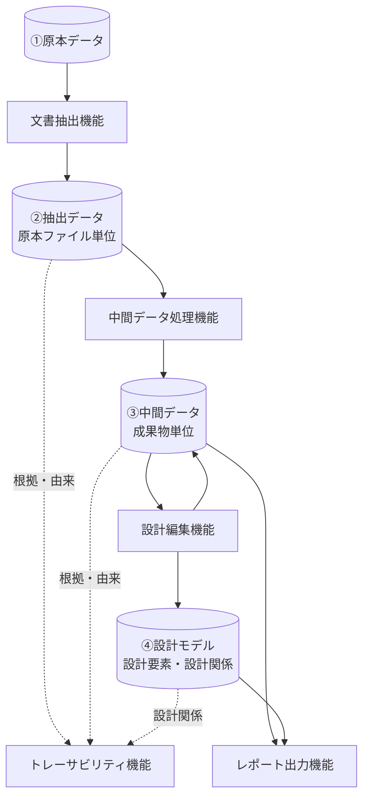
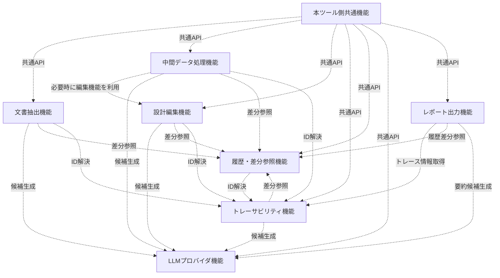
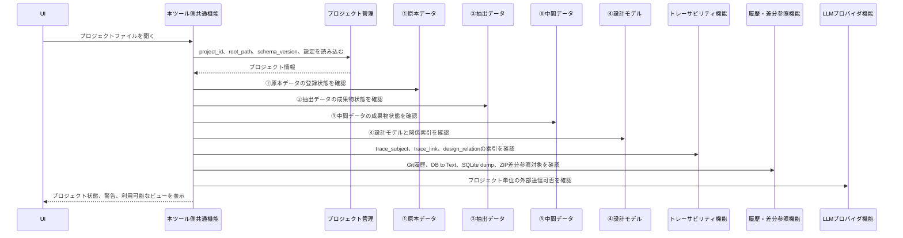
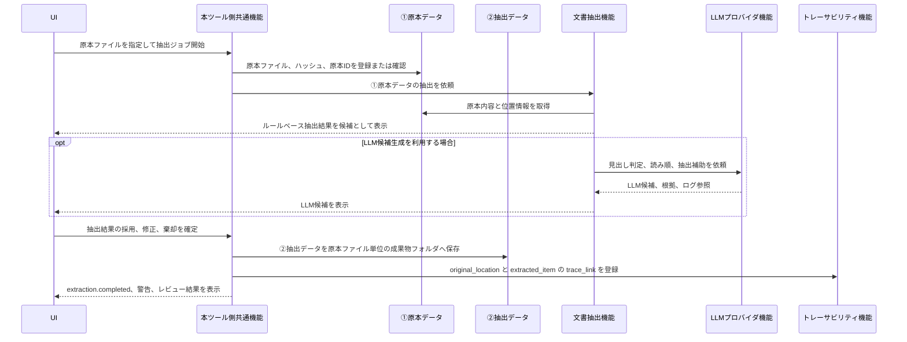
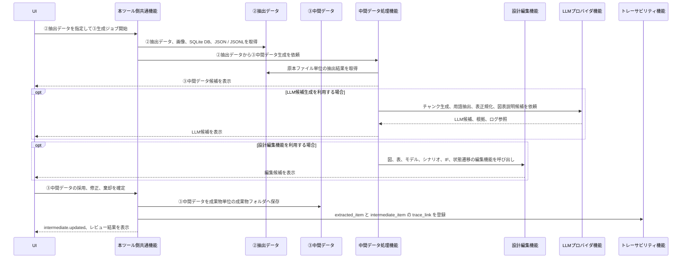
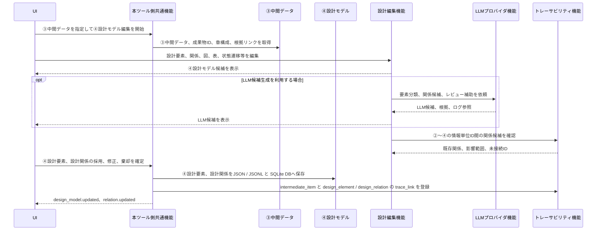
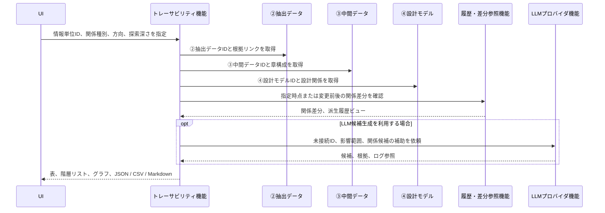
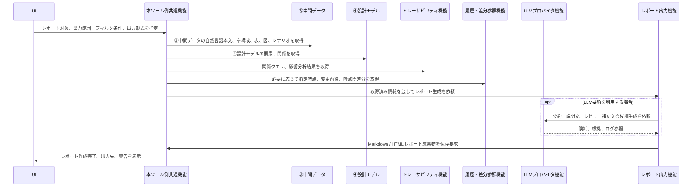
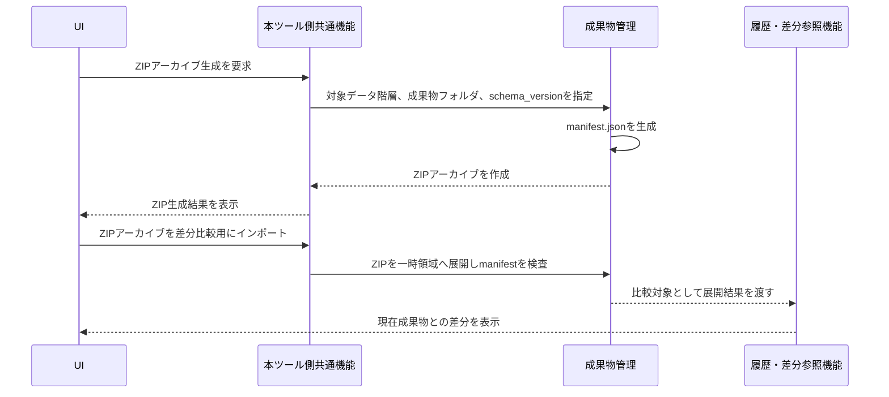

# 機能構成詳細設計書

## 1. 位置づけ

本書は、D2D の機能種別、機能間のデータ流れ、呼び出し関係、イベント連携を定義する。

本書は、[要求仕様書](srs.md) と [データ構造詳細設計書](sdd_data_structure.md) を正とし、機能設計案に含まれていた競合事項を解消した最終版である。個別機能の詳細は、機能ごとの `sdd_xxx.md` 形式の設計書に分離する。

対応する主な要求は以下である。

| 参照 | 内容 |
| --- | --- |
| `srs.md` 4章 | システム構成要求 |
| `srs.md` 5章 | 機能管理、プロジェクト管理、ジョブ管理、イベントバス、設定管理 |
| `srs.md` 6章 | データ管理要求 |
| `srs.md` 7〜17章 | 取込・抽出、中間データ、設計モデル、トレーサビリティ、編集、LLM、UI、CLI、出力、Git、外部記法 |
| `sdd_data_structure.md` | 4階層データ、正本、派生成果物、トレース、LLM実行参照、変更履歴の扱い |

---

## 2. 競合抽出と採用方針

添付された機能設計案と、正本である `srs.md` / `sdd_data_structure.md` を比較した結果、以下の競合を抽出した。本書では右列の方針を採用する。

| # | 競合箇所 | 機能設計案の内容 | 正本側の内容 | 採用方針 |
| --- | --- | --- | --- | --- |
| 1 | 機能管理 | 機能の有効化、無効化、有効化条件、未解決有効化条件検出を扱う | `srs.md` では機能有効/無効の切替要求を削除し、`CORE-001` は機能単位管理のみ | 有効/無効制御、無効化時の扱い、有効化条件は本書から削除する |
| 2 | 起動時フロー | ワークスペースまたはプロジェクトを開く | `srs.md` はワークスペースを設けず、プロジェクトファイルを開いて切り替える | プロジェクトファイルを開く方式に統一する |
| 3 | 成果物管理 | 通常成果物として `manifest` を更新・取得する | `srs.md` / `sdd_data_structure.md` は `manifest.json` をZIP生成時のみ作成する派生成果物とする | 通常保存時のmanifest更新・取得を削除し、ZIP生成時のみ扱う |
| 4 | 成果物内容 | ページ画像、スライド画像等の確認用レンダリング成果物を成果物に含める | `srs.md` では確認用レンダリング成果物は削除済み。成果物は JSON / JSONL、SQLite DB、画像を中心に扱う | ページ画像、スライド画像、確認用レンダリング成果物への言及をしない |
| 5 | ④設計モデル | レビュー状態や履歴保存を設計情報管理の中心に置く | `srs.md` は④設計モデルを JSON / JSONL と SQLite DB で設計要素・関係性を保存すると定義。レビュー・状態はデータ構造側の対象データ、レビュー記録、LLM実行参照で扱う | 機能構成では設計要素・関係性の保存を中心にし、レビュー記録はレビュー支援として扱う |
| 6 | 変更履歴 | 履歴管理機能がSQLite DB履歴差分確認を扱う | `sdd_data_structure.md` は `change_history` を正本DBに永続化せず、DB to Text、SQLite dump、Git log、Git diff等から派生表示する | 履歴・差分参照機能は正本を更新せず、Git履歴、DB to Text、SQLite dump、ZIP差分の参照機能として扱う |
| 7 | レポート出力 | Markdown、HTML、PDF、Word等を出力する | `srs.md` のレポート出力は Markdown / HTML を対象にしている | 本書ではMarkdown / HTML出力に限定する |
| 8 | モデル表現 | PlantUML / Mermaid / SysMLv2 を扱う | `srs.md` は SysMLv2、PlantUMLのテキスト形式と要素ID対応表を扱う | Mermaidを外し、PlantUML / SysMLv2 と要素ID対応表に限定する |
| 9 | トレース関係 | 設計モデル上の関係と根拠関係が混在しやすい | `sdd_data_structure.md` は `design_relation` と `trace_link` を分離する | 設計意味関係は `design_relation`、根拠・由来・変換関係は `trace_link` として扱う |
| 10 | LLM出力 | 各機能が候補を生成し正本へ反映する流れが曖昧 | `srs.md` / `sdd_data_structure.md` はLLM出力を候補とし、人間レビュー後のみ正本反映する | LLMプロバイダ機能は正本を直接更新しない禁止事項を明記する |

---

## 3. 本ツール側の共通機能

本ツール側の共通機能は、各機能を動かすためのホスト機能に絞る。機能の有効/無効切替は扱わず、機能登録、設定、権限、ジョブ、イベント、成果物、設計情報への安全なAPI境界を提供する。

| 共通機能 | 役割 | 機能への提供内容 |
| --- | --- | --- |
| 機能管理 | 機能単位の登録、機能種別、入出力、設定、権限、対応schema_versionを管理する | 機能定義の参照、権限チェック、設定参照、schema_version整合確認 |
| プロジェクト管理 | プロジェクトファイルを開き、利用するプロジェクトを切り替える | プロジェクトID、プロジェクトルート、設定、スキーマ情報の解決 |
| ジョブ管理 | 長時間処理、進捗、失敗状態、条件付き再実行を扱う | ジョブ起動、進捗通知、ジョブログ保存、再実行条件の保持 |
| 成果物管理 | ①原本、②抽出データ、③中間データ、ZIPアーカイブ、差分比較用インポートを扱う | 成果物フォルダ読込・保存、成果物ID解決、ZIP生成、ZIP差分比較用インポート |
| 設計情報管理 | ④設計モデルの設計要素、設計関係、関係グラフ索引を扱う | 設計要素・関係の読込・更新、整合性確認、Graph Projection生成対象の管理 |
| トレース管理 | `trace_subject` / `trace_link` による根拠・由来・変換関係を扱う | トレース対象解決、根拠リンク管理、設計関係と根拠関係の分離 |
| LLM実行管理 | LLM実行証跡、プロンプト、応答、入力参照を扱う | `llm_run_ref` 登録、ログ参照、APIキー等の機密情報除外 |
| イベント通知 | 機能間の疎結合な通知を扱う | 取込完了、抽出完了、成果物更新、設計モデル更新、関係更新等のイベント購読・発行 |

---

## 4. 機能種別

本ツールは、以下の機能種別を持つ。各機能は、共通機能を経由して成果物、設計モデル、設定、ログへアクセスし、直接ファイルI/OやDB更新を行わない。

| 機能種別 | 主責務 | 主な入力 | 主な出力 | 主に利用する共通機能 | 詳細設計書 |
| --- | --- | --- | --- | --- | --- |
| 文書抽出機能 | ①原本データから、原本ファイル単位の②抽出データを生成する | ①原本データ、抽出設定 | ②抽出データ、抽出ログ、画像リソース | プロジェクト管理、ジョブ管理、成果物管理、イベント通知、必要に応じてLLM実行管理 | `sdd_extractor.md` |
| 中間データ処理機能 | ②抽出データを成果物単位に統合し、③中間データを生成・整理する | ②抽出データ、既存③中間データ、成果物定義 | ③中間データ、チャンク、用語候補、正規化表、図表説明候補 | ジョブ管理、成果物管理、トレース管理、イベント通知、必要に応じてLLM実行管理、設計編集機能 | `sdd_intermediate_processing.md` |
| 設計編集機能 | ③中間データおよび④設計モデルを対象に、設計内容の編集、検索、レビュー補助、モデル表現編集を行う | ③中間データ、④設計モデル、用語、レビュー記録 | 更新済み③中間データ、④設計要素、設計関係、PlantUML / SysMLv2テキスト、要素ID対応表 | 成果物管理、設計情報管理、トレース管理、イベント通知、必要に応じてLLM実行管理 | `sdd_design_editing.md` |
| トレーサビリティ機能 | ②抽出データ、③中間データ、④設計モデルの情報単位IDに対して、関係表示、関係クエリ、影響分析を行う | `trace_subject`、`trace_link`、`design_relation`、②③④のID | 関係クエリ結果、表、階層リスト、グラフ、JSON / CSV / Markdown | トレース管理、設計情報管理、成果物管理、イベント通知、必要に応じてLLM実行管理 | `sdd_trace.md` |
| 履歴・差分参照機能 | Git履歴、DB to Text、SQLite dump、ZIP差分から変更前後を参照する | Git履歴、DB to Text、SQLite dump、ZIPアーカイブ、②③④成果物 | Diffビュー、差分結果、履歴参照ビュー | 成果物管理、設計情報管理、トレース管理、イベント通知 | `sdd_history_management.md` |
| LLMプロバイダ機能 | LLMによる候補生成、要約、分類、関係候補生成を提供する | source-groundedな入力チャンク、プロンプト、プロジェクト設定 | 候補情報、LLM実行参照、プロンプトログ、応答ログ | LLM実行管理、ジョブ管理、イベント通知 | `sdd_llm_provider.md` |
| レポート出力機能 | ③中間データから原本に近い文書風レポートを生成する | ③中間データ、設計要素、トレース情報、フィルタ条件 | Markdown / HTML レポート | 成果物管理、設計情報管理、トレース管理、履歴・差分参照機能 | `sdd_report.md` |

---

## 5. データ流れ

### 5.1 主要データフロー

| データ流れ | ルール |
| --- | --- |
| ①原本データから②抽出データ | 文書抽出機能が、原本ファイル単位で②抽出データを生成する |
| ②抽出データから③中間データ | 中間データ処理機能が、②抽出データを入力として、成果物単位に統合・整理した③中間データを生成する |
| ③中間データの編集 | 設計編集機能が、③中間データ上の図、表、モデル、シナリオ、IF、状態遷移等を編集する |
| ③中間データから④設計モデル | 設計編集機能または中間データ処理機能が、③中間データの設計内容を根拠として④設計モデル候補を作成し、人間レビュー後に④正本へ反映する |
| ②〜④のID付与 | ②抽出データ、③中間データ、④設計モデルの情報単位にはIDを付与し、トレース分析とDB to Text出力の対象にする |
| 設計意味関係 | ④設計モデル上の意味関係は `design_relation` として扱う |
| 根拠・由来・変換関係 | 原本、②抽出データ、③中間データ、④設計モデル間の根拠・由来・変換関係は `trace_subject` / `trace_link` として扱う |

### 5.2 正本と派生成果物

| 対象 | 正本/派生 | 扱い |
| --- | --- | --- |
| ②抽出データ | 正本 | 原本ファイル単位の成果物フォルダに JSON / JSONL、SQLite DB、画像として保存する |
| ③中間データ | 正本 | 成果物単位の成果物フォルダに JSON / JSONL、SQLite DB、画像として保存する |
| ④設計モデル | 正本 | JSON / JSONL と SQLite DB を組み合わせて、設計要素と関係性を保存する |
| manifest.json | 派生成果物 | ZIPアーカイブ生成時のみ作成する |
| DB to Text | 派生成果物または一時成果物 | ②③④に共通する差分表示、LLM入力、Git履歴確認用の出力とする |
| SQLite dump | 派生成果物または一時成果物 | 差分表示、履歴参照、調査用に生成する |
| Graph Projection | 索引または派生成果物 | 関係探索、影響分析、可視化用に生成する |
| change_history_view | 派生ビュー | DB正本に永続化せず、Git、DB to Text、SQLite dump等から生成する |

---

## 6. 呼び出し関係

| 呼び出し関係 | ルール |
| --- | --- |
| 共通API境界 | 各機能は、本ツール側共通機能を経由して成果物、設計モデル、設定、ログへアクセスする |
| 中間データ処理から設計編集 | 中間データ処理機能は、③中間データを生成・整理する過程で、必要に応じて設計編集機能を呼び出せる |
| LLMプロバイダの横断利用 | LLMプロバイダ機能は、各機能から候補生成用途で呼び出せる。LLM出力は候補であり、②③④の正本を直接更新しない |
| 履歴・差分参照の横断利用 | 履歴・差分参照機能は、Git履歴、DB to Text、SQLite dump、ZIPアーカイブを用いて変更前、特定時点、時点間差分を参照する |
| トレーサビリティの横断利用 | トレーサビリティ機能は、②抽出データ、③中間データ、④設計モデルの情報単位IDを対象に、関係表示、関係クエリ、影響分析を実行する |
| レポート出力 | レポート出力機能は、③中間データを中心に、必要に応じて④設計モデル、トレース情報、履歴差分を参照し、Markdown / HTML を生成する |

---

## 7. 禁止事項

| 禁止事項 | 理由 |
| --- | --- |
| 文書抽出機能が③中間データまたは④設計モデルを直接更新すること | ②抽出データ、③中間データ、④設計モデルの責務を分離するため |
| 中間データ処理機能が文書抽出機能の実装に依存すること | ②抽出データの成果物契約だけで処理できるようにするため |
| LLMプロバイダ機能が②/③/④の正本を直接更新すること | LLM出力は候補であり、人間レビュー前に確定させないため |
| トレーサビリティ機能が設計要素や中間データ本文を直接編集すること | トレースはID間の根拠・由来・関係管理と分析を行う機能であり、各データ階層の編集責務ではないため |
| 履歴・差分参照機能が成果物フォルダ、SQLite DB、JSON / JSONLの正本を直接上書きすること | 履歴・差分参照は比較・参照機能であり、正本成果物の更新責務を持たないため |
| 通常成果物フォルダ保存時にmanifestを正本として更新すること | manifestはZIPアーカイブ生成時のみ作成する派生成果物であるため |
| `change_history` をDB正本として永続化すること | 変更履歴はDB to Text、SQLite dump、Git log、Git diff等から派生表示するため |

---

## 8. 代表的な処理フロー

本章のシーケンス図では、処理主体となるUI、ホスト機能、機能に加えて、データライフラインとして①原本データ、②抽出データ、③中間データ、④設計モデルを明示する。

### 8.1 プロジェクトファイルを開く

### 8.2 原本から②抽出データを生成する

### 8.3 ②抽出データから③中間データを生成する

### 8.4 ③中間データから④設計モデルを編集する

### 8.5 トレース分析

### 8.6 レポート作成

### 8.7 ZIPアーカイブ生成と差分比較用インポート

---

## 9. イベント連携

| イベント | 発行元 | 主な購読先 | 用途 |
| --- | --- | --- | --- |
| `project.opened` | プロジェクト管理 | UI、各機能 | プロジェクトファイル読込完了通知 |
| `source.imported` | 文書抽出機能 | 本ツール側共通機能、UI | 原本取込完了通知 |
| `extraction.completed` | 文書抽出機能 | 本ツール側共通機能、UI、トレーサビリティ機能、履歴・差分参照機能 | ②抽出データ生成通知 |
| `artifact.updated` | 本ツール側共通機能 | UI、中間データ処理機能、トレーサビリティ機能、履歴・差分参照機能 | 成果物フォルダ更新通知、差分参照対象の更新通知 |
| `intermediate.updated` | 中間データ処理機能 | 本ツール側共通機能、UI、トレーサビリティ機能、履歴・差分参照機能 | ③中間データ更新通知 |
| `design_model.updated` | 設計編集機能 | UI、トレーサビリティ機能、履歴・差分参照機能 | ④設計モデル更新通知 |
| `relation.updated` | 設計編集機能、トレーサビリティ機能 | UI、履歴・差分参照機能 | ②〜④の情報単位ID間の関係更新通知 |
| `llm.candidate.generated` | LLMプロバイダ機能 | UI、候補生成元の機能 | LLM候補生成通知 |
| `archive.created` | 成果物管理 | UI、履歴・差分参照機能 | ZIPアーカイブ生成通知 |
| `archive.imported` | 成果物管理 | UI、履歴・差分参照機能 | ZIPアーカイブの差分比較用インポート通知 |
| `report.generated` | レポート出力機能 | UI、成果物管理 | Markdown / HTML レポート生成通知 |

---

## 10. 拡張時のルール

| ID | ルール |
| --- | --- |
| FUNC-020 | 新しい機能は、対応する機能種別、入力、出力、発行イベント、購読イベントを設計書に定義すること |
| FUNC-021 | 機能は、本ツール側共通機能を経由して成果物、設計モデル、設定、ログへ安全なAPI境界を通じてアクセスすること |
| FUNC-022 | 設計モデルまたはトレースを更新する機能は、更新対象、根拠リンク、レビュー記録、差分確認の扱いを定義すること |
| FUNC-023 | LLMを利用する機能は、LLM出力が候補であり、正本を直接更新しないことを明示すること |
| FUNC-024 | 新しい関係種別を追加する場合は、既存5種で表現できない理由、UI表示、検索・分析での利用目的、レビュー手順を定義すること |
| FUNC-025 | 機能間の新しい直接連携を追加する場合は、成果物、設計情報、トレース情報を介した疎結合で表現できない理由を設計書に明記すること |
| FUNC-026 | 新しい派生成果物を追加する場合は、正本、派生成果物、索引、キャッシュ、一時ファイルのいずれかを明示すること |
| FUNC-027 | 通常成果物フォルダに正本ではない説明ファイルを追加する場合は、manifestとの重複管理にならない理由を明記すること |

---

## 11. 要求・データ構造との対応

| 正本側の要求・設計 | 本書での対応 |
| --- | --- |
| `CORE-001` | 機能管理を、機能単位の登録・契約・設定・権限管理として定義 |
| `CORE-011` | 起動時フローを、プロジェクトファイルを開く方式に統一 |
| `CORE-020〜024` | 各生成・更新処理をジョブ管理経由で実行する設計に反映 |
| `CORE-030〜032` | イベント連携を `project.opened`、`extraction.completed`、`intermediate.updated` 等として定義 |
| `DATA-001〜009` | ②抽出データ、③中間データを成果物フォルダとZIPアーカイブ対象として扱う |
| `DATA-010〜011` | ④設計モデルをJSON / JSONL と SQLite DBで保存し、関係探索にはGraphDBまたは関係グラフ索引を利用可能とする |
| `DATA-020〜024` | DB to Textを②③④共通の派生成果物または一時成果物として扱う |
| `DATA-030〜033` | ZIP生成時のみmanifestを作成し、差分比較用インポートを履歴・差分参照機能で扱う |
| `sdd_data_structure.md` の `design_relation` | 設計意味関係の保存・影響分析対象として扱う |
| `sdd_data_structure.md` の `trace_subject` / `trace_link` | 根拠・由来・変換関係の統一ハンドルとして扱う |
| `sdd_data_structure.md` の `llm_run_ref` | LLM候補生成の実行証跡として扱う |
| `sdd_data_structure.md` の `change_history_view` | DB正本ではなく派生ビューとして履歴・差分参照機能が扱う |
