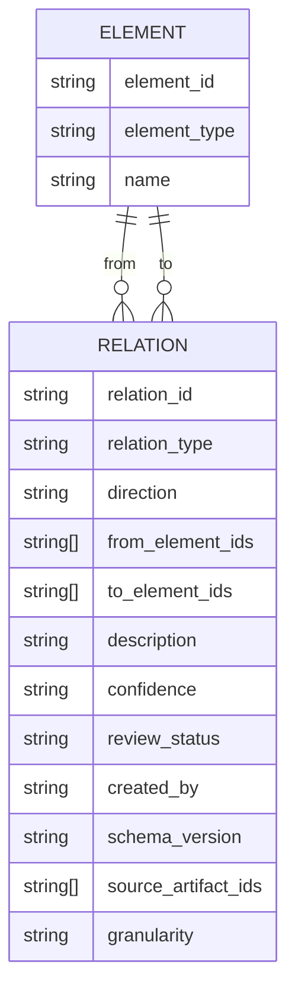
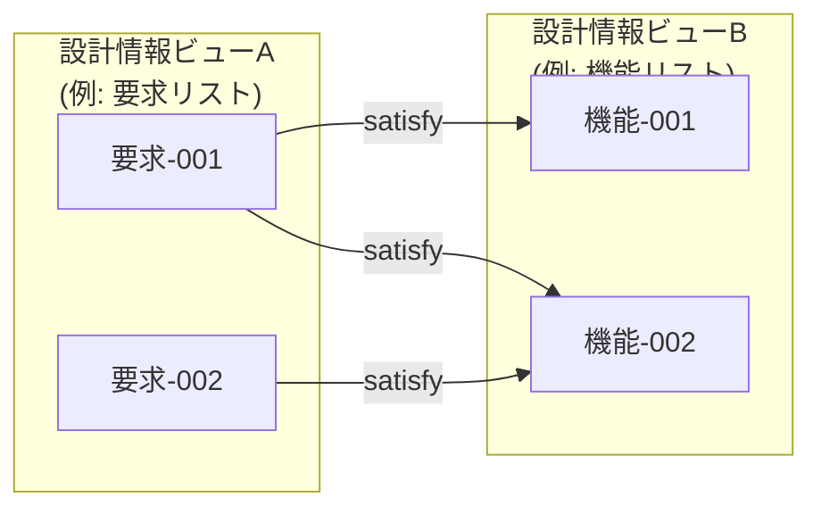

# トレーサビリティ詳細設計書

## 位置づけ

本ドキュメントは、`docs/srs.md` の「10. トレーサビリティ要求」に対応する詳細設計を定義する。

`srs.md` の 10.1〜10.3（マトリクス表示・トレース分析・関係性クエリの定義）を前提とし、データモデル、UI、マトリクス、検索、履歴、性能、整合性の設計を定義する。

| セクション | 内容 |
| --- | --- |
| [1. トレース関係データモデル](#1-トレース関係データモデル) | 多対多・方向・関係種別・スキーマバージョン等 |
| [2. トレース表示・編集UI](#2-トレース表示編集ui) | コネクタ表示・Undo/Redo・API境界等 |
| [3. トレースマトリクス詳細](#3-トレースマトリクス詳細) | セル操作・フィルタ・同期・大規模対応等 |
| [4. トレース検索・履歴・プロジェクト連携](#4-トレース検索履歴プロジェクト連携) | 横断検索・過去版復元・プロジェクト保存 |
| [5. トレース性能・信頼性設計](#5-トレース性能信頼性設計) | 描画最適化・保存競合・LLM候補管理等 |

---

## 1. トレース関係データモデル

トレース関係は、②抽出データ、③中間データ、④設計モデルの情報単位ID間に定義される有向または無向の関係であり、設計情報ストアまたは GraphDB / 関係グラフ索引で管理する。開発フェーズ間の成果物トレーサビリティでは、③中間データの成果物IDを基準単位とし、必要に応じて成果物配下の②/③/④の情報単位IDへ展開する。

**関係の基本構造**



| ID        | 設計内容 |
| --------- | -------- |
| TRACE-030 | トレース関係は、1対1だけでなく、1対多、多対1、多対多の関係を表現できること |
| TRACE-031 | 関係は一意な `relation_id`、関係種別、方向、関係元要素ID群、関係先要素ID群、根拠成果物ID群、粒度、メモ、作成日時、更新日時を持つこと |
| TRACE-032 | 関係元・関係先は、②抽出データ、③中間データ、④設計モデルに含まれる要求、制約、機能、構造、振舞、状態、IF、データモデル、検証、用語、設計判断、原本根拠のいずれも参照できること |
| TRACE-033 | 多対多 relation は、表示・分析時に必要に応じて要素間リンクへ展開できること |
| TRACE-034 | 関係種別は `parent_child`、`based_on`、`satisfy`、`verify`、`depend` を基本とし、それ以外の関係種別は用途、表示方法、レビュー手順を定義したうえで拡張できること |
| TRACE-035 | 関係の方向は、無方向、左から右（→）、右から左（←）、双方向（↔）を区別できること |
| TRACE-036 | 関係には、確度、レビュー状態、作成者種別（人間 / LLM / ルール）、根拠リンク、未決メモを保持できること |
| TRACE-037 | トレース関係ファイルまたはDBレコードには `schema_version` を保持し、schema migration に対応できること |
| TRACE-038 | 存在しない要素IDを参照する関係、重複関係、循環関係、方向不整合を検出できること |
| TRACE-039 | 関係は、根拠となる②抽出データID、③中間データの成果物ID、章節ID、④設計モデルID、および関係が成立する粒度を保持できること |

---

## 2. トレース表示・編集UI

### 2.1 コネクタ表示



| ID        | 設計内容 |
| --------- | -------- |
| TRACE-040 | 2つ以上の設計情報ビューを並べ、要素間のトレース関係を線またはコネクタで可視化できること |
| TRACE-041 | コネクタは要素の表示位置に追従し、スクロール、リサイズ、折りたたみ、フィルタ時に再計算されること |
| TRACE-042 | 選択中の要素に関連する上流・下流要素とコネクタを強調表示できること |
| TRACE-043 | トレース表示は、全体、ファイル単位、③成果物単位、ビュー単位、要素単位、関係種別単位で表示・非表示を切り替えられること |
| TRACE-044 | 不要なコネクタを一時的にミュートできること |
| TRACE-045 | オフスクリーンにある関係先が存在する場合、方向と件数を示す補助表示を提供できること |

### 2.2 トレース編集

| ID        | 設計内容 |
| --------- | -------- |
| TRACE-046 | UI上で関係元要素と関係先要素を選択し、トレース関係を作成できること |
| TRACE-047 | 既存関係の種別、方向、メモ、レビュー状態、確度を編集できること |
| TRACE-048 | 既存関係を削除または棄却できること |
| TRACE-049 | トレース編集操作は Undo / Redo 可能であること |
| TRACE-050 | トレース編集操作は履歴として保存し、誰が、いつ、どの関係を追加・変更・削除したか確認できること |
| TRACE-051 | トレース表示が大量化した場合でも、要素本文の編集操作を妨げないこと |
| TRACE-052 | renderer から直接ファイルI/Oを行わず、保存・読込はアプリ基盤の安全なAPI境界を通じて実行すること |

---

## 3. トレースマトリクス詳細

**トレースマトリクスの構造**

```
          機能-001  機能-002  機能-003
要求-001    ●        ●
要求-002              ●        ●
要求-003    ●                  ●
```

- ● = 関係あり（種別・方向・確度はセルに付加情報として表示）
- 空 = 関係なし

| ID        | 設計内容 |
| --------- | -------- |
| TRACE-060 | 任意の2つの要素集合を行・列に割り当てたトレースマトリクスを表示できること |
| TRACE-061 | 行・列には、要素ID、名称、種別、レビュー状態、成熟度、タグを表示できること |
| TRACE-062 | セルには、関係有無、関係種別、方向、確度、レビュー状態、メモ有無を表示できること |
| TRACE-063 | セル操作により関係を追加、削除、種別変更、方向変更、メモ編集できること |
| TRACE-064 | 複数セルの一括編集、行・列単位、③成果物単位、開発フェーズ単位のフィルタ、未接続要素の抽出ができること |
| TRACE-065 | 要素種別、関係種別、レビュー状態、確度、タグ、未確認、要修正でマトリクスをフィルタできること |
| TRACE-066 | マトリクス編集結果は、関係グラフ、階層リスト、トレース分析結果へ同期されること |
| TRACE-067 | マトリクスは別ビューまたは別ウィンドウとして開けること |
| TRACE-068 | 複数ビューで同じ関係を編集した場合、変更通知、再読込、競合検出を行えること |
| TRACE-069 | マトリクスを Markdown、CSV、TSV、JSONL、Excel 形式で出力できること |
| TRACE-070 | 行・列数が各 1,000 以上の大規模マトリクスでは、仮想スクロール、遅延描画、差分更新を利用できること |

> **大規模マトリクスの目安**: 行 × 列の組み合わせが 10,000 セルを超える場合を大規模と見なし、描画最適化を適用すること。

---

## 4. トレース検索・履歴・プロジェクト連携

### 4.1 トレース横断検索

| ID        | 設計内容 |
| --------- | -------- |
| TRACE-080 | 要素ID、要素本文、関係種別、メモ、タグ、レビュー状態を対象にトレース横断検索できること |
| TRACE-081 | 正規表現検索、完全一致検索、部分一致検索を選択できること |
| TRACE-082 | トレース深さを指定して、上流または下流の関連要素を探索できること |
| TRACE-083 | 検索結果から該当要素、該当関係、該当マトリクスセルへジャンプできること |

### 4.2 変更履歴・復元

| ID        | 設計内容 |
| --------- | -------- |
| TRACE-084 | 関係変更の履歴を保持し、ZIPアーカイブまたはDB to Text出力との過去版差分を表示できること |
| TRACE-085 | 過去版の関係を参照し、必要に応じて現在の編集中状態へ取り込めること。ただし正本反映はUIの編集確定操作後に行うこと |

### 4.3 プロジェクト連携

| ID        | 設計内容 |
| --------- | -------- |
| TRACE-086 | プロジェクト単位で、対象原本、抽出データ、中間データ、設計モデル、トレース関係、表示設定を束ねて保存できること |
| TRACE-086A | ③中間データは開発フェーズごとの成果物単位で管理し、複数原本ファイルから統合された成果物であっても一つのトレース対象として扱えること |
| TRACE-087 | プロジェクト再読込時に、開いていた主要ビュー、選択対象、トレース表示設定を復元できること |
| TRACE-088 | 外部変更された要素ファイルまたは関係ファイルを検知し、再読込または競合解消を選択できること |
| TRACE-089 | トレース関係の保存形式は、DB管理とDB to Text出力の双方で再現可能であり、DB to Text出力は差分表示やLLM入力に利用できること |

---

## 5. トレース性能・信頼性設計

### 5.1 描画性能

| ID        | 設計内容 |
| --------- | -------- |
| TRACE-090 | 表示中の要素数が 500 以下の場合、一覧表示・コネクタ表示・マトリクス表示のレスポンスタイムが 1 秒以内であること。要素数がそれ以上の場合は、段階的描画または遅延ロードで対応すること |
| TRACE-091 | コネクタ描画は、表示中要素、選択中要素、フィルタ条件に応じて描画対象を削減できること |
| TRACE-092 | 関係リンク数が多い場合、SVG、Canvas、WebGL等の描画方式を切り替えられる設計とすること |

### 5.2 保存・整合性

| ID        | 設計内容 |
| --------- | -------- |
| TRACE-093 | トレース関係保存時には、スキーマ検証、参照先存在確認、パストラバーサル防止、破損時復旧を行えること |
| TRACE-094 | 保存失敗時には、UIにエラーを通知し、未保存状態を保持すること |
| TRACE-095 | 複数ウィンドウまたは複数ビューから同じ関係を編集する場合、保存競合を検出できること |

### 5.3 LLM候補の扱い

| ID        | 設計内容 |
| --------- | -------- |
| TRACE-096 | LLMが生成した関係候補は、人間が採用するまで確定トレースとして扱わないこと |
| TRACE-097 | LLMが生成した関係候補には、入力チャンク、プロンプト、モデル、確度、根拠リンクを紐づけられること |

### 5.4 テスト・検証

| ID        | 設計内容 |
| --------- | -------- |
| TRACE-098 | トレース設計に関する主要処理（関係CRUD・整合性検証・マトリクス同期・履歴保存）は、自動テストまたは検証用データで再現確認できること |
