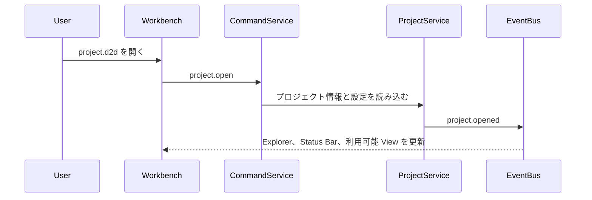
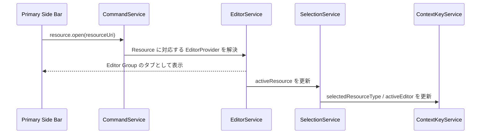
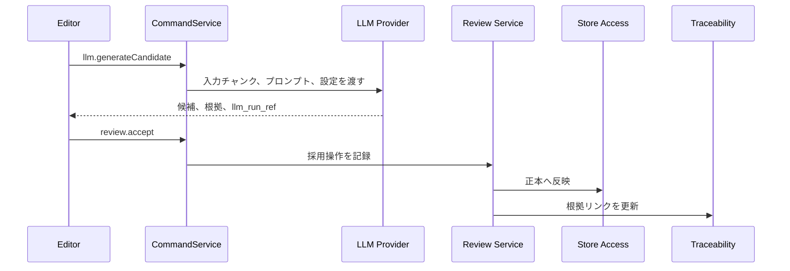

# D2D UI/UX 設計書

## 1. 目的

D2D の UI/UX を VSCode 風の Workbench 型 UX として設計するための方針、画面構成、ビュー、操作モデル、状態連携、共通 UI パターンを定義する。

D2D は、原本文書、抽出データ、中間データ、設計モデル、トレース、差分、ログを横断して扱う設計支援ツールである。そのため、単一画面遷移型の Web アプリではなく、複数の作業対象を探索し、開き、並べ、編集し、補助情報を確認しながら作業できる Workbench 型 UX を採用する。

---

## 2. UI/UX 基本方針

### 2.1 Workbench 型 UX

| 領域 | 目的 |
| --- | --- |
| Navigation | プロジェクト、原本、成果物、設計要素、トレース対象を探す |
| Editor | 対象 Resource を開いて閲覧、編集、レビューする |
| Auxiliary View | 現在対象の詳細、根拠、関係、候補、ログを確認する |
| Command | 操作をメニュー、ボタン、ショートカット、コマンドパレットから一貫して実行する |
| Context | 選択中の対象、アクティブ Editor、ジョブ状態、レビュー状態に応じて UI を変える |

### 2.2 D2D 固有の UX 原則

| 原則 | 内容 |
| --- | --- |
| IDE 風でコンパクト | Web サイト風の余白・カード中心構成ではなく、IDE のような高密度で反復作業しやすい画面にする |
| Resource 中心(オブジェクト指向型UI) | 画面名ではなく、原本、抽出要素、中間データ、設計要素、トレース結果、差分、設定などの Resource を開く |
| 探索と編集の分離 | Activity Bar / Side Bar は探索・選択、Editor Area は主作業、Panel は結果・ログ・問題表示に使う |
| Command 集約 | 主要操作は Command として定義し、メニュー、ツールバー、コンテキストメニュー、ショートカットから同じ処理を呼ぶ |
| Human-in-the-loop | LLM 出力は候補として表示し、採用、修正、棄却を人間が確定する |
| 根拠の常時参照 | 編集対象から、原本位置、抽出データ、中間データ、設計モデル、LLM ログ、レビュー記録へ辿れるようにする |
| 長時間処理の非同期化 | 抽出、LLM 実行、DB to Text、差分生成、レポート生成は Job として扱い、UI をブロックしない |
| レイアウト復元 | ユーザーが作ったタブ、分割、Side Bar、Panel の状態をプロジェクトまたはユーザー設定として復元できる |

### 2.3 テーマ・アイコン方針

D2D のテーマは、表示モードとカラーテーマを分けて扱う。表示モードはライト、ダーク、システム設定連動を扱い、カラーテーマは Serendie Design System の5テーマを扱う。

| 区分 | 選択肢 | 設計方針 |
| --- | --- | --- |
| 表示モード | `light`、`dark`、`system` | 明暗の切替として扱い、OS 設定連動を可能にする |
| カラーテーマ | `konjo`、`asagi`、`sumire`、`tsutsuji`、`kurikawa` | アプリ全体のアクセント、選択状態、強調、状態色のベースとして扱う |
| 適用範囲 | Workbench 全体 | Title Bar、Activity Bar、Side Bar、Editor、Panel、Status Bar、Dialog、Notification に一貫して適用する |
| 保存単位 | User Settings / Project Settings | 既定はユーザー設定とし、必要に応じてプロジェクト単位の推奨テーマを保持できる |

テーマ適用はデザイントークンを介して行い、個別コンポーネントに固定色を直書きしない。状態色、レビュー状態、エラー、警告、成功、選択中、未保存状態は、各テーマとライト／ダークの双方で識別可能なコントラストを確保する。

UI アイコンは、Serendie Design System の `serendie/serendie-symbols` をベースに選択する。Activity Bar、Toolbar、Context Menu、Status Bar、Panel タブ、通知、レビュー操作のアイコンは、意味が一致する Serendie Symbols を優先し、同一概念には同一アイコンを使う。用途に一致するアイコンがない場合は、近い意味のアイコンを暫定利用するのではなく、テキストラベルまたはプロジェクト内の追加アイコン候補として扱う。

---

## 3. 全体レイアウト

Workbench は、Title Bar、Activity Bar、Primary Side Bar、Editor Area、Secondary Side Bar、Panel、Status Bar で構成する。

```text
┌──────────────────────────────────────────────────────────────────────────┐
│ Title Bar / Command Center                                               │
│ D2D  Project: <name>  schema: <version>  [Command Palette / Quick Pick]  │
├────┬────────────────────┬─────────────────────────────────┬─────────────┤
│    │ Primary Side Bar   │ Editor Area                     │ Secondary   │
│ A  │                    │                                 │ Side Bar    │
│ c  │ ・Explorer         │ ┌────────────┬────────────┐     │             │
│ t  │ ・Search           │ │ Tab Group  │ Tab Group  │     │ ・Property  │
│ i  │ ・Trace            │ │ Resource A │ Resource B │     │ ・Evidence  │
│ v  │ ・Jobs             │ └────────────┴────────────┘     │ ・Relation  │
│ i  │ ・Reports          │                                 │ ・LLM候補   │
│ t  │                    │                                 │ ・Review    │
│ y  │                    │                                 │             │
├────┴────────────────────┴─────────────────────────────────┴─────────────┤
│ Panel: Problems | Output | Jobs | Search Results | Validation | Logs      │
├──────────────────────────────────────────────────────────────────────────┤
│ Status Bar: project | active resource | job state | warnings | LLM mode    │
└──────────────────────────────────────────────────────────────────────────┘
```

| パーツ | 役割 | D2D での用途 |
| --- | --- | --- |
| Title Bar / Command Center | 全体状態とコマンド入口 | プロジェクト名、schema_version、外部送信可否、コマンドパレット入口 |
| Activity Bar | 作業文脈の切替 | Explorer、Search、Trace、Jobs、Reports、Settings 等 |
| Primary Side Bar | 探索・選択・絞り込み | プロジェクトツリー、原本一覧、抽出結果一覧、設計要素ツリー、検索条件 |
| Editor Area | 主作業 | 原本、抽出データ、中間データ、設計モデル、マトリクス、グラフ、Diff、設定をタブで開く |
| Editor Group | 分割単位 | 左右・上下分割、タブ移動、比較表示、プレビュータブ |
| Secondary Side Bar | 現在対象の補助情報 | プロパティ、根拠、トレース、LLM 候補、レビュー状態 |
| Panel | 実行結果・問題・ログ | Problems、Output、Jobs、Validation Results、LLM Logs |
| Status Bar | 軽量な常時状態表示 | ジョブ状態、警告数、外部 LLM 送信可否、Git 差分状態、選択 Resource |

---

## 4. 内部 UX モデル

### 4.1 Resource

Resource は、D2D 上で開く、参照する、編集する対象の抽象概念である。Editor Area は画面ではなく Resource を開く。

| Resource 種別 | 例 | 主な Editor |
| --- | --- | --- |
| `project://` | `project://current` | Project Dashboard Editor |
| `original://` | `original://<original_file_id>` | Original Viewer |
| `extracted://` | `extracted://<extracted_item_id>` | Extracted Data Editor |
| `intermediate://` | `intermediate://<intermediate_item_id>` | Intermediate Document Editor |
| `design://` | `design://<design_element_id>` | Design Model Editor |
| `trace://` | `trace://query/<query_id>` | Trace Matrix / Graph Editor |
| `diff://` | `diff://<left>/<right>` | Diff Editor |
| `log://` | `log://job/<job_id>`、`log://llm/<llm_run_ref_id>` | Log Viewer |
| `settings://` | `settings://workspace` | Settings Editor |
| `report://` | `report://<report_job_id>` | Report Preview Editor |

### 4.2 Command

主要操作は Command として登録する。UI 部品は個別処理を直接持たず、Command を呼び出す。

| Command 例 | 用途 |
| --- | --- |
| `project.open` | `project.d2d` を開く |
| `resource.open` | Resource を Editor Area に開く |
| `resource.save` | 編集内容を正本へ保存する |
| `editor.split` | Editor Group を分割する |
| `job.startExtraction` | 原本抽出ジョブを開始する |
| `job.retry` | 失敗ジョブを条件付きで再実行する |
| `llm.generateCandidate` | LLM 候補を生成する |
| `review.accept` | 候補または編集内容を採用する |
| `review.reject` | 候補を棄却する |
| `trace.runQuery` | トレースクエリを実行する |
| `diff.open` | DB to Text または Git 差分を開く |
| `report.generate` | レポート生成ジョブを開始する |

### 4.3 Selection / Context / Event

UI パーツ間の連携は、直接参照ではなく Selection、Context、Event を介して行う。

```text
ユーザー操作
  ↓
Command 実行
  ↓
Service 呼び出し
  ↓
Selection / Context 更新
  ↓
Event 発行
  ↓
Editor / Side Bar / Panel / Status Bar 更新
```

| 概念 | 管理内容 | UI への影響 |
| --- | --- | --- |
| Selection | 選択 Resource、選択設計要素、選択範囲、アクティブ Editor | Secondary Side Bar、Status Bar、Context Menu を更新 |
| Context | `activeEditor`、`selectedResourceType`、`hasDirtyEditor`、`isJobRunning`、`llmExternalAllowed` 等 | Command の有効/無効、メニュー表示、ツールバー表示を制御 |
| Event | `resource.opened`、`resource.saved`、`selection.changed`、`job.updated`、`trace.updated` 等 | 関連ビューを疎結合に同期 |

---

## 5. Activity Bar と Primary Side Bar

Activity Bar は機能ボタン置き場ではなく、作業文脈の切替入口とする。

| Activity | Primary Side Bar の内容 | 主な Command |
| --- | --- | --- |
| Explorer | プロジェクト、①原本、②抽出データ、③中間データ、④設計モデルのツリー | `resource.open`、`project.open` |
| Search | 全階層検索、ID 検索、本文検索、用語検索 | `search.run`、`resource.open` |
| Trace | トレースクエリ条件、保存済みクエリ、未接続一覧 | `trace.runQuery`、`trace.openMatrix` |
| Jobs | 実行中、失敗、成功、警告付き完了ジョブ一覧 | `job.openLog`、`job.retry` |
| Reports | レポート定義、出力履歴、プレビュー対象 | `report.generate`、`report.openPreview` |
| History | Git 履歴、DB to Text、ZIP 差分比較対象 | `diff.open`、`history.openCommit` |
| Settings | アプリ設定、プロジェクト設定、LLM 設定、ショートカット | `settings.open` |

Primary Side Bar では探索、選択、絞り込みを行い、複雑な編集は Editor Area で実行する。

---

## 6. Editor Area

### 6.1 Editor Group と Tabs

| 状態 | 内容 |
| --- | --- |
| 開いている Resource | URI、表示名、Resource 種別、Editor Provider |
| アクティブタブ | 現在操作対象の Resource |
| 分割状態 | 左右分割、上下分割、分割比率 |
| 未保存状態 | 正本へ未反映の変更有無 |
| プレビュー状態 | 一時表示タブか、ピン留め済みタブか |
| レビュー状態 | 候補、レビュー中、採用、棄却、確定 |

### 6.2 Editor Provider

| Editor Provider | 対応 Resource | 主な表示 |
| --- | --- | --- |
| Original Viewer | `original://` | 原本プレビュー、位置情報、抽出対象ハイライト |
| Extracted Data Editor | `extracted://` | 抽出要素一覧、詳細、原本対照、レビュー操作 |
| Intermediate Document Editor | `intermediate://` | アウトライン、本文、図表、章節編集 |
| Design Model Editor | `design://` | 設計要素、関係、PlantUML / SysMLv2、根拠リンク |
| Trace Matrix Editor | `trace://matrix` | 行列形式の関係表示、未接続検出 |
| Trace Graph Editor | `trace://graph` | 関係グラフ、探索深さ、影響範囲 |
| Diff Editor | `diff://` | DB to Text、Git、ZIP 差分 |
| Log Viewer | `log://` | Job ログ、LLM ログ、エラー詳細 |
| Settings Editor | `settings://` | 設定、ショートカット、外部送信可否 |
| Report Preview Editor | `report://` | Markdown / HTML レポートプレビュー |

---

## 7. Secondary Side Bar

Secondary Side Bar は、現在の選択対象に依存する補助情報を表示する。

| タブ | 内容 |
| --- | --- |
| Properties | Resource、抽出要素、中間データ、設計要素の属性 |
| Evidence | 原本位置、抽出データ、③中間データ、LLM ログ、レビュー記録へのリンク |
| Relations | `trace_link`、`design_relation`、影響範囲、未接続情報 |
| Candidates | LLM 候補、採用、修正、棄却操作 |
| Review | レビュー状態、レビュー履歴、確定操作 |

Secondary Side Bar は現在対象の補助表示に限定し、全体探索や長い一覧操作は Primary Side Bar または Panel へ置く。

---

## 8. Panel

Panel は、主作業を支援する結果、問題、ログを表示する。

| Panel | 内容 |
| --- | --- |
| Problems | 検証エラー、未接続トレース、スキーマ不整合、抽出警告 |
| Output | 抽出、変換、レポート出力などの標準出力的ログ |
| Jobs | ジョブ進捗、待機中、実行中、成功、失敗、中断 |
| Search Results | 全文検索、ID 検索、用語検索の結果 |
| Validation Results | 設計モデル、トレース、DB to Text の検証結果 |
| LLM Logs | LLM 実行ログ、入力チャンク、応答、token 使用量 |

Status Bar の警告数やジョブ状態をクリックした場合は、対応する Panel を開く。

---

## 9. 画面・ビュー一覧

| ビュー ID | ビュー名 | SRS 要求 | Resource / Editor | 主な用途 |
| --- | --- | --- | --- | --- |
| V-01 | 原本ビュー | UI-010 | `original://` / Original Viewer | 原本ファイルのプレビュー、取込状態確認 |
| V-02 | 抽出データビュー | UI-011 | `extracted://` / Extracted Data Editor | 抽出結果一覧、原本対照、レビュー |
| V-03 | 中間データビュー | UI-012 | `intermediate://` / Intermediate Document Editor | 文書風表示、アウトライン編集、図表編集 |
| V-04 | 設計モデルビュー | UI-013 | `design://` / Design Model Editor | 設計要素、関係、モデル表現編集 |
| V-05 | トレースマトリクスビュー | UI-014 | `trace://matrix` / Trace Matrix Editor | 要素間関係のマトリクス表示、編集 |
| V-06 | 階層リスト間リンクビュー | UI-015 | `trace://list-link` / Trace List Editor | ②→③→④の対応関係表示 |
| V-07 | 関係グラフビュー | UI-016 | `trace://graph` / Trace Graph Editor | 設計要素・関係のグラフ可視化 |
| V-08 | Diff ビュー | UI-017 | `diff://` / Diff Editor | DB to Text、Git、ZIP 差分確認 |
| V-09 | LLM ログビュー | UI-018 | `log://llm` / Log Viewer | LLM 送受信ログ、入力チャンク、候補一覧 |
| V-10 | Git 履歴ビュー | UI-019 | `history://` / History Editor | Git コミット履歴、特定時点の参照 |
| V-11 | ストア閲覧ビュー | UI-020 | `store://` / Store Browser | SQLite DB、GraphDB、JSON / JSONL の閲覧 |
| V-12 | 設定ビュー | CORE-040〜046 | `settings://` / Settings Editor | アプリ設定、プロジェクト設定、LLM 設定 |
| V-13 | レポート設定ビュー | EXP-001〜006 | `report://config` / Report Editor | 出力対象、フィルタ、形式選択 |
| V-14 | 用語集ビュー | EDIT-050〜054 | `glossary://` / Glossary Editor | 用語一覧、定義編集、揺れ検出 |
| V-15 | 成果物統合ビュー | MID-001〜005 | `intermediate://compose` / Composition Editor | ②抽出データを③中間データへ割当・統合 |
| V-16 | ジョブ詳細ビュー | CORE-020〜024 | `log://job` / Job Log Viewer | 進捗、失敗理由、再実行条件の確認 |

---

## 10. 代表的な操作フロー

### 10.1 プロジェクトを開く



### 10.2 Resource を開く



### 10.3 LLM 候補を採用する



---

## 11. 主要ビュー構成方針

### 11.1 V-02 抽出データビュー

```text
┌──────────────────┬────────────────────────────────────┬──────────────┐
│ 抽出要素一覧     │ 抽出要素詳細                       │ Evidence     │
│ filter/search    │ text / table / figure / formula    │ Review       │
│ virtual list     ├────────────────────────────────────┤ Candidates   │
│                  │ 原本プレビュー                     │ Relations    │
└──────────────────┴────────────────────────────────────┴──────────────┘
```

| 領域 | 仕様 |
| --- | --- |
| 抽出要素一覧 | `item_type`、`review_status`、原本ファイル、警告有無で絞り込める |
| 抽出要素詳細 | テキスト、表、図、数式を原本忠実性を保って表示する |
| 原本プレビュー | original_location を用いて原本上の該当箇所を表示する |
| Secondary Side Bar | 根拠、LLM 候補、レビュー状態、trace_link を表示する |

### 11.2 V-03 中間データビュー

| 領域 | 仕様 |
| --- | --- |
| アウトライン | `intermediate_doc_node` の階層、順序、章節を編集する |
| 文書風 Editor | ③中間データを原本に近い文書として表示・編集する |
| 図表表示 | 図、表、説明文を本文と対応付けて表示する |
| Secondary Side Bar | 対応する②抽出データ、LLM 候補、レビュー記録を表示する |

### 11.3 V-04 設計モデルビュー

| 領域 | 仕様 |
| --- | --- |
| 設計要素ツリー | `element_type` と `parent_child` で階層表示する |
| 関係一覧 | `design_relation` を表形式で表示し、関係種別、方向、レビュー状態を編集する |
| モデル Editor | PlantUML / SysMLv2 テキストと要素 ID 対応表を表示する |
| Secondary Side Bar | 根拠中間データ、関連要素、未接続、影響範囲を表示する |

### 11.4 V-05 トレースマトリクスビュー

| 項目 | 仕様 |
| --- | --- |
| 行・列 | 要素種別、成果物、開発フェーズ、レビュー状態で絞り込める |
| セル | `relation_type`、方向、確信度、レビュー状態を表示する |
| セル詳細 | クリックで根拠リンク、設計関係、変更履歴を Secondary Side Bar に表示する |
| 未接続検出 | 要求未満足、検証未対応、根拠なし要素を Problems に表示できる |

### 11.5 V-07 関係グラフビュー

| 項目 | 仕様 |
| --- | --- |
| ノード | 設計要素、抽出要素、中間データを種別ごとに表現する |
| エッジ | `trace_link` と `design_relation` を区別して表示する |
| 探索 | 起点、方向、関係種別、深さを指定できる |
| 表示 | 階層レイアウトを基本とし、必要に応じて force-directed に切り替える |

### 11.6 V-15 成果物統合ビュー

②抽出データを③中間データへ割当・統合する専用 Editor とする。

| 操作 | 結果 |
| --- | --- |
| 抽出要素を章節へ割当 | `extracted_item` から `intermediate_item` への `trace_link` を作成する |
| 本文として取り込む | 抽出テキストを③中間データ本文へ挿入し、根拠リンクを保持する |
| リンクのみ作成 | 本文は変更せず、根拠リンクだけを作成する |
| 割当解除 | `trace_link` を削除し、抽出要素を未割当に戻す |
| LLM 章節提案 | 章節構成案と割当候補を候補として表示する |
| 採用 / 修正 / 棄却 | 人間レビュー後に③中間データと trace_link へ反映する |

---

## 12. 共通 UI パターン

| パターン | 仕様 |
| --- | --- |
| Command Palette | すべての主要 Command を検索・実行できる |
| Quick Pick | Resource、設計要素、ジョブ、検索結果、実行構成を軽量に選択できる |
| Context Menu | 選択対象と Context Key に応じて利用可能 Command を表示する |
| Toolbar | View または Editor 固有の頻出操作に限定する |
| Virtual Scroll | 大量一覧は仮想スクロール、遅延ロード、フィルタを使う |
| Dirty State | 未保存タブ、未反映候補、未確定レビューを明示する |
| Review Actions | LLM 候補や抽出候補には採用、修正、棄却を表示する |
| Job Progress | Status Bar と Jobs Panel に進捗、状態、警告、失敗理由を表示する |
| Notification | 完了、警告、失敗を短く通知し、詳細は Panel へ誘導する |
| Dialog | 削除、上書き、外部送信、競合解決など明示判断が必要な操作に限定する |
| Layout Persistence | タブ、分割、Side Bar、Panel、表示幅を復元できる |
| Theme | ライト / ダーク / システム設定連動の表示モードと、Serendie Design Systemの `konjo`、`asagi`、`sumire`、`tsutsuji`、`kurikawa` のカラーテーマをデザイントークンで切り替える |
| Icon | Serendie Symbols をベースに、用途と意味が一致するアイコンを選択し、同一概念には同一アイコンを使う |
| Keyboard Shortcut | Command に紐づけ、設定から変更できる |

---

## 13. キーショートカット初期案

| 操作 | Command | ショートカット |
| --- | --- | --- |
| Command Palette | `commandPalette.open` | `Ctrl+Shift+P` |
| Quick Open | `quickOpen.open` | `Ctrl+P` |
| 保存 | `resource.save` | `Ctrl+S` |
| タブを閉じる | `editor.close` | `Ctrl+W` |
| Editor 分割 | `editor.split` | `Ctrl+\` |
| Side Bar 表示切替 | `workbench.togglePrimarySideBar` | `Ctrl+B` |
| Panel 表示切替 | `workbench.togglePanel` | `Ctrl+@` |
| 検索 | `search.open` | `Ctrl+Shift+F` |
| 設計要素へ移動 | `quickOpen.goToDesignElement` | `F1` |
| LLM 候補採用 | `review.accept` | `Ctrl+Enter` |
| LLM 候補棄却 | `review.reject` | `Ctrl+Delete` |
| Undo | `edit.undo` | `Ctrl+Z` |
| Redo | `edit.redo` | `Ctrl+Y` |

---

## 14. アンチパターン

| アンチパターン | 回避方針 |
| --- | --- |
| Activity Bar に保存、実行、印刷などの操作ボタンを並べる | Activity Bar は作業文脈切替に限定する |
| Side Bar に複雑な編集フォームを詰め込む | Side Bar は探索・選択・絞り込みに限定し、編集は Editor Area で行う |
| Editor と Panel の責務を混在させる | 主作業は Editor、結果・ログ・問題一覧は Panel に置く |
| UI コンポーネント同士を直接参照する | Selection、Context、Event、Command を介して連携する |
| ボタンごとに処理を直接実装する | 主要操作は Command 化する |
| ファイルだけを開く対象にする | D2D の全作業対象を Resource として扱う |
| レイアウト状態を保存しない | Workbench Layout をユーザー単位またはプロジェクト単位で永続化する |
| 長時間処理で UI をブロックする | Job 化し、Status Bar、Panel、Notification で状態表示する |

---

## 15. 要求・設計との対応

| 要求・設計 | 本書での対応 |
| --- | --- |
| SRS UI-001〜009 | 共通 UI、テーマ、Command Palette、ペイン分割、仮想スクロール、ジョブ状態表示として反映 |
| SRS UI-027〜028 | Serendie Design System の5つのカラーテーマと Serendie Symbols ベースのアイコン選定として反映 |
| SRS UI-010〜020 | 主要ビュー一覧、Editor Provider、Resource 種別として反映 |
| SRS CORE-020〜024 | Job Progress、Jobs Panel、非同期処理として反映 |
| SRS CORE-030〜032 | Event 連携として反映 |
| SRS LLM-037〜039 | LLM 候補の採用、修正、棄却 UI として反映 |
| SRS NFR-012〜013 | Undo / Redo、破壊的操作確認として反映 |
| `sdd_function_architecture.md` | UI はプレゼンテーション層として基盤 API、イベント、ジョブ、ストアアクセスを利用する |
| `sdd_data_structure.md` | `trace_subject`、`trace_link`、`design_relation`、`llm_run_ref` を Evidence、Relations、Logs に表示する |
