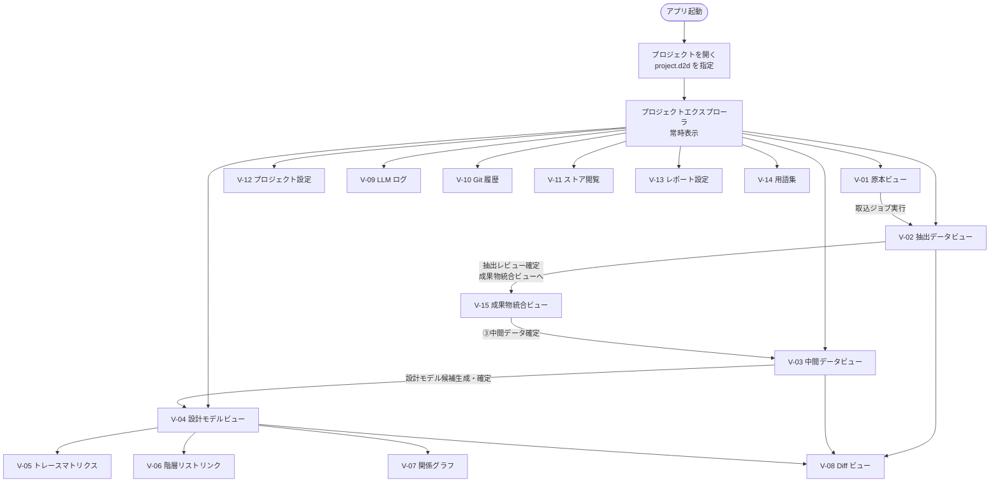
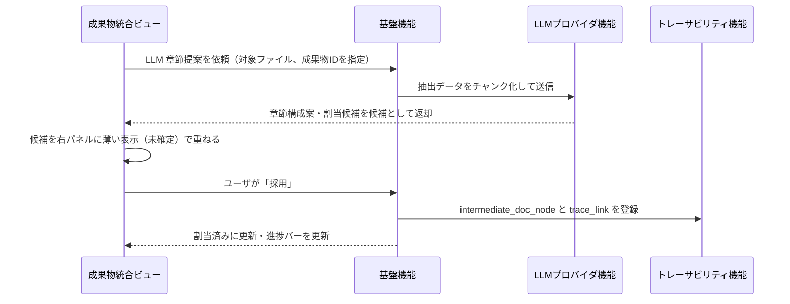

# D2D UI 設計書

## 1. 目的

本書は、D2D のレイアウト構成、画面・ビュー一覧、ナビゲーション遷移、主要ビューの構成方針、共通 UI パターンを定義する。詳細ワイヤーフレームは別途作成する。

---

## 2. 全体レイアウト

IDE ライクな構成を基本とする（SRS UI-008）。4 領域で構成する。

```
┌──────────────────────────────────────────────────────────────────┐
│  タイトルバー  プロジェクト名  |  schema_version  |  コマンドパレット  │
├───┬──────────────────────────────────────────┬───────────────────┤
│   │                                          │                   │
│ A │             メインエリア                 │   インスペクタ     │
│ c │         （タブ・分割ペイン）             │                   │
│ t │                                          │  ・選択要素プロパ │
│ i │  ┌──────────┐  ┌──────────┐            │    ティ           │
│ v │  │  タブ A  │  │  タブ B  │  ...       │  ・トレース関係   │
│ i │  └──────────┘  └──────────┘            │  ・LLM 候補       │
│ t │                                          │  ・レビュー状態   │
│ y │                                          │                   │
│   │                                          │                   │
│ B │                                          │                   │
│ a │                                          │                   │
│ r │                                          │                   │
├───┴──────────────────────────────────────────┴───────────────────┤
│  ステータスバー  ジョブ状態 | 進捗 | 警告数 | テーマ切替          │
└──────────────────────────────────────────────────────────────────┘
```

---

## 3. アクティビティバー

左端の縦アイコンバー。クリックで左サイドパネルの表示コンテンツを切り替える。

| アイコン位置 | 表示コンテンツ | 主な操作 |
| --- | --- | --- |
| 上段 | プロジェクトエクスプローラ | 成果物・原本ファイルのツリー表示、取込ジョブ起動 |
| 上段 | ①原本 | 原本ファイル一覧・取込状態確認 |
| 上段 | ②抽出データ | 抽出結果一覧・レビュー状態フィルタ |
| 上段 | ③中間データ | 成果物一覧・アウトライン |
| 上段 | 成果物統合 | ②抽出データ → ③中間データの割当・統合作業（V-15） |
| 上段 | ④設計モデル | 設計要素・関係ツリー |
| 上段 | トレーサビリティ | 関係クエリ設定・分析起動 |
| 上段 | レポート | 出力条件設定・生成起動 |
| 下段（固定） | 設定 | アプリ設定・プロジェクト設定 |

---

## 4. 画面・ビュー一覧

| ビュー ID | ビュー名 | SRS 要求 | 主な用途 |
| --- | --- | --- | --- |
| V-01 | 原本ビュー | UI-010 | 原本ファイルのプレビュー・取込状態確認 |
| V-02 | 抽出データビュー | UI-011 | 抽出結果一覧・レビュー（未確認 / 確認済 / 棄却）・原本対照表示 |
| V-03 | 中間データビュー | UI-012 | 文書風表示・アウトライン編集・図表・モデル編集 |
| V-04 | 設計モデルビュー | UI-013 | 設計要素・関係の一覧・編集・PlantUML 表示 |
| V-05 | トレースマトリクスビュー | UI-014 | 要素×要素の関係マトリクス・フィルタ・セル詳細 |
| V-06 | 階層リスト間リンクビュー | UI-015 | ②→③→④の階層リストを並べてリンク表示 |
| V-07 | 関係グラフビュー | UI-016 | 設計要素・関係の DAG 可視化（Cytoscape.js） |
| V-08 | Diff ビュー | UI-017 | DB to Text 差分・Git 差分の並列表示 |
| V-09 | LLM ログビュー | UI-018 | LLM 送受信ログ・入力チャンク・候補一覧 |
| V-10 | Git 履歴ビュー | UI-019 | Git コミット履歴・特定時点の設計要素参照 |
| V-11 | ストア閲覧ビュー | UI-020 | SQLite DB・JSON / JSONL の生データブラウザ |
| V-12 | プロジェクト設定ビュー | CORE-040〜046 | LLM 設定・API キー・テーマ・ショートカット |
| V-13 | レポート設定ビュー | EXP-001〜006 | 出力対象・フィルタ・形式選択・プレビュー |
| V-14 | 用語集ビュー | EDIT-050〜054 | 用語一覧・定義編集・揺れ検出 |
| V-15 | 成果物統合ビュー | EXT-020〜024, MID-001〜005 | ②抽出データを左、③中間データを右に並べ、割当・統合・アウトライン構築を行う |

---

## 5. ナビゲーション遷移



---

## 6. 主要ビューの構成方針

### 6.1 V-02 抽出データビュー

```
┌─────────────────┬────────────────────────────────┐
│ 抽出要素一覧    │  選択要素の詳細                 │
│                 │  （テキスト / 表 / 図）         │
│ [フィルタ]      ├────────────────────────────────┤
│  item_type      │  原本プレビュー                 │
│  review_status  │  （原本ファイルの該当箇所）     │
│                 │                                │
│ [仮想スクロール]│  インスペクタ:                  │
│  …              │  状態ボタン [確認済][棄却]      │
│  …              │  LLM 候補表示                  │
└─────────────────┴────────────────────────────────┘
```

- 左ペイン：`item_type`・`review_status` でフィルタ可能な仮想スクロールリスト
- 右上：選択要素の詳細（テキスト編集可、表は グリッド表示）
- 右下：原本プレビュー（PDF ページ・Word 段落・Excel セル範囲を原本位置で表示）
- インスペクタ：レビュー状態ボタン・LLM 候補

### 6.2 V-03 中間データビュー

```
┌──────────────┬──────────────────────────────────┐
│ アウトライン  │  本文・図表（文書風表示）         │
│ （章節ツリー）│                                  │
│               │  # 第1章 ...                    │
│  1. 概要      │  段落テキスト...                 │
│    1.1 背景   │  [図 1-1] ○○の構成              │
│    1.2 目的   │  | 表1-1 |...                   │
│  2. 要求      │                                  │
│    2.1 ...    │                                  │
│               ├──────────────────────────────────┤
│               │  インスペクタ:                   │
│               │  根拠②抽出データ / LLM候補 /    │
│               │  レビュー状態                    │
└──────────────┴──────────────────────────────────┘
```

- 左：`intermediate_doc_node` ツリー（章節の並べ替え・マージ・分割）
- 中央：選択章節の本文・図表を文書風に表示（Monaco Editor で本文編集）
- インスペクタ：対応する②抽出データの参照・LLM 候補・レビュー状態

### 6.3 V-04 設計モデルビュー

```
┌──────────────────────────────────────────────────┐
│ [element_type フィルタ] req | func | struct | ... │
├──────────────┬───────────────────────────────────┤
│ 設計要素ツリー│  設計関係一覧（グリッド）          │
│ （parent_child│                                   │
│  階層）       │  from | relation_type | to | state│
│               │  REQ-001 | satisfy | FUNC-001 | 確定│
│               │  ...                             │
│               ├───────────────────────────────────┤
│               │  インスペクタ:                    │
│               │  PlantUML プレビュー / 根拠リンク │
└──────────────┴───────────────────────────────────┘
```

- 上部：`element_type` フィルタバー
- 左：設計要素の親子ツリー（階層構造）
- 右上：選択要素に紐づく設計関係の一覧（TanStack Table）
- 右下インスペクタ：PlantUML / SysMLv2 プレビュー・根拠中間データリンク

### 6.4 V-05 トレースマトリクスビュー

```
         | REQ-001 | REQ-002 | ...
─────────────────────────────────
FUNC-001 |  satisfy |         |
FUNC-002 |          |  satisfy|
TEST-001 |  verify  |         |
```

- 行・列の `element_type` はプルダウンで選択可
- セルに `relation_type` を色分けで表示（satisfy: 緑、verify: 青、depend: 橙）
- セルクリックで関係詳細・根拠リンクをインスペクタに表示
- 未接続の行・列をハイライト表示（カバレッジ確認）

### 6.5 V-07 関係グラフビュー

- **ノード**: 設計要素（`element_type` で色分け）
- **エッジ**: 設計関係（`relation_type` でスタイル分け、LLM 未確定は点線）
- **操作**: ズーム・パン、フォーカスノード変更、探索深さ指定（SRS TRACE-003）
- **レイアウト**: 階層レイアウト（dagre）をデフォルト、force-directed に切替可

### 6.6 V-15 成果物統合ビュー

②抽出データを③中間データに統合・整理するための専用ビュー。複数の原本ファイルから抽出した結果を成果物単位でまとめ、アウトラインを構築する作業をここで行う。

#### レイアウト

```
┌─────────────────────────────────────────────────────────────────────┐
│ [成果物: ○○設計書 ▼]  [取込ファイル: 全ファイル ▼]  [LLM 支援 ON/OFF] │
│ 進捗: ████████░░ 割当済 73 / 未割当 27                               │
├────────────────────────┬────────────────────────────────────────────┤
│ ②抽出データ            │ ③中間データ（アウトライン＋本文）          │
│                        │                                            │
│ [🔍 テキスト検索]       │ [+ セクション追加]  [LLM 章節提案 ▶]      │
│ [フィルタ]             │                                            │
│  item_type ▼  all      │ ▼ 1. 概要                                  │
│  状態 ▼  未割当のみ    │     ▼ 1.1 背景     ← EXT-001, EXT-002      │
│                        │     ▼ 1.2 目的     ← EXT-003               │
│ ▼ 📄 file-A.docx       │ ▼ 2. 要求定義                              │
│   [T] EXT-001 ✓        │     ▼ 2.1 機能要求 ← EXT-010               │
│   [¶] EXT-002 ✓        │     ▼ 2.2 非機能要求  （未割当）           │
│   [■] EXT-003 ✓        │                                            │
│   [■] EXT-004 ●未割当  │ ───────────────────────────────────────── │
│   [🖼] EXT-005 ●未割当  │ 選択中: 1.1 背景                           │
│                        │                                            │
│ ▼ 📄 file-B.xlsx       │ ▶ 本文（Monaco Editor）                    │
│   [■] EXT-010 ✓        │   背景として、本ツールは既存の...           │
│   [■] EXT-011 ●未割当  │                                            │
│                        │ ▶ 割当済み抽出データ                        │
│ [ドラッグして割当]      │   ↗ EXT-001  1. 概要 タイトル              │
│ [選択→割当 ▶]         │   ↗ EXT-002  本文段落                      │
└────────────────────────┴────────────────────────────────────────────┘
```

#### 操作定義

| 操作 | 方法 | 結果 |
| --- | --- | --- |
| 抽出要素を章節に割当 | 左の抽出要素をドラッグ→右の章節にドロップ | `trace_link`（extracted_item → intermediate_item）を生成。抽出要素に ✓ マーク |
| 複数まとめて割当 | 左で複数選択 → 右の章節を選択 → 「割当」ボタン | 選択した抽出要素をすべて同一章節にリンク |
| 本文として取り込む | 割当時に「本文に取込」を選択 | 抽出テキストを `intermediate_text.body_text` に挿入。元テキストは `trace_link` で参照可能 |
| 参照リンクのみ | 割当時に「リンクのみ」を選択 | 本文は編集せず `trace_link` のみ生成。後で本文を手書き |
| 割当を解除 | 割当済み表示の ✕ ボタン | `trace_link` を削除。抽出要素を未割当に戻す |
| アウトライン編集 | 右パネルの章節をドラッグ・ダブルクリック | `intermediate_doc_node` の順序・階層を更新 |
| LLM 章節提案 | ツールバーの「LLM 章節提案 ▶」 | 選択ファイルの抽出データを入力チャンクとしてLLMへ送信し、章節構成と割当候補を提案 |
| LLM 提案の採用 | 提案リストの「採用」ボタン | `intermediate_doc_node` と `trace_link` を確定。状態は「確定」 |
| LLM 提案の棄却 | 提案リストの「棄却」ボタン | 提案を破棄。手動割当を続ける |
| 未割当のみ表示 | 左パネル「未割当のみ」フィルタ | 割当済みの抽出要素を非表示にして作業対象を絞り込む |

#### 進捗バー

画面上部に「割当済 N / 未割当 M」の進捗バーを表示する。全抽出要素の何割が③中間データに紐づいているかを示す。100% が目標ではなく、不要な抽出要素（ヘッダ、余白テキスト等）は「除外」として明示的に処理できる。

| 抽出要素の状態 | 意味 | 表示 |
| --- | --- | --- |
| 未割当 | ③中間データとの trace_link なし | ● オレンジ |
| 割当済 | 1 件以上の trace_link あり | ✓ グレー |
| 除外 | 意図的に不要と判断（棄却） | — グレー |

#### LLM 支援フロー



---

## 7. 共通 UI パターン

| パターン | 仕様 |
| --- | --- |
| 仮想スクロール | 1,000 件超の一覧は TanStack Virtual を使用（SRS UI-007, NFR-001） |
| LLM 候補表示 | 候補はハイライト表示＋「採用 / 修正 / 棄却」ボタン。正本へは人間確定後に反映（SRS LLM-037〜039） |
| ジョブ進捗 | ステータスバーにプログレスバー表示。完了・失敗はトースト通知（SRS UI-009, CORE-021） |
| コマンドパレット | Ctrl+P でビュー・アクション・設定をキーワード検索（SRS UI-004） |
| ペイン分割 | 水平・垂直分割・タブ・最大化を切り替え可（SRS UI-005, UI-006） |
| Undo / Redo | 全編集操作対応。Ctrl+Z / Ctrl+Y（SRS NFR-012） |
| 破壊的操作確認 | 削除・一括上書き前に確認ダイアログ表示（SRS NFR-013） |
| テーマ | CSS カスタムプロパティ（デザイントークン）でダーク / ライト即時切替（SRS UI-001, UI-002） |
| キーショートカット | `V-12 プロジェクト設定` から変更可能。デフォルトは VS Code 準拠（SRS UI-003） |
| 状態バッジ | 抽出・中間・設計モデルの各要素に「作成中 / レビュー中 / 確定 / 棄却」をバッジで表示 |

---

## 8. キーショートカット（デフォルト）

| 操作 | ショートカット |
| --- | --- |
| コマンドパレット | Ctrl+P |
| ペイン分割（水平） | Ctrl+\\ |
| ペイン分割（垂直） | Ctrl+Shift+\\ |
| Undo | Ctrl+Z |
| Redo | Ctrl+Y |
| 保存（正本反映） | Ctrl+S |
| 設計要素へジャンプ | Ctrl+G |
| LLM 候補採用 | Ctrl+Enter |
| LLM 候補棄却 | Ctrl+Delete |
| テーマ切替 | Ctrl+Shift+T |
