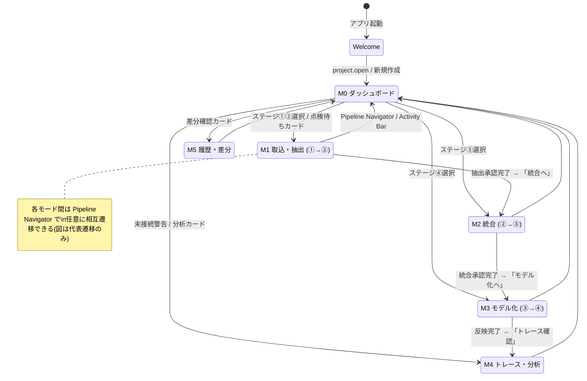
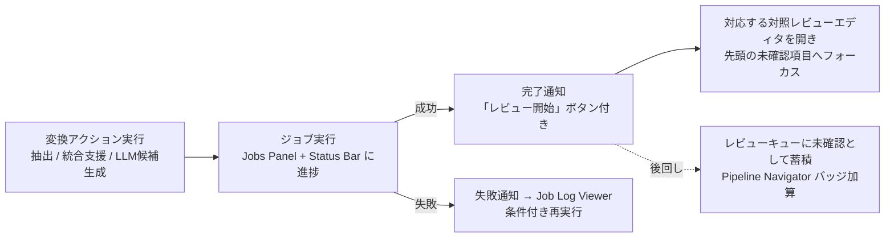
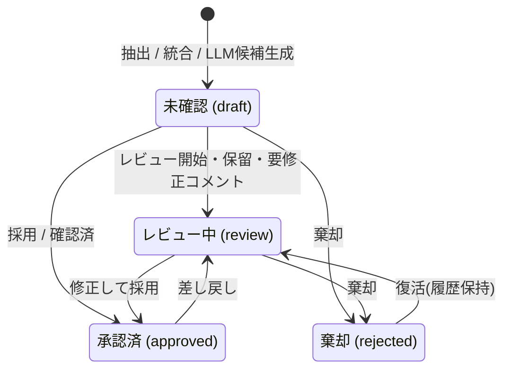

# D2D UI/UX 設計書

## 1. 目的

D2D の UI/UX を VSCode 風の Workbench 型 UX として設計するための方針、画面構成、作業モード、画面遷移、レビュー UX、状態連携、共通 UI パターンを定義する。

D2D は、①原本データ → ②抽出データ → ③中間データ → ④設計モデルの4階層を、ツールによる抽出・候補提示と人間による点検・承認(human-in-the-loop)を繰り返しながら段階的にデータ化する設計支援ツールである。そのため UI は次の2つを両立する。

1. **Workbench 型の自由度**: 複数の作業対象(Resource)を開き、並べ、比較し、編集できる IDE 風の操作性(踏襲)。
2. **段階的レビューの導線**: 「いまどの階層の、どのデータが、何件点検待ちか」を常に可視化し、点検 → 判断(採用・修正・棄却) → 正本反映の反復作業を最短の操作で回せる導線(本版で刷新)。

---

## 2. UI/UX 基本方針

### 2.1 Workbench 型 UX(踏襲)

| 領域 | 目的 |
| --- | --- |
| Navigation | プロジェクト、原本、成果物、設計要素、トレース対象を探す |
| Editor | 対象 Resource を開いて閲覧、編集、レビューする |
| Auxiliary View | 現在対象の詳細、根拠、関係、候補、ログを確認する |
| Command | 操作をメニュー、ボタン、ショートカット、コマンドパレットから一貫して実行する |
| Context | 選択中の対象、アクティブ Editor、ジョブ状態、レビュー状態に応じて UI を変える |

### 2.2 刷新の狙い: 段階的データ化とレビューの可視化

従来設計は Workbench の静的構成(領域・ビュー・Command)を定義していたが、①→②→③→④ の変換を人間レビューで進める「作業の流れ」が画面構造に現れていなかった。本版では以下を UI の一次構造として導入する。

| 導入要素 | 内容 | 解決する課題 |
| --- | --- | --- |
| パイプラインナビゲータ | ①〜④のステージ、件数、レビュー進捗、変換アクションを常時表示する帯 | 「全体のどこまで進んだか」「次に何をすべきか」が見えない |
| 作業モード(Perspective) | ステージの作業単位に最適化したレイアウトプリセット | ステージごとに必要なペイン構成を毎回手で作る必要がある |
| 対照レビューエディタ | 上流(根拠)と下流(候補・編集結果)を対で表示し、判断操作を横に置く共通パターン | 原本対照・候補点検の画面構成がビューごとにバラバラになる |
| レビューキュー | 未確認・要修正・LLM 候補待ちを横断集約する Inbox | 点検対象がビューの奥に埋もれ、レビュー漏れが起きる |
| 画面遷移設計 | モード切替 / Resource タブ / モーダルの3分類と遷移図 | 固定画面遷移でも完全自由でもない、遷移の規律がない |

### 2.3 D2D 固有の UX 原則

| 原則 | 内容 |
| --- | --- |
| IDE 風でコンパクト | Web サイト風の余白・カード中心構成ではなく、IDE のような高密度で反復作業しやすい画面にする |
| Resource 中心(オブジェクト指向型UI) | 画面名ではなく、原本、抽出要素、中間データ、設計要素、トレース結果、差分、設定などの Resource を開く |
| ステージの常時可視化 | ①〜④の進捗・点検待ち件数をパイプラインナビゲータで常時表示し、どの画面からでも1操作で該当ステージの作業へ移れる |
| 探索と編集の分離 | Activity Bar / Side Bar は探索・選択、Editor Area は主作業、Panel は結果・ログ・問題表示に使う |
| Command 集約 | 主要操作は Command として定義し、メニュー、ツールバー、コンテキストメニュー、ショートカットから同じ処理を呼ぶ |
| Human-in-the-loop | ツール出力(抽出結果・LLM 候補)は必ず「候補」として表示し、採用、修正、棄却を人間が確定してから正本へ反映する。正本への自動反映は行わない |
| 対で見せる | 点検は必ず「上流(根拠)と下流(結果・候補)の対照表示」で行う。単独表示のまま承認させない |
| 判断コストの最小化 | 次の未確認項目への移動、採用・棄却、根拠確認をキーボードのみで連続実行できる |
| 根拠の常時参照 | 編集対象から、原本位置、抽出データ、中間データ、設計モデル、LLM ログ、レビュー記録へ辿れるようにする |
| 長時間処理の非同期化 | 抽出、LLM 実行、DB to Text、差分生成、レポート生成は Job として扱い、UI をブロックしない。完了時はレビュー導線へ誘導する |
| レイアウト復元 | ユーザーが作ったタブ、分割、Side Bar、Panel の状態を作業モード単位で保存・復元できる |

### 2.4 テーマ・アイコン方針

D2D のテーマは、表示モードとカラーテーマを分けて扱う。表示モードはライト、ダーク、システム設定連動を扱い、カラーテーマは Serendie Design System の5テーマを扱う。

| 区分 | 選択肢 | 設計方針 |
| --- | --- | --- |
| 表示モード | `light`、`dark`、`system` | 明暗の切替として扱い、OS 設定連動を可能にする |
| カラーテーマ | `konjo`、`asagi`、`sumire`、`tsutsuji`、`kurikawa` | アプリ全体のアクセント、選択状態、強調、状態色のベースとして扱う |
| 適用範囲 | Workbench 全体 | Title Bar、Pipeline Navigator、Activity Bar、Side Bar、Editor、Panel、Status Bar、Dialog、Notification に一貫して適用する |
| 保存単位 | User Settings / Project Settings | 既定はユーザー設定とし、必要に応じてプロジェクト単位の推奨テーマを保持できる |

テーマ適用はデザイントークンを介して行い、個別コンポーネントに固定色を直書きしない。状態色、レビュー状態、エラー、警告、成功、選択中、未保存状態は、各テーマとライト/ダークの双方で識別可能なコントラストを確保する。特にレビュー状態(未確認・確認済・要修正・棄却・候補)は、ステージやビューが変わっても同一の色・アイコンで表現する。

UI アイコンは、Serendie Design System の `serendie/serendie-symbols` をベースに選択する。Activity Bar、Toolbar、Context Menu、Status Bar、Panel タブ、通知、レビュー操作のアイコンは、意味が一致する Serendie Symbols を優先し、同一概念には同一アイコンを使う。用途に一致するアイコンがない場合は、近い意味のアイコンを暫定利用するのではなく、テキストラベルまたはプロジェクト内の追加アイコン候補として扱う。

---

## 3. 全体レイアウト

Workbench は、Title Bar、**Pipeline Navigator(新設)**、Activity Bar、Primary Side Bar、Editor Area、Secondary Side Bar、Panel、Status Bar で構成する。

```text
┌──────────────────────────────────────────────────────────────────────────┐
│ Title Bar / Command Center                                               │
│ D2D  Project: <name>  schema: <version>  [Command Palette / Quick Pick]  │
├──────────────────────────────────────────────────────────────────────────┤
│ Pipeline Navigator                                                       │
│ [①原本 12] ─抽出▶ [②抽出 8/12済 ⚠2] ─統合▶ [③中間 3成果物 ●5候補]        │
│                                        ─モデル化▶ [④モデル 142要素 ●12候補] │
├────┬────────────────────┬─────────────────────────────────┬─────────────┤
│    │ Primary Side Bar   │ Editor Area                     │ Secondary   │
│ A  │                    │                                 │ Side Bar    │
│ c  │ ・Explorer         │ ┌────────────┬────────────┐     │             │
│ t  │ ・Review (Inbox)   │ │ Tab Group  │ Tab Group  │     │ ・Property  │
│ i  │ ・Search           │ │ Resource A │ Resource B │     │ ・Evidence  │
│ v  │ ・Trace            │ └────────────┴────────────┘     │ ・Relation  │
│ i  │ ・Jobs             │                                 │ ・LLM候補   │
│ t  │ ・Reports          │                                 │ ・Review    │
│ y  │ ・History          │                                 │             │
├────┴────────────────────┴─────────────────────────────────┴─────────────┤
│ Panel: Problems | Output | Jobs | Search Results | Validation | LLM Logs │
├──────────────────────────────────────────────────────────────────────────┤
│ Status Bar: project | mode | active resource | job state | warnings | LLM │
└──────────────────────────────────────────────────────────────────────────┘
```

| パーツ | 役割 | D2D での用途 |
| --- | --- | --- |
| Title Bar / Command Center | 全体状態とコマンド入口 | プロジェクト名、schema_version、外部送信可否、コマンドパレット入口 |
| Pipeline Navigator | データ階層の進捗と変換入口 | ①〜④の件数・レビュー進捗・警告、ステージクリックで作業モード切替、矢印クリックで変換アクション実行 |
| Activity Bar | 作業文脈の切替 | Explorer、Review、Search、Trace、Jobs、Reports、History、Settings |
| Primary Side Bar | 探索・選択・絞り込み | プロジェクトツリー、原本一覧、抽出結果一覧、設計要素ツリー、レビューキュー、検索条件 |
| Editor Area | 主作業 | 原本、抽出データ、中間データ、設計モデル、候補セット、マトリクス、グラフ、Diff、設定をタブで開く |
| Editor Group | 分割単位 | 左右・上下分割、タブ移動、比較表示、プレビュータブ |
| Secondary Side Bar | 現在対象の補助情報 | プロパティ、根拠、トレース、LLM 候補、レビュー状態 |
| Panel | 実行結果・問題・ログ | Problems、Output、Jobs、Validation Results、LLM Logs |
| Status Bar | 軽量な常時状態表示 | 作業モード、ジョブ状態、警告数、外部 LLM 送信可否、Git 差分状態、選択 Resource |

### 3.1 Pipeline Navigator の仕様

| 項目 | 仕様 |
| --- | --- |
| ステージノード | ①原本、②抽出、③中間、④設計モデルの4ノードを固定順で表示する |
| 件数バッジ | ステージごとに総数と状態内訳(未確認 / 要修正 / 承認済 / 候補あり / 警告)を表示する。件数は `entity_registry.status` と抽出・中間・LLM の各ステータスから集計する |
| ステージクリック | 対応する作業モード(5章)へ切り替える。バッジクリックはその状態でフィルタしたレビューキューを開く |
| 変換アクション(矢印) | ①→②: 抽出ジョブ実行、②→③: 統合エディタを開く、③→④: チャンク選択と LLM 候補生成へ。実行可否は Context(選択状態、レビュー状態、ジョブ状態)で制御する |
| ジョブ進行表示 | 変換に対応するジョブが実行中の場合、矢印上に進捗を表示する |
| 表示切替 | 狭い画面ではアイコン+件数のみのコンパクト表示に折りたたむ。非表示設定も可能とし、その場合も Status Bar に最小限の進捗を出す |

---

## 4. 内部 UX モデル

### 4.1 Resource

Resource は、D2D 上で開く、参照する、編集する対象の抽象概念である。Editor Area は画面ではなく Resource を開く。

| Resource 種別 | 例 | 主な Editor |
| --- | --- | --- |
| `project://` | `project://current` | Project Dashboard Editor |
| `original://` | `original://<source_document_uid>` | Original Viewer |
| `extracted://` | `extracted://<extracted_document_uid>` | Extraction Review Editor |
| `intermediate://` | `intermediate://<intermediate_document_uid>` | Intermediate Document Editor |
| `intermediate://compose` | `intermediate://compose/<intermediate_document_uid>` | Composition Editor |
| `design://` | `design://<design_element_uid>` | Design Model Editor |
| `candidate://` | `candidate://<llm_run_uid>` | Candidate Set Review Editor |
| `chunk://` | `chunk://<intermediate_document_uid>` | Chunk Manager |
| `trace://` | `trace://query/<query_id>` | Trace Matrix / Graph Editor |
| `diff://` | `diff://<left>/<right>` | Diff Editor |
| `log://` | `log://job/<job_id>`、`log://llm/<llm_run_uid>` | Log Viewer |
| `settings://` | `settings://workspace` | Settings Editor |
| `report://` | `report://<report_job_id>` | Report Preview Editor |

### 4.2 Command

主要操作は Command として登録する。UI 部品は個別処理を直接持たず、Command を呼び出す。

| Command 例 | 用途 |
| --- | --- |
| `project.open` | `project.d2d` を開く |
| `mode.switch` | 作業モード(Perspective)を切り替える |
| `resource.open` | Resource を Editor Area に開く |
| `resource.save` | 編集内容を正本へ保存する |
| `editor.split` | Editor Group を分割する |
| `job.startExtraction` | 原本抽出ジョブを開始する |
| `job.retry` | 失敗ジョブを条件付きで再実行する |
| `compose.assign` | 抽出要素を③中間データの章節へ割り当てる |
| `chunk.create` | 選択範囲からチャンクを作成する |
| `llm.generateCandidate` | LLM 候補を生成する(送信前確認を経由する) |
| `review.accept` / `review.acceptWithEdit` / `review.reject` | 候補または点検対象を採用 / 修正して採用 / 棄却する |
| `review.next` / `review.prev` | 次 / 前の未確認項目へ移動する |
| `trace.runQuery` | トレースクエリを実行する |
| `diff.open` | DB to Text または Git 差分を開く |
| `report.generate` | レポート生成ジョブを開始する |

### 4.3 Selection / Context / Event

UI パーツ間の連携は、直接参照ではなく Selection、Context、Event を介して行う。

```text
ユーザー操作
  ↓
Command 実行
  ↓
Service 呼び出し
  ↓
Selection / Context 更新
  ↓
Event 発行
  ↓
Editor / Side Bar / Panel / Status Bar / Pipeline Navigator 更新
```

| 概念 | 管理内容 | UI への影響 |
| --- | --- | --- |
| Selection | 選択 Resource、選択設計要素、選択範囲、アクティブ Editor | Secondary Side Bar、Status Bar、Context Menu を更新 |
| Context | `workMode`、`activeEditor`、`selectedResourceType`、`hasDirtyEditor`、`isJobRunning`、`reviewStatus`、`llmExternalAllowed` 等 | Command の有効/無効、メニュー表示、ツールバー表示、変換アクション可否を制御 |
| Event | `resource.opened`、`resource.saved`、`selection.changed`、`job.updated`、`review.updated`、`trace.updated` 等 | 関連ビュー、レビューキュー、Pipeline Navigator の件数を疎結合に同期 |

---

## 5. 作業モード(Perspective)

作業モードは、ステージの作業単位に最適化した「レイアウトプリセット + Side Bar 初期表示 + 推奨 Command セット」である。固定画面遷移ではなく、Workbench の自由度(タブ、分割、任意 Resource の追加)を保ったまま、既定の作業画面を1操作で用意する仕組みとする。

### 5.1 モード一覧

| モード | 対象変換 | 主目的 | 既定レイアウト |
| --- | --- | --- | --- |
| M0: ダッシュボード | ─ | プロジェクト全体の進捗把握と作業再開 | Project Dashboard Editor 単独 |
| M1: 取込・抽出 | ①→② | 原本取込、抽出実行、抽出結果の点検・承認 | 抽出レビュー3ペイン + Jobs Panel |
| M2: 統合 | ②→③ | 抽出要素の成果物への割当・統合、章構成の点検・承認 | 統合3ペイン(未割当一覧 / ③アウトライン+文書 / レビュー) |
| M3: モデル化 | ③→④ | チャンク作成、LLM 候補生成、候補点検、④モデル編集 | ③文書 + 候補セット + レビューパネル |
| M4: トレース・分析 | 横断 | マトリクス、グラフ、未接続検出、影響分析 | Trace Matrix / Graph + Problems Panel |
| M5: 履歴・差分 | 横断 | Git 履歴、DB to Text、ZIP 差分の確認 | Diff Editor + History Side Bar |

### 5.2 モードの規則

| 規則 | 内容 |
| --- | --- |
| 切替入口 | Pipeline Navigator のステージクリック、Activity Bar、Command Palette(`mode.switch`)、ジョブ完了通知の「レビュー開始」から切り替える |
| レイアウト独立 | モードごとにタブ・分割・Side Bar 状態を保持し、モードを往復しても作業中のレイアウトが失われない |
| 自由度の保持 | モードはプリセットであり拘束ではない。どのモードでも任意の Resource を開ける。モード既定に戻す `mode.resetLayout` を提供する |
| Context 連動 | `workMode` を Context Key とし、ツールバー、コンテキストメニュー、Pipeline Navigator の変換アクションの表示を最適化する |
| 復元 | 最後に使用したモードとそのレイアウトをプロジェクト単位で保存し、再開時に復元する(UI-025) |

---

## 6. 画面遷移設計

### 6.1 遷移の3分類

D2D の画面遷移は次の3種類のみとし、これ以外の遷移(全画面を置き換えるページ遷移等)は作らない。

| 分類 | 内容 | 例 |
| --- | --- | --- |
| モード切替 | Workbench のレイアウトプリセットを切り替える。Editor タブは失われない | ダッシュボード → M1 取込・抽出 |
| Resource を開く | Editor Area にタブとして開く / アクティブ化する。ダブルクリックでピン留め、シングルクリックでプレビュータブ | 抽出レビューエディタ、候補セット、Diff |
| モーダル | 明示的な判断・入力が必要な場合のみダイアログ / ウィザードを出す | 取込ウィザード、LLM 送信前確認、破壊的操作確認 |

### 6.2 トップレベル遷移図



- 順方向の遷移(M1→M2→M3→M4)は「このステージの点検が一段落したら次へ」という推奨導線であり、強制しない。
- どのモードからでも Pipeline Navigator / Activity Bar / Command Palette で任意のモードへ1操作で移れる。

### 6.3 モーダルフロー(ウィザード・確認)

モーダルは判断・入力が必須の場面に限定する(2.3 の Dialog 原則)。

| モーダル | 起点 | ステップ | 完了後の遷移 |
| --- | --- | --- | --- |
| 原本取込ウィザード | M1 ツールバー / Explorer へのファイルドロップ | (1) ファイル選択・重複(ハッシュ)確認 → (2) 抽出設定(抽出器・対象範囲) → (3) 実行確認 | 抽出ジョブ開始。Jobs Panel に進捗、完了通知から抽出レビューへ |
| 統合セットアップ | M2 「新規成果物」 / Pipeline Navigator の統合矢印 | (1) 成果物(`project_artifact_setting`)と開発フェーズ選択 → (2) 対象②抽出文書の選択 → (3) 初期章構成(空 / 原本準拠 / LLM 提案) | Composition Editor を開く |
| LLM 送信前確認 | `llm.generateCandidate` | 送信内容プレビュー(チャンク本文、プロンプト、モデル)、マスキング適用結果表示、外部送信可否の確認 | LLM ジョブ開始。完了通知から候補セットレビューへ |
| ZIP 差分インポート | M5 / Explorer | (1) ZIP 選択と manifest 確認 → (2) 比較対象(現行成果物)選択 | Diff Editor を開く(正本は上書きしない) |
| 破壊的操作確認 | 削除、上書き、一括棄却等 | 対象件数・影響(trace_link への影響)の提示 → 確認 | 実行して元のビューに留まる |

### 6.4 ジョブ完了からレビューへの導線

長時間処理はジョブ化し UI をブロックしない。完了後に「結果を人が点検する」ことが必須のため、ジョブ完了を必ずレビュー導線へ接続する。



---

## 7. レビュー UX 共通パターン

### 7.1 対照レビューエディタ

すべての点検・承認は「対照レビューエディタ」パターンで行う。ステージにより中身は変わるが、構成・操作・状態表現は共通とする。

```text
┌────────────┬──────────────────────────────────────────┬──────────────┐
│ レビュー一覧 │ 対照ビュー                                │ 判断パネル    │
│            │ ┌──────────────┬──────────────────────┐   │              │
│ フィルタ:   │ │ 上流(根拠)    │ 下流(結果・候補)      │   │ 状態: 未確認  │
│  状態/種別/ │ │ 原本プレビュー │ 抽出結果/③文書/④候補 │   │ [✓採用]      │
│  警告      │ │ (位置ハイライト)│ (編集可)             │   │ [✎修正して採用]│
│ 進捗 n/m   │ └──────────────┴──────────────────────┘   │ [✗棄却]      │
│ (仮想リスト)│  選択項目の対応箇所を相互ハイライト          │ 根拠/履歴/メモ │
└────────────┴──────────────────────────────────────────┴──────────────┘
```

| 領域 | 仕様 |
| --- | --- |
| レビュー一覧 | 点検対象を仮想スクロールで一覧表示。状態(未確認/確認済/要修正/棄却)、種別(text/table/figure/formula 等)、警告有無、信頼度でフィルタ・ソートできる。進捗メーター(確認済 n / 全 m)を常時表示する |
| 対照ビュー | 左に上流(根拠)、右に下流(結果・候補)を並べる。一覧で項目を選ぶと、上流側は `source_location` / `trace_link` に基づき該当箇所へスクロール+ハイライトし、下流側は該当要素を選択状態にする。右側は直接編集でき、編集は「修正して採用」として記録される |
| 判断パネル | 採用 / 修正して採用 / 棄却 / 保留(スキップ)を大きく配置。判断理由・レビューコメントを `entity_registry.review_info_json` へ記録する。直近の判断履歴と Undo を表示する |
| 判断後の挙動 | 判断確定で自動的に次の未確認項目へ移動する(設定でオフ可)。一覧の状態バッジと Pipeline Navigator の件数が即時更新される |
| ジャンプ・ハイライト | アウトライン、検索結果、コメント、変更履歴、問題一覧から該当要素へ移動する場合は、対象ペインを自動的に表示し、該当箇所へスクロールして短時間ハイライトする |

Word抽出レビューでは、PoCで有効だった「アウトラインツリー、Markdownプレビュー、Markdownソース、文書構造データ、コメント・変更履歴一覧」をD2DのResource/Editorとして再構成する。アウトラインは `structure_json.elements` の見出し、表、図、コメント、変更履歴から構築し、選択は原本プレビュー、抽出結果、文書構造データ、Secondary Side Bar のEvidence/Reviewへ同期する。ページ番号、プレビュー用アンカー、コメント・変更履歴マーカーは表示トグルで切り替え、LLM入力用クリーンMarkdownの確認にも利用できるようにする。

PowerPoint抽出レビューでは、PoCで有効だった「スライド一覧、SVGまたは画像プレビュー、透明な要素選択レイヤー、Markdownプレビュー、要素プロパティ、スピーカーノート、コンソールログ」をD2DのExtraction Review Editorとして再構成する。左ペインはスライド一覧と要素数サマリー、中央ペインはスライドプレビューとHTMLオーバーレイ相当の選択枠、右ペインはMarkdownまたは文書構造データ、下部Panelは要素プロパティ、スピーカーノート、Jobs、Problems、抽出ログを切り替える。要素のクリック、複数選択、除外、タイトル等の役割補正、図形グループ化、スライド検証状態の変更は候補編集として扱い、レビュー操作で②正本へ反映する。

PDF抽出レビューでは、PoCで有効だった「ページ画像上の領域枠編集、プロパティ編集、表エディタ、ページ/全文Markdownプレビュー、JSONプレビュー、表プレビュー、LLMログ」をD2DのExtraction Review Editorとして再構成する。中央ペインはページ画像とbboxオーバーレイを主表示とし、ズーム倍率に応じてPDF座標系と画面pxを変換する。領域枠は選択、移動、8方向リサイズ、新規作成、削除、種別変更を可能にするが、編集結果は候補として扱い、採用・修正して採用・棄却のレビュー操作で②正本へ反映する。右ペインは選択領域の bbox、種別、本文、表二次元配列、OCR/LLM補正候補、Evidence/Reviewを表示し、下部PanelはMarkdown、文書構造データ、表プレビュー、LLM Logs、Jobs、Problemsを切り替える。

ステージ別の対照内容:

| モード | 上流(根拠) | 下流(結果・候補) | 判断の反映先 |
| --- | --- | --- | --- |
| M1 抽出レビュー | 原本プレビュー(ページ/シート/スライド位置) | 抽出要素(テキスト・表・図・数式) | `extracted_*` の状態更新、修正は②正本へ(EXT-021〜024) |
| M1 PowerPoint抽出レビュー | スライドプレビュー、スライド内座標、スピーカーノート | スライド要素、Markdown、除外/役割/グループ化候補 | `extracted_*` の候補編集、採用後に②正本へ(EXT-034〜039) |
| M1 PDF抽出レビュー | PDFページ画像、座標領域、クロップ画像 | bbox付き抽出ブロック、表データ、OCR/LLM候補 | `extracted_*` の候補編集、採用後に②正本へ(EXT-027〜033) |
| M2 統合レビュー | ②抽出要素(原本位置つき) | ③統合文書の該当章節・本文・図表 | `intermediate_*` と `trace_link`(`based_on` + `basis_kind=extracted/normalized`) |
| M3 候補レビュー | ③中間データ(チャンク範囲・本文) | LLM 候補(④要素候補・関係候補・説明文候補) | 採用時のみ④正本 + `trace_link`(`based_on`)へ反映(LLM-037〜039) |
| M4 トレース点検 | 関係の from 要素と根拠 | 関係の to 要素、`relation_type`、信頼度 | `trace_link` の確定・修正・削除 |

### 7.2 レビューキュー(Inbox)

Activity Bar に「Review」を設け、プロジェクト横断の点検待ちを集約する。

| 項目 | 仕様 |
| --- | --- |
| 集約対象 | ②抽出の未確認・要修正、③統合の未確認、LLM 候補(未判断)、要修正に差し戻された項目、未接続・検証エラー由来の要対応項目 |
| グループ化 | ステージ → 文書/成果物 → 種別の階層でグループ化し、件数を表示する。フィルタ(状態、担当、警告)を保持できる |
| ジャンプ | 項目クリックで該当の対照レビューエディタを開き、当該項目へフォーカスする(モードも連動して切り替える) |
| 供給元 | `review.updated`、`job.updated` イベントで即時更新する。Pipeline Navigator のバッジと同じ集計を使う |

### 7.3 レビュー状態モデル

レビュー状態は全ステージ共通の語彙と色・アイコンで表現し、`entity_registry.status` と対応付ける。



| 規則 | 内容 |
| --- | --- |
| 候補と正本の分離 | LLM 候補・抽出結果は承認されるまで正本(②③④)に確定反映しない。候補は候補セット(7.4)として保持する |
| 履歴 | 採用・修正・棄却の操作は `review_info_json` と LLM 実行参照(`llm_run_ref`)に記録し、判断パネルから参照できる(LLM-039) |
| 下流への警告 | 承認済み要素の上流(根拠)が後から変更・差し戻しされた場合、下流要素に「根拠変更あり」警告を付け、Problems とレビューキューに出す |

### 7.4 LLM 候補セットレビュー

LLM 実行1回分の出力は「候補セット」(`candidate://<llm_run_uid>`)として1つの Resource で扱う。

| 項目 | 仕様 |
| --- | --- |
| 表示 | 候補をグリッド表示(候補種別、タイトル、根拠チャンク、信頼度、状態)。行選択で対照ビューに根拠③中間データと候補詳細を表示する |
| 判断 | 行単位の採用 / 修正して採用 / 棄却。複数選択して一括判断できる(6.3 の確認モーダル経由) |
| 反映 | 採用時に④正本(`entity_registry` + `resource_*`)を作成し、`trace_link`(`based_on`、`llm_run_uid` つき)を張る |
| 追跡 | 候補セットから LLM ログ(プロンプト、応答、token、コスト)へ1クリックで辿れる(LLM-012、LLM-015) |
| 再実行 | 同一チャンク・同一プロンプト・同一モデルでの再実行条件を表示して再実行できる(LLM-044)。旧候補セットは履歴として残る |

### 7.5 キーボードトリアージ

反復レビューをキーボードのみで回せるようにする。

| 操作 | Command | 既定キー |
| --- | --- | --- |
| 次の未確認へ | `review.next` | `J` / `↓` |
| 前の項目へ | `review.prev` | `K` / `↑` |
| 採用 | `review.accept` | `Ctrl+Enter` |
| 修正して採用(編集にフォーカス) | `review.acceptWithEdit` | `Ctrl+Shift+Enter` |
| 棄却 | `review.reject` | `Ctrl+Delete` |
| 保留(スキップ) | `review.skip` | `Space` |
| 根拠(上流)へフォーカス | `review.focusEvidence` | `Ctrl+E` |
| 判断の取り消し | `edit.undo` | `Ctrl+Z` |

### 7.6 一括操作

| 項目 | 仕様 |
| --- | --- |
| 対象選択 | 一覧のフィルタ結果に対して、複数選択・全選択で一括採用 / 一括棄却できる |
| 安全策 | 一括操作は件数と影響(作成される trace_link、反映先)を確認モーダルで提示してから実行する(NFR-013)。一括操作も Undo 可能とする |
| 用途例 | 「警告なしの段落抽出をすべて確認済にする」「信頼度 0.9 以上の関係候補をまとめて採用する」 |

---

## 8. ステージ別画面設計

### 8.1 M1: 取込・抽出(①→②)

```text
┌────────────┬──────────────────────────────────────────┬──────────────┐
│ 原本/抽出   │ 対照ビュー                                │ Property     │
│ ツリー      │ ┌──────────────┬──────────────────────┐   │ Evidence     │
│ +抽出要素   │ │ 原本プレビュー │ 抽出結果(編集可)      │   │ Review       │
│ 一覧(状態別)│ │ 位置ハイライト │ text/table/fig/formula│   │ Relations    │
│            │ └──────────────┴──────────────────────┘   │              │
├────────────┴──────────────────────────────────────────┴──────────────┤
│ Panel: Jobs(抽出進捗) | Problems(抽出警告)                             │
└───────────────────────────────────────────────────────────────────────┘
```

| 項目 | 仕様 |
| --- | --- |
| 取込 | Explorer へのドロップまたは取込ウィザード(6.3)。ハッシュ重複を検出し、再取込時は版として扱う(IMP-008) |
| 抽出実行 | 原本(複数選択可)に対して抽出ジョブを実行。Pipeline Navigator の①→②矢印からも実行できる |
| 抽出レビュー | 対照レビューエディタ(7.1)。一覧は `item_type`、`review_status`、原本ファイル、警告有無で絞り込む。表は元レイアウト(結合セル)との対照、図はキャプション・OCR との対照を表示する |
| Word抽出ビュー | Word文書では、左にアウトライン/抽出要素、中央に原本相当プレビュー・Markdownプレビュー・Markdownソース・文書構造データのタブ、右にコメント・変更履歴・Evidence・Reviewを配置する。見出し、表、図、コメント、変更履歴のクリックで中央ペインの該当要素へジャンプする |
| PowerPoint抽出ビュー | PowerPoint文書では、左にスライド一覧/要素数サマリー、中央にスライドプレビュー+透明選択レイヤー、右にMarkdown/文書構造データ、下部に要素プロパティ・スピーカーノート・ログを配置する。要素枠の選択、複数選択、除外、役割補正、グループ化、スライド検証状態をMarkdownとプレビューへ即時反映候補として表示する |
| PDF抽出ビュー | PDF文書では、左にページ/抽出ブロック一覧、中央にページ画像+bboxオーバーレイとMarkdown/JSONタブ、右にプロパティ・表エディタ・OCR/LLM候補・Evidence・Reviewを配置する。bbox、表、LLMログ、Problems のクリックで中央ペインの該当領域へジャンプし短時間ハイライトする |
| Markdown出力確認 | レビュー表示用MarkdownとLLM入力用クリーンMarkdownを切り替え、ページ番号、アンカー、UI用span、画像参照の扱いを確認できる。クリーンMarkdownは正本ではなく派生成果物として扱う |
| 編集・分割・マージ | 抽出結果の修正、要素の分割・マージができ、新要素には新 ID を採番し元 ID を履歴として追跡する(EXT-014〜015) |
| 完了導線 | 文書内の未確認 0 件になったら「この文書の抽出レビューを完了し、統合へ」を提示する(強制はしない) |

### 8.2 M2: 統合(②→③)

```text
┌────────────┬──────────────────────────────────────────┬──────────────┐
│ 未割当抽出  │ Composition Editor                        │ Candidates   │
│ 要素一覧    │ ┌──────────────┬──────────────────────┐   │ (LLM章構成/   │
│ (原本別/    │ │ ③アウトライン │ ③文書風エディタ       │   │  割当候補)    │
│  種別別)    │ │ 章節ツリー    │ 本文・図表(編集可)    │   │ Review       │
│ ドラッグ可  │ └──────────────┴──────────────────────┘   │ Evidence     │
├────────────┴──────────────────────────────────────────┴──────────────┤
│ Panel: Problems(未割当・重複割当) | Jobs                              │
└───────────────────────────────────────────────────────────────────────┘
```

| 操作 | 結果 |
| --- | --- |
| 成果物の新規作成 | 統合セットアップ(6.3)で成果物種別・開発フェーズ・対象②を選ぶ |
| 抽出要素を章節へ割当 | 左の未割当一覧から章節ツリー/本文へドラッグ、または `compose.assign`。`trace_link` を作成する |
| 本文として取り込む | 抽出テキストを③本文へ挿入し根拠リンクを保持する |
| リンクのみ作成 | 本文は変更せず根拠リンクだけ作成する |
| 割当解除 | `trace_link` を削除し未割当へ戻す |
| LLM 章構成・割当提案 | 候補セットとして提示し、採用 / 修正 / 棄却後に③と trace_link へ反映する |
| 統合レビュー | ③の章節・本文を、根拠となった②要素(原本位置つき)と対照表示して点検する(7.1) |
| 完了導線 | 未割当 0 件+③未確認 0 件で「モデル化へ」を提示する |

### 8.3 M3: モデル化(③→④)

```text
┌────────────┬──────────────────────────────────────────┬──────────────┐
│ ③文書/     │ 対照ビュー                                │ Candidates   │
│ チャンク    │ ┌──────────────┬──────────────────────┐   │ Review       │
│ 一覧        │ │ ③中間データ   │ 候補セット(grid) /    │   │ Evidence     │
│ ④要素ツリー │ │ チャンク範囲   │ ④モデル編集          │   │ Relations    │
│            │ │ ハイライト    │ (要素/関係/PlantUML)  │   │              │
│            │ └──────────────┴──────────────────────┘   │              │
├────────────┴──────────────────────────────────────────┴──────────────┤
│ Panel: LLM Logs | Jobs | Validation Results                           │
└───────────────────────────────────────────────────────────────────────┘
```

| 項目 | 仕様 |
| --- | --- |
| チャンク作成 | ③文書上で範囲(章節・段落・図表)を選択して `chunk.create`。チャンクは一覧で管理し、作成・修正・削除できる(MID-031)。チャンク範囲は③文書上にハイライト表示する |
| 候補生成 | チャンク+プロンプトテンプレート(用途別)を選び、LLM 送信前確認(6.3)を経てジョブ実行。完了通知から候補セットレビュー(7.4)へ |
| 候補レビュー | 候補セットをグリッドで点検し、根拠チャンク・③本文と対照して採用 / 修正 / 棄却する |
| ④直接編集 | LLM を使わず④要素・関係を手動で登録・編集できる。根拠として③の範囲を選択して `based_on` リンクを張る |
| モデル表現 | PlantUML / SysMLv2 テキストと要素 ID 対応表を表示・編集し、プレビューを並置する(FORM-001〜002) |
| 検証 | 状態遷移の未到達・未定義・競合、検証未対応要求などを Validation Results / Problems に表示し、各行から該当要素へジャンプする |

### 8.4 M4: トレース・分析

| 項目 | 仕様 |
| --- | --- |
| トレースマトリクス | 行・列を要素種別、成果物、開発フェーズ、レビュー状態で絞り込む。セルは `relation_type`、方向、信頼度、レビュー状態を表示。セル選択で Secondary Side Bar に根拠・履歴を表示する |
| 関係グラフ | 起点、方向、関係種別、深さを指定して探索する。階層レイアウト基本、force-directed 切替可。ノードダブルクリックで該当 Resource を開く |
| 階層リスト間リンク | ②→③→④の対応関係を3カラムの階層リストで表示し、選択連動でハイライトする |
| 未接続検出 | 要求未満足、検証未対応、根拠なし要素を Problems に集約し、クリックで該当対照レビューエディタへジャンプする |
| クエリ | 条件(種別・関係・深さ・方向)を保存済みクエリとして Side Bar に保持し、結果を表 / 階層リスト / グラフで切替表示、JSON/CSV/Markdown 出力できる |

### 8.5 M5: 履歴・差分

| 項目 | 仕様 |
| --- | --- |
| Git 履歴 | コミット一覧から特定時点の DB to Text を参照し、現行との Diff を開く(GIT-001〜006) |
| ZIP 差分 | ZIP 差分インポート(6.3)後、成果物フォルダ / DB to Text と比較する。正本は上書きしない(DATA-032) |
| Diff Editor | 左右比較+インライン切替。差分から該当要素の Resource へジャンプできる |

---

## 9. Activity Bar と Primary Side Bar

Activity Bar は機能ボタン置き場ではなく、作業文脈の切替入口とする。

| Activity | Primary Side Bar の内容 | 主な Command |
| --- | --- | --- |
| Explorer | プロジェクト、①原本、②抽出データ、③中間データ、④設計モデルのツリー | `resource.open`、`project.open` |
| Review | レビューキュー(7.2): 未確認・要修正・候補待ちの横断一覧 | `review.next`、`resource.open` |
| Search | 全階層検索、ID 検索、本文検索、用語検索 | `search.run`、`resource.open` |
| Trace | トレースクエリ条件、保存済みクエリ、未接続一覧 | `trace.runQuery`、`trace.openMatrix` |
| Jobs | 実行中、失敗、成功、警告付き完了ジョブ一覧 | `job.openLog`、`job.retry` |
| Reports | レポート定義、出力履歴、プレビュー対象 | `report.generate`、`report.openPreview` |
| History | Git 履歴、DB to Text、ZIP 差分比較対象 | `diff.open`、`history.openCommit` |
| Settings | アプリ設定、プロジェクト設定、LLM 設定、ショートカット | `settings.open` |

Primary Side Bar では探索、選択、絞り込みを行い、複雑な編集は Editor Area で実行する。

---

## 10. Editor Area

### 10.1 Editor Group と Tabs

| 状態 | 内容 |
| --- | --- |
| 開いている Resource | URI、表示名、Resource 種別、Editor Provider |
| アクティブタブ | 現在操作対象の Resource |
| 分割状態 | 左右分割、上下分割、分割比率 |
| 未保存状態 | 正本へ未反映の変更有無 |
| プレビュー状態 | 一時表示タブか、ピン留め済みタブか |
| レビュー状態 | 未確認残数バッジ(対照レビューエディタのタブに表示) |

### 10.2 Editor Provider

| Editor Provider | 対応 Resource | 主な表示 |
| --- | --- | --- |
| Project Dashboard Editor | `project://` | パイプライン進捗、点検待ちカード、実行中ジョブ、最近の作業、警告 |
| Original Viewer | `original://` | 原本プレビュー、位置情報、抽出対象ハイライト |
| Extraction Review Editor | `extracted://` | 抽出要素一覧、原本対照、レビュー操作(7.1 パターン) |
| Intermediate Document Editor | `intermediate://` | アウトライン、本文、図表、章節編集 |
| Composition Editor | `intermediate://compose` | ②未割当一覧、③アウトライン+文書、割当・統合操作 |
| Design Model Editor | `design://` | 設計要素、関係、PlantUML / SysMLv2、根拠リンク |
| Candidate Set Review Editor | `candidate://` | LLM 候補グリッド、根拠対照、採用・修正・棄却(7.4) |
| Chunk Manager | `chunk://` | チャンク一覧、範囲表示、プロンプト用途、候補生成履歴 |
| Trace Matrix Editor | `trace://matrix` | 行列形式の関係表示、未接続検出 |
| Trace Graph Editor | `trace://graph` | 関係グラフ、探索深さ、影響範囲 |
| Diff Editor | `diff://` | DB to Text、Git、ZIP 差分 |
| Log Viewer | `log://` | Job ログ、LLM ログ、エラー詳細 |
| Settings Editor | `settings://` | 設定、ショートカット、外部送信可否 |
| Report Preview Editor | `report://` | Markdown / HTML レポートプレビュー |

---

## 11. Secondary Side Bar

Secondary Side Bar は、現在の選択対象に依存する補助情報を表示する。

| タブ | 内容 |
| --- | --- |
| Properties | Resource、抽出要素、中間データ、設計要素の属性 |
| Evidence | 原本位置、抽出データ、③中間データ、LLM ログ、レビュー記録へのリンク |
| Relations | `trace_link`(根拠・変換・意味関係)、影響範囲、未接続情報 |
| Candidates | 選択対象に関する LLM 候補、候補セットへのリンク |
| Review | レビュー状態、レビュー履歴(`review_info_json`)、判断操作 |

Secondary Side Bar は現在対象の補助表示に限定し、全体探索や長い一覧操作は Primary Side Bar または Panel へ置く。対照レビューエディタ使用中は、判断パネル(7.1)が Review タブの役割を兼ねるため、Secondary Side Bar は根拠・関係の参照に使う。

---

## 12. Panel

Panel は、主作業を支援する結果、問題、ログを表示する。

| Panel | 内容 |
| --- | --- |
| Problems | 検証エラー、未接続トレース、スキーマ不整合、抽出警告、根拠変更警告 |
| Output | 抽出、変換、レポート出力などの標準出力的ログ |
| Jobs | ジョブ進捗、待機中、実行中、成功、失敗、中断。完了行から「レビュー開始」へ遷移できる |
| Search Results | 全文検索、ID 検索、用語検索の結果 |
| Validation Results | 設計モデル、トレース、DB to Text の検証結果 |
| LLM Logs | LLM 実行ログ、入力チャンク、応答、token 使用量、概算コスト |

Status Bar の警告数やジョブ状態をクリックした場合は、対応する Panel を開く。

---

## 13. 画面・ビュー一覧

| ビュー ID | ビュー名 | SRS 要求 | Resource / Editor | 主なモード | 主な用途 |
| --- | --- | --- | --- | --- | --- |
| V-00 | プロジェクトダッシュボード | UI-021、CORE-010 | `project://` / Project Dashboard Editor | M0 | パイプライン進捗、点検待ち、作業再開 |
| V-01 | 原本ビュー | UI-010 | `original://` / Original Viewer | M1 | 原本ファイルのプレビュー、取込状態確認 |
| V-02 | 抽出レビュービュー | UI-011、EXT-020〜024 | `extracted://` / Extraction Review Editor | M1 | 抽出結果の原本対照レビュー |
| V-03 | 中間データビュー | UI-012 | `intermediate://` / Intermediate Document Editor | M2/M3 | 文書風表示、アウトライン編集、図表編集 |
| V-04 | 設計モデルビュー | UI-013 | `design://` / Design Model Editor | M3 | 設計要素、関係、モデル表現編集 |
| V-05 | トレースマトリクスビュー | UI-014 | `trace://matrix` / Trace Matrix Editor | M4 | 要素間関係のマトリクス表示、編集 |
| V-06 | 階層リスト間リンクビュー | UI-015 | `trace://list-link` / Trace List Editor | M4 | ②→③→④の対応関係表示 |
| V-07 | 関係グラフビュー | UI-016 | `trace://graph` / Trace Graph Editor | M4 | 設計要素・関係のグラフ可視化 |
| V-08 | Diff ビュー | UI-017 | `diff://` / Diff Editor | M5 | DB to Text、Git、ZIP 差分確認 |
| V-09 | LLM ログビュー | UI-018 | `log://llm` / Log Viewer | M3 | LLM 送受信ログ、入力チャンク、候補一覧 |
| V-10 | Git 履歴ビュー | UI-019 | `history://` / History Editor | M5 | Git コミット履歴、特定時点の参照 |
| V-11 | ストア閲覧ビュー | UI-020 | `store://` / Store Browser | 横断 | SQLite DB、JSON / JSONL の閲覧 |
| V-12 | 設定ビュー | CORE-040〜046 | `settings://` / Settings Editor | 横断 | アプリ設定、プロジェクト設定、LLM 設定 |
| V-13 | レポート設定ビュー | EXP-001〜006 | `report://config` / Report Editor | 横断 | 出力対象、フィルタ、形式選択 |
| V-14 | 用語集ビュー | EDIT-050〜054 | `glossary://` / Glossary Editor | 横断 | 用語一覧、定義編集、揺れ検出 |
| V-15 | 成果物統合ビュー | MID-001〜005 | `intermediate://compose` / Composition Editor | M2 | ②抽出データを③中間データへ割当・統合 |
| V-16 | ジョブ詳細ビュー | CORE-020〜024 | `log://job` / Job Log Viewer | 横断 | 進捗、失敗理由、再実行条件の確認 |
| V-17 | レビューキュー | LLM-038、EXT-022 | Review Side Bar | 横断 | 点検待ちの横断一覧とジャンプ |
| V-18 | 候補セットレビュービュー | LLM-030〜039 | `candidate://` / Candidate Set Review Editor | M3 ほか | LLM 候補の一覧・対照・判断 |
| V-19 | チャンク管理ビュー | MID-030〜034 | `chunk://` / Chunk Manager | M3 | チャンク作成・修正・削除、候補生成起点 |

---

## 14. 共通 UI パターン

| パターン | 仕様 |
| --- | --- |
| Command Palette | すべての主要 Command を検索・実行できる |
| Quick Pick | Resource、設計要素、ジョブ、検索結果、実行構成を軽量に選択できる |
| Context Menu | 選択対象と Context Key に応じて利用可能 Command を表示する |
| Toolbar | View または Editor 固有の頻出操作に限定する |
| Virtual Scroll | 大量一覧は仮想スクロール、遅延ロード、フィルタを使う |
| Dirty State | 未保存タブ、未反映候補、未確定レビューを明示する |
| Review Actions | ツール出力(抽出結果・LLM 候補)には常に採用、修正して採用、棄却、保留を表示する |
| Review Progress | 対照レビューエディタ、タブ、Pipeline Navigator、ダッシュボードで同一集計の進捗を表示する |
| Job Progress | Status Bar と Jobs Panel に進捗、状態、警告、失敗理由を表示し、完了からレビューへ誘導する |
| Notification | 完了、警告、失敗を短く通知し、詳細は Panel へ、点検は対照レビューエディタへ誘導する |
| Dialog | 削除、上書き、外部送信、競合解決、一括判断など明示判断が必要な操作に限定する |
| Layout Persistence | タブ、分割、Side Bar、Panel、表示幅を作業モード単位で復元できる |
| Theme | ライト / ダーク / システム連動の表示モードと、Serendie Design System の `konjo`、`asagi`、`sumire`、`tsutsuji`、`kurikawa` をデザイントークンで切り替える |
| Icon | Serendie Symbols をベースに、用途と意味が一致するアイコンを選択し、同一概念には同一アイコンを使う |
| Keyboard Shortcut | Command に紐づけ、設定から変更できる |

---

## 15. キーショートカット初期案

| 操作 | Command | ショートカット |
| --- | --- | --- |
| Command Palette | `commandPalette.open` | `Ctrl+Shift+P` |
| Quick Open | `quickOpen.open` | `Ctrl+P` |
| 作業モード切替 | `mode.switch` | `Ctrl+1`〜`Ctrl+6`(M0〜M5) |
| 保存 | `resource.save` | `Ctrl+S` |
| タブを閉じる | `editor.close` | `Ctrl+W` |
| Editor 分割 | `editor.split` | `Ctrl+\` |
| Side Bar 表示切替 | `workbench.togglePrimarySideBar` | `Ctrl+B` |
| Panel 表示切替 | `workbench.togglePanel` | `Ctrl+@` |
| 検索 | `search.open` | `Ctrl+Shift+F` |
| 設計要素へ移動 | `quickOpen.goToDesignElement` | `F1` |
| 次の未確認へ | `review.next` | `J` / `↓`(レビュー一覧フォーカス時) |
| 採用 | `review.accept` | `Ctrl+Enter` |
| 修正して採用 | `review.acceptWithEdit` | `Ctrl+Shift+Enter` |
| 棄却 | `review.reject` | `Ctrl+Delete` |
| 保留(スキップ) | `review.skip` | `Space`(レビュー一覧フォーカス時) |
| 根拠へフォーカス | `review.focusEvidence` | `Ctrl+E` |
| Undo | `edit.undo` | `Ctrl+Z` |
| Redo | `edit.redo` | `Ctrl+Y` |

---

## 16. アンチパターン

| アンチパターン | 回避方針 |
| --- | --- |
| Activity Bar に保存、実行、印刷などの操作ボタンを並べる | Activity Bar は作業文脈切替に限定する |
| Side Bar に複雑な編集フォームを詰め込む | Side Bar は探索・選択・絞り込みに限定し、編集は Editor Area で行う |
| Editor と Panel の責務を混在させる | 主作業は Editor、結果・ログ・問題一覧は Panel に置く |
| UI コンポーネント同士を直接参照する | Selection、Context、Event、Command を介して連携する |
| ボタンごとに処理を直接実装する | 主要操作は Command 化する |
| ファイルだけを開く対象にする | D2D の全作業対象を Resource として扱う |
| レイアウト状態を保存しない | Workbench Layout を作業モード単位・プロジェクト単位で永続化する |
| 長時間処理で UI をブロックする | Job 化し、Status Bar、Panel、Notification で状態表示する |
| ツール出力を確認なしで正本へ反映する | 抽出結果・LLM 候補は必ず対照レビューエディタで人間の判断を経てから反映する |
| 候補を単独表示のまま承認させる | 承認 UI には必ず上流(根拠)を並置する |
| 作業モードを固定画面遷移として実装する | モードはレイアウトプリセットに留め、どのモードでも任意 Resource を開ける自由度を保つ |
| レビュー待ちをビュー内バッジだけで知らせる | レビューキューと Pipeline Navigator に横断集約し、レビュー漏れを防ぐ |

---

## 17. 要求・設計との対応

| 要求・設計 | 本書での対応 |
| --- | --- |
| SRS 2.2 データ管理原則 9〜10(候補扱い・人間レビュー) | 対照レビューエディタ(7.1)、レビュー状態モデル(7.3)、候補セット(7.4)として反映 |
| SRS UI-001〜009 | 共通 UI、テーマ、Command Palette、ペイン分割、仮想スクロール、ジョブ状態表示として反映 |
| SRS UI-010〜020 | 画面・ビュー一覧(13章)、Editor Provider、Resource 種別として反映 |
| SRS UI-021〜026 | Workbench 型 UX、Resource / Command / Context モデル、作業モード単位のレイアウト復元、Secondary Side Bar として反映 |
| SRS UI-027〜028 | Serendie Design System の5カラーテーマと Serendie Symbols ベースのアイコン選定として反映 |
| SRS EXT-020〜024 | M1 抽出レビュー(8.1)の原本対照・状態付与・修正反映として反映 |
| SRS MID-001〜034 | M2 統合(8.2)、M3 チャンク管理・候補生成(8.3)として反映 |
| SRS LLM-030〜044 | 候補セットレビュー(7.4)、LLM 送信前確認モーダル(6.3)、LLM Logs Panel として反映 |
| SRS TRACE-001〜024 | M4 トレース・分析(8.4)として反映 |
| SRS CORE-020〜024 | Job Progress、Jobs Panel、ジョブ完了→レビュー導線(6.4)として反映 |
| SRS CORE-030〜032 | Event 連携(4.3)、Pipeline Navigator・レビューキューの即時更新として反映 |
| SRS NFR-012〜013 | Undo / Redo、破壊的操作・一括操作の確認として反映 |
| `sdd_function_architecture.md` | UI はプレゼンテーション層として基盤 API、イベント、ジョブ、ストアアクセスを利用する。変換アクションは Command 経由で個別機能のジョブを起動する |
| `sdd_data_structure.md` | `entity_registry.status` / `review_info_json` をレビュー状態・履歴に、`trace_link` を対照ハイライト・Relations に、`chunk` / `chunk_item` をチャンク管理に、`llm_run_ref` を候補セット・LLM ログに対応付ける |
