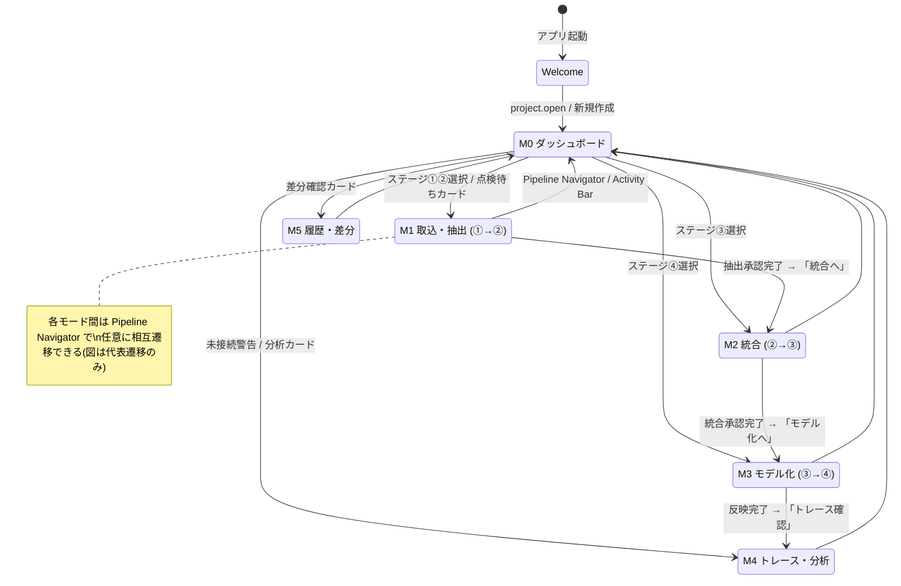
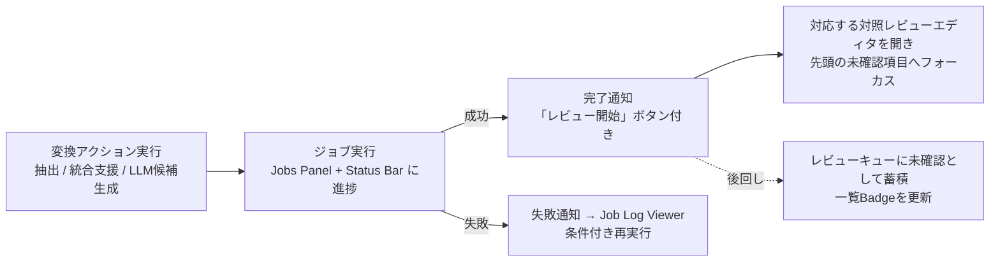
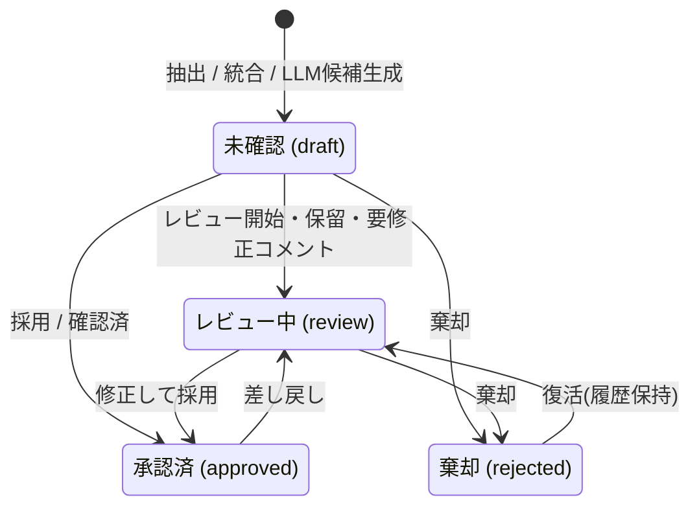

# D2D UI/UX 設計書

> **実装準拠状態（2026-07-20 整理）**: 本書は現在の実装を正として整理済み。実装が存在しない記述には【未適用】を付す。無印の記述は実装済み・実装準拠。

> **本文と付録の関係**: 「付録A: 実装確定済み UI・操作仕様」は実装フェーズで確定した仕様の正本であり、本文（§1〜§17）と矛盾する場合は付録Aを優先する。初期ワイヤーフレーム `sdd_ui_wireframes.html` は検討時の資料であり実装の正ではない。

## 1. 目的

D2D の UI/UX を VSCode 風の Workbench 型 UX として設計するための方針、画面構成、作業モード、画面遷移、レビュー UX、状態連携、共通 UI パターンを定義する。図版は `sdd_ui_wireframes.html` を参照する。各図には図ID（WF-M0〜WF-M5、WF-X1〜WF-X2、WF-V01〜WF-V19）を付与する。

D2D は、①原本データ → ②抽出データ → ③中間データ → ④設計モデルの4階層を、ツールによる抽出・候補提示と人間による点検・承認(human-in-the-loop)を繰り返しながら段階的にデータ化する設計支援ツールである。そのため UI は次の2つを両立する。

1. **Workbench 型の自由度**: 複数の作業対象(Resource)を開き、並べ、比較し、編集できる IDE 風の操作性(踏襲)。
2. **段階的レビューの導線**: 「いまどの階層の、どのデータが、何件点検待ちか」を常に可視化し、点検 → 判断(採用・修正・棄却) → 正本反映の反復作業を最短の操作で回せる導線(本版で刷新)。

---

## 2. UI/UX 基本方針

### 2.1 Workbench 型 UX(踏襲)

| 領域 | 目的 |
| --- | --- |
| Navigation | プロジェクト、原本、成果物、設計要素、トレース対象を探す |
| Editor | 対象 Resource を開いて閲覧、編集、レビューする |
| Auxiliary View | 現在対象の詳細、根拠、関係、候補、ログを確認する |
| Command | 操作をメニュー、ボタン、ショートカット、コマンドパレットから一貫して実行する |
| Context | 選択中の対象、アクティブ Editor、ジョブ状態、レビュー状態に応じて UI を変える |

### 2.2 刷新の狙い: 段階的データ化とレビューの可視化

従来設計は Workbench の静的構成(領域・ビュー・Command)を定義していたが、①→②→③→④ の変換を人間レビューで進める「作業の流れ」が画面構造に現れていなかった。本版では以下を UI の一次構造として導入する。

| 導入要素 | 内容 | 解決する課題 |
| --- | --- | --- |
| パイプラインナビゲータ | ①〜④の変換順序、分析、用語集、Resourceアドレスを常時表示する帯 | データ階層と現在画面の所在を見失う |
| 作業モード(Perspective) | ステージの作業文脈と推奨Commandを切り替えるContext | 現在の作業文脈が不明確になる |
| 対照レビューエディタ | 上流(根拠)と下流(候補・編集結果)を対で表示し、判断操作を横に置く共通パターン | 原本対照・候補点検の画面構成がビューごとにバラバラになる |
| レビューキュー | 未確認・要修正・LLM 候補待ちを横断集約する Inbox | 点検対象がビューの奥に埋もれ、レビュー漏れが起きる |
| 画面遷移設計 | モード切替 / Resource タブ / モーダルの3分類と遷移図 | 固定画面遷移でも完全自由でもない、遷移の規律がない |

### 2.3 D2D 固有の UX 原則

| 原則 | 内容 |
| --- | --- |
| IDE 風でコンパクト | Web サイト風の余白・カード中心構成ではなく、IDE のような高密度で反復作業しやすい画面にする |
| Resource 中心(オブジェクト指向型UI) | 画面名ではなく、原本、抽出要素、中間データ、設計要素、トレース結果、差分、設定などの Resource を開く |
| ステージの常時可視化 | ①〜④の進捗・点検待ち件数をパイプラインナビゲータで常時表示し、どの画面からでも1操作で該当ステージの作業へ移れる |
| 探索と編集の分離 | Activity Bar / Side Bar は探索・選択、Editor Area は主作業、Panel は結果・ログ・問題表示に使う |
| Command 集約 | 主要操作は Command として定義し、メニュー、ツールバー、コンテキストメニュー、ショートカットから同じ処理を呼ぶ |
| Human-in-the-loop | ツール出力(抽出結果・LLM 候補)は必ず「候補」として表示し、採用、修正、棄却を人間が確定してから正本へ反映する。正本への自動反映は行わない |
| 対で見せる | 点検は必ず「上流(根拠)と下流(結果・候補)の対照表示」で行う。単独表示のまま承認させない |
| 判断コストの最小化 | 次の未確認項目への移動、採用・棄却、根拠確認をキーボードのみで連続実行できる |
| 根拠の常時参照 | 編集対象から、原本位置、抽出データ、中間データ、設計モデル、LLM ログ、レビュー記録へ辿れるようにする |
| 長時間処理の非同期化 | 抽出、LLM 実行、DB to Text、差分生成、レポート生成は Job として扱い、UI をブロックしない。完了時はレビュー導線へ誘導する |
| レイアウト復元 | タブとEditor分割はプロジェクト単位、Primary／Secondary Side Barと下段Panelの表示・寸法はWorkbench共通状態として保存・復元できる |

### 2.4 テーマ・アイコン方針

D2D のテーマは、表示モードとカラーテーマを分けて扱う。表示モードはライト、ダーク、システム設定連動を扱い、カラーテーマは Serendie Design System の5テーマを扱う。

| 区分 | 選択肢 | 設計方針 |
| --- | --- | --- |
| 表示モード | `light`、`dark`、`system` | 明暗の切替として扱い、OS 設定連動を可能にする |
| カラーテーマ | `konjo`、`asagi`、`sumire`、`tsutsuji`、`kurikawa` | アプリ全体のアクセント、選択状態、強調、状態色のベースとして扱う |
| 適用範囲 | Workbench 全体 | Title Bar、Pipeline Navigator、Activity Bar、Side Bar、Editor、Panel、Status Bar、Dialog、Notification に一貫して適用する |
| 保存単位 | User Settings / Project Settings | 既定はユーザー設定とし、必要に応じてプロジェクト単位の推奨テーマを保持できる |

テーマ適用はデザイントークンを介して行い、個別コンポーネントに固定色を直書きしない。状態色、レビュー状態、エラー、警告、成功、選択中、未保存状態は、各テーマとライト/ダークの双方で識別可能なコントラストを確保する。特にレビュー状態(未確認・確認済・要修正・棄却・候補)は、ステージやビューが変わっても同一の色・アイコンで表現する。

ツール設定は共通トークンのユーザ上書きとして、Workbench背景、パネル・サーフェス、文字、補助文字、境界線、アクセント、選択背景、ボタン背景・文字・境界を個別に保存する。色入力の未設定時の値はダーク固定値を使わず、選択中の表示モード、カラーテーマ、system時のOSテーマから求める。個別設定を解除した場合も、その時点のテーマ既定色へ戻す（UI-052）。

UI アイコンは、Serendie Design System の `serendie/serendie-symbols` をベースに選択する。Activity Bar、Toolbar、Context Menu、Status Bar、Panel タブ、通知、レビュー操作のアイコンは、意味が一致する Serendie Symbols を優先し、同一概念には同一アイコンを使う。用途に一致するアイコンがない場合は、近い意味のアイコンを暫定利用するのではなく、テキストラベルまたはプロジェクト内の追加アイコン候補として扱う。

---

## 3. 全体レイアウト

Workbench は、Title Bar、**Pipeline Navigator(新設)**、Activity Bar、Primary Side Bar、Editor Area、Secondary Side Bar、Panel、Status Bar で構成する。

```text
┌──────────────────────────────────────────────────────────────────────────┐
│ Title Bar / Command Center                                               │
│ D2D                 [Command Palette / Quick Pick]              [◧][◨][▤] │
├──────────────────────────────────────────────────────────────────────────┤
│ Pipeline Navigator                                                       │
│ [←][→][↻][⌂]｜①原本 抽出▶②抽出 統合▶③中間 モデル化▶④モデル 分析 用語集｜[URI][★]｜[検索] │
├────┬────────────────────┬─────────────────────────────────┬─────────────┤
│    │ Primary Side Bar   │ Editor Area                     │ Secondary   │
│ A  │                    │                                 │ Side Bar    │
│ c  │ ・Explorer         │ ┌────────────┬────────────┐     │             │
│ t  │ ・Search           │ │ Tab Group  │ Tab Group  │     │ ・Properties│
│ i  │ ・Trace            │ │ Resource A │ Resource B │     │ ・Relations │
│ v  │ ・Reports          │ └────────────┴────────────┘     │ ・Relation  │
│ i  │ ・History          │                                 │ ・LLM候補   │
│ t  │ ・Settings         │                                 │ ・Review    │
│ y  │                    │                                 │             │
├────┴────────────────────┴─────────────────────────────────┴─────────────┤
│ Panel: 問題 | 出力 | ジョブ | 検証 | LLMログ（表示名は日本語。検索結果はSearch Activityへ） │
├──────────────────────────────────────────────────────────────────────────┤
│ Status Bar: project | job state | warnings | LLM                         │
└──────────────────────────────────────────────────────────────────────────┘
```

| パーツ | 役割 | D2D での用途 |
| --- | --- | --- |
| Title Bar / Command Center | 全体状態とコマンド入口 | 左端はD2Dだけを表示し、中央にコマンドパレット入口、右端にPrimary／Secondary／Panelのアイコン表示切替を配置する |
| 上部メニューバー（Pipeline Navigator） | Resource履歴、データ階層の変換順序、分析・用語集・Resource URIの入口 | 戻る／進む／更新／ホーム、①〜④を変換名・件数付きで表示し、現在開いている1ステージだけを選択表示する。分析、用語集、編集可能なアドレスバー、画面内検索、お気に入りからEditorを開く |
| Activity Bar | 作業文脈の切替 | Explorer、Search、Trace、Reports、History、Settings。Reviewは各編集画面／Secondary、Jobsは下段Panel／Status Barで提供 |
| Primary Side Bar | 探索・選択・絞り込み | プロジェクト名をルートとする①～④の単一Tree、検索条件。Explorer内には作成・取込・編集の常設ボタンを置かない |
| Editor Area | 主作業 | 原本、抽出データ、中間データ、設計モデル、候補セット、マトリクス、グラフ、Diff、設定をタブで開く |
| Editor Group | 分割単位 | 左右・上下分割、タブ移動、比較表示、プレビュータブ |
| Secondary Side Bar | 現在対象の補助情報 | Properties、Relations、Review、Dictionary。前3者はWorkbench共通Selectionに連動し、Dictionaryはプロジェクト辞書を前方一致検索する |
| Panel | 実行結果・問題・ログ | 問題／出力／ジョブ／検証／LLMログ（タブID: problems/output/jobs/validation/llm）。全文検索結果はSearch Activity内に表示する |
| Status Bar | 軽量な常時状態表示 | プロジェクト、ジョブ状態、警告数、Gitブランチとローカルupstream参照に対するahead／behind、PlantUML／MeCab利用可否、LLM Provider設定状態と外部送信可否、デバッグログレベル。作業モード名とResource URIは表示しない |

### 3.1 Pipeline Navigator の仕様

| 項目 | 仕様 |
| --- | --- |
| 表示順 | `戻る　進む　更新　ホーム｜①原本　抽出▶　②抽出　統合▶　③中間　モデル化▶　④モデル　分析　用語集｜アドレスバー　お気に入り｜画面内検索` の固定順で表示する。①〜④、分析、用語集は境界と背景を持つ同一ボタンデザインとし、①〜④は件数を表示する |
| Resource履歴 | 戻る／進むはメニューバー、Alt+左右矢印、マウスの戻る／進むボタンを同一履歴へ接続する。更新はアクティブEditorを再マウントして正本を再読込し、ホームは `project://current` を開く |
| ステージクリック | 対応する作業モード(5章)へ切り替え、Editor Areaにステージ一覧を開く。Pipeline Navigatorの選択色は作業モードではなく現在の `stage://` Resourceで判定し、①～④のうち1件だけを選択表示する。①原本は取込操作＋取込済み原本一覧＋読取専用詳細（ファイル表示はWindows関連付けアプリへ委譲）、②抽出は抽出文書一覧＋D2Dプレビュー＋EXPLORE選択案内、③中間は取込操作＋開発フェーズ－成果物階層一覧＋D2Dプレビュー、④設計モデルはモデル一覧＋状態遷移／モデル／用語集の追加操作を表示する。各列見出しは昇順／降順ソートを切り替える |
| 分析 | 汎用インパクト分析を開き、初期構成をリスト1=全抽出データ、リスト2=全中間データ、リスト3=全モデルとする |
| 用語集 | プロジェクト用語集Editorを開く |
| アドレスバー | アクティブEditorの内部Resource URIを表示して直接編集を受け付ける。「アドレス」ラベルは表示しない。左側ボタンは縮小せず、アドレス入力だけを画面幅に応じて可変幅とする。Enter時に既知URIとして検証し、不正な場合はエラー通知して画面遷移しない。右側の星は現在Resourceのお気に入り登録状態を表すトグルとする |
| お気に入り | Resource URI、表示名をプロジェクト単位で保存し、Explorerのプロジェクト配下に折畳可能な「お気に入り」として表示する。表示名はインラインで変更できる |
| 一覧操作 | 全ステージ一覧は選択行を薄青背景で表示し、上下矢印キーで選択行とフォーカスを移動し、Enter／Spaceはクリックと同じ動作を行う。④モデルはシングルクリックで詳細を開く。①～③の一覧／プレビュー境界はドラッグまたは矢印キーで変更する。①原本、②抽出、③中間では `status='deleted'` の論理削除とアーカイブ／復元を提供し、アーカイブはデータを保持したままExplorerだけから除外する |
| 変換表記 | ステージ間には操作順序を示す `抽出▶`、`統合▶`、`モデル化▶` を他のボタン文字より1px小さく表示する |
| 表示切替 | 狭い画面でもアドレスバーを可変幅として、ステージ順序、分析、用語集の導線を維持する |

---

Workbench全体はブラウザと同じCtrl+プラス／マイナス／0およびCtrl+マウスホイールで50〜200%の表示倍率を変更し、ツール全体へ保存する。倍率補正後もviewportの幅と高さを満たし、縮小時に未使用の余白を作らない。Workbench全体の操作ボタンは一律にレスポンシブ化しない。操作が密集する抽出／中間編集画面だけ、操作ごとに明示した重複しないアイコンと文字列を通常幅で併記し、狭幅ではアクセシブル名とTooltipを維持してアイコン中心へ切り替える。上部メニューバーは横スクロールさせず、アドレスバーだけを縮小して固定順の操作を保持する。

## 4. 内部 UX モデル

### 4.1 Resource

Resource は、D2D 上で開く、参照する、編集する対象の抽象概念である。Editor Area は画面ではなく Resource を開く。

| Resource 種別 | 例 | 主な Editor |
| --- | --- | --- |
| `project://` | `project://current` | Project Dashboard Editor |
| `original://` | `original://<source_document_uid>` | Original Viewer |
| `extracted://` | `extracted://<extracted_document_uid>` | Extraction Review Editor |
| `intermediate://` | `intermediate://<intermediate_document_uid>` | Intermediate Document Editor |
| `intermediate://compose` | `intermediate://compose/<intermediate_document_uid>` | Composition Editor |
| `design://` | `design://<design_element_uid>` | Design Model Editor |
| `candidate://` | `candidate://<llm_run_uid>` | Candidate Set Review Editor |
| `chunk://` | `chunk://<intermediate_document_uid>` | Chunk Manager |
| `trace://` | `trace://query/<query_id>` | Trace Matrix / Graph Editor |
| `diff://` | `diff://<left>/<right>` | Diff Editor |
| `log://` | `log://job/<job_id>`、`log://llm/<llm_run_uid>` | Log Viewer |
| `settings://` | `settings://workspace` | Settings Editor |
| `report://` | `report://<report_job_id>`、`report://config` | Report Preview Editor / Report Editor |
| `history://` | `history://` | History Editor |
| `store://` | `store://` | Store Browser |
| `glossary://` | `glossary://` | Glossary Editor |

### 4.2 Command

主要操作は Command として登録する。UI 部品は個別処理を直接持たず、Command を呼び出す。

| Command 例 | 用途 |
| --- | --- |
| `project.open` | `project.d2d` を開く |
| `mode.switch` | 作業モード(Perspective)を切り替える |
| `resource.open` | Resource を Editor Area に開く |
| `resource.save` | 編集内容を正本へ保存する |
| `editor.split` | Editor Group を分割する |
| `job.startExtraction` | 原本抽出ジョブを開始する |
| `job.retry` | 失敗ジョブを条件付きで再実行する |
| `compose.assign` | 抽出要素を③中間データの章節へ割り当てる |
| `chunk.create` | 選択範囲からチャンクを作成する |
| `llm.generateCandidate` | LLM 候補を生成する(送信前確認を経由する) |
| `review.accept` / `review.acceptWithEdit` / `review.reject` | 候補または点検対象を採用 / 修正して採用 / 棄却する |
| `review.next` / `review.prev` | 次 / 前の未確認項目へ移動する |
| `glossary.addCandidate` | 選択テキストから用語候補を抽出し、用語集へ登録する（EDIT-055） |
| `semantic.search` | 入力欄ポリシーと前方一致語から最近使用、辞書用語、モデル要素の候補群を取得する（EDIT-066） |
| `semantic.analyze` | 現在文章を形態素解析・辞書照合し、参照、正規化、未登録用語の候補を返す（EDIT-060、EDIT-067） |
| `semantic.validateStructured` | 構造化直接編集のスキーマ、UID存在、文字範囲、参照整合性、関係ルールを保存前検証する（EDIT-070、EDIT-071） |
| `semantic.save` | 原文、表示文章、構造化参照、履歴を保存し、承認済み参照のtraceを確定する（EDIT-058〜062） |
| `trace.runQuery` | トレースクエリを実行する |
| `diff.open` | DB to Text または Git 差分を開く |
| `report.generate` | レポート生成ジョブを開始する |

### 4.3 Selection / Context / Event

UI パーツ間の連携は、直接参照ではなく Selection、Context、Event を介して行う。

```text
ユーザー操作
  ↓
Command 実行
  ↓
Service 呼び出し
  ↓
Selection / Context 更新
  ↓
Event 発行
  ↓
Editor / Side Bar / Panel / Status Bar / Pipeline Navigator 更新
```

| 概念 | 管理内容 | UI への影響 |
| --- | --- | --- |
| Selection | 選択 Resource、選択設計要素、選択範囲、アクティブ Editor | Secondary Side Bar、Status Bar、Context Menu を更新 |
| Context | `workMode`、`activeEditor`、`selectedResourceType`、`hasDirtyEditor`、`isJobRunning`、`reviewStatus`、`llmExternalAllowed` 等 | Command の有効/無効、メニュー表示、ツールバー表示、変換アクション可否を制御 |
| Event | `resource.opened`、`resource.saved`、`selection.changed`、`job.updated`、`review.updated`、`trace.updated` 等 | 関連ビュー、レビューキュー、Pipeline Navigator の選択状態を疎結合に同期 |

UI内部イベントは Workbench 内の疎結合連携用であり、バックエンドイベント（`sdd_function_architecture.md` 9章）は Main 経由で購読してUI内部イベントへ変換する。対応は以下とする。

| バックエンドイベント | 変換先のUI内部イベント | 主な更新先 |
| --- | --- | --- |
| `extraction.completed`、`intermediate.updated`、`design_model.updated`、`artifact.updated` | `review.updated`、`job.updated` | レビューキュー、Pipeline Navigator、対照レビューエディタ |
| `relation.updated` | `trace.updated` | Trace Matrix / Graph、Relations タブ |
| `llm.candidate.generated` | `review.updated` | 候補セット、レビューキュー |
| `archive.created`、`archive.imported`、`report.generated` | `job.updated` | Jobs Panel、通知 |

---

## 5. 作業モード(Perspective)

作業モードは、ステージの作業単位に対応する「作業Context + 推奨 Command セット」である。固定画面遷移ではなく、Workbench の自由度（タブ、分割、任意 Resource の追加）を保ったまま作業文脈を切り替える。作業モード切替ではPrimary／Secondary Side Barと下段Panelの表示・寸法を変更しない。

### 5.1 モード一覧

| モード | 対象変換 | 主目的 | 既定レイアウト |
| --- | --- | --- | --- |
| M0: ダッシュボード | ─ | プロジェクト全体の進捗把握と作業再開 | Project Dashboard Editor 単独 |
| M1: 取込・抽出 | ①→② | 原本取込、抽出実行、抽出結果の点検・承認 | 抽出レビュー3ペイン + Jobs Panel |
| M2: 統合 | ②→③ | 抽出要素の成果物への割当・統合、章構成の点検・承認 | 統合3ペイン(未割当一覧 / ③アウトライン+文書 / レビュー) |
| M3: モデル化 | ③→④ | チャンク作成、LLM 候補生成、候補点検、④モデル編集 | ③文書 + 候補セット + レビューパネル |
| M4: トレース・分析 | 横断 | マトリクス、グラフ、未接続検出、影響分析 | Trace Matrix / Graph + Problems Panel |
| M5: 履歴・差分 | 横断 | Git状態・ステージ・コミット・ローカルブランチ・履歴、DB to Text、ZIP差分の確認 | Diff Editor + History Side Bar |

### 5.2 モードの規則

| 規則 | 内容 |
| --- | --- |
| 切替入口 | Pipeline Navigator のステージクリック、Activity Bar、Command Palette(`mode.switch`)、ジョブ完了通知の「レビュー開始」から切り替える |
| レイアウト独立 | Editorのタブ・分割はプロジェクト単位で保持し、外周のSide Bar／Panel状態は全モードで共有する。モードを往復しても表示有無・寸法を変更しない |
| 自由度の保持 | モードはプリセットであり拘束ではない。どのモードでも任意の Resource を開ける。モード既定に戻す `mode.resetLayout` を提供する |
| Context 連動 | `workMode` を Context Key とし、ツールバー、コンテキストメニュー、Pipeline Navigator のステージ選択表示を最適化する |
| 復元 | 最後に使用したモードとそのレイアウトをプロジェクト単位で保存し、再開時に復元する(UI-025) |

---

## 6. 画面遷移設計

### 6.1 遷移の3分類

D2D の画面遷移は次の3種類のみとし、これ以外の遷移(全画面を置き換えるページ遷移等)は作らない。

| 分類 | 内容 | 例 |
| --- | --- | --- |
| モード切替 | Workbench外周レイアウトを維持したまま作業Contextを切り替える。Editorタブは失われない | ダッシュボード → M1 取込・抽出 |
| Resource を開く | Editor Area にタブとして開く / アクティブ化する。ダブルクリックでピン留め、シングルクリックでプレビュータブ | 抽出レビューエディタ、候補セット、Diff |
| モーダル | 明示的な判断・入力が必要な場合のみダイアログ / ウィザードを出す | 取込ウィザード、LLM 送信前確認、破壊的操作確認 |

### 6.2 トップレベル遷移図



- 順方向の遷移(M1→M2→M3→M4)は「このステージの点検が一段落したら次へ」という推奨導線であり、強制しない。
- どのモードからでも Pipeline Navigator / Activity Bar / Command Palette で任意のモードへ1操作で移れる。

### 6.3 ウェルカムと Help Resource

プロジェクト未選択時は `WelcomeEditor` を表示し、D2Dが自然言語の「文書」を段階的に、オントロジー（意味構造）へ写像された「データ」へ変換する設計支援環境であることを説明する。固定ページ遷移は増やさず、次の説明を読取専用のHelp Resourceとして通常のEditorタブへ開く。

| Resource URI | 表示内容 |
| --- | --- |
| `help://workflow` | ①原本 → ②抽出 → ③中間 → ④設計モデル → トレーサビリティ分析の作業、成果、レビューゲート |
| `help://schema` | `entity_registry`を中心とする共通台帳、文書層、Resource詳細層、`trace_link`関係層、`project.db`と`blobs/`の責務 |
| `help://design-model` | SRS 9章の13分類、関係種別、候補と確定情報、人間レビュー、`owner_uid`と`allocated_to`の区別 |
| `help://addresses` | Resource URIの指定書式、UID省略時の一覧表示、空タブと`Ctrl+T`の使い方 |

Helpは説明専用の別Windowを作らず、`resource.open`と同じタブ・分割・復元規則に従う。Workbench共通の画面内検索はタイトルバーの検索ボタンとCtrl/Cmd+Fの両方から開き、現在表示されているEditor、Side Bar、Panel、モーダルを検索対象とする。各`button`は個別の詳細`title`を優先し、未設定時も共通Tooltip保証によりアクセシブル名から操作説明を補う。

### 6.4 モーダルフロー(ウィザード・確認)

モーダルは判断・入力が必須の場面に限定する(2.3 の Dialog 原則)。

| モーダル | 起点 | ステップ | 完了後の遷移 |
| --- | --- | --- | --- |
| 原本取込ウィザード | M1 ツールバー / Explorer へのファイルドロップ | (1) ファイル選択・重複(ハッシュ)確認 → (2) 抽出設定(抽出器・対象範囲) → (3) 実行確認 | 抽出ジョブ開始。Jobs Panel に進捗、完了通知から抽出レビューへ |
| 統合セットアップ | M2 「取込」 / Pipeline Navigator の③中間 | (1) 成果物(`project_artifact_setting`)と開発フェーズ選択 → (2) 対象②抽出文書の選択 → (3) 初期章構成(空 / 原本準拠 / LLM 提案) | Composition Editor を開く |
| LLM 送信前確認 | 接続テスト、候補生成、用語抽出、Resourceマージ等の全LLM実行ボタン | 画面用途に合うテンプレート選択、実行時プロンプト編集、新版保存、送信先・モデル・マスキング後の全メッセージ確認。確認まではジョブを登録しない | 利用者の明示承認後だけLLMジョブ開始。完了通知から候補レビューへ |
| ZIP 差分インポート | M5 / Explorer | (1) ZIP 選択と manifest 確認 → (2) 比較対象(現行成果物)選択 | Diff Editor を開く(正本は上書きしない) |
| 破壊的操作確認 | 削除、上書き、一括棄却等 | 対象件数・影響(trace_link への影響)の提示 → 確認 | 実行して元のビューに留まる |

### 6.5 ジョブ完了からレビューへの導線

長時間処理はジョブ化し UI をブロックしない。完了後に「結果を人が点検する」ことが必須のため、ジョブ完了を必ずレビュー導線へ接続する。



---

## 7. レビュー UX 共通パターン

### 7.1 対照レビューエディタ

すべての点検・承認は「対照レビューエディタ」パターンで行う。ステージにより中身は変わるが、構成・操作・状態表現は共通とする。

```text
┌────────────┬──────────────────────────────────────────┬──────────────┐
│ レビュー一覧 │ 対照ビュー                                │ 判断パネル    │
│            │ ┌──────────────┬──────────────────────┐   │              │
│ フィルタ:   │ │ 上流(根拠)    │ 下流(結果・候補)      │   │ 状態: 未確認  │
│  状態/種別/ │ │ 原本プレビュー │ 抽出結果/③文書/④候補 │   │ [✓採用]      │
│  警告      │ │ (位置ハイライト)│ (編集可)             │   │ [✎修正して採用]│
│ 進捗 n/m   │ └──────────────┴──────────────────────┘   │ [✗棄却]      │
│ (仮想リスト)│  選択項目の対応箇所を相互ハイライト          │ 根拠/履歴/メモ │
└────────────┴──────────────────────────────────────────┴──────────────┘
```

| 領域 | 仕様 |
| --- | --- |
| レビュー一覧 | 点検対象を仮想スクロールで一覧表示。状態(未確認/確認済/要修正/棄却)、種別(text/table/figure/formula 等)、警告有無、信頼度でフィルタ・ソートできる。進捗メーター(確認済 n / 全 m)を常時表示する |
| 対照ビュー | 左に上流(根拠)、右に下流(結果・候補)を並べる。一覧で項目を選ぶと、上流側は `source_location` / `trace_link` に基づき該当箇所へスクロール+ハイライトし、下流側は該当要素を選択状態にする。右側は直接編集でき、編集は「修正して採用」として記録される |
| 判断パネル | 採用 / 修正して採用 / 棄却 / 保留(スキップ)を大きく配置。判断理由・レビューコメントを `entity_registry.review_info_json` へ記録する。直近の判断履歴と Undo を表示する |
| 判断後の挙動 | 判断確定で自動的に次の未確認項目へ移動する(設定でオフ可)。一覧の状態バッジとレビューキューが即時更新される |
| ジャンプ・ハイライト | アウトライン、検索結果、コメント、変更履歴、問題一覧から該当要素へ移動する場合は、対象ペインを自動的に表示し、該当箇所へスクロールして短時間ハイライトする |

Word抽出レビューでは、アウトラインツリー、Markdownプレビュー、Markdownソース、文書構造データ、コメント・変更履歴一覧をD2DのResource/Editorとして提供する。アウトラインは `structure_json.elements` の見出し、表、図、コメント、変更履歴から構築し、選択は原本プレビュー、抽出結果、文書構造データ、Secondary Side Bar のProperties／Relations／Reviewへ同期する。ページ番号、プレビュー用アンカー、コメント・変更履歴マーカーは表示トグルで切り替え、LLM入力用クリーンMarkdownの確認にも利用できるようにする。

文書プレビューは `runs` の直接書式、`list_info`、図形・グループ・コネクタ、header／footer／footnote／endnote、フィールドを保存情報に基づいて表示する。図形は完全なWord描画の代替ではなく、図形種別・名前・親子・位置・寸法・接続ID・矢印と図形内文字を確認できる情報カードとする。Wordレイアウトエンジン依存のページ割付、折返し、座標、継承後書式は推測しない（EXT-048）。

【未適用（P5-8〜9）】PowerPoint抽出レビューでは、スライド一覧、SVGまたは画像プレビュー、透明な要素選択レイヤー、Markdownプレビュー、要素プロパティ、スピーカーノート、コンソールログをD2DのExtraction Review Editorとして提供する。左ペインはスライド一覧と要素数サマリー、中央ペインはスライドプレビューとHTMLオーバーレイ相当の選択枠、右ペインはMarkdownまたは文書構造データ、下部Panelは要素プロパティ、スピーカーノート、Jobs、Problems、抽出ログを切り替える。要素のクリック、複数選択、除外、タイトル等の役割補正、図形グループ化、スライド検証状態の変更は候補編集として扱い、レビュー操作で②正本へ反映する。

【未適用（P5-10〜11）】PDF抽出レビューでは、ページ画像上の領域枠編集、プロパティ編集、表エディタ、ページ/全文Markdownプレビュー、JSONプレビュー、表プレビュー、LLMログをD2DのExtraction Review Editorとして提供する。中央ペインはページ画像とbboxオーバーレイを主表示とし、ズーム倍率に応じてPDF座標系と画面pxを変換する。領域枠は選択、移動、8方向リサイズ、新規作成、削除、種別変更を可能にするが、編集結果は候補として扱い、採用・修正して採用・棄却のレビュー操作で②正本へ反映する。右ペインは選択領域の bbox、種別、本文、表二次元配列、OCR/LLM補正候補を表示し、Workbench共通SecondaryのProperties／Relations／Reviewと選択を同期し、下部PanelはMarkdown、文書構造データ、表プレビュー、LLM Logs、Jobs、Problemsを切り替える。

ステージ別の対照内容:

| モード | 上流(根拠) | 下流(結果・候補) | 判断の反映先 |
| --- | --- | --- | --- |
| M1 抽出レビュー | 原本プレビュー(ページ/シート/スライド位置) | 抽出要素(テキスト・表・図・数式) | `extracted_*` の状態更新、修正は②正本へ(EXT-021〜024) |
| M1 PowerPoint抽出レビュー | スライドプレビュー、スライド内座標、スピーカーノート | スライド要素、Markdown、除外/役割/グループ化候補 | `extracted_*` の候補編集、採用後に②正本へ(EXT-034〜039) |
| M1 PDF抽出レビュー | PDFページ画像、座標領域、クロップ画像 | bbox付き抽出ブロック、表データ、OCR/LLM候補 | `extracted_*` の候補編集、採用後に②正本へ(EXT-027〜033) |
| M2 統合レビュー | ②抽出要素(原本位置つき) | ③統合文書の該当章節・本文・図表 | `intermediate_*` と `trace_link`(`based_on` + `basis_kind=extracted/normalized`) |
| M3 候補レビュー | ③中間データ(チャンク範囲・本文) | LLM 候補(④要素候補・関係候補・説明文候補) | 採用時のみ④正本 + `trace_link`(`based_on`)へ反映(LLM-037〜039) |
| M4 トレース点検 | 関係の from 要素と根拠 | 関係の to 要素、`relation_type`、信頼度 | `trace_link` の確定・修正・削除 |

各対照レビューエディタおよび③④の各エディタでは、選択テキストから `glossary.addCandidate` により用語候補を抽出・登録できる（EDIT-055）。承認済みの用語は各エディタ上でハイライト表示し、ホバーで用語集の定義を参照できる（EDIT-054、EDIT-056、共通UIパターン14章の Glossary Highlight）。

### 7.2 レビューキュー(Inbox)

レビュー操作は各編集画面へ配置し、現在対象のレビュー状態はSecondary Side Barで補助表示する。Primary ActivityにはReviewを設けない。

| 項目 | 仕様 |
| --- | --- |
| 集約対象 | ②抽出の未確認・要修正、③統合の未確認、LLM 候補(未判断)、要修正に差し戻された項目、未接続・検証エラー由来の要対応項目 |
| グループ化 | ステージ → 文書/成果物 → 種別の階層でグループ化し、件数を表示する。フィルタ(状態、担当、警告)を保持できる |
| ジャンプ | 項目クリックで該当の対照レビューエディタを開き、当該項目へフォーカスする(モードも連動して切り替える) |
| 供給元 | `review.updated`、`job.updated` イベントで即時更新する。レビューキューと同じ集計を使う |

### 7.3 レビュー状態モデル

レビュー状態は全ステージ共通の語彙と色・アイコンで表現し、`entity_registry.status` と対応付ける。



| 規則 | 内容 |
| --- | --- |
| 候補と正本の分離 | LLM 候補・抽出結果は承認されるまで正本(②③④)に確定反映しない。候補は候補セット(7.4)として保持する |
| 履歴 | 採用・修正・棄却の操作は `review_info_json` と LLM 実行参照(`llm_run_ref`)に記録し、判断パネルから参照できる(LLM-039) |
| 下流への警告 | 承認済み要素の上流(根拠)が後から変更・差し戻しされた場合、下流要素に「根拠変更あり」警告を付け、Problems とレビューキューに出す |

SRS上の状態語彙（EXT-022 等）と `entity_registry.status` の対応は以下とする。

| SRS上の状態語彙 | `entity_registry.status` | 備考 |
| --- | --- | --- |
| 未確認 | `draft` | 抽出・統合・候補生成直後の既定状態 |
| 確認済 / 承認済 | `approved` | 採用・修正して採用の確定後 |
| 要修正 / レビュー中 | `review` | 要修正は `review` + `review_info_json` の要修正コメントで表す |
| 棄却 | `rejected` | ― |
| （削除） | `deleted` | 論理削除。レビュー状態としては表示しない |

### 7.4 LLM 候補セットレビュー

LLM 実行1回分の出力は「候補セット」(`candidate://<llm_run_uid>`)として1つの Resource で扱う。

| 項目 | 仕様 |
| --- | --- |
| 表示 | 候補をグリッド表示(候補種別、タイトル、根拠チャンク、信頼度、状態)。行選択で対照ビューに根拠③中間データと候補詳細を表示する |
| 判断 | 行単位の採用 / 修正して採用 / 棄却。複数選択して一括判断できる(6.3 の確認モーダル経由) |
| 反映 | 採用時に④正本(`entity_registry` + `resource_*`)を作成し、`trace_link`(`based_on`、`llm_run_uid` つき)を張る |
| 追跡 | 候補セットから LLM ログ(プロンプト、応答、token、コスト)へ1クリックで辿れる(LLM-012、LLM-015) |
| 再実行 | 同一チャンク・同一プロンプト・同一モデルでの再実行条件を表示して再実行できる(LLM-044)。旧候補セットは履歴として残る |

### 7.5 キーボードトリアージ

反復レビューをキーボードのみで回せるようにする。

| 操作 | Command | 既定キー |
| --- | --- | --- |
| 次の未確認へ | `review.next` | `J` / `↓` |
| 前の項目へ | `review.prev` | `K` / `↑` |
| 採用 | `review.accept` | `Ctrl+Enter` |
| 修正して採用(編集にフォーカス) | `review.acceptWithEdit` | `Ctrl+Shift+Enter` |
| 棄却 | `review.reject` | `Ctrl+Delete` |
| 保留(スキップ) | `review.skip` | `Space` |
| 根拠(上流)へフォーカス | `review.focusEvidence` | `Ctrl+E` |
| 判断の取り消し | `edit.undo` | `Ctrl+Z` |

### 7.6 一括操作

| 項目 | 仕様 |
| --- | --- |
| 対象選択 | 一覧のフィルタ結果に対して、複数選択・全選択で一括採用 / 一括棄却できる |
| 安全策 | 一括操作は件数と影響(作成される trace_link、反映先)を確認モーダルで提示してから実行する(NFR-013)。一括操作も Undo 可能とする |
| 用途例 | 「警告なしの段落抽出をすべて確認済にする」「信頼度 0.9 以上の関係候補をまとめて採用する」 |

---

## 8. ステージ別画面設計

### 8.1 M1: 取込・抽出(①→②)

```text
┌────────────┬──────────────────────────────────────────┬──────────────┐
│ 原本/抽出   │ 対照ビュー                                │ Properties   │
│ ツリー      │ ┌──────────────┬──────────────────────┐   │ Relations    │
│ +抽出要素   │ │ 原本プレビュー │ 抽出結果(編集可)      │   │ Review       │
│ 一覧(状態別)│ │ 位置ハイライト │ text/table/fig/formula│   │              │
│            │ └──────────────┴──────────────────────┘   │              │
├────────────┴──────────────────────────────────────────┴──────────────┤
│ Panel: Jobs(抽出進捗) | Problems(抽出警告)                             │
└───────────────────────────────────────────────────────────────────────┘
```

| 項目 | 仕様 |
| --- | --- |
| 取込 | ①原本ステージ一覧上部の「取込」からWindowsの複数ファイル選択ダイアログを直接開き、ファイル単位の取込Jobを登録する。ハッシュ重複を検出し、再取込時は版として扱う(IMP-008) |
| 原本操作 | Pipeline Navigatorの①原本一覧とExplorerの①原本のどちらから原本を選択した場合も、「OSアプリで開く」と「②抽出データの生成（抽出ジョブ実行）」を表示する。当該`source_document.uid`を参照する`extracted_document`が存在する場合、抽出実行は無効表示し、Backendも重複実行を拒否する |
| 抽出レビュー | 対照レビューエディタ(7.1)。一覧は `item_type`、`review_status`、原本ファイル、警告有無で絞り込む。表は元レイアウト(結合セル)との対照、図はキャプション・OCR との対照を表示する |
| Word抽出ビュー | Word文書では、左にアウトライン/抽出要素、中央に原本相当プレビュー・Markdownプレビュー・Markdownソース・文書構造データのタブ、右にコメント・変更履歴を配置し、Workbench共通SecondaryのProperties／Relations／Reviewと選択を同期する。見出し、表、図、コメント、変更履歴のクリックで中央ペインの該当要素へジャンプする |
| PowerPoint抽出ビュー | PowerPoint文書では、左にスライド一覧/要素数サマリー、中央にスライドプレビュー+透明選択レイヤー、右にMarkdown/文書構造データ、下部に要素プロパティ・スピーカーノート・ログを配置する。要素枠の選択、複数選択、除外、役割補正、グループ化、スライド検証状態をMarkdownとプレビューへ即時反映候補として表示する |
| PDF抽出ビュー | PDF文書では、左にページ/抽出ブロック一覧、中央にページ画像+bboxオーバーレイとMarkdown/JSONタブ、右にプロパティ・表エディタ・OCR/LLM候補を配置し、Workbench共通SecondaryのProperties／Relations／Reviewと選択を同期する。bbox、表、LLMログ、Problems のクリックで中央ペインの該当領域へジャンプし短時間ハイライトする |
| Markdown出力確認 | レビュー表示用MarkdownとLLM入力用クリーンMarkdownを切り替え、ページ番号、アンカー、UI用span、画像参照の扱いを確認できる。クリーンMarkdownは正本ではなく派生成果物として扱う |
| 編集・分割・マージ | 抽出結果の修正、要素の分割・マージができ、新要素には新 ID を採番し元 ID を履歴として追跡する(EXT-014〜015)。由来は新要素→旧要素の `trace_link`(`based_on`、`transform_note`=merge / split 等)として記録する |
| 完了導線 | 文書内の未確認 0 件になったら「この文書の抽出レビューを完了し、統合へ」を提示する(強制はしない) |

### 8.2 M2: 統合(②→③)

```text
┌────────────┬──────────────────────────────────────────┬──────────────┐
│ 未割当抽出  │ Composition Editor                        │ Properties   │
│ 要素一覧    │ ┌──────────────┬──────────────────────┐   │ (LLM章構成/   │
│ (原本別/    │ │ ③アウトライン │ ③文書風エディタ       │   │  割当候補)    │
│  種別別)    │ │ 章節ツリー    │ 本文・図表(編集可)    │   │ Relations    │
│ ドラッグ可  │ └──────────────┴──────────────────────┘   │ Review       │
├────────────┴──────────────────────────────────────────┴──────────────┤
│ Panel: Problems(未割当・重複割当) | Jobs                              │
└───────────────────────────────────────────────────────────────────────┘
```

| 操作 | 結果 |
| --- | --- |
| 成果物の新規作成 | 統合セットアップ(6.3)で成果物種別・開発フェーズ・対象②を選ぶ |
| 抽出要素を章節へ割当 | 左の未割当一覧から章節ツリー/本文へドラッグ、または `compose.assign`。`trace_link` を作成する |
| 本文として取り込む | 抽出テキストを③本文へ挿入し根拠リンクを保持する |
| リンクのみ作成 | 本文は変更せず根拠リンクだけ作成する |
| 割当解除 | `trace_link` を削除し未割当へ戻す |
| LLM 章構成・割当提案 | 候補セットとして提示し、採用 / 修正 / 棄却後に③と trace_link へ反映する |
| 統合レビュー | ③の章節・本文を、根拠となった②要素(原本位置つき)と対照表示して点検する(7.1) |
| 完了導線 | 未割当 0 件+③未確認 0 件で「モデル化へ」を提示する |

### 8.3 M3: モデル化(③→④)

```text
┌────────────┬──────────────────────────────────────────┬──────────────┐
│ ③文書/     │ 対照ビュー                                │ Properties   │
│ チャンク    │ ┌──────────────┬──────────────────────┐   │ Relations    │
│ 一覧        │ │ ③中間データ   │ 候補セット(grid) /    │   │ Review       │
│ ④要素ツリー │ │ チャンク範囲   │ ④モデル編集          │   │              │
│            │ │ ハイライト    │ (要素/関係/PlantUML)  │   │              │
│            │ └──────────────┴──────────────────────┘   │              │
├────────────┴──────────────────────────────────────────┴──────────────┤
│ Panel: LLM Logs | Jobs | Validation Results                           │
└───────────────────────────────────────────────────────────────────────┘
```

| 項目 | 仕様 |
| --- | --- |
| チャンク作成 | ③文書上で範囲(章節・段落・図表)を選択して `chunk.create`。チャンクは一覧で管理し、作成・修正・削除できる(MID-031)。チャンク範囲は③文書上にハイライト表示する |
| 候補生成 | チャンク+プロンプトテンプレート(用途別)を選び、LLM 送信前確認(6.3)を経てジョブ実行。完了通知から候補セットレビュー(7.4)へ。候補生成では正規化テキスト、設計要素候補、関係候補、検証警告を構造化JSONとして扱う |
| 候補レビュー | 候補セットをグリッドで点検し、根拠チャンク・③本文と対照して採用 / 修正 / 棄却する。保存前に要素候補と関係候補を追加、修正、削除でき、要素名変更時は同じ候補セット内の関係候補From/Toを追従表示する |
| ④直接編集 | LLM を使わず④要素・関係を手動で登録・編集できる。根拠として③の範囲を選択して `based_on` リンクを張る |
| モデル表現 | PlantUML / SysMLv2 テキストと要素 ID 対応表を表示・編集し、プレビューを並置する(FORM-001〜002) |
| 検証 | 状態遷移の未到達・未定義・競合、検証未対応要求などを Validation Results / Problems に表示し、各行から該当要素へジャンプする |
| 状態遷移シミュレーション | 状態遷移リソースを選択し、初期状態からイベント列を与えて遷移を逐次実行する簡易シミュレーションを提供する(EDIT-034)。通過した状態・遷移を状態遷移図上でハイライトし、到達状態、発火不能イベント、未定義遷移を Validation Results に表示する |

M3では、入力となる③中間データ、正規化結果、設計要素候補表、関係候補表、関係グラフ、AI通信ログをWorkbench Resourceとして分解する。左側に③中間データとチャンク、中央に候補セットグリッドと④モデル編集、右側SecondaryにProperties / Relations / Review、候補は中央の候補セットEditor、下部PanelにLLM Logs / Validation Resultsを置く。表示状態はWorkbenchのタブ、分割ペイン、Panel表示切替、レイアウト復元で管理する。

### 8.4 M4: トレース・分析

#### 8.4.1 汎用トレースマトリクスEditor

トレースマトリクスは設計分類固定の参照表ではなく、台帳登録されたResource集合間の`trace_link`を俯瞰確認・編集するWorkbench Resourceとする。行軸・列軸はそれぞれ、設計分類、②抽出文書配下の`extracted_item`、③中間文書配下の`intermediate_item`、Resource種別を複数選択して和集合を構成する。③中間文書は正本Resourceを複数束ねる表示スコープであり、文書自体をセル要素へ展開しない。

| 項目 | 仕様 |
| --- | --- |
| 関係表示 | 11種類の`relation_type`から複数を同時選択し、関係別の色・短縮記号をセルへ重ねて表示する。表示対象の関係を1件以上持つ行・列見出しを強調する |
| 方向 | 編集方向は「行→列」「列→行」を上部で選ぶ。セル内には実際のfrom/to方向を矢印で示す。行列転置時は表示軸だけを交換し、保存済みfrom/toは変更しない |
| 単一編集 | 修飾キーなしのセルクリックは、選択中の関係種別について設定方向の関係をトグルする。存在しない関係は`relation_rule_master`検査後に追加し、存在する関係は`trace_link`台帳行を`status='deleted'`へ論理削除する |
| 複数編集 | Ctrl/CmdまたはShift付きセルクリック、行見出し、列見出しで対象セル集合を選択する。上部の「選択へ追加」「選択から削除」は全対象を同一トランザクションで処理し、1件でも検証エラーなら全体を反映しない |
| 選択表示 | アクティブセルの行・列全体を十字に強調し、複数選択セルは別の選択背景で示す |
| 大表対応 | 表領域だけをスクロールし、列見出しと行見出しはsticky表示する。表示倍率は60〜160%で変更できる |
| Tooltip | 行・列見出しはcode、title、entity_type、design_category、status、所属スコープを表示する |

マトリクス取得APIは表示スコープ一覧、行列Resource、両方向の関係リンクを返す。編集APIは対象セル対、関係種別配列、方向、操作（add/delete/toggle）を受ける操作単位APIとし、Rendererからセル単位の細粒度DB操作を反復しない。


候補セットグリッドは、要素候補と関係候補を別タブまたは上下分割で表示する。要素候補の名前、分類、説明、レビュー状態を編集した場合、関係候補は候補一時IDで起点・終点を解決し、表示名だけを即時追従させる。未解決参照、許容外関係、重複、根拠なし候補はValidation Resultsへ出し、該当行を選択すると候補グリッド、③根拠範囲、LLMログが同期する。

#### 8.4.2 汎用インパクト分析ビュー

`trace://list-link/<view-id>`は固定の②→③→④表示ではなく、任意のResource集合を複数列へ配置する参照専用のTrace Impact Editorとする。各列は設計分類、②抽出文書、③中間文書、チャンク、Resource種別のスコープを複数選択して和集合を構成し、列の左右追加・削除・ドラッグ並替えを許可する。各見出しの間隔ハンドルは直前列との間隔を24〜320pxで変更し、その境界より右側の全列を同じ差分だけ連動移動する。列数は最大8、1列1000項目、取得リンク5000件を上限とし、上限到達を画面へ明示する。

| 項目 | 仕様 |
| --- | --- |
| リンク表示 | 表示中の全列組合せについて`trace_link`を曲線で結び、複数ステップ離れた列間も省略しない。from→to方向を小型矢印、`relation_type`を色・短縮記号で識別する。11種類から複数を同時選択でき、描画ON/OFFを切り替え、項目・リンクのhoverで台帳プロパティをTooltip表示する |
| インパクト分析 | Ctrl/Cmd・Shiftで任意列の項目を複数選択し、選択集合から表示列をまたいで到達する項目とリンクをBFSで強調する。最後に選択した列を起点列とする |
| 関連項目限定 | 起点列は全項目を維持し、その左右は選択関係で起点集合から到達できる項目だけを表示する。選択が空の場合は通常表示へ戻す |
| 階層 | ②・③の`structure_json.elements`の文書順、見出しlevel、list levelから親子と表示深さを導出する。折畳中の子を端点とするリンクは最寄りの表示中祖先へ集約し、集約件数を示す |
| 選択連携 | 各列の項目は上下キーで移動し、Shift+上下キーでアンカーから連続範囲を選択する。最後に操作した項目をWorkbench共通Selectionへ通知してSecondary Side BarのProperties／Relations／Reviewを更新する |
| スクロール・描画負荷 | 各列の項目領域へ独立した縦スクロールを設ける。各列scrollと横viewport scrollによる項目配置計測・リンク再描画は
equestAnimationFrameで1フレームに集約する。表示領域と前後のoverscan内に端点を持つリンクだけをSVGへ描画し、画面外端点は列の表示領域端へクランプする |
| 構成保存 | 列順、列ごとのスコープ、列間隔、関係種別、リンク表示状態を名前付き構成としてプロジェクト別localStorageへ複数保存する。選択した構成は現在のタブへ復元し、正本DBは変更しない |
| 複数タブ | Trace Side Barの「新しい分析ビュー」「新しいトレースマトリクス」は毎回固有の`view-id`を含むResource URIを開く。同種Editorを分割せず同一Group内の別タブとして複数保持できる |

取得APIは列IDと各列のスコープ配列、関係種別配列を受け、列別Resource、階層メタデータ、表示中の全列組合せ間リンクを一括返却する。正本`trace_link`は変更せず、選択・折畳・強調・関連項目限定・名前付き表示構成はRendererの派生表示状態として扱う。

#### 8.4.3 関係クエリ・分析ビュー

| 項目 | 仕様 |
| --- | --- |
| トレースマトリクス | 行・列を要素種別、成果物、開発フェーズ、レビュー状態で絞り込む。セルは `relation_type`、方向、信頼度、レビュー状態を表示。セル選択で Secondary Side Bar に根拠・履歴を表示する |
| 関係グラフ | 起点、方向、関係種別、深さを指定して探索する。階層レイアウト基本、force-directed 切替可。ノードダブルクリックで該当 Resource を開く。ノード選択時はBFSでホップ距離を算出し、0/1/2/3ホップ以上を段階的な強調・減衰表示にして影響範囲を確認できる |
| インパクト分析 | 任意の複数Resource集合を持つ複数列間で、方向・関係種別付きリンクと選択連動による多段の影響範囲を表示する |
| 未接続検出 | 要求未満足、検証未対応、根拠なし要素を Problems に集約し、クリックで該当対照レビューエディタへジャンプする |
| クエリ | 条件(種別・関係・深さ・方向)を保存済みクエリとして Side Bar に保持し、結果を表 / 階層リスト / グラフで切替表示、JSON/CSV/Markdown 出力できる |

### 8.5 M5: 履歴・差分

| 項目 | 仕様 |
| --- | --- |
| Git操作・履歴 | 状態一覧で複数ファイルをステージ／解除し、変更ファイル名からHEAD対作業ツリーのMonaco Diffを開く。ローカルブランチを作成／切替し、コミット時はDB to Text＋SQLite dumpの再生成結果を必ず含める。履歴は1件選択で当該履歴対最新、2件選択で選択した新旧履歴を比較する。比較対象JSONLはテーブルごとにUID／codeで対応付け、title、entity_type、変更フィールドを付けた追加／削除／変更項目へ変換し、項目一覧とMonaco Diffを同期表示する（GIT-001〜007） |
| ZIP 差分 | ZIP 差分インポート(6.3)後、正本成果物(project.db、blobs/) / DB to Text と比較する。正本は上書きしない(DATA-032) |
| Diff Editor | 左右比較+インライン切替。差分から該当要素の Resource へジャンプできる |

---

## 9. Activity Bar と Primary Side Bar

Activity Bar は機能ボタン置き場ではなく、作業文脈の切替入口とする。幅は44px、各Activityボタンは36pxのアイコンのみで表示し、名称と操作説明はTooltip／アクセシブル名で提供する。ActivityはExplorer、Search、Trace、Reports、History、Settingsで構成し、ReviewとJobsはPrimary Activityへ置かない。Reviewは各編集画面とSecondary Side Bar、Jobsは下段PanelとStatus Barで提供する。Settingsは下端へ固定し、その他のActivityはドラッグ＆ドロップで並べ替えてプロジェクト単位に順序を復元する。選択中ActivityはPrimary Side Barの表示状態にかかわらず、背景色と前景色で識別可能にする。Explorerの②抽出データと③中間データは、削除済みを除く配下要素が1件以上かつ全件approvedの場合だけ文書単位をapprovedとし、それ以外を未確定として見出しと各文書行のBadgeへ同一集計結果を表示する。 Explorerはプロジェクト名をルートとするVS Code風の単一Treeとし、その直下に①原本、②抽出データ、③中間データ、④設計モデルを連続して配置する。プロジェクト行に全展開／全折畳アイコンを表示し、上下矢印で表示中ノードの選択を移動、右矢印で展開、左矢印で折畳または親ノードへ移動できるようにする。文字の強調はプロジェクト行だけとし、①～④以下は標準ウェイトとする。③中間データは中間データ→フェーズ→成果物→統合元をインデントと開閉記号で階層化し、成果物単位で統合元を折りたためるようにし、統合元がない成果物には代替行を表示しない。配下の原本、抽出文書、中間成果物、統合元、設計要素はSerendie SymbolsのResource種別別ファイル系アイコンを名称左に表示し、状態・形式・分類・件数等のタグは名称右側へ整列する。中間成果物の右側はレビュー状態、未確定要素数、全要素数とし、「成果物」種別Badgeは表示しない。各データ行のhover時に名称、ID、種別、状態、件数、日時等の保持プロパティをTooltip表示する。①原本の取込はOSの複数ファイル選択を用い、選択ファイルごとに独立した `import.source` Jobを登録する（Job実行順序はJob Managerの直列制約に従う）。`entity_registry.is_archived=1` の①原本、②抽出、③中間はExplorerから除外する。②抽出データの初期表示名称は原本の `source_document.file_name` を用い、名称変更は `entity_registry.title` のみを更新して原本名、blob、由来traceを変更しない。

| Activity | Primary Side Bar の内容 | 主な Command |
| --- | --- | --- |
| Explorer | プロジェクト、①原本、②抽出データ、③中間データ、④設計モデルのツリー | `resource.open`、`project.open` |
| Search | 全階層検索、ID 検索、本文検索、用語検索 | `search.run`、`resource.open` |
| Trace | トレースクエリ条件、保存済みクエリ、未接続一覧 | `trace.runQuery`、`trace.openMatrix` |
| Reports | レポート定義、出力履歴、プレビュー対象 | `report.generate`、`report.openPreview` |
| History | 上部操作をストア閲覧、ZIPアーカイブ作成、DB to Text出力、SQLite dump出力、exportsをExplorerで開く順に配置し、その下にGit状態・ステージ・コミット・ローカルブランチ・履歴、ZIP差分比較対象を表示する | `git.stage`、`git.unstage`、`git.commit`、`git.branchCreate`、`git.checkout`、`diff.open`、`history.openCommit` |
| Settings | 「ツール設定」と「プロジェクト設定」を分離。ツール設定はテーマ、PlantUML、検索、LLM Provider、APIキー、新規プロジェクトのGit初期化可否（既定有効）を管理し、プロジェクト設定は成果物、開発フェーズ、LLM外部送信可否を管理する | `settings.open`、`projectSettings.open` |

Primary Side Bar では探索、選択、絞り込みを基本とする。Explorerの①～④に常設の①原本取込、②名称変更、③取込／チャンク、④追加ボタンは置かない。右クリックメニューに限り、①原本フォルダはOS複数ファイル選択による「取込」、③中間データフォルダは「中間データへ取込」ダイアログ、③成果物は当該成果物を取込先へ初期選択した「取込」を提供する。②抽出データフォルダの右クリックメニューは表示しない。その他の作成・取込・編集はEditor Areaで実行する。

抽出データ編集の2ペイン、中間データ取込編集の3ペイン、中間データ単独編集の2ペイン、チャンク編集の3ペイン、および由来／保存候補を表示するResource編集の2ペインは、Workbench共通のPointer Capture対応リサイズ境界を使用する。ドラッグ中に境界外へポインタが移動しても追従し、キーボードの左右矢印でも調整できる。隣接2ペインの合計比率を維持し、最小幅到達後は縮小を止める。各ペインの縦横スクロールは独立して維持する。

---

## 10. Editor Area

### 10.1 Editor Group と Tabs

| 状態 | 内容 |
| --- | --- |
| 開いている Resource | URI、表示名、Resource 種別、Editor Provider |
| アクティブタブ | 現在操作対象の Resource |
| 分割状態 | 左右分割、上下分割、分割比率 |
| 未保存状態 | 正本へ未反映の変更有無 |
| プレビュー状態 | 一時表示タブか、ピン留め済みタブか |
| レビュー状態 | 未確認残数バッジ(対照レビューエディタのタブに表示) |

Editor Groupはgroupノードとsplitノードからなる再帰ツリーで保持する。splitノードは左右（horizontal）または上下（vertical）の方向と分割比率を持ち、境界ドラッグで比率を更新する。分割操作は選択Groupを同方向・異方向のいずれにも再分割できる。タブのドラッグ＆ドロップと `editor.moveTabToNextGroup` / `editor.moveTabToPreviousGroup` Commandは同じmoveTab操作へ集約し、移動元が空になった場合はsplitツリーを縮約する。タブは最大幅を持つ省略表示とし、tab stripは横スクロールではなくflex-wrapで多段化する。分割中のアクティブGroupはaccent枠線とタブ列背景で識別し、Group内のクリックまたはタブ選択で切り替える。

### 10.2 Editor Provider

| Editor Provider | 対応 Resource | 主な表示 |
| --- | --- | --- |
| Project Dashboard Editor | `project://` | パイプライン進捗、点検待ちカード、実行中ジョブ、最近の作業、警告 |
| Original Viewer | `original://` | 原本プレビュー、位置情報、抽出対象ハイライト |
| Extraction Review Editor | `extracted://` | 抽出要素一覧、原本対照、レビュー操作(7.1 パターン) |
| Intermediate Document Editor | `intermediate://` | アウトライン、本文、図表、章節編集、本文のフォント装飾(強調・下線・色等のMarkdown拡張装飾、EDIT-013) |
| Composition Editor | `intermediate://compose` | ②未割当一覧、③アウトライン+文書、割当・統合操作 |
| Design Model Editor | `design://` | 設計要素、関係、PlantUML / SysMLv2、根拠リンク |
| Candidate Set Review Editor | `candidate://` | LLM 候補グリッド、根拠対照、採用・修正・棄却(7.4) |
| Chunk Manager | `chunk://` | チャンク一覧、範囲表示、プロンプトテンプレート参照、候補生成履歴 |
| Trace Matrix Editor | `trace://matrix` | 行列形式の関係表示、未接続検出 |
| Trace Graph Editor | `trace://graph` | 関係グラフ、探索深さ、影響範囲 |
| Trace Impact Editor | `trace://list-link/<view-id>` | 複数列の階層Resource、方向付きリンク、インパクト分析、関連項目限定表示 |
| Diff Editor | `diff://` | DB to Text、Git、ZIP 差分 |
| Log Viewer | `log://` | Job ログ、LLM ログ、エラー詳細 |
| Settings Editor | `settings://` | 設定、ショートカット、外部送信可否 |
| Report Preview Editor | `report://` | Markdown / HTML レポートプレビュー |

---

## 11. Secondary Side Bar

Secondary Side Bar は、Workbench共通Selectionの現在選択アイテムに依存する補助情報を表示する。各補助表示は縦アコーディオンとして独立に開閉でき、複数セクションを同時に表示できる。複数選択時はフォーカスを持つアクティブ行を対象とし、Editor切替時はそのEditorのSelectionへ切り替える。

| タブ | 内容 |
| --- | --- |
| Properties | 選択アイテムのUID、表示ID、entity_type、種別、状態、名称、本文、章節等、選択元が保持する属性 |
| Relations | 選択アイテムを`from_uid`または`to_uid`に持つ削除されていない`trace_link`を一覧化し、`relation_type`、リンクの`direction`、選択対象から見た方向（出力／入力／双方向）、相手アイテムのID・名称・entity_typeを表示し、クリックでentity_typeに対応する既存Resource Editor URIへ遷移する |
| Review | 選択アイテムに対する任意コメントの入力・保存と既存コメント一覧。コメントは`resource_text.text_role='comment'`の独立Resourceとして保存し、コメントを`from_uid`、選択アイテムを`to_uid`とする`relates_to`を同一トランザクションで作成する |
| Dictionary | 入力中の文字列でプロジェクト辞書をリアルタイム前方一致検索し、用語名、ID、分類、定義を表示する。検索結果0件では入力文字列をそのまま `draft` の辞書候補へ登録できる |

アコーディオンは開いたセクションを上側、閉じた見出しを下側へ定義順でまとめる。Workbench共通のCtrl+F検索は描画中の画面文字列を対象に前後一致へ移動する。文書プレビューのメタ表示は形式非依存の共通設定（パーツ種別、セクション、要素ID）として抽出・中間・チャンク・ステージで共有する。

EvidenceとCandidatesはSecondary Side Barに置かない。根拠はRelationsの`trace_link`一覧、LLM候補は候補Editorまたは下段Panelで扱う。Secondary Side Bar は現在対象の補助表示に限定し、全体探索や長い一覧操作は Primary Side Bar または Panel へ置く。抽出・中間Editor固有の確認済／要修正／棄却操作と、SecondaryのReviewコメントは別責務とする。

### 11.1 Workbenchのサイズ変更とスクロール

Primary Side Bar、Secondary Side Bar、下段PanelはTitle Bar右側の状態表示付きボタンと `workbench.togglePrimarySideBar`／`workbench.toggleSecondarySideBar`／`workbench.togglePanel` Commandの両方から表示を切り替える。表示有無と幅・高さは作業モードやステージ画面から独立したWorkbench共通レイアウト状態に保持する。Editor Areaとの境界にキーボードフォーカス可能なseparatorを置き、ポインタドラッグでサイズを更新する。各領域は min-width/min-height: 0 と overflow: auto を基本とし、水平・垂直スクロールバーは内容が領域を超えた場合だけ表示する。文字サイズはツール全体設定 `theme.fontSize` とCSS変数 `--d2d-font-size` で一括適用し、10〜20pxの範囲で保存・復元する。

---

## 12. Panel

Panel は、主作業を支援する結果、問題、ログを表示する。

| Panel | 内容 |
| --- | --- |
| Problems | 検証エラー、未接続トレース、スキーマ不整合、抽出警告、根拠変更警告 |
| Output | 抽出、変換、レポート出力などの標準出力的ログ |
| Jobs | ジョブ進捗、待機中、実行中、成功、失敗、部分完了、中断。完了行から「レビュー開始」へ遷移できる |
| Validation Results | 設計モデル、トレース、DB to Text の検証結果 |
| LLM Logs | LLM 実行ログ、入力チャンク、応答、token 使用量、概算コスト |

Status Bar の警告数やジョブ状態をクリックした場合は、対応する Panel を開く。作業モード名（`Mxx`）とアクティブResource URIはStatus Barへ表示せず、URIはPipeline Navigatorのアドレスバーへ表示する。

---

## 13. 画面・ビュー一覧

| ビュー ID | ビュー名 | SRS 要求 | Resource / Editor | 主なモード | 主な用途 |
| --- | --- | --- | --- | --- | --- |
| V-00 | プロジェクトダッシュボード | UI-021、CORE-010 | `project://` / Project Dashboard Editor | M0 | パイプライン進捗、点検待ち、作業再開 |
| V-01 | 原本ビュー | UI-010 | `original://` / Original Viewer | M1 | 原本ファイルのプレビュー、取込状態確認 |
| V-02 | 抽出レビュービュー | UI-011、EXT-020〜024 | `extracted://` / Extraction Review Editor | M1 | 抽出結果の原本対照レビュー |
| V-03 | 中間データビュー | UI-012 | `intermediate://` / Intermediate Document Editor | M2/M3 | 文書風表示、アウトライン編集、図表編集 |
| V-04 | 設計モデルビュー | UI-013 | `design://` / Design Model Editor | M3 | 設計要素、関係、モデル表現編集 |
| V-05 | トレースマトリクスビュー | UI-014 | `trace://matrix` / Trace Matrix Editor | M4 | 要素間関係のマトリクス表示、編集 |
| V-06 | 汎用インパクト分析ビュー | UI-015、TRACE-030〜039 | `trace://list-link/<view-id>` / Trace Impact Editor | M4 | 任意のResource集合間の多段インパクト分析 |
| V-07 | 関係グラフビュー | UI-016 | `trace://graph` / Trace Graph Editor | M4 | 設計要素・関係のグラフ可視化 |
| V-08 | Diff ビュー | UI-017 | `diff://` / Diff Editor | M5 | DB to Text、Git、ZIP 差分確認 |
| V-09 | LLM ログビュー | UI-018 | `log://llm` / Log Viewer | M3 | LLM 送受信ログ、入力チャンク、候補一覧 |
| V-10 | Git操作・履歴ビュー | UI-019 | `history://` / History Editor | M5 | 作業ツリー、ステージ、コミット、ローカルブランチ、Git履歴、特定時点の参照 |
| V-11 | ストア閲覧ビュー | UI-020 | `store://` / Store Browser | 横断 | SQLite DB、JSON / JSONL の閲覧 |
| V-12 | ツール設定 / プロジェクト設定 | CORE-012/013、CORE-040〜047、LLM-042 | `settings://tool` / Tool Settings、`project-settings://current` / Project Settings | 横断 | ツール全体設定とプロジェクト固有設定を別 Resource で編集 |
| V-13 | レポート設定ビュー | EXP-001〜006 | `report://config` / Report Editor | 横断 | 出力対象、フィルタ、形式選択 |
| V-14 | 用語集ビュー | EDIT-050〜056、LLM-036 | `glossary://` / Glossary Editor | 横断 | 用語一覧、定義編集、揺れ検出、各エディタからの用語候補登録の集約 |
| V-15 | 成果物統合ビュー | MID-001〜005 | `intermediate://compose` / Composition Editor | M2 | ②抽出データを③中間データへ割当・統合 |
| V-16 | ジョブ詳細ビュー | CORE-020〜024 | `log://job` / Job Log Viewer | 横断 | 進捗、失敗理由、再実行条件の確認 |
| V-18 | 候補セットレビュービュー | LLM-030〜039 | `candidate://` / Candidate Set Review Editor | M3 ほか | LLM 候補の一覧・対照・判断 |
| V-19 | チャンク管理ビュー | MID-030〜034 | `chunk://` / Chunk Manager | M3 | チャンク作成・修正・削除、候補生成起点 |

---

## 14. 共通 UI パターン

| パターン | 仕様 |
| --- | --- |
| Command Palette | 開いた時点で全主要Commandを表示し、入力ごとにリアルタイム絞り込みする。上下キーで選択した候補はリストの表示範囲へ自動スクロールする |
| Quick Pick | Resource、設計要素、ジョブ、検索結果、実行構成を軽量に選択できる |
| Context Menu | 選択対象と Context Key に応じて利用可能 Command を表示する |
| Toolbar | View または Editor 固有の頻出操作に限定する |
| Virtual Scroll | 大量一覧は仮想スクロール、遅延ロード、フィルタを使う |
| Dirty State | 未保存タブ、未反映候補、未確定レビューを明示する |
| Review Actions | ツール出力(抽出結果・LLM 候補)には常に採用、修正して採用、棄却、保留を表示する |
| Glossary Highlight | 承認済み用語を各Editor(抽出レビュー、文書風エディタ、候補グリッド、Markdownプレビュー等)でハイライトし、ホバーで定義参照、クリックで用語集ビューへ遷移する(EDIT-054〜056) |
| Review Progress | 対照レビューエディタ、タブ、レビューキュー、ダッシュボードで同一集計の進捗を表示する |
| Job Progress | Status Bar と Jobs Panel に進捗、状態、警告、失敗理由を表示し、完了からレビューへ誘導する |
| Notification | 完了、警告、失敗を短く通知し、詳細は Panel へ、点検は対照レビューエディタへ誘導する |
| Dialog | 削除、上書き、外部送信、競合解決、一括判断など明示判断が必要な操作に限定する |
| Layout Persistence | タブと分割はプロジェクト単位、Side Bar／Panelの表示・寸法はWorkbench共通状態として復元できる |
| Theme | ライト / ダーク / システム連動の表示モードと、Serendie Design System の `konjo`、`asagi`、`sumire`、`tsutsuji`、`kurikawa` をデザイントークンで切り替える |
| Icon | Serendie Symbols をベースに、用途と意味が一致するアイコンを選択し、同一概念には同一アイコンを使う |
| Keyboard Shortcut | Command に紐づけ、設定から変更できる |

Search ActivityはMeCab検索が形態素解析と索引再構築により時間を要する場合がある旨を常時表示する。MeCab未使用時はNFKC正規化したクエリを用い、FTSの語単位・前方一致結果と全文部分一致結果を常に併合して、日本語の語境界や記号による漏れを防ぐ。Search Activityの全文検索結果は検索ボタン直下へResource種別ごとのTreeとして表示する。上下キーで選択を移動した場合は、選択結果が常に見える位置へ結果領域を自動スクロールする。各グループは10件以下なら初期展開、10件超なら初期折畳とし、左右矢印で折畳／展開、上下矢印で表示中の結果選択を移動する。結果選択は直ちにEditor Areaへプレビュー表示し、子要素本文への一致では対象文書を開いて該当要素の選択、スクロール、短時間強調まで行う。原本／抽出文書／中間文書の検索索引は文書自身の文字列に加えて配下要素が参照するResource本文を包含する。

---

## 15. キーショートカット初期案

| 操作 | Command | ショートカット |
| --- | --- | --- |
| Command Palette | `commandPalette.open` | `Ctrl+Shift+P` |
| Quick Open | `quickOpen.open` | `Ctrl+P` |
| 作業モード切替 | `mode.switch` | `Ctrl+1`〜`Ctrl+6`(M0〜M5) |
| 保存 | `resource.save` | `Ctrl+S` |
| タブを閉じる | `editor.close` | `Ctrl+W` |
| Editor 分割 | `editor.split` | `Ctrl+\` |
| Side Bar 表示切替 | `workbench.togglePrimarySideBar` | `Ctrl+B` |
| Panel 表示切替 | `workbench.togglePanel` | `Ctrl+@` |
| 検索 | `search.open` | `Ctrl+Shift+F` |
| 設計要素へ移動 | `quickOpen.goToDesignElement` | `F1` |
| 次の未確認へ | `review.next` | `J` / `↓`(レビュー一覧フォーカス時) |
| 採用 | `review.accept` | `Ctrl+Enter` |
| 修正して採用 | `review.acceptWithEdit` | `Ctrl+Shift+Enter` |
| 棄却 | `review.reject` | `Ctrl+Delete` |
| 保留(スキップ) | `review.skip` | `Space`(レビュー一覧フォーカス時) |
| 根拠へフォーカス | `review.focusEvidence` | `Ctrl+E` |
| Undo | `edit.undo` | `Ctrl+Z` |
| Redo | `edit.redo` | `Ctrl+Y` |

---

## 16. アンチパターン

| アンチパターン | 回避方針 |
| --- | --- |
| Activity Bar に保存、実行、印刷などの操作ボタンを並べる | Activity Bar は作業文脈切替に限定する |
| Side Bar に複雑な編集フォームを詰め込む | Side Bar は探索・選択・絞り込みに限定し、編集は Editor Area で行う |
| Editor と Panel の責務を混在させる | 主作業は Editor、結果・ログ・問題一覧は Panel に置く |
| UI コンポーネント同士を直接参照する | Selection、Context、Event、Command を介して連携する |
| ボタンごとに処理を直接実装する | 主要操作は Command 化する |
| ファイルだけを開く対象にする | D2D の全作業対象を Resource として扱う |
| レイアウト状態を保存しない | Editor Layoutはプロジェクト単位、Workbench外周Layoutは全作業モード共通で永続化する |
| 長時間処理で UI をブロックする | Job 化し、Status Bar、Panel、Notification で状態表示する |
| ツール出力を確認なしで正本へ反映する | 抽出結果・LLM 候補は必ず対照レビューエディタで人間の判断を経てから反映する |
| 候補を単独表示のまま承認させる | 承認 UI には必ず上流(根拠)を並置する |
| 作業モードを固定画面遷移として実装する | モードは作業Contextと推奨Commandの切替に留め、Workbench外周レイアウトを変更せず、どのモードでも任意 Resource を開ける自由度を保つ |
| レビュー待ちをビュー内バッジだけで知らせる | レビューキューと Pipeline Navigator に横断集約し、レビュー漏れを防ぐ |

---

## 17. 要求・設計との対応

| 要求・設計 | 本書での対応 |
| --- | --- |
| SRS 2.2 データ管理原則 9〜10(候補扱い・人間レビュー) | 対照レビューエディタ(7.1)、レビュー状態モデル(7.3)、候補セット(7.4)として反映 |
| SRS UI-001〜009 | 共通 UI、テーマ、Command Palette、ペイン分割、仮想スクロール、ジョブ状態表示として反映 |
| SRS UI-010〜020 | 画面・ビュー一覧(13章)、Editor Provider、Resource 種別として反映 |
| SRS UI-021〜026 | Workbench 型 UX、Resource / Command / Context モデル、Workbench共通の外周レイアウト復元、Secondary Side Bar として反映 |
| SRS UI-027〜028 | Serendie Design System の5カラーテーマと Serendie Symbols ベースのアイコン選定として反映 |
| SRS EXT-020〜024 | M1 抽出レビュー(8.1)の原本対照・状態付与・修正反映として反映 |
| SRS MID-001〜034 | M2 統合(8.2)、M3 チャンク管理・候補生成(8.3)として反映 |
| SRS LLM-030〜044 | 候補セットレビュー(7.4)、LLM 送信前確認モーダル(6.3)、LLM Logs Panel として反映 |
| SRS TRACE-001〜024 | M4 トレース・分析(8.4)として反映 |
| SRS CORE-020〜024 | Job Progress、Jobs Panel、ジョブ完了→レビュー導線(6.4)として反映 |
| SRS CORE-030〜032 | Event 連携(4.3)、Pipeline Navigator・レビューキューの即時更新として反映 |
| SRS NFR-012〜013 | Undo / Redo、破壊的操作・一括操作の確認として反映 |
| SRS SEARCH-001〜003 | Search Activity(9章)、Search Results Panel、全文検索として反映 |
| SRS EDIT-013 | Intermediate Document Editor の本文フォント装飾として反映 |
| SRS EDIT-030〜035 | M3 の状態遷移編集・簡易シミュレーション・検証(8.3)として反映 |
| SRS EDIT-050〜056 | V-14 用語集ビュー、Glossary Highlight(14章)、各エディタの用語候補登録(`glossary.addCandidate`)として反映 |
| `sdd_function_architecture.md` | UI はプレゼンテーション層として基盤 API、イベント、ジョブ、ストアアクセスを利用する。変換アクションは Command 経由で個別機能のジョブを起動する |
| `sdd_data_structure.md` | `entity_registry.status` / `review_info_json` をレビュー状態・履歴に、`trace_link` を対照ハイライト・Relations に、`chunk` / `chunk_item` をチャンク管理に、`llm_run_ref` を候補セット・LLM ログに対応付ける |


### P5-15/P7-7 文書構造表示の共通仕様

抽出データと中間データのプレビューペインは、文書プレビューと `structure_json` の階層表示を同一ペイン内で切り替える。`structure_json` はファイル出力せず、object／arrayを折りたためるツリーとして表示し、キー、文字列、数値、真偽値、nullをデザイントークンによって色分けする。表示コンポーネントはWord固有要素を参照せずJSON互換値を入力とする共通部品とし、今後のExcel／PowerPoint／PDF／Visio／テキスト系抽出も同じ表示へ接続する。APIはDBのJSON文字列ではなく解析済み構造を返し、UIが保存形式へ依存しない境界を維持する。
### P7-2/P7-3 共通Resource Editor

中間データ取込編集画面と中間データ単独編集画面のプレビューペインでは、`structure_json`を抽出データと共通の折畳可能な構造化JSONとして表示する。成果物ペインは表表示とアウトラインTree表示を切り替え、Treeは表示順を維持したまま、各要素のlevelより小さいlevelを持つ直前要素を親として導出する。Treeの折畳／展開は右側の文書プレビューへ同期する。成果物一覧、Tree、中間文書プレビューは同一`intermediate_item`選択を共有する。抽出／中間文書プレビューの各要素はフォーカス可能とし、上下キーで前後要素へ選択を移動する。中間文書プレビューから選択した要素は、表の仮想スクロールを対象行の中央へ移動して行全体を表示し、Treeでも表示範囲外なら該当要素へスクロールする。中間データ取込編集画面と中間データ単独編集画面の成果物一覧、および中間文書プレビューは、抽出時の `element.type` ではなく `intermediate_item.item_type` をResource種別ラベルとして表示する。ラベルのクリック、成果物行のダブルクリック、選択行でのSpace／Enterは、すべて同じ共通Resource Editorを開く。成果物一覧の操作バーにはResource固有操作を置かず、LLM支援・正規化・種別固有編集は共通Resource Editor内に集約する。

共通Resource Editorは `sdd_data_structure.md` 4.6.1〜4.6.14のカラム定義を定義データとして受け取り、text／multiline／number／enum／JSONの入力部品を生成する。中間文書に埋め込む場合と `resource://<uid>` のEditor Providerとして単独表示する場合で同じコンポーネントを利用する。検索結果等でresource UIDを指定した場合は `resource://` を開く。

中間要素から開く共通Resource Editorは左右2ペインとする。左ペインは、②由来の要素では対応する `extracted_item` のResource情報を読取専用・コピー可能で表示し、画面追加した中間要素では現在のResource情報を編集可能なマージ元として表示する。resource種別変更時は、左ペインを変更前Resource、右ペインを変更後Resourceの編集フォームとする。`マージ` と `LLMマージ` は左ペイン上部へ配置し、左の値から右の保存候補を生成するだけで正本を更新せず、利用者が保存操作を実行した時点で反映する。LLMには各入力Resourceの種別・フィールド定義・値・アウトライン文脈と、出力Resourceのフィールド名・表示名・型・必須性・説明を渡す。ルール変換が安全に定義できないフィールドは警告し、LLMマージは既存のProvider・外部送信可否・マスキング設定を必ず経由する。Resourceヘッダは `resource://<uid>` とコピー操作を表示し、モーダル表示時はEditor Areaへの統合操作を表示する。全設定値は定義データの説明をTooltip表示し、全Resource共通の管理用「特記事項」は設計情報生成に利用しない。

図Resourceは画像ハッシュの直後に図番号、キャプションを表示し、旧キャプションUIDは編集対象外とする。表Resourceは物理列 `table_title` をキャプションとして表示し、`header_rows_json`、`header_columns_json`、`cells_json` のJSON直接編集欄を隠してスプレッドシート形式で表示する。各セルは `cells_json.<row>.<column>` をfield nameとする `SemanticTextInput` を使用する。コードResourceは旧シンボルJSON、構文木JSON、解析状態を編集対象外とする。図・表・数式・コードは説明欄と、その直後の派生Resource（新規追加／既存参照／関係種別）を共通表示する。「LLMから説明文を取得」は対象Resource値、アウトライン文脈を送信前確認へ渡し、図では画像blobをProvider別の画像添付へ変換する。LLM応答は保存前候補として説明欄へ反映する。
保存ボタンは所有判定に応じて `同じResourceへ上書き保存`、`旧Resourceを削除して新Resourceとして保存`、`元Resourceを保護して新Resourceとして保存` のいずれかを表示する。③で新規作成され現在の中間要素だけが参照するResourceは、同種なら同じUIDへ上書きし、種別変更なら現在の中間要素を新Resourceへ差し替えて旧Resourceを削除する。抽出由来または他要素・トレース・Resource・実行記録から参照されるResourceは旧Resourceを保護し、新Resourceを作成して現在の中間要素だけを差し替え、元Resourceへの `based_on (transform_note=edit-resource)` を保持する。resource種別を変更するとき、元種別の非空カラムを失われる固有情報として列挙し、利用者が確認操作を行った場合だけ保存する。
### P7-1/P7-7 中間データ統合操作の補足

プロジェクト設定で開発フェーズ配下に定義した有効な成果物は、②抽出データの取込前からExplorerとPipeline Navigatorの③中間データへ表示する。Explorerではフェーズを折りたたみ可能なフォルダ、成果物をResource行、統合元を成果物配下の子Resource行として表示し、Treeの開閉記号、アイコン、インデントで階層を識別する。統合元がない成果物には「統合元未選択」等の代替行を表示しない。成果物選択時に対応する③が未作成なら統合元なしの空文書を作成して編集画面を開く。

Pipeline Navigatorの③中間データ一覧上部に「取込」を表示し、ダイアログでは取込先成果物をチェックボックスで排他的に1件、取込元の②抽出データをレビュー状態にかかわらず複数選択する。取込先に既存③成果物を選んだ場合は、文書単位 `based_on` と `structure_json.sources` に保持した取込関係を取込元の初期チェックへ復元する。③ステージでは成果物の下に取込元②を表示し、成果物要素のアイテム単位`based_on`で使用されていない取込元は同画面から削除できる。抽出データ行には③への統合操作を置かない。

中間文書エディタは「中間データ取込編集画面」「中間データ単独編集画面」「チャンク編集画面」を同一成果物Resource内で切り替える。取込編集画面は統合元・成果物・プレビューの3ペインを維持する。単独編集画面は取込操作と統合元ペインを表示せず、成果物・プレビューの2ペインとする。チャンク編集画面は成果物・チャンク・中間文書プレビューの3ペインとする。成果物要素の任意位置追加、複製、削除、基本種別とテキストの編集は両画面で共通とし、行のダブルクリックまたは選択行でSpace／Enterを押して要素編集画面を開く。追加・複製は新Resourceを作成し、複製元との `based_on` を保持する。編集保存は `sdd_data_structure.md` 4.6.0の所有判定に従う。table／figure等の種別固有編集項目は種別別エディタへ段階的に追加し、tableは既存の表グリッド編集を継続利用する。

同一の `dev_phase_id` と `artifact_type_id` を持つ③中間データが複数存在する場合、`generated_at` とコードで最新の1件だけをExplorer表示対象とし、それ以外は `entity_registry.is_archived=1` へ自動整理する。③ステージ一覧はアーカイブを含め、論理削除、アーカイブ、復元を提供する。復元時は同じ成果物の他文書をアーカイブし、Explorerには常に最大1件だけを表示する。
成果物一覧の `マージ` はCtrl／Shiftを含む2件以上の選択を受け付け、文書表示順で結合して先頭選択要素の位置・階層へ新しい中間要素を配置する。選択要素は連続している必要はない。新Resourceから全マージ元Resourceへの `based_on (transform_note=merge)` と、全マージ元が持つ `extracted_item` 由来を新しい `intermediate_item` へ引き継ぐ。
プロジェクト設定は開発フェーズを親、成果物を子として表示する。成果物またはフェーズの削除は確認後に物理削除し、配下の成果物および対応する③中間データも削除する。中間データ編集は統合元、成果物、プレビューの各ペインが独立した縦横スクロールを持つ。統合元と成果物は `extracted_item.uid` と `intermediate_item.uid` を端点とするアイテム単位 `based_on` で多対多に対応し、紐付済み統合元も選択・別成果物要素への再利用を許可する。統合元の状態列には抽出レビューで管理するResourceの状態を表示し、1件以上の紐付けがある行は青字、選択行に対応する成果物とプレビューは黄色で相互強調する。統合元の上下キーは行選択を移動し、Shift併用で連続範囲を選択する。「上に追加」「下に追加」は選択した統合元要素を選択中の成果物要素の前後へ追加してアイテム単位 `based_on` を作成し、hover説明にも同じ意味を表示する。「削除」は選択した extracted_item を終点とする当該成果物内のアイテム単位 `based_on` だけを削除し、抽出データ、intermediate_item、Resource本体は保持する。統合元・成果物の行操作は上部の操作バーではなく、行の右クリックコンテキストメニューへ集約する（MID-004 UI改善）。統合元行は「成果物の上に追加／下に追加／成果物対応を削除」を現在の複数選択全体へ適用し、成果物行は「編集／複製／（単独編集時のみ）上・下に要素を追加／上の要素へ統合／下の要素と統合／上へ・下へ移動／階層を上げる・下げる／成果物から削除」を提供する。未選択行の右クリックはその行の単独選択へ切り替え、単一選択限定の操作（編集・複製・統合・追加）は複数選択時に無効化する。単独編集の成果物見出しには「＋追加」（選択行の下、未選択時は末尾）だけを常設し、上部の一括レビュー操作と④候補生成操作は置かない。`③正本として確定` は削除済みを除く全intermediate_itemをapprovedへ更新する。

Secondary Side BarのProperties、Relations、Review、Dictionaryは定義順で固定表示し、開閉によってDOM上の表示順を変更しない。

### 14.1 セマンティック入力支援

共通Resource Editorの text / multiline 欄は `SemanticTextInput` を利用する。非選択時は背景色を他の入力部品と分けた表示文章のプレビューを表示し、選択またはEnterでその場の入力欄へ切り替える。選択状態にかかわらず「編集」ボタン（またはF2）でセマンティック編集ダイアログを開く。セマンティック編集にはEditor Area統合操作を設けない。編集画面は左右2ペインとし、左にMarkdown対応Monacoの「編集」、登録済み情報を解析する「用語候補」、LLMを使用する「用語候補(LLM)」、右に複数行の「プレビュー」、「構造化データ」、Monaco Diffで現在文と候補を比較する「校正・正規化(LLM)」を配置する。MonacoはEditContextを無効化した互換入力経路を使い、初期化時の最新値を設定して自動フォーカスし、日本語入力とコピー／切り取り／貼り付けを可能にする。前方一致候補は `Ctrl+Space` だけで開き、専用ボタンは表示しない。LLM確認画面が開いている間のEscapeは最前面の確認画面だけを閉じる。LLM送信にはowner Resourceから復元した所属中間文書、アウトライン位置、親、前後要素を含める。

プレビューは承認済み参照と候補参照を実線／破線で識別し、hoverでUID、ID、名称、定義、関係種別、状態をTooltip表示する。クリックで用語集または参照Resourceへ遷移する。各参照の表示方法はリンクのみ、文字列、ID、UIDを選択できるが、内部の `target_uid` は表示方法から独立して保持する。

構造化データは `schemaVersion=1`、`originalText`、`displayText`、`policy`、`references[]` のJSONとして直接編集できる。検証成功まではフォームへ反映せず、Resource保存前にも再検証する。モデル参照の承認時は関係種別を選択できるが、自動既定は `relates_to` とし、強い意味関係は明示承認と `relation_rule_master` 検証を必須とする。LLMによる未登録用語抽出は既存の外部送信許可・マスキング・ジョブログを経由し、結果を辞書へ自動登録しない。

---

## 付録A: 実装確定済み UI・操作仕様（STATE.md から移管）

実装フェーズで確定した UI・操作仕様の正本。`dev-process/STATE.md` の恒久制約から 2026-07-19 に移管した。
本付録の仕様は本文（§1〜§17）と同格であり、変更する場合は対応する実装・E2E とあわせて更新する。

### A.1 Workbench 外周・テーマ・共通操作

- Workbench の文字サイズはツール全体設定 `theme.fontSize`（10〜20px、既定13px）で管理し、通常UIとMonacoへ即時反映する。
- Workbench全体の表示倍率は50〜200%で保持し、Ctrl/Cmd+±、Ctrl/Cmd+0、Ctrl/Cmd+ホイールをブラウザと同様の拡大・縮小・リセットへ割り当てる。縮小時は表示対象の論理viewport寸法を倍率の逆数で補正し、右端・下端に未使用余白を生じさせない。
- Workbench共通カラーは `theme.customColors` で背景、サーフェス、文字、補助文字、境界、アクセント、選択、ボタン背景・文字・境界を個別上書きする。未設定または設定解除時は選択中の表示モード、カラーテーマ、system時のOSテーマから求めた既定色へ戻す。
- Primary／Secondary／下段パネルの表示・寸法とSecondaryアコーディオン開閉はWorkbench外周状態として1組だけ保持し、作業モード／①〜④ステージを切り替えても変更しない。再帰的なEditor分割木・分割比・タブ配置はプロジェクト単位（未選択時はglobal）でlocalStorageへ保持する。各境界はポインタと矢印キーで変更でき、領域内の表示超過は必要時だけ縦横スクロールする。
- SecondaryはWorkbench全体で共通のProperties／Relations／Review／Dictionaryを独立開閉できる縦アコーディオンとする。見出しの表示名は日本語（プロパティ／関係／レビュー／辞書）とし、セクションID・定義順・開閉挙動は従来どおりとする。Propertiesは共通Selectionの選択アイテム属性、Relationsは当該UIDを端点とする`trace_link`の関係種別・相対方向・相手、Reviewはコメントを表示する。コメントは`resource_text(text_role='comment')`として保存し、コメント→選択アイテムの`relates_to`を同一トランザクションで作る。EvidenceはRelationsへ、LLM Candidatesは候補Editor／下段Panelへ集約する。Editorタブは最大220pxで省略表示し、収まらない場合は複数段へ折り返す。タブは分割区分へのドラッグ＆ドロップまたはコマンドで移動する。
- Primary／Secondary／下段PanelはTitle Bar右側ボタンとCommandの双方から表示切替する。Activity Barは44px幅、各Activityは36pxのアイコンのみで表示し、名称はTooltip／アクセシブル名で提供する。Settingsを下端固定し、それ以外のDnD順序をプロジェクト単位に保存する。選択ActivityはPrimary非表示時も選択色を維持する。保存レイアウトがないプロジェクトへ切り替えた場合は、直前プロジェクトの状態を持ち越さずM0既定値へ初期化する。
- Primary ActivityはExplorer／Search／Trace／Reports／History／Settingsで構成する。Reviewは各編集画面とSecondary、Jobsは下段PanelとStatus Barに集約し、Primary Activityへ戻さない。旧永続値のreview／jobsは読込時にExplorerへ正規化する。
- 上部メニューバーは戻る／進む／更新／ホーム｜件数付きの①～④と抽出▶／統合▶／モデル化▶、分析、用語集｜可変幅Resourceアドレスバー、お気に入り｜画面内検索の固定順で表示する。変換表記は他のボタン文字より1px小さくする。Title Bar左端はD2Dだけとし、中央にCommand Palette、右端にPrimary／Secondary／Panelの操作を配置する。Workbench全体の操作ボタンを一律レスポンシブ化しない。Title BarのPrimary／Secondary／Panelはアイコンのみとし、操作が密集する抽出／中間編集だけは重複しない明示アイコン＋文字列を通常表示し、狭幅時にアイコン中心へ切り替えてTooltip／アクセシブル名を維持する。①～④・分析・用語集は境界と背景を持つ同一ボタン意匠とし、メニューバー自身は横スクロールさせず、左側ボタンを縮小せずアドレス入力だけを画面幅へ追従させる。戻る／進むはAlt+左右矢印とマウスbutton 3/4を同じResource履歴へ接続し、更新はアクティブEditorを再読込、ホームはダッシュボードを開く。お気に入りはURIと変更可能な表示名をプロジェクト単位でlocalStorageへ保存しExplorerへ表示する。
- Workbench内文字検索は `Ctrl/Cmd+F` の共通検索UIで提供する。文書プレビューのパーツ種別・セクション・要素ID表示は共通 `DocumentPreviewMeta` で切替・ツール全体保存し、抽出形式固有の表示判定を各Editorへ埋め込まない。
- Workbenchの全操作ボタンは個別の詳細`title`を優先し、未設定時は共通Tooltip保証でアクセシブル名から操作説明を補う。画面内検索はCtrl/Cmd+Fに加えてTitle Barの常時表示ボタンから開く。
- プロジェクト未選択時のウェルカムは、自然言語の「文書」とオントロジーへ写像した「データ」の定義を示す。操作フロー、データスキーマ、SRS 9章の設計モデルは `help://workflow`／`help://schema`／`help://design-model` の読取専用Resourceとして通常のEditorタブへ開く。
- SecondaryのProperties／Relations／Review／Dictionaryは開閉状態にかかわらずこの定義順を維持し、閉じても並べ替えない。Relationsは相手エンティティから `resource://`／`original://`／`extracted://`／`intermediate://`／`chunk://` の編集URIを解決し、クリックまたはEnter／Spaceで開く。
- Editor Groupのタブ列に「＋」を表示し、`editor.newTab` Command（既定Ctrl+T）と同じく一意な`empty://<id>`の空タブを現在Groupへ追加する。空タブはアドレス入力を案内する。`help`は`help://addresses`へ解決し、`original://`／`extracted://`／`intermediate://`／`chunk://`／`candidate://`／`design://`／`resource://`のUID省略形は、削除済みを除く全リンク一覧を開く。`chunk://`は中間成果物UIDを指定してチャンク編集を開くため、一覧もチャンクを持つ中間成果物を返す。
- ショートカットは Command 定義の既定値を `d2d.keybindings.overrides`（localStorage、ツール全体）で上書きする。照合・表示は必ず `resolveKeybinding()` を通し、`def.keybinding` を直接参照しない。カスタマイズUIはツール設定内（`KeybindingSettingsSection`）。エディタと下Panelの同方向タブ移動には同一キーを設定でき、最後に選択したタブ領域を判定してその領域だけを移動する。入力欄フォーカス中は Ctrl/Alt 修飾付きのみ有効で、`skipInEditable: true` の Command（edit.undo/redo）は入力欄内で無効。
- アプリケーションメニューは Title Bar 右端のハンバーガー（Alt+M、`menu.toggle`）から開く。項目は Command 定義から解決し（`AppMenu.tsx` の MENU_GROUPS）、新 Command 追加時は必要に応じてグループへ登録する。右クリックメニューは共通 `showContextMenu(event, items)`＋`ContextMenuHost`（WorkbenchShell 直下）を使い、画面独自のメニューDOMを実装しない。
- ボタンに加えて input／select／textarea も `GlobalButtonTooltips` が Tooltip を保証する。明示 `title`（説明＋例）を最優先し、未設定時は label／aria-label／placeholder から補完する。
- Editor の表示Resource遷移は `navigation-history` が記録し、`nav.back`／`nav.forward`（Alt+←／Alt+→）で行き来する。閉じたタブは同一URI・タイトルで開き直す。履歴はメモリのみで、プロジェクト切替時に破棄する。
- モーダルダイアログの Escape クローズは共通フック `useEscapeToClose(active, onClose)` を使う（document capture + スタックで最前面だけを閉じる）。ダイアログ要素個別の onKeyDown で Escape を実装しない。
- トースト通知はすべて自動消去（info/warning 5秒、error はその3倍の15秒）。通知は `logs-store`（動作ログ、最大500件）へ記録され、Panel「出力」タブ（id: output）の「動作ログ」で参照する。下段Panelタブの表示名は日本語（問題／出力／ジョブ／検証／LLMログ）へ統一し、testid は英語ID（panel-tab-problems 等）を維持する。あわせて `log.append` でデバッグログファイルにも残す。

### A.2 Explorer・Pipeline Navigator・Search

- SearchのMeCab未使用時はNFKC正規化したFTS結果と全文部分一致結果を常に併合する。FTSが1件以上返した場合もLIKE結果を省略しない。MeCab使用時は形態素解析により時間がかかる場合がある旨をSearch Activityへ表示する。
- Pipeline Navigatorは `①原本-(抽出)->②抽出-(統合)->③中間-(モデル化)->④モデル`、分析、用語集、Resourceアドレスバーを固定順で表示する。選択表示はactiveなステージURIだけを基準とし、①〜④を排他的に表示する。分析は全抽出／全中間／全モデルの3列で汎用インパクト分析を開く。アドレスバーは既知URIだけを受理し、不正時は通知して遷移しない。`nav.focusAddress`（既定Alt+G）はアドレスバーへフォーカスして全選択し、`nav.refresh`（既定F5）はメニューバーの更新と同じくアクティブEditorを再読込する。Status Barには作業モード名・Resource URI・テーマ名を表示せず、プロジェクト名、ジョブ状態、Gitブランチ／upstream同期状態、PlantUML／MeCab利用可否、LLM Provider設定状態／外部送信可否、デバッグログレベルを表示する。Git同期状態はネットワーク通信を行わず、ローカルに保持されたupstream参照に対するahead／behindとする。①〜④の一覧行は薄青背景で選択を示し、上下矢印で選択行を移動、Enter／Spaceでクリックと同じ操作を実行する。④モデルは単一クリックで開く。①〜③の一覧／プレビュー境界は共通 `ResizablePaneGroup` で変更する。
- Explorer未確定Badgeは文書状態ではなく要素単位で集計し、extracted_itemはresource_uid、intermediate_itemはitem uidに対応するentity_registry.statusがapproved／deleted以外の件数を表示する。削除済みを除く子要素が1件以上かつ全件approvedの場合だけ抽出／中間文書もapprovedとし、それ以外はdraftへ同期する。
- Explorerはプロジェクト名をルートとするVS Code風の単一Treeとし、①〜④、③のフェーズ階層、成果物配下の統合元を折りたためる。上下矢印で表示ノードを移動し、右矢印で展開、左矢印で折畳または親へ移動する。プロジェクト行に全展開／全折畳を置き、文字強調はプロジェクト行だけとする。原本・抽出・中間・設計モデル・統合元はResource種別別ファイル系アイコンを名称左へ、状態・形式・分類・件数タグを名称右へ表示する。③成果物は「成果物」Badgeを表示せず、要素が1件以上ある場合だけレビュー状態・未確定数・要素数を表示する。要素0件（未取込）の成果物はバッジを出さず「未取込」タグのみを表示し、統合元0件の代替行は表示しない。Explorerには常設の取込・名称変更・チャンク・モデル追加ボタンを置かないが、右クリックは①原本フォルダの「取込」、③中間フォルダの「中間データへ取込」、③成果物の取込先初期選択済み「取込」だけを提供し、②抽出フォルダには提供しない。Pipeline Navigatorの各ステージはEditor Areaにソート可能な一覧を開き、①は一覧上部の取込からWindows複数ファイル選択を直接開く読取専用詳細、②は独自プレビューと文書行の右クリック編集、③は一覧上部の取込、フェーズ－成果物階層、文書行の右クリック編集、④はモデル一覧と追加操作を表示する。原本はファイルごとに独立した `import.source` Jobへ登録する（実行はJob Managerの直列制約を維持）。
- ①原本はPipeline NavigatorとExplorerのどちらから選択しても「OSアプリで開く」と「②抽出データの生成（抽出ジョブ実行）」を表示する。`source_document.uid`を参照する`extracted_document`が存在する場合は抽出実行を無効表示し、Backendも重複実行を拒否する。
- Search Activityの検索結果は検索ボタン直下へResource種別ごとの折畳Treeで表示し、10件以下を初期展開、10件超を初期折畳とする。上下キーは選択移動とEditorプレビュー、左右キーはグループ折畳／展開へ割り当て、選択結果が表示範囲外なら検索結果リストを最小量スクロールして追従する。原本／抽出文書／中間文書の検索種別は配下itemのResource本文もFTS対象とし、結果は対象文書を開いてitem UIDまたはresource UIDで該当要素を選択・スクロールする。下段PanelにSearch Resultsタブは置かない。
- Explorer の③成果物は有効状態かつ `artifact.dev_phase_id === phase.dev_phase_id` の設定を②取込前から表示し、未所属成果物は表示しない。フェーズと成果物は種別ラベル・境界・背景で区別し、成果物選択時に対応する③がなければ統合元なしの空③を作成して編集画面を開く。
- Explorer の②抽出データ行に③への統合ボタンを置かず、③ステージ一覧上部の `取込` から、取込先成果物を排他的に1件、レビュー状態を問わない②を複数選択する。既存成果物を選ぶと `structure_json.sources` の関係を初期チェックへ復元し、保存時は文書単位 `based_on` と同期する。③ステージは成果物配下に取込元②を表示し、未使用の取込元を同画面から削除できる。統合済み要素の由来となる②は、対応する成果物要素を削除するまで取込元から外せない。チャンク操作は中間文書Editor上部のモード切替から開く。

### A.3 ステージ一覧・プレビュー・編集画面

- ストア閲覧はCOUNTによる総件数と500件単位の追加読込で全件到達可能にし、固定件数で打ち切らない。表は行番号・縦横スクロール・薄青選択・上下キー移動を備え、選択行を共通Selectionへ通知する。
- ③編集の移動は連続した intermediate_item 選択のみ許可し、Ctrlによる歯抜け選択は拒否する。
- ②プレビューと③の3ペインは必要時だけ縦横スクロールを表示し、3ペイン選択は対応要素を相互強調する。
- ②抽出と③中間のプレビューは右寄せした「文書プレビュー」／`structure_json`ボタンで切り替える。`structure_json`はアウトラインへ置換せず、DBのJSON文字列をBackendで解析した元のキー・値Treeとして表示する。③成果物一覧はitemの表示順とlevelから、直前にある最寄りの低level要素を親とするアウトラインTreeへ切替でき、折畳状態は文書プレビューの表示要素にも連動する。プレビューは上下矢印で前後項目へ選択・フォーカスを移動できる。プレビューで項目を選択した場合は成果物一覧の選択に加え、明示的なscroll版数更新時だけ対象行を一覧中央へスクロールする。表側の通常クリックでは中央scrollを発火させず、ダブルクリック対象が途中で入れ替わらないようにする。
- チャンク編集の成果物ペインは状態・ID・種別・内容・小節・選択を表示し、中間編集と同じ階層/種別表現にする。チャンクは表形式とする。チャンク作成・更新は成果物行の右クリックメニュー（現在の複数選択全体へ適用）、上下移動・追加プロンプト編集・削除はチャンク行の右クリックメニューから実行し、上部には「④モデル候補生成」だけを残す（MID-004 UI改善）。プレビューは見出し階層・表・図を表示する。チャンクはsort_order順に表示し、新規作成は末尾、上下移動ではIDを変更しない。
- 中間データ取込編集・単独編集・チャンク編集の成果物一覧は、クリックした行をアンカーとしてShift+上下矢印で現在表示順の連続範囲を拡張・縮小する。チャンクは未確認行を飛ばし、確認済み行だけを範囲へ含める。
- ②抽出・③中間・チャンク編集の選択行は `--d2d-selection-bg` の薄青背景、`based_on` 対応行は warning 22% mix の黄色背景で統一する。チャンク表も共通の罫線・角丸を使い、太い選択枠を独自実装しない。
- ②抽出（2ペイン）、③取込（3ペイン）／単独（2ペイン）、チャンク（3ペイン）、Resource編集（2ペイン）の内部境界は共通 `ResizablePaneGroup` を使用する。隣接ペインの合計比率と最小120pxを守り、ポインタドラッグと矢印キーの両方で変更する。チャンク表は横罫線のみとし、状態Badgeは折り返さない。
- 中間文書エディタは同一Resource内で「中間データ取込編集画面」（統合元／成果物／プレビューの3ペイン）、「中間データ単独編集画面」（成果物／プレビューの2ペイン）、「チャンク編集画面」（成果物／チャンク／プレビューの3ペイン）を切り替える。ヘッダーは文書の自由名称ではなくプロジェクト成果物名を表示する。成果物要素の追加・複製・削除・編集は取込／単独画面共通で、ダブルクリックまたはSpace／Enterから編集を開く。
- 中間要素から開くResource Editorは左を抽出由来（読取専用）または画面追加Resource（編集可能）、右を保存候補とする。通常/LLMマージは右フォームを更新するだけで、明示保存まではDBを変更しない。LLMマージは既存Provider・外部送信可否・マスキングを経由し、保存時は `llm_run_uid` と `llm-merge` を由来へ記録する。
- Editorタブはタブ上のピン操作またはコンテキストメニューで固定／解除し、固定状態をプロジェクト別レイアウトへ保存する。Resource編集はモーダルからEditor Areaへ統合でき、Resourceアドレスをコピーできる。各テキスト欄のセマンティック編集はモーダルに限定し、Editor Areaへ統合しない。
- セマンティック編集は左にMonaco Markdown編集／用語候補／用語候補(LLM)、右に複数行プレビュー／構造化データ／校正・正規化(LLM)差分を置く。入力補完はCtrl+Spaceとし、LLM子ダイアログ表示中のEscapeは最前面の子だけを閉じる。MonacoはElectronのIME・Playwright入力互換性のため`editContext: false`を指定する。

### A.4 Git UI・LLM 実行ダイアログ

- Git UIは状態確認、選択ファイルのステージ／解除、コミット、ローカルブランチ作成／切替、履歴・diff参照を提供する。変更ファイル名はHEAD対作業ツリーのMonaco Diffを開く。履歴は1件選択で当該履歴対最新、2件選択で選択した新旧履歴を比較し、DB to Text JSONLをテーブル／UID／code／title／entity_type／変更フィールド単位の追加・削除・変更として表示する。コミット直前にDB to TextとSQLite dumpを再生成し、`exports/db_to_text/`と`exports/sqlite_dump/`を必ずステージする。project.dbやblobを自動ステージせず、ユーザが既にステージした変更は維持する。
- 画面上のLLM実行（接続テスト、④候補生成、Resourceマージ、セマンティック用語候補、ログ再実行）は共通 `LlmRequestDialog` で用途別テンプレートを選択・実行時編集・新版保存し、`llm.preview` で送信先、モデル、マスキング後の全メッセージを表示する。明示承認後だけ `llm.runConfirmed` からジョブ登録し、選択した `prompt_template.uid` を実行ログへ保持する。

### A.5 トレースマトリクス・インパクト分析

- 汎用分析の全抽出／全中間／全チャンク／全設計モデルは `all:extracted`／`all:intermediate`／`all:chunk`／`all:design` の集約scopeで解決し、文書別scopeの多重選択に依存しない。チャンクは`chunk.uid`を項目とし、`chunk:<intermediate_document_uid>`で中間成果物別にも選択できる。
- 汎用トレースマトリクスの軸は、設計分類、②抽出文書、③中間文書、チャンク、Resource種別のスコープを複数選択してResource集合を構成する。③中間文書は`intermediate_item`を束ねる表示スコープであり、文書自体をセル要素として扱わない。
- 大きなマトリクスは表領域だけをスクロールし、行・列見出しをsticky表示する。アクティブセルの十字強調、関係を持つ見出しの強調、ResourceプロパティTooltip、60〜160%の表示倍率を共通Editorで提供する。
- 汎用インパクト分析は固有URI `trace://list-link/<view-id>`で開き、設計分類、②抽出文書、③中間文書、チャンク、Resource種別のスコープを各列へ複数配置する。列は最大8、1列1000項目、表示中の全列組合せリンクは全体5000件を上限とし、上限到達を画面へ明示する。トレースマトリクスも`trace://matrix/<row>/<col>/<view-id>`で開き、両EditorはTrace Side Barから同種の別タブを複数作成できる。
- インパクト分析は選択項目を起点に、表示中の全列組合せの`trace_link`を双方向BFSで辿って全列の到達項目とリンクを強調する。関連項目限定表示では起点列の全項目を維持し、他列を到達項目とその祖先だけへ絞る。DB正本は変更しない。
- ②・③の階層は`structure_json.elements`の文書順・見出しlevel・list levelから派生し、折畳中の子リンクは最寄りの表示中祖先へ集約する。項目・リンクは台帳プロパティTooltipを表示する。
- インパクト分析の各列は独立縦スクロールとし、列scroll／横viewport scrollに追従するリンク再計測を`requestAnimationFrame`で1フレームへ集約する。表示領域と160px overscan内に端点を持つリンクだけをSVG描画し、画面外端点は各列の表示端へクランプする。SVGのviewBoxは描画canvasのCSS pixel寸法へ同期し、上端から離れるほど端点がずれる座標スケール差を発生させない。リンク表示OFF時は再計測とSVG描画を停止する。
- インパクト分析の項目クリック／上下キー／Shift+上下キーはWorkbench共通Selectionへアクティブ項目を通知する。列順・列スコープ・列間隔・関係種別・リンク表示状態の名前付き構成は`d2d.trace-impact.configurations.<project-key>`のlocalStorageへ複数保存し、正本DBへは保存しない。列順は見出しDnDで変更する。見出しの間隔ハンドルは直前列との間隔を24〜320pxで調整し、その列以降の外側列を同じ差分だけ連動移動する。
