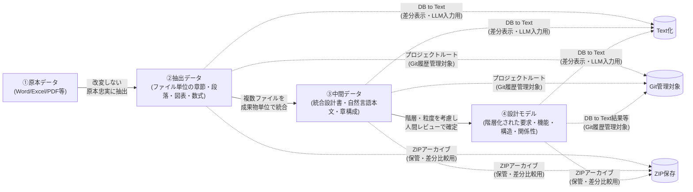
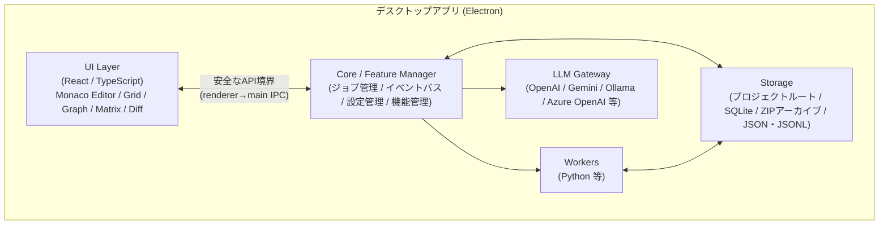

# D2D(設計情報デジタル化・トレーサビリティ支援ツール) 要求仕様書

> **実装状況の注記（2026-07-20 整理）**: 本書は要求の正本であり、要求自体は変更しない。
> 現在の実装（`dev-process/STATE.md` フェーズ履歴参照）で**未実装**の要求には行頭へ【未適用】、
> 実装済みだが**確認・実測が未了**の要求には【未検証】、一部のみ実装済みの要求には【一部適用】を付す。
> 無印の要求は実装済み。マークの根拠と残作業は `dev-process/STATE.md` の残課題を参照。

## 目次

| # | セクション |
| - | --- |
| 1 | [目的](#1-目的) |
| 2 | [基本方針](#2-基本方針)（データ階層・データ管理原則・設計モデル化の工程） |
| 3 | [対象範囲](#3-対象範囲)（対象文書・対象設計情報） |
| 4 | [システム構成要求](#4-システム構成要求)（アーキテクチャ・デスクトップアプリ） |
| 5 | [プラットフォーム基盤要求](#5-プラットフォーム基盤要求)（機能・プロジェクト・ジョブ・設定） |
| 6 | [データ管理要求](#6-データ管理要求)（成果物セット・ZIPアーカイブ・設計情報ストア・DB to Text・ZIP差分） |
| 7 | [取込・抽出要求](#7-取込抽出要求)（原本取込・文書構造抽出・抽出レビュー） |
| 8 | [中間データ処理要求](#8-中間データ処理要求)（設計観点別管理・LLM入力用チャンク） |
| 9 | [設計モデル要求](#9-設計モデル要求)（設計要素・関係性） |
| 10 | [トレーサビリティ要求](#10-トレーサビリティ要求)（マトリクス・分析・クエリ） |
| 11 | [編集機能要求](#11-編集機能要求)（統合編集・図表・状態遷移・検証・用語集） |
| 12 | [LLM支援要求](#12-llm支援要求)（Provider・ログ・プロンプト・候補生成・安全性） |
| 13 | [UI要求](#13-ui要求)（共通UI・主要ビュー・検索） |
| 14 | CLI要求（削除・欠番） |
| 15 | [レポート・出力要求](#15-レポート出力要求) |
| 16 | [Git連携要求](#16-git連携要求) |
| 17 | [モデル表現・外部記法要求](#17-モデル表現外部記法要求)（PlantUML・SysMLv2） |
| 18 | [非機能要求](#18-非機能要求)（性能・信頼性・セキュリティ・保守性・商用） |


---

## 1. 目的

本ツールは、既存のWord、Excel、PowerPoint、Visio、PDF、テキスト等で作成された自然言語中心の設計文書を段階的にデジタル化し、設計要素および設計要素間の関係性を構造化管理することを目的とする。

これにより、要求、制約、機能、構造、振舞、状態、インタフェース、データモデル、検証情報、設計判断根拠等の間に複数観点のトレーサビリティを確保し、仕様変更時の影響分析、設計根拠確認、検証カバレッジ確認、設計レビュー支援を機械的に実施可能にする。

本ツールは、すべてをLLMに自動判断させるものではなく、LLMを候補生成・要約・抽出・レビュー補助に用い、人間による逐次確認、修正、採用、棄却を前提とした human-in-the-loop 型の設計支援ツールとする。

---

## 2. 基本方針

### 2.1 データ階層

本ツールは、以下の4階層でデータを管理する。

| 階層 | 名称    | 内容                       | 主な役割            |
| -- | ----- | ------------------------ | --------------- |
| ①  | 原本データ | Word、Excel、PDF等の既存文書     | 改変しない一次情報(既存の仕様書・設計書)       |
| ②  | 抽出データ | タイトル、本文、図、表、数式等     | ①から原本ファイル単位で抽出した外形情報を保持      |
| ③  | 中間データ | 統合設計書、原本に近い自然言語本文、章構成、図表説明、参照関係、段落関係、SQLite DB等     | 複数ファイルに分かれた設計書を成果物単位で統合し、原本に近い文書出力と設計情報整理の両方に利用する |
| ④  | 設計モデル | 要求、制約、機能、構造、振舞、状態、IF、検証、要素間関係等 | ③の設計結果を根拠に、階層構造と粒度を持つ要素・関係性モデルで表現した形式    |

**データ変換フロー**




### 2.2 データ管理原則

1. ①原本データは改変しない。
2. ②抽出データは①から抽出した情報であり、原則として原本ファイル単位で管理する。
3. ②抽出データは原本忠実性を重視し、意味解釈を過度に入れない。
4. ③中間データは、設計書が複数ファイルに分かれている場合でも、開発プロセス上の成果物単位で統合し、原本に近い自然言語本文と章構成を保持した統合設計書データとして扱う。
5. ③中間データは、章構成、原本設計書のアウトライン（親子関係）、本文、図表、参照関係を持ったデータ化された設計書であり、レポート機能により原本に近い文書として出力できる。②と④とのトレーサビリティ、③の各成果物間のトレーサビリティを持つ。
6. ④設計モデルで設計上の意味を確定する。
7. ④設計モデルは、要素と関係性を階層構造および粒度を考慮して接続し、③の設計結果との対応関係を保持する。
8. IDをもつ設計情報や各要素・関係に対して双方向トレーサビリティを確保する。
9. LLMの出力は確定情報ではなく、候補情報として扱う。
10. 人間レビューにより採用・修正・棄却された情報のみを②抽出データ、③中間データ、④設計モデルの各正本へ反映する。

### 2.3 設計モデル化の工程

本ツールは、原本文書を直接④設計モデルへ変換するのではなく、以下の工程に分けて段階的に構造化・意味化し、トレーサブルな設計知識グラフとして統合する。

| 工程 | 位置づけ | 主な処理 |
| --- | --- | --- |
| ①原本データ→②抽出データ | 文書構造の取得 | 章、節、段落、表、図、箇条書き、セル、キャプション、参照等を文書階層として取得し、出典位置を保持する |
| ②抽出データ→③中間データ | 設計記述要素の抽出 | 文書中の記述単位を抽出し、要求らしさ、制約らしさ、IFらしさ等の候補属性、根拠位置、信頼度を保持する |
| ②抽出データ→③中間データ | 記述型への分類 | 段落、表、図、シナリオ、状態遷移表、IF一覧表、データ項目表、モデル図等の記述型へ分類する |
| ③中間データ→④設計モデル | 設計意味候補への昇格 | 記述資源を要求候補、機能候補、IF候補、状態候補、データ候補、制約候補、根拠候補等へ変換する |
| ③中間データ→④設計モデル | 同一対象の統合・正規化 | 重複、類似、別表現、別成果物上の同一対象を統合候補として扱い、UID、名称、型、粒度、属性、表記揺れ、単位、関係名候補を標準化する |
| ③中間データ→④設計モデル | 関係付与 | 設計トレース、分解、実現、割当、依存、検証、根拠等の関係を付与する |
| 双方向トレーサビリティ分析 | 検査 | 未接続、不整合、根拠不足、粒度不一致、循環、過剰な汎用関係利用等を検出する |

各工程の出力は候補を含む。特に設計意味候補への昇格、同一対象の統合・正規化、関係付与の結果は、人間レビューにより採用・修正・棄却されるまで④設計モデルの確定情報として扱わない。検査は新たなデータ階層を生成する工程ではなく、双方向トレーサビリティの分析機能により、①〜④および設計関係層を横断して実現する。

### 2.4 記述形式と設計意味の分離

設計書上の記述形式と設計上の意味は一致しない。例えば表は、インターフェース定義、状態遷移表、データ定義、試験条件、要求一覧、制約一覧のいずれにもなり得る。同様に、段落、図、箇条書き、シナリオ、モデル記述も文脈により異なる設計意味を持つ。

本ツールは、記述形式を先に安定して抽出・分類し、その後で設計意味候補へ昇格する。1つの記述資源が複数の設計意味候補を持つことを許容し、根拠、信頼度、LLM実行参照、レビュー状態を保持したうえで、人間レビューにより確定する。

同一対象の統合・正規化では、ノードの同一性、名称、型、粒度、属性を整える。関係付与は、ノード間の設計上の意味関係を付与する処理であり、統合・正規化とは独立してレビュー、修正、再生成できること。関係の妥当性、未接続、不整合、循環等の検査は、双方向トレーサビリティ分析機能で実現すること。

---

## 3. 対象範囲

### 3.1 対象文書

本ツールは、以下の原本文書を扱えること。

| 種別 |
| --- |
| Word文書(*2) |
| Excel文書(*2) |
| PowerPoint文書(*2) |
| Visio文書(*2) |
| PDF文書 |
| テキストファイル |
| Markdownファイル |
| CSV / TSVファイル |
| JSON / JSONL / YAMLファイル |
| ZIPアーカイブ(*1) |

レビュー記録、障害管理台帳、議事録、QA表、変更要求一覧など、設計・試験・レビュー活動で発生する管理文書も対象文書として扱う。

(*1)本ツールは、抽出データおよび中間データの成果物セットをZIP圧縮したアーカイブとしても扱えること。通常の作業成果物は、単一の SQLite DB（project.db）とDB外ファイル（blobs/）で一体管理し、ZIP圧縮前のプロジェクトルートをGit履歴管理対象にできること。manifestはZIPアーカイブ生成時のみ作成する。ZIP圧縮ファイルは、過去時点のアーカイブ、受け渡し、最新成果物との差分比較用インポートに用いる。

(*2)Word、Excel、PowerPoint、Visio文書はOpenXML系形式（.docx / .xlsx / .pptx / .vsdx）を対象とする。旧バイナリ形式（.doc / .xls / .ppt / .vsd）は対象外とし、必要な場合は事前にOpenXML系形式へ変換してから取り込む。

### 3.2 対象設計情報

本ツールは、少なくとも以下の設計情報を管理できること（本ツールの機能構成を実現することによって、結果的に管理可能となるという意味）。

| 分類        | 要素                          |
| --------- | --------------------------- |
| 一次情報      | 原本文書、章、節、段落、図、表、数式、注記       |
| 規範情報      | 法律、規則、規約、業務規則、社内標準、外部標準     |
| 要求情報      | 上位要求、派生要求、機能要求、非機能要求        |
| 制約情報      | 法規制約、性能制約、安全制約、運用制約、実装制約    |
| 機能情報      | 機能、サブ機能、機能責務                |
| 構造情報      | 装置、ソフトウェア、モジュール、コンポーネント、タスク |
| 振舞情報      | シナリオ、処理手順、イベント、アクション        |
| 状態情報      | 状態、状態遷移、遷移条件                |
| インタフェース情報 | 外部IF、内部IF、API、通信、信号、入出力     |
| データモデル    | データ項目、データ構造、メッセージ、ER、表定義    |
| 検証情報      | 試験項目、確認観点、検証条件、期待結果         |
| 管理情報      | 設計判断、根拠、未決、仮置き、リスク、課題、変更要求  |
| 実装情報      | ソースコード、設定、DDL、ビルド定義、実装関数、API実装 |

---

## 4. システム構成要求

### 4.1 アーキテクチャ方針

本ツールは、機能分割アーキテクチャ方式とし、主要機能および横断機能を責務単位で分離し、FE/BEを含む機能単位で構成できること。

**システム全体構成**



以下の構成とする。

```text
Desktop Shell
  - Electron

Frontend
  - React
  - TypeScript
  - Monaco Editor
  - スプレッドシート表示（グリッド表示）
  - グラフ表示
  - マトリクス表示
  - Diff表示
  - 設計モデル表示(PlantUML)

Backend / Workers
  - Node.js worker
  - Python worker

Storage
  - SQLite
  - プロジェクトルート（project.db / blobs/ / exports/）
  - ZIPアーカイブ
  - JSON / JSONL
  - Markdown / CSV / TSV
  - Git連携用 text dump

LLM Gateway
  - OpenAI
  - Azure OpenAI
  - Ollama
  - Gemini
```

### 4.2 デスクトップアプリ要求

本ツールは、Web技術を用いたデスクトップアプリとして動作すること。

| ID      | 要求                               |
| ------- | -------------------------------- |
| APP-001 | Windows環境で動作すること                 |
| APP-002 | macOS/Linux対応を妨げない構成であること   |
| APP-003 | ローカルファイル、SQLite、関係グラフ索引（将来的に GraphDB も可）、ZIP、外部ワーカーを扱えること |
| APP-004 | 【未検証】オフライン環境でも①〜④の閲覧・編集ができること         |
| APP-005 | 外部LLM API利用可否を設定により制御できること       |
| APP-006 | 【未検証】社内閉域・機密文書利用を想定したローカル動作を可能とすること   |

---

## 5. プラットフォーム基盤要求

### 5.1 機能管理

| ID       | 要求                                   |
| -------- | ------------------------------------ |
| CORE-001 | 各機能を機能単位で管理できること                  |

### 5.2 プロジェクト管理

**プロジェクト階層**

```
プロジェクト（文書セット、製品、業務ドメイン、作業フェーズ等の管理単位）
└── 階層①原本データ〜④設計モデル
```

| ID       | 要求                                         |
| -------- | ------------------------------------------ |
| CORE-010 | プロジェクトを作成できること。プロジェクトは文書セット、製品、業務ドメイン、作業フェーズ等を管理する単位とする |
| CORE-011 | プロジェクトファイルを開くことで、利用するプロジェクトを切り替えられること                        |
| CORE-012 | 成果物定義、成果物間の文書体系（親子関係）、開発フェーズをプロジェクト設定として管理できること |
| CORE-013 | 新規プロジェクト作成時に、システム設計（システム仕様書、システム試験仕様書、レビュー記録）、SW要求分析（SW要求仕様書、SW総合試験仕様書、レビュー記録、障害台帳）、外部設計（SW方式設計書、SW結合仕様書、レビュー記録、障害台帳）、内部設計（SW詳細設計書、SW単体仕様書、レビュー記録、障害台帳）、全般（変更管理票、タスク管理表、議事録）を開発フェーズ・成果物の初期設定として登録すること |

### 5.3 ジョブ管理

| ID       | 要求                                        |
| -------- | ----------------------------------------- |
| CORE-020 | 文書取込、抽出、LLM実行、DB to Text出力等をジョブとして実行できること |
| CORE-021 | ジョブの状態を待機中、実行中、成功、失敗、部分完了、中断として管理できること。部分完了は一部の要素のみ成功した状態を表し、失敗と同様に条件付き再実行の対象とする |
| CORE-022 | ジョブログを保存できること                             |
| CORE-023 | 長時間処理をUIと分離して実行できること                      |
| CORE-024 | 失敗したジョブを条件付きで再実行できること                     |

### 5.4 イベントバス

| ID       | 要求                                     |
| -------- | -------------------------------------- |
| CORE-030 | 機能間でイベント通知できること                     |
| CORE-031 | 原本取込、抽出完了、レビュー完了、設計モデル更新等のイベントを発行できること |
| CORE-032 | イベントに応じて関連ビューを更新できること                  |

### 5.5 設定管理

| ID       | 要求                                    |
| -------- | ------------------------------------- |
| CORE-040 | アプリ全体設定を管理できること                       |
| CORE-041 | プロジェクト別設定を管理できること                    |
| CORE-042 | アプリは複数のプロジェクトを管理できること（→ CORE-010参照）  |
| CORE-043 | プロジェクトは階層①〜④のデータ（原本・抽出・中間・設計モデル）を統括管理できること |
| CORE-044 | APIキー、モデル、パス、プロキシ、テーマ、ショートカットを設定できること |
| CORE-045 | APIキーを含む機密情報は平文保存しないこと（→ NFR-020参照）    |
| CORE-046 | 設定のエクスポート／インポートができること。エクスポート時はAPIキー等の機密情報を除外すること |
| CORE-047 | 新規プロジェクト作成時のGitリポジトリ初期化をツール設定で有効／無効にできること。既定は有効とし、Git初期化に失敗してもプロジェクト作成を継続すること |

---

## 6. データ管理要求

②抽出データ、③中間データ、④設計モデルの正本情報は、単一の SQLite DB（project.db）とDB外ファイル（blobs/）で管理する。JSON / JSONL、DB to Text、SQLite dump、差分表示用テキストは、②③④に共通する派生成果物または一時成果物として扱う。

### 6.1 成果物セット / ZIPアーカイブ管理

②抽出データおよび③中間データの抽出・編集結果は、通常時はZIP圧縮せず、単一の SQLite DB（project.db）とDB外ファイル（blobs/）でプロジェクトルート内に一体管理する。成果物単位の取り出しは、ZIPアーカイブ生成およびDB to Textのフィルタ出力で実現する。manifestはZIPアーカイブ生成時に作成し、ZIP内容、schema_version、作成日時、原本ハッシュ、抽出器バージョン、成果物一覧を記録する。ZIP圧縮ファイルは通常の編集対象ではなく、過去時点のアーカイブ、受け渡し、最新成果物との差分比較用インポートに用いる。

| ID       | 要求                                                  |
| -------- | --------------------------------------------------- |
| DATA-001 | ②抽出データの抽出・編集結果を、原本ファイル単位に識別・抽出可能な形で保存できること |
| DATA-001A | ②抽出データおよび③中間データの抽出・編集結果を、通常時はZIP圧縮せず、単一の SQLite DB（project.db）とDB外ファイル（blobs/）で一体管理できること |
| DATA-002 | ③中間データの抽出・編集結果を、複数原本ファイルから成る成果物単位で識別・抽出（ZIPアーカイブ生成、DB to Textフィルタ出力）できること |
| DATA-003 | ZIPアーカイブ生成時にmanifestを作成し、schema_version、作成日時、原本ハッシュ、抽出器バージョン、成果物一覧を保持すること |
| DATA-004 | ZIPアーカイブ内のJSON / JSONL、SQLite DB、画像、ログの役割をmanifestで識別できること |
| DATA-005 | ZIP圧縮前のプロジェクトルート（project.db、blobs/、exports/）はGit履歴管理対象にできること |
| DATA-006 | ZIP圧縮ファイルはGit対象外のアーカイブとして保持できること |
| DATA-007 | ZIP圧縮ファイルをインポートし、最新の正本成果物（project.db、blobs/）との差分比較に利用できること |
| DATA-008 | ②抽出データは、抽出元の原本ファイルID、原本ハッシュ、ファイル内位置、抽出器バージョンを保持できること |
| DATA-009 | ③中間データは、統合対象となった②抽出データ群、成果物ID、開発フェーズ、章構成、統合順序を保持できること |
| DATA-018 | 開発フェーズ間の成果物トレーサビリティは、③中間データの成果物ID間のトレースとして保持できること |

### 6.2 設計情報ストア管理

| ID       | 要求                                      |
| -------- | --------------------------------------- |
| DATA-010 | ④設計モデルは、`entity_registry`、種別ごとの `model_*`、`trace_link`、オントロジー設定テーブルをSQLite DBへ保存し、JSON / JSONLへ安定して出力できること |
| DATA-011 | 設計要素間の関係を設計情報ストアとして保存できること【実装済み: SQLite + 再帰CTE】。将来的な GraphDB（Neo4j 等）への移行【未適用、TBD-07 未決】も可能とすること（実装方式は `sdd_data_structure.md`、`sdd_function_architecture.md` に定義する） |
| DATA-017 | ④設計モデルの要素・関係は、対応する③中間データの成果物IDを参照できること |

### 6.3 DB to Text

DB to Text は、②抽出データ、③中間データ、④設計モデルに含まれるDB内容を、差分表示やLLM入力のために一時的または派生的にテキスト化する機能である。DBが正本であり、Textは正本ではない。

| ID       | 要求                                               |
| -------- | ------------------------------------------------ |
| DATA-020 | ②抽出データ、③中間データ、④設計モデルのDB内容を安定した順序でテキスト出力できること |
| DATA-021 | 要素一覧、関係一覧、トレースマトリクスをMarkdown/CSV/TSV/JSONLとして出力できること |
| DATA-022 | DB to Text出力結果を差分表示やLLM入力に利用できること |
| DATA-023 | DB to Text出力は派生成果物または一時成果物として扱い、DB正本を置き換えないこと |
| DATA-024 | DB to Textは、保存処理や差分確認処理から呼び出されるHook的な機能として利用できること |

### 6.4 ZIPアーカイブ差分

ZIPアーカイブは、過去時点の②抽出データ、③中間データ、④設計モデルを保存し、現在の成果物との差分を確認するために利用する。Git管理の履歴情報と連携する場合も、ZIPアーカイブは差分比較用の取り込み単位として扱う。

| ID       | 要求                             |
| -------- | ------------------------------ |
| DATA-030 | ②抽出データ、③中間データ、④設計モデルの成果物セットをZIPアーカイブとして保存できること |
| DATA-031 | ZIPアーカイブを差分比較用にインポートし、現在の正本成果物またはDB to Text出力と比較できること |
| DATA-032 | ZIPアーカイブのインポートは現在の正本成果物を直接上書きしないこと |
| DATA-033 | ZIPアーカイブには作成日時、対象データ階層、schema_version、元成果物ハッシュを記録できること |

---

## 7. 取込・抽出要求

### 7.1 原本取込

| ID      | 要求                                      |
| ------- | --------------------------------------- |
| IMP-001 | Word文書を取り込めること                          |
| IMP-002 | Excel文書を取り込めること                         |
| IMP-003 | 【未適用】PowerPoint文書を取り込めること                    |
| IMP-004 | 【未適用】Visio文書を取り込めること                         |
| IMP-005 | 【未適用】PDF文書を取り込めること                           |
| IMP-006 | 【未適用】テキスト、Markdown、CSV、TSV、JSON、YAMLを取り込めること |
| IMP-008 | 原本のハッシュ値を計算し、同一性を管理できること                |
| IMP-009 | 原本を改変せず保存できること                          |
| IMP-010 | 複数の原本を一度に選択し、ファイルごとの取込Jobとして登録できること       |

IMP-007 は欠番（削除済み）とする。

### 7.2 文書構造抽出

| ID      | 要求                                  |
| ------- | ----------------------------------- |
| EXT-001 | 章、節、項番を抽出できること                      |
| EXT-002 | 段落を抽出できること                          |
| EXT-003 | 箇条書きを抽出できること                        |
| EXT-004 | 表を抽出できること                           |
| EXT-005 | 図を抽出できること                           |
| EXT-006 | 図表番号、キャプションを抽出できること                 |
| EXT-007 | 数式および数式名を抽出できること                    |
| EXT-008 | ページ番号、シート名、スライド番号等の原本位置を保持できること     |
| EXT-009 | Excelセル、結合セル、行列構造を抽出できること           |
| EXT-010 | 【未適用】PowerPointのスライド、図形、テキストボックスを抽出できること |
| EXT-011 | 【未適用】Visioの図形、接続、ラベル情報を抽出できること           |
| EXT-012 | 【未適用】PDFのテキスト、表、図、ページ位置を抽出できること          |
| EXT-013 | 抽出結果の個々の要素に重複しないIDを付与できること |
| EXT-014 | 抽出結果を編集、マージ、分割した場合に、新しい要素へ重複しないIDを割り当てられること |
| EXT-015 | マージ、分割、削除された抽出要素の履歴と元IDを追跡できること |
| EXT-016 | Word文書は、見出し階層、段落スタイル、箇条書き階層、ブックマーク、文書内参照、外部リンクを抽出できること |
| EXT-017 | Word文書は、結合セルを含む表、図・画像、図表番号、キャプション、脚注、コメント、変更履歴、テキストボックス内テキストを抽出できること |
| EXT-018 | Word文書の抽出結果は、原本忠実な文書構造データ、LLM入力向けにノイズを抑えたMarkdown、画像等のblob参照を再生成できる形で保持できること |
| EXT-019 | Word文書の抽出結果は、ページ番号やアンカー等の表示補助情報を、レビュー用表示とLLM入力用出力で切り替えられること |
| EXT-027 | 【未適用】PDF文書は、ページ単位の画像、ページ寸法、テキスト、表、図・画像、数式、タイトル・キャプション、各要素の座標範囲を抽出できること |
| EXT-028 | 【未適用】PDF文書の抽出結果は、ページ画像上の領域を人間が移動、リサイズ、追加、削除、種別変更できる形で保持できること |
| EXT-029 | 【未適用】PDF文書の表は、抽出された二次元配列、表領域、ヘッダー候補、セル内容を確認・修正できること |
| EXT-030 | 【未適用】PDF文書の図・表・数式・不鮮明テキストは、選択領域単位でLLMによるOCR・補正の候補を生成し、人間レビュー後に抽出結果へ反映できること。OCRはLLM（Vision対応モデル）で実施し、専用OCRエンジンは使用しない |
| EXT-031 | PDF文書の抽出結果は、座標順に並べたレビュー用Markdown、LLM入力向けMarkdown、表データ、画像切り出し結果を再生成できる形で保持できること |
| EXT-034 | PowerPoint文書は、スライド順、スライド寸法、スライドタイトル、テキスト、図形、コネクタ、画像、表、スピーカーノートを抽出できること |
| EXT-035 | PowerPoint文書は、グループ化された図形やテキストボックスの座標をスライド基準の絶対座標として保持し、回転、反転、サイズ、テーマカラー、線、塗りつぶし等の表示属性を抽出できること |
| EXT-036 | PowerPoint文書の抽出結果は、スライド内要素の表示順と空間配置に基づき、レビュー用Markdown、LLM入力向けMarkdown、スライド全体画像、画像アセット参照を再生成できる形で保持できること |
| EXT-037 | PowerPoint文書の抽出結果は、要素の除外、タイトル等の役割補正、図形グループ化、スピーカーノート編集、スライド単位のレビュー状態を人間が確認・修正できること |

EXT-020〜026、EXT-032〜033、EXT-038〜039 は 7.3 抽出結果レビューに記載する。

### 7.3 抽出結果レビュー

| ID      | 要求                             |
| ------- | ------------------------------ |
| EXT-020 | 抽出結果を一覧表示できること                 |
| EXT-021 | 抽出結果を人間が修正できること                |
| EXT-022 | 抽出結果に未確認、確認済、要修正、棄却の状態を付与できること |
| EXT-023 | 原本表示と抽出結果表示を並べて確認できること         |
| EXT-024 | 抽出誤りを修正して中間データへ反映できること         |
| EXT-025 | 抽出結果レビューでは、アウトライン、プレビュー、Markdown、文書構造データ、コメント・変更履歴を相互にジャンプできること |
| EXT-026 | 抽出結果レビューでは、選択した抽出要素を原本位置、プレビュー上の該当箇所、文書構造データ上の要素と同期表示できること |
| EXT-032 | PDF抽出結果レビューでは、ページ画像上の領域枠、抽出要素一覧、プロパティ、表エディタ、Markdown、文書構造データ、LLM実行ログを相互に同期表示できること |
| EXT-033 | PDF抽出結果レビューでは、ページ単位と文書全体のプレビューを切り替え、座標順序、警告、表データ、画像切り出し結果を確認できること |
| EXT-038 | PowerPoint抽出結果レビューでは、スライド一覧、スライドプレビュー、Markdown、要素プロパティ、スピーカーノート、ジョブ・抽出ログを同一Workbench内で同期表示できること |
| EXT-039 | PowerPoint抽出結果レビューでは、スライドプレビュー上の要素枠を選択し、除外、役割補正、グループ化、レビュー状態変更を行った結果をMarkdownと文書構造データへ即時反映候補として表示できること |
| EXT-040 | 抽出データの初期名称は原本ファイル名と同一とし、原本情報を変更せず表示名称を任意に変更できること |
| EXT-041 | 抽出文書は、削除済みを除く配下の extracted_item が1件以上あり、かつ全件が確認済みの場合だけ文書単位を確認済みとすること。1件でも未確認、要修正または棄却が含まれる場合は文書単位を未確定とし、一覧、Explorer、件数Badgeを同じ集計結果へ連動して更新すること |
| EXT-042 | Word文書の箇条書き・番号付きリストは、番号定義、階層、開始番号、継続・再開を原本の保存情報に基づいて保持できること |
| EXT-043 | Word文書のDrawingML/VML図形、図形内の段落・文字列、グループ親子関係、コネクタの明示接続と矢印を抽出し、AlternateContentの重複を防止できること |
| EXT-044 | Word文書のRunについて、太字、斜体、下線種別、取消線、二重取消線、文字色、蛍光、網掛け、フォント、文字サイズ、上付き・下付き、非表示等の直接書式を未指定と無効を区別して保持できること |
| EXT-045 | Word文書のヘッダ、フッタ、脚注、文末脚注、ページ等のフィールド、コメント、変更履歴を本文と区別して保持できること |
| EXT-046 | Word文書のPart、Content Type、Relationship、元XMLを追跡し、未対応要素を破棄せず件数と保持状態を抽出レポートへ提示できること |
| EXT-047 | Word文書を信頼できない入力として扱い、ZIP/XMLの安全上限、パストラバーサル防止、DTD・外部実体拒否、外部参照非アクセス、埋め込みオブジェクト非実行を保証できること |
| EXT-048 | Word抽出結果の文書プレビューは、Run書式、リスト情報、図形・グループ・コネクタ、header・footer・footnote・endnote、フィールド、コメント、変更履歴を本文と区別して表示し、未解決のレイアウト情報を推測で補完しないこと |
| EXT-049 | Excel原本は `.xlsx` を対象とし、ブック、シート、セルの生値・表示値・数式、結合セル、基本書式、コメント、ハイパーリンク、名前付き範囲、Excel Table、非表示状態を原本位置とともに物理抽出できること |
| EXT-050 | Excel物理抽出結果から、連続非空セル、空白区切り、罫線、結合見出し、書式類似、Excel Table等を根拠とする抽出グループ候補を生成し、信頼度と検出根拠を保持できること |
| EXT-051 | Excel抽出グループ候補は②抽出データと分離して保持し、ユーザーがシート、セル範囲、種別、タイトル、採否を修正し、候補の追加・削除を行えること |
| EXT-052 | Excel抽出グループ候補に対するLLM支援は、ユーザーが選択した候補範囲と必要最小限の周辺セルだけを送信対象とし、送信前確認を経て、LLM出力を未確定の修正候補として反映できること |
| EXT-053 | Excel抽出の実行は、ユーザーが採用対象の抽出グループ候補を確定した後に限り、既存の②抽出データへ変換し、各要素のシート名・セル範囲と①原本への `based_on` を保持できること |
| EXT-054 | Excel原本の外部リンク、埋込オブジェクト、マクロ、ActiveX、外部データ接続を実行または自動取得せず、未知・未対応のOOXMLパートと警告を黙って破棄しないこと |
| EXT-055 | Excel候補レビューはWorkbench内でシート一覧、セルグリッド、候補一覧・編集欄を同期表示し、原本をOSアプリで開く導線と抽出ジョブの進捗を既存フローと共通化すること |
| EXT-056 | Excel候補レビューは大量シートを扱えるシート選択ドロップダウンとし、選択シートの候補総数および採否状態別件数を常時表示すること |
| EXT-057 | Excelシートプレビューは保持しているセル範囲を省略せずスクロール表示し、キーボード、Shift範囲選択、マウスドラッグでセル範囲を選択できること。候補範囲は種別別の色を持つオーバレイとして表示し、選択、移動、リサイズ、追加、削除できること |
| EXT-058 | Excel候補一覧は選択シートの候補だけをコンパクトに表示し、種別を色付きタグで識別し、複数選択と右クリックによる採否一括変更を行えること。一覧と詳細の境界はドラッグで変更できること |
| EXT-059 | Excel候補詳細は範囲内文字列のプレビューを表示し、図候補は原本画像または図形情報、表候補はタイトル行範囲とタイトル列範囲をシートプレビューと同期して調整できること |
| EXT-060 | Excel候補LLM支援は既存候補に限定せず、ユーザーがシート上で指定した任意矩形範囲を送信対象として、その範囲内だけから複数のグルーピング候補を未確定状態で生成できること |
| EXT-061 | Excel DrawingMLの画像、図形、コネクタ、グループ、アンカー位置、表示文字列と基本装飾を原本Part・Relationshipとともに抽出し、図候補およびプレビューへ反映できること。未解決接続や未対応装飾を推測で補完しないこと |
| EXT-062 | 同名Excelの再取込時は直前版との差分をシート・候補単位で提示し、完全一致または移動と判定できる候補へ旧候補UID・採否・表見出し設定を継承候補として適用し、分割・統合・曖昧一致はユーザー確認を要求すること |

---

## 8. 中間データ処理要求

③中間データは、成果物単位で統合された設計書データであり、原本に近い自然言語本文、章構成、親子関係、参照関係、図表、表、説明文、モデル記述等を9種類のResourceとして管理する。シナリオ、状態遷移、IF、データ構造等の意味はこの段階では独立Resource種別に固定せず、本文・表・図・モデル等の記述として保持する。

チャンクは③中間データそのものの単位ではなく、③中間データから④設計モデルを検討する際にLLMへ入力するための一時的な入力単位である。

### 8.1 中間データの設計観点別管理

| ID      | 要求                            |
| ------- | ----------------------------- |
| MID-001 | プロジェクト設定で開発フェーズ配下に定義した有効な成果物は、②抽出データの取込有無にかかわらずExplorerと③ステージへ表示し、選択時に空の③中間データを作成して編集画面を開けること。③中間データは成果物単位の統合設計書として、原本に近い自然言語本文、章構成、節、段落、図、表、参照関係、段落関係を保持できること |
| MID-002 | 自然言語本文、説明文、図、表、数式、コード、モデル記述、参照を9種類のresource種別へ分け、各resource固有カラムを編集できること。シナリオ、状態遷移、IF、データ構造、メタデータを独立resource種別として設けないこと |
| MID-003 | ③中間データの章構成、親子関係、参照関係は、チャンク情報ではなく③中間データの設計情報として保持すること |
| MID-004 | ③中間データの各情報単位にIDを付与し、②抽出データおよび④設計モデルとのトレーサビリティに利用できること |
| MID-005 | ③中間データは人間が編集、任意の複数情報単位のマージ、分割、resource種別変更でき、変更後の情報単位に重複しないIDを割り当てられること。マージは表示順先頭の位置・階層へ集約し、②抽出データ由来の based_on を維持すること。resource編集では変更元情報を参照し、ルールまたはLLMによる保存前マージ候補を生成できること。③で新規作成され現在の intermediate_item だけが参照するResourceは、同種編集なら同一Resourceへ上書きし、種別変更なら旧Resourceを削除して新Resourceへ置換すること。抽出由来または他要素・トレース・実行記録から参照されるResourceは旧Resourceを保護し、新Resourceを作成して現在の intermediate_item だけを差し替えること。種別変更で固有情報が失われる場合は確認後に適用すること |
| MID-006 | レビュー状態を問わず②抽出データを③の取込元として選択でき、統合元 extracted_item の抽出レビュー状態を取込編集画面へ表示すること。統合元 extracted_item と成果物 intermediate_item はアイテム単位の `based_on` により多対多で紐付けられること。統合元は紐付け後も選択・再利用でき、選択した統合元単位で当該成果物内の紐付けを「削除」として解除できること |
| MID-007 | 中間文書は、削除済みを除く配下の intermediate_item が1件以上あり、かつ全件が確認済みの場合だけ文書単位を確認済みとすること。1件でも未確認、要修正または棄却が含まれる場合は文書単位を未確定とし、一覧、Explorer、件数Badgeを同じ集計結果へ連動して更新すること |

### 8.2 図・表・説明文管理

| ID      | 要求                   |
| ------- | -------------------- |
| MID-010 | 図番号、図データ、キャプション、説明文を紐づけられること |
| MID-011 | 表番号、表データ、列、行、セル、構造説明を紐づけられること |
| MID-012 | 自然言語本文、説明文、注記、補足、前提条件を章節や図表と紐づけられること |
| MID-013 | 図表説明や構造説明はLLM生成候補として扱え、人間が採用、修正、棄却できること |
| MID-014 | 図、表、説明文の編集結果を③中間データの正本へ確定反映できること |

### 8.3 設計観点を含む中間記述の管理

| ID      | 要求                             |
| ------- | ------------------------------ |
| MID-020 | モデル記述、構造、要素、関係候補を③中間データとして保持できること |
| MID-021 | シナリオ、手順、イベント、アクションを③中間データとして保持できること |
| MID-022 | 状態、状態遷移、遷移条件を③中間データとして保持できること |
| MID-023 | 検証観点、確認項目、期待結果を③中間データとして保持できること |
| MID-024 | IF、API、通信、信号、入出力、データ項目を③中間データとして保持できること |
| MID-025 | 上記の各設計観点から④設計モデル候補を生成できること |
| MID-026 | ③中間データの自然言語本文を、設計意味を変えずに曖昧性排除、表記揺れ統一、主語補完、用語正規化した正規化テキスト候補として生成できること |
| MID-027 | 正規化テキスト候補と元の③中間データ範囲を対応付け、差分、根拠、採用状態を確認できること |
| MID-028 | ③中間データから④設計モデル候補を生成する際、要素候補と関係候補を分けて生成し、各候補に根拠範囲、信頼度、生成プロンプト、レビュー状態を紐づけられること |

### 8.4 LLM入力用チャンク

| ID      | 要求                            |
| ------- | ----------------------------- |
| MID-030 | チャンクは、③中間データから④設計モデルを検討する際にLLMへ入力する一時的な単位として扱うこと |
| MID-031 | チャンク範囲はユーザが任意に作成、修正、削除できること |
| MID-032 | チャンクには入力対象となる③中間データのID範囲、本文、図表参照、プロンプトテンプレート参照、チャンク固有の追加プロンプトを紐づけ、チャンクから各中間データ項目へ `based_on` を付与すること |
| MID-033 | チャンク情報には親子関係を持たせず、章構成や親子関係は③中間データ側の設計情報として扱うこと |
| MID-034 | LLM候補はチャンク単位で生成できるが、確定情報として直接②/③/④へ反映しないこと。レビューで採用した④設計要素から生成元チャンクへ `based_on` を付与すること |

---

## 9. 設計モデル要求

### 9.1 データ階層と格納境界

②抽出データおよび③中間データは、記述形式を保持する `resource_*` で管理する。④設計モデルへ確定した情報は `resource_*` へ格納せず、意味種別ごとの `model_*` 物理テーブルで管理する。④への導出時は、採用した設計モデルから根拠となる②または③の要素へ `based_on` を付与し、元データを破壊しない。

②③で使用するResourceは `resource_label`、`resource_text`、`resource_list`、`resource_figure`、`resource_table`、`resource_formula`、`resource_code`、`resource_model`、`resource_reference` の9種類とする。`resource_scenario`、`resource_state_transition`、`resource_interface`、`resource_data_structure`、`resource_metadata` は使用せず、DBスキーマに設けない。用語集は補助データとして `resource_glossary`、`resource_glossary_synonym` で別途管理する。

| ID | 要求 |
| --- | --- |
| MODEL-001 | ②抽出データおよび③中間データは `resource_*`、④設計モデルは `model_*` で管理し、同じ情報を両方の正本として重複管理しないこと |
| MODEL-002 | ④設計モデルを `entity_registry.entity_type = model_*` と各 `model_*` 物理テーブルの1対1構成で保存すること |
| MODEL-003 | `entity_registry` に `design_category` を設けず、設計モデル種別は `entity_type` だけで判定すること |
| MODEL-004 | 本スキーマへの移行に後方互換性は設けず、旧スキーマのプロジェクトは再作成すること |

### 9.2 設計モデル種別

初期オントロジーは以下の13種類とする。種別IDはDBの物理テーブル名、略号は表示用 `code` の接頭辞として使用する。

| 層 | 種別ID | 略号 | 日本語名 | 定義 |
| --- | --- | --- | --- | --- |
| 根拠 | `model_src` | SRC | 一次情報 | 原本文書、章、節、段落、図、表、数式、注記等、設計判断の一次根拠 |
| 根拠 | `model_std` | STD | 規範 | 法律、規則、規約、業務規則、社内標準、外部標準等、設計が従う規範 |
| 要求 | `model_req` | REQ | 要求 | 上位要求、派生要求、機能要求、非機能要求等、実現すべき内容 |
| 要求 | `model_cst` | CST | 制約 | 法規、性能、安全、運用、実装等、設計上守るべき制限 |
| 論理設計 | `model_func` | FUNC | 機能 | 機能、サブ機能、機能責務等、システムが提供する論理的な働き |
| 論理設計 | `model_struct` | STRUCT | 構造 | システム、装置、ソフトウェア、サービス、コンポーネント、モジュール、プロセス、タスク等の構造要素 |
| 論理設計 | `model_beh` | BEH | 振舞 | シナリオ、処理手順、イベント、アクション等、時間順序を持つ振舞 |
| 論理設計 | `model_state` | STATE | 状態 | 状態モデル、状態、状態遷移、遷移条件 |
| 情報・契約 | `model_data` | DATA | データモデル | データ項目、データ構造、メッセージ、ER、表定義等、情報の構造 |
| 情報・契約 | `model_if` | IF | インタフェース | 外部IF、内部IF、API、通信、信号、入出力等、要素間の契約 |
| 評価 | `model_verif` | VERIF | 検証情報 | 試験項目、確認観点、検証条件、手順、期待結果等、設計を評価する情報 |
| 実現 | `model_impl` | IMPL | 実装 | ソースコード、設定、DDL、ビルド定義、実装関数、API実装等の実現物 |
| 知識・管理 | `model_mgmt` | MGMT | 知識・管理 | 設計判断、根拠、仮定、未決、リスク、課題、変更要求等 |

| ID | 要求 |
| --- | --- |
| MODEL-005 | 初期状態で上表の13種を登録し、すべて有効とすること |
| MODEL-006 | `model_struct.structure_kind` により論理構造、ソフトウェア構造、実行構造、物理構造等の下位種別を識別できること |
| MODEL-007 | 振舞の処理順序・条件分岐、状態遷移、IFの操作・入出力、データ項目・型、検証手順・期待結果は、関係種別を増やさず各モデルの独自情報領域で管理すること |

### 9.3 共通情報と独自情報

全 `model_*` は `entity_registry` の共通情報と、種別テーブルの共通カラム `summary`、`detail_json`、`model_version` を持つ。`detail_json` の項目定義は `ontology_model_definition.field_schema_json` を正とし、個別モデル編集画面をこの定義から構成する。

| 区分 | 項目 |
| --- | --- |
| 台帳共通 | `uid`、`project_uid`、`entity_type`、`code`、`title`、`status`、`owner_uid`、レビュー情報、管理特記事項、作成・更新情報 |
| モデル共通 | `summary`、`detail_json`、`model_version` |
| `model_src` | `source_kind`、`locator`、`excerpt` |
| `model_std` | `standard_id`、`clause`、`authority` |
| `model_req` | `requirement_kind`、`priority`、`acceptance_criteria` |
| `model_cst` | `constraint_kind`、`condition`、`limit` |
| `model_func` | `responsibility`、`inputs`、`outputs` |
| `model_struct` | `structure_kind`、`responsibility` |
| `model_beh` | `trigger`、`preconditions`、`steps`、`postconditions` |
| `model_state` | `initial_state`、`states`、`transitions` |
| `model_data` | `data_kind`、`fields`、`constraints` |
| `model_if` | `interface_kind`、`provider`、`consumer`、`protocol`、`operations` |
| `model_verif` | `verification_kind`、`condition`、`procedure`、`expected_result` |
| `model_impl` | `implementation_kind`、`location`、`symbol` |
| `model_mgmt` | `management_kind`、`decision`、`rationale`、`assumption`、`issue`、`change` |

| ID | 要求 |
| --- | --- |
| MODEL-008 | すべての設計モデルを共通情報と種別固有情報に分けて登録・表示・編集できること |
| MODEL-009 | `model_*` の追加・更新と `entity_registry` の更新を同一トランザクションで扱うこと |
| MODEL-010 | LLM候補はレビューで採用されるまで④の確定情報にせず、採用時に候補要素、候補関係、根拠リンクを一括検査・保存すること。候補を要求したチャンクが存在する場合、採用した各モデルから当該チャンクへ `based_on` を付与すること |

### 9.4 設計モデル関係

`trace_link` は、文書由来専用の `based_on` と、設計モデル間の9種類を初期関係種別として管理する。関係の日本語定義および許容組合せは設定データを正とし、固定列挙へ閉じ込めない。

| 関係種別 | 用途・正規方向 |
| --- | --- |
| `based_on` | ①〜③、チャンク、`resource_*`、`model_*` の由来・根拠。根拠Resource同士にも使用できるが、両端が `model_*` の組合せには使用しない |
| `satisfies` | 機能・構造・振舞・状態・IF・データ・実装 → 規範・要求・制約 |
| `allocated_to` | 機能 → 構造・振舞・状態、構造 → 振舞、振舞 → 状態 |
| `verifies` | 検証情報 → 規範・要求・制約・設計要素・管理情報・実装 |
| `contains` | 同じ `model_*` 内の上位要素 → 下位要素。自己包含・循環は禁止 |
| `implements` | 実装 → 機能・構造・振舞・状態・IF・データ |
| `uses` | 許容マトリクスで許可された利用元 → 利用対象 |
| `calls` | 実装 → 実装 |
| `conflicts_with` | 設計モデル間の競合・矛盾。対称関係として逆向き重複を作らない |
| `relates_to` | 正式な意味が未確定な暫定関係。レビュー後に具体的関係へ置換する |

処理順序、状態遷移、入出力、データ構造等はモデル内部情報とする。`decomposes`、`connects`、`input_of`、`output_of`、`transitions_to`、`precedes`、`depends_on`、`supersedes`、`affects`、`derived_from`、`normalized_from`、`owns`、`realizes`、`inputs`、`outputs`、`constrains`、`impacts`、`refines` は初期関係種別にしない。

| ID | 要求 |
| --- | --- |
| MODEL-011 | 関係登録時と候補採用時に、有効な関係種別、起点・終点の許容組合せ、必須属性をオントロジー設定で検証すること |
| MODEL-012 | 同じ起点・関係種別・終点の重複を禁止し、`contains` の自己包含と循環、および対称関係の逆向き重複を防止すること |
| MODEL-013 | `trace_link` は根拠、信頼度、生成主体、レビュー状態、理由、版、関係固有属性を保持できること |
| MODEL-014 | `owner_uid` は所有・管理主体、`allocated_to` は設計上の責務割当として区別すること |

### 9.5 オントロジー設定管理

オントロジーは今後チューニングする前提とし、現在採用中の定義をプロジェクトDBで管理する。初期版は `0.1.0` とする。

| ID | 要求 |
| --- | --- |
| MODEL-019 | 設計モデルごとに日本語の名称、層、定義、独自項目定義、有効・無効を管理画面で表示・編集できること |
| MODEL-020 | 設計モデルは削除せず無効化すること。無効な種別は新規候補・新規登録の選択肢から除外すること |
| MODEL-021 | `model_` で始まる新しい設計モデル種別、表示コード接頭辞、日本語定義、独自項目定義を追加でき、対応する物理テーブルを作成してDB管理できること |
| MODEL-022 | 設計モデルの日本語定義を、③中間データから④設計モデルを導出するLLM入力として利用すること |
| MODEL-023 | 設計モデル関係ごとに日本語の名称、定義、必須属性、アイコンの背景色・表示文字、有効・無効を管理画面で表示・編集できること |
| MODEL-024 | 設計モデル関係は削除せず無効化し、新しい関係種別を追加できること |
| MODEL-025 | 関係の日本語定義を、③中間データから設計モデル関係を導出するLLM入力として利用すること |
| MODEL-026 | 関係種別ごとに、縦軸・横軸を有効な設計モデル種別とする2次元マトリクスで許容組合せを表示・編集できること。`based_on` は終点が①〜③であるためモデル間マトリクスの対象外とすること |
| MODEL-027 | 設定変更を確定したときにオントロジーバージョンを更新し、確定日時と確定者を記録すること |
| MODEL-028 | ヘルプページの設計モデル・関係・許容組合せ・版表示を、固定文言ではなく現在のオントロジー設定から生成すること |
| MODEL-029 | オントロジー設定は `ontology_version`、`ontology_model_definition`、`ontology_relation_definition`、`ontology_relation_allowance` を正本として、保存前検査、UI候補制御、LLM入力、ヘルプ表示から共通利用すること |
| MODEL-030 | LLM候補セットの編集内容は、候補タブを閉じるかF5で更新するまでRendererメモリに保持し、他タブとの往復で失わないこと。原本候補とは別にLLM実行ごとに編集途中1セットを一時保存・再開でき、タブを開き直した直後は原本候補を表示すること |
| MODEL-031 | 候補セットの一時IDはモデル分類に応じた `req-01`、`struct-02` 等の接頭辞と候補セット全体の連番で表示し、分類変更時は関係候補の参照も追従すること。採用時は一時IDをDBへ保存せず、採用時点のDB採番状態から正式なcodeとuidを割り当てること |
| MODEL-032 | ④モデル一覧の追加操作はモデル行の作成だけを行い、詳細編集画面を自動表示しないこと。一覧から選択後、ダブルクリックまたはEnterで個別編集画面を開き、右クリックから許容された他モデルとの関係を登録できること |
| MODEL-033 | 関係の必須属性が未入力のまま候補採用または手動登録された場合は、関係種別ごとの安全な仮値を保存し、`trace_link.review_status = 'creating'`（作成中）として登録できること。作成中は必須属性が仮設定であることをツール全体で同じ表示名により識別できること |
| MODEL-034 | `model_beh` を振舞モデルの種別ID、`BEH` を表示コード接頭辞とし、シナリオ、処理手順、イベント、アクション等を包含すること。`model_action` は使用しないこと |
| MODEL-035 | 設計モデル関係のアイコン背景色・表示文字の初期値は従来のトレースマトリクス表示を引き継ぎ、設定変更後は関係選択肢とセル表示へ共通反映すること |

---
## 10. トレーサビリティ要求

| ID        | 要求                 |
| --------- | ------------------ |
| TRACE-001 | 上流／下流への双方向トレースにより探索できること     |
| TRACE-002 | 関係性を指定して探索できること      |
| TRACE-003 | 探索の深さを指定して探索できること      |
| TRACE-021 | UIから関係性クエリを実行できること              |
| TRACE-022 | 要素種別、関係種別、深さ、方向を指定して探索できること(クエリ探索)     |
| TRACE-023 | クエリ結果を表、階層リスト、グラフで表示できること       |
| TRACE-024 | クエリ結果をJSON/CSV/Markdownで出力できること |
| TRACE-025 | 関係グラフで選択した要素を起点に、指定ホップ数以内の関係と影響範囲を段階的に強調表示できること |
| TRACE-026 | 任意の複数Resource集合を行・列へ配置した汎用トレースマトリクスで、複数の関係種別を同時に表示・識別し、行列転置、固定見出し、拡大縮小、プロパティTooltipにより俯瞰確認できること |
| TRACE-027 | マトリクス上部で関係種別を個別または全選択ON/OFFし、方向（行→列／列→行）を設定して、単一セルのクリックトグル、選択した複数セル・複数行・複数列への「選択」「削除」による一括追加／削除ができること |
| TRACE-028 | 選択セルの行・列を十字に強調し、表示中の関係を持つ行見出し・列見出し、および関係種別ごとのセル表示を視覚的に識別できること |
| TRACE-029 | ②抽出文書配下と③中間文書配下のResource集合間の`based_on`、および複数の③成果物Resource集合間を含む任意のResource集合間の関係を同じマトリクスEditorで確認・編集できること。③中間文書は複数Resourceをグルーピングする表示スコープとして扱うこと |
| TRACE-030 | 任意の複数Resource集合を1列へ配置し、その左右へ任意数の列を追加・削除できる汎用インパクト分析ビューを提供すること |
| TRACE-031 | 表示中の任意の2列の項目間に存在する関係について、列が複数ステップ離れていてもfrom/to方向と関係種別を識別できるリンクを表示し、複数の関係種別を同時に選択・表示できること |
| TRACE-032 | 任意列の項目を複数選択し、選択項目から左右の全列へ連鎖する項目とリンクを強調できること。関連項目限定モードでは選択元列の全項目を維持し、他列は選択した関係で到達できる項目だけを表示すること |
| TRACE-033 | 文書構造等の階層を持つResource集合は階層を表示して折畳・展開でき、折畳中の子項目に関係がある場合は表示中の親項目へリンクを集約して示すこと。項目とリンクはプロパティTooltipを提供すること |
| TRACE-034 | 大量項目・大量リンクでもスクロール位置に追従し、表示領域周辺のリンクだけを更新・描画する等、操作を阻害しない描画制御を行うこと |
| TRACE-035 | インパクト分析の各列は独立して縦スクロールでき、スクロールに追従してリンク位置を更新すること。利用者はリンク描画をON/OFFできること |
| TRACE-036 | インパクト分析の項目は上下キーで移動し、Shift+上下キーで連続複数選択でき、アクティブ項目をWorkbench共通SelectionとしてSecondary Side Barへ連携すること |
| TRACE-037 | インパクト分析の列はドラッグ＆ドロップで左右順を変更でき、列構成・表示スコープ・関係種別・リンク表示状態を名前付き構成としてプロジェクト別に複数保存・復元できること |
| TRACE-038 | インパクト分析とトレースマトリクスは、同一種類の分析を固有URIの別タブとして複数同時に開けること |
| TRACE-039 | インパクト分析はリスト見出しの間隔ハンドルを左右へドラッグしてリスト間の幅を調整でき、その境界より外側にある全リストを調整差分だけ連動して移動すること |
| TRACE-040 | トレーサビリティマトリクスおよびインパクト分析のResource集合候補に、全チャンクと中間成果物別チャンクを追加し、`chunk.uid`を分析項目として表示・関係探索できること |
| TRACE-041 | トレースマトリクスの関係種別選択肢は、`ontology_relation_definition` の全定義を有効・無効を問わず表示し、無効状態を識別できること |
| TRACE-042 | トレースマトリクスの関係種別選択肢とセルは、設計モデル設定で管理するアイコン背景色・表示文字を使用すること |
| TRACE-043 | トレースマトリクスの関係種別選択領域で必須属性を入力でき、未入力時は仮値と「作成中」で登録できること |

TRACE-020 は欠番（CLI要求の削除に伴い削除）とする。

---

## 11. 編集機能要求

### 11.1 統合編集

| ID       | 要求                           |
| -------- | ---------------------------- |
| EDIT-002 | ②抽出データ、③中間データをJSON/DB情報から文書風ビューとして構築し、色付き階層表示した構造JSONと切り替えられること |
| EDIT-003 | 設計要素ごとに表示／非表示を切り替えられること      |
| EDIT-004 | 要求、機能、構造、検証等を統合的に編集できること     |
| EDIT-005 | 文書構成の変更、章節の並べ替え、マージ、分割ができること |
| EDIT-006 | 要約を作成できること                   |
| EDIT-008 | 編集内容を設計モデルへ反映できること           |

EDIT-007 は欠番（削除済み）とする。

### 11.2 テキスト・Markdown編集

| ID       | 要求                    |
| -------- | --------------------- |
| EDIT-010 | 独自Markdownエディタを提供すること |
| EDIT-011 | 用語ハイライトができること         |
| EDIT-012 | 差分表示ができること            |
| EDIT-013 | フォント装飾ができること          |
| EDIT-014 | テキスト表示モードを切り替えられること   |
| EDIT-015 | 設計要素へのリンクを埋め込めること     |

### 11.3 図・表編集

| ID       | 要求                                      |
| -------- | --------------------------------------- |
| EDIT-020 | 図情報を表示・編集できること                          |
| EDIT-021 | 設計編集では、構造図、状態遷移図、関係グラフを扱えること |
| EDIT-022 | 表情報をグリッド形式で表示・編集できること                   |
| EDIT-023 | Excel完全互換ではなく、構造化表編集を優先すること             |
| EDIT-024 | 表の行、列、セルにIDを付与できること                     |
| EDIT-025 | 表全体単位とセル単位の両方で設計根拠に利用できること              |

### 11.4 状態遷移編集

| ID       | 要求                       |
| -------- | ------------------------ |
| EDIT-030 | 状態一覧を編集できること             |
| EDIT-031 | 遷移一覧を編集できること             |
| EDIT-032 | 遷移条件、イベント、アクションを管理できること  |
| EDIT-033 | 状態遷移図を表示できること            |
| EDIT-034 | 状態遷移の簡易シミュレーションができること    |
| EDIT-035 | 未到達状態、未定義遷移、競合遷移を検出できること |

### 11.5 検証編集

| ID       | 要求                       |
| -------- | ------------------------ |
| EDIT-040 | 検証項目を編集できること             |
| EDIT-041 | 検証対象となる要求、制約、機能を紐づけられること |
| EDIT-042 | 検証条件、手順、期待結果を管理できること     |
| EDIT-043 | 検証未対応要求を確認できること          |
| EDIT-044 | 検証カバレッジを表示できること          |

### 11.6 用語集編集

| ID       | 要求                       |
| -------- | ------------------------ |
| EDIT-050 | 用語、略語、定義、同義語、禁止語を管理できること |
| EDIT-051 | 文書中の用語候補を抽出できること         |
| EDIT-052 | 用語の揺れを検出できること            |
| EDIT-053 | 用語を文書・設計要素とリンクできること      |
| EDIT-054 | 用語ハイライトに利用できること          |
| EDIT-055 | ②抽出結果レビュー、③中間データ編集、④設計モデル編集の各時点で、選択したテキストから用語候補を抽出し、用語集へ登録できること |
| EDIT-056 | 登録済み（承認済）の用語は、各種エディタ上でハイライト表示され、用語集の定義を参照できること |
### 11.7 セマンティック入力支援

| ID | 要求 |
| --- | --- |
| EDIT-057 | ツール共通のセマンティック入力支援機能として、入力補完、用語認識、エンティティリンキング、正規化、辞書登録、関係生成、検証を提供すること |
| EDIT-058 | 表示文章と、辞書用語・設計モデルへの構造化参照を分離して管理すること |
| EDIT-059 | 表示文章を正規名称へ変更する処理と、文章を変更せず内部参照だけを付与する処理を分離すること |
| EDIT-060 | LLM・形態素解析の結果、同義語登録、正規名称への置換、設計関係は候補として扱い、設定された承認条件に従って確定すること。ただし全角・半角、大小文字、Unicode正規化等の機械的差異は設定により自動正規化できること |
| EDIT-061 | 自動生成関係は原則として `relates_to` 等の弱い参照関係に限定し、`satisfies`、`allocated_to`、`implements` 等は入力欄の意味が明確な場合またはユーザー承認後だけ登録すること |
| EDIT-062 | 外部文書から取り込んだフィールド全体の原文、現在の表示文章、構造化参照、正規化履歴を区別して保持すること |
| EDIT-063 | 候補提示ではプロジェクト内の辞書・モデルのスコープ、権限、バージョン、廃止状態を考慮し、利用できない候補を確定参照にしないこと |
| EDIT-064 | 既存文章の自動解析は、候補、変更差分、根拠を確認し、個別または一括で承認、棄却、取消しできること |
| EDIT-065 | 入力欄ごとに候補種別、関係種別、辞書スコープ、検索条件、登録操作、表示方法の初期値を設定できること |
| EDIT-066 | 編集中にショートカットから前方一致候補を開き、辞書用語、モデル要素、最近使用を種類別表示すること。候補が多い場合は設定文字数まで表示を抑止すること |
| EDIT-067 | 未登録用語は、既定の形態素解析、任意のLLM解析、利用者の手入力のいずれからも承認待ち候補として登録でき、自動確定しないこと |
| EDIT-068 | 構造化参照済み文字列を視覚的に識別し、プロパティTooltipとリンク遷移を提供すること。表示方法はリンクのみ、文字列、ID、UIDから選択できること |
| EDIT-069 | Secondary Side BarにDictionaryを設け、リアルタイム前方一致検索と、0件時に入力文字列を承認待ち辞書候補へ登録する操作を提供すること |
| EDIT-070 | 入力欄はプレビュー・編集表示と構造化データの直接編集を切り替え、直接編集時はスキーマ、UID存在、文字範囲、参照整合性を検証し、成功後だけ保存可能とすること |
| EDIT-071 | Resource編集画面からモデル参照を承認した場合は同時に `trace_link` を生成し、`ontology_relation_definition` と `ontology_relation_allowance` が禁止する起点・終点・関係種別は保存前に拒否して理由を表示すること |
| EDIT-072 | 各種テキスト入力欄は非選択時に表示文章のプレビューを表示し、選択時はその場で編集可能とすること。選択状態にかかわらず「編集」ボタンから、Markdown編集、プレビュー、構造化データ、用語候補、用語候補(LLM)、校正・正規化(LLM)、入力欄設定を集約したセマンティック編集画面を開くこと |
| EDIT-073 | Secondary Side BarのProperties、Relations、Review、Dictionaryは、開閉状態を変更しても表示順を変更しないこと |
| EDIT-074 | Resource編集はモーダル表示から同一ResourceのEditor Areaタブへ統合でき、Resource編集ダイアログに統合操作を表示すること。セマンティック編集画面にはEditor Area統合操作を設けないこと |
| EDIT-075 | Resource編集画面は当該Resourceアドレスを表示し、クリップボードへコピーできること |
| EDIT-076 | Resource編集画面の全設定項目は、用途、値の意味、設計情報または管理情報としての扱いをTooltip等で確認できること |
| EDIT-077 | 全Resourceは設計情報へ利用しない管理専用の「特記事項」を保持し、設計上の特記事項はResource本体の設計情報へ記載すること |
| EDIT-078 | Resource編集および各種テキスト欄のLLM送信では、対象Resourceの親子関係、所属する中間文書、文書アウトライン内の位置、前後要素を自動補完すること |
| EDIT-079 | ResourceのLLMマージは、入力Resourceの種別・フィールド定義と値、および保存候補Resourceの出力フィールド定義・型・必須性・説明を送信し、左の情報から右の定義に沿ったJSON候補を生成すること |
| EDIT-080 | Resourceマージ画面の「マージ」「LLMマージ」は左ペイン上部へ配置すること |
| EDIT-081 | テキスト編集画面は左右2ペインとし、左に「編集」「用語候補」「用語候補(LLM)」、右に「プレビュー」「構造化データ」「校正・正規化(LLM)」を配置すること。編集はMarkdown対応Monaco Editorを使用し、プレビューは複数行を表示すること |
| EDIT-082 | テキスト入力補完はCtrl+Spaceで起動し、専用の「入力候補」ボタンを表示せず、操作説明を画面内またはTooltipに表示すること |
| EDIT-083 | 「用語候補」は登録済み用語等による解析、「用語候補(LLM)」はLLMによる候補抽出を実行すること。LLM送信確認が開いている間のEscapeは最前面の確認画面だけを閉じること |
| EDIT-084 | 「校正・正規化(LLM)」は文書校正、冗長表現、不明確または曖昧な記載を指摘・修正した候補を返し、現在の編集内容との差分を視覚的に表示すること |
| EDIT-085 | テキストResourceはテキスト役割ごとの説明と、note等の補足対象となるResourceアドレスを保持すること。文分割JSONと周辺文脈JSONは編集対象とせず、周辺文脈はLLM送信側で生成すること |
| EDIT-086 | ラベルResourceはスタイル名を編集対象としないこと。リストResourceの項目はMarkdownで編集・プレビューすること。図Resourceは画像、幅、高さ、バイトサイズ、画像形式、説明を表示・編集し、数式ResourceはTeX記法のMarkdown本文と説明を編集・プレビューすること。図・数式の説明は対象画像または数式を含むLLM支援を受けられ、派生Resourceを新規追加または既存参照して関係を設定できること |
| EDIT-087 | Markdown対応Monaco Editorは日本語入力、キーボード入力、コピー、切り取り、貼り付けを行え、モーダルを開いた時点で編集欄へフォーカスすること |
| EDIT-088 | 図Resourceは画像ハッシュ直後に図番号とキャプションを保持・表示し、キャプションUIDを編集対象としないこと。説明欄の直後に派生Resource操作を配置すること |
| EDIT-089 | 表Resourceは表名をキャプションとして表示し、ヘッダ行・ヘッダ列・各セルをスプレッドシート形式で編集でき、各セルをセマンティック入力として扱うこと。表全体を含むLLM説明候補と派生Resource関係を利用できること |
| EDIT-090 | コードResourceはシンボルJSON、構文木JSON、解析状態を編集対象とせず、疑似コード本文に対する説明をテキスト編集・LLM候補生成でき、派生Resource関係を設定できること |
| EDIT-091 | 図・表・数式・疑似コードの説明LLM支援は、対象内容、Resource値、文書アウトライン文脈を送信前確認へ表示し、図の場合は画像データをマルチモーダル添付としてProviderへ送信すること |

---

## 12. LLM支援要求

### 12.1 LLM Provider管理

| ID      | 要求                                      |
| ------- | --------------------------------------- |
| LLM-001 | OpenAIを利用できること                          |
| LLM-002 | Geminiを利用できること                          |
| LLM-003 | Ollamaを利用できること                          |
| LLM-004 | Azure OpenAIを利用できること                    |
| LLM-005 | ProviderごとにAPIキー、endpoint、modelを設定できること |

### 12.2 LLMログ管理

| ID      | 要求                               |
| ------- | -------------------------------- |
| LLM-010 | LLM送信内容を記録できること                  |
| LLM-011 | LLM応答内容を記録できること                  |
| LLM-012 | 使用モデル、プロンプト、入力チャンク、出力候補を紐づけられること |
| LLM-013 | token使用量、概算コスト、処理時間を記録できること      |
| LLM-014 | エラー内容を記録できること                    |
| LLM-015 | ログを画面表示できること                     |
| LLM-016 | APIキー等の機密情報はログに残さないこと            |

### 12.3 プロンプト管理

| ID      | 要求                                      |
| ------- | --------------------------------------- |
| LLM-020 | プロンプトテンプレートを登録できること                     |
| LLM-021 | プロンプトテンプレートをバージョン管理できること                |
| LLM-022 | 抽出、要約、分類、関係候補生成、レビュー支援ごとにテンプレートを分けられること |
| LLM-023 | プロンプトと出力結果の対応を追跡できること                   |
| LLM-024 | LLM問い合わせを行う各画面から、用途に合うプロンプトテンプレートを選択し、実行時プロンプトを編集し、新しい版として保存・管理できること |

### 12.4 候補生成・レビュー

| ID      | 要求                  |
| ------- | ------------------- |
| LLM-030 | LLMにより要求候補を生成できること  |
| LLM-031 | LLMにより制約候補を生成できること  |
| LLM-032 | LLMにより機能候補を生成できること  |
| LLM-033 | LLMにより構造候補を生成できること  |
| LLM-034 | LLMにより関係性候補を生成できること |
| LLM-035 | LLMにより要約候補を生成できること  |
| LLM-036 | LLMにより用語候補を生成できること  |
| LLM-037 | LLM出力は候補として保持すること   |
| LLM-038 | 人間が候補を採用、修正、棄却できること |
| LLM-039 | 採用、修正、棄却の履歴を保存できること |
| LLM-045 | LLM出力は、正規化テキスト、設計要素候補、関係候補、警告、生成条件を含む構造化JSONとして取得・検証できること |
| LLM-046 | LLM出力のJSONパース失敗、スキーマ不一致、未解決要素参照、許容外関係は、候補セットのエラーとして表示し、正本反映を止められること |

### 12.5 安全性・機密情報

| ID      | 要求                                   |
| ------- | ------------------------------------ |
| LLM-040 | 外部／ローカルを問わず、画面上のLLM実行ボタンは直ちに問い合わせを開始せず、プロンプト選択・編集、送信先、モデル、マスキング後の全送信内容を確認し、利用者が明示承認した場合だけジョブを開始すること |
| LLM-041 | 機密情報マスキングを適用できること                    |
| LLM-042 | プロジェクト単位で外部送信可否を設定できること             |
| LLM-043 | ローカルLLM優先モードを設定できること                 |
| LLM-044 | LLM再実行時に同一入力、同一プロンプト、同一モデル条件を確認できること |

---

## 13. UI要求

### 13.1 共通UI

| ID     | 要求                      |
| ------ | ----------------------- |
| UI-001 | ダークテーマとライトテーマを切り替えられること |
| UI-002 | 全体で一貫したデザイントークンを使用すること  |
| UI-003 | キーショートカットを設定できること。Editor AreaのアクティブGroup内タブ、および下段Panelのタブは、それぞれ前／後へ移動するCommandを持ち、ツール設定から任意のショートカットを割り当てられること。Editorと下段Panelの同方向タブ移動には同じキーを設定でき、最後に選択した領域を対象として動作すること |
| UI-004 | コマンドパレットを開いた時点で全Command候補を表示し、入力に応じてリアルタイムに絞り込めること。上下キーの選択移動では選択候補が常に表示範囲内へ自動スクロールすること |
| UI-005 | 複数ペイン表示ができること           |
| UI-006 | ペイン分割、最大化、タブ表示ができること    |
| UI-007 | 大量データ表示時に仮想スクロールを利用すること |
| UI-008 | Webサイト風ではなく、IDEのような操作性とコンパクト性を重視したデザインとすること |
| UI-009 | ジョブの待機中、実行中、成功、失敗、中断、進捗、警告を画面上で確認できること。Status Barは作業モード名（Mxx）とアクティブResource URIを表示せず、Resource URIはPipeline Navigatorのアドレスバーへ表示すること。Status Barにはアイコン付きでGitブランチ／upstream同期状態、PlantUML／MeCab利用可否、LLM Provider設定状態、外部LLM有効可否、デバッグログレベルを常時表示すること。PlantUML／MeCab／LLM Providerはクリックでツール設定を、外部LLM／デバッグログレベルはクリックでプロジェクト設定を開けること |
| UI-021 | UIは、固定画面遷移ではなく、作業対象をResourceとして開くWorkbench型UXを提供すること |
| UI-022 | 原本、抽出データ、中間データ、設計モデル、トレース結果、差分、ログ、設定をタブおよび分割ペインで開けること |
| UI-023 | 主要操作はCommandとして定義し、メニュー、ツールバー、コンテキストメニュー、ショートカット、コマンドパレットから一貫して実行できること |
| UI-024 | 選択中のResource、アクティブEditor、ジョブ状態、レビュー状態に応じて、操作の有効/無効や補助表示を切り替えられること |
| UI-025 | ユーザが変更したタブ、ペイン分割、サイドバー、パネルの表示状態を保存し、再開時に復元できること |
| UI-026 | 【一部適用】 Secondary Side BarはWorkbench共通のProperties、Relations、Reviewの3アコーディオンだけで構成すること。Propertiesは現在選択中のアイテム属性、開いたアコーディオンを上側、閉じた見出しを下側へ配置すること。Relationsは当該アイテムを端点とする`trace_link`の関係種別・相対方向・相手アイテムをクリック可能に表示し、相手ResourceのEditorへ遷移できること。Reviewは当該アイテムへの任意コメント入力と既存コメント一覧を表示すること。保存したコメントはMGMT分類の`resource_text(text_role='comment')`として管理し、①〜③のSRC対象には文書由来の`based_on`、④設計要素には暫定理由付き`relates_to`で関連付けること |
| UI-027 | ダーク／ライトの表示モードに加え、Serendie Design Systemの5つのカラーテーマ（konjo、asagi、sumire、tsutsuji、kurikawa）を切り替えられること |
| UI-028 | UIアイコンは、Serendie Design Systemの `serendie/serendie-symbols` をベースに、用途と意味が一致するものを選択すること |
| UI-029 | 抽出レビュービューは、アウトライン、原本／プレビュー、Markdown、文書構造データ、コメント・変更履歴、レビュー操作を、作業に応じて分割ペインまたはタブで切り替えられること |
| UI-030 | 抽出レビュービューは、アウトライン、コメント、変更履歴、検索結果から該当要素へスクロールし、短時間ハイライトできること |
| UI-031 | PDF抽出レビュービューは、ページ画像上の座標領域をズーム表示し、領域枠の選択、移動、リサイズ、新規作成、種別変更をコンパクトに操作できること |
| UI-032 | PDF抽出レビュービューは、選択領域のプロパティ、表データ編集、LLMによるOCR・補正候補、Markdown/JSON/表プレビュー、ジョブ・LLMログを同一Workbench内で確認できること |
| UI-033 | PowerPoint抽出レビュービューは、スライド一覧、スライドプレビュー、Markdown、要素プロパティ、スピーカーノート、ログをIDE風の分割ペインで確認できること |
| UI-034 | PowerPoint抽出レビュービューは、スライド画像またはSVGプレビュー上に透明な選択レイヤーを重ね、クリック、複数選択、除外、役割補正、グループ化をコンパクトに操作できること |
| UI-035 | モデル化レビュービューは、③中間データ、正規化テキスト候補、設計要素候補、関係候補、LLMログ、検証エラーを同一Workbench内で同期表示できること |
| UI-036 | モデル化レビュービューは、保存前の候補セットを表形式で追加、修正、削除でき、要素名・分類変更時に関係候補の参照追従結果を即時確認できること。編集内容はタブを閉じるかF5まで保持し、原本候補とは別の一時保存1セットを保存・再開できること |
| UI-037 | ツール全体の文字サイズを設定画面から一括変更し、再起動後も復元できること |
| UI-038 | Primary Side Bar、Secondary Side Bar、Editor Area、下段Panelに加え、①原本／②抽出／③中間のステージ一覧、抽出データ編集、中間データ取込／単独編集、チャンク編集、Resource編集の内部ペインは境界のドラッグでサイズ変更でき、内容が表示領域を超える場合は必要な方向のスクロールバーで操作できること |
| UI-039 | Editor Areaは左右・上下へ再帰的に分割でき、分割境界をドラッグして比率変更できること。タブはドラッグ＆ドロップまたはCommandで任意のEditor Groupへ移動できること |
| UI-040 | Secondary Side BarのProperties、Relations、Reviewはタブではなく縦アコーディオンで同時参照できること。Editor Groupのタブは最大幅を設けて省略表示し、収まらない場合は多段表示すること |
| UI-041 | Primary Side Bar、Secondary Side Bar、下段Panelは上部右側の視認可能なボタンとCommandの両方から表示／非表示を切り替えられること。表示有無と幅／高さは作業モードや①～④のステージ画面ごとに切り替えず、Workbench共通の状態として保持すること |
| UI-042 | Explorerの②抽出データと③中間データは、正本確定していない要素数をBadgeで表示すること |
| UI-043 | Activity BarはExplorer、Search、Trace、Reports、History、Settingsで構成し、各Activityをアイコンだけで表示するコンパクト幅とし、Settingsを下端へ固定すること。その他のActivityはドラッグ＆ドロップで並べ替え、その順序を復元できること。選択中Activityは視覚的に識別できること。Reviewは各編集画面とSecondary Side Bar、Jobsは下段PanelとStatus Barで提供し、Primary Side BarのActivityには置かないこと |
| UI-044 | Explorerの原本、抽出データ、中間データ、設計モデルの各行は、カーソルを合わせると主要プロパティをツールチップ表示すること |
| UI-045 | Explorerはプロジェクト名をルートとするVS Code風の単一Treeとしてお気に入り、①原本、②抽出データ、③中間データ、④設計モデルを連続表示し、各階層を折りたためること。お気に入りはResource URIと表示名をプロジェクト単位で保存し、表示名を任意に変更して開けること。上下矢印で表示中ノードの選択を移動し、右矢印で選択ノードを展開、左矢印で折りたたみまたは親ノードへ移動できること。プロジェクト行には全展開／全折畳アイコンを表示すること。③中間データは中間データ→フェーズ→成果物→統合元の階層とし、成果物配下の統合元も折りたため、統合元が0件の場合は統合元行を表示しないこと。プロジェクト行だけを強調し、①～④以下は標準の文字ウェイトとすること。配下の原本、抽出文書、中間成果物、統合元、設計要素はResource種別を識別できるファイル系アイコンで表示し、状態・形式・分類・件数等のタグは名称の右側へ整列すること。中間成果物には「成果物」種別Badgeを表示せず、レビュー状態、未確定要素数、全要素数を表示すること |
| UI-046 | 上部メニューバーは左端に戻る、進む、更新、ホームのアイコンを配置し、その後へ「①原本　抽出▶　②抽出　統合▶　③中間　モデル化▶　④モデル　分析　用語集　アドレスバー　お気に入り　画面内検索」の順に表示すること。①～④、分析、用語集は境界と背景を持つ同一デザインのボタンとし、①～④は件数を表示すること。戻る／進むはAlt+左右矢印とマウスの戻る／進むボタンのいずれでもResource履歴を移動し、更新はアクティブEditorを再読込し、ホームはダッシュボードを表示すること。アドレスバーは「アドレス」のラベルを表示せず、画面幅に合わせて縮小して左側ボタンを押しつぶさず、メニューバー自体には横スクロールを表示しないこと。右端の星は現在Resourceのお気に入り追加／解除状態をトグル表示すること。ステージを選択すると、①原本は取込操作・取込済み原本一覧・読取専用詳細、②抽出は抽出文書一覧・独自プレビュー・文書行の右クリックによる抽出データ編集、③中間は取込操作・開発フェーズ－成果物階層一覧・独自プレビュー、④モデルは設計モデル種別・ID・名称・状態・作成日時・更新日時の一覧と、`+設計モデル`および`+PlantUML`を表示すること。`+設計モデル`は一覧へ行を追加するだけとし、状態遷移・用語集の追加ボタンは表示しないこと。「分析」は全抽出データ・全中間データ・チャンク全件・全設計モデルを4列にした汎用インパクト分析を開き、「用語集」は用語集を開くこと。アドレスバーはアクティブEditorの内部Resource URIを表示して手動入力を受け付け、既知のEditor URIでない場合はエラー通知して現在画面から移動しないこと。Pipeline Navigatorは現在開いているステージ1件だけを選択表示すること。各一覧はクリック、上下矢印キー、Enter／Spaceで選択・実行できること。④モデルはシングルクリックで選択し、ダブルクリックまたはEnterで個別編集画面を開き、右クリックで他モデルとの関係登録ダイアログを開くこと。①原本はPipeline NavigatorとExplorerのどちらから選択した場合も「OSアプリで開く」と「②抽出データの生成（抽出ジョブ実行）」を表示し、当該原本UUIDに対応する抽出データが既に存在する場合は抽出実行を無効表示すること。原本のファイル表示はWindowsに関連付けられた外部アプリへ委譲すること |
| UI-047 | ①～④のステージ一覧は列見出しで昇順／降順にソートできること。①原本、②抽出、③中間の一覧では論理削除とアーカイブを選択でき、アーカイブ中のデータは正本を保持したままExplorerから非表示にし、ステージ一覧から復元できること。同一開発フェーズ・成果物種別の③中間データが複数ある場合は最新1件以外を自動アーカイブすること |
| UI-048 | Explorerは①～④の階層一覧、Tooltip、未確定Badgeと、選択によるEditor表示を基本とし、常設の取込・名称変更・チャンク・モデル追加等の操作ボタンを置かないこと。例外として右クリックメニューは、①原本フォルダに「取込」、③中間データフォルダに「中間データへ取込」、③中間データの成果物に取込先を当該成果物へ初期選択した「取込」を表示し、②抽出データフォルダには操作を表示しないこと。Explorerの③中間データではフェーズと成果物をTree階層、アイコン、インデントで視覚的に識別でき、設定済み成果物を取込前から選択して編集画面を開けること。③ステージでは成果物の下に取込元②を表示し、成果物要素に使用されていない取込元を削除できること。③中間データEditor上部では、中間データ取込編集、単独編集、チャンク編集を同一成果物Resource内で切り替えられること |
| UI-049 | Workbench各画面はCtrl+Fおよび常時視認可能な検索ボタンから表示中文字列を検索し前後一致へ移動できること。検索ボタンは上部メニューバーのアドレスバー右端にデスクトップIDE風のアイコンボタンとして表示すること。すべての操作ボタンはhoverまたはキーボードfocus時に操作説明をTooltip表示すること。文書プレビューは形式非依存の共通設定としてパーツ種別、セクション、要素IDを個別に表示切替できること |
| UI-050 | ストア閲覧は全行を追加読込でき、読込数／全件数、行番号、横スクロールを表示すること。行はクリックと上下キーで選択でき、共通SelectionとしてSecondaryへ連携すること |
| UI-051 | プロジェクト未選択時のウェルカム画面は「設計・トレース作成支援ツール」を見出しとし、自然言語の設計文書を段階的にデータ化してトレーサビリティを人間レビュー前提で管理する設計支援ツールであることを示すこと。ウェルカム画面から、①原本から④設計モデルとトレーサビリティ分析までの操作フロー、データスキーマ、9章の設計モデル概念を視覚的に説明する各Help Resourceを開けること |
| UI-052 | Workbench全体は共通デザイントークンで配色し、Workbench背景、パネル・サーフェス、文字、補助文字、境界線、アクセント、選択背景、ボタン背景・文字・境界をツール設定からユーザが個別に設定し、再起動後も復元できること。色入力に表示する未設定時の既定値はダーク固定値とせず、選択中の表示モード、カラーテーマ、system時のOSテーマへ追従すること。個別設定を解除した場合は選択中テーマの既定色へ戻ること |
| UI-053 | Workbench全体の操作ボタンを一律にレスポンシブ化しないこと。操作が密集する抽出データ／中間データの編集画面だけは、通常幅で意味の異なる明示アイコンと文字列を併記し、画面幅が狭い場合は操作名をTooltip／アクセシブル名へ保持したままアイコン中心の表示へ切り替えること。未知操作を同一記号で代替せず、同時表示する異なる操作へ重複アイコンを割り当てないこと |
| UI-054 | Workbench全体の画面表示倍率を50〜200%で拡大／縮小／100%復帰できること。Ctrl+プラス、Ctrl+マイナス、Ctrl+0およびCtrl+マウスホイールをブラウザと同じ操作として提供し、倍率を再起動後も復元すること。縮小時もWorkbenchをviewport全体へ表示し、右端・下端に未使用の余白を生じさせないこと |
| UI-055 | Editor Areaの各タブはプレビュータブか否かにかかわらず、タブ上の明示的なピン操作とコンテキストメニューからピン止め／解除でき、ピン止め状態をレイアウトとともに復元すること |
| UI-056 | `stage://extracted`および`stage://intermediate`の文書行を右クリックし、選択した文書の抽出データ編集または中間データ編集を通常タブとして開けること |
| UI-057 | Editor Areaのタブ列に空タブ追加操作を表示し、Commandの既定ショートカット`Ctrl+T`でも追加できること。アドレスバーへ`help`を入力してEnterを押すと指定可能な書式と使い方を表示し、`resource://`等のUIDなしschemeを入力すると、そのschemeで開ける全UIDのリンク一覧を表示すること |
| UI-058 | Commandの既定ショートカット`Alt+D`でPipeline Navigatorのアドレスバーへフォーカス移動し、`F5`でメニューバーの「更新」と同じくアクティブEditorを再読込できること。Editor Areaを分割した場合は、アクティブなEditor Groupを枠線およびタブ列背景で視覚的に識別でき、分割ツリーの画面順で1～9番目のEditor Groupを`Ctrl+1`～`Ctrl+9`でアクティブ化できること。これらはショートカットキー設定で変更・解除できること |
| UI-059 | Title Bar左上にD2D名、D2Dバージョン、開いているプロジェクトのschema_versionを表示すること。D2Dバージョンはビルド時に読み込む設定ファイルで変更でき、既定値を`0.1.0`とすること |

### 13.2 主要ビュー

| ID     | 要求                     |
| ------ | ---------------------- |
| UI-010 | 原本ビューを提供すること           |
| UI-011 | 抽出データビューを提供すること        |
| UI-012 | 中間データビューでitem_type（resource種別）を表示し、共通Resource Editorを開けること。プレビューペインの`structure_json`は抽出データと同じ折畳可能な構造化JSONとして表示すること。成果物一覧は表表示と、表示順および`structure_json.elements[].level`から親子を導出したアウトラインTree表示を切り替えられ、Treeの折畳／展開を右側の文書プレビューへ連動すること。抽出データ／中間データの文書プレビューはフォーカス可能とし、上下キーで前後要素へ選択を移動できること。中間データの文書プレビューで選択した要素が成果物一覧またはTreeの表示範囲外にある場合は、該当要素全体が確実に見える中央位置まで自動スクロールすること。取込編集画面では統合元の抽出レビュー状態、紐付済み件数／全件数、紐付済みの青字表示、選択・関連成果物・プレビューの相互強調、上下キー／Shiftによる選択移動を提供すること。中間データ取込編集・単独編集の成果物一覧、およびチャンク編集の成果物一覧は、Shift+上下矢印で連続する複数要素を選択・選択範囲縮小できること。「上に追加」「下に追加」は選択中の統合元要素を選択中の成果物要素の前後へ追加して`based_on`で関連付け、hover時にその意味を説明すること。「削除」は選択した統合元要素の成果物対応だけを解除し、抽出データ自体を削除しないこと。成果物側には統合／複製／削除／移動／階層操作を提供すること |
| UI-013 | 有効な `model_*` ごとの設計モデル一覧と、共通情報および独自情報を編集する個別設計モデルビューを提供すること |
| UI-060 | Settingsの「ツール設定を開く」と「プロジェクト設定を開く」の間に、ツール設定配下であることを示す「└ 設計モデル設定」を設け、別ページで開くこと。画面冒頭に設定方法を説明し、モデル定義、属性定義の追加・無効化・削除、関係定義、有効状態、追加、許容マトリクス、オントロジーバージョン確定をGUIで操作できること |
| UI-061 | Helpの設計モデル説明を、現在のオントロジー設定と版から動的に表示すること |
| UI-014 | 汎用トレースマトリクスEditorを提供すること。Activity Barから新規作成した場合は行・列をともに「全設計モデル」で初期化すること。行・列には設計分類、②抽出文書配下、③中間文書配下、チャンク、Resource種別の各集合を複数選択できること。設計モデル設定の全関係定義（有効・無効を含む）の個別選択および全選択ON/OFF、設定値による関係別の色・記号、関係必須属性の入力、行列転置、行／列／セルの複数選択と「選択」「削除」による一括編集、単一セルのクリックトグル、選択十字強調、関係を持つ見出し強調、固定見出し、Tooltip、表示倍率変更を提供すること |
| UI-015 | 汎用インパクト分析ビューを提供すること。Pipeline Navigatorの分析から開く場合は、全抽出データ、全中間データ、チャンク全件、全設計モデルの集約表示対象を初期4列へ設定し、各列で項目を参照できること。各列へ任意の複数Resource集合を配置し、左右への列追加／削除とドラッグ並替え、見出しドラッグによる列間隔調整と外側列の連動移動、独立縦スクロール、複数関係種別、離れた列を含む方向付きリンク、リンク表示ON/OFF、クリック／上下キー／Shiftによる項目複数選択、Secondary連携、全列への連鎖強調、関連項目限定表示、階層の折畳／展開と親へのリンク集約、項目／リンクTooltip、表示領域限定リンク描画、名前付き構成の複数保存・復元、固有URIによる複数タブ表示を提供すること。トレースマトリクスも固有URIで複数タブ表示できること |
| UI-016 | 関係グラフビューを提供すること        |
| UI-017 | Diffビューを提供すること         |
| UI-018 | LLM送受信ログビューを提供すること     |
| UI-019 | History Activityはストア閲覧、ZIPアーカイブ作成、DB to Text出力、SQLite dump出力、exportsフォルダをWindows Explorerで開く操作をこの順に表示すること。Git変更ファイルはHEADとの差分をMonaco Diffで表示できること。Git履歴は1件選択時に当該履歴と最新、2件選択時に選択した新旧履歴を比較でき、DB to Textのテーブル、UID、code、title、entity_type、変更フィールドから本ツールの監視項目を識別できる項目単位の差分として表示すること |
| UI-020 | SQLite DB、JSON / JSONL 等のストア閲覧ビューを提供し、テーブル行を件数上限で切り捨てず全件参照可能とすること |

### 13.3 検索

| ID         | 要求 |
| ---------- | ---- |
| SEARCH-001 | タイトル、本文、用語、レビュー記録を対象とした日本語全文検索ができること。MeCab未使用時はNFKC正規化した全文への部分一致をFTS結果へ常に併合して、日本語の語境界や記号による検索漏れを防ぐこと。MeCab使用時は形態素解析により検索時間が長くなる場合がある旨をSearch Activityへ表示すること。原本、抽出文書、中間文書を検索種別に指定した場合は、その文書配下の抽出要素または中間要素のResource本文（`resource_text.text_body`等）も検索対象に含めること |
| SEARCH-002 | 表示コード（`code`）およびID（`uid`）による検索ができること |
| SEARCH-003 | 検索結果はSearch Activityの検索ボタン直下へResource種別単位でグルーピングし、種別Badgeの羅列にしないこと。グループは折畳可能とし、結果数が10件以下なら初期展開、10件を超える場合は初期折畳とすること。上下矢印で表示中の結果選択を移動すると選択結果が見える位置まで検索結果のスクロールを追従させ、同時にEditor Areaへ対象を表示し、左右矢印でグループを折畳／展開できること。結果から原本、抽出データ、中間データ、設計モデル等へジャンプし、子要素本文に一致した場合は該当文書を開いてその要素を選択、スクロール、強調できること |

---

## 14. CLI要求（削除・欠番）

本章の要求（CLI-001〜008）は削除し、欠番とする。CLIは実装しない。関係性クエリ、用語抽出、DB to Text、ZIPアーカイブ生成、原本取込・抽出、LLM候補生成は、UI（Workbench）から実行する。

---

## 15. レポート・出力要求

| ID      | 要求                        |
| ------- | ------------------------- |
| EXP-001 | ②抽出データ、③中間データ、④設計モデルを対象に、文書風レポート、一覧、関係情報を出力できること     |
| EXP-002 | ②抽出データの原本由来情報、③中間データの自然言語本文・章構成・図表・表・参照関係、④設計モデルの設計要素・関係性から文書風表示を構築して出力できること |
| EXP-003 | 成果物ID、章、節、設計観点、情報種別、レビュー状態、設計要素等の条件で出力対象をフィルタできること     |
| EXP-004 | 出力する範囲、表示／非表示、出力形式を選択できること       |
| EXP-005 | Markdown形式で出力できること        |
| EXP-006 | HTML形式で出力できること            |

---

## 16. Git連携要求

| ID      | 要求                            |
| ------- | ----------------------------- |
| GIT-001 | Git履歴からDB to Text結果を出力させ比較確認に利用できること    |
| GIT-002 | Git履歴をUIから参照できること             |
| GIT-003 | UIから作業ツリーの状態確認、ファイルのステージ／解除、ローカルブランチの作成／切替ができること |
| GIT-004 | UIからコミットを実行できること。コミットメッセージと作成者を指定し、ユーザがステージした変更をコミットできること |
| GIT-005 | 作業ツリーの変更ファイルをHEADと比較するMonaco Diff、およびGit履歴の1件対最新・2件間比較をDiffビューで確認できること |
| GIT-006 | 過去版の設計要素、関係、トレースマトリクスを比較し、DB to TextのJSONLをテーブル／項目単位に解析して、追加・削除・変更、UID、code、title、entity_type、変更フィールドを視覚的に識別できること |
| GIT-007 | コミット実行時はDB to TextおよびSQLite dumpを最新状態へ再生成し、`exports/db_to_text/`と`exports/sqlite_dump/`を必ずステージして同一コミットへ含めること |

---

## 17. モデル表現・外部記法要求

| ID       | 要求                                                  |
| -------- | --------------------------------------------------- |
| FORM-001 | SysMLv2、PlantUMLのテキスト形式を利用する |
| FORM-002 | SysMLv2、PlantUML中の要素には、要素IDに対応がつけられないので、モデル表記とは別に要素ID対応表をセットで管理する |

---

## 18. 非機能要求

### 18.1 性能

| ID      | 要求                                     |
| ------- | -------------------------------------- |
| NFR-001 | 大量の一覧操作は仮想スクロールおよび遅延ロードで対応すること |
| NFR-003 | 重い抽出処理、LLM処理、差分生成はバックグラウンドジョブとして実行すること |
| NFR-004 | SQLite検索、View表示、関係グラフの関係探索に必要なIndexを設計すること（実装方式は `sdd_data_structure.md` に定義する） |
| NFR-005 | 【未検証】（目標値の実測は P14-1 で実施予定）以下の代表規模・目標値を性能要求の前提とすること（目標値であり、実測により見直してよい）。(1) 1原本文書: 500ページ / 50MB 程度まで、(2) 1プロジェクト: 設計要素 10万件・トレースリンク 30万件程度まで、(3) 一覧表示の初期描画: 1秒以内（仮想スクロール前提）、(4) 深さ5の関係探索: 3秒以内、(5) 原本取込〜抽出候補表示: 100ページ/分以上 |

NFR-002 は欠番（削除済み）とする。

### 18.2 信頼性

| ID      | 要求                                |
| ------- | --------------------------------- |
| NFR-010 | 原本、抽出データ、中間データ、設計モデルの対応関係が失われないこと |
| NFR-011 | ジョブ失敗時に途中状態とエラー内容を確認できること         |
| NFR-012 | 【一部適用】編集操作はUndo/Redo可能であること（②レビュー状態・名称変更・アーカイブ／削除・③レビュー状態・マトリクスセル・用語状態は接続済み。③要素の追加・編集・複製・削除・マージ・分割、チャンク操作、設定変更は未接続。詳細は `dev-process/STATE.md`） |
| NFR-013 | 破壊的変更前に確認を行うこと                    |
| NFR-014 | ZIPアーカイブを差分比較用にインポートできること                 |

### 18.3 セキュリティ

| ID      | 要求                    |
| ------- | --------------------- |
| NFR-020 | APIキーを含む機密情報を平文保存しないこと（→ CORE-045 も参照） |
| NFR-021 | LLMログにAPIキーを記録しないこと（→ LLM-016 も参照）   |
| NFR-022 | 外部LLM API送信可否をプロジェクト単位で設定できること（→ LLM-042 も参照） |
| NFR-023 | 機密情報マスキングを実施できること（→ LLM-041 も参照）  |
| NFR-024 | ローカルのみで処理するモードを提供すること（→ LLM-043 も参照） |

### 18.4 保守性

| ID      | 要求                            |
| ------- | ----------------------------- |
| NFR-030 | 機能ごとに独立して開発・テストできること       |
| NFR-031 | スキーマ、プロンプト、抽出ルールをバージョン管理できること |
| NFR-032 | 外部ワーカーの入出力形式を明確化すること          |
| NFR-033 | JSON Schema等によりデータ形式を検証できること  |
| NFR-034 | ログにより障害解析可能であること              |

### 18.5 商用利用

| ID      | 要求                                           |
| ------- | -------------------------------------------- |
| NFR-040 | 商用利用可能なライブラリを使用すること                          |
| NFR-041 | GPL/AGPL等の混入を管理すること                          |
| NFR-042 | 表編集、PDF処理、OCR、Office変換、図編集ライブラリのライセンスを確認すること |
| NFR-043 | 依存ライブラリ一覧とライセンス一覧を出力できること                    |
| NFR-044 | 【未検証】フォント、画像、テンプレート等の再配布条件を確認すること                 |
