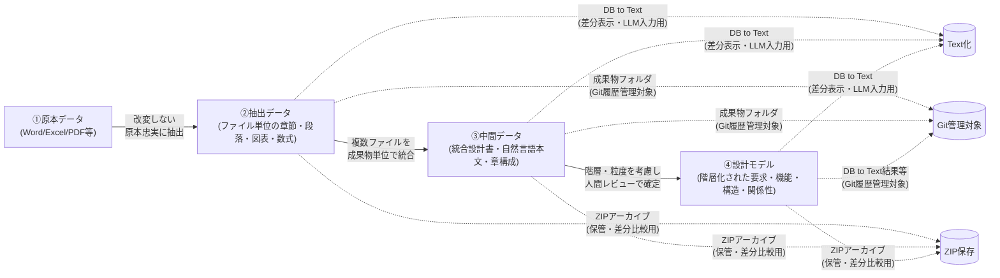
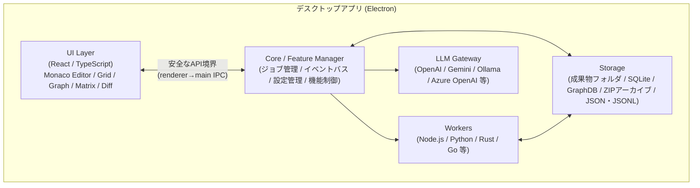

# D2D(設計情報デジタル化・トレーサビリティ支援ツール) 要求仕様書

## 目次

| # | セクション |
| - | --- |
| 1 | [目的](#1-目的) |
| 2 | [基本方針](#2-基本方針)（データ階層・データ管理原則） |
| 3 | [対象範囲](#3-対象範囲)（対象文書・対象設計情報） |
| 4 | [システム構成要求](#4-システム構成要求)（アーキテクチャ・デスクトップアプリ） |
| 5 | [プラットフォーム基盤要求](#5-プラットフォーム基盤要求)（機能・WS・ジョブ・設定） |
| 6 | [データ管理要求](#6-データ管理要求)（成果物セット・ZIPアーカイブ・設計情報ストア・DB to Text・ZIP差分） |
| 7 | [取込・抽出要求](#7-取込抽出要求)（原本取込・文書構造抽出・抽出レビュー） |
| 8 | [中間データ処理要求](#8-中間データ処理要求)（設計観点別管理・LLM入力用チャンク） |
| 9 | [設計モデル要求](#9-設計モデル要求)（設計要素・属性・関係性） |
| 10 | [トレーサビリティ要求](#10-トレーサビリティ要求)（マトリクス・分析・クエリ） |
| 11 | [編集機能要求](#11-編集機能要求)（統合編集・図表・状態遷移・検証・用語集） |
| 12 | [LLM支援要求](#12-llm支援要求)（Provider・ログ・プロンプト・候補生成・安全性） |
| 13 | [UI要求](#13-ui要求)（共通UI・主要ビュー） |
| 14 | [CLI要求](#14-cli要求) |
| 15 | [レポート・出力要求](#15-レポート出力要求) |
| 16 | [Git連携要求](#16-git連携要求) |
| 17 | [モデル表現・外部記法要求](#17-モデル表現外部記法要求)（PlantUML・SysMLv2） |
| 18 | [非機能要求](#18-非機能要求)（性能・信頼性・セキュリティ・保守性・商用） |
| 19 | [機能構成要求](#19-機能構成要求) |
| 20 | [最終要求サマリ](#20-最終要求サマリ) |

**関連文書**

| 文書 | 内容 |
| --- | --- |
| [全体詳細設計書](sdd_overall.md) | 実行時フォルダ構成・成果物配置・Git管理対象・ZIPアーカイブ配置 |
| [文書抽出機能 共通設計書](sdd_extractor_common.md) | 全抽出機能共通の設計・データ契約 |
| [Word文書情報抽出機能 詳細設計書](sdd_extractor_word.md) | Word抽出の詳細設計 |
| [Excel文書情報抽出機能 詳細設計書](sdd_extractor_excel.md) | Excel抽出の詳細設計 |
| [PowerPoint文書情報抽出機能 詳細設計書](sdd_extractor_powerpoint.md) | PowerPoint抽出の詳細設計 |
| [Visio文書情報抽出機能 詳細設計書](sdd_extractor_visio.md) | Visio抽出の詳細設計 |
| [PDF文書情報抽出機能 詳細設計書](sdd_extractor_pdf.md) | PDF抽出の詳細設計 |
| [トレーサビリティ詳細設計書](sdd_trace_detail.md) | トレース関係データモデル・表示UI・マトリクス・検索・性能の詳細設計 |
| [機能構成詳細設計書](sdd_function_architecture.md) | 機能種別・データ流れ・呼び出し関係・イベント連携・無効化時の扱い |

---

## 1. 目的

本ツールは、既存のWord、Excel、PowerPoint、Visio、PDF、テキスト等で作成された自然言語中心の設計文書を段階的にデジタル化し、設計要素および設計要素間の関係性を構造化管理することを目的とする。

これにより、要求、制約、機能、構造、振舞、状態、インタフェース、データモデル、検証情報、設計判断根拠等の間に複数観点のトレーサビリティを確保し、仕様変更時の影響分析、設計根拠確認、検証カバレッジ確認、設計レビュー支援を機械的に実施可能にする。

本ツールは、すべてをLLMに自動判断させるものではなく、LLMを候補生成・要約・抽出・レビュー補助に用い、人間による逐次確認、修正、採用、棄却を前提とした human-in-the-loop 型の設計支援ツールとする。

---

## 2. 基本方針

### 2.1 データ階層

本ツールは、以下の4階層でデータを管理する。

| 階層 | 名称    | 内容                       | 主な役割            |
| -- | ----- | ------------------------ | --------------- |
| ①  | 原本データ | Word、Excel、PDF等の既存文書     | 改変しない一次情報(既存の仕様書・設計書)       |
| ②  | 抽出データ | タイトル、本文、図、表、数式等     | ①から原本ファイル単位で抽出した外形情報を保持      |
| ③  | 中間データ | 統合設計書、原本に近い自然言語本文、章構成、図表説明、参照関係、段落関係、SQLite DB等     | 複数ファイルに分かれた設計書を成果物単位で統合し、原本に近い文書出力と設計情報整理の両方に利用する |
| ④  | 設計モデル | 要求、制約、機能、構造、振舞、状態、IF、検証、要素間関係等 | ③の設計結果を根拠に、階層構造と粒度を持つ要素・関係性モデルで表現した形式    |

**データ変換フロー**




### 2.2 データ管理原則

1. ①原本データは改変しない。
2. ②抽出データは①から抽出した情報であり、原則として原本ファイル単位で管理する。
3. ②抽出データは原本忠実性を重視し、意味解釈を過度に入れない。
4. ③中間データは、設計書が複数ファイルに分かれている場合でも、開発プロセス上の成果物単位で統合し、原本に近い自然言語本文と章構成を保持した統合設計書データとして扱う。
5. ③中間データは、章構成、原本設計書のアウトライン（親子関係）、本文、図表、参照関係を持ったデータ化された設計書であり、レポート機能により原本に近い文書として出力できる。②と④とのトレーサビリティ、③の各成果物間のトレーサビリティを持つ。
6. ④設計モデルで設計上の意味を確定する。
7. ④設計モデルは、要素と関係性を階層構造および粒度を考慮して接続し、③の設計結果との対応関係を保持する。
8. IDをもつ設計情報や各要素・関係に対して双方向トレーサビリティを確保する。
9. LLMの出力は確定情報ではなく、候補情報として扱う。
10. 人間レビューにより採用・修正・棄却された情報のみを②抽出データ、③中間データ、④設計モデルの各正本へ反映する。

---

## 3. 対象範囲

### 3.1 対象文書

本ツールは、以下の原本文書を扱えること。

| 種別                      | 必須度 |
| ----------------------- | --- |
| Word文書                  | 必須  |
| Excel文書                 | 必須  |
| PowerPoint文書            | 必須  |
| Visio文書                 | 重要  |
| PDF文書                   | 必須  |
| テキストファイル                | 必須  |
| Markdownファイル            | 必須  |
| CSV / TSVファイル           | 必須  |
| JSON / JSONL / YAMLファイル | 必須  |
| ZIPアーカイブ(*1)                | 必須  |

(*1)本ツールは、抽出データおよび中間データの成果物セットをZIP圧縮したアーカイブとしても扱えること。通常の作業成果物は、JSON / JSONL、SQLite DB、画像、ページ画像・スライド画像等の確認用レンダリング成果物、manifest等を一つのフォルダにセットで保存し、ZIP圧縮前のフォルダ内容をGit履歴管理対象にできること。ZIP圧縮ファイルは、過去時点のアーカイブ、受け渡し、最新成果物との差分比較用インポートに用いる。

### 3.2 対象設計情報

本ツールは、少なくとも以下の設計情報を管理できること（本ツールの機能構成を実現することによって、結果的に管理可能となるという意味）。

| 分類        | 要素                          |
| --------- | --------------------------- |
| 一次情報      | 原本文書、章、節、段落、図、表、数式、注記       |
| 規範情報      | 法律、規則、規約、業務規則、社内標準、外部標準     |
| 要求情報      | 上位要求、派生要求、機能要求、非機能要求        |
| 制約情報      | 法規制約、性能制約、安全制約、運用制約、実装制約    |
| 機能情報      | 機能、サブ機能、機能責務                |
| 構造情報      | 装置、ソフトウェア、モジュール、コンポーネント、タスク |
| 振舞情報      | シナリオ、処理手順、イベント、アクション        |
| 状態情報      | 状態、状態遷移、遷移条件                |
| インタフェース情報 | 外部IF、内部IF、API、通信、信号、入出力     |
| データモデル    | データ項目、データ構造、メッセージ、ER、表定義    |
| 検証情報      | 試験項目、確認観点、検証条件、期待結果         |
| 管理情報      | 設計判断、根拠、未決、仮置き、リスク、課題、変更要求  |

---

## 4. システム構成要求

### 4.1 アーキテクチャ方針

本ツールは、機能分割アーキテクチャ方式とし、主要機能および横断機能は個別に有効化・無効化でき、FE/BEを含む機能単位で連動して制御できること。

**システム全体構成**



推奨構成は以下とする（参考）。

```text
Desktop Shell
  - Electron

Frontend
  - React
  - TypeScript
  - Monaco Editor
  - スプレッドシート表示（グリッド表示）
  - グラフ表示
  - マトリクス表示
  - Diff表示
  - 設計モデル表示(PlantUML)

Backend / Workers
  - Node.js worker
  - Python worker
  - Rust / Go worker / C / C++ / C# / Java/ etc..

Storage
  - SQLite
  - GraphDB / graph index
  - 成果物フォルダ
  - ZIPアーカイブ
  - JSON / JSONL
  - Markdown / CSV / TSV
  - Git連携用 text dump

LLM Gateway
  - OpenAI
  - Azure OpenAI
  - Ollama
  - Gemini
```

### 4.2 デスクトップアプリ要求

本ツールは、Web技術を用いたデスクトップアプリとして動作すること。

| ID      | 要求                               |
| ------- | -------------------------------- |
| APP-001 | Windows環境で動作すること                 |
| APP-002 | macOS/Linux対応を妨げない構成であること   |
| APP-003 | ローカルファイル、SQLite、GraphDB または関係グラフ索引、ZIP、外部ワーカーを扱えること |
| APP-004 | オフライン環境でも①〜④の閲覧・編集ができること         |
| APP-005 | 外部LLM API利用可否を設定により制御できること       |
| APP-006 | 社内閉域・機密文書利用を想定したローカル動作を可能とすること   |

---

## 5. プラットフォーム基盤要求

### 5.1 機能管理

| ID       | 要求                                   |
| -------- | ------------------------------------ |
| CORE-001 | 各機能を機能単位で管理できること                  |
| CORE-002 | 機能ごとに有効／無効を切り替えられること              |
| CORE-003 | 機能種別ごとの有効化条件、任意連携、設定を定義できること                  |
| CORE-004 | 無効化された機能を利用するUI・CLIを非表示または実行不可にできること |

### 5.2 ワークスペース管理

**ワークスペース / プロジェクト 階層**

```
ワークスペース（上位概念、業務ドメインや製品単位）
└── プロジェクト（下位概念、文書セットや作業フェーズ単位）
    └── 階層①原本データ〜④設計モデル
```

| ID       | 要求                                         |
| -------- | ------------------------------------------ |
| CORE-010 | ワークスペースを作成できること。ワークスペースは複数のプロジェクトを管理する上位概念とする |
| CORE-011 | 複数ワークスペースを切り替えられること                        |
| CORE-012 | プロジェクトをまたいでのデータ管理方針を定義できること                    |
| CORE-013 | プロジェクトに成果物フォルダ、SQLite DB、GraphDB または関係グラフ索引、ZIPアーカイブ、設定、ログを関連付けられること |
| CORE-014 | プロジェクトごとにLLM設定、抽出ルール、スキーマバージョンを保持できること    |
| CORE-015 | 実行時フォルダ構成は、[全体詳細設計書](sdd_overall.md) に従い、ワークスペース単位の設定・一時領域と、プロジェクト単位の原本、成果物フォルダ、設計モデル、アーカイブを分離できること |

### 5.3 ジョブ管理

| ID       | 要求                                        |
| -------- | ----------------------------------------- |
| CORE-020 | 文書取込、抽出、LLM実行、DB to Text出力等をジョブとして実行できること |
| CORE-021 | ジョブの状態を待機中、実行中、成功、失敗、中断として管理できること         |
| CORE-022 | ジョブログを保存できること                             |
| CORE-023 | 長時間処理をUIと分離して実行できること                      |
| CORE-024 | 失敗したジョブを条件付きで再実行できること                     |

### 5.4 イベントバス

| ID       | 要求                                     |
| -------- | -------------------------------------- |
| CORE-030 | 機能間でイベント通知できること                     |
| CORE-031 | 原本取込、抽出完了、レビュー完了、設計モデル更新等のイベントを発行できること |
| CORE-032 | イベントに応じて関連ビューを更新できること                  |

### 5.5 設定管理

| ID       | 要求                                    |
| -------- | ------------------------------------- |
| CORE-040 | アプリ全体設定を管理できること                       |
| CORE-041 | ワークスペース別設定を管理できること                    |
| CORE-042 | ワークスペースには複数のプロジェクトを管理できること（→ CORE-010参照）  |
| CORE-043 | プロジェクトは階層①〜④のデータ（原本・抽出・中間・設計モデル）を統括管理できること |
| CORE-044 | APIキー、モデル、パス、プロキシ、テーマ、ショートカットを設定できること |
| CORE-045 | APIキーを含む機密情報は平文保存しないこと（→ NFR-020参照）    |
| CORE-046 | 設定のエクスポート／インポートができること                 |

---

## 6. データ管理要求

### 6.1 成果物セット / ZIPアーカイブ管理

②抽出データおよび③中間データの抽出・編集結果は、通常時はZIP圧縮せず、JSON / JSONL、SQLite DB、画像、ページ画像・スライド画像等の確認用レンダリング成果物、manifest等を一つのフォルダ内にセットで保存する。②の成果物セットは原本ファイル単位、③の成果物セットは複数原本ファイルから成る成果物単位に対応する。ZIP圧縮ファイルは通常の編集対象ではなく、過去時点のアーカイブ、受け渡し、最新成果物との差分比較用インポートに用いる。

| ID       | 要求                                                  |
| -------- | --------------------------------------------------- |
| DATA-001 | ②抽出データの抽出・編集結果を、原本ファイル単位の成果物フォルダとして保存できること |
| DATA-002 | ③中間データの抽出・編集結果を、複数原本ファイルから成る成果物単位の成果物フォルダとして保存できること |
| DATA-003 | 成果物フォルダにはmanifestを保持し、schema_version、作成日時、原本ハッシュ、抽出器バージョン、成果物一覧を保持すること |
| DATA-004 | 成果物フォルダ内のJSON / JSONL、SQLite DB、画像、ページ画像・スライド画像等の確認用レンダリング成果物、ログの役割をmanifestで識別できること |
| DATA-005 | ZIP圧縮前の成果物フォルダはGit履歴管理対象にできること |
| DATA-006 | ZIP圧縮ファイルはGit対象外のアーカイブとして保持できること |
| DATA-007 | ZIP圧縮ファイルをインポートし、最新の成果物フォルダとの差分比較に利用できること |
| DATA-008 | ②抽出データは、抽出元の原本ファイルID、原本ハッシュ、ファイル内位置、抽出器バージョンを保持できること |
| DATA-009 | ③中間データは、統合対象となった②抽出データ群、成果物ID、開発フェーズ、章構成、統合順序を保持できること |

### 6.2 設計情報ストア管理

④設計モデルは、設計要素、関係性、レビュー状態、根拠リンク、変更履歴を保存できること。④の各要素・関係は、根拠となる③中間データ上の成果物ID、章節、レビュー状態へ戻れること。SQLite は設計情報の保存・編集・一覧表示に用いる形態の一つとし、関係探索、影響分析、可視化に適する場合は GraphDB または関係グラフ索引を利用できること。

| ID       | 要求                                      |
| -------- | --------------------------------------- |
| DATA-010 | 設計要素を設計情報ストアに保存できること                     |
| DATA-011 | 設計要素間の関係を設計情報ストアまたはGraphDBに保存できること       |
| DATA-012 | レビュー状態、根拠リンク、変更履歴を設計情報ストアに保存できること        |
| DATA-013 | 用途別のView、Query、Graph Projectionを定義できること      |
| DATA-014 | View、Query、Graph Projectionを用いてトレース、欠落、孤立、検証未対応を確認できること |
| DATA-015 | SQLite直接編集、GraphDB直接編集等のストア直接編集は管理者向け機能として制御できること |
| DATA-016 | SQLite、GraphDB、JSON / JSONL 等の複数保存形態を併用する場合、正本、派生成果物、索引、キャッシュの区別を明示できること |
| DATA-017 | ④設計モデルの要素・関係は、対応する③中間データの成果物ID、章節IDを参照できること |
| DATA-018 | 開発フェーズ間の成果物トレーサビリティは、③中間データの成果物IDを基準単位として管理できること |

### 6.3 DB to Text

DB to Text は、②抽出データ、③中間データ、④設計モデルに含まれるDB内容を、差分表示やLLM入力のために一時的または派生的にテキスト化する機能である。DBが正本であり、Textは正本ではない。

| ID       | 要求                                               |
| -------- | ------------------------------------------------ |
| DATA-020 | ②抽出データ、③中間データ、④設計モデルのDB内容を安定した順序でテキスト出力できること |
| DATA-021 | 要素一覧、関係一覧、トレースマトリクスをMarkdown/CSV/TSV/JSONLとして出力できること |
| DATA-022 | DB to Text出力結果を差分表示やLLM入力に利用できること |
| DATA-023 | DB to Text出力は派生成果物または一時成果物として扱い、DB正本を置き換えないこと |
| DATA-024 | DB to Textは、保存処理や差分確認処理から呼び出されるHook的な機能として利用できること |

### 6.4 ZIPアーカイブ差分

ZIPアーカイブは、過去時点の②抽出データ、③中間データ、④設計モデルを保存し、現在の成果物との差分を確認するために利用する。Git管理の履歴情報と連携する場合も、ZIPアーカイブは差分比較用の取り込み単位として扱う。

| ID       | 要求                             |
| -------- | ------------------------------ |
| DATA-030 | ②抽出データ、③中間データ、④設計モデルの成果物セットをZIPアーカイブとして保存できること |
| DATA-031 | ZIPアーカイブを差分比較用にインポートし、現在の成果物フォルダまたはDB to Text出力と比較できること |
| DATA-032 | ZIPアーカイブのインポートは現在の正本成果物を直接上書きしないこと |
| DATA-033 | ZIPアーカイブには作成日時、対象データ階層、schema_version、元成果物ハッシュを記録できること |

---

## 7. 取込・抽出要求

### 7.1 原本取込

| ID      | 要求                                      |
| ------- | --------------------------------------- |
| IMP-001 | Word文書を取り込めること                          |
| IMP-002 | Excel文書を取り込めること                         |
| IMP-003 | PowerPoint文書を取り込めること                    |
| IMP-004 | Visio文書を取り込めること                         |
| IMP-005 | PDF文書を取り込めること                           |
| IMP-006 | テキスト、Markdown、CSV、TSV、JSON、YAMLを取り込めること |
| IMP-008 | 原本のハッシュ値を計算し、同一性を管理できること                |
| IMP-009 | 原本を改変せず保存できること                          |

### 7.2 文書構造抽出

文書抽出機能に共通する設計と、形式別詳細設計書の読み方は、[文書抽出機能 共通設計書](sdd_extractor_common.md) に定義する。

Word文書抽出の詳細設計は、[Word文書情報抽出機能 詳細設計書](sdd_extractor_word.md) に定義する。

Excel文書抽出の詳細設計は、[Excel文書情報抽出機能 詳細設計書](sdd_extractor_excel.md) に定義する。

PowerPoint文書抽出の詳細設計は、[PowerPoint文書情報抽出機能 詳細設計書](sdd_extractor_powerpoint.md) に定義する。

Visio文書抽出の詳細設計は、[Visio文書情報抽出機能 詳細設計書](sdd_extractor_visio.md) に定義する。

PDF文書抽出の詳細設計は、[PDF文書情報抽出機能 詳細設計書](sdd_extractor_pdf.md) に定義する。

| ID      | 要求                                  |
| ------- | ----------------------------------- |
| EXT-001 | 章、節、項番を抽出できること                      |
| EXT-002 | 段落を抽出できること                          |
| EXT-003 | 箇条書きを抽出できること                        |
| EXT-004 | 表を抽出できること                           |
| EXT-005 | 図を抽出できること                           |
| EXT-006 | 図表番号、キャプションを抽出できること                 |
| EXT-007 | 数式および数式名を抽出できること                    |
| EXT-008 | ページ番号、シート名、スライド番号等の原本位置を保持できること     |
| EXT-009 | Excelセル、結合セル、行列構造を抽出できること           |
| EXT-010 | PowerPointのスライド、図形、テキストボックスを抽出できること |
| EXT-011 | Visioの図形、接続、ラベル情報を抽出できること           |
| EXT-012 | PDFのテキスト、表、図、ページ位置を抽出できること          |
| EXT-013 | 抽出結果の個々の要素に重複しないIDを付与できること |
| EXT-014 | 抽出結果を編集、マージ、分割した場合に、新しい要素へ重複しないIDを割り当てられること |
| EXT-015 | マージ、分割、削除された抽出要素の履歴と元IDを追跡できること |

### 7.3 抽出結果レビュー

| ID      | 要求                             |
| ------- | ------------------------------ |
| EXT-020 | 抽出結果を一覧表示できること                 |
| EXT-021 | 抽出結果を人間が修正できること                |
| EXT-022 | 抽出結果に未確認、確認済、要修正、棄却の状態を付与できること |
| EXT-023 | 原本表示と抽出結果表示を並べて確認できること         |
| EXT-024 | 抽出誤りを修正して中間データへ反映できること         |

---

## 8. 中間データ処理要求

③中間データは、成果物単位で統合された設計書データであり、原本に近い自然言語本文、章構成、親子関係、参照関係、図表、表、説明文、モデル、シナリオ、状態遷移、検証、IF等の設計観点ごとに必要な情報を管理する。チャンクは③中間データそのものの単位ではなく、③中間データから④設計モデルを検討する際にLLMへ入力するための一時的な入力単位である。

### 8.1 中間データの設計観点別管理

| ID      | 要求                            |
| ------- | ----------------------------- |
| MID-001 | ③中間データは、成果物単位の統合設計書として、原本に近い自然言語本文、章構成、節、段落、図、表、参照関係、段落関係を保持できること |
| MID-002 | 自然言語本文、説明文、図、表、モデル、シナリオ、状態遷移、検証、IF等の設計観点ごとに、必要な管理項目を分けて保持できること |
| MID-003 | ③中間データの章構成、親子関係、参照関係は、チャンク情報ではなく③中間データの設計情報として保持すること |
| MID-004 | ③中間データの各情報単位にIDを付与し、②抽出データおよび④設計モデルとのトレーサビリティに利用できること |
| MID-005 | ③中間データは人間が編集、マージ、分割でき、変更後の情報単位に重複しないIDを割り当てられること |

### 8.2 図・表・説明文管理

| ID      | 要求                   |
| ------- | -------------------- |
| MID-010 | 図番号、図データ、キャプション、説明文を紐づけられること |
| MID-011 | 表番号、表データ、列、行、セル、構造説明を紐づけられること |
| MID-012 | 自然言語本文、説明文、注記、補足、前提条件を章節や図表と紐づけられること |
| MID-013 | 図表説明や構造説明はLLM生成候補として扱え、人間が採用、修正、棄却できること |
| MID-014 | 図、表、説明文の編集結果を③中間データの正本へ確定反映できること |

### 8.3 モデル・シナリオ・状態遷移・検証・IF管理

| ID      | 要求                             |
| ------- | ------------------------------ |
| MID-020 | モデル記述、構造、要素、関係候補を③中間データとして保持できること |
| MID-021 | シナリオ、手順、イベント、アクションを③中間データとして保持できること |
| MID-022 | 状態、状態遷移、遷移条件を③中間データとして保持できること |
| MID-023 | 検証観点、確認項目、期待結果を③中間データとして保持できること |
| MID-024 | IF、API、通信、信号、入出力、データ項目を③中間データとして保持できること |
| MID-025 | 上記の各設計観点から④設計モデル候補を生成できること |

### 8.4 LLM入力用チャンク

| ID      | 要求                            |
| ------- | ----------------------------- |
| MID-030 | チャンクは、③中間データから④設計モデルを検討する際にLLMへ入力する一時的な単位として扱うこと |
| MID-031 | チャンク範囲はユーザが任意に作成、修正、削除できること |
| MID-032 | チャンクには入力対象となる③中間データのID範囲、本文、図表参照、プロンプト用途を紐づけられること |
| MID-033 | チャンク情報には親子関係を持たせず、章構成や親子関係は③中間データ側の設計情報として扱うこと |
| MID-034 | LLM候補はチャンク単位で生成できるが、確定情報として直接②/③/④へ反映しないこと |

---

## 9. 設計モデル要求

### 9.1 設計要素管理

| ID        | 要求                                       |
| --------- | ---------------------------------------- |
| MODEL-001 | 要求を登録、編集、削除できること                         |
| MODEL-002 | 制約を登録、編集、削除できること                         |
| MODEL-003 | 機能を登録、編集、削除できること                         |
| MODEL-004 | 構造要素を登録、編集、削除できること                       |
| MODEL-005 | 振舞を登録、編集、削除できること                         |
| MODEL-006 | 状態および状態遷移を登録、編集、削除できること                  |
| MODEL-007 | インタフェースを登録、編集、削除できること                    |
| MODEL-008 | データモデルを登録、編集、削除できること                     |
| MODEL-009 | 検証情報を登録、編集、削除できること                       |
| MODEL-010 | 用語を登録、編集、削除できること                         |
| MODEL-011 | 設計判断、根拠、未決、仮置き、リスク、課題、変更要求を登録、編集、削除できること |

### 9.2 設計要素属性

各設計要素は、少なくとも以下を持つこと。

| 属性            | 内容           |
| ------------- | ------------ |
| element_id    | 一意識別子        |
| element_type  | 要求、制約、機能等の種別 |
| name          | 表示名          |
| description   | 説明本文         |
| source_links  | 根拠リンク        |
| confidence    | LLM抽出時の確度    |
| review_status | レビュー状態       |
| created_by    | 人間、LLM、ルール   |
| updated_by    | 更新者          |
| version       | 版            |
| maturity      | 成熟度          |
| tags          | 分類タグ         |
| notes         | 備考           |
| design_artifact_id | 対応する③中間データの成果物ID |
| section_path | ③中間データ上の章節位置 |
| granularity | システム、サブシステム、機能、処理、項目等の粒度 |
| parent_element_id | 階層構造上の親要素ID |

### 9.3 関係性管理

本ツールは、運用可能な関係種別を定義し、関係種別を追加する場合は用途、表示・分析での利用目的、レビュー手順を明確にする。

| 関係種別 | 用途 |
| --- | --- |
| parent_child | 要素の階層、章節配下、機能分解、構造分解を表す |
| based_on | ④設計要素・関係が、③中間データまたは原本根拠に基づくことを表す |
| satisfy | 要求・制約を、機能・構造・振舞等が満たすことを表す |
| verify | 要求・機能・制約に対する検証情報の対応を表す |
| depend | 変更影響、参照、利用、入出力等の依存を表す |

上記以外の `allocate`、`derive`、`conflict`、`duplicate`、`related`、`phase_trace` 等を追加する場合は、既存5種で表現できない理由、表示・分析での利用目的、レビュー手順を定義する。

各関係は、少なくとも以下を持つこと。

| 属性              | 内容         |
| --------------- | ---------- |
| relation_id     | 一意識別子      |
| relation_type   | 関係種別       |
| from_element_id | 関係元        |
| to_element_id   | 関係先        |
| description     | 関係説明       |
| source_links    | 根拠リンク      |
| confidence      | 確度         |
| review_status   | レビュー状態     |
| created_by      | 人間、LLM、ルール |
| version         | 版          |
| granularity      | 関係が成立する粒度 |
| source_artifact_ids | 関係の根拠となる③中間データの成果物ID群 |

---

## 10. トレーサビリティ要求

### 10.1 トレースマトリクス

| ID        | 要求                           |
| --------- | ---------------------------- |
| TRACE-001 | 要求×機能のトレースマトリクスを表示できること      |
| TRACE-002 | 要求×制約のトレースマトリクスを表示できること      |
| TRACE-003 | 機能×構造のトレースマトリクスを表示できること      |
| TRACE-004 | 機能×振舞のトレースマトリクスを表示できること      |
| TRACE-005 | 機能×インタフェースのトレースマトリクスを表示できること |
| TRACE-006 | 要求×検証のトレースマトリクスを表示できること      |
| TRACE-007 | マトリクス上で関係を追加、修正、削除できること      |
| TRACE-008 | 関係種別、レビュー状態、確度でフィルタできること     |
| TRACE-009 | 開発フェーズ別の③成果物単位で、成果物間および成果物内要素間のトレースマトリクスを表示できること |

### 10.2 トレース分析

| ID        | 要求                 |
| --------- | ------------------ |
| TRACE-010 | 要求未実現を検出できること      |
| TRACE-011 | 検証未対応を検出できること      |
| TRACE-012 | 孤立要素を検出できること       |
| TRACE-013 | 根拠不明要素を検出できること     |
| TRACE-014 | 上流トレースを探索できること     |
| TRACE-015 | 下流トレースを探索できること     |
| TRACE-016 | 変更起点から影響候補を探索できること |
| TRACE-017 | 矛盾・競合候補を抽出できること    |
| TRACE-018 | ③成果物単位の上流・下流トレースをたどり、成果物配下の④要素・関係へ展開できること |

### 10.3 関係性クエリ

| ID        | 要求                              |
| --------- | ------------------------------- |
| TRACE-020 | CLIから関係性クエリを実行できること             |
| TRACE-021 | UIから関係性クエリを実行できること              |
| TRACE-022 | 要素種別、関係種別、深さ、方向を指定して探索できること     |
| TRACE-023 | クエリ結果を表、階層リスト、グラフで表示できること       |
| TRACE-024 | クエリ結果をJSON/CSV/Markdownで出力できること |

### 10.4 トレース詳細設計（別ファイル参照）

トレース関係の詳細設計（データモデル・表示UI・マトリクス詳細・検索・性能）は、以下の別ファイルに定義する。

**[トレーサビリティ詳細設計書](sdd_trace_detail.md)**

| ID範囲 | 内容 |
| --- | --- |
| TRACE-030〜038 | トレース関係データモデル（多対多・方向・関係種別・スキーマバージョン等） |
| TRACE-040〜052 | トレース表示・編集UI（コネクタ表示・Undo/Redo・API境界等） |
| TRACE-060〜070 | トレースマトリクス詳細（セル操作・フィルタ・同期・大規模対応等） |
| TRACE-080〜089 | トレース検索・履歴・プロジェクト連携 |
| TRACE-090〜098 | トレース性能・信頼性要求（描画最適化・保存競合・LLM候補管理等） |

---

## 11. 編集機能要求

### 11.1 統合編集

| ID       | 要求                           |
| -------- | ---------------------------- |
| EDIT-001 | 抽出データを文書風に表示できること            |
| EDIT-002 | JSON/DB情報から文書風ビューを構築できること    |
| EDIT-003 | 設計要素ごとに表示／非表示を切り替えられること      |
| EDIT-004 | 要求、機能、構造、検証等を統合的に編集できること     |
| EDIT-005 | 文書構成の変更、章節の並べ替え、マージ、分割ができること |
| EDIT-006 | 要約を作成できること                   |
| EDIT-007 | 他の設計支援ツールを呼び出せること            |
| EDIT-008 | 編集内容を設計モデルへ反映できること           |

### 11.2 テキスト・Markdown編集

| ID       | 要求                    |
| -------- | --------------------- |
| EDIT-010 | 独自Markdownエディタを提供すること |
| EDIT-011 | 用語ハイライトができること         |
| EDIT-012 | 差分表示ができること            |
| EDIT-013 | フォント装飾ができること          |
| EDIT-014 | テキスト表示モードを切り替えられること   |
| EDIT-015 | 設計要素へのリンクを埋め込めること     |

### 11.3 図・表編集

| ID       | 要求                                      |
| -------- | --------------------------------------- |
| EDIT-020 | 図情報を表示・編集できること                          |
| EDIT-021 | 設計編集では、構造図、状態遷移図、関係グラフを扱えること |
| EDIT-022 | 表情報をグリッド形式で表示・編集できること                   |
| EDIT-023 | Excel完全互換ではなく、構造化表編集を優先すること             |
| EDIT-024 | 表の行、列、セルにIDを付与できること                     |
| EDIT-025 | 表全体単位とセル単位の両方で設計根拠に利用できること              |

### 11.4 状態遷移編集

| ID       | 要求                       |
| -------- | ------------------------ |
| EDIT-030 | 状態一覧を編集できること             |
| EDIT-031 | 遷移一覧を編集できること             |
| EDIT-032 | 遷移条件、イベント、アクションを管理できること  |
| EDIT-033 | 状態遷移図を表示できること            |
| EDIT-034 | 状態遷移の簡易シミュレーションができること    |
| EDIT-035 | 未到達状態、未定義遷移、競合遷移を検出できること |

### 11.5 検証編集

| ID       | 要求                       |
| -------- | ------------------------ |
| EDIT-040 | 検証項目を編集できること             |
| EDIT-041 | 検証対象となる要求、制約、機能を紐づけられること |
| EDIT-042 | 検証条件、手順、期待結果を管理できること     |
| EDIT-043 | 検証未対応要求を確認できること          |
| EDIT-044 | 検証カバレッジを表示できること          |

### 11.6 用語集編集

| ID       | 要求                       |
| -------- | ------------------------ |
| EDIT-050 | 用語、略語、定義、同義語、禁止語を管理できること |
| EDIT-051 | 文書中の用語候補を抽出できること         |
| EDIT-052 | 用語の揺れを検出できること            |
| EDIT-053 | 用語を文書・設計要素とリンクできること      |
| EDIT-054 | 用語ハイライトに利用できること          |

---

## 12. LLM支援要求

### 12.1 LLM Provider管理

| ID      | 要求                                      |
| ------- | --------------------------------------- |
| LLM-001 | OpenAIを利用できること                          |
| LLM-002 | Geminiを利用できること                          |
| LLM-003 | Ollamaを利用できること                          |
| LLM-004 | Azure OpenAIを利用できること                    |
| LLM-005 | ProviderごとにAPIキー、endpoint、modelを設定できること |
| LLM-006 | 外部API禁止、ローカルLLMのみ許可等の設定ができること           |

### 12.2 LLMログ管理

| ID      | 要求                               |
| ------- | -------------------------------- |
| LLM-010 | LLM送信内容を記録できること                  |
| LLM-011 | LLM応答内容を記録できること                  |
| LLM-012 | 使用モデル、プロンプト、入力チャンク、出力候補を紐づけられること |
| LLM-013 | token使用量、概算コスト、処理時間を記録できること      |
| LLM-014 | エラー内容を記録できること                    |
| LLM-015 | ログを画面表示できること                     |
| LLM-016 | APIキー等の機密情報はログに残さないこと            |

### 12.3 プロンプト管理

| ID      | 要求                                      |
| ------- | --------------------------------------- |
| LLM-020 | プロンプトテンプレートを登録できること                     |
| LLM-021 | プロンプトテンプレートをバージョン管理できること                |
| LLM-022 | 抽出、要約、分類、関係候補生成、レビュー支援ごとにテンプレートを分けられること |
| LLM-023 | プロンプトと出力結果の対応を追跡できること                   |

### 12.4 候補生成・レビュー

| ID      | 要求                  |
| ------- | ------------------- |
| LLM-030 | LLMにより要求候補を生成できること  |
| LLM-031 | LLMにより制約候補を生成できること  |
| LLM-032 | LLMにより機能候補を生成できること  |
| LLM-033 | LLMにより構造候補を生成できること  |
| LLM-034 | LLMにより関係性候補を生成できること |
| LLM-035 | LLMにより要約候補を生成できること  |
| LLM-036 | LLMにより用語候補を生成できること  |
| LLM-037 | LLM出力は候補として保持すること   |
| LLM-038 | 人間が候補を採用、修正、棄却できること |
| LLM-039 | 採用、修正、棄却の履歴を保存できること |

### 12.5 安全性・機密情報

| ID      | 要求                                   |
| ------- | ------------------------------------ |
| LLM-040 | 外部API送信前に送信内容を確認できること                |
| LLM-041 | 機密情報マスキングを適用できること                    |
| LLM-042 | ワークスペース単位で外部送信可否を設定できること             |
| LLM-043 | ローカルLLM優先モードを設定できること                 |
| LLM-044 | LLM再実行時に同一入力、同一プロンプト、同一モデル条件を確認できること |

---

## 13. UI要求

### 13.1 共通UI

| ID     | 要求                      |
| ------ | ----------------------- |
| UI-001 | ダークテーマとライトテーマを切り替えられること |
| UI-002 | 全体で一貫したデザイントークンを使用すること  |
| UI-003 | キーショートカットを設定できること       |
| UI-004 | コマンドパレットを提供すること         |
| UI-005 | 複数ペイン表示ができること           |
| UI-006 | ペイン分割、最大化、タブ表示ができること    |
| UI-007 | 大量データ表示時に仮想スクロールを利用すること |
| UI-008 | Webサイト風ではなく、IDEのような操作性とコンパクト性を重視したデザインとすること |
| UI-009 | ジョブの待機中、実行中、成功、失敗、中断、進捗、警告を画面上で確認できること |

### 13.2 主要ビュー

| ID     | 要求                     |
| ------ | ---------------------- |
| UI-010 | 原本ビューを提供すること           |
| UI-011 | 抽出データビューを提供すること        |
| UI-012 | 中間データビューを提供すること        |
| UI-013 | 設計モデルビューを提供すること        |
| UI-014 | トレースマトリクスビューを提供すること    |
| UI-015 | 階層化リスト間リンク表示ビューを提供すること |
| UI-016 | 関係グラフビューを提供すること        |
| UI-017 | Diffビューを提供すること         |
| UI-018 | LLM送受信ログビューを提供すること     |
| UI-019 | Git履歴参照ビューを提供すること      |
| UI-020 | SQLite DB、GraphDB、JSON / JSONL 等のストア閲覧ビューを提供すること  |

---

## 14. CLI要求

| ID      | 要求                                      |
| ------- | --------------------------------------- |
| CLI-001 | 関係性クエリをCLIで実行できること                      |
| CLI-002 | 文書中の用語抽出をCLIで実行できること                    |
| CLI-003 | DB to TextをCLIで実行できること                  |
| CLI-004 | 成果物フォルダのZIPアーカイブ生成をCLIで実行できること                  |
| CLI-005 | 原本取込・抽出処理をCLIで実行できること                   |
| CLI-006 | LLM候補生成をCLIで実行できること                     |
| CLI-007 | CLI実行結果をJSON/JSONL/Markdown/CSV/TSVで出力できること |
| CLI-008 | CLIはUIと同じワークスペース、DB、設定を利用できること          |

---

## 15. レポート・出力要求

| ID      | 要求                        |
| ------- | ------------------------- |
| EXP-001 | ③中間データから、原本に近い文書をレポートとして出力できること     |
| EXP-002 | ③中間データの自然言語本文、章構成、図表、表、参照関係から文書風表示を構築して出力できること |
| EXP-003 | 成果物ID、章、節、設計観点、情報種別、レビュー状態、設計要素等の条件で出力対象をフィルタできること     |
| EXP-004 | 出力する範囲、表示／非表示、出力形式を選択できること       |
| EXP-005 | Markdown形式で出力できること        |
| EXP-005A | ③中間データの一部範囲を指定して部分レポートを出力できること |
| EXP-006 | HTML形式で出力できること            |
| EXP-007 | PDF形式で出力できること             |
| EXP-008 | Word形式で出力できること            |
| EXP-009 | JSON/JSONL形式で出力できること      |
| EXP-010 | CSV/TSV形式で出力できること         |
| EXP-011 | PlantUML形式で出力できること        |
| EXP-012 | Mermaid形式で出力できること         |
| EXP-013 | SysMLv2形式で出力できること         |

---

## 16. Git連携要求

| ID      | 要求                            |
| ------- | ----------------------------- |
| GIT-001 | DB to Text出力結果をGit管理できること     |
| GIT-002 | Git履歴をUIから参照できること             |
| GIT-003 | ②〜③のZIP圧縮前の成果物フォルダはGit履歴管理対象にでき、ZIPアーカイブはGit対象外にできること     |
| GIT-004 | ④設計モデルのtext dumpをGit対象とできること  |
| GIT-005 | 変更差分をDiffビューで確認できること          |
| GIT-006 | 過去版の設計要素、関係、トレースマトリクスと比較できること |
| GIT-007 | Gitへのコミットは本ツール内では実行せず、ユーザが本ツール外のGit操作として行う前提とすること |

---

## 17. モデル表現・外部記法要求

### 17.1 内部モデル

| ID       | 要求                                                  |
| -------- | --------------------------------------------------- |
| FORM-001 | 内部正本は独自設計モデルとすること                                   |
| FORM-002 | SysMLv2、PlantUML、Mermaidは内部正本ではなく、ビューまたは出力形式として扱うこと |
| FORM-003 | 内部モデルから各外部形式へ変換できること                                |
| FORM-004 | 外部形式から内部モデルへの逆変換は制限付きで実施できること                       |

### 17.2 PlantUML

| ID       | 要求                        |
| -------- | ------------------------- |
| FORM-010 | PlantUMLモデルを表示・編集できること    |
| FORM-011 | 内部モデルからPlantUMLを生成できること   |
| FORM-012 | 状態遷移図、シーケンス図、構造図等を出力できること |

### 17.3 SysMLv2

| ID       | 要求                           |
| -------- | ---------------------------- |
| FORM-020 | SysMLv2形式への出力をサポートすること       |
| FORM-021 | SysMLv2モデル編集を設計編集機能の対象として扱えること      |
| FORM-022 | SysMLv2ビューまたは出力を提供できること |
| FORM-023 | 内部モデルとの対応関係を明示できること          |

---

## 18. 非機能要求

### 18.1 性能

| ID      | 要求                                     |
| ------- | -------------------------------------- |
| NFR-001 | 設計要素 1,000 件以下の一覧操作は 1 秒以内に応答すること。それを超える場合は仮想スクロールまたは遅延ロードで対応すること |
| NFR-002 | 一覧表示では仮想スクロールを使用すること                   |
| NFR-003 | 重い抽出処理、LLM処理、差分生成はバックグラウンドジョブとして実行すること |
| NFR-004 | SQLite検索、View表示、GraphDBまたは関係グラフ索引による関係探索に必要なIndexを設計すること   |

### 18.2 信頼性

| ID      | 要求                                |
| ------- | --------------------------------- |
| NFR-010 | 原本、抽出データ、中間データ、設計モデルの対応関係が失われないこと |
| NFR-011 | ジョブ失敗時に途中状態とエラー内容を確認できること         |
| NFR-012 | 編集操作はUndo/Redo可能であること             |
| NFR-013 | 破壊的変更前に確認を行うこと                    |
| NFR-014 | ZIPアーカイブを差分比較用にインポートできること                 |

### 18.3 セキュリティ

| ID      | 要求                    |
| ------- | --------------------- |
| NFR-020 | APIキーを含む機密情報を平文保存しないこと（→ CORE-045 も参照） |
| NFR-021 | LLMログにAPIキーを記録しないこと（→ LLM-016 も参照）   |
| NFR-022 | 外部LLM API送信可否をワークスペース単位で設定できること（→ LLM-006, LLM-042 も参照） |
| NFR-023 | 機密情報マスキングを実施できること（→ LLM-041 も参照）  |
| NFR-024 | ローカルのみで処理するモードを提供すること（→ LLM-043 も参照） |

### 18.4 保守性

| ID      | 要求                            |
| ------- | ----------------------------- |
| NFR-030 | 機能ごとに独立して開発・テストできること       |
| NFR-031 | スキーマ、プロンプト、抽出ルールをバージョン管理できること |
| NFR-032 | 外部ワーカーの入出力形式を明確化すること          |
| NFR-033 | JSON Schema等によりデータ形式を検証できること  |
| NFR-034 | ログにより障害解析可能であること              |

### 18.5 商用利用

| ID      | 要求                                           |
| ------- | -------------------------------------------- |
| NFR-040 | 商用利用可能なライブラリを使用すること                          |
| NFR-041 | GPL/AGPL等の混入を管理すること                          |
| NFR-042 | 表編集、PDF処理、OCR、Office変換、図編集ライブラリのライセンスを確認すること |
| NFR-043 | 依存ライブラリ一覧とライセンス一覧を出力できること                    |
| NFR-044 | フォント、画像、テンプレート等の再配布条件を確認すること                 |

---

## 19. 機能構成要求

機能種別、機能間のデータ流れ、呼び出し関係、イベント連携、無効化時の扱いは、[機能構成詳細設計書](sdd_function_architecture.md) に定義する。本章では、本ツールが提供する機能への要求と、機能に求める共通要求を定義する。

### 19.1 本ツール側の機能要求

本ツールは、主要機能および横断機能を機能単位で定義し、FE/BEを含む一体の機能として有効化、無効化、設定、権限、外部送信可否を管理する。各機能は、データ階層①〜④、ジョブ管理、成果物管理、レビュー、トレーサビリティ、出力といった本ツールの中核データ契約を壊さないことを前提とする。

| ID | 要求 |
| --- | --- |
| FUNC-HOST-001 | 本ツールは、機能を登録、有効化、無効化できる機能管理を提供すること |
| FUNC-HOST-002 | 本ツールは、機能種別ごとに入力データ、出力データ、イベント、設定、権限、エラー形式を定義できること |
| FUNC-HOST-003 | 本ツールは、機能が直接ファイルI/OやDB更新を行わず、安全なAPI境界を通じて成果物、設計モデル、設定、ログへアクセスできる共通API境界を提供すること |
| FUNC-HOST-004 | 本ツールは、機能種別ごとの必須機能、任意機能、有効化条件、設定を解決し、無効化された機能を利用するUI・CLIを非表示または実行不可にできること |
| FUNC-HOST-005 | 本ツールは、ジョブ管理、イベントバス、成果物管理、レビュー状態管理、LLM送信制御、Git差分確認を各機能から利用できる共通サービスとして提供すること |
| FUNC-HOST-006 | 本ツールは、機能のバージョン、対応schema_version、利用する機能種別、任意連携する機能種別、ライセンス、設定項目を機能定義として管理できること |
| FUNC-HOST-007 | 本ツールは、機能追加時に未解決の有効化条件、schema不整合、権限過多、有効化条件・設定不整合を検出できること |

### 19.2 必須の機能種別

以下は本ツールとして必要な機能種別である。個々の機能は、対応する機能種別の責務、入出力、イベント、設定、権限を満たすように設計・実装する。

| 機能種別 | 本ツールとして必要な理由 | 機能が提供する主な機能 | 詳細設計書 |
| --- | --- | --- | --- |
| 文書抽出機能 | ①原本データから②抽出データを生成するため | Word、Excel、PowerPoint、Visio、PDF、テキスト、Markdown、CSV、TSV、JSON等の形式別抽出 | [文書抽出機能設計書](sdd_extractor.md) および形式別詳細設計書 |
| 中間データ処理機能 | ②抽出データを③成果物単位の中間データへ統合・整理し、必要に応じて設計編集機能を利用するため | チャンク生成、用語抽出、参照リンク、表正規化、図表説明、設計編集機能の呼び出し | [中間データ処理機能設計書](sdd_intermediate_processing.md) |
| LLMプロバイダ機能 | 文書抽出、中間データ処理、設計編集、トレーサビリティ、履歴管理から共通的にLLM候補生成を利用できるようにするため | 外部LLM、ローカルLLM、クラウドLLMのプロバイダ接続 | [LLMプロバイダ機能設計書](sdd_llm_provider.md) |
| 設計編集機能 | ③中間データおよび④設計モデルの設計内容を編集・検索・レビュー補助するため | 用語検索、図編集、表編集、モデル編集、シナリオ編集、IF編集、状態遷移編集、PlantUML/Mermaid/SysMLv2等のモデル表現編集 | [設計編集機能設計書](sdd_design_editing.md) |
| トレーサビリティ機能 | ②抽出データ、③中間データ、④設計モデルのすべての情報単位IDに対する関係表示、検索、分析を共通機能として提供するため | トレースマトリクス、関係クエリ、影響分析、カバレッジ分析 | [トレーサビリティ機能設計書](sdd_trace.md) |
| 履歴管理機能 | ②抽出データ、③中間データ、④設計モデルの変更前、特定時点、時点間差分を設計編集中などに随時参照できるようにするため | SQLite DB内容比較、SQLite DB履歴差分確認、②/③/④成果物の履歴差分確認 | [履歴管理機能設計書](sdd_history_management.md) |

### 19.3 機能の共通要求

機能は、本ツール内で提供される個別機能または横断機能であり、対象機能種別の契約を満たす必要がある。

| ID | 要求 |
| --- | --- |
| FUNC-IMPL-001 | 機能は、対応する機能種別、機能ID、バージョン、対応schema_version、任意連携する機能種別、必要な有効化条件を機能定義で宣言すること |
| FUNC-IMPL-002 | 機能は、入力、出力、更新対象、発行イベント、購読イベント、エラー形式を設計書に明記すること |
| FUNC-IMPL-003 | 機能は、①原本、②抽出データ、③中間データ、④設計モデルのどの階層を読み書きするかを明示すること |
| FUNC-IMPL-004 | 機能は、正本、派生成果物、索引、キャッシュ、一時ファイルの区別を壊さないこと |
| FUNC-IMPL-005 | 機能は、LLM出力を確定情報として直接反映せず、候補、レビュー状態、根拠リンク、ログを分離して扱うこと |
| FUNC-IMPL-006 | 機能は、処理失敗時に可能な範囲の部分成果物、警告、未対応理由、再実行条件を記録できること |
| FUNC-IMPL-007 | 機能は、UIスレッドをブロックせず、長時間処理をジョブとして実行できること |
| FUNC-IMPL-008 | 機能は、商用利用上のライセンス、外部送信有無、機密情報の扱いを明示すること |

### 19.4 機能設計書要求

個々の機能の詳細は、`sdd_xxx.md` 形式の設計書として定義する。設計書は、単なる名称一覧ではなく、その機能が対象機能種別の要求にどう応えるかを機能として明記する。

| ID | 要求 |
| --- | --- |
| FUNC-DESIGN-001 | 機能設計書は、対象機能、目的、責務範囲、非責務範囲を明記すること |
| FUNC-DESIGN-002 | 機能設計書は、入力データ、出力データ、成果物フォルダ構成、機能定義項目、schema_versionを明記すること |
| FUNC-DESIGN-003 | 機能設計書は、利用する機能種別、任意連携する機能種別、発行イベント、購読イベントを明記すること |
| FUNC-DESIGN-004 | 機能設計書は、UI、CLI、ジョブ、ログ、レビュー状態、エラー処理、再実行条件を明記すること |
| FUNC-DESIGN-005 | 機能設計書は、LLM利用有無、外部送信有無、候補情報の扱い、人間レビューとの関係を明記すること |
| FUNC-DESIGN-006 | 機能設計書は、Git管理対象、Git対象外、ZIPアーカイブ対象、差分比較対象を明記すること |

### 19.5 機能フラグ要求

本ツールは、機能の有効／無効、外部送信可否、管理者向け機能の制御を、少なくとも以下の機能フラグで管理できること。

| 機能フラグ | 用途 |
| --- | --- |
| `feature.llm.enabled` | LLM機能全体の有効／無効を制御する |
| `feature.llm.externalApiAllowed` | 外部LLM APIへの送信可否を制御する |
| `feature.llm.localOnly` | ローカルLLMのみを利用する運用を制御する |
| `feature.git.enabled` | Git履歴管理との連携機能を制御する |
| `feature.dbDirectEdit.enabled` | SQLite、GraphDB等の直接編集機能を管理者向けに制御する |
| `feature.sysmlv2Editor.enabled` | SysMLv2モデル編集機能を制御する |
| `feature.visioImporter.enabled` | Visio文書抽出機能を制御する |
| `feature.export.word` | Word形式の出力機能を制御する |
| `feature.export.pdf` | PDF形式の出力機能を制御する |
| `feature.export.sysmlv2` | SysMLv2形式の出力機能を制御する |
| `feature.stateMachineSimulator.enabled` | 状態遷移シミュレーション機能を制御する |

---

# 20. 最終要求サマリ

本ツールは、以下を満たすこと。

1. 既存設計文書を①原本、②抽出、③中間、④設計モデルへ段階的に変換できること。
2. Word、Excel、PDF、PowerPoint、Visio、Markdown、CSV、TSV、JSON、画像を扱えること。
3. ②〜③の抽出・編集結果はJSON / JSONL、SQLite DB、画像等を含む成果物フォルダとして管理し、ZIP圧縮前の成果物フォルダはGit履歴管理対象にでき、ZIPアーカイブは差分比較用インポートと保管に利用できること。
4. ④設計モデルはSQLite、GraphDB、JSON / JSONL 等を保存・索引形態として使い分け、DB to TextによりGit差分確認可能とすること。
5. LLMは候補生成・要約・抽出・レビュー補助に利用し、確定判断は人間レビューを前提とすること。
6. 要求、制約、機能、構造、振舞、状態、IF、データモデル、検証、用語、設計判断、未決、リスクを管理できること。
7. 設計要素間の関係を明示的に管理し、トレースマトリクス、関係グラフ、階層リスト、CLIクエリで探索できること。
8. 仕様変更時に上流・下流の変更影響分析を支援できること。
9. 原本根拠、LLMログ、レビュー履歴、採否履歴を保持できること。
10. 機能分割アーキテクチャとし、各機能を機能単位で有効／無効化できること。
11. デスクトップアプリとして動作し、Web技術によるIDE風のコンパクトなUI、ローカルSQLite、GraphDB または関係グラフ索引、ローカルワーカー、外部LLM API、ローカルLLMを統合できること。
12. 商用利用可能なライブラリ構成とし、依存ライセンスを管理できること。

以上を本ツールの要求仕様とする。
