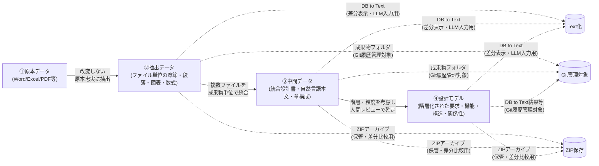
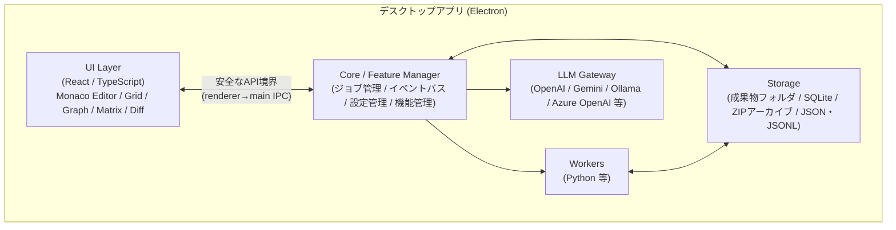

# D2D(設計情報デジタル化・トレーサビリティ支援ツール) 要求仕様書

## 目次

| # | セクション |
| - | --- |
| 1 | [目的](#1-目的) |
| 2 | [基本方針](#2-基本方針)（データ階層・データ管理原則・設計モデル化の工程） |
| 3 | [対象範囲](#3-対象範囲)（対象文書・対象設計情報） |
| 4 | [システム構成要求](#4-システム構成要求)（アーキテクチャ・デスクトップアプリ） |
| 5 | [プラットフォーム基盤要求](#5-プラットフォーム基盤要求)（機能・プロジェクト・ジョブ・設定） |
| 6 | [データ管理要求](#6-データ管理要求)（成果物セット・ZIPアーカイブ・設計情報ストア・DB to Text・ZIP差分） |
| 7 | [取込・抽出要求](#7-取込抽出要求)（原本取込・文書構造抽出・抽出レビュー） |
| 8 | [中間データ処理要求](#8-中間データ処理要求)（設計観点別管理・LLM入力用チャンク） |
| 9 | [設計モデル要求](#9-設計モデル要求)（設計要素・関係性） |
| 10 | [トレーサビリティ要求](#10-トレーサビリティ要求)（マトリクス・分析・クエリ） |
| 11 | [編集機能要求](#11-編集機能要求)（統合編集・図表・状態遷移・検証・用語集） |
| 12 | [LLM支援要求](#12-llm支援要求)（Provider・ログ・プロンプト・候補生成・安全性） |
| 13 | [UI要求](#13-ui要求)（共通UI・主要ビュー） |
| 14 | [CLI要求](#14-cli要求) |
| 15 | [レポート・出力要求](#15-レポート出力要求) |
| 16 | [Git連携要求](#16-git連携要求) |
| 17 | [モデル表現・外部記法要求](#17-モデル表現外部記法要求)（PlantUML・SysMLv2） |
| 18 | [非機能要求](#18-非機能要求)（性能・信頼性・セキュリティ・保守性・商用） |
| 19 | [機能構成要求](#19-機能構成要求) |


---

## 1. 目的

本ツールは、既存のWord、Excel、PowerPoint、Visio、PDF、テキスト等で作成された自然言語中心の設計文書を段階的にデジタル化し、設計要素および設計要素間の関係性を構造化管理することを目的とする。

これにより、要求、制約、機能、構造、振舞、状態、インタフェース、データモデル、検証情報、設計判断根拠等の間に複数観点のトレーサビリティを確保し、仕様変更時の影響分析、設計根拠確認、検証カバレッジ確認、設計レビュー支援を機械的に実施可能にする。

本ツールは、すべてをLLMに自動判断させるものではなく、LLMを候補生成・要約・抽出・レビュー補助に用い、人間による逐次確認、修正、採用、棄却を前提とした human-in-the-loop 型の設計支援ツールとする。

---

## 2. 基本方針

### 2.1 データ階層

本ツールは、以下の4階層でデータを管理する。

| 階層 | 名称    | 内容                       | 主な役割            |
| -- | ----- | ------------------------ | --------------- |
| ①  | 原本データ | Word、Excel、PDF等の既存文書     | 改変しない一次情報(既存の仕様書・設計書)       |
| ②  | 抽出データ | タイトル、本文、図、表、数式等     | ①から原本ファイル単位で抽出した外形情報を保持      |
| ③  | 中間データ | 統合設計書、原本に近い自然言語本文、章構成、図表説明、参照関係、段落関係、SQLite DB等     | 複数ファイルに分かれた設計書を成果物単位で統合し、原本に近い文書出力と設計情報整理の両方に利用する |
| ④  | 設計モデル | 要求、制約、機能、構造、振舞、状態、IF、検証、要素間関係等 | ③の設計結果を根拠に、階層構造と粒度を持つ要素・関係性モデルで表現した形式    |

**データ変換フロー**




### 2.2 データ管理原則

1. ①原本データは改変しない。
2. ②抽出データは①から抽出した情報であり、原則として原本ファイル単位で管理する。
3. ②抽出データは原本忠実性を重視し、意味解釈を過度に入れない。
4. ③中間データは、設計書が複数ファイルに分かれている場合でも、開発プロセス上の成果物単位で統合し、原本に近い自然言語本文と章構成を保持した統合設計書データとして扱う。
5. ③中間データは、章構成、原本設計書のアウトライン（親子関係）、本文、図表、参照関係を持ったデータ化された設計書であり、レポート機能により原本に近い文書として出力できる。②と④とのトレーサビリティ、③の各成果物間のトレーサビリティを持つ。
6. ④設計モデルで設計上の意味を確定する。
7. ④設計モデルは、要素と関係性を階層構造および粒度を考慮して接続し、③の設計結果との対応関係を保持する。
8. IDをもつ設計情報や各要素・関係に対して双方向トレーサビリティを確保する。
9. LLMの出力は確定情報ではなく、候補情報として扱う。
10. 人間レビューにより採用・修正・棄却された情報のみを②抽出データ、③中間データ、④設計モデルの各正本へ反映する。

### 2.3 設計モデル化の工程

本ツールは、原本文書を直接④設計モデルへ変換するのではなく、以下の工程に分けて段階的に構造化・意味化し、トレーサブルな設計知識グラフとして統合する。

| 工程 | 位置づけ | 主な処理 |
| --- | --- | --- |
| ①原本データ→②抽出データ | 文書構造の取得 | 章、節、段落、表、図、箇条書き、セル、キャプション、参照等を文書階層として取得し、出典位置を保持する |
| ②抽出データ→③中間データ | 設計記述要素の抽出 | 文書中の記述単位を抽出し、要求らしさ、制約らしさ、IFらしさ等の候補属性、根拠位置、信頼度を保持する |
| ②抽出データ→③中間データ | 記述型への分類 | 段落、表、図、シナリオ、状態遷移表、IF一覧表、データ項目表、モデル図等の記述型へ分類する |
| ③中間データ→④設計モデル | 設計意味候補への昇格 | 記述資源を要求候補、機能候補、IF候補、状態候補、データ候補、制約候補、根拠候補等へ変換する |
| ③中間データ→④設計モデル | 同一対象の統合・正規化 | 重複、類似、別表現、別成果物上の同一対象を統合候補として扱い、UID、名称、型、粒度、属性、表記揺れ、単位、関係名候補を標準化する |
| ③中間データ→④設計モデル | 関係付与 | 設計トレース、分解、実現、割当、依存、検証、根拠等の関係を付与する |
| 双方向トレーサビリティ分析 | 検査 | 未接続、不整合、根拠不足、粒度不一致、循環、過剰な汎用関係利用等を検出する |

各工程の出力は候補を含む。特に設計意味候補への昇格、同一対象の統合・正規化、関係付与の結果は、人間レビューにより採用・修正・棄却されるまで④設計モデルの確定情報として扱わない。検査は新たなデータ階層を生成する工程ではなく、双方向トレーサビリティの分析機能により、①〜④および設計関係層を横断して実現する。

### 2.4 記述形式と設計意味の分離

設計書上の記述形式と設計上の意味は一致しない。例えば表は、インターフェース定義、状態遷移表、データ定義、試験条件、要求一覧、制約一覧のいずれにもなり得る。同様に、段落、図、箇条書き、シナリオ、モデル記述も文脈により異なる設計意味を持つ。

本ツールは、記述形式を先に安定して抽出・分類し、その後で設計意味候補へ昇格する。1つの記述資源が複数の設計意味候補を持つことを許容し、根拠、信頼度、LLM実行参照、レビュー状態を保持したうえで、人間レビューにより確定する。

同一対象の統合・正規化では、ノードの同一性、名称、型、粒度、属性を整える。関係付与は、ノード間の設計上の意味関係を付与する処理であり、統合・正規化とは独立してレビュー、修正、再生成できること。関係の妥当性、未接続、不整合、循環等の検査は、双方向トレーサビリティ分析機能で実現すること。

---

## 3. 対象範囲

### 3.1 対象文書

本ツールは、以下の原本文書を扱えること。

| 種別 |
| --- |
| Word文書 |
| Excel文書 |
| PowerPoint文書 |
| Visio文書 |
| PDF文書 |
| テキストファイル |
| Markdownファイル |
| CSV / TSVファイル |
| JSON / JSONL / YAMLファイル |
| ZIPアーカイブ(*1) |

レビュー記録、障害管理台帳、議事録、QA表、変更要求一覧など、設計・試験・レビュー活動で発生する管理文書も対象文書として扱う。

(*1)本ツールは、抽出データおよび中間データの成果物セットをZIP圧縮したアーカイブとしても扱えること。通常の作業成果物は、JSON / JSONL、SQLite DB、画像を一つのフォルダにセットで保存し、ZIP圧縮前のフォルダ内容をGit履歴管理対象にできること。manifestはZIPアーカイブ生成時のみ作成する。ZIP圧縮ファイルは、過去時点のアーカイブ、受け渡し、最新成果物との差分比較用インポートに用いる。

### 3.2 対象設計情報

本ツールは、少なくとも以下の設計情報を管理できること（本ツールの機能構成を実現することによって、結果的に管理可能となるという意味）。

| 分類        | 要素                          |
| --------- | --------------------------- |
| 一次情報      | 原本文書、章、節、段落、図、表、数式、注記       |
| 規範情報      | 法律、規則、規約、業務規則、社内標準、外部標準     |
| 要求情報      | 上位要求、派生要求、機能要求、非機能要求        |
| 制約情報      | 法規制約、性能制約、安全制約、運用制約、実装制約    |
| 機能情報      | 機能、サブ機能、機能責務                |
| 構造情報      | 装置、ソフトウェア、モジュール、コンポーネント、タスク |
| 振舞情報      | シナリオ、処理手順、イベント、アクション        |
| 状態情報      | 状態、状態遷移、遷移条件                |
| インタフェース情報 | 外部IF、内部IF、API、通信、信号、入出力     |
| データモデル    | データ項目、データ構造、メッセージ、ER、表定義    |
| 検証情報      | 試験項目、確認観点、検証条件、期待結果         |
| 管理情報      | 設計判断、根拠、未決、仮置き、リスク、課題、変更要求  |

---

## 4. システム構成要求

### 4.1 アーキテクチャ方針

本ツールは、機能分割アーキテクチャ方式とし、主要機能および横断機能を責務単位で分離し、FE/BEを含む機能単位で構成できること。

**システム全体構成**



以下の構成とする。

```text
Desktop Shell
  - Electron

Frontend
  - React
  - TypeScript
  - Monaco Editor
  - スプレッドシート表示（グリッド表示）
  - グラフ表示
  - マトリクス表示
  - Diff表示
  - 設計モデル表示(PlantUML)

Backend / Workers
  - Node.js worker
  - Python worker

Storage
  - SQLite
  - 成果物フォルダ
  - ZIPアーカイブ
  - JSON / JSONL
  - Markdown / CSV / TSV
  - Git連携用 text dump

LLM Gateway
  - OpenAI
  - Azure OpenAI
  - Ollama
  - Gemini
```

### 4.2 デスクトップアプリ要求

本ツールは、Web技術を用いたデスクトップアプリとして動作すること。

| ID      | 要求                               |
| ------- | -------------------------------- |
| APP-001 | Windows環境で動作すること                 |
| APP-002 | macOS/Linux対応を妨げない構成であること   |
| APP-003 | ローカルファイル、SQLite、関係グラフ索引（将来的に GraphDB も可）、ZIP、外部ワーカーを扱えること |
| APP-004 | オフライン環境でも①〜④の閲覧・編集ができること         |
| APP-005 | 外部LLM API利用可否を設定により制御できること       |
| APP-006 | 社内閉域・機密文書利用を想定したローカル動作を可能とすること   |

---

## 5. プラットフォーム基盤要求

### 5.1 機能管理

| ID       | 要求                                   |
| -------- | ------------------------------------ |
| CORE-001 | 各機能を機能単位で管理できること                  |

### 5.2 プロジェクト管理

**プロジェクト階層**

```
プロジェクト（文書セット、製品、業務ドメイン、作業フェーズ等の管理単位）
└── 階層①原本データ〜④設計モデル
```

| ID       | 要求                                         |
| -------- | ------------------------------------------ |
| CORE-010 | プロジェクトを作成できること。プロジェクトは文書セット、製品、業務ドメイン、作業フェーズ等を管理する単位とする |
| CORE-011 | プロジェクトファイルを開くことで、利用するプロジェクトを切り替えられること                        |

### 5.3 ジョブ管理

| ID       | 要求                                        |
| -------- | ----------------------------------------- |
| CORE-020 | 文書取込、抽出、LLM実行、DB to Text出力等をジョブとして実行できること |
| CORE-021 | ジョブの状態を待機中、実行中、成功、失敗、中断として管理できること         |
| CORE-022 | ジョブログを保存できること                             |
| CORE-023 | 長時間処理をUIと分離して実行できること                      |
| CORE-024 | 失敗したジョブを条件付きで再実行できること                     |

### 5.4 イベントバス

| ID       | 要求                                     |
| -------- | -------------------------------------- |
| CORE-030 | 機能間でイベント通知できること                     |
| CORE-031 | 原本取込、抽出完了、レビュー完了、設計モデル更新等のイベントを発行できること |
| CORE-032 | イベントに応じて関連ビューを更新できること                  |

### 5.5 設定管理

| ID       | 要求                                    |
| -------- | ------------------------------------- |
| CORE-040 | アプリ全体設定を管理できること                       |
| CORE-041 | プロジェクト別設定を管理できること                    |
| CORE-042 | アプリは複数のプロジェクトを管理できること（→ CORE-010参照）  |
| CORE-043 | プロジェクトは階層①〜④のデータ（原本・抽出・中間・設計モデル）を統括管理できること |
| CORE-044 | APIキー、モデル、パス、プロキシ、テーマ、ショートカットを設定できること |
| CORE-045 | APIキーを含む機密情報は平文保存しないこと（→ NFR-020参照）    |
| CORE-046 | 設定のエクスポート／インポートができること                 |

---

## 6. データ管理要求

②抽出データ、③中間データ、④設計モデルの正本情報は、JSON / JSONL と SQLite DB を組み合わせて管理する。DB to Text、SQLite dump、Graph Projection、差分表示用テキストは、②③④に共通する派生成果物または一時成果物として扱う。

### 6.1 成果物セット / ZIPアーカイブ管理

②抽出データおよび③中間データの抽出・編集結果は、通常時はZIP圧縮せず、JSON / JSONL、SQLite DB、画像を一つのフォルダ内にセットで保存する。manifestはZIPアーカイブ生成時に作成し、ZIP内容、schema_version、作成日時、原本ハッシュ、抽出器バージョン、成果物一覧を記録する。ZIP圧縮ファイルは通常の編集対象ではなく、過去時点のアーカイブ、受け渡し、最新成果物との差分比較用インポートに用いる。

| ID       | 要求                                                  |
| -------- | --------------------------------------------------- |
| DATA-001 | ②抽出データの抽出・編集結果を、原本ファイル単位の成果物フォルダとして保存できること |
| DATA-001A | ②抽出データおよび③中間データの抽出・編集結果を、通常時はZIP圧縮せず、JSON / JSONL、SQLite DB、画像を一つのフォルダ内にセットで保存できること |
| DATA-002 | ③中間データの抽出・編集結果を、複数原本ファイルから成る成果物単位の成果物フォルダとして保存できること |
| DATA-003 | ZIPアーカイブ生成時にmanifestを作成し、schema_version、作成日時、原本ハッシュ、抽出器バージョン、成果物一覧を保持すること |
| DATA-004 | ZIPアーカイブ内のJSON / JSONL、SQLite DB、画像、ログの役割をmanifestで識別できること |
| DATA-005 | ZIP圧縮前の成果物フォルダはGit履歴管理対象にできること |
| DATA-006 | ZIP圧縮ファイルはGit対象外のアーカイブとして保持できること |
| DATA-007 | ZIP圧縮ファイルをインポートし、最新の成果物フォルダとの差分比較に利用できること |
| DATA-008 | ②抽出データは、抽出元の原本ファイルID、原本ハッシュ、ファイル内位置、抽出器バージョンを保持できること |
| DATA-009 | ③中間データは、統合対象となった②抽出データ群、成果物ID、開発フェーズ、章構成、統合順序を保持できること |
| DATA-018 | 開発フェーズ間の成果物トレーサビリティは、③中間データの成果物ID間のトレースとして保持できること |

### 6.2 設計情報ストア管理

| ID       | 要求                                      |
| -------- | --------------------------------------- |
| DATA-010 | ④設計モデルは、JSON / JSONL と SQLite DB を組み合わせて、設計要素、関係性を保存できること                     |
| DATA-011 | 設計要素間の関係を設計情報ストアとして保存できること。将来的に GraphDB（Neo4j 等）への移行も可能とすること。**現行実装は `trace_link` テーブルと SQLite 再帰 CTE（`WITH RECURSIVE`）による関係走査。** |
| DATA-017 | ④設計モデルの要素・関係は、対応する③中間データの成果物IDを参照できること |

### 6.3 DB to Text

DB to Text は、②抽出データ、③中間データ、④設計モデルに含まれるDB内容を、差分表示やLLM入力のために一時的または派生的にテキスト化する機能である。DBが正本であり、Textは正本ではない。

| ID       | 要求                                               |
| -------- | ------------------------------------------------ |
| DATA-020 | ②抽出データ、③中間データ、④設計モデルのDB内容を安定した順序でテキスト出力できること |
| DATA-021 | 要素一覧、関係一覧、トレースマトリクスをMarkdown/CSV/TSV/JSONLとして出力できること |
| DATA-022 | DB to Text出力結果を差分表示やLLM入力に利用できること |
| DATA-023 | DB to Text出力は派生成果物または一時成果物として扱い、DB正本を置き換えないこと |
| DATA-024 | DB to Textは、保存処理や差分確認処理から呼び出されるHook的な機能として利用できること |

### 6.4 ZIPアーカイブ差分

ZIPアーカイブは、過去時点の②抽出データ、③中間データ、④設計モデルを保存し、現在の成果物との差分を確認するために利用する。Git管理の履歴情報と連携する場合も、ZIPアーカイブは差分比較用の取り込み単位として扱う。

| ID       | 要求                             |
| -------- | ------------------------------ |
| DATA-030 | ②抽出データ、③中間データ、④設計モデルの成果物セットをZIPアーカイブとして保存できること |
| DATA-031 | ZIPアーカイブを差分比較用にインポートし、現在の成果物フォルダまたはDB to Text出力と比較できること |
| DATA-032 | ZIPアーカイブのインポートは現在の正本成果物を直接上書きしないこと |
| DATA-033 | ZIPアーカイブには作成日時、対象データ階層、schema_version、元成果物ハッシュを記録できること |

---

## 7. 取込・抽出要求

### 7.1 原本取込

| ID      | 要求                                      |
| ------- | --------------------------------------- |
| IMP-001 | Word文書を取り込めること                          |
| IMP-002 | Excel文書を取り込めること                         |
| IMP-003 | PowerPoint文書を取り込めること                    |
| IMP-004 | Visio文書を取り込めること                         |
| IMP-005 | PDF文書を取り込めること                           |
| IMP-006 | テキスト、Markdown、CSV、TSV、JSON、YAMLを取り込めること |
| IMP-008 | 原本のハッシュ値を計算し、同一性を管理できること                |
| IMP-009 | 原本を改変せず保存できること                          |

### 7.2 文書構造抽出

| ID      | 要求                                  |
| ------- | ----------------------------------- |
| EXT-001 | 章、節、項番を抽出できること                      |
| EXT-002 | 段落を抽出できること                          |
| EXT-003 | 箇条書きを抽出できること                        |
| EXT-004 | 表を抽出できること                           |
| EXT-005 | 図を抽出できること                           |
| EXT-006 | 図表番号、キャプションを抽出できること                 |
| EXT-007 | 数式および数式名を抽出できること                    |
| EXT-008 | ページ番号、シート名、スライド番号等の原本位置を保持できること     |
| EXT-009 | Excelセル、結合セル、行列構造を抽出できること           |
| EXT-010 | PowerPointのスライド、図形、テキストボックスを抽出できること |
| EXT-011 | Visioの図形、接続、ラベル情報を抽出できること           |
| EXT-012 | PDFのテキスト、表、図、ページ位置を抽出できること          |
| EXT-013 | 抽出結果の個々の要素に重複しないIDを付与できること |
| EXT-014 | 抽出結果を編集、マージ、分割した場合に、新しい要素へ重複しないIDを割り当てられること |
| EXT-015 | マージ、分割、削除された抽出要素の履歴と元IDを追跡できること |

### 7.3 抽出結果レビュー

| ID      | 要求                             |
| ------- | ------------------------------ |
| EXT-020 | 抽出結果を一覧表示できること                 |
| EXT-021 | 抽出結果を人間が修正できること                |
| EXT-022 | 抽出結果に未確認、確認済、要修正、棄却の状態を付与できること |
| EXT-023 | 原本表示と抽出結果表示を並べて確認できること         |
| EXT-024 | 抽出誤りを修正して中間データへ反映できること         |

---

## 8. 中間データ処理要求

③中間データは、成果物単位で統合された設計書データであり、原本に近い自然言語本文、章構成、親子関係、参照関係、図表、表、説明文、モデル、シナリオ、状態遷移、検証、IF等の設計観点ごとに必要な情報を管理する。

チャンクは③中間データそのものの単位ではなく、③中間データから④設計モデルを検討する際にLLMへ入力するための一時的な入力単位である。

### 8.1 中間データの設計観点別管理

| ID      | 要求                            |
| ------- | ----------------------------- |
| MID-001 | ③中間データは、成果物単位の統合設計書として、原本に近い自然言語本文、章構成、節、段落、図、表、参照関係、段落関係を保持できること |
| MID-002 | 自然言語本文、説明文、図、表、モデル、シナリオ、状態遷移、検証、IF等の設計観点ごとに、必要な管理項目を分けて保持できること |
| MID-003 | ③中間データの章構成、親子関係、参照関係は、チャンク情報ではなく③中間データの設計情報として保持すること |
| MID-004 | ③中間データの各情報単位にIDを付与し、②抽出データおよび④設計モデルとのトレーサビリティに利用できること |
| MID-005 | ③中間データは人間が編集、マージ、分割でき、変更後の情報単位に重複しないIDを割り当てられること |

### 8.2 図・表・説明文管理

| ID      | 要求                   |
| ------- | -------------------- |
| MID-010 | 図番号、図データ、キャプション、説明文を紐づけられること |
| MID-011 | 表番号、表データ、列、行、セル、構造説明を紐づけられること |
| MID-012 | 自然言語本文、説明文、注記、補足、前提条件を章節や図表と紐づけられること |
| MID-013 | 図表説明や構造説明はLLM生成候補として扱え、人間が採用、修正、棄却できること |
| MID-014 | 図、表、説明文の編集結果を③中間データの正本へ確定反映できること |

### 8.3 モデル・シナリオ・状態遷移・検証・IF管理

| ID      | 要求                             |
| ------- | ------------------------------ |
| MID-020 | モデル記述、構造、要素、関係候補を③中間データとして保持できること |
| MID-021 | シナリオ、手順、イベント、アクションを③中間データとして保持できること |
| MID-022 | 状態、状態遷移、遷移条件を③中間データとして保持できること |
| MID-023 | 検証観点、確認項目、期待結果を③中間データとして保持できること |
| MID-024 | IF、API、通信、信号、入出力、データ項目を③中間データとして保持できること |
| MID-025 | 上記の各設計観点から④設計モデル候補を生成できること |

### 8.4 LLM入力用チャンク

| ID      | 要求                            |
| ------- | ----------------------------- |
| MID-030 | チャンクは、③中間データから④設計モデルを検討する際にLLMへ入力する一時的な単位として扱うこと |
| MID-031 | チャンク範囲はユーザが任意に作成、修正、削除できること |
| MID-032 | チャンクには入力対象となる③中間データのID範囲、本文、図表参照、プロンプト用途を紐づけられること |
| MID-033 | チャンク情報には親子関係を持たせず、章構成や親子関係は③中間データ側の設計情報として扱うこと |
| MID-034 | LLM候補はチャンク単位で生成できるが、確定情報として直接②/③/④へ反映しないこと |

---

## 9. 設計モデル要求

### 9.1 設計要素管理

| ID        | 要求                                       |
| --------- | ---------------------------------------- |
| MODEL-001 | 要求を登録、編集、削除できること                         |
| MODEL-002 | 制約を登録、編集、削除できること                         |
| MODEL-003 | 機能を登録、編集、削除できること                         |
| MODEL-004 | 構造要素を登録、編集、削除できること                       |
| MODEL-005 | 振舞を登録、編集、削除できること                         |
| MODEL-006 | 状態および状態遷移を登録、編集、削除できること                  |
| MODEL-007 | インタフェースを登録、編集、削除できること                    |
| MODEL-008 | データモデルを登録、編集、削除できること                     |
| MODEL-009 | 検証情報を登録、編集、削除できること                       |
| MODEL-010 | 用語を登録、編集、削除できること                         |
| MODEL-011 | 設計判断、根拠、未決、仮置き、リスク、課題、変更要求を登録、編集、削除できること |

### 9.2 関係性管理

`trace_link.relation_type` の値は以下の通り定義する（詳細DDLは `sdd_data_structure.md` 参照）。

| 関係種別 | 用途 |
| --- | --- |
| `derived_from` | ②抽出データ→③中間データ→④設計モデルへの変換・導出関係を表す |
| `normalized_from` | 抽出結果を正規化・補正した中間データとの関係を表す |
| `based_on` | ④設計要素・関係が、③中間データまたは原本根拠に基づくことを表す |
| `satisfies` | 要求・制約を、機能・構造・振舞等が満たすことを表す |
| `verifies` | 要求・機能・制約に対する検証情報の対応を表す |
| `decomposes` | 上位要素を下位要素へ分解することを表す |
| `contains` | 構造要素、成果物、モデル等が下位要素を包含することを表す |
| `owns` | モジュール、コンポーネント、成果物等がデータや責務を所有することを表す |
| `realizes` | 構造要素や振舞が機能・設計意図を実現することを表す |
| `implements` | ソースコード、設定、モデル等が設計要素を実装することを表す |
| `allocated_to` | 機能、要求、責務等がタスク、コンポーネント、担当領域へ割り当てられることを表す |
| `depends_on` | 変更影響、参照、利用、入出力等の依存を表す |
| `uses` | 構造要素、機能、処理等がデータ、IF、外部要素を使用することを表す |
| `calls` | 処理、API、関数、シーケンス上の呼び出し関係を表す |
| `inputs` | 機能、処理、モデル等がデータを入力とすることを表す |
| `outputs` | 機能、処理、モデル等がデータを出力することを表す |
| `constrains` | 制約、規則、前提が設計要素を制約することを表す |
| `impacts` | 変更、課題、リスク等が設計要素へ影響することを表す |
| `conflicts_with` | 要求、制約、設計判断等の間に矛盾または衝突の可能性があることを表す |
| `refines` | 上位要素を具体化・詳細化することを表す |
| `relates_to` | 上記に分類しにくい関連を表す（過度な利用は避ける） |

**注意**: 文書構成上の親子関係（章節配下等）は `trace_link` ではなく、`extracted_document.structure_json` および `intermediate_document.structure_json` 内のJSON構造として管理する。設計要素間の意味的な階層分解は `decomposes`、詳細化は `refines`、構造的な包含は `contains` で表現する。

---

## 10. トレーサビリティ要求

| ID        | 要求                 |
| --------- | ------------------ |
| TRACE-001 | 上流／下流への双方向トレースにより探索できること     |
| TRACE-002 | 関係性を指定して探索できること      |
| TRACE-003 | 探索の深さを指定して探索できること      |
| TRACE-022 | 要素種別、関係種別、深さ、方向を指定して探索できること(クエリ探索)     |
| TRACE-023 | クエリ結果を表、階層リスト、グラフで表示できること       |
| TRACE-024 | クエリ結果をJSON/CSV/Markdownで出力できること |
| TRACE-020 | CLIから関係性クエリを実行できること             |
| TRACE-021 | UIから関係性クエリを実行できること              |

---

## 11. 編集機能要求

### 11.1 統合編集

| ID       | 要求                           |
| -------- | ---------------------------- |
| EDIT-002 | ②抽出データ、③中間データをJSON/DB情報から文書風ビューを構築できること    |
| EDIT-003 | 設計要素ごとに表示／非表示を切り替えられること      |
| EDIT-004 | 要求、機能、構造、検証等を統合的に編集できること     |
| EDIT-005 | 文書構成の変更、章節の並べ替え、マージ、分割ができること |
| EDIT-006 | 要約を作成できること                   |
| EDIT-007 | 他の設計支援ツールを呼び出せること            |
| EDIT-008 | 編集内容を設計モデルへ反映できること           |

### 11.2 テキスト・Markdown編集

| ID       | 要求                    |
| -------- | --------------------- |
| EDIT-010 | 独自Markdownエディタを提供すること |
| EDIT-011 | 用語ハイライトができること         |
| EDIT-012 | 差分表示ができること            |
| EDIT-013 | フォント装飾ができること          |
| EDIT-014 | テキスト表示モードを切り替えられること   |
| EDIT-015 | 設計要素へのリンクを埋め込めること     |

### 11.3 図・表編集

| ID       | 要求                                      |
| -------- | --------------------------------------- |
| EDIT-020 | 図情報を表示・編集できること                          |
| EDIT-021 | 設計編集では、構造図、状態遷移図、関係グラフを扱えること |
| EDIT-022 | 表情報をグリッド形式で表示・編集できること                   |
| EDIT-023 | Excel完全互換ではなく、構造化表編集を優先すること             |
| EDIT-024 | 表の行、列、セルにIDを付与できること                     |
| EDIT-025 | 表全体単位とセル単位の両方で設計根拠に利用できること              |

### 11.4 状態遷移編集

| ID       | 要求                       |
| -------- | ------------------------ |
| EDIT-030 | 状態一覧を編集できること             |
| EDIT-031 | 遷移一覧を編集できること             |
| EDIT-032 | 遷移条件、イベント、アクションを管理できること  |
| EDIT-033 | 状態遷移図を表示できること            |
| EDIT-034 | 状態遷移の簡易シミュレーションができること    |
| EDIT-035 | 未到達状態、未定義遷移、競合遷移を検出できること |

### 11.5 検証編集

| ID       | 要求                       |
| -------- | ------------------------ |
| EDIT-040 | 検証項目を編集できること             |
| EDIT-041 | 検証対象となる要求、制約、機能を紐づけられること |
| EDIT-042 | 検証条件、手順、期待結果を管理できること     |
| EDIT-043 | 検証未対応要求を確認できること          |
| EDIT-044 | 検証カバレッジを表示できること          |

### 11.6 用語集編集

| ID       | 要求                       |
| -------- | ------------------------ |
| EDIT-050 | 用語、略語、定義、同義語、禁止語を管理できること |
| EDIT-051 | 文書中の用語候補を抽出できること         |
| EDIT-052 | 用語の揺れを検出できること            |
| EDIT-053 | 用語を文書・設計要素とリンクできること      |
| EDIT-054 | 用語ハイライトに利用できること          |

---

## 12. LLM支援要求

### 12.1 LLM Provider管理

| ID      | 要求                                      |
| ------- | --------------------------------------- |
| LLM-001 | OpenAIを利用できること                          |
| LLM-002 | Geminiを利用できること                          |
| LLM-003 | Ollamaを利用できること                          |
| LLM-004 | Azure OpenAIを利用できること                    |
| LLM-005 | ProviderごとにAPIキー、endpoint、modelを設定できること |

### 12.2 LLMログ管理

| ID      | 要求                               |
| ------- | -------------------------------- |
| LLM-010 | LLM送信内容を記録できること                  |
| LLM-011 | LLM応答内容を記録できること                  |
| LLM-012 | 使用モデル、プロンプト、入力チャンク、出力候補を紐づけられること |
| LLM-013 | token使用量、概算コスト、処理時間を記録できること      |
| LLM-014 | エラー内容を記録できること                    |
| LLM-015 | ログを画面表示できること                     |
| LLM-016 | APIキー等の機密情報はログに残さないこと            |

### 12.3 プロンプト管理

| ID      | 要求                                      |
| ------- | --------------------------------------- |
| LLM-020 | プロンプトテンプレートを登録できること                     |
| LLM-021 | プロンプトテンプレートをバージョン管理できること                |
| LLM-022 | 抽出、要約、分類、関係候補生成、レビュー支援ごとにテンプレートを分けられること |
| LLM-023 | プロンプトと出力結果の対応を追跡できること                   |

### 12.4 候補生成・レビュー

| ID      | 要求                  |
| ------- | ------------------- |
| LLM-030 | LLMにより要求候補を生成できること  |
| LLM-031 | LLMにより制約候補を生成できること  |
| LLM-032 | LLMにより機能候補を生成できること  |
| LLM-033 | LLMにより構造候補を生成できること  |
| LLM-034 | LLMにより関係性候補を生成できること |
| LLM-035 | LLMにより要約候補を生成できること  |
| LLM-036 | LLMにより用語候補を生成できること  |
| LLM-037 | LLM出力は候補として保持すること   |
| LLM-038 | 人間が候補を採用、修正、棄却できること |
| LLM-039 | 採用、修正、棄却の履歴を保存できること |

### 12.5 安全性・機密情報

| ID      | 要求                                   |
| ------- | ------------------------------------ |
| LLM-040 | 外部API送信前に送信内容を確認できること                |
| LLM-041 | 機密情報マスキングを適用できること                    |
| LLM-042 | プロジェクト単位で外部送信可否を設定できること             |
| LLM-043 | ローカルLLM優先モードを設定できること                 |
| LLM-044 | LLM再実行時に同一入力、同一プロンプト、同一モデル条件を確認できること |

---

## 13. UI要求

### 13.1 共通UI

| ID     | 要求                      |
| ------ | ----------------------- |
| UI-001 | ダークテーマとライトテーマを切り替えられること |
| UI-002 | 全体で一貫したデザイントークンを使用すること  |
| UI-003 | キーショートカットを設定できること       |
| UI-004 | コマンドパレットを提供すること         |
| UI-005 | 複数ペイン表示ができること           |
| UI-006 | ペイン分割、最大化、タブ表示ができること    |
| UI-007 | 大量データ表示時に仮想スクロールを利用すること |
| UI-008 | Webサイト風ではなく、IDEのような操作性とコンパクト性を重視したデザインとすること |
| UI-009 | ジョブの待機中、実行中、成功、失敗、中断、進捗、警告を画面上で確認できること |
| UI-021 | UIは、固定画面遷移ではなく、作業対象をResourceとして開くWorkbench型UXを提供すること |
| UI-022 | 原本、抽出データ、中間データ、設計モデル、トレース結果、差分、ログ、設定をタブおよび分割ペインで開けること |
| UI-023 | 主要操作はCommandとして定義し、メニュー、ツールバー、コンテキストメニュー、ショートカット、コマンドパレットから一貫して実行できること |
| UI-024 | 選択中のResource、アクティブEditor、ジョブ状態、レビュー状態に応じて、操作の有効/無効や補助表示を切り替えられること |
| UI-025 | ユーザが変更したタブ、ペイン分割、サイドバー、パネルの表示状態を保存し、再開時に復元できること |
| UI-026 | 現在の作業対象に対するプロパティ、根拠、関係、LLM候補、レビュー状態を補助表示できること |
| UI-027 | ダーク／ライトの表示モードに加え、Serendie Design Systemの5つのカラーテーマ（konjo、asagi、sumire、tsutsuji、kurikawa）を切り替えられること |
| UI-028 | UIアイコンは、Serendie Design Systemの `serendie/serendie-symbols` をベースに、用途と意味が一致するものを選択すること |

### 13.2 主要ビュー

| ID     | 要求                     |
| ------ | ---------------------- |
| UI-010 | 原本ビューを提供すること           |
| UI-011 | 抽出データビューを提供すること        |
| UI-012 | 中間データビューを提供すること        |
| UI-013 | 設計モデルビューを提供すること        |
| UI-014 | トレースマトリクスビューを提供すること    |
| UI-015 | 階層化リスト間リンク表示ビューを提供すること |
| UI-016 | 関係グラフビューを提供すること        |
| UI-017 | Diffビューを提供すること         |
| UI-018 | LLM送受信ログビューを提供すること     |
| UI-019 | Git履歴参照ビューを提供すること      |
| UI-020 | SQLite DB、JSON / JSONL 等のストア閲覧ビューを提供すること  |

---

## 14. CLI要求

| ID      | 要求                                      |
| ------- | --------------------------------------- |
| CLI-001 | 関係性クエリをCLIで実行できること                      |
| CLI-002 | 文書中の用語抽出をCLIで実行できること                    |
| CLI-003 | DB to TextをCLIで実行できること                  |
| CLI-004 | 成果物フォルダのZIPアーカイブ生成をCLIで実行できること                  |
| CLI-005 | 原本取込・抽出処理をCLIで実行できること                   |
| CLI-006 | LLM候補生成をCLIで実行できること                     |
| CLI-007 | CLI実行結果をJSON/JSONL/Markdown/CSV/TSVで出力できること |
| CLI-008 | CLIはUIと同じプロジェクト、DB、設定を利用できること          |

---

## 15. レポート・出力要求

| ID      | 要求                        |
| ------- | ------------------------- |
| EXP-001 | ②抽出データ、③中間データ、④設計モデルを対象に、文書風レポート、一覧、関係情報を出力できること     |
| EXP-002 | ②抽出データの原本由来情報、③中間データの自然言語本文・章構成・図表・表・参照関係、④設計モデルの設計要素・関係性から文書風表示を構築して出力できること |
| EXP-003 | 成果物ID、章、節、設計観点、情報種別、レビュー状態、設計要素等の条件で出力対象をフィルタできること     |
| EXP-004 | 出力する範囲、表示／非表示、出力形式を選択できること       |
| EXP-005 | Markdown形式で出力できること        |
| EXP-006 | HTML形式で出力できること            |

---

## 16. Git連携要求

| ID      | 要求                            |
| ------- | ----------------------------- |
| GIT-001 | Git履歴からDB to Text結果を出力させ比較確認に利用できること    |
| GIT-002 | Git履歴をUIから参照できること             |
| GIT-005 | 変更差分をDiffビューで確認できること          |
| GIT-006 | 過去版の設計要素、関係、トレースマトリクスと比較できること |
| GIT-007 | Gitへのコミットは本ツール内では実行せず、ユーザが本ツール外のGit操作として行う前提とすること |

---

## 17. モデル表現・外部記法要求

| ID       | 要求                                                  |
| -------- | --------------------------------------------------- |
| FORM-001 | SysMLv2、PlantUMLのテキスト形式を利用する |
| FORM-002 | SysMLv2、PlantUML中の要素には、要素IDに対応がつけられないので、モデル表記とは別に要素ID対応表をセットで管理する |

---

## 18. 非機能要求

### 18.1 性能

| ID      | 要求                                     |
| ------- | -------------------------------------- |
| NFR-001 | 大量の一覧操作は仮想スクロールおよび遅延ロードで対応すること |
| NFR-003 | 重い抽出処理、LLM処理、差分生成はバックグラウンドジョブとして実行すること |
| NFR-004 | SQLite検索、View表示、関係グラフ索引（現行実装は SQLite 再帰 CTE。将来的に GraphDB も選択肢）による関係探索に必要なIndexを設計すること |

### 18.2 信頼性

| ID      | 要求                                |
| ------- | --------------------------------- |
| NFR-010 | 原本、抽出データ、中間データ、設計モデルの対応関係が失われないこと |
| NFR-011 | ジョブ失敗時に途中状態とエラー内容を確認できること         |
| NFR-012 | 編集操作はUndo/Redo可能であること             |
| NFR-013 | 破壊的変更前に確認を行うこと                    |
| NFR-014 | ZIPアーカイブを差分比較用にインポートできること                 |

### 18.3 セキュリティ

| ID      | 要求                    |
| ------- | --------------------- |
| NFR-020 | APIキーを含む機密情報を平文保存しないこと（→ CORE-045 も参照） |
| NFR-021 | LLMログにAPIキーを記録しないこと（→ LLM-016 も参照）   |
| NFR-022 | 外部LLM API送信可否をプロジェクト単位で設定できること（→ LLM-042 も参照） |
| NFR-023 | 機密情報マスキングを実施できること（→ LLM-041 も参照）  |
| NFR-024 | ローカルのみで処理するモードを提供すること（→ LLM-043 も参照） |

### 18.4 保守性

| ID      | 要求                            |
| ------- | ----------------------------- |
| NFR-030 | 機能ごとに独立して開発・テストできること       |
| NFR-031 | スキーマ、プロンプト、抽出ルールをバージョン管理できること |
| NFR-032 | 外部ワーカーの入出力形式を明確化すること          |
| NFR-033 | JSON Schema等によりデータ形式を検証できること  |
| NFR-034 | ログにより障害解析可能であること              |

### 18.5 商用利用

| ID      | 要求                                           |
| ------- | -------------------------------------------- |
| NFR-040 | 商用利用可能なライブラリを使用すること                          |
| NFR-041 | GPL/AGPL等の混入を管理すること                          |
| NFR-042 | 表編集、PDF処理、OCR、Office変換、図編集ライブラリのライセンスを確認すること |
| NFR-043 | 依存ライブラリ一覧とライセンス一覧を出力できること                    |
| NFR-044 | フォント、画像、テンプレート等の再配布条件を確認すること                 |
