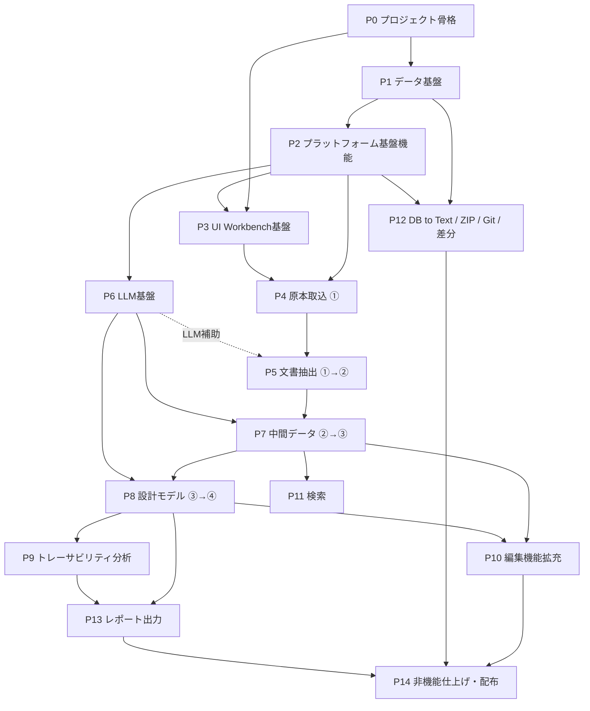

# D2D 実装タスク分割書

## 1. 目的と前提

本書は、`docs/srs.md` および `docs/sdd_*.md` に定義された全機能を、実装順序と依存関係を考慮してタスク分割したものである。

- 対象文書: `srs.md`（要求）、`sdd_function_architecture.md`（機能構成）、`sdd_data_structure.md`（データ構造）、`sdd_directory.md`（ディレクトリ）、`sdd_tech_stack.md`（技術スタック）、`sdd_ui_design.md`（UI/UX）
- 現状: 実装コードなし（docs のみ）。ゼロからの構築。
- 方針: ①原本→②抽出→③中間→④設計モデルのデータフロー順を縦軸に、基盤（プラットフォーム・UI Workbench・LLM）を横断軸として先行構築する。
- 各タスク末尾の `[...]` は対応する SRS ID / SDD 節。§10 の網羅表で全 SRS ID のカバレッジを確認する。

## 2. フェーズ構成と依存関係

- **クリティカルパス**: P0 → P1 → P2 → P3 → P4 → P5(Word) → P7 → P8 → P9
- **並行開発可能**: P6（LLM基盤）は P2 完了後、P5〜P8 と並行可。P12（ZIP/Git/DB to Text）は P1・P2 完了後いつでも可。P5 の形式別抽出（Excel/PPT/PDF/Visio）は Word 完了後に並行可。

---

## 3. P0: プロジェクト骨格

| ID   | タスク                                     | 内容                                                                                                                                         | 依存 | 対応                                 |
| ---- | ------------------------------------------ | -------------------------------------------------------------------------------------------------------------------------------------------- | ---- | ------------------------------------ |
| P0-1 | Electron + electron-vite + React + TS 雛形 | `electron/main`・`electron/preload`・`src/`・`backend/` の 4 領域構成、electron-vite ビルド設定                                              | なし | [APP-001, APP-002, sdd_directory §8] |
| P0-2 | Electron セキュリティ設定                  | `contextIsolation: true`、`nodeIntegration: false`、`sandbox: true`、preload contextBridge（`window.api.*`）、CSP、外部リンク制限            | P0-1 | [sdd_function_architecture §2.2]     |
| P0-3 | Local Backend 別プロセス起動基盤           | Backend エントリポイント、Main からの起動・停止・接続監視、Renderer→Main IPC→Backend の中継経路、基盤APIエラー契約（error_code / retryable） | P0-1 | [sdd_function_architecture §2, §2.3] |
| P0-4 | テスト・開発基盤                           | Vitest（unit/統合）、Playwright（E2E）、pytest（ワーカー）、lint/format、CI 骨格                                                             | P0-1 | [NFR-030, sdd_tech_stack §7]         |
| P0-5 | 依存ライブラリ・ライセンス管理の仕組み     | 依存一覧・ライセンス一覧の自動出力、GPL/AGPL 混入チェック                                                                                    | P0-1 | [NFR-040〜043]                       |

## 4. P1: データ基盤

| ID   | タスク                                     | 内容                                                                                                                                                                                                                                                                                                                                                                                                                                                        | 依存       | 対応                                                               |
| ---- | ------------------------------------------ | ----------------------------------------------------------------------------------------------------------------------------------------------------------------------------------------------------------------------------------------------------------------------------------------------------------------------------------------------------------------------------------------------------------------------------------------------------------- | ---------- | ------------------------------------------------------------------ |
| P1-1 | SQLite スキーマ定義・マイグレーション | schema 2.0.0: 共通台帳、①〜③、②③Resource 9種、13個の `model_*`、`trace_link`、オントロジー4テーブル、LLM・セマンティック・UI補助テーブルのDDL。1.xからの自動移行は行わず旧PJは再作成 | P0-3 | [sdd_data_structure §3〜4, DATA-010, NFR-031] |
| P1-2 | ストアアクセス層                           | better-sqlite3 ラッパー、トランザクション境界、entity_registry 共通台帳アクセス、UUIDv7 `uid` 採番、表示用 `code` 採番（prefix+6桁、再採番禁止）、500ms 超処理の worker_threads 分離方針                                                                                                                                                                                                                                                                    | P1-1       | [EXT-013, sdd_data_structure §2.5, sdd_function_architecture §2.4] |
| P1-3 | プロジェクトルート・ファイルレイアウト管理 | `project.d2d` 生成/読込（相対パスのみ）、`blobs/`（originals/extracted/figures/tables/llm/exports）、`exports/`、`logs/`、`archives/` の生成、`.gitignore`/`.gitattributes` 生成                                                                                                                                                                                                                                                                            | P1-1       | [DATA-005, DATA-006, sdd_directory §2, §4, §7, §9]                 |
| P1-4 | blob_resource 管理                         | DB外ファイルの参照・ハッシュ・MIME・サイズ管理、blob 分類配置ルール（extracted→figures 正規配置昇格）                                                                                                                                                                                                                                                                                                                                                       | P1-2, P1-3 | [sdd_data_structure §2.2]                                          |
| P1-5 | JSON Schema 検証基盤                       | ajv 導入、`backend/schemas/` 構成（ワーカーI/O・LLM構造化出力・候補セット）                                                                                                                                                                                                                                                                                                                                                                                 | P0-3       | [NFR-033]                                                          |
| P1-6 | オントロジー初期データ | 初期版0.1.0、13モデルの日本語定義・独自項目、10関係の日本語定義、関係別のmodel×model許容マトリクスを投入 | P1-1 | [srs §9.2〜9.5] |

## 5. P2: プラットフォーム基盤機能（Local Backend）

| ID   | タスク                      | 内容                                                                                                                                                                                                                                                | 依存       | 対応                                                                       |
| ---- | --------------------------- | --------------------------------------------------------------------------------------------------------------------------------------------------------------------------------------------------------------------------------------------------- | ---------- | -------------------------------------------------------------------------- |
| P2-1 | プロジェクト管理            | プロジェクト作成・オープン・切替、新規作成時の標準5フェーズ・18成果物登録、成果物定義・文書体系（親子関係）・開発フェーズのプロジェクト設定 CRUD                                                                                                                                             | P1-2, P1-3 | [CORE-010〜013, CORE-042, CORE-043]                                        |
| P2-2 | 設定管理                    | アプリ全体/プロジェクト別設定、APIキー・モデル・パス・プロキシ・テーマ・ショートカット・新規プロジェクトのGit初期化切替、safeStorage による機密暗号化保存、機密除外のエクスポート/インポート                                                                                         | P1-3       | [CORE-040〜047, NFR-020]                                                   |
| P2-3 | ジョブ管理                  | ジョブキュー、状態（待機/実行/成功/失敗/部分完了/中断）、進捗通知、ジョブログ保存（`logs/jobs/`）、条件付き再実行、UI分離実行                                                                                                                       | P1-2       | [CORE-020〜024, NFR-003, NFR-011]                                          |
| P2-4 | イベントバス                | イベント発行・購読（project.opened、source.imported、extraction.completed、artifact.updated、intermediate.updated、design_model.updated、relation.updated、ontology.updated、llm.candidate.generated、archive.created/imported、report.generated）、Renderer への通知 | P0-3       | [CORE-030〜032, sdd_function_architecture §9]                              |
| P2-5 | 機能管理                    | 機能単位の登録、機能種別・入出力・設定・権限・対応 schema_version の管理                                                                                                                                                                            | P1-2       | [CORE-001, sdd_function_architecture §3]                                   |
| P2-6 | 外部ワーカー基盤            | Python サブプロセス起動、stdin/stdout JSONL プロトコル（progress/result/error）、`api_key_ref` 解決、UTF-8 強制（PYTHONIOENCODING/PYTHONUTF8）、`D2D_PYTHON` 環境変数、エラー契約変換                                                               | P2-3, P1-5 | [sdd_function_architecture §11.1〜11.2, NFR-032, sdd_tech_stack §5.2〜5.3] |
| P2-7 | 操作単位 API 設計・実装規約 | `importDocument`/`searchElements`/`getTraceSubgraph` 等の操作単位 API 形式の確立、細粒度反復呼び出し禁止、Viewport/ページング分割応答                                                                                                               | P0-3       | [sdd_function_architecture §2, §2.4]                                       |

## 6. P3: UI Workbench 基盤（Renderer）

| ID   | タスク                                          | 内容                                                                                                                                                                        | 依存       | 対応                                                               |
| ---- | ----------------------------------------------- | --------------------------------------------------------------------------------------------------------------------------------------------------------------------------- | ---------- | ------------------------------------------------------------------ |
| P3-1 | Workbench Shell                                 | Activity Bar、Primary/Secondary Side Bar、Panel、Status Bar、Title Barの設定由来D2D版数／project.db schema版数、全体文字サイズ設定、ブラウザ相当のWorkbench表示倍率、抽出／中間編集だけの明示アイコン＋文字／狭幅時アイコンのレスポンシブボタン、各外周パネルおよび抽出／中間／チャンク／Resource編集内ペインの境界ドラッグリサイズと縦横スクロール、Secondary Side Barの縦アコーディオン、Editor Group/タブの左右・上下再帰分割、分割比率変更、タブDnD／Command移動、最大幅省略と多段表示、明示的なタブのピン止め／解除と状態復元、分割時のアクティブGroup枠線／タブ列背景表示、Ctrl+1〜9による画面順Group選択、上部ボタン／Commandによる外周パネル表示切替、Explorer未確定要素数Badge、Activity（Explorer／Search／Trace／Reports／History／Settings）並べ替え・Settings下端固定・選択表示、PrimaryのReview／Jobs廃止、レイアウト保存・復元 | P0-2       | [UI-005, UI-006, UI-021, UI-022, UI-025, UI-026, UI-037〜043, UI-053〜055, UI-059, sdd_ui_design §3, §9〜12] |
| P3-2 | Resource / Command / Selection / Context モデル | Resource URI で開く UX、Command 定義とメニュー/ツールバー/コンテキストメニュー/ショートカット/コマンドパレットからの一貫実行、初期全候補表示・リアルタイム絞込・キー選択スクロール、Selection・Context・Event による有効/無効制御、同一キーを選択領域へ振り分け可能なEditor／下Panelタブの前後移動Command | P3-1       | [UI-003, UI-004, UI-023, UI-024, sdd_ui_design §4]                 |
| P3-3 | テーマ・デザイントークン                        | ダーク/ライト切替、Serendie 5 カラーテーマ（konjo/asagi/sumire/tsutsuji/kurikawa）、@serendie/ui・design-token・symbols 導入、IDE 風コンパクトデザイン、Workbench背景・サーフェス・文字・境界・アクセント・選択・ボタン配色のユーザ個別設定、表示モード／カラーテーマ／OSテーマに追従する未設定時既定色、テーマ既定への復帰 | P3-1       | [UI-001, UI-002, UI-008, UI-027, UI-028, UI-052]                           |
| P3-4 | グリッド・仮想スクロール基盤                    | TanStack Table + Virtual による大量データ一覧、遅延ロード                                                                                                                   | P3-1       | [UI-007, NFR-001]                                                  |
| P3-5 | ジョブ状態 UI                                   | ステータスバー進捗、Job Log Viewer（Panel）、通知、警告表示、ジョブ完了→レビューへの導線、Gitブランチ／upstream同期・PlantUML／MeCab・LLM Provider／外部送信可否・デバッグログレベルのアイコン表示とクリック設定遷移。ステータスバーには作業モード名（Mxx）とResource URIを表示しない                                                                                    | P3-1, P2-3 | [UI-009, sdd_ui_design §6.4]                                       |
| P3-6 | エディタ基盤                                    | Monaco Editor 統合（Markdown/PlantUML/JSON/SQL/ログ）、marked + DOMPurify による Markdown プレビュー                                                                        | P3-1       | [sdd_tech_stack §3]                                                |
| P3-7 | Pipeline Navigator・Perspective                 | セパレータを含む固定順とコンパクト表示の戻る／進む／更新／ホームを備える上部メニューバー、マウス履歴移動、`①原本　抽出▶　②抽出　統合▶　③中間　モデル化▶　④モデル`の件数付きステージボタン、全抽出／全中間／全モデルの汎用分析、用語集、可変幅の検証付きResourceアドレスバー、Alt+Dフォーカス、F5更新、`help`による書式Help、UIDなしschemeの全リンク一覧、Ctrl+T／タブ列＋による空タブ、画面内検索、お気に入りトグル、Explorerのお気に入り保存／名称変更、各ステージ一覧Editorへの遷移、現在ステージだけの選択表示、列ソート、行のクリック／上下キー／Enter／Space操作、①～③の一覧／プレビュー境界リサイズ、①取込・③取込・④追加操作の一覧上部配置、Explorerのプロジェクト名をルートとするVS Code風単一Tree、上下／左右キー操作、プロジェクト行からの全展開／全折畳、成果物配下統合元の折畳、Resource別ファイルアイコン・右端タグ表示、指定フォルダ／成果物だけの右クリック取込、②／③ステージ文書行の右クリック編集                                                                                                              | P3-2       | [UI-046〜048, UI-056〜059, sdd_ui_design §3.1, §5, §6]                                       |
| P3-8 | レビュー UX 共通コンポーネント                  | 対照レビューエディタ、レビューキュー(Inbox)、レビュー状態モデル（未確認/確認済/要修正/棄却）、キーボードトリアージ、一括操作                                                | P3-2, P3-4 | [EXT-022, sdd_ui_design §7]                                        |
| P3-9 | 補助表示（Secondary Side Bar）                  | Workbench共通Selectionに連動するProperties／Relations／Reviewの縦アコーディオン、選択アイテム属性表示、開状態を上・閉状態を下へ配置、trace_linkの関係種別・相対方向・クリック可能な相手一覧、コメントResourceと対象へのrelates_toを同一トランザクションで保存するReview入力・履歴表示 | P3-2       | [UI-026, UI-040, sdd_ui_design §11]                                |
| P3-10 | 共通Help・検索・操作説明                        | ウェルカム画面の設計・トレース作成支援ツール説明、①→④とトレース分析・データスキーマ・設計モデルの視覚Help Resource、全画面の表示中文字列検索、上部メニューバーのアドレスバー右端に置くデスクトップIDE風検索アイコン／Ctrl+F、全操作ボタンのTooltip保証 | P3-1, P3-2 | [UI-049, UI-051, sdd_ui_design §6.3]                               |

## 7. P4: 原本取込（①原本データ）

| ID   | タスク         | 内容                                                                                                                                                                                                                                      | 依存             | 対応                                       |
| ---- | -------------- | ----------------------------------------------------------------------------------------------------------------------------------------------------------------------------------------------------------------------------------------- | ---------------- | ------------------------------------------ |
| P4-1 | 原本インポート | 対象形式（docx/xlsx/pptx/vsdx/PDF/txt/md/csv/tsv/json/jsonl/yaml）の複数ファイル選択（Main OS統合）→ファイルごとの取込Job登録→ SHA-256 ハッシュ計算・同一性管理 → `blobs/originals/<uid>/` へ無改変コピー → source_document / blob_resource / batch_operation_info 登録 | P2-1, P2-3, P1-4 | [IMP-001〜006, IMP-008〜010, srs §3.1] |
| P4-2 | 原本ビュー     | 取込済み原本のソート可能な一覧と読取専用詳細、Windows関連付けアプリでのファイル表示、Pipeline／Explorerの両選択経路でのOS表示・抽出実行、抽出データ存在時の抽出実行無効化、一覧上部からの複数原本取込、一覧からの論理削除・アーカイブ／復元、Explorer ①〜④見出しの強調・折りたたみ、各データ行のプロパティTooltip                                                                                                                                                                     | P3-2, P4-1       | [UI-010, UI-044〜047]                   |

## 8. P5: 文書抽出（①→②抽出データ）

Word を先行実装して抽出パイプライン全体（ワーカー→候補→レビュー→正本保存）を確立し、他形式へ横展開する。

| ID    | タスク                           | 内容                                                                                                                                                                                                                                                                                                                                                                                                          | 依存              | 対応                                                                                            |
| ----- | -------------------------------- | ------------------------------------------------------------------------------------------------------------------------------------------------------------------------------------------------------------------------------------------------------------------------------------------------------------------------------------------------------------------------------------------------------------- | ----------------- | ----------------------------------------------------------------------------------------------- |
| P5-1  | Python ワーカー骨格              | `workers/python/main.py`（JSONL エントリポイント）、commands フレームワーク、pytest + 検証用文書生成スクリプト                                                                                                                                                                                                                                                                                                | P2-6              | [sdd_function_architecture §11, sdd_directory §8]                                               |
| P5-2  | 共通抽出データモデル             | `extracted_document.structure_json` の共通スキーマ、extracted_item ↔ resource_* ↔ source_location の登録処理、抽出器バージョン・原本ハッシュ保持                                                                                                                                                                                                                                                              | P1-2, P5-1        | [DATA-001, DATA-008, EXT-008]                                                                   |
| P5-3  | 抽出要素 ID・履歴管理            | 抽出要素への重複しない ID 付与、編集・マージ・分割時の新 ID 割当、由来 trace_link（based_on + transform_note=merge/split/delete）による元 ID 追跡                                                                                                                                                                                                                                                             | P5-2, P1-6        | [EXT-013〜015, sdd_data_structure §2.6]                                                         |
| P5-4  | Word 抽出ワーカー                | `extract.word`: 見出し階層・段落スタイル・箇条書き階層・表（結合セル）・図/画像・図表番号・キャプション・数式・脚注・コメント・変更履歴・ブックマーク・文書内参照・外部リンク・テキストボックス・ページ相当位置。OpenXML 直接解析 + python-docx 補助                                                                                                                                                          | P5-1, P5-2        | [IMP-001, EXT-001〜008, EXT-016〜018, sdd_function_architecture §11.3, sdd_data_structure §2.7] |
| P5-5  | Word 派生表示生成                | 原本忠実構造データ、レビュー用 Markdown（ページ番号・アンカー付き）、LLM 入力用クリーン Markdown の切替再生成                                                                                                                                                                                                                                                                                                 | P5-4              | [EXT-018, EXT-019]                                                                              |
| P5-6  | 抽出レビュー Editor（共通+Word） | 一覧表示・人間修正・レビュー状態付与・原本/抽出並列表示・アウトライン/プレビュー/Markdown/構造データ/コメント・変更履歴の相互ジャンプ・同期表示・短時間ハイライト、採用確定→②正本保存（project.db + blobs）+ trace_link 登録 + extraction.completed 発行                                                                                                                                                      | P3-8, P5-4, P5-5  | [EXT-020〜026, UI-029, UI-030, sdd_function_architecture §8.2]                                  |
| P5-7  | Excel 抽出                       | `extract.excel`: セル・結合セル・行列構造・シート名位置（openpyxl）                                                                                                                                                                                                                                                                                                                                           | P5-1, P5-2        | [IMP-002, EXT-009]                                                                              |
| P5-8  | PowerPoint 抽出ワーカー          | `extract.pptx`: スライド順・寸法・タイトル・テキスト・図形・コネクタ・画像・表・スピーカーノート、絶対座標（EMU）・回転/反転/テーマカラー等の表示属性、overview PNG。空間読み順の同一行判定閾値は設定化（初期既定値 0.2 行程度、TBD-05 決定）し、設定変更時に読み順・Markdown を再生成できること                                                                                                              | P5-1, P5-2, P2-2  | [IMP-003, EXT-010, EXT-034〜036, sdd_data_structure §2.8]                                       |
| P5-9  | PowerPoint 抽出レビュー Editor   | スライド一覧・プレビュー・透明選択レイヤー（クリック/複数選択）・要素除外・役割補正・グループ化・ノート編集・スライド単位レビュー状態、Markdown/構造データへの即時反映候補、空間読み順 Markdown                                                                                                                                                                                                               | P3-8, P5-8        | [EXT-037〜039, UI-033, UI-034]                                                                  |
| P5-10 | PDF 抽出ワーカー                 | `extract.pdf`: ページ画像・ページ寸法・テキスト・表（bbox・二次元配列・ヘッダー候補）・図/画像・数式・タイトル/キャプション・座標範囲。テキスト・表抽出は pdfplumber、ページ画像レンダリング・bbox クロップ・画像検出は pymupdf を採用（TBD-01 決定: AGPL 版で実装、商用版は P14-6）。読み順の同一行判定閾値は設定化（初期既定値 0.2 行程度、TBD-05 決定）し、設定変更時に読み順・Markdown を再生成できること | P5-1, P5-2, P2-2  | [IMP-005, EXT-012, EXT-027, sdd_data_structure §2.9]                                            |
| P5-11 | PDF 抽出レビュー Editor          | ページ画像上の領域枠の移動・リサイズ・追加・削除・種別変更（ズーム対応）、表エディタ、座標順 Markdown、ページ/文書全体プレビュー切替、警告・同期表示                                                                                                                                                                                                                                                          | P3-8, P5-10       | [EXT-028, EXT-029, EXT-031〜033, UI-031, UI-032]                                                |
| P5-12 | PDF LLM OCR・補正                | 選択領域単位の Vision モデルによる OCR・表 OCR・テキスト補正・数式 LaTeX 化候補生成 → 人間レビュー後反映（専用 OCR エンジン不使用）                                                                                                                                                                                                                                                                           | P5-11, P6-1〜P6-5 | [EXT-030]                                                                                       |
| P5-13 | Visio 抽出                       | `extract.visio`: 図形・接続・ラベル情報（zipfile + XML 直接解析）                                                                                                                                                                                                                                                                                                                                             | P5-1, P5-2        | [IMP-004, EXT-011]                                                                              |
| P5-14 | テキスト系取込・抽出             | txt / Markdown / CSV / TSV / JSON / JSONL / YAML の構造抽出                                                                                                                                                                                                                                                                                                                                                   | P5-1, P5-2        | [IMP-006]                                                                                       |
| P5-15 | 抽出データビュー                 | ②抽出データのソート可能な一覧・独自プレビュー・論理削除・アーカイブ／復元、子要素からの文書単位ステータス集約、原本ファイル名を初期名称とし抽出編集画面で行う表示名称変更、一覧／プレビュー2ペインの境界リサイズ、文書プレビュー／色付き階層 structure_json 表示切替（形式非依存の共通ビュー）                                                                                                                                                                                                                                                                                                                                                                                 | P3-4, P5-2        | [UI-011, UI-046〜047, EXT-040〜041, UI-044〜045]                                                                   |
| P5-16 | 抽出時 LLM 補助（任意経路）      | 見出し判定・読み順・抽出補助の LLM 候補生成経路                                                                                                                                                                                                                                                                                                                                                               | P5-6, P6          | [sdd_function_architecture §8.2 opt]                                                            |
| P5-17 | Word文書情報抽出の高度化 | numbering.xmlに基づくリスト、Run直接書式、DrawingML/VML図形・図形内段落・グループ・コネクタ、Story・フィールド・コメント・変更履歴、Part/Relationship inventory、Raw XML・未対応要素レポート、ZIP/XML安全上限を後方互換の文書構造データへ追加する。詳細と見送りは tasks/P5-17-word-extraction-advanced.md を正とする | P5-4, P5-2 | [EXT-042〜047, sdd_word_extraction] |
| P5-18 | Word抽出情報のプレビュー反映 | Run書式、リスト情報、図形・グループ・コネクタ、Story・フィールド・コメント・変更履歴をExtraction Review Editorの文書プレビューへ反映する。詳細と見送りは tasks/P5-18-word-rich-preview.md を正とする | P5-17, P5-6 | [EXT-048, sdd_word_extraction §3.5] |

## 9. P6: LLM 基盤（共通機能。P2 完了後、P5 と並行可）

| ID   | タスク                     | 内容                                                                                                                                                                 | 依存             | 対応                              |
| ---- | -------------------------- | -------------------------------------------------------------------------------------------------------------------------------------------------------------------- | ---------------- | --------------------------------- |
| P6-1 | LLM Provider クライアント  | OpenAI / Gemini / Ollama / Azure OpenAI の fetch ベース実装（SDK 不使用）、Provider ごとの APIキー・endpoint・model 設定                                             | P2-2             | [LLM-001〜005, sdd_tech_stack §6] |
| P6-2 | LLM 実行ログ管理           | llm_run_ref 登録、送信/応答内容の `blobs/llm/` 保存、モデル・プロンプト・入力チャンク・出力候補の紐づけ、token 使用量・概算コスト・処理時間・エラー記録、APIキー除外 | P6-1, P1-2       | [LLM-010〜016, NFR-021]           |
| P6-3 | プロンプトテンプレート管理 | prompt_template CRUD、バージョン管理、用途分類（抽出/要約/分類/関係候補生成/レビュー支援）、各LLM実行画面での用途別テンプレート選択・実行時編集・新版保存、プロンプト↔出力の対応追跡                                                | P1-2             | [LLM-020〜023, NFR-031]           |
| P6-4 | 安全性・機密制御           | 全LLM問い合わせでジョブ登録前にプロンプト選択・編集、送信先、モデル、マスキング後の全送信内容を確認して明示承認する共通UI、機密情報マスキング、プロジェクト単位の外部送信可否、ローカル LLM 優先モード、再実行時の同一条件確認                                         | P6-1, P2-2       | [LLM-040〜044, NFR-022〜024]      |
| P6-5 | 構造化 JSON 出力検証       | 正規化テキスト・要素候補・関係候補・警告・生成条件を含む構造化 JSON の取得・ajv 検証、パース失敗/スキーマ不一致/未解決参照/許容外関係のエラー化と正本反映ブロック    | P6-1, P1-5       | [LLM-045, LLM-046]                |
| P6-6 | LLM ジョブ統合             | LLM 実行のジョブ化、進捗、キャンセル、llm.candidate.generated イベント                                                                                               | P6-1, P2-3, P2-4 | [CORE-020]                        |
| P6-7 | LLM ログビュー             | 送受信ログの画面表示（Workbench 内）                                                                                                                                 | P3-2, P6-2       | [UI-018, LLM-015]                 |

## 10. P7: 中間データ処理（②→③）

| ID   | タスク                           | 内容                                                                                                                                                                                                  | 依存       | 対応                                                                   |
| ---- | -------------------------------- | ----------------------------------------------------------------------------------------------------------------------------------------------------------------------------------------------------- | ---------- | ---------------------------------------------------------------------- |
| P7-1 | 中間文書生成・統合               | プロジェクト設定画面での開発フェーズ配下の成果物管理、有効化・無効化・関連③を含む物理削除、設定済み成果物のExplorer／③ステージへの取込前表示と選択時の空③生成、③ステージ一覧上部の「取込」から取込先成果物1件とレビュー状態を問わない取込元②複数件を選択し既存関係を初期選択として復元する統合元選択、③ステージでの成果物配下の取込元表示・未使用取込元削除、複数②抽出文書の成果物単位統合、章構成・親子関係・参照関係・段落関係の保持、文書単位およびintermediate_item→extracted_itemのbased_on trace_link自動同期、フェーズ間成果物トレース | P5-6, P2-1 | [MID-001〜003, DATA-002, DATA-009, DATA-018, sdd_data_structure §2.11] |
| P7-2 | 中間データ ID・編集・マージ/分割 | 各情報単位への ID 付与、取込編集／単独編集の画面切替、単独編集の成果物＋プレビュー2ペイン、任意位置追加・Resource複製・削除・item_type表示・ 9 resource種別固有カラム編集・種別変更時の情報消失確認（ラベル／ダブルクリック／Space／Enter起動）、resource://共通Editor Provider、モーダルからEditor Areaへの統合、Resourceアドレスコピー、非連続を含む複数選択の表示順先頭へのマージ・分割と新 ID 割当・②由来追跡、変更元Resource／抽出由来を表示する2ペインResource Editor、左上部の保存前ルール／LLMマージ候補、入出力定義と文書アウトライン文脈を含むLLM送信、③専有Resourceの同種上書き／異種置換と抽出由来・共有Resourceの保護派生をDB参照判定する保存制御、抽出誤り修正の反映 | P7-1, P5-3 | [MID-004, MID-005, EXT-024, EDIT-074〜080] |
| P7-3 | 設計観点別管理 | ②③で使用する9種類のResourceを定義駆動編集し、シナリオ・状態遷移・IF・データ構造等は本文・表・図・モデル記述として保持。全Resourceの管理用特記事項、説明LLM候補、派生Resource関係を扱う | P7-1 | [MID-002, MID-010〜012, MID-020〜024, EDIT-076〜086] |
| P7-4 | 図表説明 LLM 候補                | 図表説明・構造説明の LLM 候補生成→採用/修正/棄却→③正本確定反映                                                                                                                                        | P7-3, P6   | [MID-013, MID-014]                                                     |
| P7-5 | チャンク管理                     | 成果物単位の境界リサイズ可能な3ペインチャンク編集、chunk / chunk_item CRUD、確認済みintermediate_itemとの多対多選択、chunk→intermediate_itemのitem単位based_on、追加プロンプト保持、IDを維持した表示順編集、範囲の相互強調、親子関係なし・一時単位の徹底                              | P7-1       | [MID-030〜034]                                                         |
| P7-6 | 正規化テキスト候補               | ③本文の曖昧性排除・表記揺れ統一・主語補完・用語正規化候補の生成、元範囲との対応・差分・根拠・採用状態の確認                                                                                           | P7-5, P6-5 | [MID-026, MID-027]                                                     |
| P7-7 | 中間データビュー・統合編集       | ③開発フェーズ－成果物のソート可能な一覧・取込・独自プレビュー・論理削除・アーカイブ／復元・同一成果物重複の自動アーカイブ、子要素からの文書単位ステータス集約、「中間データ取込編集画面」の統合元extracted_item／intermediate_item／構造プレビュー3分割と「中間データ単独編集画面」のintermediate_item／構造プレビュー2分割、および同一成果物内で切替える「チャンク編集画面」3分割（各境界をドラッグでリサイズ）、文書プレビュー／色付き階層 structure_json 表示切替、成果物の表／level親子アウトラインTree切替・折畳と右プレビュー同期・抽出／中間プレビューの上下キー移動・プレビュー選択時の一覧中央スクロール、Ctrl/Shift複数選択、統合元の上下キー選択移動、抽出Resource状態表示、extracted_item↔intermediate_itemの多対多based_on・青字取込済み表示・件数表示・対応削除、hover説明付き上下追加・上下統合、階層編集、連続選択移動、状態サイクル、要素レビュー、成果物とプレビューのresource種別ラベル、図表表示、3ペイン対応強調、独立縦横スクロール、Properties同期、マージ/分割、要約作成（LLM）、設計モデルへの反映導線                                  | P3-6, P7-2 | [UI-012, UI-046〜048, MID-007, EDIT-002〜006, EDIT-008, LLM-035]                             |

## 11. P8: 設計モデル（③→④）

| ID   | タスク                    | 内容                                                                                                                                                                                                                         | 依存             | 対応                                                                             |
| ---- | ------------------------- | ---------------------------------------------------------------------------------------------------------------------------------------------------------------------------------------------------------------------------- | ---------------- | -------------------------------------------------------------------------------- |
| P8-1 | 設計モデル管理 | `entity_registry.entity_type` と13個の `model_*` 物理テーブルによる登録・編集。共通情報 + `detail_json` の独自情報、owner_uidとallocated_toを区別。`design_category`は使用しない | P1-2, P1-6 | [MODEL-001〜010, srs §9.1〜9.3] |
| P8-2 | trace_link 関係管理 | 初期10関係と追加関係のCRUD、関係属性、必須属性未入力時の仮値・`creating`状態、`ontology_relation_definition` / `ontology_relation_allowance` による有効性・許容組合せ・重複・循環検査 | P8-1, P1-6 | [MODEL-033〜035, srs §9.4〜9.5, DATA-011, DATA-017] |
| P8-3 | 設計モデル候補生成        | チャンク→LLM による要求/制約/機能/構造/関係候補の生成（要素候補と関係候補の分離、根拠範囲・信頼度・生成プロンプト・レビュー状態の紐づけ）、`generateDesignCandidates` API                                                    | P7-5, P6-5, P6-6 | [MID-025, MID-028, LLM-030〜034, LLM-037, sdd_function_architecture §10.1〜10.2] |
| P8-4 | 候補セットレビュー Editor | `candidate://` Resource、保存前の表形式追加・修正・削除・種別変更、分類接頭辞＋全体連番の一時ID、要素名・分類変更時の関係 From/To 追従、タブ間移動中のメモリ保持、原本と別の一時保存1セット／再開、オントロジー許容マトリクスで許可された関係だけの選択肢、関係必須属性の任意入力・未入力時作成中扱い、許容外LLM初期値の警告、正規化テキスト・要素候補・関係候補・警告・LLM ログ・検証エラーの同期表示                                   | P3-8, P8-3       | [MODEL-007, MODEL-008, MODEL-030, MODEL-031, UI-035, UI-036, LLM-038]                                  |
| P8-5 | 候補採用トランザクション  | 候補セット採用時の同一トランザクション検査（許容関係・重複・未解決参照・根拠リンク不足）、採用時点のDB採番による一時ID→正式code・UUIDv7変換、entity_registry + model_* + trace_link への正本反映、設計要素→生成元チャンクのbased_on、採用/修正/棄却履歴の保存                              | P8-4, P8-2       | [MODEL-006, MODEL-009, MODEL-031, LLM-039, sdd_data_structure §2.10]                        |
| P8-6 | 設計モデルビュー | 有効な `model_*` ごとの作成・更新日時付き一覧、追加後の明示編集、クリック選択、ダブルクリック／Enter遷移、右クリック関係登録と、共通情報・独自情報を定義駆動で編集する個別Editor | P3-4, P8-1 | [MODEL-032, UI-013, UI-046] |
| P8-7 | 設計モデル設定・Help | Settings配下の独立ページで設定方法を示し、モデル／属性／関係の日本語定義、属性のGUI追加・無効化・削除、関係アイコン背景色・表示文字、モデル／関係の有効化・無効化・追加、関係別2次元許容マトリクス、版確定を管理し、Helpを保存済み定義から動的生成 | P8-1, P8-2, P2-2 | [MODEL-019〜029, UI-060〜061] |

## 12. P9: トレーサビリティ・分析

| ID   | タスク                                   | 内容                                                                                                                                        | 依存       | 対応                                          |
| ---- | ---------------------------------------- | ------------------------------------------------------------------------------------------------------------------------------------------- | ---------- | --------------------------------------------- |
| P9-1 | 関係クエリエンジン                       | SQLite 再帰 CTE による双方向トレース探索（上流/下流・関係種別・深さ・方向指定）、深さ・件数上限と段階展開、`getTraceSubgraph` API、索引設計 | P8-2       | [TRACE-001〜003, TRACE-022, NFR-004, NFR-005] |
| P9-2 | 関係クエリ UI・結果出力                  | UI からのクエリ実行、結果の表・階層リスト・グラフ表示、JSON/CSV/Markdown 出力                                                               | P9-1, P3-2 | [TRACE-021, TRACE-023, TRACE-024]             |
| P9-3 | 関係グラフビュー                         | SVG + React 自前実装（力学レイアウト・階層表示）、起点要素からの指定ホップ数強調・減衰表示、フィルタ・レイアウト切替                        | P9-1       | [UI-016, TRACE-025]                           |
| P9-4 | 汎用トレースマトリクスEditor             | 設計分類／②文書／③成果物／チャンク／Resource種別から複数Resource集合を行列へ配置し、設定済みの有効・無効全関係種別、設定駆動アイコン、必須属性入力、複数関係種別の色分け表示、転置、固定見出し、ズーム、Tooltip、十字強調、行／列／セル複数選択、方向指定による単一トグル・一括追加／論理削除、固有URIでの複数タブ表示を提供する | P9-1, P3-4, P8-2 | [UI-014, TRACE-026〜029, TRACE-038, TRACE-040〜043]                      |
| P9-5 | 汎用インパクト分析ビュー                 | チャンクを含む任意の複数Resource集合を持つ列を左右へ追加・DnD並替えし、見出しドラッグによる列間隔調整と外側列の連動移動、列別スクロール、全列組合せの方向・関係種別リンク、リンク表示ON/OFF、クリック／上下キー／Shift複数選択とSecondary連携、全列への連鎖強調、関連項目限定表示、階層折畳と親リンク集約、Tooltip、表示領域限定リンク描画、プロジェクト別の名前付き構成保存・復元、固有URIでの複数タブ表示を提供する | P9-1, P3-4 | [UI-015, TRACE-030〜040]                      |
| P9-6 | 整合性検査（双方向トレーサビリティ分析） | 未接続・不整合・根拠不足・粒度不一致・循環・過剰な relates_to 利用の検出、修正候補/レポート提示、検証未対応要求・検証カバレッジ             | P9-1       | [srs §2.3 検査, EDIT-043, EDIT-044, NFR-010]  |

## 13. P10: 編集機能拡充

| ID    | タスク                    | 内容                                                                                                                                                                                                                                                          | 依存            | 対応                                     |
| ----- | ------------------------- | ------------------------------------------------------------------------------------------------------------------------------------------------------------------------------------------------------------------------------------------------------------- | --------------- | ---------------------------------------- |
| P10-1 | Markdown エディタ拡張     | 独自 Markdown エディタ（Monaco ベース）、用語ハイライト、差分表示、フォント装飾、表示モード切替、設計要素リンク埋め込み                                                                                                                                       | P3-6            | [EDIT-010〜015]                          |
| P10-2 | 表グリッド編集            | 構造化表編集（Excel 完全互換にしない）、Resource Editor上のスプレッドシートUI、ヘッダ・全セルのセマンティック編集、行/列/セル ID 付与（resource_table_cell 別テーブル、TBD-04 決定）、表全体・セル単位の設計根拠利用                                                                                                                     | P3-4, P7-3      | [EDIT-022〜025]                          |
| P10-3 | 図編集・モデル表現        | 図情報表示・編集、構造図・状態遷移図・関係グラフ、PlantUML / SysMLv2 テキストのレンダリング（TBD-02 決定: GPL 版 PlantUML をツールとして利用し、Java ランタイム・Graphviz を同梱。同梱物の配置・起動は P14-5 と連携）、モデル表記と要素 ID 対応表のセット管理 | P3-6, P8-1      | [EDIT-020, EDIT-021, FORM-001, FORM-002] |
| P10-4 | 状態遷移編集              | 状態一覧・遷移一覧・遷移条件/イベント/アクション編集、状態遷移図表示、簡易シミュレーション、未到達状態・未定義遷移・競合遷移検出                                                                                                                              | P8-1, P10-3     | [EDIT-030〜035]                          |
| P10-5 | 検証編集                  | 検証項目編集、検証対象（要求/制約/機能）紐づけ、検証条件・手順・期待結果管理                                                                                                                                                                                  | P8-1, P8-2      | [EDIT-040〜042]                          |
| P10-6 | 用語集                    | 用語・略語・定義・同義語・禁止語管理（resource_glossary/synonym）、文書中用語候補抽出（LLM 含む）、揺れ検出、文書・設計要素とのリンク、②③④各時点での選択テキストからの登録、承認済み用語のエディタハイライト・定義参照                                        | P8-1, P6, P10-1 | [EDIT-050〜056, LLM-036]                 |
| P10-7 | セマンティック入力支援 | 表示文／原文／構造化参照／正規化履歴の分離、Ctrl+Space補完、用語候補／用語候補(LLM)、非選択時プレビュー／選択時インライン編集、編集ボタンで開く左右2ペインのMarkdown Monaco編集／複数行プレビュー／構造化データ／校正・正規化(LLM)差分、Monacoコピー＆ペースト、セマンティック編集のEditor Area統合なし、最前面Escape制御、文書アウトライン文脈のLLM自動補完 | P8-1, P8-2, P10-6, P11-1 | [EDIT-057〜091, LLM-036] |
| P10-8 | Undo/Redo・破壊的変更確認 | 編集操作の Undo/Redo、破壊的変更前の確認ダイアログ                                                                                                                                                                                                            | P3-2            | [NFR-012, NFR-013]                       |

## 14. P11: 検索

| ID    | タスク                  | 内容                                                                                                                                                                    | 依存             | 対応                  |
| ----- | ----------------------- | ----------------------------------------------------------------------------------------------------------------------------------------------------------------------- | ---------------- | --------------------- |
| P11-1 | MeCab 前処理・FTS5 索引 | MeCab + UniDic 標準構成による分かち書き（TBD-03 決定。Windows 優先、同梱またはパス設定）、辞書のユーザ追加機構（追加辞書の登録・切替設定）、FTS5 検索本文登録・索引更新、原本／抽出文書／中間文書への配下要素Resource本文の包含、MeCab未使用時のFTS＋NFKC全文部分一致併合 | P1-2, P7-1, P2-2 | [SEARCH-001, NFR-004] |
| P11-2 | 検索 UI                 | タイトル・本文・用語・レビュー記録の日本語全文検索、MeCab処理時間の注意表示、code/uid検索、Search Activity内のResource種別グループTree、件数連動の初期折畳、上下／左右キー操作・選択追従スクロール、選択連動プレビュー、結果からの文書内要素選択・スクロール・強調                                                                         | P11-1, P3-2      | [SEARCH-001〜003]     |

## 15. P12: DB to Text / ZIP / Git / 差分（P1・P2 完了後いつでも並行可）

| ID    | タスク             | 内容                                                                                                                                                                                                         | 依存               | 対応                                         |
| ----- | ------------------ | ------------------------------------------------------------------------------------------------------------------------------------------------------------------------------------------------------------ | ------------------ | -------------------------------------------- |
| P12-1 | DB to Text         | ②③④の DB 内容を安定順序でテキスト化（`exports/db_to_text/*.jsonl`）、要素一覧・関係一覧・トレースマトリクスの Markdown/CSV/TSV/JSONL 出力、成果物単位フィルタ、保存/差分確認からの Hook 呼び出し、正本非置換 | P1-2               | [DATA-020〜024, DATA-001, DATA-002, GIT-001] |
| P12-2 | SQLite dump 出力   | schema.sql / data.sql 出力（調査・履歴参照用）                                                                                                                                                               | P1-2               | [sdd_directory §2]                           |
| P12-3 | ZIP アーカイブ生成 | 成果物セットの ZIP 化（adm-zip）、manifest 生成（schema_version・作成日時・原本ハッシュ・抽出器バージョン・成果物一覧・ファイル役割識別）、`archives/` 配置、archive.created イベント                        | P1-3, P2-3         | [DATA-003, DATA-004, DATA-030, DATA-033]     |
| P12-4 | ZIP 差分インポート | ZIP の一時領域展開・manifest 検査・正本非上書き、現在正本/DB to Text との差分比較                                                                                                                            | P12-3, P12-1       | [DATA-007, DATA-031, DATA-032, NFR-014]      |
| P12-5 | Git操作・履歴参照   | simple-gitによる状態確認、変更ファイルのHEAD対Monaco Diff、ステージ／解除、コミット、ローカルブランチ作成／切替、履歴の1件対最新／2件間比較。コミット直前にDB to Text＋SQLite dumpを再生成して必ず同一コミットへ含める | P1-3, P12-1, P12-2 | [GIT-001〜007]                               |
| P12-6 | Diff ビュー        | テキスト/JSONL 差分表示（Monaco diff）、DB to Textのテーブル／UID／code／title／entity_type／変更フィールドによる項目単位差分、過去版の設計要素・関係・トレースマトリクス比較、Git 履歴参照ビュー                                                                                                   | P3-6, P12-1, P12-5 | [UI-017, UI-019, GIT-005, GIT-006, EDIT-012] |
| P12-7 | ストア閲覧ビュー   | SQLite DB・JSON/JSONL の全件追加読込・行番号・横スクロール・行選択・Secondary連携                                                                                                                                                                           | P3-4               | [UI-020]                                     |

## 16. P13: レポート・出力

| ID    | タスク               | 内容                                                                                                                                                                                                       | 依存             | 対応               |
| ----- | -------------------- | ---------------------------------------------------------------------------------------------------------------------------------------------------------------------------------------------------------- | ---------------- | ------------------ |
| P13-1 | レポート生成エンジン | ②③④からの文書風レポート・一覧・関係情報の構築（②原本由来情報、③本文・章構成・図表・参照、④要素・関係）、成果物 ID/章/節/設計観点/情報種別/レビュー状態/設計要素によるフィルタ、範囲・表示/非表示・形式選択 | P7-1, P8-1, P9-1 | [EXP-001〜004]     |
| P13-2 | Markdown / HTML 出力 | 出力形式実装、report.generated イベント、LLM 要約候補の組み込み（任意）                                                                                                                                    | P13-1            | [EXP-005, EXP-006] |

## 17. P14: 非機能仕上げ・配布

| ID    | タスク                       | 内容                                                                                                                                                                                                                                                 | 依存  | 対応                                              |
| ----- | ---------------------------- | ---------------------------------------------------------------------------------------------------------------------------------------------------------------------------------------------------------------------------------------------------- | ----- | ------------------------------------------------- |
| P14-1 | 性能チューニング             | NFR-005 目標値の実測・改善（一覧初期描画 1 秒、深さ 5 探索 3 秒、取込〜候補表示 100 ページ/分、10 万要素・30 万リンク）、Index 見直し                                                                                                                | 全体  | [NFR-001, NFR-003〜005]                           |
| P14-2 | オフライン・ローカル動作確認 | オフラインでの①〜④閲覧・編集、外部 LLM 利用可否制御、閉域動作                                                                                                                                                                                        | P6-4  | [APP-004〜006]                                    |
| P14-3 | ログ・障害解析               | ジョブ失敗時の途中状態・エラー確認、障害解析可能なログ整備                                                                                                                                                                                           | P2-3  | [NFR-011, NFR-034]                                |
| P14-4 | 残 TBD 解決・ライセンス確定  | TBD-06（マイグレーション詳細）・TBD-07（GraphDB 移行判断）・TBD-08（採番競合）の判断、UniDic および追加辞書の再配布条件確認、フォント・テンプレート再配布条件確認、依存・ライセンス一覧出力（pymupdf=AGPL、PlantUML=GPL、Java/Graphviz 同梱を明記）  | P0-5  | [NFR-040〜044, docs/tbd_register.md]              |
| P14-5 | パッケージング・配布         | electron-builder（Windows インストーラ、@electron/rebuild）、PyInstaller（d2d-worker.exe、extraResources 配置）、Java ランタイム・Graphviz・PlantUML jar の同梱（TBD-02 決定）、MeCab + UniDic の同梱（TBD-03 決定）、macOS/Linux を妨げない構成確認 | 全体  | [APP-001, APP-002, FORM-001, sdd_tech_stack §5.4] |
| P14-6 | 商用利用向け版の作成         | ツール完成後の別エディション（TBD-01 決定）: pymupdf を商用ライセンス版または代替ライブラリへ差し替え、GPL/AGPL 構成の再審査、商用版ライセンス一覧の再生成・配布物構成の分離                                                                         | P14-5 | [NFR-040〜043, TBD-01]                            |

---

## 18. マイルストーン案

UI 設計書の作業モード M1〜M5 に対応させた区切り。

| マイルストーン                  | 含むフェーズ                   | 動くもの                                                                            |
| ------------------------------- | ------------------------------ | ----------------------------------------------------------------------------------- |
| **MS1: 骨格・基盤**             | P0〜P3                         | アプリ起動、プロジェクト作成/オープン、Workbench シェル、ジョブ・イベント・設定基盤 |
| **MS2: 取込・抽出（M1）**       | P4、P5（Word 先行→他形式）、P6 | 原本取込→Word 抽出→レビュー→②正本保存。LLM 基盤並行構築                             |
| **MS3: 統合（M2）**             | P7                             | ②→③統合、中間データ編集、チャンク、正規化テキスト候補                               |
| **MS4: モデル化（M3）**         | P8                             | LLM 候補生成→候補セットレビュー→④正本反映                                           |
| **MS5: トレース・分析（M4）**   | P9                             | 関係クエリ、グラフ/マトリクス、整合性検査                                           |
| **MS6: 履歴・差分・出力（M5）** | P10〜P13                       | 編集機能拡充、検索、DB to Text / ZIP / Git 差分、レポート                           |
| **MS7: リリース準備**           | P14                            | 性能・非機能・ライセンス・配布                                                      |

P12（DB to Text / ZIP / Git）は正本スキーマ（P1）が安定した時点から前倒し可能であり、MS2〜MS4 の開発中の差分確認手段としても有用なため、早期着手を推奨する。

---

## 19. SRS 要求 ID カバレッジ表

| SRS ID 範囲              | 担当タスク                                  |
| ------------------------ | ------------------------------------------- |
| APP-001〜002             | P0-1, P14-5                                 |
| APP-003                  | P1-1〜P1-4, P12-3                           |
| APP-004〜006             | P14-2, P6-4                                 |
| CORE-001                 | P2-5                                        |
| CORE-010〜013            | P2-1                                        |
| CORE-020〜024            | P2-3                                        |
| CORE-030〜032            | P2-4                                        |
| CORE-040〜047            | P2-2                                        |
| DATA-001, 001A, 002      | P5-2, P12-1, P12-3                          |
| DATA-003〜004            | P12-3                                       |
| DATA-005〜006            | P1-3                                        |
| DATA-007                 | P12-4                                       |
| DATA-008                 | P5-2                                        |
| DATA-009, 018            | P7-1                                        |
| DATA-010〜011, 017       | P1-1, P8-2                                  |
| DATA-020〜024            | P12-1                                       |
| DATA-030〜033            | P12-3, P12-4                                |
| IMP-001〜006, 008〜010   | P4-1（形式別抽出は P5-4/7/8/10/13/14）      |
| EXT-001〜008             | P5-4（Word 起点、各形式ワーカーで共通適用） |
| EXT-009                  | P5-7                                        |
| EXT-010                  | P5-8                                        |
| EXT-011                  | P5-13                                       |
| EXT-012                  | P5-10                                       |
| EXT-013〜015             | P5-3                                        |
| EXT-016〜019             | P5-4, P5-5                                  |
| EXT-020〜026             | P5-6                                        |
| EXT-027〜029, 031        | P5-10, P5-11                                |
| EXT-030                  | P5-12                                       |
| EXT-032〜033             | P5-11                                       |
| EXT-034〜037             | P5-8, P5-9                                  |
| EXT-038〜039             | P5-9                                        |
| EXT-040〜041             | P5-15                                       |
| EXT-042〜047             | P5-17                                       |
| EXT-048                 | P5-18                                       |
| MID-001〜007             | P7-1, P7-2, P7-7                                  |
| MID-010〜014             | P7-3, P7-4                                  |
| MID-020〜024             | P7-3                                        |
| MID-025, 028             | P8-3                                        |
| MID-026〜027             | P7-6                                        |
| MID-030〜034             | P7-5                                        |
| MODEL-001〜005           | P8-1                                        |
| MODEL-019〜029, 035      | P8-7                                        |
| MODEL-030〜034           | P8-2, P8-4〜P8-6                            |
| MODEL-006〜009           | P8-4, P8-5                                  |
| TRACE-001〜003, 021〜022 | P9-1, P9-2                                  |
| TRACE-023〜024           | P9-2                                        |
| TRACE-025                | P9-3                                        |
| TRACE-026〜029, 041〜043 | P9-4                                        |
| TRACE-030〜039           | P9-5                                        |
| EDIT-002〜006, 008       | P7-7                                        |
| EDIT-010〜015            | P10-1（差分表示は P12-6 と連携）            |
| EDIT-020〜025            | P10-2, P10-3                                |
| EDIT-030〜035            | P10-4                                       |
| EDIT-040〜042            | P10-5                                       |
| EDIT-043〜044            | P9-6                                        |
| EDIT-050〜056            | P10-6                                       |
| EDIT-057〜086            | P10-7                                       |
| LLM-001〜005             | P6-1                                        |
| LLM-010〜016             | P6-2                                        |
| LLM-020〜023             | P6-3                                        |
| LLM-030〜034, 037        | P8-3                                        |
| LLM-035                  | P7-7                                        |
| LLM-036                  | P10-6                                       |
| LLM-038〜039             | P8-4, P8-5                                  |
| LLM-040〜044             | P6-4                                        |
| LLM-045〜046             | P6-5                                        |
| UI-001〜008              | P3-1〜P3-4                                  |
| UI-009                   | P3-5                                        |
| UI-010                   | P4-2                                        |
| UI-011                   | P5-15                                       |
| UI-012                   | P7-7                                        |
| UI-013                   | P8-6                                        |
| UI-014〜016              | P9-3〜P9-5                                  |
| UI-017, 019              | P12-6                                       |
| UI-018                   | P6-7                                        |
| UI-020                   | P12-7                                       |
| UI-021〜026              | P3-1, P3-2, P3-9                            |
| UI-027〜028              | P3-3                                        |
| UI-029〜030              | P5-6                                        |
| UI-031〜032              | P5-11, P5-12                                |
| UI-033〜034              | P5-9                                        |
| UI-035〜036              | P8-4                                        |
| UI-060〜061              | P8-7                                        |
| UI-037〜043              | P3-1                                        |
| UI-044〜047              | P3-7, P4-2, P5-15, P7-7, P8-6                                 |
| UI-048〜059              | P3-1, P3-2, P3-3, P3-5, P3-7, P3-10, P7-7     |
| SEARCH-001〜003          | P11-1, P11-2                                |
| EXP-001〜006             | P13-1, P13-2                                |
| GIT-001〜007             | P12-1, P12-5, P12-6                         |
| FORM-001〜002            | P10-3                                       |
| NFR-001, 003〜005        | P3-4, P2-3, P9-1, P14-1                     |
| NFR-010                  | P5-3, P7-2, P8-5, P9-6                      |
| NFR-011                  | P2-3, P14-3                                 |
| NFR-012〜013             | P10-8                                       |
| NFR-014                  | P12-4                                       |
| NFR-020〜024             | P2-2, P6-2, P6-4                            |
| NFR-030                  | P0-4                                        |
| NFR-031                  | P1-1, P6-3                                  |
| NFR-032                  | P2-6                                        |
| NFR-033                  | P1-5                                        |
| NFR-034                  | P14-3                                       |
| NFR-040〜044             | P0-5, P14-4, P14-6                          |

欠番 ID（IMP-007、EXT なし、TRACE-020、EDIT-001/007、CLI-001〜008、NFR-002）は対象外。

---

## 20. リスク・先行判断事項

TBD-01〜05 は決定済み（2026-07-08、`docs/tbd_register.md` 参照）。決定内容は各タスクへ反映済み。

| 項目                                          | 内容                                                                                                                                                                            | 影響タスク         |
| --------------------------------------------- | ------------------------------------------------------------------------------------------------------------------------------------------------------------------------------- | ------------------ |
| GPL/AGPL 構成での配布（TBD-01/02 決定に伴う） | 開発版は pymupdf（AGPL）+ PlantUML（GPL）+ Java/Graphviz 同梱で構成する。配布物全体のライセンス表記・ソース提供義務の整理が必要。商用利用向け版は P14-6 で pymupdf を差し替える | P0-5, P14-4, P14-6 |
| 同梱物によるインストーラ肥大                  | Java ランタイム + Graphviz + MeCab/UniDic の同梱でインストーラサイズが大きくなる。同梱方式（extraResources 構成・辞書の選択インストール）を P14-5 前に設計する                  | P14-5              |
| better-sqlite3 同期 API                       | 長時間クエリの UI ブロック。P1-2 時点で worker_threads 分離の設計を確立しておく                                                                                                 | P1-2, P9-1         |
| 関係グラフ SVG 自前実装                       | 力学レイアウトの実装コストが高い。P9-3 は最小レイアウト→段階改善を推奨                                                                                                          | P9-3               |
| Word 先行の横展開                             | P5-2/P5-3 の共通抽出データモデルの出来が他形式（PPT/PDF）の工数を左右する。Word 実装時に形式固有ロジックを混入させない                                                          | P5 全体            |
| 同一行判定閾値の再生成導線                    | 閾値変更時の読み順・Markdown 再生成は、②正本を直接上書きせず再抽出候補として提示する設計を P5-8/P5-10 で確立する                                                                | P5-8〜P5-11, P2-2  |
